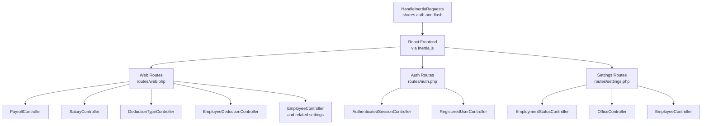
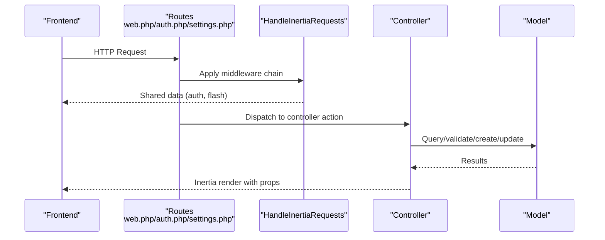
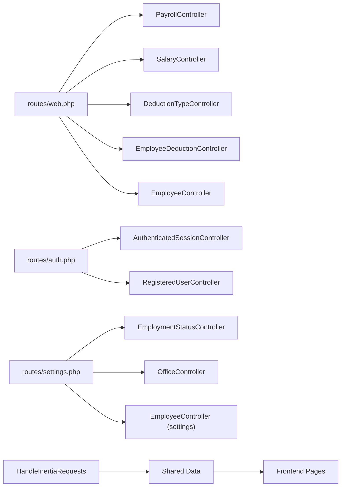

# API Documentation

<cite>
**Referenced Files in This Document**
- [routes/web.php](file://routes/web.php)
- [routes/auth.php](file://routes/auth.php)
- [routes/settings.php](file://routes/settings.php)
- [app/Http/Middleware/HandleInertiaRequests.php](file://app/Http/Middleware/HandleInertiaRequests.php)
- [app/Http/Controllers/PayrollController.php](file://app/Http/Controllers/PayrollController.php)
- [app/Http/Controllers/SalaryController.php](file://app/Http/Controllers/SalaryController.php)
- [app/Http/Controllers/DeductionTypeController.php](file://app/Http/Controllers/DeductionTypeController.php)
- [app/Http/Controllers/EmployeeDeductionController.php](file://app/Http/Controllers/EmployeeDeductionController.php)
- [app/Http/Controllers/EmployeeController.php](file://app/Http/Controllers/EmployeeController.php)
- [app/Http/Controllers/EmploymentStatusController.php](file://app/Http/Controllers/EmploymentStatusController.php)
- [app/Http/Controllers/OfficeController.php](file://app/Http/Controllers/OfficeController.php)
- [app/Http/Controllers/Auth/AuthenticatedSessionController.php](file://app/Http/Controllers/Auth/AuthenticatedSessionController.php)
- [app/Http/Controllers/Auth/RegisteredUserController.php](file://app/Http/Controllers/Auth/RegisteredUserController.php)
- [config/auth.php](file://config/auth.php)
</cite>

## Table of Contents
1. [Introduction](#introduction)
2. [Project Structure](#project-structure)
3. [Core Components](#core-components)
4. [Architecture Overview](#architecture-overview)
5. [Detailed Component Analysis](#detailed-component-analysis)
6. [Dependency Analysis](#dependency-analysis)
7. [Performance Considerations](#performance-considerations)
8. [Troubleshooting Guide](#troubleshooting-guide)
9. [Conclusion](#conclusion)
10. [Appendices](#appendices)

## Introduction
This document describes the Laravel backend API endpoints consumed by the React frontend via Inertia.js. It covers HTTP routes, request/response patterns, authentication, authorization, and Inertia.js rendering semantics. The backend exposes RESTful-style endpoints under the following primary domains:
- Payroll processing
- Salaries
- PERA contributions
- RATA contributions
- Deduction types
- Employee deductions
- Settings: Employment statuses, Offices, Employees

All authenticated routes are protected by the session-based guard. Authentication endpoints are provided for registration, login, logout, and password reset flows.

## Project Structure
The backend uses Inertia.js to render pages server-side while maintaining a traditional Laravel controller architecture. Routes are grouped by domain and protected by an auth middleware. Shared data (such as the current user and flash messages) is injected into every Inertia response via a dedicated middleware.

**Diagram sources**
- [routes/web.php:1-99](file://routes/web.php#L1-L99)
- [routes/auth.php:1-57](file://routes/auth.php#L1-L57)
- [routes/settings.php:1-22](file://routes/settings.php#L1-L22)
- [app/Http/Middleware/HandleInertiaRequests.php:1-55](file://app/Http/Middleware/HandleInertiaRequests.php#L1-L55)
- [app/Http/Controllers/PayrollController.php:1-125](file://app/Http/Controllers/PayrollController.php#L1-L125)
- [app/Http/Controllers/SalaryController.php:1-74](file://app/Http/Controllers/SalaryController.php#L1-L74)
- [app/Http/Controllers/DeductionTypeController.php:1-55](file://app/Http/Controllers/DeductionTypeController.php#L1-L55)
- [app/Http/Controllers/EmployeeDeductionController.php:1-108](file://app/Http/Controllers/EmployeeDeductionController.php#L1-L108)
- [app/Http/Controllers/EmployeeController.php:1-125](file://app/Http/Controllers/EmployeeController.php#L1-L125)
- [app/Http/Controllers/EmploymentStatusController.php:1-58](file://app/Http/Controllers/EmploymentStatusController.php#L1-L58)
- [app/Http/Controllers/OfficeController.php:1-61](file://app/Http/Controllers/OfficeController.php#L1-L61)
- [app/Http/Controllers/Auth/AuthenticatedSessionController.php:1-52](file://app/Http/Controllers/Auth/AuthenticatedSessionController.php#L1-L52)
- [app/Http/Controllers/Auth/RegisteredUserController.php:1-52](file://app/Http/Controllers/Auth/RegisteredUserController.php#L1-L52)

**Section sources**
- [routes/web.php:1-99](file://routes/web.php#L1-L99)
- [routes/auth.php:1-57](file://routes/auth.php#L1-L57)
- [routes/settings.php:1-22](file://routes/settings.php#L1-L22)
- [app/Http/Middleware/HandleInertiaRequests.php:1-55](file://app/Http/Middleware/HandleInertiaRequests.php#L1-L55)

## Core Components
- Authentication and Authorization
  - Guard: session-based ("web")
  - Provider: Eloquent user provider
  - Password broker and reset policies configured
- Inertia.js Integration
  - Root template configured
  - Shared data: app name, inspirational quote, authenticated user, flash messages
- Controllers
  - PayrollController: lists employees with computed pay/deductions, shows employee pay details
  - SalaryController: manages salary records (create/delete)
  - DeductionTypeController: CRUD for deduction types
  - EmployeeDeductionController: CRUD for employee-specific deductions with period scoping
  - EmployeeController: CRUD for employees and related metadata
  - EmploymentStatusController: CRUD for employment statuses
  - OfficeController: CRUD for offices
  - Auth controllers: registration, login/logout, password reset

**Section sources**
- [config/auth.php:1-116](file://config/auth.php#L1-L116)
- [app/Http/Middleware/HandleInertiaRequests.php:1-55](file://app/Http/Middleware/HandleInertiaRequests.php#L1-L55)
- [app/Http/Controllers/PayrollController.php:1-125](file://app/Http/Controllers/PayrollController.php#L1-L125)
- [app/Http/Controllers/SalaryController.php:1-74](file://app/Http/Controllers/SalaryController.php#L1-L74)
- [app/Http/Controllers/DeductionTypeController.php:1-55](file://app/Http/Controllers/DeductionTypeController.php#L1-L55)
- [app/Http/Controllers/EmployeeDeductionController.php:1-108](file://app/Http/Controllers/EmployeeDeductionController.php#L1-L108)
- [app/Http/Controllers/EmployeeController.php:1-125](file://app/Http/Controllers/EmployeeController.php#L1-L125)
- [app/Http/Controllers/EmploymentStatusController.php:1-58](file://app/Http/Controllers/EmploymentStatusController.php#L1-L58)
- [app/Http/Controllers/OfficeController.php:1-61](file://app/Http/Controllers/OfficeController.php#L1-L61)
- [app/Http/Controllers/Auth/AuthenticatedSessionController.php:1-52](file://app/Http/Controllers/Auth/AuthenticatedSessionController.php#L1-L52)
- [app/Http/Controllers/Auth/RegisteredUserController.php:1-52](file://app/Http/Controllers/Auth/RegisteredUserController.php#L1-L52)

## Architecture Overview
The backend follows a layered architecture:
- Routes define entry points and groupings
- Controllers orchestrate requests, apply validation, and prepare data for Inertia pages
- Models encapsulate persistence and relationships
- Middleware injects shared data for the frontend

**Diagram sources**
- [routes/web.php:1-99](file://routes/web.php#L1-L99)
- [routes/auth.php:1-57](file://routes/auth.php#L1-L57)
- [routes/settings.php:1-22](file://routes/settings.php#L1-L22)
- [app/Http/Middleware/HandleInertiaRequests.php:1-55](file://app/Http/Middleware/HandleInertiaRequests.php#L1-L55)
- [app/Http/Controllers/PayrollController.php:1-125](file://app/Http/Controllers/PayrollController.php#L1-L125)
- [app/Http/Controllers/SalaryController.php:1-74](file://app/Http/Controllers/SalaryController.php#L1-L74)
- [app/Http/Controllers/DeductionTypeController.php:1-55](file://app/Http/Controllers/DeductionTypeController.php#L1-L55)
- [app/Http/Controllers/EmployeeDeductionController.php:1-108](file://app/Http/Controllers/EmployeeDeductionController.php#L1-L108)
- [app/Http/Controllers/EmployeeController.php:1-125](file://app/Http/Controllers/EmployeeController.php#L1-L125)
- [app/Http/Controllers/EmploymentStatusController.php:1-58](file://app/Http/Controllers/EmploymentStatusController.php#L1-L58)
- [app/Http/Controllers/OfficeController.php:1-61](file://app/Http/Controllers/OfficeController.php#L1-L61)
- [app/Http/Controllers/Auth/AuthenticatedSessionController.php:1-52](file://app/Http/Controllers/Auth/AuthenticatedSessionController.php#L1-L52)
- [app/Http/Controllers/Auth/RegisteredUserController.php:1-52](file://app/Http/Controllers/Auth/RegisteredUserController.php#L1-L52)

## Detailed Component Analysis

### Authentication Endpoints
- Registration
  - Method: POST
  - Path: /register
  - Purpose: Create a new user account
  - Validation: Name, email, password confirmation, password policy
  - Response: Redirects to dashboard after login
- Login
  - Method: POST
  - Path: /login
  - Purpose: Authenticate and establish session
  - Response: Redirects to dashboard
- Logout
  - Method: POST
  - Path: /logout
  - Purpose: Invalidate session and redirect home
- Password Reset (initiate/reset)
  - Methods: GET/POST to /forgot-password and /reset-password/{token}
  - Purpose: Send reset link and set new password
  - Security: Signed verification links with throttling

Notes:
- All authentication routes are guarded by guest middleware except logout, which requires auth.
- Session-based authentication is used via the "web" guard.

**Section sources**
- [routes/auth.php:13-56](file://routes/auth.php#L13-L56)
- [app/Http/Controllers/Auth/RegisteredUserController.php:16-50](file://app/Http/Controllers/Auth/RegisteredUserController.php#L16-L50)
- [app/Http/Controllers/Auth/AuthenticatedSessionController.php:14-50](file://app/Http/Controllers/Auth/AuthenticatedSessionController.php#L14-L50)
- [config/auth.php:38-100](file://config/auth.php#L38-L100)

### Payroll Endpoints
- List employees with computed pay and deductions
  - Method: GET
  - Path: /payroll
  - Query params:
    - month (integer, default current month)
    - year (integer, default current year)
    - office_id (optional)
    - search (optional)
  - Response: Paginated employees with latest salary/pera/rata and deductions for the selected period; available offices for filtering
- View employee payroll details
  - Method: GET
  - Path: /payroll/{employee}
  - Query params:
    - month (integer, default current month)
    - year (integer, default current year)
  - Response: Employee profile, salary/pera/rata histories, and deductions for the selected period

Processing logic:
- Aggregates latest salary/pera/rata per employee
- Filters deductions by pay period (month/year)
- Computes gross pay and net pay per employee

**Section sources**
- [routes/web.php:25-29](file://routes/web.php#L25-L29)
- [app/Http/Controllers/PayrollController.php:13-123](file://app/Http/Controllers/PayrollController.php#L13-L123)

### Salaries Endpoints
- List employees with latest salary
  - Method: GET
  - Path: /salaries
  - Query params:
    - search (optional)
  - Response: Paginated employees with latest salary and related metadata
- Salary history for an employee
  - Method: GET
  - Path: /salaries/history/{employee}
  - Response: Employee and salary history ordered by effective date
- Add a new salary
  - Method: POST
  - Path: /salaries
  - Body: employee_id, amount, effective_date
  - Response: Success message via flash
- Delete a salary record
  - Method: DELETE
  - Path: /salaries/{salary}
  - Response: Success message via flash

Validation and behavior:
- Amount must be numeric and non-negative
- Effective date must be a valid date
- Created_by is set to the authenticated user

**Section sources**
- [routes/web.php:31-37](file://routes/web.php#L31-L37)
- [app/Http/Controllers/SalaryController.php:13-73](file://app/Http/Controllers/SalaryController.php#L13-L73)

### PERA Endpoints
- List PERA records
  - Method: GET
  - Path: /peras
  - Response: Index view (no API payload)
- PERA history for an employee
  - Method: GET
  - Path: /peras/history/{employee}
  - Response: Employee and PERA history
- Add a new PERA
  - Method: POST
  - Path: /peras
  - Body: employee_id, amount, effective_date
  - Response: Success message via flash
- Delete a PERA record
  - Method: DELETE
  - Path: /peras/{pera}
  - Response: Success message via flash

Validation and behavior:
- Same validation rules as salaries (amount, effective_date)
- Created_by is set to the authenticated user

**Section sources**
- [routes/web.php:39-45](file://routes/web.php#L39-L45)
- [app/Http/Controllers/SalaryController.php:49-73](file://app/Http/Controllers/SalaryController.php#L49-L73)

### RATA Endpoints
- List RATA records
  - Method: GET
  - Path: /ratas
  - Response: Index view (no API payload)
- RATA history for an employee
  - Method: GET
  - Path: /ratas/history/{employee}
  - Response: Employee and RATA history
- Add a new RATA
  - Method: POST
  - Path: /ratas
  - Body: employee_id, amount, effective_date
  - Response: Success message via flash
- Delete a RATA record
  - Method: DELETE
  - Path: /ratas/{rata}
  - Response: Success message via flash

Validation and behavior:
- Same validation rules as salaries (amount, effective_date)
- Created_by is set to the authenticated user

**Section sources**
- [routes/web.php:47-53](file://routes/web.php#L47-L53)
- [app/Http/Controllers/SalaryController.php:49-73](file://app/Http/Controllers/SalaryController.php#L49-L73)

### Deduction Types Endpoints
- List deduction types
  - Method: GET
  - Path: /deduction-types
  - Response: Active deduction types
- Create a deduction type
  - Method: POST
  - Path: /deduction-types
  - Body: name, code, description, is_active
  - Response: Success message via flash
- Update a deduction type
  - Method: PUT
  - Path: /deduction-types/{deductionType}
  - Body: name, code, description, is_active
  - Response: Success message via flash
- Delete a deduction type
  - Method: DELETE
  - Path: /deduction-types/{deductionType}
  - Response: Success message via flash

Validation and behavior:
- Code uniqueness enforced
- Boolean flag controls activity

**Section sources**
- [routes/web.php:55-61](file://routes/web.php#L55-L61)
- [app/Http/Controllers/DeductionTypeController.php:11-53](file://app/Http/Controllers/DeductionTypeController.php#L11-L53)

### Employee Deductions Endpoints
- List employees with deductions for a period
  - Method: GET
  - Path: /employee-deductions
  - Query params:
    - month (integer, default current month)
    - year (integer, default current year)
    - office_id (optional)
    - search (optional)
  - Response: Paginated employees with latest salary/pera/rata and deductions for the selected period; available deduction types
- Create an employee deduction
  - Method: POST
  - Path: /employee-deductions
  - Body: employee_id, deduction_type_id, amount, pay_period_month, pay_period_year, notes
  - Response: Success message via flash
  - Duplicate prevention: Prevents adding the same deduction type for the same employee in the same pay period
- Update an employee deduction
  - Method: PUT
  - Path: /employee-deductions/{employeeDeduction}
  - Body: amount, notes
  - Response: Success message via flash
- Delete an employee deduction
  - Method: DELETE
  - Path: /employee-deductions/{employeeDeduction}
  - Response: Success message via flash

Validation and behavior:
- Month must be 1–12, year within a reasonable range
- Amount must be numeric and non-negative
- Created_by is set to the authenticated user

**Section sources**
- [routes/web.php:63-69](file://routes/web.php#L63-L69)
- [app/Http/Controllers/EmployeeDeductionController.php:14-106](file://app/Http/Controllers/EmployeeDeductionController.php#L14-L106)

### Settings Management Endpoints
- Employment Statuses
  - List: GET /settings/employment-statuses
  - Create: POST /settings/employment-statuses
  - Update: PUT /settings/employment-statuses/{employmentStatus}
  - Delete: DELETE /settings/employment-statuses/{employmentStatus}
- Offices
  - List: GET /settings/offices
  - Create: POST /settings/offices
  - Update: PUT /settings/offices/{office}
  - Delete: DELETE /settings/offices/{office}
- Employees
  - List: GET /settings/employees
  - Create: POST /settings/employees
  - Show: GET /settings/employees/{employee}
  - Update: PUT /settings/employees/{employee}
  - Delete: DELETE /settings/employees/{employee}

Validation and behavior:
- Employment status and office names are unique
- Employee photo upload supported (image, max size, allowed formats)
- Employment status and office associations validated

**Section sources**
- [routes/web.php:71-94](file://routes/web.php#L71-L94)
- [app/Http/Controllers/EmploymentStatusController.php:11-56](file://app/Http/Controllers/EmploymentStatusController.php#L11-L56)
- [app/Http/Controllers/OfficeController.php:11-59](file://app/Http/Controllers/OfficeController.php#L11-L59)
- [app/Http/Controllers/EmployeeController.php:14-123](file://app/Http/Controllers/EmployeeController.php#L14-L123)

### Inertia.js Integration and Rendering
- Root template: app.blade.php
- Shared data:
  - Application name
  - Inspirational quote
  - Authenticated user
  - Flash messages (success/error)
- Responses:
  - Controllers return Inertia::render with page name and props
  - Pagination preserves query string parameters

**Section sources**
- [app/Http/Middleware/HandleInertiaRequests.php:18-52](file://app/Http/Middleware/HandleInertiaRequests.php#L18-L52)
- [routes/web.php:16-18](file://routes/web.php#L16-L18)
- [routes/settings.php:18-20](file://routes/settings.php#L18-L20)

### Authentication Methods, Authorization, and Security
- Authentication method: Session-based (web guard)
- Authorization: All authenticated routes are protected by the auth middleware
- Security considerations:
  - Password reset tokens with expiration and throttling
  - Signed email verification links with rate limits
  - Strong password validation during registration
  - CSRF protection via Laravel session middleware
  - Input validation on all mutating endpoints

**Section sources**
- [config/auth.php:38-100](file://config/auth.php#L38-L100)
- [routes/auth.php:37-56](file://routes/auth.php#L37-L56)
- [app/Http/Controllers/Auth/AuthenticatedSessionController.php:30-36](file://app/Http/Controllers/Auth/AuthenticatedSessionController.php#L30-L36)
- [app/Http/Controllers/Auth/RegisteredUserController.php:33-43](file://app/Http/Controllers/Auth/RegisteredUserController.php#L33-L43)

### Error Handling, Status Codes, and Response Validation
- HTTP status codes:
  - Successful operations typically return redirects with flash messages
  - Validation failures lead to redirect back with error messages
- Response validation:
  - All mutating endpoints include server-side validation
  - Duplicate prevention for employee deductions
- Flash messaging:
  - Success and error messages are exposed to the frontend via shared data

**Section sources**
- [app/Http/Controllers/SalaryController.php:49-73](file://app/Http/Controllers/SalaryController.php#L49-L73)
- [app/Http/Controllers/EmployeeDeductionController.php:54-106](file://app/Http/Controllers/EmployeeDeductionController.php#L54-L106)
- [app/Http/Middleware/HandleInertiaRequests.php:48-51](file://app/Http/Middleware/HandleInertiaRequests.php#L48-L51)

### Examples of API Usage and Client-Side Integration Patterns
- Fetch payroll list with filters:
  - Endpoint: GET /payroll?month={n}&year={yyyy}&office_id={id}&search={term}
  - Client pattern: Use fetch or Inertia form helpers; preserve query string for pagination
- Add a salary:
  - Endpoint: POST /salaries
  - Payload: { employee_id, amount, effective_date }
  - Client pattern: Submit via form; handle success flash and reload page
- Manage employee deductions:
  - Endpoint: POST /employee-deductions
  - Payload: { employee_id, deduction_type_id, amount, pay_period_month, pay_period_year, notes }
  - Client pattern: Validate locally; submit; handle duplicate detection feedback
- Settings CRUD:
  - Endpoints: /settings/employment-statuses, /settings/offices, /settings/employees
  - Client pattern: Use Inertia forms; handle unique constraint errors and image uploads

[No sources needed since this section provides general usage patterns]

## Dependency Analysis

**Diagram sources**
- [routes/web.php:1-99](file://routes/web.php#L1-L99)
- [routes/auth.php:1-57](file://routes/auth.php#L1-L57)
- [routes/settings.php:1-22](file://routes/settings.php#L1-L22)
- [app/Http/Middleware/HandleInertiaRequests.php:1-55](file://app/Http/Middleware/HandleInertiaRequests.php#L1-L55)
- [app/Http/Controllers/PayrollController.php:1-125](file://app/Http/Controllers/PayrollController.php#L1-L125)
- [app/Http/Controllers/SalaryController.php:1-74](file://app/Http/Controllers/SalaryController.php#L1-L74)
- [app/Http/Controllers/DeductionTypeController.php:1-55](file://app/Http/Controllers/DeductionTypeController.php#L1-L55)
- [app/Http/Controllers/EmployeeDeductionController.php:1-108](file://app/Http/Controllers/EmployeeDeductionController.php#L1-L108)
- [app/Http/Controllers/EmployeeController.php:1-125](file://app/Http/Controllers/EmployeeController.php#L1-L125)
- [app/Http/Controllers/EmploymentStatusController.php:1-58](file://app/Http/Controllers/EmploymentStatusController.php#L1-L58)
- [app/Http/Controllers/OfficeController.php:1-61](file://app/Http/Controllers/OfficeController.php#L1-L61)
- [app/Http/Controllers/Auth/AuthenticatedSessionController.php:1-52](file://app/Http/Controllers/Auth/AuthenticatedSessionController.php#L1-L52)
- [app/Http/Controllers/Auth/RegisteredUserController.php:1-52](file://app/Http/Controllers/Auth/RegisteredUserController.php#L1-L52)

**Section sources**
- [routes/web.php:1-99](file://routes/web.php#L1-L99)
- [routes/auth.php:1-57](file://routes/auth.php#L1-L57)
- [routes/settings.php:1-22](file://routes/settings.php#L1-L22)
- [app/Http/Middleware/HandleInertiaRequests.php:1-55](file://app/Http/Middleware/HandleInertiaRequests.php#L1-L55)

## Performance Considerations
- Pagination is used across list endpoints to limit payload sizes.
- Eager loading of related models reduces N+1 queries.
- Filtering by pay period and office reduces dataset size for payroll-related queries.
- Recommendations:
  - Add database indexes on frequently filtered columns (e.g., office_id, effective_date).
  - Consider caching deduction types and office lists if they change infrequently.
  - Use query string preservation for pagination to avoid unnecessary reloads.

[No sources needed since this section provides general guidance]

## Troubleshooting Guide
- Authentication failures
  - Ensure session cookies are enabled and not blocked by browser policies.
  - Verify the "web" guard is active and the user provider is configured.
- Validation errors
  - On POST/PUT endpoints, check required fields and constraints (uniqueness, numeric ranges).
  - For employee photos, confirm allowed formats and size limits.
- Duplicate deduction entries
  - The backend prevents duplicate deductions for the same employee and deduction type in the same pay period; handle the returned error message in the frontend.
- Flash messages not visible
  - Confirm that the shared data middleware is registered and that the frontend reads the flash.success and flash.error values.

**Section sources**
- [config/auth.php:38-100](file://config/auth.php#L38-L100)
- [app/Http/Controllers/EmployeeDeductionController.php:65-74](file://app/Http/Controllers/EmployeeDeductionController.php#L65-L74)
- [app/Http/Middleware/HandleInertiaRequests.php:48-51](file://app/Http/Middleware/HandleInertiaRequests.php#L48-L51)

## Conclusion
The backend provides a cohesive set of RESTful endpoints grouped by domain, secured via session-based authentication, and rendered via Inertia.js. Controllers centralize validation and data preparation, while middleware ensures consistent shared state for the frontend. The documented endpoints and patterns enable reliable client-side integration for employee management, payroll processing, deduction handling, and settings administration.

[No sources needed since this section summarizes without analyzing specific files]

## Appendices

### Endpoint Reference Summary
- Payroll
  - GET /payroll
  - GET /payroll/{employee}
- Salaries
  - GET /salaries
  - GET /salaries/history/{employee}
  - POST /salaries
  - DELETE /salaries/{salary}
- PERA
  - GET /peras
  - GET /peras/history/{employee}
  - POST /peras
  - DELETE /peras/{pera}
- RATA
  - GET /ratas
  - GET /ratas/history/{employee}
  - POST /ratas
  - DELETE /ratas/{rata}
- Deduction Types
  - GET /deduction-types
  - POST /deduction-types
  - PUT /deduction-types/{deductionType}
  - DELETE /deduction-types/{deductionType}
- Employee Deductions
  - GET /employee-deductions
  - POST /employee-deductions
  - PUT /employee-deductions/{employeeDeduction}
  - DELETE /employee-deductions/{employeeDeduction}
- Settings
  - Employment Statuses: GET/POST/PUT/DELETE /settings/employment-statuses
  - Offices: GET/POST/PUT/DELETE /settings/offices
  - Employees: GET/POST/PUT/DELETE /settings/employees
- Authentication
  - POST /register
  - POST /login
  - POST /logout
  - GET/POST /forgot-password
  - GET/POST /reset-password/{token}

[No sources needed since this section provides a summary]