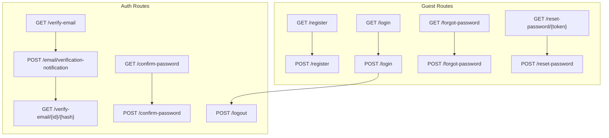
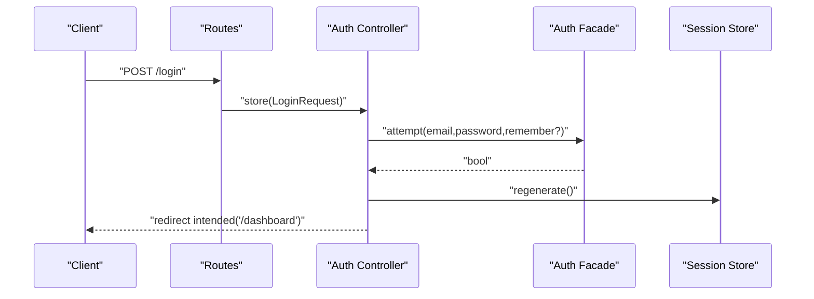
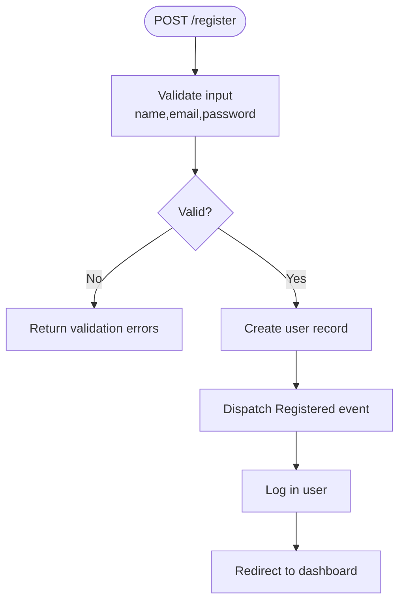
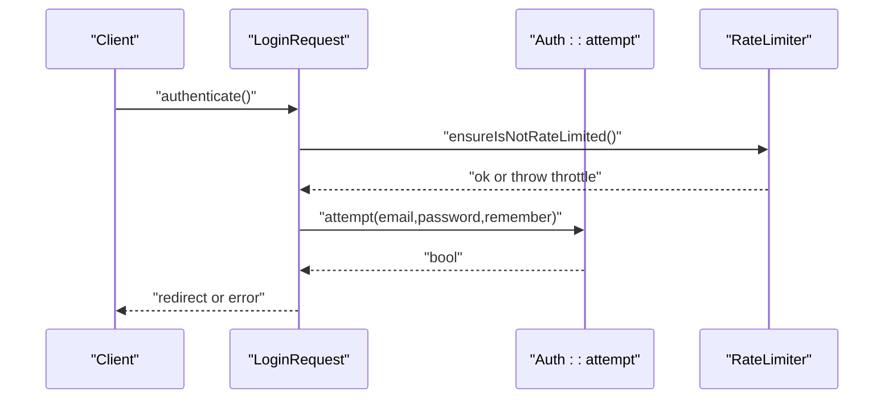
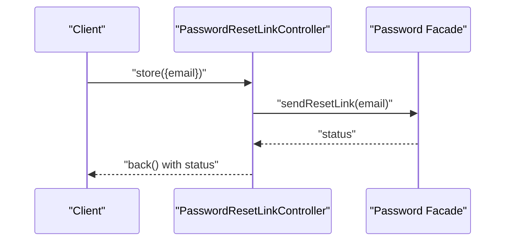
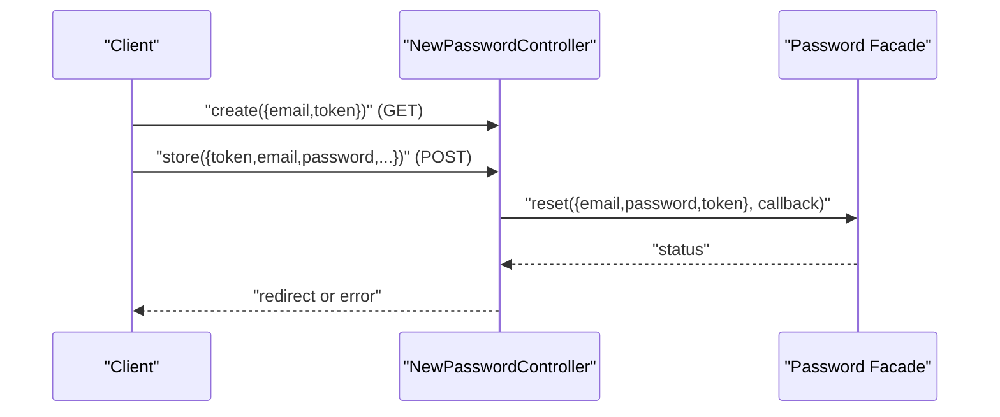
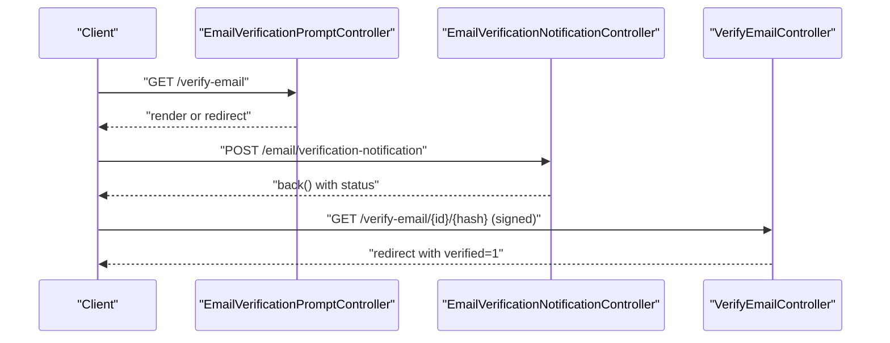
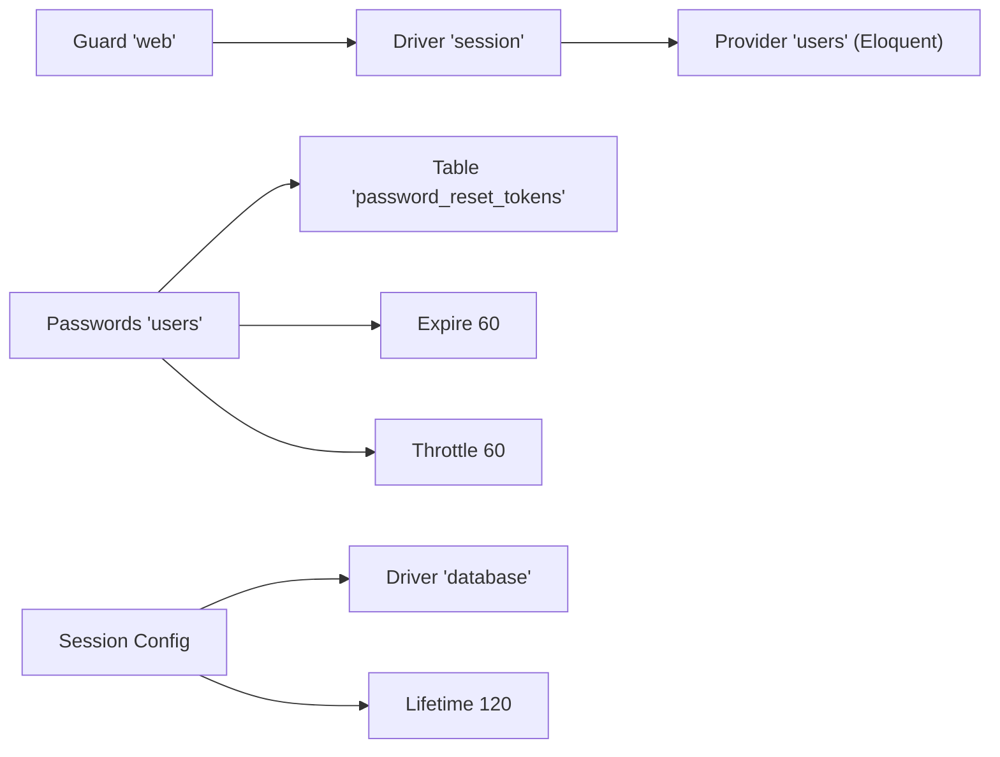

# Authentication API

<cite>
**Referenced Files in This Document**
- [routes/auth.php](file://routes/auth.php)
- [AuthenticatedSessionController.php](file://app/Http/Controllers/Auth/AuthenticatedSessionController.php)
- [RegisteredUserController.php](file://app/Http/Controllers/Auth/RegisteredUserController.php)
- [PasswordResetLinkController.php](file://app/Http/Controllers/Auth/PasswordResetLinkController.php)
- [NewPasswordController.php](file://app/Http/Controllers/Auth/NewPasswordController.php)
- [VerifyEmailController.php](file://app/Http/Controllers/Auth/VerifyEmailController.php)
- [EmailVerificationNotificationController.php](file://app/Http/Controllers/Auth/EmailVerificationNotificationController.php)
- [EmailVerificationPromptController.php](file://app/Http/Controllers/Auth/EmailVerificationPromptController.php)
- [ConfirmablePasswordController.php](file://app/Http/Controllers/Auth/ConfirmablePasswordController.php)
- [LoginRequest.php](file://app/Http/Requests/Auth/LoginRequest.php)
- [auth.php](file://config/auth.php)
- [session.php](file://config/session.php)
</cite>

## Table of Contents
1. [Introduction](#introduction)
2. [Project Structure](#project-structure)
3. [Core Components](#core-components)
4. [Architecture Overview](#architecture-overview)
5. [Detailed Component Analysis](#detailed-component-analysis)
6. [Dependency Analysis](#dependency-analysis)
7. [Performance Considerations](#performance-considerations)
8. [Troubleshooting Guide](#troubleshooting-guide)
9. [Conclusion](#conclusion)

## Introduction
This document provides comprehensive API documentation for the authentication endpoints in a Laravel application. It covers login, registration, email verification, password reset, and logout functionality. The documentation details request/response schemas, authentication methods, security considerations, session-based authentication flow, token handling, middleware protection, validation rules, and client-side integration patterns.

## Project Structure
The authentication routes are grouped by middleware:
- Guest-only routes: registration, login, forgot-password, reset-password
- Auth-only routes: verify-email, resend verification notification, confirm-password, logout

**Diagram sources**
- [routes/auth.php:13-56](file://routes/auth.php#L13-L56)

**Section sources**
- [routes/auth.php:1-57](file://routes/auth.php#L1-L57)

## Core Components
- Session-based authentication using the "web" guard with Eloquent provider
- Rate limiting for login attempts and password reset notifications
- Email verification with signed links and throttling
- Password reset using tokens with expiration and throttling
- Password confirmation for sensitive actions

**Section sources**
- [auth.php:38-43](file://config/auth.php#L38-L43)
- [auth.php:93-99](file://config/auth.php#L93-L99)
- [session.php:21-36](file://config/session.php#L21-L36)

## Architecture Overview
The authentication system uses Inertia.js for server-rendered pages and redirects for state transitions. Middleware enforces guest vs. authenticated access. Sessions are stored in the configured driver (default database).

**Diagram sources**
- [routes/auth.php:22](file://routes/auth.php#L22)
- [AuthenticatedSessionController.php:30-37](file://app/Http/Controllers/Auth/AuthenticatedSessionController.php#L30-L37)
- [LoginRequest.php:40-53](file://app/Http/Requests/Auth/LoginRequest.php#L40-L53)

## Detailed Component Analysis

### Registration Endpoint
- Method: POST /register
- Controller: RegisteredUserController@store
- Request validation:
  - name: required, string, max length
  - email: required, string, lowercase, email, unique users
  - password: required, confirmed, follows Password::defaults rules
- Behavior:
  - Creates user with hashed password
  - Dispatches Registered event
  - Logs in the user
  - Redirects to dashboard

**Diagram sources**
- [RegisteredUserController.php:31-49](file://app/Http/Controllers/Auth/RegisteredUserController.php#L31-L49)

**Section sources**
- [routes/auth.php:17](file://routes/auth.php#L17)
- [RegisteredUserController.php:1-52](file://app/Http/Controllers/Auth/RegisteredUserController.php#L1-L52)

### Login Endpoint
- Method: POST /login
- Controller: AuthenticatedSessionController@store
- Request validation: LoginRequest
  - email: required, string, email
  - password: required, string
- Security:
  - Rate limiting: 5 attempts, then lockout with seconds/minutes in message
  - Throttle key combines normalized email and IP
- Behavior:
  - Attempts authentication with optional remember flag
  - Regenerates session ID
  - Redirects to intended URL (dashboard)

**Diagram sources**
- [LoginRequest.php:40-76](file://app/Http/Requests/Auth/LoginRequest.php#L40-L76)
- [AuthenticatedSessionController.php:30-37](file://app/Http/Controllers/Auth/AuthenticatedSessionController.php#L30-L37)

**Section sources**
- [routes/auth.php:22](file://routes/auth.php#L22)
- [AuthenticatedSessionController.php:1-52](file://app/Http/Controllers/Auth/AuthenticatedSessionController.php#L1-L52)
- [LoginRequest.php:1-86](file://app/Http/Requests/Auth/LoginRequest.php#L1-L86)

### Forgot Password Endpoint
- Method: POST /forgot-password
- Controller: PasswordResetLinkController@store
- Request validation:
  - email: required, email
- Behavior:
  - Sends password reset link via Password broker
  - Returns with status message

**Diagram sources**
- [PasswordResetLinkController.php:29-40](file://app/Http/Controllers/Auth/PasswordResetLinkController.php#L29-L40)

**Section sources**
- [routes/auth.php:27](file://routes/auth.php#L27)
- [PasswordResetLinkController.php:1-42](file://app/Http/Controllers/Auth/PasswordResetLinkController.php#L1-L42)

### Reset Password Endpoint
- Method: GET /reset-password/{token}, POST /reset-password
- Controller: NewPasswordController
- GET: Renders reset form with email and token
- POST: Validates token, email, password (confirmed, strong), resets password
- Behavior:
  - Uses Password broker to reset
  - On success: redirects to login with status
  - On failure: throws validation error mapped to status

**Diagram sources**
- [NewPasswordController.php:22-68](file://app/Http/Controllers/Auth/NewPasswordController.php#L22-L68)

**Section sources**
- [routes/auth.php:30-34](file://routes/auth.php#L30-L34)
- [NewPasswordController.php:1-70](file://app/Http/Controllers/Auth/NewPasswordController.php#L1-L70)

### Email Verification
- Prompt: GET /verify-email
  - Controller: EmailVerificationPromptController
  - If already verified: redirect to dashboard
  - Else: render verify-email page
- Resend Notification: POST /email/verification-notification
  - Controller: EmailVerificationNotificationController
  - If verified: redirect to dashboard
  - Else: send verification notification
- Verify Link: GET /verify-email/{id}/{hash}
  - Controller: VerifyEmailController
  - Signed link middleware and throttle:6,1
  - Marks email as verified and fires Verified event

**Diagram sources**
- [EmailVerificationPromptController.php:16-21](file://app/Http/Controllers/Auth/EmailVerificationPromptController.php#L16-L21)
- [EmailVerificationNotificationController.php:14-23](file://app/Http/Controllers/Auth/EmailVerificationNotificationController.php#L14-L23)
- [VerifyEmailController.php:15-29](file://app/Http/Controllers/Auth/VerifyEmailController.php#L15-L29)

**Section sources**
- [routes/auth.php:38-47](file://routes/auth.php#L38-L47)
- [EmailVerificationPromptController.php:1-23](file://app/Http/Controllers/Auth/EmailVerificationPromptController.php#L1-L23)
- [EmailVerificationNotificationController.php:1-25](file://app/Http/Controllers/Auth/EmailVerificationNotificationController.php#L1-L25)
- [VerifyEmailController.php:1-31](file://app/Http/Controllers/Auth/VerifyEmailController.php#L1-L31)

### Confirm Password
- Method: POST /confirm-password
- Controller: ConfirmablePasswordController@store
- Purpose: Re-authenticate user for sensitive actions
- Behavior:
  - Validates current password against authenticated user
  - Stores confirmation timestamp in session
  - Redirects to intended URL

**Section sources**
- [routes/auth.php:52](file://routes/auth.php#L52)
- [ConfirmablePasswordController.php:1-42](file://app/Http/Controllers/Auth/ConfirmablePasswordController.php#L1-L42)

### Logout
- Method: POST /logout
- Controller: AuthenticatedSessionController@destroy
- Behavior:
  - Logs out current user
  - Invalidates session
  - Regenerates CSRF token
  - Redirects to home

**Section sources**
- [routes/auth.php:54](file://routes/auth.php#L54)
- [AuthenticatedSessionController.php:42-50](file://app/Http/Controllers/Auth/AuthenticatedSessionController.php#L42-L50)

## Dependency Analysis
- Authentication guard "web" uses session driver with Eloquent user provider
- Password reset configuration uses "users" broker with table "password_reset_tokens", 60-minute expiry, 60-second throttle
- Session configuration supports database driver with configurable lifetime and cookie policies

**Diagram sources**
- [auth.php:38-43](file://config/auth.php#L38-L43)
- [auth.php:93-99](file://config/auth.php#L93-L99)
- [session.php:21-36](file://config/session.php#L21-L36)

**Section sources**
- [auth.php:1-116](file://config/auth.php#L1-L116)
- [session.php:1-218](file://config/session.php#L1-L218)

## Performance Considerations
- Session lifetime: 120 minutes; adjust based on security and UX needs
- Rate limiting: Login attempts limited to prevent brute force; reset link sending throttled
- Token expiry: Password reset tokens expire after 60 minutes
- Database sessions: Ensure proper indexing on sessions table for performance

## Troubleshooting Guide
Common error scenarios and handling:
- Login throttling: Excessive failed attempts trigger lockout messages with seconds/minutes
- Invalid credentials: Validation error for email field with generic "auth.failed" message
- Password reset failures: Throws validation error mapped to status returned by Password broker
- Already verified email: Verification controller detects existing verification and redirects appropriately
- Unauthenticated access: Auth routes require authenticated session; guest routes reject authenticated users

**Section sources**
- [LoginRequest.php:60-76](file://app/Http/Requests/Auth/LoginRequest.php#L60-L76)
- [LoginRequest.php:40-53](file://app/Http/Requests/Auth/LoginRequest.php#L40-L53)
- [NewPasswordController.php:61-67](file://app/Http/Controllers/Auth/NewPasswordController.php#L61-L67)
- [VerifyEmailController.php:17-19](file://app/Http/Controllers/Auth/VerifyEmailController.php#L17-L19)

## Conclusion
The authentication system provides a robust, session-based flow with comprehensive validation, rate limiting, and security measures. It integrates seamlessly with Inertia.js for server-rendered pages while maintaining standard HTTP semantics suitable for client-side consumption. The documented endpoints, schemas, and behaviors enable reliable client-side integration and predictable error handling.