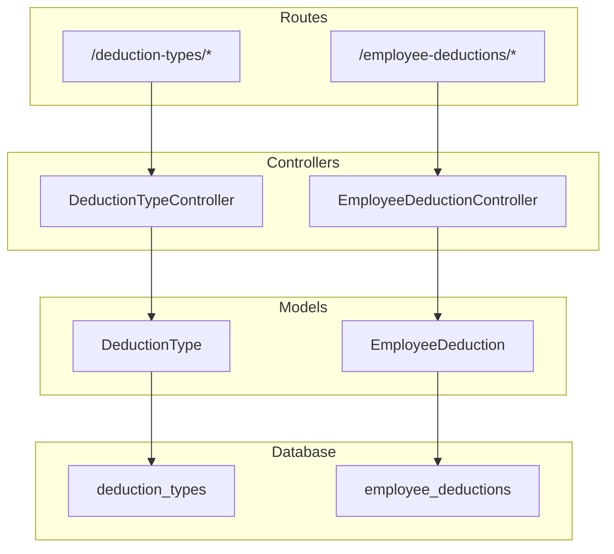
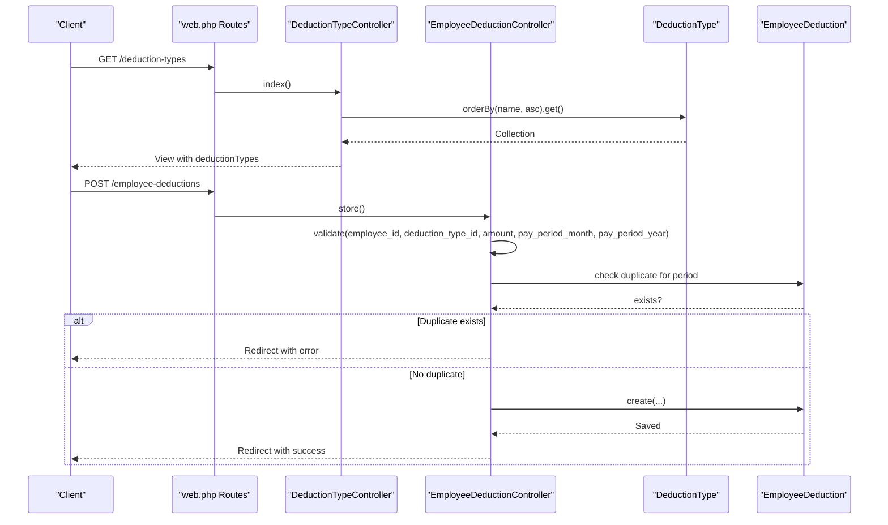
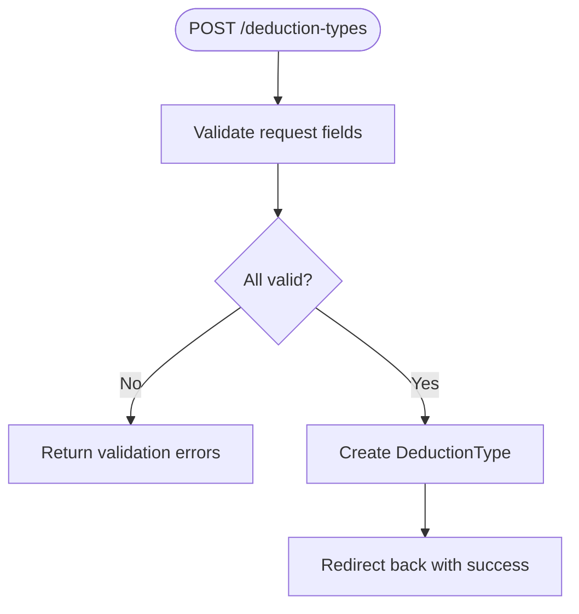
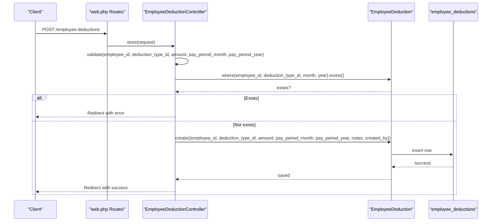
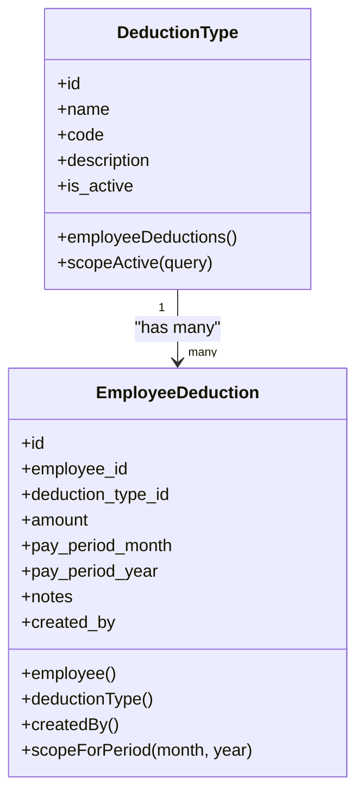
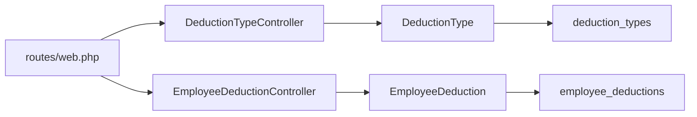

# Deduction Management API

<cite>
**Referenced Files in This Document**
- [DeductionTypeController.php](file://app/Http/Controllers/DeductionTypeController.php)
- [EmployeeDeductionController.php](file://app/Http/Controllers/EmployeeDeductionController.php)
- [DeductionType.php](file://app/Models/DeductionType.php)
- [EmployeeDeduction.php](file://app/Models/EmployeeDeduction.php)
- [2026_03_22_115110_create_deduction_types_table.php](file://database/migrations/2026_03_22_115110_create_deduction_types_table.php)
- [2026_03_22_115112_create_employee_deductions_table.php](file://database/migrations/2026_03_22_115112_create_employee_deductions_table.php)
- [web.php](file://routes/web.php)
</cite>

## Table of Contents
1. [Introduction](#introduction)
2. [Project Structure](#project-structure)
3. [Core Components](#core-components)
4. [Architecture Overview](#architecture-overview)
5. [Detailed Component Analysis](#detailed-component-analysis)
6. [Dependency Analysis](#dependency-analysis)
7. [Performance Considerations](#performance-considerations)
8. [Troubleshooting Guide](#troubleshooting-guide)
9. [Conclusion](#conclusion)

## Introduction
This document provides comprehensive API documentation for the deduction management system. It covers deduction types management and employee-specific deduction tracking, detailing CRUD operations, validation rules, business logic, and the relationship between deduction types and employee-specific deductions. The deduction hierarchy and calculation implications are explained, along with request parameters for creation, updates, and deletions.

## Project Structure
The deduction management system consists of:
- Controllers for deduction types and employee deductions
- Eloquent models representing deduction types and employee deductions
- Database migrations defining schema and constraints
- Routes exposing REST endpoints under dedicated prefixes

**Diagram sources**
- [web.php:55-69](file://routes/web.php#L55-L69)
- [DeductionTypeController.php:1-55](file://app/Http/Controllers/DeductionTypeController.php#L1-L55)
- [EmployeeDeductionController.php:1-108](file://app/Http/Controllers/EmployeeDeductionController.php#L1-L108)
- [DeductionType.php:1-33](file://app/Models/DeductionType.php#L1-L33)
- [EmployeeDeduction.php:1-59](file://app/Models/EmployeeDeduction.php#L1-L59)
- [2026_03_22_115110_create_deduction_types_table.php:1-32](file://database/migrations/2026_03_22_115110_create_deduction_types_table.php#L1-L32)
- [2026_03_22_115112_create_employee_deductions_table.php:1-38](file://database/migrations/2026_03_22_115112_create_employee_deductions_table.php#L1-L38)

**Section sources**
- [web.php:55-69](file://routes/web.php#L55-L69)
- [DeductionTypeController.php:1-55](file://app/Http/Controllers/DeductionTypeController.php#L1-L55)
- [EmployeeDeductionController.php:1-108](file://app/Http/Controllers/EmployeeDeductionController.php#L1-L108)

## Core Components
- DeductionTypeController: Manages CRUD operations for deduction types, including validation and response handling.
- EmployeeDeductionController: Manages CRUD operations for employee-specific deductions, including filtering, validation, and duplicate prevention.
- DeductionType model: Defines fillable attributes, casting, relationships, and scopes for active deduction types.
- EmployeeDeduction model: Defines fillable attributes, casting, relationships, automatic created_by population, and period-scoped queries.
- Database migrations: Define schema, foreign keys, unique constraints, and data types for deduction types and employee deductions.

**Section sources**
- [DeductionTypeController.php:11-53](file://app/Http/Controllers/DeductionTypeController.php#L11-L53)
- [EmployeeDeductionController.php:14-106](file://app/Http/Controllers/EmployeeDeductionController.php#L14-L106)
- [DeductionType.php:9-31](file://app/Models/DeductionType.php#L9-L31)
- [EmployeeDeduction.php:10-57](file://app/Models/EmployeeDeduction.php#L10-L57)
- [2026_03_22_115110_create_deduction_types_table.php:14-21](file://database/migrations/2026_03_22_115110_create_deduction_types_table.php#L14-L21)
- [2026_03_22_115112_create_employee_deductions_table.php:14-27](file://database/migrations/2026_03_22_115112_create_employee_deductions_table.php#L14-L27)

## Architecture Overview
The system follows a layered architecture:
- Routes define endpoints under dedicated prefixes for deduction types and employee deductions.
- Controllers handle HTTP requests, apply validation, and orchestrate model operations.
- Models encapsulate business logic, relationships, and database casting.
- Migrations define the underlying schema and enforce referential integrity and uniqueness.

**Diagram sources**
- [web.php:55-69](file://routes/web.php#L55-L69)
- [DeductionTypeController.php:11-18](file://app/Http/Controllers/DeductionTypeController.php#L11-L18)
- [EmployeeDeductionController.php:54-86](file://app/Http/Controllers/EmployeeDeductionController.php#L54-L86)
- [EmployeeDeduction.php:41-48](file://app/Models/EmployeeDeduction.php#L41-L48)

## Detailed Component Analysis

### Deduction Types Management API
Endpoints:
- GET /deduction-types: List all deduction types ordered by name.
- POST /deduction-types: Create a new deduction type.
- PUT /deduction-types/{deductionType}: Update an existing deduction type.
- DELETE /deduction-types/{deductionType}: Delete a deduction type.

Validation rules (creation and update):
- name: required, string, max length 255.
- code: required, string, max length 50, unique across deduction_types.code.
- description: nullable, string.
- is_active: boolean.

Response behavior:
- Success redirects back with a success message.
- Update operation excludes the current record's ID when validating uniqueness.

**Diagram sources**
- [DeductionTypeController.php:20-32](file://app/Http/Controllers/DeductionTypeController.php#L20-L32)
- [DeductionTypeController.php:34-46](file://app/Http/Controllers/DeductionTypeController.php#L34-L46)

**Section sources**
- [DeductionTypeController.php:11-53](file://app/Http/Controllers/DeductionTypeController.php#L11-L53)
- [2026_03_22_115110_create_deduction_types_table.php:14-21](file://database/migrations/2026_03_22_115110_create_deduction_types_table.php#L14-L21)

### Employee Deduction Tracking API
Endpoints:
- GET /employee-deductions: List employees with their deductions filtered by month, year, office_id, and search term.
- POST /employee-deductions: Create a new employee deduction.
- PUT /employee-deductions/{employeeDeduction}: Update an existing employee deduction.
- DELETE /employee-deductions/{employeeDeduction}: Delete an employee deduction.

Filtering and pagination:
- month: integer, defaults to current month.
- year: integer, defaults to current year.
- office_id: optional filter by office.
- search: optional text search across first_name, middle_name, last_name.

Validation rules (creation):
- employee_id: required, must exist in employees.id.
- deduction_type_id: required, must exist in deduction_types.id.
- amount: required, numeric, min 0.
- pay_period_month: required, integer, min 1, max 12.
- pay_period_year: required, integer, min 2020, max 2100.
- notes: nullable, string.

Duplicate prevention:
- Enforced at controller level via existence check for the same employee, deduction type, month, and year.
- Database-level unique constraint prevents duplicates across employee_id, deduction_type_id, pay_period_month, pay_period_year.

Automatic fields:
- created_by is automatically set to the authenticated user during creation via model boot hook.

**Diagram sources**
- [web.php:63-69](file://routes/web.php#L63-L69)
- [EmployeeDeductionController.php:54-86](file://app/Http/Controllers/EmployeeDeductionController.php#L54-L86)
- [EmployeeDeduction.php:41-48](file://app/Models/EmployeeDeduction.php#L41-L48)
- [2026_03_22_115112_create_employee_deductions_table.php:25-26](file://database/migrations/2026_03_22_115112_create_employee_deductions_table.php#L25-L26)

**Section sources**
- [EmployeeDeductionController.php:14-106](file://app/Http/Controllers/EmployeeDeductionController.php#L14-L106)
- [EmployeeDeduction.php:10-57](file://app/Models/EmployeeDeduction.php#L10-L57)
- [2026_03_22_115112_create_employee_deductions_table.php:14-27](file://database/migrations/2026_03_22_115112_create_employee_deductions_table.php#L14-L27)

### Data Models and Relationships

**Diagram sources**
- [DeductionType.php:20-31](file://app/Models/DeductionType.php#L20-L31)
- [EmployeeDeduction.php:26-39](file://app/Models/EmployeeDeduction.php#L26-L39)

**Section sources**
- [DeductionType.php:1-33](file://app/Models/DeductionType.php#L1-L33)
- [EmployeeDeduction.php:1-59](file://app/Models/EmployeeDeduction.php#L1-L59)

### Deduction Hierarchy and Calculation Formulas
- Deduction types define reusable categories (e.g., tax, insurance, loan) with activation status.
- Employee deductions are specific instances of a deduction type applied to an employee for a given pay period.
- Amounts are stored as decimal values with two decimal places for precise payroll calculations.
- Tax implications are not computed within the API; amounts are recorded for downstream payroll processing.

Business logic highlights:
- Active deduction types are used for selection in employee deduction forms.
- Pay period filters ensure deductions are isolated per month and year.
- Unique constraint prevents duplicate entries for the same employee, deduction type, and pay period.

**Section sources**
- [DeductionType.php:28-31](file://app/Models/DeductionType.php#L28-L31)
- [EmployeeDeduction.php:20-24](file://app/Models/EmployeeDeduction.php#L20-L24)
- [2026_03_22_115112_create_employee_deductions_table.php:25-26](file://database/migrations/2026_03_22_115112_create_employee_deductions_table.php#L25-L26)

## Dependency Analysis
- Controllers depend on models for data access and business logic.
- Models define relationships and constraints that reflect the database schema.
- Routes bind HTTP verbs to controller actions, enforcing REST conventions.
- Migrations establish referential integrity and unique constraints.

**Diagram sources**
- [web.php:55-69](file://routes/web.php#L55-L69)
- [DeductionTypeController.php:1-55](file://app/Http/Controllers/DeductionTypeController.php#L1-L55)
- [EmployeeDeductionController.php:1-108](file://app/Http/Controllers/EmployeeDeductionController.php#L1-L108)
- [DeductionType.php:1-33](file://app/Models/DeductionType.php#L1-L33)
- [EmployeeDeduction.php:1-59](file://app/Models/EmployeeDeduction.php#L1-L59)

**Section sources**
- [web.php:55-69](file://routes/web.php#L55-L69)
- [DeductionTypeController.php:1-55](file://app/Http/Controllers/DeductionTypeController.php#L1-L55)
- [EmployeeDeductionController.php:1-108](file://app/Http/Controllers/EmployeeDeductionController.php#L1-L108)

## Performance Considerations
- Indexing: Consider adding indexes on frequently filtered columns such as pay_period_month, pay_period_year, and employee_id in employee_deductions for improved query performance.
- Pagination: The employee deduction listing uses pagination; ensure appropriate page sizes for large datasets.
- Casting: Decimal casting for amount ensures precision; avoid unnecessary conversions in application logic.
- Unique constraints: Database-level unique constraints prevent duplicates and reduce application-level checks.

[No sources needed since this section provides general guidance]

## Troubleshooting Guide
Common issues and resolutions:
- Validation errors on creation/update: Ensure all required fields meet constraints (e.g., numeric amounts, valid month/year ranges).
- Duplicate deduction error: When creating an employee deduction, verify that no record exists for the same employee, deduction type, month, and year.
- Foreign key violations: Confirm that employee_id and deduction_type_id correspond to existing records.
- Active deduction types not appearing: Only active deduction types are returned for selection; toggle is_active if necessary.

**Section sources**
- [EmployeeDeductionController.php:65-74](file://app/Http/Controllers/EmployeeDeductionController.php#L65-L74)
- [DeductionTypeController.php:22-27](file://app/Http/Controllers/DeductionTypeController.php#L22-L27)
- [EmployeeDeductionController.php:56-63](file://app/Http/Controllers/EmployeeDeductionController.php#L56-L63)

## Conclusion
The deduction management API provides robust CRUD capabilities for deduction types and employee-specific deductions. It enforces strong validation, prevents duplicates, and maintains clear relationships between models. By leveraging active scopes, period filters, and unique constraints, the system supports accurate payroll calculations and reporting.