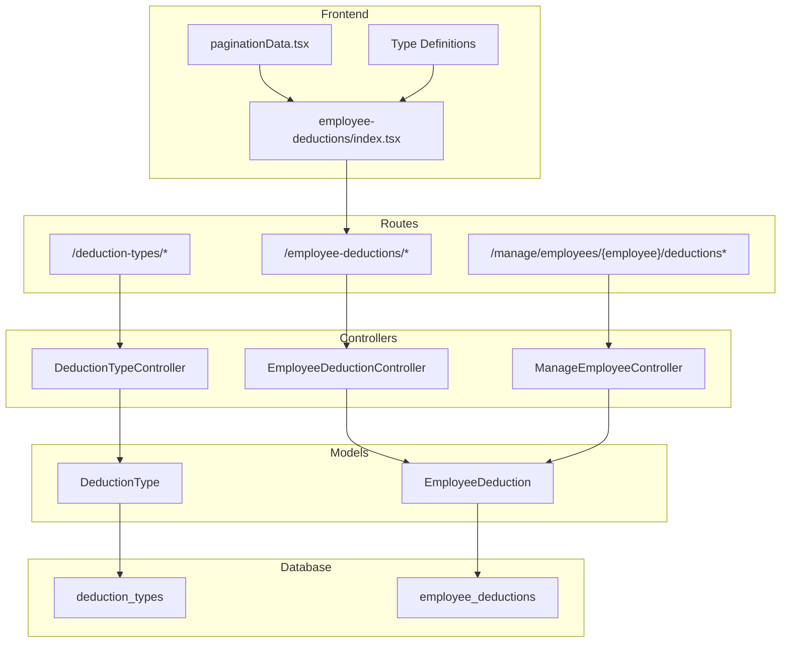
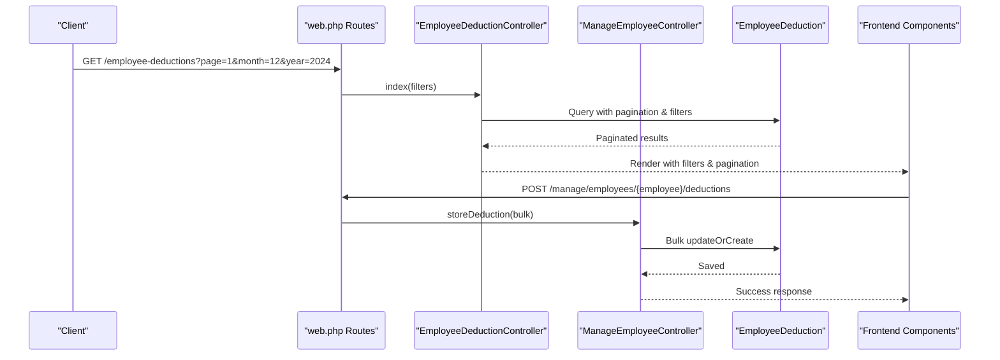
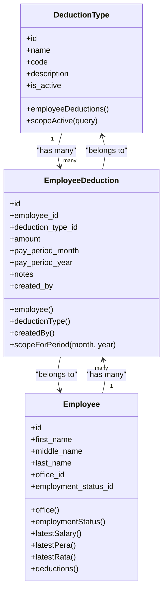

# Deduction Management API

<cite>
**Referenced Files in This Document**
- [DeductionTypeController.php](file://app/Http/Controllers/DeductionTypeController.php)
- [EmployeeDeductionController.php](file://app/Http/Controllers/EmployeeDeductionController.php)
- [ManageEmployeeController.php](file://app/Http/Controllers/ManageEmployeeController.php)
- [DeductionType.php](file://app/Models/DeductionType.php)
- [EmployeeDeduction.php](file://app/Models/EmployeeDeduction.php)
- [2026_03_22_115110_create_deduction_types_table.php](file://database/migrations/2026_03_22_115110_create_deduction_types_table.php)
- [2026_03_22_115112_create_employee_deductions_table.php](file://database/migrations/2026_03_22_115112_create_employee_deductions_table.php)
- [web.php](file://routes/web.php)
- [employee-deductions/index.tsx](file://resources/js/pages/employee-deductions/index.tsx)
- [paginationData.tsx](file://resources/js/components/paginationData.tsx)
- [pagination.d.ts](file://resources/js/types/pagination.d.ts)
- [filter.d.ts](file://resources/js/types/filter.d.ts)
- [employee.d.ts](file://resources/js/types/employee.d.ts)
</cite>

## Update Summary
**Changes Made**
- Enhanced employee deduction listing with comprehensive pagination and filtering capabilities
- Added month/year filtering for improved data organization and performance
- Implemented advanced search functionality across employee names
- Added employment status and office-based filtering options
- Improved frontend pagination controls with Inertia.js integration
- Enhanced employee-specific deduction management with period-based organization

## Table of Contents
1. [Introduction](#introduction)
2. [Project Structure](#project-structure)
3. [Core Components](#core-components)
4. [Architecture Overview](#architecture-overview)
5. [Detailed Component Analysis](#detailed-component-analysis)
6. [Enhanced API Endpoints](#enhanced-api-endpoints)
7. [Frontend Integration](#frontend-integration)
8. [Performance Considerations](#performance-considerations)
9. [Troubleshooting Guide](#troubleshooting-guide)
10. [Conclusion](#conclusion)

## Introduction
This document provides comprehensive API documentation for the enhanced deduction management system. The system now features sophisticated pagination, filtering, and improved data organization capabilities for managing employee deductions. It covers deduction types management, employee-specific deduction tracking, and advanced filtering mechanisms for better performance with large datasets. The deduction hierarchy and calculation implications are explained, along with request parameters for creation, updates, and deletions.

## Project Structure
The deduction management system consists of:
- Controllers for deduction types, employee deductions, and employee management
- Eloquent models representing deduction types and employee deductions
- Database migrations defining schema and constraints
- Routes exposing REST endpoints under dedicated prefixes
- Advanced frontend components with pagination and filtering



**Diagram sources**
- [web.php:58-83](file://routes/web.php#L58-L83)
- [DeductionTypeController.php:1-55](file://app/Http/Controllers/DeductionTypeController.php#L1-L55)
- [EmployeeDeductionController.php:1-119](file://app/Http/Controllers/EmployeeDeductionController.php#L1-L119)
- [ManageEmployeeController.php:1-151](file://app/Http/Controllers/ManageEmployeeController.php#L1-L151)
- [DeductionType.php:1-33](file://app/Models/DeductionType.php#L1-L33)
- [EmployeeDeduction.php:1-59](file://app/Models/EmployeeDeduction.php#L1-L59)
- [employee-deductions/index.tsx:1-427](file://resources/js/pages/employee-deductions/index.tsx#L1-L427)
- [paginationData.tsx:1-34](file://resources/js/components/paginationData.tsx#L1-L34)

**Section sources**
- [web.php:58-83](file://routes/web.php#L58-L83)
- [DeductionTypeController.php:1-55](file://app/Http/Controllers/DeductionTypeController.php#L1-L55)
- [EmployeeDeductionController.php:1-119](file://app/Http/Controllers/EmployeeDeductionController.php#L1-L119)
- [ManageEmployeeController.php:1-151](file://app/Http/Controllers/ManageEmployeeController.php#L1-L151)

## Core Components
- **DeductionTypeController**: Manages CRUD operations for deduction types, including validation and response handling.
- **EmployeeDeductionController**: Manages comprehensive CRUD operations for employee-specific deductions with advanced filtering, pagination, and duplicate prevention.
- **ManageEmployeeController**: Handles employee-specific deduction management with period-based organization and bulk operations.
- **DeductionType model**: Defines fillable attributes, casting, relationships, and scopes for active deduction types.
- **EmployeeDeduction model**: Defines fillable attributes, casting, relationships, automatic created_by population, and period-scoped queries.
- **Database migrations**: Define schema, foreign keys, unique constraints, and data types for deduction types and employee deductions.
- **Frontend components**: Provide advanced pagination, filtering, and interactive UI for deduction management.

**Section sources**
- [DeductionTypeController.php:11-53](file://app/Http/Controllers/DeductionTypeController.php#L11-L53)
- [EmployeeDeductionController.php:14-119](file://app/Http/Controllers/EmployeeDeductionController.php#L14-L119)
- [ManageEmployeeController.php:14-151](file://app/Http/Controllers/ManageEmployeeController.php#L14-L151)
- [DeductionType.php:9-31](file://app/Models/DeductionType.php#L9-L31)
- [EmployeeDeduction.php:10-57](file://app/Models/EmployeeDeduction.php#L10-L57)

## Architecture Overview
The system follows a layered architecture with enhanced frontend integration:
- Routes define endpoints under dedicated prefixes for deduction types, employee deductions, and employee management.
- Controllers handle HTTP requests, apply validation, and orchestrate model operations with advanced filtering.
- Models encapsulate business logic, relationships, and database casting with period-scoped queries.
- Migrations define the underlying schema and enforce referential integrity and uniqueness.
- Frontend components provide interactive pagination, filtering, and real-time updates via Inertia.js.



**Diagram sources**
- [web.php:58-83](file://routes/web.php#L58-L83)
- [EmployeeDeductionController.php:16-63](file://app/Http/Controllers/EmployeeDeductionController.php#L16-L63)
- [ManageEmployeeController.php:117-149](file://app/Http/Controllers/ManageEmployeeController.php#L117-L149)
- [employee-deductions/index.tsx:103-158](file://resources/js/pages/employee-deductions/index.tsx#L103-L158)

## Detailed Component Analysis

### Deduction Types Management API
Endpoints:
- GET /deduction-types: List all deduction types ordered by name.
- POST /deduction-types: Create a new deduction type.
- PUT /deduction-types/{deductionType}: Update an existing deduction type.
- DELETE /deduction-types/{deductionType}: Delete a deduction type.

Validation rules (creation and update):
- name: required, string, max length 255.
- code: required, string, max length 50, unique across deduction_types.code.
- description: nullable, string.
- is_active: boolean.

Response behavior:
- Success redirects back with a success message.
- Update operation excludes the current record's ID when validating uniqueness.


**Diagram sources**
- [DeductionTypeController.php:20-32](file://app/Http/Controllers/DeductionTypeController.php#L20-L32)
- [DeductionTypeController.php:34-46](file://app/Http/Controllers/DeductionTypeController.php#L34-L46)

**Section sources**
- [DeductionTypeController.php:11-53](file://app/Http/Controllers/DeductionTypeController.php#L11-L53)
- [2026_03_22_115110_create_deduction_types_table.php:14-21](file://database/migrations/2026_03_22_115110_create_deduction_types_table.php#L14-L21)

### Enhanced Employee Deduction Tracking API
**Updated** Enhanced with comprehensive pagination, filtering, and improved data organization capabilities.

Endpoints:
- GET /employee-deductions: List employees with their deductions filtered by month, year, office_id, employment_status_id, and search term with pagination.
- POST /employee-deductions: Create a new employee deduction.
- PUT /employee-deductions/{employeeDeduction}: Update an existing employee deduction.
- DELETE /employee-deductions/{employeeDeduction}: Delete an employee deduction.

#### Advanced Filtering and Pagination Features
**Updated** New comprehensive filtering and pagination capabilities:

**Filter Parameters:**
- month: integer, defaults to current month (1-12)
- year: integer, defaults to current year (2020-2100)
- office_id: optional filter by office ID
- employment_status_id: optional filter by employment status ID
- search: optional text search across first_name, middle_name, last_name

**Pagination Controls:**
- Default page size: 50 employees per page
- Full pagination metadata: current_page, last_page, total, from, to
- Inertia.js integration for seamless navigation

**Performance Optimizations:**
- Eager loading of related models (employmentStatus, office, latestSalary, latestPera, latestRata)
- Efficient period-based deduction loading with pay_period_month and pay_period_year filters
- Database-level pagination with withQueryString() for state preservation

**Section sources**
- [EmployeeDeductionController.php:16-63](file://app/Http/Controllers/EmployeeDeductionController.php#L16-L63)
- [employee-deductions/index.tsx:47-62](file://resources/js/pages/employee-deductions/index.tsx#L47-L62)
- [paginationData.tsx:4-33](file://resources/js/components/paginationData.tsx#L4-L33)

### Employee-Specific Deduction Management API
**New** Dedicated endpoint for comprehensive employee deduction management with period-based organization.

Endpoints:
- GET /manage/employees/{employee}/deductions: List employee's deduction periods with pagination and filtering.
- POST /manage/employees/{employee}/deductions: Bulk create/update deductions for specific periods.

#### Period-Based Organization Features
**New** Advanced period-based deduction management:

**Filter Parameters:**
- deduction_month: optional filter by month
- deduction_year: optional filter by year

**Bulk Operations:**
- Supports multiple deductions in a single request
- Uses updateOrCreate for efficient bulk operations
- Prevents duplicate entries within the same period

**Data Organization:**
- Groups deductions by pay period (year-month combinations)
- Provides period statistics (count and total amount)
- Maintains taken periods for conflict detection

**Section sources**
- [ManageEmployeeController.php:16-115](file://app/Http/Controllers/ManageEmployeeController.php#L16-L115)
- [ManageEmployeeController.php:117-149](file://app/Http/Controllers/ManageEmployeeController.php#L117-L149)

### Data Models and Relationships


**Diagram sources**
- [DeductionType.php:20-31](file://app/Models/DeductionType.php#L20-L31)
- [EmployeeDeduction.php:26-57](file://app/Models/EmployeeDeduction.php#L26-L57)
- [employee.d.ts:8-29](file://resources/js/types/employee.d.ts#L8-L29)

**Section sources**
- [DeductionType.php:1-33](file://app/Models/DeductionType.php#L1-L33)
- [EmployeeDeduction.php:1-59](file://app/Models/EmployeeDeduction.php#L1-L59)

### Deduction Hierarchy and Calculation Formulas
- Deduction types define reusable categories (e.g., tax, insurance, loan) with activation status.
- Employee deductions are specific instances of a deduction type applied to an employee for a given pay period.
- Amounts are stored as decimal values with two decimal places for precise payroll calculations.
- Tax implications are not computed within the API; amounts are recorded for downstream payroll processing.

Business logic highlights:
- Active deduction types are used for selection in employee deduction forms.
- Pay period filters ensure deductions are isolated per month and year.
- Unique constraint prevents duplicate entries for the same employee, deduction type, and pay period.
- **Updated** Advanced filtering optimizes query performance for large datasets.

**Section sources**
- [DeductionType.php:28-31](file://app/Models/DeductionType.php#L28-L31)
- [EmployeeDeduction.php:20-24](file://app/Models/EmployeeDeduction.php#L20-L24)
- [2026_03_22_115112_create_employee_deductions_table.php:25-26](file://database/migrations/2026_03_22_115112_create_employee_deductions_table.php#L25-L26)

## Enhanced API Endpoints

### Employee Deductions Listing Endpoint
**Updated** Comprehensive endpoint with advanced filtering and pagination.

**Endpoint:** `GET /employee-deductions`

**Query Parameters:**
- `month` (optional): Integer, default=current month, range=1-12
- `year` (optional): Integer, default=current year, range=2020-2100
- `office_id` (optional): String, filter by office ID
- `employment_status_id` (optional): String, filter by employment status ID
- `search` (optional): String, search across employee names

**Response Format:**
```json
{
  "employees": {
    "current_page": 1,
    "last_page": 10,
    "total": 500,
    "from": 1,
    "to": 50,
    "data": [
      {
        "id": 1,
        "first_name": "John",
        "last_name": "Doe",
        "deductions": [
          {
            "id": 101,
            "amount": 1500.00,
            "deduction_type": {
              "name": "Tax"
            }
          }
        ]
      }
    ]
  },
  "filters": {
    "month": 12,
    "year": 2024,
    "office_id": null,
    "employment_status_id": null,
    "search": ""
  }
}
```

**Section sources**
- [EmployeeDeductionController.php:16-63](file://app/Http/Controllers/EmployeeDeductionController.php#L16-L63)
- [employee-deductions/index.tsx:103-115](file://resources/js/pages/employee-deductions/index.tsx#L103-L115)

### Employee Deduction Management Endpoint
**New** Dedicated endpoint for comprehensive employee deduction management.

**Endpoint:** `GET /manage/employees/{employee}/deductions`

**Query Parameters:**
- `deduction_month` (optional): Integer, filter by month
- `deduction_year` (optional): Integer, filter by year

**Response Format:**
```json
{
  "employee": {
    "id": 1,
    "first_name": "John",
    "last_name": "Doe"
  },
  "deductions": {
    "2024-12": [
      {
        "id": 101,
        "amount": 1500.00,
        "deduction_type": {
          "name": "Tax"
        }
      }
    ]
  },
  "periodsList": ["2024-12", "2024-11"],
  "takenPeriods": ["2024-12", "2024-11"],
  "availableYears": [2024, 2023, 2022],
  "filters": {
    "deduction_month": null,
    "deduction_year": null
  },
  "deductionPagination": {
    "current_page": 1,
    "last_page": 1,
    "per_page": 50,
    "total": 2
  }
}
```

**Section sources**
- [ManageEmployeeController.php:16-115](file://app/Http/Controllers/ManageEmployeeController.php#L16-L115)

### Bulk Deduction Creation Endpoint
**New** Endpoint for efficient bulk deduction management.

**Endpoint:** `POST /manage/employees/{employee}/deductions`

**Request Body:**
```json
{
  "pay_period_month": 12,
  "pay_period_year": 2024,
  "deductions": [
    {
      "deduction_type_id": 1,
      "amount": 1500.00
    },
    {
      "deduction_type_id": 2,
      "amount": 500.00
    }
  ]
}
```

**Section sources**
- [ManageEmployeeController.php:117-149](file://app/Http/Controllers/ManageEmployeeController.php#L117-L149)

## Frontend Integration

### Advanced Pagination Component
**New** Comprehensive pagination component with Inertia.js integration.

**Features:**
- Full pagination metadata display
- Responsive link navigation
- State preservation with preserveState and preserveScroll
- Dark mode support

**Section sources**
- [paginationData.tsx:4-33](file://resources/js/components/paginationData.tsx#L4-L33)
- [pagination.d.ts:7-18](file://resources/js/types/pagination.d.ts#L7-L18)

### Enhanced Employee Deductions Interface
**Updated** Advanced frontend with comprehensive filtering and pagination.

**Key Features:**
- Month/year dropdown filters with current date defaults
- Office and employment status filtering
- Real-time search across employee names
- Interactive pagination controls
- Bulk deduction management for individual employees

**Section sources**
- [employee-deductions/index.tsx:173-311](file://resources/js/pages/employee-deductions/index.tsx#L173-L311)
- [filter.d.ts:3-7](file://resources/js/types/filter.d.ts#L3-L7)
- [employee.d.ts:25](file://resources/js/types/employee.d.ts#L25)

## Performance Considerations
**Updated** Enhanced performance optimizations for large datasets:

- **Indexing**: Consider adding indexes on frequently filtered columns such as pay_period_month, pay_period_year, employee_id, and office_id in employee_deductions for improved query performance.
- **Pagination**: Default page size of 50 employees per page with full pagination metadata for optimal performance with large datasets.
- **Eager Loading**: Efficient eager loading of related models reduces N+1 query problems.
- **Database Optimization**: Database-level pagination with withQueryString() preserves filter state across pages.
- **Frontend Optimization**: Inertia.js integration provides seamless navigation without full page reloads.
- **Unique Constraints**: Database-level unique constraints prevent duplicates and reduce application-level checks.

## Troubleshooting Guide
**Updated** Common issues and resolutions for enhanced functionality:

**Pagination Issues:**
- Pagination not working: Ensure proper query string handling with withQueryString() in controllers.
- Page size too small/large: Adjust the paginate() parameter in controller methods.

**Filtering Problems:**
- Filters not persisting: Verify preserveState and preserveScroll options in frontend navigation.
- Search not returning results: Check LIKE operator usage in query builder with proper wildcard placement.

**Performance Issues:**
- Slow loading times: Implement database indexes on frequently filtered columns.
- Memory issues with large datasets: Use pagination and limit eager loading to essential relationships.

**Common Issues:**
- Validation errors on creation/update: Ensure all required fields meet constraints (e.g., numeric amounts, valid month/year ranges).
- Duplicate deduction error: When creating an employee deduction, verify that no record exists for the same employee, deduction type, month, and year.
- Foreign key violations: Confirm that employee_id and deduction_type_id correspond to existing records.
- Active deduction types not appearing: Only active deduction types are returned for selection; toggle is_active if necessary.

**Section sources**
- [EmployeeDeductionController.php:65-98](file://app/Http/Controllers/EmployeeDeductionController.php#L65-L98)
- [ManageEmployeeController.php:117-149](file://app/Http/Controllers/ManageEmployeeController.php#L117-L149)
- [DeductionTypeController.php:22-27](file://app/Http/Controllers/DeductionTypeController.php#L22-L27)

## Conclusion
The enhanced deduction management API provides comprehensive CRUD capabilities with sophisticated pagination, filtering, and improved data organization. The system now supports month/year filtering, advanced search functionality, employment status and office-based filtering, and efficient bulk operations for employee-specific deductions. By leveraging advanced pagination, period-based organization, and Inertia.js integration, the system delivers excellent performance and user experience for managing large-scale payroll deduction data. The enhanced frontend components provide intuitive controls for managing employee deductions with real-time feedback and seamless navigation.