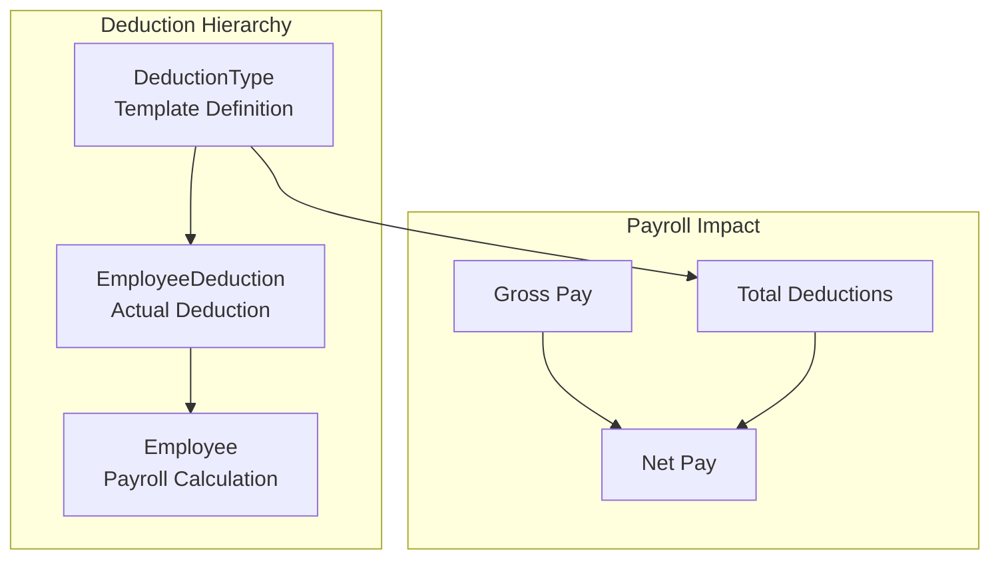
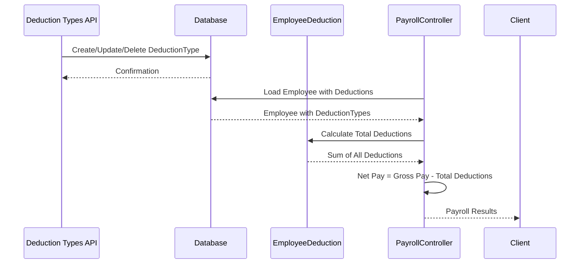
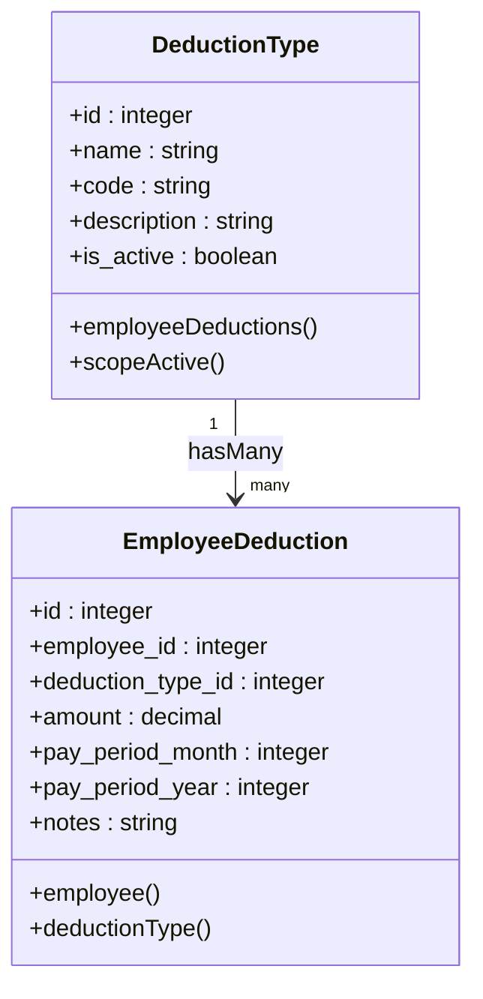

# Deduction Types API

<cite>
**Referenced Files in This Document**
- [DeductionTypeController.php](file://app/Http/Controllers/DeductionTypeController.php)
- [DeductionType.php](file://app/Models/DeductionType.php)
- [EmployeeDeduction.php](file://app/Models/EmployeeDeduction.php)
- [web.php](file://routes/web.php)
- [2026_03_22_115110_create_deduction_types_table.php](file://database/migrations/2026_03_22_115110_create_deduction_types_table.php)
- [deductionType.d.ts](file://resources/js/types/deductionType.d.ts)
- [index.tsx](file://resources/js/pages/deduction-types/index.tsx)
- [PayrollController.php](file://app/Http/Controllers/PayrollController.php)
- [EmployeeDeductionController.php](file://app/Http/Controllers/EmployeeDeductionController.php)
- [DeductionTypeSeeder.php](file://database/seeders/DeductionTypeSeeder.php)
</cite>

## Table of Contents
1. [Introduction](#introduction)
2. [API Endpoints](#api-endpoints)
3. [Deduction Type Data Model](#deduction-type-data-model)
4. [Request Validation Rules](#request-validation-rules)
5. [Response Schemas](#response-schemas)
6. [Error Handling](#error-handling)
7. [Deduction Hierarchy and Payroll Impact](#deduction-hierarchy-and-payroll-impact)
8. [Implementation Details](#implementation-details)
9. [Usage Examples](#usage-examples)
10. [Troubleshooting Guide](#troubleshooting-guide)
11. [Conclusion](#conclusion)

## Introduction

The Deduction Types API manages payroll deduction categories used throughout the organization's compensation system. This API enables administrators to create, read, update, and delete deduction types that serve as templates for employee-specific deductions recorded in the payroll system.

The system follows a hierarchical approach where deduction types define the categories (such as GSIS contributions, PhilHealth, taxes), while individual employee deductions capture the actual amounts deducted during specific pay periods.

## API Endpoints

### Base URL
```
/payroll/deduction-types
```

### List All Deduction Types
**GET** `/payroll/deduction-types`

Returns all deduction types sorted alphabetically by name. The endpoint supports optional filtering through query parameters.

**Response**: Array of deduction type objects

### Create New Deduction Type
**POST** `/payroll/deduction-types`

Creates a new deduction type with the provided details.

**Request Body**: DeductionTypeCreateRequest object

**Response**: Success message with redirect

### Update Existing Deduction Type
**PUT** `/payroll/deduction-types/{deductionType}`

Updates an existing deduction type identified by its ID.

**Path Parameters**:
- `deductionType` (integer): The ID of the deduction type to update

**Request Body**: DeductionTypeUpdateRequest object

**Response**: Success message with redirect

### Delete Deduction Type
**DELETE** `/payroll/deduction-types/{deductionType}`

Removes a deduction type from the system.

**Path Parameters**:
- `deductionType` (integer): The ID of the deduction type to delete

**Response**: Success message with redirect

**Section sources**
- [web.php:55-61](file://routes/web.php#L55-L61)
- [DeductionTypeController.php:11-53](file://app/Http/Controllers/DeductionTypeController.php#L11-L53)

## Deduction Type Data Model

### Core Fields

| Field | Type | Required | Description |
|-------|------|----------|-------------|
| `id` | integer | No | Unique identifier (auto-generated) |
| `name` | string | Yes | Display name of the deduction type |
| `code` | string | Yes | Unique code identifier (e.g., "GSIS", "PHILHEALTH") |
| `description` | string | No | Optional description explaining the deduction |
| `is_active` | boolean | No | Whether the deduction type is currently active |
| `created_at` | string (datetime) | No | Timestamp of creation |
| `updated_at` | string (datetime) | No | Timestamp of last update |

### Frontend Type Definitions

The TypeScript definitions provide the client-side contract for deduction types:

```typescript
interface DeductionType {
  id: number;
  name: string;
  code: string;
  description?: string;
  is_active: boolean;
  created_at: string;
  updated_at: string;
}

interface DeductionTypeCreateRequest {
  name: string;
  code: string;
  description?: string;
  is_active: boolean;
}

interface DeductionTypeUpdateRequest {
  name: string;
  code: string;
  description?: string;
  is_active: boolean;
}
```

**Section sources**
- [DeductionType.php:9-18](file://app/Models/DeductionType.php#L9-L18)
- [2026_03_22_115110_create_deduction_types_table.php:14-21](file://database/migrations/2026_03_22_115110_create_deduction_types_table.php#L14-L21)
- [deductionType.d.ts:1-24](file://resources/js/types/deductionType.d.ts#L1-L24)

## Request Validation Rules

### Common Validation Rules
All endpoints follow these validation patterns:

- **name**: Required, string, maximum 255 characters
- **code**: Required, string, maximum 50 characters, unique across deduction types
- **description**: Optional, string
- **is_active**: Boolean value

### Endpoint-Specific Rules

#### Create Endpoint (/POST)
- Validates all required fields
- Ensures code uniqueness across the deduction_types table
- Accepts boolean is_active with default true

#### Update Endpoint (/PUT)
- Same validation as create
- Excludes current record from uniqueness validation
- Uses soft uniqueness constraint with current ID excluded

#### Delete Endpoint (/DELETE)
- No validation required (deletes existing record)
- Returns success on completion

**Section sources**
- [DeductionTypeController.php:22-45](file://app/Http/Controllers/DeductionTypeController.php#L22-L45)

## Response Schemas

### Success Responses
All successful operations return a redirect response with a success message. The frontend handles these responses and displays appropriate feedback to users.

### Error Responses
Validation errors return redirect responses with error messages. Common error scenarios include:

- Duplicate code entries
- Missing required fields
- Invalid data types

### Response Headers
- **Content-Type**: application/json
- **X-Frame-Options**: SAMEORIGIN
- **X-XSS-Protection**: 1; mode=block
- **X-Content-Type-Options**: nosniff

**Section sources**
- [DeductionTypeController.php:31-52](file://app/Http/Controllers/DeductionTypeController.php#L31-L52)

## Error Handling

### Validation Errors
The system implements comprehensive validation with specific error messages:

- **Unique Code Violation**: "The code has already been taken."
- **Required Field Missing**: "{field} field is required."
- **String Length Exceeded**: "{field} must not exceed 255 characters."
- **Boolean Validation**: "The is_active field must be true or false."

### Business Logic Errors
- Attempting to delete deduction types that are referenced by employee deductions
- Invalid deduction type IDs in related operations

### HTTP Status Codes
- **200 OK**: Successful operations
- **302 Found**: Redirect responses after successful operations
- **422 Unprocessable Entity**: Validation errors
- **404 Not Found**: Non-existent records

**Section sources**
- [DeductionTypeController.php:22-45](file://app/Http/Controllers/DeductionTypeController.php#L22-L45)

## Deduction Hierarchy and Payroll Impact

### Hierarchical Structure



**Diagram sources**
- [DeductionType.php:20-23](file://app/Models/DeductionType.php#L20-L23)
- [EmployeeDeduction.php:26-34](file://app/Models/EmployeeDeduction.php#L26-L34)
- [PayrollController.php:49-67](file://app/Http/Controllers/PayrollController.php#L49-L67)

### Payroll Calculation Flow



**Diagram sources**
- [PayrollController.php:49-67](file://app/Http/Controllers/PayrollController.php#L49-L67)
- [EmployeeDeductionController.php:54-87](file://app/Http/Controllers/EmployeeDeductionController.php#L54-L87)

### Impact on Payroll Calculations

1. **Gross Pay Composition**: Deduction types contribute to total deductions that reduce gross pay
2. **Net Pay Calculation**: Final take-home pay equals gross pay minus total deductions
3. **Active Status Control**: Only active deduction types affect payroll calculations
4. **Hierarchical Dependencies**: Employee deductions reference deduction types as templates

**Section sources**
- [PayrollController.php:48-67](file://app/Http/Controllers/PayrollController.php#L48-L67)
- [DeductionType.php:28-31](file://app/Models/DeductionType.php#L28-L31)

## Implementation Details

### Database Schema

The deduction types table maintains the following structure:

| Column | Type | Constraints | Description |
|--------|------|-------------|-------------|
| `id` | bigint unsigned | Primary Key, Auto Increment | Unique identifier |
| `name` | varchar(255) | Not Null | Display name |
| `code` | varchar(50) | Not Null, Unique | System code |
| `description` | text | Nullable | Optional description |
| `is_active` | tinyint(1) | Not Null, Default: 1 | Active status flag |
| `created_at` | timestamp | Nullable | Creation timestamp |
| `updated_at` | timestamp | Nullable | Last update timestamp |

### Model Relationships



**Diagram sources**
- [DeductionType.php:20-31](file://app/Models/DeductionType.php#L20-L31)
- [EmployeeDeduction.php:26-39](file://app/Models/EmployeeDeduction.php#L26-L39)

### Controller Operations

The DeductionTypeController implements standard CRUD operations with Laravel's validation system and Inertia.js for frontend integration.

**Section sources**
- [DeductionTypeController.php:9-55](file://app/Http/Controllers/DeductionTypeController.php#L9-L55)
- [DeductionType.php:7-33](file://app/Models/DeductionType.php#L7-L33)
- [EmployeeDeduction.php:8-59](file://app/Models/EmployeeDeduction.php#L8-L59)

## Usage Examples

### Listing Deduction Types
```javascript
// GET /payroll/deduction-types
fetch('/payroll/deduction-types')
  .then(response => response.json())
  .then(data => console.log(data));
```

### Creating a New Deduction Type
```javascript
// POST /payroll/deduction-types
fetch('/payroll/deduction-types', {
  method: 'POST',
  headers: {
    'Content-Type': 'application/json',
    'Accept': 'application/json',
  },
  body: JSON.stringify({
    name: 'New Deduction',
    code: 'NEW_CODE',
    description: 'Description of new deduction',
    is_active: true
  })
})
.then(response => response.json())
.then(data => console.log('Success:', data));
```

### Updating a Deduction Type
```javascript
// PUT /payroll/deduction-types/1
fetch('/payroll/deduction-types/1', {
  method: 'PUT',
  headers: {
    'Content-Type': 'application/json',
    'Accept': 'application/json',
  },
  body: JSON.stringify({
    name: 'Updated Name',
    code: 'NEW_CODE',
    description: 'Updated description',
    is_active: false
  })
})
.then(response => response.json())
.then(data => console.log('Success:', data));
```

### Deleting a Deduction Type
```javascript
// DELETE /payroll/deduction-types/1
fetch('/payroll/deduction-types/1', {
  method: 'DELETE'
})
.then(response => response.json())
.then(data => console.log('Success:', data));
```

## Troubleshooting Guide

### Common Issues and Solutions

#### Duplicate Code Error
**Problem**: Attempting to create/update a deduction type with an existing code
**Solution**: Use a unique code value or modify the existing deduction type

#### Validation Failures
**Problem**: Missing required fields or invalid data types
**Solution**: Ensure all required fields are present and match expected types

#### Active Status Impact
**Problem**: Newly created deduction types not appearing in payroll
**Solution**: Set `is_active` to true for deduction types that should affect calculations

#### Related Records Exist
**Problem**: Cannot delete deduction types that have associated employee deductions
**Solution**: Remove or update dependent employee deductions before deletion

### Debug Information

The system provides comprehensive error messages through the validation layer. Check the response messages for specific validation failures and adjust requests accordingly.

**Section sources**
- [DeductionTypeController.php:22-45](file://app/Http/Controllers/DeductionTypeController.php#L22-L45)
- [DeductionTypeSeeder.php:15-106](file://database/seeders/DeductionTypeSeeder.php#L15-L106)

## Conclusion

The Deduction Types API provides a robust foundation for managing payroll deduction categories. Its hierarchical design ensures that deduction types serve as reusable templates while employee-specific deductions capture the actual amounts processed during payroll cycles.

Key benefits include:
- **Hierarchical Organization**: Clear separation between deduction templates and actual deductions
- **Flexible Validation**: Comprehensive input validation ensures data integrity
- **Payroll Integration**: Seamless integration with existing payroll calculation systems
- **Active Status Control**: Ability to enable/disable deduction types without data loss
- **Unique Identification**: Code-based identification prevents conflicts and ensures consistency

The API's design supports both administrative management and automated payroll processing, making it suitable for organizations requiring precise control over their deduction management processes.