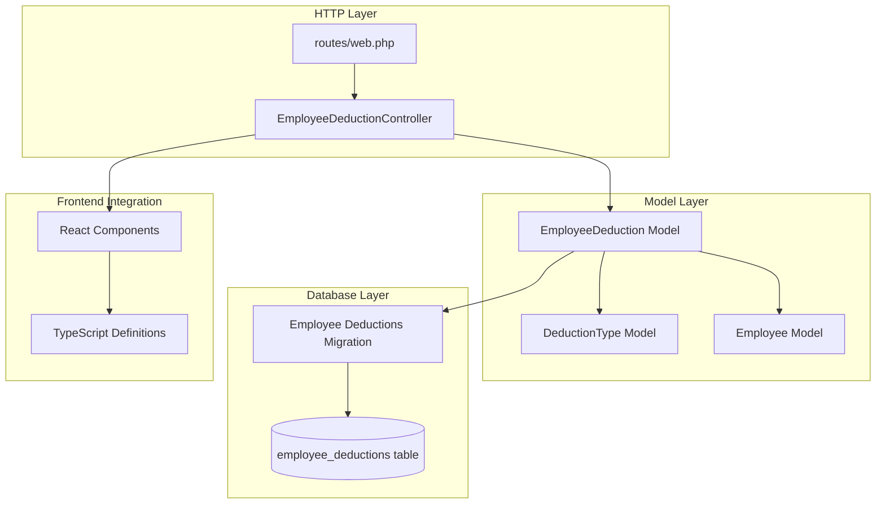
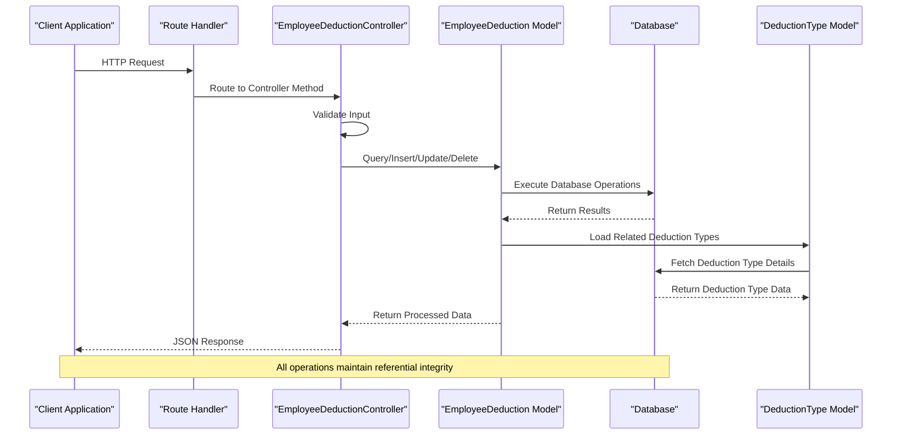
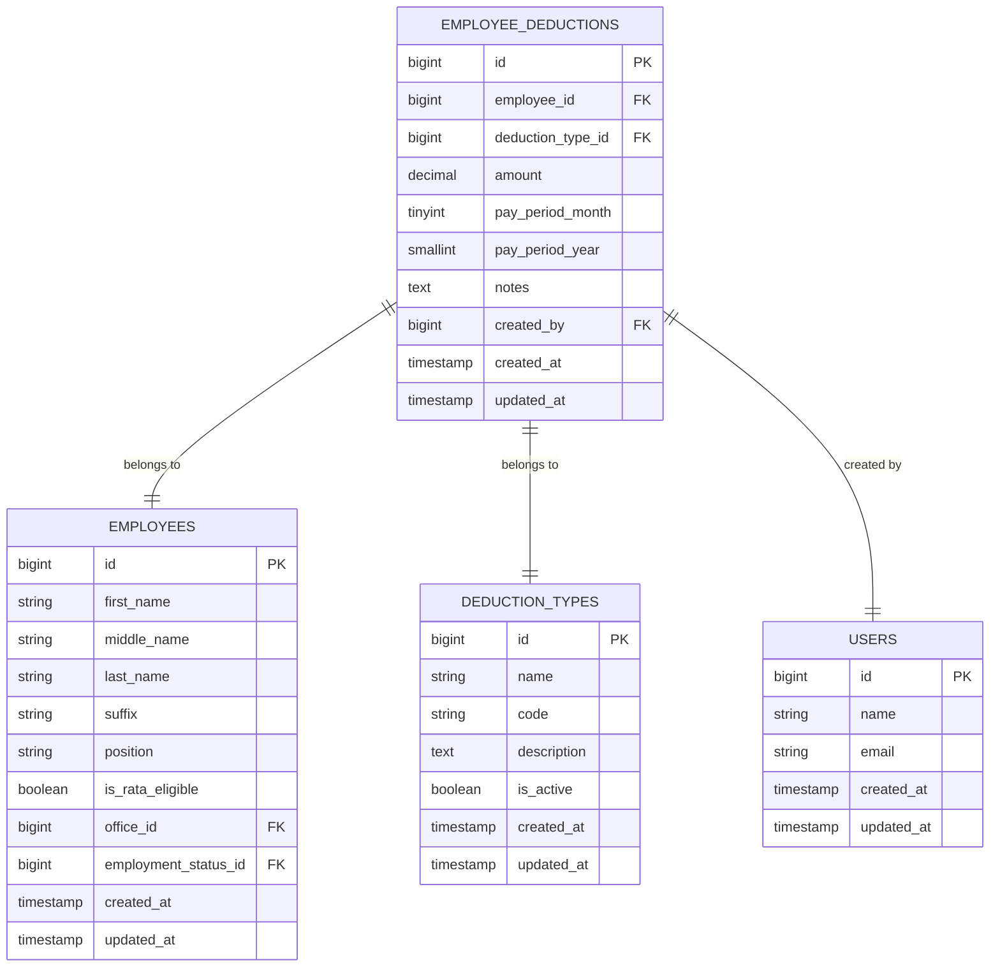
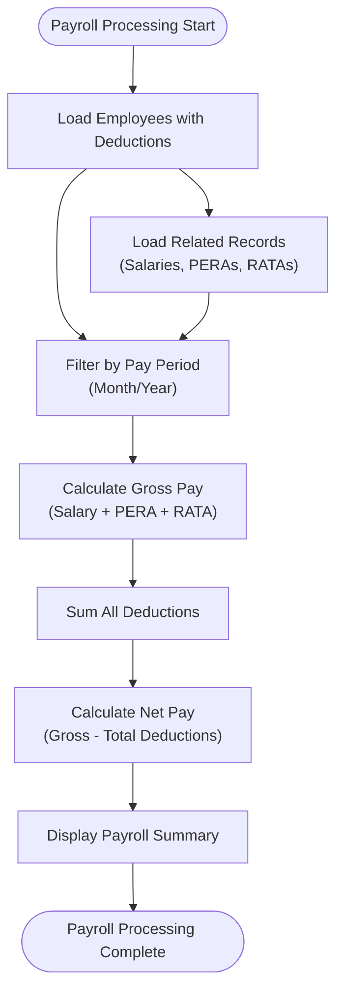

# Employee Deductions API

<cite>
**Referenced Files in This Document**
- [EmployeeDeductionController.php](file://app/Http/Controllers/EmployeeDeductionController.php)
- [EmployeeDeduction.php](file://app/Models/EmployeeDeduction.php)
- [DeductionType.php](file://app/Models/DeductionType.php)
- [2026_03_22_115112_create_employee_deductions_table.php](file://database/migrations/2026_03_22_115112_create_employee_deductions_table.php)
- [web.php](file://routes/web.php)
- [employeeDeduction.d.ts](file://resources/js/types/employeeDeduction.d.ts)
- [employee.d.ts](file://resources/js/types/employee.d.ts)
- [payroll.d.ts](file://resources/js/types/payroll.d.ts)
- [index.tsx](file://resources/js/pages/employee-deductions/index.tsx)
- [show.tsx](file://resources/js/pages/payroll/show.tsx)
- [PayrollController.php](file://app/Http/Controllers/PayrollController.php)
</cite>

## Table of Contents
1. [Introduction](#introduction)
2. [Project Structure](#project-structure)
3. [Core Components](#core-components)
4. [Architecture Overview](#architecture-overview)
5. [Detailed Component Analysis](#detailed-component-analysis)
6. [API Endpoints](#api-endpoints)
7. [Data Models](#data-models)
8. [Relationships and Workflows](#relationships-and-workflows)
9. [Filtering and Search](#filtering-and-search)
10. [Validation Rules](#validation-rules)
11. [Performance Considerations](#performance-considerations)
12. [Troubleshooting Guide](#troubleshooting-guide)
13. [Conclusion](#conclusion)

## Introduction

The Employee Deductions API provides comprehensive CRUD operations for managing employee deduction records within the payroll system. This API enables organizations to track various types of employee deductions such as cooperative loans, cash advances, uniform allowances, and other miscellaneous deductions on a per-pay-period basis.

The system integrates seamlessly with the broader payroll processing workflow, allowing for real-time calculation of gross pay, total deductions, and net pay amounts. The API supports filtering capabilities for efficient data retrieval and includes robust validation to prevent duplicate entries.

## Project Structure

The Employee Deductions API follows Laravel's MVC architecture pattern with dedicated controllers, models, and migration files:

**Diagram sources**
- [web.php:63-69](file://routes/web.php#L63-L69)
- [EmployeeDeductionController.php:12-108](file://app/Http/Controllers/EmployeeDeductionController.php#L12-L108)
- [EmployeeDeduction.php:8-59](file://app/Models/EmployeeDeduction.php#L8-L59)

**Section sources**
- [web.php:1-100](file://routes/web.php#L1-L100)
- [EmployeeDeductionController.php:1-108](file://app/Http/Controllers/EmployeeDeductionController.php#L1-L108)

## Core Components

The Employee Deductions system consists of several interconnected components that work together to provide comprehensive deduction management:

### Controller Layer
The EmployeeDeductionController handles all HTTP requests and implements the four primary CRUD operations with sophisticated filtering and validation logic.

### Model Layer
The EmployeeDeduction model provides data persistence, relationships with related entities, and automatic timestamp management. It includes specialized scopes for period-based filtering and automatic created_by population.

### Database Layer
The migration creates a normalized database structure with foreign key constraints and unique composite keys to prevent duplicate entries.

### Frontend Integration
React components provide user-friendly interfaces for creating, editing, and managing deduction records with real-time validation and feedback.

**Section sources**
- [EmployeeDeductionController.php:12-108](file://app/Http/Controllers/EmployeeDeductionController.php#L12-L108)
- [EmployeeDeduction.php:8-59](file://app/Models/EmployeeDeduction.php#L8-L59)
- [2026_03_22_115112_create_employee_deductions_table.php:14-27](file://database/migrations/2026_03_22_115112_create_employee_deductions_table.php#L14-L27)

## Architecture Overview

The Employee Deductions API follows a layered architecture pattern with clear separation of concerns:

**Diagram sources**
- [web.php:63-69](file://routes/web.php#L63-L69)
- [EmployeeDeductionController.php:14-106](file://app/Http/Controllers/EmployeeDeductionController.php#L14-L106)
- [EmployeeDeduction.php:26-39](file://app/Models/EmployeeDeduction.php#L26-L39)

## Detailed Component Analysis

### EmployeeDeductionController

The controller implements comprehensive CRUD functionality with sophisticated filtering and validation:

#### Index Method
Handles listing employee deduction records with advanced filtering capabilities:
- Month/year filtering for pay periods
- Employee search by name
- Office-based filtering
- Deduction type filtering through eager loading

#### Store Method
Creates new deduction records with duplicate prevention:
- Validates required fields and numeric ranges
- Checks for duplicates using composite unique constraint
- Automatically sets created_by field from authenticated user
- Provides user feedback through redirect responses

#### Update Method
Modifies existing deduction records:
- Validates amount and notes fields
- Updates only specified fields
- Maintains audit trail through timestamps

#### Destroy Method
Removes deduction records with cascade deletion support.

**Section sources**
- [EmployeeDeductionController.php:14-106](file://app/Http/Controllers/EmployeeDeductionController.php#L14-L106)

### EmployeeDeduction Model

The model provides comprehensive data management with relationships and scopes:

#### Relationships
- Belongs to Employee (employee_id)
- Belongs to DeductionType (deduction_type_id)
- Belongs to User (created_by)

#### Scopes
- `forPeriod(month, year)`: Filters deductions by pay period
- Automatic created_by population during creation

#### Casting
- Amount field cast to decimal with 2 precision
- Pay period month/year cast to integers

**Section sources**
- [EmployeeDeduction.php:26-58](file://app/Models/EmployeeDeduction.php#L26-L58)

### DeductionType Model

Manages deduction type definitions with active status filtering:

#### Active Scope
Filters deduction types to only include currently active types, ensuring data consistency.

**Section sources**
- [DeductionType.php:25-31](file://app/Models/DeductionType.php#L25-L31)

## API Endpoints

The Employee Deductions API provides four primary endpoints for full CRUD operations:

### GET /payroll/employee-deductions
**Purpose**: List all employee deduction records with filtering capabilities

**Query Parameters**:
- `month` (integer): Pay period month (1-12) - defaults to current month
- `year` (integer): Pay period year (2020-2100) - defaults to current year
- `search` (string): Employee name search term (first_name, middle_name, last_name)
- `office_id` (integer): Filter by office ID

**Response**: Paginated collection of employees with their deduction records for the specified period

### POST /payroll/employee-deductions
**Purpose**: Create a new employee deduction record

**Request Body**:
- `employee_id` (required): Integer - Employee identifier
- `deduction_type_id` (required): Integer - Deduction type identifier
- `amount` (required): Number - Deduction amount (min: 0)
- `pay_period_month` (required): Integer - Month (1-12)
- `pay_period_year` (required): Integer - Year (2020-2100)
- `notes` (optional): String - Additional notes

**Response**: Redirect with success/error message

### PUT /payroll/employee-deductions/{employeeDeduction}
**Purpose**: Update an existing employee deduction record

**URL Parameter**:
- `employeeDeduction` (required): Integer - Deduction record ID

**Request Body**:
- `amount` (required): Number - Updated deduction amount (min: 0)
- `notes` (optional): String - Updated notes

**Response**: Redirect with success/error message

### DELETE /payroll/employee-deductions/{employeeDeduction}
**Purpose**: Remove an employee deduction record

**URL Parameter**:
- `employeeDeduction` (required): Integer - Deduction record ID

**Response**: Redirect with success/error message

**Section sources**
- [web.php:63-69](file://routes/web.php#L63-L69)
- [EmployeeDeductionController.php:14-106](file://app/Http/Controllers/EmployeeDeductionController.php#L14-L106)

## Data Models

### Employee Deduction Structure

The employee deduction record contains the following fields:

| Field | Type | Description | Validation |
|-------|------|-------------|------------|
| `id` | Integer | Primary key | Auto-increment |
| `employee_id` | Integer | Foreign key to employees | Required, exists |
| `deduction_type_id` | Integer | Foreign key to deduction_types | Required, exists |
| `amount` | Decimal | Deduction amount | Required, min: 0 |
| `pay_period_month` | Integer | Month (1-12) | Required |
| `pay_period_year` | Integer | Year (2020-2100) | Required |
| `notes` | Text | Additional information | Nullable |
| `created_by` | Integer | User who created record | Required |
| `created_at` | Timestamp | Creation timestamp | Auto-generated |
| `updated_at` | Timestamp | Last update timestamp | Auto-generated |

### Deduction Type Structure

| Field | Type | Description | Validation |
|-------|------|-------------|------------|
| `id` | Integer | Primary key | Auto-increment |
| `name` | String | Deduction type name | Required |
| `code` | String | Unique code identifier | Required |
| `description` | Text | Detailed description | Nullable |
| `is_active` | Boolean | Active status flag | Required, default: false |
| `created_at` | Timestamp | Creation timestamp | Auto-generated |
| `updated_at` | Timestamp | Last update timestamp | Auto-generated |

**Section sources**
- [2026_03_22_115112_create_employee_deductions_table.php:14-27](file://database/migrations/2026_03_22_115112_create_employee_deductions_table.php#L14-L27)
- [employeeDeduction.d.ts:4-17](file://resources/js/types/employeeDeduction.d.ts#L4-L17)
- [deductionType.d.ts:1-9](file://resources/js/types/deductionType.d.ts#L1-L9)

## Relationships and Workflows

### Database Relationships

**Diagram sources**
- [2026_03_22_115112_create_employee_deductions_table.php:14-27](file://database/migrations/2026_03_22_115112_create_employee_deductions_table.php#L14-L27)
- [EmployeeDeduction.php:26-39](file://app/Models/EmployeeDeduction.php#L26-L39)

### Payment Processing Workflow

The deduction system integrates with the broader payroll processing workflow:

**Diagram sources**
- [PayrollController.php:48-67](file://app/Http/Controllers/PayrollController.php#L48-L67)
- [show.tsx:93-98](file://resources/js/pages/payroll/show.tsx#L93-L98)

### Deduction Calculation Logic

The system calculates payroll amounts using the following logic:

1. **Gross Pay Calculation**: Current salary + current PERA + current RATA
2. **Total Deductions**: Sum of all deduction amounts for the specified period
3. **Net Pay Calculation**: Gross pay - total deductions

**Section sources**
- [PayrollController.php:48-67](file://app/Http/Controllers/PayrollController.php#L48-L67)
- [show.tsx:93-98](file://resources/js/pages/payroll/show.tsx#L93-L98)

## Filtering and Search

### Backend Filtering Capabilities

The EmployeeDeductionController provides comprehensive filtering through the index method:

#### Employee Search
- Searches across first_name, middle_name, and last_name fields
- Uses LIKE operator with wildcards for flexible matching

#### Office Filtering
- Filters employees by office_id when provided
- Supports multi-office organizations

#### Pay Period Filtering
- Filters deductions by pay_period_month and pay_period_year
- Defaults to current month/year when not specified

#### Deduction Type Filtering
- Eager loads deduction types for display
- Supports deduction type-based reporting

### Frontend Integration

The React frontend provides user-friendly filtering interfaces:

- Month/year selectors with predefined options
- Real-time search with instant filtering
- Responsive design for mobile devices
- Form validation with user feedback

**Section sources**
- [EmployeeDeductionController.php:14-52](file://app/Http/Controllers/EmployeeDeductionController.php#L14-L52)
- [index.tsx:60-102](file://resources/js/pages/employee-deductions/index.tsx#L60-L102)

## Validation Rules

### Input Validation

The API implements comprehensive validation for data integrity:

#### Store Endpoint Validation
- `employee_id`: required, must exist in employees table
- `deduction_type_id`: required, must exist in deduction_types table
- `amount`: required, numeric, minimum 0
- `pay_period_month`: required, integer between 1-12
- `pay_period_year`: required, integer between 2020-2100
- `notes`: optional, must be string if provided

#### Update Endpoint Validation
- `amount`: required, numeric, minimum 0
- `notes`: optional, must be string if provided

#### Duplicate Prevention
- Composite unique constraint prevents duplicate deductions
- Validation checks before creating new records
- Clear error messages for duplicate entries

### Database Constraints

The migration enforces referential integrity and data consistency:

- Foreign key constraints with cascade delete
- Unique composite key (employee_id, deduction_type_id, pay_period_month, pay_period_year)
- Proper data types for each field

**Section sources**
- [EmployeeDeductionController.php:56-94](file://app/Http/Controllers/EmployeeDeductionController.php#L56-L94)
- [2026_03_22_115112_create_employee_deductions_table.php:16-26](file://database/migrations/2026_03_22_115112_create_employee_deductions_table.php#L16-L26)

## Performance Considerations

### Database Optimization

The system implements several performance optimizations:

#### Indexing Strategy
- Unique composite index on (employee_id, deduction_type_id, pay_period_month, pay_period_year)
- Foreign key indexes for fast joins
- Efficient pagination with limit/offset

#### Query Optimization
- Eager loading of related models to prevent N+1 queries
- Selective field loading to reduce memory usage
- Efficient filtering with WHERE clauses

#### Caching Opportunities
- Deduction types caching for frequently accessed data
- Employee data caching for repeated lookups
- Payroll calculations caching for performance

### Frontend Performance

The React components are optimized for performance:

- Efficient state management with useState/useForm
- Conditional rendering to minimize DOM updates
- Debounced search for better user experience
- Lazy loading for large datasets

## Troubleshooting Guide

### Common Issues and Solutions

#### Duplicate Deduction Error
**Problem**: Attempting to create a deduction that already exists for the same employee, deduction type, month, and year.

**Solution**: Check existing deductions before creating new ones or update the existing record instead.

#### Validation Errors
**Problem**: Input validation fails due to incorrect data types or out-of-range values.

**Solution**: Ensure amount is numeric and non-negative, month is between 1-12, and year is between 2020-2100.

#### Foreign Key Constraint Violations
**Problem**: Attempting to reference non-existent employee or deduction type.

**Solution**: Verify that employee_id and deduction_type_id exist in their respective tables before creating records.

#### Performance Issues
**Problem**: Slow response times with large datasets.

**Solution**: Use pagination, implement proper indexing, and optimize queries with appropriate filters.

### Error Handling

The system provides clear error messaging:

- Duplicate detection with specific error messages
- Validation errors with field-specific feedback
- Database constraint violation handling
- User-friendly success notifications

**Section sources**
- [EmployeeDeductionController.php:65-74](file://app/Http/Controllers/EmployeeDeductionController.php#L65-L74)
- [2026_03_22_115112_create_employee_deductions_table.php:25-26](file://database/migrations/2026_03_22_115112_create_employee_deductions_table.php#L25-L26)

## Conclusion

The Employee Deductions API provides a comprehensive solution for managing employee deduction records within an organization's payroll system. The implementation follows Laravel best practices with proper separation of concerns, robust validation, and efficient database design.

Key strengths of the system include:

- **Complete CRUD Operations**: Full lifecycle management of deduction records
- **Advanced Filtering**: Sophisticated search and filtering capabilities
- **Data Integrity**: Comprehensive validation and unique constraint enforcement
- **Integration**: Seamless integration with payroll processing workflows
- **Performance**: Optimized queries and efficient data structures
- **User Experience**: Intuitive frontend interfaces with real-time feedback

The system is well-suited for organizations requiring detailed tracking of employee deductions with the flexibility to adapt to various deduction types and organizational structures.