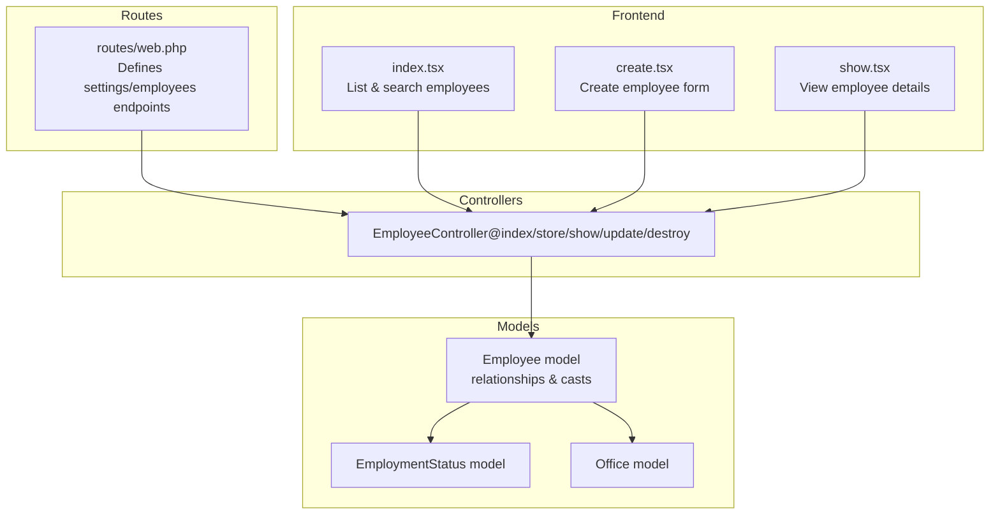
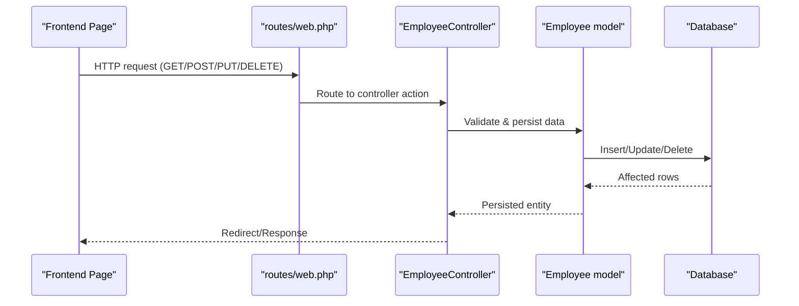
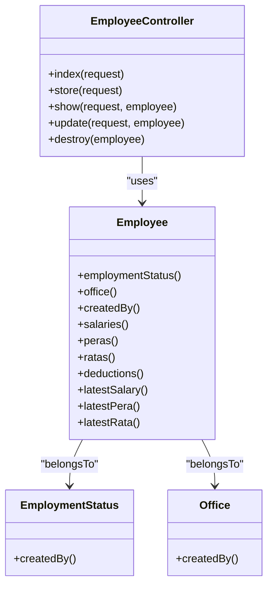

# Employee CRUD Endpoints

<cite>
**Referenced Files in This Document**
- [EmployeeController.php](file://app/Http/Controllers/EmployeeController.php)
- [Employee.php](file://app/Models/Employee.php)
- [web.php](file://routes/web.php)
- [2026_03_19_022838_create_employees_table.php](file://database/migrations/2026_03_19_022838_create_employees_table.php)
- [employee.d.ts](file://resources/js/types/employee.d.ts)
- [index.tsx](file://resources/js/pages/settings/Employee/index.tsx)
- [create.tsx](file://resources/js/pages/settings/Employee/create.tsx)
- [show.tsx](file://resources/js/pages/settings/Employee/show.tsx)
- [EmploymentStatus.php](file://app/Models/EmploymentStatus.php)
- [Office.php](file://app/Models/Office.php)
</cite>

## Table of Contents
1. [Introduction](#introduction)
2. [Project Structure](#project-structure)
3. [Core Components](#core-components)
4. [Architecture Overview](#architecture-overview)
5. [Detailed Component Analysis](#detailed-component-analysis)
6. [Dependency Analysis](#dependency-analysis)
7. [Performance Considerations](#performance-considerations)
8. [Troubleshooting Guide](#troubleshooting-guide)
9. [Conclusion](#conclusion)

## Introduction
This document provides comprehensive API documentation for employee CRUD operations within the application. It covers the HTTP endpoints for listing, creating, viewing, updating, and deleting employees, along with request/response schemas, validation rules, error handling, and practical examples. It also explains how employee data relates to employment status and office assignments, and documents filtering/search capabilities.

## Project Structure
The employee feature is implemented using Laravel backend controllers and Eloquent models, with Inertia.js frontend pages handling user interactions. Routes are defined under the settings namespace, and the database schema is managed via migrations.

**Diagram sources**
- [web.php:85-91](file://routes/web.php#L85-L91)
- [EmployeeController.php:14-137](file://app/Http/Controllers/EmployeeController.php#L14-L137)
- [Employee.php:31-44](file://app/Models/Employee.php#L31-L44)
- [index.tsx:41-231](file://resources/js/pages/settings/Employee/index.tsx#L41-L231)
- [create.tsx:33-283](file://resources/js/pages/settings/Employee/create.tsx#L33-L283)
- [show.tsx:25-142](file://resources/js/pages/settings/Employee/show.tsx#L25-L142)

**Section sources**
- [web.php:85-91](file://routes/web.php#L85-L91)
- [EmployeeController.php:14-137](file://app/Http/Controllers/EmployeeController.php#L14-L137)
- [Employee.php:31-44](file://app/Models/Employee.php#L31-L44)

## Core Components
- EmployeeController: Implements index, store, show, update, and destroy actions with validation and file upload handling.
- Employee model: Defines fillable attributes, boolean casting, and relationships to EmploymentStatus, Office, and user who created the record.
- Frontend pages: Provide search, create, and view experiences that call the backend endpoints.

Key responsibilities:
- Validation ensures required fields and constraints for employee creation/update.
- File uploads support images stored in the public disk under employees/.
- Relationships expose employment status and office details alongside employee records.

**Section sources**
- [EmployeeController.php:54-87](file://app/Http/Controllers/EmployeeController.php#L54-L87)
- [EmployeeController.php:101-126](file://app/Http/Controllers/EmployeeController.php#L101-L126)
- [EmployeeController.php:128-137](file://app/Http/Controllers/EmployeeController.php#L128-L137)
- [Employee.php:14-29](file://app/Models/Employee.php#L14-L29)
- [Employee.php:31-44](file://app/Models/Employee.php#L31-L44)

## Architecture Overview
The system follows a classic MVC pattern with Inertia rendering:
- Routes define the endpoints under settings/employees.
- Controllers handle HTTP requests, apply validation, and orchestrate persistence.
- Models encapsulate relationships and attribute casting.
- Frontend pages communicate via Inertia router to perform CRUD operations.

**Diagram sources**
- [web.php:85-91](file://routes/web.php#L85-L91)
- [EmployeeController.php:14-137](file://app/Http/Controllers/EmployeeController.php#L14-L137)
- [Employee.php:14-29](file://app/Models/Employee.php#L14-L29)

## Detailed Component Analysis

### Endpoint Definitions

#### GET /settings/employees (index)
- Purpose: Retrieve paginated list of employees with optional search.
- Query parameters:
  - search: Text to match against first_name, middle_name, last_name, or suffix.
- Response: Paginated data including employee records, related employment status and office, and applied filters.
- Sorting: Results ordered by last_name ascending.
- Pagination: Default page size is 50 with query string preservation.

Practical example:
- Request: GET /settings/employees?search=John
- Response: Includes employees array with embedded employment_status and office objects.

**Section sources**
- [EmployeeController.php:14-41](file://app/Http/Controllers/EmployeeController.php#L14-L41)
- [index.tsx:80-90](file://resources/js/pages/settings/Employee/index.tsx#L80-L90)

#### POST /settings/employees (store)
- Purpose: Create a new employee.
- Request body (multipart/form-data):
  - first_name: Required string.
  - middle_name: Optional string.
  - last_name: Required string.
  - suffix: Optional string.
  - position: Optional string.
  - is_rata_eligible: Boolean flag.
  - employment_status_id: Required integer, must exist in employment_statuses.
  - office_id: Required integer, must exist in offices.
  - photo: Optional image file (jpg, jpeg, png, webp), max 2MB.
- Response: Redirect to employees index with success message.

Validation rules summary:
- Strings constrained by max length where applicable.
- employment_status_id and office_id validated via foreign key existence checks.
- Photo validated for allowed MIME types and size.

Practical example:
- Submit multipart form with employee details and optional photo.
- On success, server responds with redirect to index.

**Section sources**
- [EmployeeController.php:54-87](file://app/Http/Controllers/EmployeeController.php#L54-L87)
- [create.tsx:37-99](file://resources/js/pages/settings/Employee/create.tsx#L37-L99)

#### GET /settings/employees/{employee} (show)
- Purpose: Open the edit view for a specific employee.
- Path parameter:
  - employee: Employee ID.
- Response: Edit page with current employee data and related lists for employment statuses and offices.

Note: This endpoint renders the edit UI; actual data loading occurs client-side via Inertia.

**Section sources**
- [EmployeeController.php:89-99](file://app/Http/Controllers/EmployeeController.php#L89-L99)
- [show.tsx:25-142](file://resources/js/pages/settings/Employee/show.tsx#L25-L142)

#### PUT /settings/employees/{employee} (update)
- Purpose: Update an existing employee.
- Path parameter:
  - employee: Employee ID.
- Request body (multipart/form-data):
  - Same as store with optional photo replacement.
- Behavior:
  - If a new photo is provided, previous photo is deleted from storage.
  - Employee record is updated with validated data.
- Response: Redirect to employees index with success message.

Practical example:
- Submit updated details and optional new photo.
- On success, server responds with redirect to index.

**Section sources**
- [EmployeeController.php:101-126](file://app/Http/Controllers/EmployeeController.php#L101-L126)
- [Employee.php:99-102](file://app/Models/Employee.php#L99-L102)

#### DELETE /settings/employees/{employee} (destroy)
- Purpose: Delete an employee.
- Path parameter:
  - employee: Employee ID.
- Behavior:
  - Deletes associated photo from storage if present.
  - Removes the employee record.
- Response: Redirect to employees index with success message.

**Section sources**
- [EmployeeController.php:128-137](file://app/Http/Controllers/EmployeeController.php#L128-L137)

### Request/Response Schemas

#### Employee Data Structure
- Backend model fields:
  - id: Integer.
  - first_name: String.
  - middle_name: Nullable String.
  - last_name: String.
  - suffix: Nullable String.
  - position: Nullable String.
  - is_rata_eligible: Boolean.
  - employment_status_id: Integer (foreign key).
  - office_id: Integer (foreign key).
  - image_path: Nullable String.
  - created_by: Integer (foreign key).
  - timestamps: created_at, updated_at.
  - softDeletes: deleted_at.

- Frontend TypeScript interface:
  - Extends backend fields with related objects and optional collections.
  - Includes employment_status and office objects, plus latest salary/pera/rata references.

- Database migration schema:
  - Defines columns, foreign keys, and cascade-on-delete behavior for related tables.

**Section sources**
- [Employee.php:14-29](file://app/Models/Employee.php#L14-L29)
- [employee.d.ts:8-29](file://resources/js/types/employee.d.ts#L8-L29)
- [2026_03_19_022838_create_employees_table.php:14-27](file://database/migrations/2026_03_19_022838_create_employees_table.php#L14-L27)

#### Related Entities
- EmploymentStatus:
  - Fields: id, name, created_by.
  - Relationship: Employee belongs to EmploymentStatus.
- Office:
  - Fields: id, name, code, created_by.
  - Relationship: Employee belongs to Office.

**Section sources**
- [EmploymentStatus.php:13-21](file://app/Models/EmploymentStatus.php#L13-L21)
- [Office.php:13-22](file://app/Models/Office.php#L13-L22)
- [Employee.php:31-44](file://app/Models/Employee.php#L31-L44)

### Filtering and Search Capabilities
- Search scope:
  - Applied on index endpoint to match search term across first_name, middle_name, last_name, and suffix.
  - Uses OR conditions to broaden matches.
- Pagination:
  - Paginates results with 50 items per page and preserves query string for consistent filtering.

**Section sources**
- [EmployeeController.php:16-28](file://app/Http/Controllers/EmployeeController.php#L16-L28)
- [index.tsx:80-90](file://resources/js/pages/settings/Employee/index.tsx#L80-L90)

### Practical Examples

#### Creating an Employee
- Steps:
  - Navigate to create page.
  - Fill out personal and employment details.
  - Optionally upload a photo.
  - Submit form.
- Expected outcome:
  - Successful submission triggers redirect to employees index with a success message.

**Section sources**
- [create.tsx:37-99](file://resources/js/pages/settings/Employee/create.tsx#L37-L99)
- [EmployeeController.php:54-87](file://app/Http/Controllers/EmployeeController.php#L54-L87)

#### Updating an Employee
- Steps:
  - Open show/edit view for the target employee.
  - Modify details and optionally replace the photo.
  - Submit changes.
- Expected outcome:
  - Previous photo is removed from storage if a new one was uploaded.
  - Redirect to employees index with a success message.

**Section sources**
- [EmployeeController.php:101-126](file://app/Http/Controllers/EmployeeController.php#L101-L126)
- [Employee.php:99-102](file://app/Models/Employee.php#L99-L102)

#### Retrieving Employee Details
- Steps:
  - From the index page, click the row or action to view details.
  - The show dialog displays employee info, department, status, and eligibility.
- Expected outcome:
  - Modal displays employee profile and related information.

**Section sources**
- [index.tsx:51-59](file://resources/js/pages/settings/Employee/index.tsx#L51-L59)
- [show.tsx:25-142](file://resources/js/pages/settings/Employee/show.tsx#L25-L142)

### Error Handling
- Validation failures:
  - Frontend displays field-specific error messages during create/update.
- Deletion:
  - Deletion attempts are handled with confirmation dialogs and toast notifications indicating success or failure.

**Section sources**
- [create.tsx:183-184](file://resources/js/pages/settings/Employee/create.tsx#L183-L184)
- [index.tsx:61-77](file://resources/js/pages/settings/Employee/index.tsx#L61-L77)
- [show.tsx:34-49](file://resources/js/pages/settings/Employee/show.tsx#L34-L49)

## Dependency Analysis

**Diagram sources**
- [EmployeeController.php:12-137](file://app/Http/Controllers/EmployeeController.php#L12-L137)
- [Employee.php:31-44](file://app/Models/Employee.php#L31-L44)

**Section sources**
- [EmployeeController.php:12-137](file://app/Http/Controllers/EmployeeController.php#L12-L137)
- [Employee.php:31-44](file://app/Models/Employee.php#L31-L44)

## Performance Considerations
- Index endpoint:
  - Applies search filter with OR conditions across four text fields; consider indexing these columns in production for improved search performance.
  - Pagination reduces payload size; keep page size reasonable.
- Image handling:
  - Photo uploads are validated for size and MIME type; ensure storage disk performance aligns with expected upload volume.
- Relationships:
  - Eager loading of employmentStatus and office avoids N+1 queries in index view.

[No sources needed since this section provides general guidance]

## Troubleshooting Guide
- Validation errors on create/update:
  - Ensure required fields are present and employment_status_id/office_id correspond to existing records.
  - Verify photo constraints (allowed types and size).
- Deletion issues:
  - Confirm the employee exists and has proper permissions.
  - Check storage disk accessibility for photo removal.
- Search not returning results:
  - Verify search term matches expected fields (names/suffix).
  - Confirm pagination and query string parameters are preserved.

**Section sources**
- [EmployeeController.php:57-67](file://app/Http/Controllers/EmployeeController.php#L57-L67)
- [EmployeeController.php:104-114](file://app/Http/Controllers/EmployeeController.php#L104-L114)
- [EmployeeController.php:128-137](file://app/Http/Controllers/EmployeeController.php#L128-L137)

## Conclusion
The employee CRUD endpoints provide a robust foundation for managing employee records, including validation, file handling, and relationship exposure. The frontend pages integrate seamlessly with the backend to deliver a responsive user experience, while the underlying models and migrations ensure data integrity and extensibility.