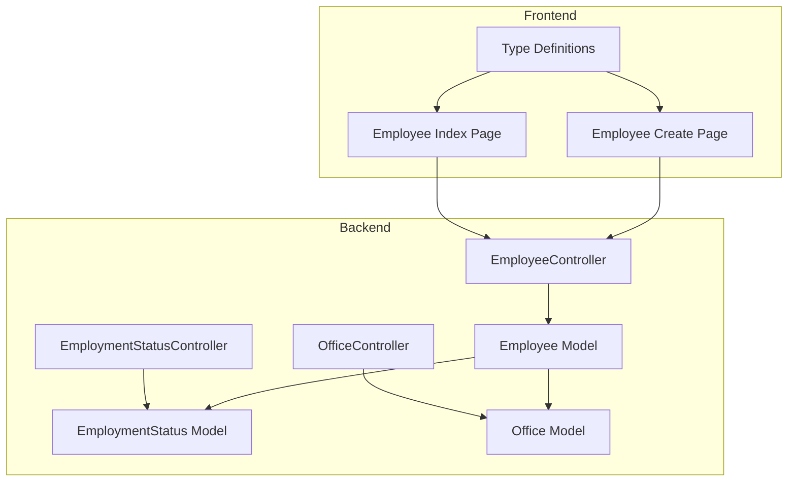
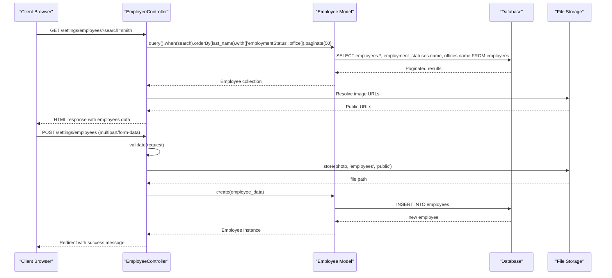
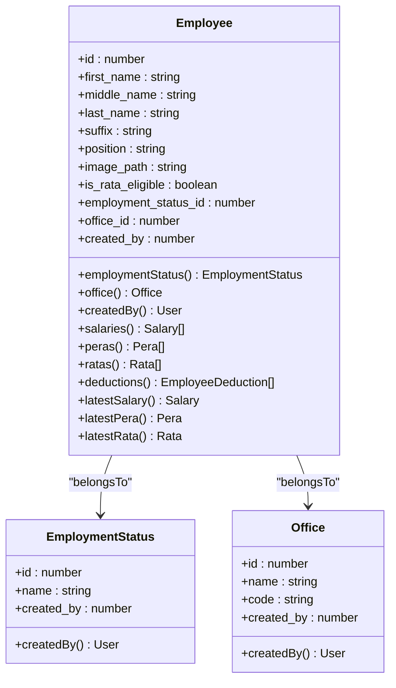
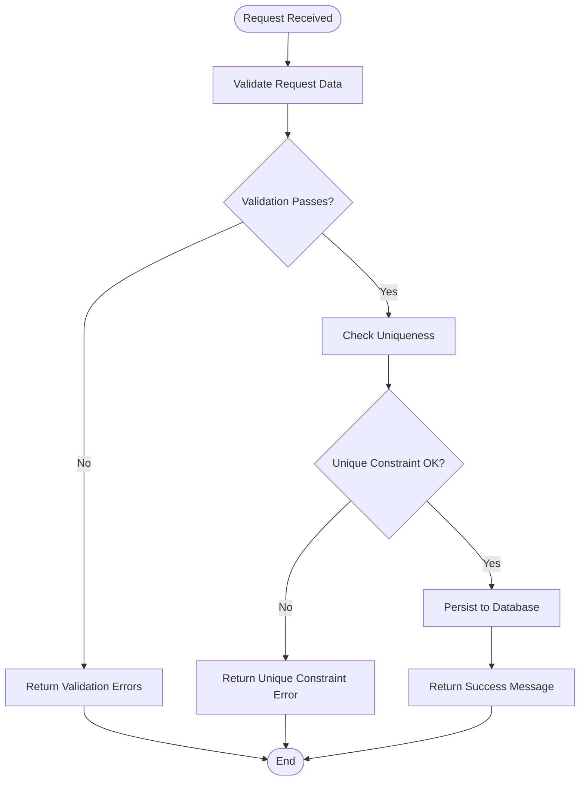
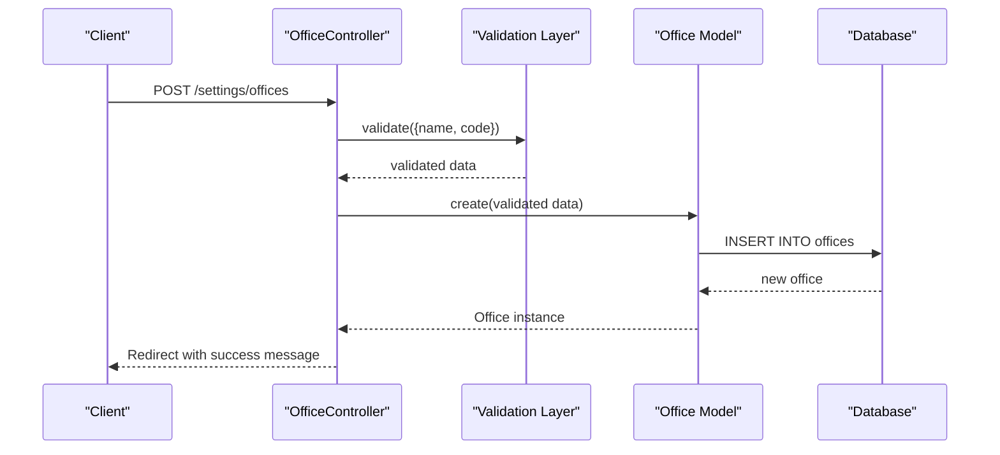
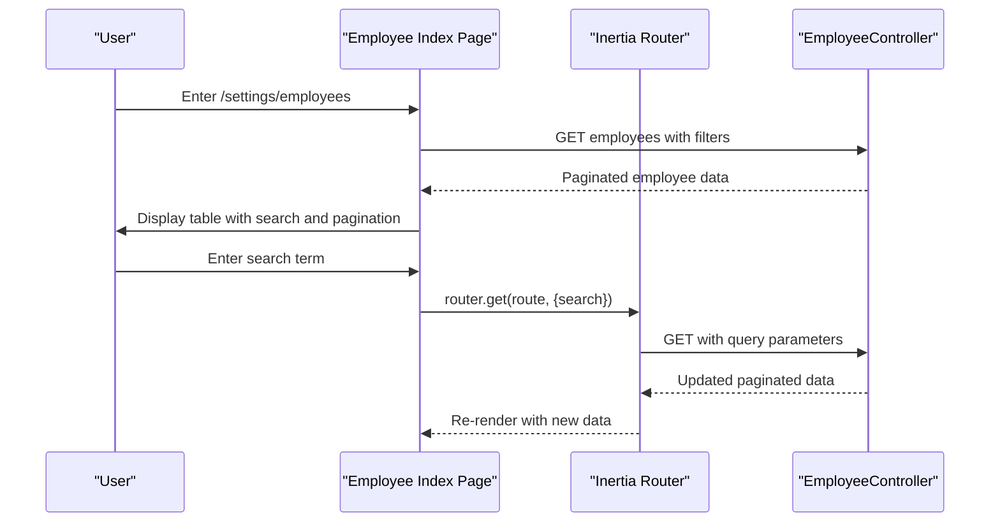
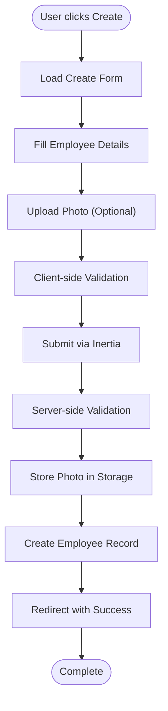
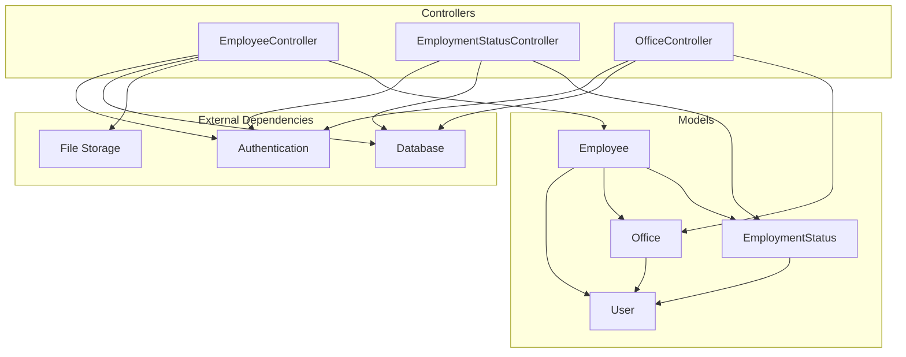
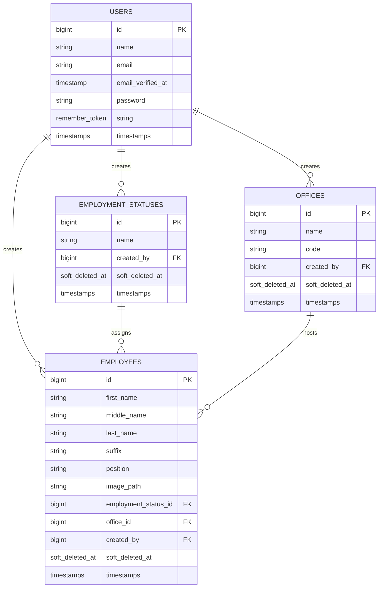

# Employee Management API

<cite>
**Referenced Files in This Document**
- [EmployeeController.php](file://app/Http/Controllers/EmployeeController.php)
- [EmploymentStatusController.php](file://app/Http/Controllers/EmploymentStatusController.php)
- [OfficeController.php](file://app/Http/Controllers/OfficeController.php)
- [Employee.php](file://app/Models/Employee.php)
- [EmploymentStatus.php](file://app/Models/EmploymentStatus.php)
- [Office.php](file://app/Models/Office.php)
- [2026_03_19_022838_create_employees_table.php](file://database/migrations/2026_03_19_022838_create_employees_table.php)
- [2026_03_19_014107_create_employee_statuses_table.php](file://database/migrations/2026_03_19_014107_create_employee_statuses_table.php)
- [2026_03_18_071422_create_offices_table.php](file://database/migrations/2026_03_18_071422_create_offices_table.php)
- [index.tsx](file://resources/js/pages/settings/Employee/index.tsx)
- [create.tsx](file://resources/js/pages/settings/Employee/create.tsx)
- [employee.d.ts](file://resources/js/types/employee.d.ts)
</cite>

## Table of Contents
1. [Introduction](#introduction)
2. [Project Structure](#project-structure)
3. [Core Components](#core-components)
4. [Architecture Overview](#architecture-overview)
5. [Detailed Component Analysis](#detailed-component-analysis)
6. [Dependency Analysis](#dependency-analysis)
7. [Performance Considerations](#performance-considerations)
8. [Troubleshooting Guide](#troubleshooting-guide)
9. [Conclusion](#conclusion)

## Introduction
This document provides comprehensive API documentation for the employee management system. It covers CRUD operations for employees, employment statuses, and office locations, along with profile management, status tracking, and organizational structure APIs. The documentation explains the relationships between employees, employment statuses, and office assignments, details request/response schemas, filtering/searching, pagination, workflows, and validation rules.

## Project Structure
The employee management system follows a Laravel backend with Inertia.js frontend architecture:
- Backend: Controllers handle HTTP requests and coordinate model interactions
- Models: Define database relationships and attributes
- Migrations: Define database schema for employees, employment statuses, and offices
- Frontend: TypeScript/React components consume the backend via Inertia routing

**Diagram sources**
- [EmployeeController.php:12-138](file://app/Http/Controllers/EmployeeController.php#L12-L138)
- [EmploymentStatusController.php:9-57](file://app/Http/Controllers/EmploymentStatusController.php#L9-L57)
- [OfficeController.php:9-60](file://app/Http/Controllers/OfficeController.php#L9-L60)
- [Employee.php:10-103](file://app/Models/Employee.php#L10-L103)
- [EmploymentStatus.php:9-31](file://app/Models/EmploymentStatus.php#L9-L31)
- [Office.php:9-32](file://app/Models/Office.php#L9-L32)
- [index.tsx:41-230](file://resources/js/pages/settings/Employee/index.tsx#L41-L230)
- [create.tsx:33-282](file://resources/js/pages/settings/Employee/create.tsx#L33-L282)
- [employee.d.ts:8-42](file://resources/js/types/employee.d.ts#L8-L42)

**Section sources**
- [EmployeeController.php:12-138](file://app/Http/Controllers/EmployeeController.php#L12-L138)
- [EmploymentStatusController.php:9-57](file://app/Http/Controllers/EmploymentStatusController.php#L9-L57)
- [OfficeController.php:9-60](file://app/Http/Controllers/OfficeController.php#L9-L60)
- [Employee.php:10-103](file://app/Models/Employee.php#L10-L103)
- [EmploymentStatus.php:9-31](file://app/Models/EmploymentStatus.php#L9-L31)
- [Office.php:9-32](file://app/Models/Office.php#L9-L32)
- [index.tsx:41-230](file://resources/js/pages/settings/Employee/index.tsx#L41-L230)
- [create.tsx:33-282](file://resources/js/pages/settings/Employee/create.tsx#L33-L282)
- [employee.d.ts:8-42](file://resources/js/types/employee.d.ts#L8-L42)

## Core Components
This section documents the primary API endpoints and their capabilities.

### Employee Management Endpoints
- GET /settings/employees
  - Purpose: Retrieve paginated list of employees with search and sorting
  - Query parameters:
    - search: Text search across first_name, middle_name, last_name, suffix
  - Response: Paginated collection with embedded employment_status and office relationships
  - Pagination: 50 items per page, preserves query string
  - Filtering: Full-text search across multiple name fields
  - Sorting: Default order by last_name ascending

- GET /settings/employees/create
  - Purpose: Render employee creation form with available employment statuses and offices
  - Response: HTML page with preloaded lookup data

- POST /settings/employees
  - Purpose: Create a new employee
  - Request body (multipart/form-data):
    - first_name: Required, string, max 255
    - middle_name: Optional, string, max 255
    - last_name: Required, string, max 255
    - suffix: Optional, string, max 255
    - position: Optional, string, max 255
    - is_rata_eligible: Boolean
    - employment_status_id: Required, integer, must exist in employment_statuses
    - office_id: Required, integer, must exist in offices
    - photo: Optional, image file (jpg, jpeg, png, webp), max 2MB
  - Response: Redirect to employees index with success message

- GET /settings/employees/{employee}
  - Purpose: Render employee edit form with current data
  - Path parameter: employee (integer ID)
  - Response: HTML page with employee data and lookup options

- PUT/PATCH /settings/employees/{employee}
  - Purpose: Update existing employee
  - Path parameter: employee (integer ID)
  - Request body: Same as create endpoint
  - Response: Redirect to employees index with success message

- DELETE /settings/employees/{employee}
  - Purpose: Delete employee (soft delete)
  - Path parameter: employee (integer ID)
  - Response: Redirect to employees index with success message

### Employment Status Management Endpoints
- GET /settings/employment-statuses
  - Purpose: Retrieve paginated employment statuses with search
  - Query parameters:
    - search: Text search across name field
  - Response: Paginated collection
  - Pagination: 10 items per page, preserves query string

- POST /settings/employment-statuses
  - Purpose: Create new employment status
  - Request body:
    - name: Required, string, unique across employment_statuses
  - Response: Back to previous page with success message

- PUT/PATCH /settings/employment-statuses/{employment_status}
  - Purpose: Update employment status
  - Path parameter: employment_status (integer ID)
  - Request body:
    - name: Required, string, unique across employment_statuses (excluding current record)
  - Response: Back to previous page with success message

- DELETE /settings/employment-statuses/{employment_status}
  - Purpose: Delete employment status
  - Path parameter: employment_status (integer ID)
  - Response: Back to previous page with success message

### Office Management Endpoints
- GET /settings/offices
  - Purpose: Retrieve paginated offices with search
  - Query parameters:
    - search: Text search across name and code fields
  - Response: Paginated collection
  - Pagination: 50 items per page, preserves query string

- POST /settings/offices
  - Purpose: Create new office
  - Request body:
    - name: Required, string, unique across offices
    - code: Required, string, unique across offices
  - Response: Back to previous page with success message

- PUT/PATCH /settings/offices/{office}
  - Purpose: Update office
  - Path parameter: office (integer ID)
  - Request body:
    - name: Required, string, unique across offices (excluding current record)
    - code: Required, string, unique across offices (excluding current record)
  - Response: Back to previous page with success message

- DELETE /settings/offices/{office}
  - Purpose: Delete office
  - Path parameter: office (integer ID)
  - Response: Back to previous page with success message

**Section sources**
- [EmployeeController.php:14-137](file://app/Http/Controllers/EmployeeController.php#L14-L137)
- [EmploymentStatusController.php:11-56](file://app/Http/Controllers/EmploymentStatusController.php#L11-L56)
- [OfficeController.php:11-59](file://app/Http/Controllers/OfficeController.php#L11-L59)

## Architecture Overview
The system implements a layered architecture with clear separation between presentation, business logic, and data persistence.

**Diagram sources**
- [EmployeeController.php:14-87](file://app/Http/Controllers/EmployeeController.php#L14-L87)
- [Employee.php:99-102](file://app/Models/Employee.php#L99-L102)

**Section sources**
- [EmployeeController.php:14-137](file://app/Http/Controllers/EmployeeController.php#L14-L137)
- [Employee.php:10-103](file://app/Models/Employee.php#L10-L103)

## Detailed Component Analysis

### Employee Model and Relationships
The Employee model defines core attributes and relationships that drive the API behavior.

**Diagram sources**
- [Employee.php:14-64](file://app/Models/Employee.php#L14-L64)
- [EmploymentStatus.php:13-21](file://app/Models/EmploymentStatus.php#L13-L21)
- [Office.php:13-22](file://app/Models/Office.php#L13-L22)

#### Data Validation Rules
The EmployeeController enforces strict validation for all create/update operations:

- Personal Information
  - first_name: required, string, max 255 characters
  - middle_name: nullable, string, max 255 characters
  - last_name: required, string, max 255 characters
  - suffix: nullable, string, max 255 characters

- Professional Information
  - position: nullable, string, max 255 characters
  - is_rata_eligible: boolean value
  - employment_status_id: required, must reference existing employment_statuses.id
  - office_id: required, must reference existing offices.id

- Media Handling
  - photo: optional, must be image file (jpg, jpeg, png, webp)
  - file size limit: 2048KB (2MB)
  - storage location: employees directory in public disk

#### Search and Filtering Implementation
The EmployeeController implements intelligent search across multiple name fields:
- Case-insensitive partial matching
- Multi-field search: first_name, middle_name, last_name, suffix
- Combined with pagination and relationship loading

**Section sources**
- [Employee.php:14-64](file://app/Models/Employee.php#L14-L64)
- [EmployeeController.php:57-83](file://app/Http/Controllers/EmployeeController.php#L57-L83)
- [EmployeeController.php:18-28](file://app/Http/Controllers/EmployeeController.php#L18-L28)

### Employment Status Management
EmploymentStatusController provides CRUD operations for employment categories.

**Diagram sources**
- [EmploymentStatusController.php:31-44](file://app/Http/Controllers/EmploymentStatusController.php#L31-L44)

#### Employment Status Schema
- name: Required, unique string (max 255 characters)
- created_by: Foreign key to users table
- Soft deletes supported

**Section sources**
- [EmploymentStatusController.php:11-56](file://app/Http/Controllers/EmploymentStatusController.php#L11-L56)
- [EmploymentStatus.php:13-30](file://app/Models/EmploymentStatus.php#L13-L30)

### Office Management
OfficeController manages organizational locations and branches.

**Diagram sources**
- [OfficeController.php:30-39](file://app/Http/Controllers/OfficeController.php#L30-L39)

#### Office Schema
- name: Required, unique string (max 255 characters)
- code: Required, unique string (max 255 characters)
- created_by: Foreign key to users table
- Soft deletes supported

**Section sources**
- [OfficeController.php:11-59](file://app/Http/Controllers/OfficeController.php#L11-L59)
- [Office.php:13-31](file://app/Models/Office.php#L13-L31)

### Frontend Integration Patterns
The frontend components demonstrate proper API consumption patterns:

#### Employee Listing Workflow

**Diagram sources**
- [index.tsx:80-90](file://resources/js/pages/settings/Employee/index.tsx#L80-L90)

#### Employee Creation Workflow

**Diagram sources**
- [create.tsx:90-99](file://resources/js/pages/settings/Employee/create.tsx#L90-L99)
- [EmployeeController.php:54-87](file://app/Http/Controllers/EmployeeController.php#L54-L87)

**Section sources**
- [index.tsx:41-230](file://resources/js/pages/settings/Employee/index.tsx#L41-L230)
- [create.tsx:33-282](file://resources/js/pages/settings/Employee/create.tsx#L33-L282)
- [employee.d.ts:8-42](file://resources/js/types/employee.d.ts#L8-L42)

## Dependency Analysis
The system exhibits clean dependency relationships with clear separation of concerns.

**Diagram sources**
- [EmployeeController.php:5-10](file://app/Http/Controllers/EmployeeController.php#L5-L10)
- [EmploymentStatusController.php:5-7](file://app/Http/Controllers/EmploymentStatusController.php#L5-L7)
- [OfficeController.php:5-7](file://app/Http/Controllers/OfficeController.php#L5-L7)
- [Employee.php:4-44](file://app/Models/Employee.php#L4-L44)
- [EmploymentStatus.php:5-21](file://app/Models/EmploymentStatus.php#L5-L21)
- [Office.php:5-22](file://app/Models/Office.php#L5-L22)

### Database Schema Relationships
The migration files define the core relationships:

**Diagram sources**
- [2026_03_19_022838_create_employees_table.php:14-27](file://database/migrations/2026_03_19_022838_create_employees_table.php#L14-L27)
- [2026_03_19_014107_create_employee_statuses_table.php:14-20](file://database/migrations/2026_03_19_014107_create_employee_statuses_table.php#L14-L20)
- [2026_03_18_071422_create_offices_table.php:14-21](file://database/migrations/2026_03_18_071422_create_offices_table.php#L14-L21)

**Section sources**
- [2026_03_19_022838_create_employees_table.php:14-27](file://database/migrations/2026_03_19_022838_create_employees_table.php#L14-L27)
- [2026_03_19_014107_create_employee_statuses_table.php:14-20](file://database/migrations/2026_03_19_014107_create_employee_statuses_table.php#L14-L20)
- [2026_03_18_071422_create_offices_table.php:14-21](file://database/migrations/2026_03_18_071422_create_offices_table.php#L14-L21)

## Performance Considerations
- Database Optimization
  - Use of eager loading (with) prevents N+1 query problems
  - Proper indexing recommended on frequently searched columns
  - Soft deletes require appropriate indexing for performance

- File Storage
  - Image files stored in public disk with URL resolution
  - Consider CDN integration for production deployments
  - Implement image compression for better performance

- Pagination Strategy
  - Default page sizes optimized for UI rendering
  - Query string preservation maintains user context during navigation

- Caching Opportunities
  - Employment statuses and offices lists cached in frontend
  - Consider server-side caching for lookup data

## Troubleshooting Guide
Common issues and resolutions:

### Validation Errors
- Field required: Ensure all required fields are present
- Unique constraint violations: Check for existing records with same name/code
- File upload failures: Verify file type, size, and permissions

### Search Issues
- No results found: Verify search terms match expected patterns
- Partial matches: Use broader search terms for initial discovery

### Image Upload Problems
- File type not supported: Ensure images are jpg, jpeg, png, or webp
- Size exceeded: Keep files under 2MB limit
- Storage permissions: Verify public disk write permissions

### Relationship Issues
- Foreign key constraints: Ensure employment_status_id and office_id exist
- Soft delete conflicts: Check for archived records affecting queries

**Section sources**
- [EmployeeController.php:57-83](file://app/Http/Controllers/EmployeeController.php#L57-L83)
- [EmploymentStatusController.php:31-44](file://app/Http/Controllers/EmploymentStatusController.php#L31-L44)
- [OfficeController.php:32-47](file://app/Http/Controllers/OfficeController.php#L32-L47)

## Conclusion
The employee management API provides a robust foundation for HR operations with clear separation of concerns, comprehensive validation, and intuitive workflows. The system supports essential CRUD operations with advanced search, pagination, and media handling capabilities. The modular design allows for easy extension while maintaining data integrity through proper relationships and constraints.