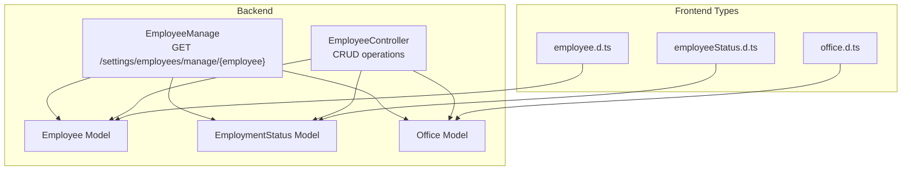
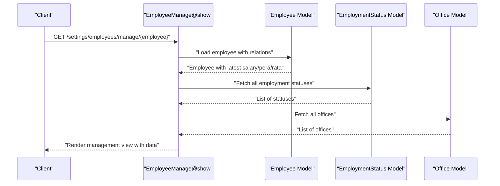
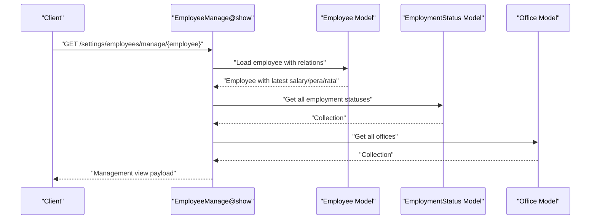
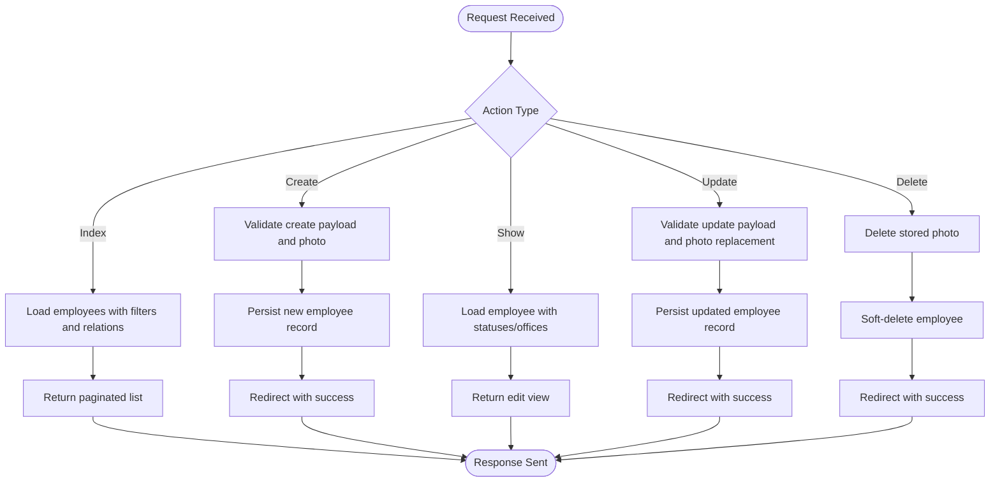
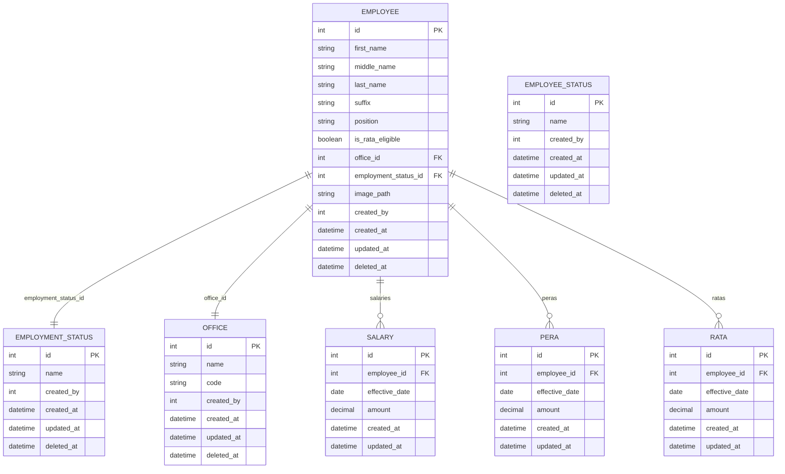
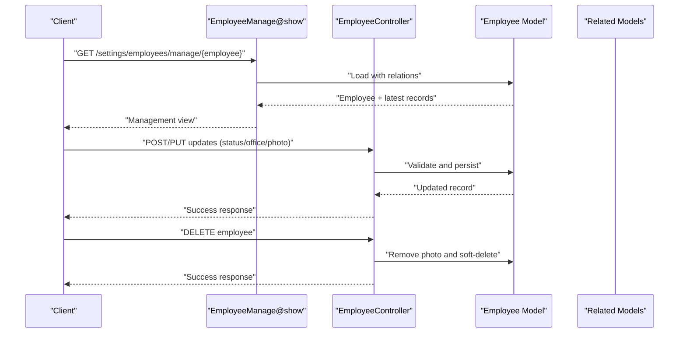
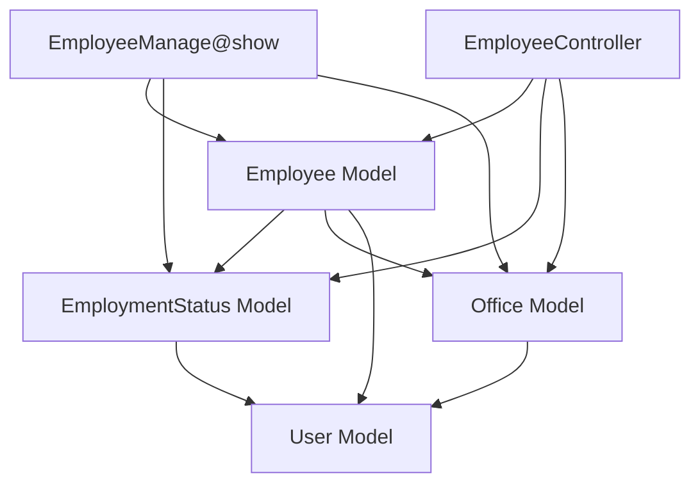

# Employee Management Workflow

<cite>
**Referenced Files in This Document**
- [EmployeeManage.php](file://app/Http/Controllers/EmployeeManage.php)
- [EmployeeController.php](file://app/Http/Controllers/EmployeeController.php)
- [Employee.php](file://app/Models/Employee.php)
- [EmploymentStatus.php](file://app/Models/EmploymentStatus.php)
- [Office.php](file://app/Models/Office.php)
- [employee.d.ts](file://resources/js/types/employee.d.ts)
- [employeeStatus.d.ts](file://resources/js/types/employeeStatus.d.ts)
- [office.d.ts](file://resources/js/types/office.d.ts)
</cite>

## Table of Contents
1. [Introduction](#introduction)
2. [Project Structure](#project-structure)
3. [Core Components](#core-components)
4. [Architecture Overview](#architecture-overview)
5. [Detailed Component Analysis](#detailed-component-analysis)
6. [Dependency Analysis](#dependency-analysis)
7. [Performance Considerations](#performance-considerations)
8. [Troubleshooting Guide](#troubleshooting-guide)
9. [Conclusion](#conclusion)

## Introduction
This document provides comprehensive API documentation for the employee management workflow, focusing on the GET /settings/employees/manage/{employee} endpoint that powers the employee management interface. It explains how employee data flows through the backend controller, how related entities (employment status, office, latest salary/pera/rata) are integrated, and how this endpoint supports profile viewing, status updates, and organizational changes. It also documents the data relationships and cascading updates between employee records and related entities, and illustrates end-to-end employee lifecycle management from creation to status changes.

## Project Structure
The employee management workflow spans backend controllers and models, and the frontend types that define the shape of employee-related data. The key backend components are:
- Controller for the management view: EmployeeManage.php
- CRUD controller for employees: EmployeeController.php
- Models for Employee, EmploymentStatus, and Office
- Frontend TypeScript types for Employee and related entities

**Diagram sources**
- [EmployeeManage.php:13-25](file://app/Http/Controllers/EmployeeManage.php#L13-L25)
- [EmployeeController.php:89-99](file://app/Http/Controllers/EmployeeController.php#L89-L99)
- [Employee.php:10-104](file://app/Models/Employee.php#L10-L104)
- [EmploymentStatus.php:9-32](file://app/Models/EmploymentStatus.php#L9-L32)
- [Office.php:9-33](file://app/Models/Office.php#L9-L33)
- [employee.d.ts:8-29](file://resources/js/types/employee.d.ts#L8-L29)
- [employeeStatus.d.ts:1-5](file://resources/js/types/employeeStatus.d.ts#L1-L5)
- [office.d.ts:1-8](file://resources/js/types/office.d.ts#L1-L8)

**Section sources**
- [EmployeeManage.php:13-25](file://app/Http/Controllers/EmployeeManage.php#L13-L25)
- [EmployeeController.php:89-99](file://app/Http/Controllers/EmployeeController.php#L89-L99)
- [Employee.php:10-104](file://app/Models/Employee.php#L10-L104)
- [EmploymentStatus.php:9-32](file://app/Models/EmploymentStatus.php#L9-L32)
- [Office.php:9-33](file://app/Models/Office.php#L9-L33)
- [employee.d.ts:8-29](file://resources/js/types/employee.d.ts#L8-L29)
- [employeeStatus.d.ts:1-5](file://resources/js/types/employeeStatus.d.ts#L1-L5)
- [office.d.ts:1-8](file://resources/js/types/office.d.ts#L1-L8)

## Core Components
This section documents the primary components involved in the employee management workflow and their roles.

- EmployeeManage Controller
  - Purpose: Renders the employee management page for a specific employee, loading related data (office, employment status, latest salary/pera/rata) and available options (employment statuses, offices).
  - Endpoint: GET /settings/employees/manage/{employee}
  - Key behavior: Eager loads related entities and passes them to the frontend view.

- Employee Controller
  - Purpose: Provides CRUD operations for employees, including listing, creating, updating, and deleting employees.
  - Key behavior: Validates inputs, handles photo uploads, and manages soft-deleted employee records.

- Employee Model
  - Purpose: Defines attributes, casts, and relationships for employees, including latest salary/pera/rata retrieval helpers.
  - Key behavior: Automatically sets created_by on creation and resolves image URLs.

- EmploymentStatus and Office Models
  - Purpose: Define lookup/reference entities for employment status and office assignments.
  - Key behavior: Track created_by and support soft deletes.

- Frontend Types
  - Purpose: Define TypeScript interfaces for Employee, EmploymentStatus, and Office, including optional collections and latest records.

**Section sources**
- [EmployeeManage.php:13-25](file://app/Http/Controllers/EmployeeManage.php#L13-L25)
- [EmployeeController.php:14-41](file://app/Http/Controllers/EmployeeController.php#L14-L41)
- [EmployeeController.php:54-87](file://app/Http/Controllers/EmployeeController.php#L54-L87)
- [EmployeeController.php:101-126](file://app/Http/Controllers/EmployeeController.php#L101-L126)
- [EmployeeController.php:128-137](file://app/Http/Controllers/EmployeeController.php#L128-L137)
- [Employee.php:31-88](file://app/Models/Employee.php#L31-L88)
- [EmploymentStatus.php:18-30](file://app/Models/EmploymentStatus.php#L18-L30)
- [Office.php:19-31](file://app/Models/Office.php#L19-L31)
- [employee.d.ts:8-29](file://resources/js/types/employee.d.ts#L8-L29)
- [employeeStatus.d.ts:1-5](file://resources/js/types/employeeStatus.d.ts#L1-L5)
- [office.d.ts:1-8](file://resources/js/types/office.d.ts#L1-L8)

## Architecture Overview
The employee management workflow follows a layered architecture:
- HTTP requests are handled by controllers.
- Controllers load models and related data.
- Models encapsulate business logic and relationships.
- Frontend consumes typed data via Inertia-rendered pages.

**Diagram sources**
- [EmployeeManage.php:13-25](file://app/Http/Controllers/EmployeeManage.php#L13-L25)
- [Employee.php:66-88](file://app/Models/Employee.php#L66-L88)
- [EmploymentStatus.php:9-32](file://app/Models/EmploymentStatus.php#L9-L32)
- [Office.php:9-33](file://app/Models/Office.php#L9-L33)

## Detailed Component Analysis

### GET /settings/employees/manage/{employee} Endpoint
- Method: GET
- Route: /settings/employees/manage/{employee}
- Controller: EmployeeManage@show
- Purpose: Provide the comprehensive employee management interface for a single employee.
- Data flow:
  - Load the target employee and eager-load related entities: office, employmentStatus, latestSalary, latestPera, latestRata.
  - Fetch all employment statuses and offices for selection in the UI.
  - Render the management view with the loaded data.

**Diagram sources**
- [EmployeeManage.php:13-25](file://app/Http/Controllers/EmployeeManage.php#L13-L25)
- [Employee.php:66-88](file://app/Models/Employee.php#L66-L88)
- [EmploymentStatus.php:9-32](file://app/Models/EmploymentStatus.php#L9-L32)
- [Office.php:9-33](file://app/Models/Office.php#L9-L33)

**Section sources**
- [EmployeeManage.php:13-25](file://app/Http/Controllers/EmployeeManage.php#L13-L25)

### Employee CRUD Operations and Related Management Functions
- Listing Employees: EmployeeController@index
  - Supports search across names and orders by last name.
  - Includes employment status and office relationships.
- Creating Employees: EmployeeController@store
  - Validates required fields and optional photo upload.
  - Stores photo in storage and sets created_by automatically.
- Viewing Employee Details: EmployeeController@show
  - Loads employee with employment statuses and offices for editing.
- Updating Employees: EmployeeController@update
  - Validates updates, replaces photo if provided, and persists changes.
- Deleting Employees: EmployeeController@destroy
  - Deletes associated photo and soft-deletes the employee record.

**Diagram sources**
- [EmployeeController.php:14-41](file://app/Http/Controllers/EmployeeController.php#L14-L41)
- [EmployeeController.php:54-87](file://app/Http/Controllers/EmployeeController.php#L54-L87)
- [EmployeeController.php:89-99](file://app/Http/Controllers/EmployeeController.php#L89-L99)
- [EmployeeController.php:101-126](file://app/Http/Controllers/EmployeeController.php#L101-L126)
- [EmployeeController.php:128-137](file://app/Http/Controllers/EmployeeController.php#L128-L137)

**Section sources**
- [EmployeeController.php:14-41](file://app/Http/Controllers/EmployeeController.php#L14-L41)
- [EmployeeController.php:54-87](file://app/Http/Controllers/EmployeeController.php#L54-L87)
- [EmployeeController.php:89-99](file://app/Http/Controllers/EmployeeController.php#L89-L99)
- [EmployeeController.php:101-126](file://app/Http/Controllers/EmployeeController.php#L101-L126)
- [EmployeeController.php:128-137](file://app/Http/Controllers/EmployeeController.php#L128-L137)

### Data Relationships and Cascading Updates
- Employee belongs to EmploymentStatus and Office.
- Employee has many Salaries, PERAs, RATAs, and EmployeeDeductions.
- Latest records are accessed via latest* helpers on the Employee model.
- Image path resolution returns a URL via storage.
- created_by is set automatically on creation for Employee, EmploymentStatus, and Office.

**Diagram sources**
- [Employee.php:14-25](file://app/Models/Employee.php#L14-L25)
- [Employee.php:31-88](file://app/Models/Employee.php#L31-L88)
- [EmploymentStatus.php:13-16](file://app/Models/EmploymentStatus.php#L13-L16)
- [Office.php:13-17](file://app/Models/Office.php#L13-L17)

**Section sources**
- [Employee.php:14-25](file://app/Models/Employee.php#L14-L25)
- [Employee.php:31-88](file://app/Models/Employee.php#L31-L88)
- [EmploymentStatus.php:13-16](file://app/Models/EmploymentStatus.php#L13-L16)
- [Office.php:13-17](file://app/Models/Office.php#L13-L17)

### Employee Lifecycle Management Examples
- Creation
  - Client submits create request with personal info, employment status, office, optional photo.
  - Backend validates, stores photo, creates employee record, sets created_by.
  - Redirect to employee list with success message.
- Status Update
  - Client navigates to management view for the employee.
  - Controller loads employee with latest salary/pera/rata and available statuses/offices.
  - Client updates employment status or office; backend persists changes.
- Organizational Change
  - Client updates office assignment; backend persists and reflects in management view.
- Deletion
  - Client triggers delete; backend removes stored photo and soft-deletes the employee.

**Diagram sources**
- [EmployeeManage.php:13-25](file://app/Http/Controllers/EmployeeManage.php#L13-L25)
- [EmployeeController.php:54-87](file://app/Http/Controllers/EmployeeController.php#L54-L87)
- [EmployeeController.php:101-126](file://app/Http/Controllers/EmployeeController.php#L101-L126)
- [EmployeeController.php:128-137](file://app/Http/Controllers/EmployeeController.php#L128-L137)
- [Employee.php:66-88](file://app/Models/Employee.php#L66-L88)

**Section sources**
- [EmployeeManage.php:13-25](file://app/Http/Controllers/EmployeeManage.php#L13-L25)
- [EmployeeController.php:54-87](file://app/Http/Controllers/EmployeeController.php#L54-L87)
- [EmployeeController.php:101-126](file://app/Http/Controllers/EmployeeController.php#L101-L126)
- [EmployeeController.php:128-137](file://app/Http/Controllers/EmployeeController.php#L128-L137)
- [Employee.php:66-88](file://app/Models/Employee.php#L66-L88)

## Dependency Analysis
- Controller dependencies:
  - EmployeeManage depends on Employee, EmploymentStatus, and Office models to render the management view.
  - EmployeeController depends on Employee, EmploymentStatus, Office, and Storage for CRUD operations.
- Model dependencies:
  - Employee depends on EmploymentStatus, Office, User (via created_by), and has relations to Salaries, PERAs, RATAs, and EmployeeDeductions.
  - EmploymentStatus and Office depend on User for created_by tracking.
- Frontend type dependencies:
  - Employee type references EmploymentStatus and Office, and optional arrays/latest records for related entities.

**Diagram sources**
- [EmployeeManage.php:5-8](file://app/Http/Controllers/EmployeeManage.php#L5-L8)
- [EmployeeController.php:5-10](file://app/Http/Controllers/EmployeeController.php#L5-L10)
- [Employee.php:31-44](file://app/Models/Employee.php#L31-L44)
- [EmploymentStatus.php:18-21](file://app/Models/EmploymentStatus.php#L18-L21)
- [Office.php:19-22](file://app/Models/Office.php#L19-L22)

**Section sources**
- [EmployeeManage.php:5-8](file://app/Http/Controllers/EmployeeManage.php#L5-L8)
- [EmployeeController.php:5-10](file://app/Http/Controllers/EmployeeController.php#L5-L10)
- [Employee.php:31-44](file://app/Models/Employee.php#L31-L44)
- [EmploymentStatus.php:18-21](file://app/Models/EmploymentStatus.php#L18-L21)
- [Office.php:19-22](file://app/Models/Office.php#L19-L22)

## Performance Considerations
- Eager loading: EmployeeManage loads office, employmentStatus, latestSalary, latestPera, and latestRata to avoid N+1 queries.
- Pagination: Employee listing uses pagination to limit result set size.
- Image handling: Photo uploads are stored in public disk; ensure appropriate storage configuration and cleanup on deletion.
- Relationship queries: latest* helpers order by effective_date to fetch most recent records efficiently.

[No sources needed since this section provides general guidance]

## Troubleshooting Guide
- Missing route binding for {employee}: Ensure route model binding is configured for Employee resource.
- Photo upload failures: Validate file size, MIME types, and storage permissions.
- Empty latest records: latest* helpers return empty collections when no related records exist; handle gracefully in the frontend.
- Soft-deleted employees: Deletion routes soft-delete; ensure UI respects this state and provides restore functionality if needed.

**Section sources**
- [EmployeeController.php:128-137](file://app/Http/Controllers/EmployeeController.php#L128-L137)
- [Employee.php:66-88](file://app/Models/Employee.php#L66-L88)

## Conclusion
The employee management workflow integrates a focused management endpoint with robust CRUD operations and strong data modeling. The GET /settings/employees/manage/{employee} endpoint centralizes profile viewing, status updates, and organizational changes by loading related entities and exposing them to the frontend. Clear data relationships and automatic created_by tracking simplify auditability and lifecycle management. Following the documented patterns ensures consistent behavior across the employee lifecycle.