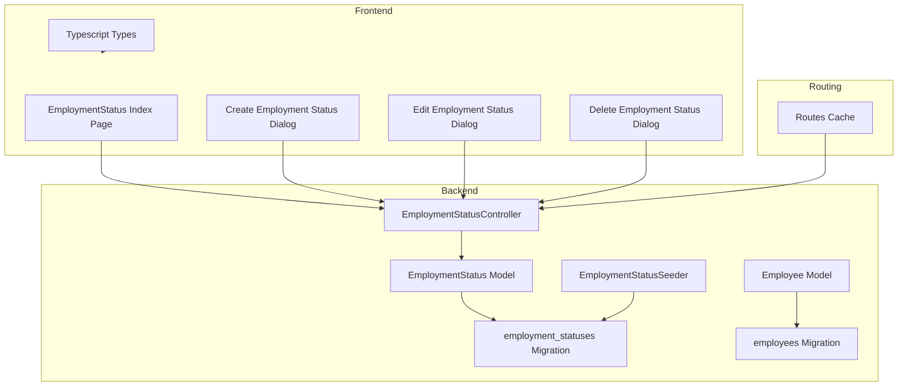
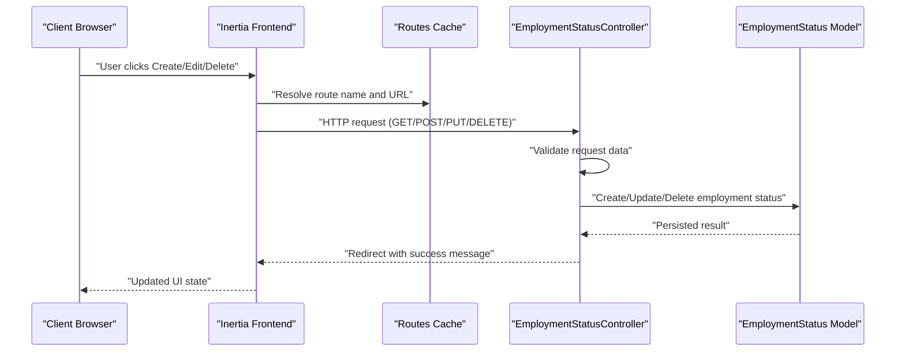
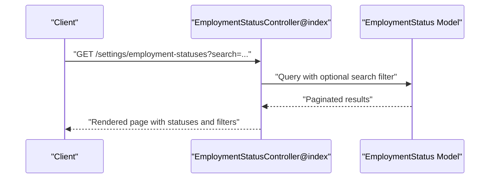
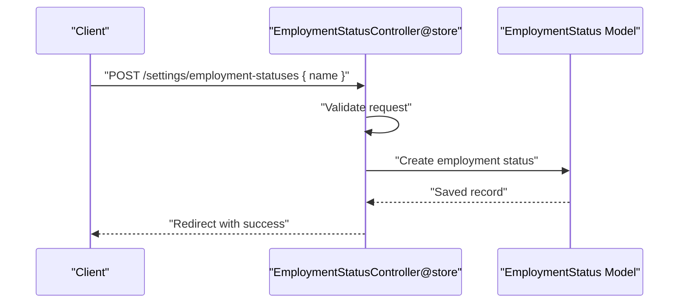
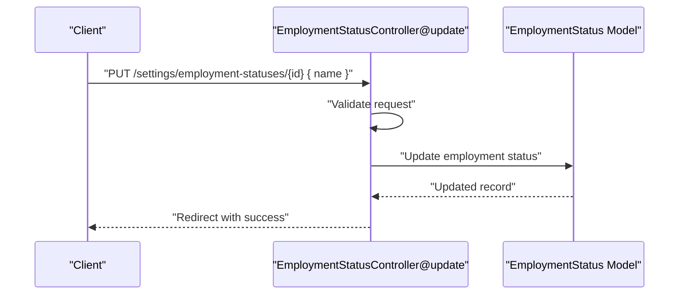
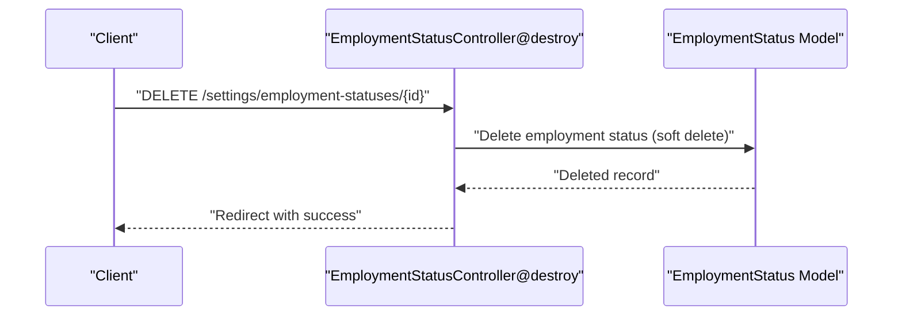
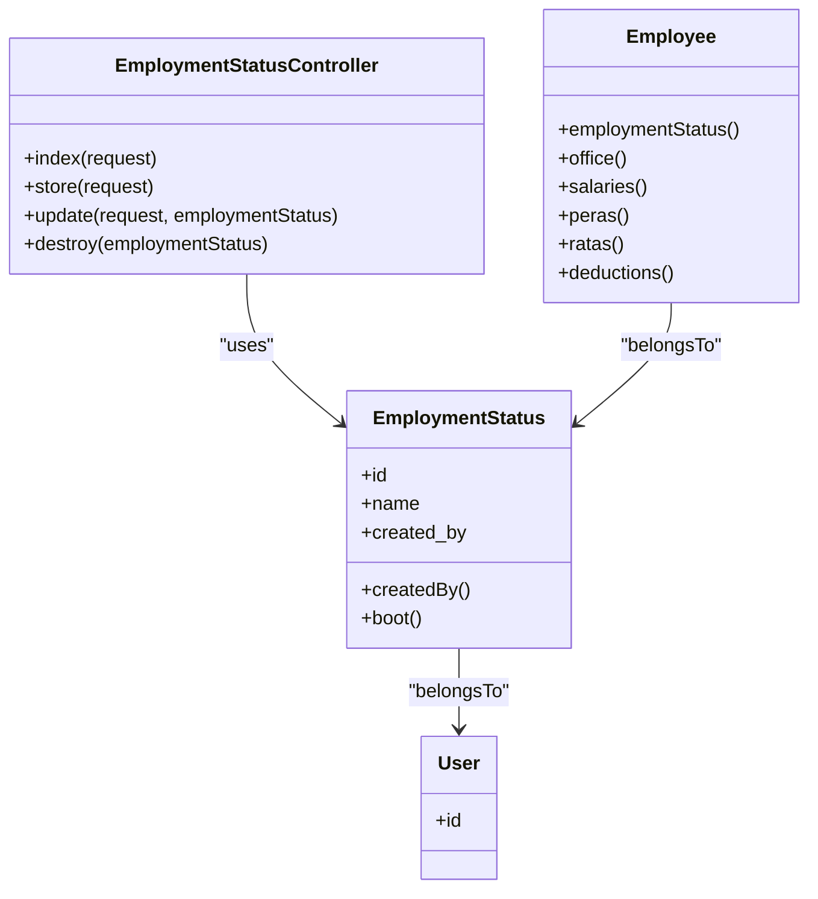

# Employment Status Endpoints

<cite>
**Referenced Files in This Document**
- [EmploymentStatusController.php](file://app/Http/Controllers/EmploymentStatusController.php)
- [EmploymentStatus.php](file://app/Models/EmploymentStatus.php)
- [Employee.php](file://app/Models/Employee.php)
- [create_employment_statuses_table.php](file://database/migrations/2026_03_19_014108_create_employment_statuses_table.php)
- [create_employees_table.php](file://database/migrations/2026_03_19_022838_create_employees_table.php)
- [routes-v7.php](file://bootstrap/cache/routes-v7.php)
- [employmentStatuses.d.ts](file://resources/js/types/employmentStatuses.d.ts)
- [index.tsx](file://resources/js/pages/settings/EmploymentStatus/index.tsx)
- [create.tsx](file://resources/js/pages/settings/EmploymentStatus/create.tsx)
- [edit.tsx](file://resources/js/pages/settings/EmploymentStatus/edit.tsx)
- [delete.tsx](file://resources/js/pages/settings/EmploymentStatus/delete.tsx)
- [EmploymentStatusSeeder.php](file://database/seeders/EmploymentStatusSeeder.php)
</cite>

## Table of Contents
1. [Introduction](#introduction)
2. [Project Structure](#project-structure)
3. [Core Components](#core-components)
4. [Architecture Overview](#architecture-overview)
5. [Detailed Component Analysis](#detailed-component-analysis)
6. [Dependency Analysis](#dependency-analysis)
7. [Performance Considerations](#performance-considerations)
8. [Troubleshooting Guide](#troubleshooting-guide)
9. [Conclusion](#conclusion)

## Introduction
This document provides comprehensive API documentation for employment status management endpoints. It covers the four primary operations: listing employment statuses, creating new statuses, updating existing statuses, and deleting statuses. The documentation includes data structures, validation rules, business logic, and the relationship between employment statuses and employee records. It also provides examples of status creation, updates, and deletion operations, along with status categories and their impact on employee management workflows.

## Project Structure
The employment status feature spans backend controllers and models, database migrations, frontend pages/components, and routing configuration. The key components are organized as follows:
- Backend: Controller handles HTTP requests, model manages persistence and relationships, migrations define database schema.
- Frontend: Pages and dialogs implement user interactions for listing, creating, editing, and deleting employment statuses.
- Routing: Routes map URLs to controller actions.

**Diagram sources**
- [EmploymentStatusController.php:1-58](file://app/Http/Controllers/EmploymentStatusController.php#L1-L58)
- [EmploymentStatus.php:1-32](file://app/Models/EmploymentStatus.php#L1-L32)
- [Employee.php:1-104](file://app/Models/Employee.php#L1-L104)
- [create_employment_statuses_table.php:1-31](file://database/migrations/2026_03_19_014108_create_employment_statuses_table.php#L1-L31)
- [create_employees_table.php:1-38](file://database/migrations/2026_03_19_022838_create_employees_table.php#L1-L38)
- [routes-v7.php:2081-2214](file://bootstrap/cache/routes-v7.php#L2081-L2214)
- [employmentStatuses.d.ts:1-7](file://resources/js/types/employmentStatuses.d.ts#L1-L7)
- [index.tsx:1-177](file://resources/js/pages/settings/EmploymentStatus/index.tsx#L1-L177)
- [create.tsx:1-72](file://resources/js/pages/settings/EmploymentStatus/create.tsx#L1-L72)
- [edit.tsx:1-82](file://resources/js/pages/settings/EmploymentStatus/edit.tsx#L1-L82)
- [delete.tsx:1-46](file://resources/js/pages/settings/EmploymentStatus/delete.tsx#L1-L46)
- [EmploymentStatusSeeder.php:1-24](file://database/seeders/EmploymentStatusSeeder.php#L1-L24)

**Section sources**
- [EmploymentStatusController.php:1-58](file://app/Http/Controllers/EmploymentStatusController.php#L1-L58)
- [EmploymentStatus.php:1-32](file://app/Models/EmploymentStatus.php#L1-L32)
- [Employee.php:1-104](file://app/Models/Employee.php#L1-L104)
- [create_employment_statuses_table.php:1-31](file://database/migrations/2026_03_19_014108_create_employment_statuses_table.php#L1-L31)
- [create_employees_table.php:1-38](file://database/migrations/2026_03_19_022838_create_employees_table.php#L1-L38)
- [routes-v7.php:2081-2214](file://bootstrap/cache/routes-v7.php#L2081-L2214)
- [employmentStatuses.d.ts:1-7](file://resources/js/types/employmentStatuses.d.ts#L1-L7)
- [index.tsx:1-177](file://resources/js/pages/settings/EmploymentStatus/index.tsx#L1-L177)
- [create.tsx:1-72](file://resources/js/pages/settings/EmploymentStatus/create.tsx#L1-L72)
- [edit.tsx:1-82](file://resources/js/pages/settings/EmploymentStatus/edit.tsx#L1-L82)
- [delete.tsx:1-46](file://resources/js/pages/settings/EmploymentStatus/delete.tsx#L1-L46)
- [EmploymentStatusSeeder.php:1-24](file://database/seeders/EmploymentStatusSeeder.php#L1-L24)

## Core Components
This section documents the employment status data model, validation rules, and business logic.

- Data Model
  - EmploymentStatus model defines the employment status entity with attributes for name and audit fields. It includes soft deletes and an automatic creator association.
  - The model defines a belongs-to relationship with the User model for the creator and a static boot method to set the current authenticated user as the creator during creation.

- Validation Rules
  - Creation and update operations enforce uniqueness of the name field across employment statuses.
  - Both operations require a non-empty name string with a maximum length constraint.

- Business Logic
  - On creation, the system automatically sets the created_by field to the currently authenticated user.
  - Deletion uses soft deletes, preserving referential integrity for associated employee records.

- Relationship with Employees
  - Employees are linked to employment statuses via a foreign key relationship. Deleting an employment status triggers cascading deletion of dependent employee records.

**Section sources**
- [EmploymentStatus.php:1-32](file://app/Models/EmploymentStatus.php#L1-L32)
- [EmploymentStatusController.php:29-56](file://app/Http/Controllers/EmploymentStatusController.php#L29-L56)
- [create_employment_statuses_table.php:14-20](file://database/migrations/2026_03_19_014108_create_employment_statuses_table.php#L14-L20)
- [create_employees_table.php:22-24](file://database/migrations/2026_03_19_022838_create_employees_table.php#L22-L24)
- [Employee.php:31-34](file://app/Models/Employee.php#L31-L34)

## Architecture Overview
The employment status feature follows a layered architecture:
- Frontend pages and dialogs trigger Inertia.js requests to backend routes.
- Routes map to the EmploymentStatusController actions.
- Controllers validate input, interact with the EmploymentStatus model, and return redirects with success messages.
- The model persists data and enforces business rules.
- Database migrations define the schema and relationships.

**Diagram sources**
- [routes-v7.php:2081-2214](file://bootstrap/cache/routes-v7.php#L2081-L2214)
- [EmploymentStatusController.php:11-56](file://app/Http/Controllers/EmploymentStatusController.php#L11-L56)
- [EmploymentStatus.php:13-30](file://app/Models/EmploymentStatus.php#L13-L30)

**Section sources**
- [routes-v7.php:2081-2214](file://bootstrap/cache/routes-v7.php#L2081-L2214)
- [EmploymentStatusController.php:1-58](file://app/Http/Controllers/EmploymentStatusController.php#L1-L58)
- [index.tsx:1-177](file://resources/js/pages/settings/EmploymentStatus/index.tsx#L1-L177)

## Detailed Component Analysis

### API Endpoints

#### GET /settings/employment-statuses (Index)
- Purpose: Retrieve paginated employment statuses with optional search filtering.
- Query Parameters:
  - search: Optional string to filter by name.
- Response: Returns a paginated collection suitable for frontend rendering.
- Business Logic:
  - Filters results by name using a case-insensitive pattern match.
  - Paginates results with query string preservation for stateful navigation.

**Diagram sources**
- [EmploymentStatusController.php:11-27](file://app/Http/Controllers/EmploymentStatusController.php#L11-L27)
- [routes-v7.php:2081-2103](file://bootstrap/cache/routes-v7.php#L2081-L2103)

**Section sources**
- [EmploymentStatusController.php:11-27](file://app/Http/Controllers/EmploymentStatusController.php#L11-L27)
- [routes-v7.php:2081-2103](file://bootstrap/cache/routes-v7.php#L2081-L2103)

#### POST /settings/employment-statuses (Store)
- Purpose: Create a new employment status.
- Request Body:
  - name: Required string, unique across employment statuses, max length 255.
- Response: Redirects back with a success message.
- Validation: Enforces presence, length, and uniqueness of name.

**Diagram sources**
- [EmploymentStatusController.php:29-38](file://app/Http/Controllers/EmploymentStatusController.php#L29-L38)
- [routes-v7.php:2119-2140](file://bootstrap/cache/routes-v7.php#L2119-L2140)

**Section sources**
- [EmploymentStatusController.php:29-38](file://app/Http/Controllers/EmploymentStatusController.php#L29-L38)
- [routes-v7.php:2119-2140](file://bootstrap/cache/routes-v7.php#L2119-L2140)

#### PUT /settings/employment-statuses/{employmentStatus} (Update)
- Purpose: Update an existing employment status.
- Path Parameter:
  - employmentStatus: Employment status identifier.
- Request Body:
  - name: Required string, unique across employment statuses (excluding the current record), max length 255.
- Response: Redirects back with a success message.
- Validation: Enforces presence, length, and uniqueness of name.

**Diagram sources**
- [EmploymentStatusController.php:40-49](file://app/Http/Controllers/EmploymentStatusController.php#L40-L49)
- [routes-v7.php:2156-2177](file://bootstrap/cache/routes-v7.php#L2156-L2177)

**Section sources**
- [EmploymentStatusController.php:40-49](file://app/Http/Controllers/EmploymentStatusController.php#L40-L49)
- [routes-v7.php:2156-2177](file://bootstrap/cache/routes-v7.php#L2156-L2177)

#### DELETE /settings/employment-statuses/{employmentStatus} (Destroy)
- Purpose: Delete an employment status.
- Path Parameter:
  - employmentStatus: Employment status identifier.
- Response: Redirects back with a success message.
- Behavior: Uses soft deletes, preserving referential integrity for associated employee records.

**Diagram sources**
- [EmploymentStatusController.php:51-56](file://app/Http/Controllers/EmploymentStatusController.php#L51-L56)
- [routes-v7.php:2193-2214](file://bootstrap/cache/routes-v7.php#L2193-L2214)

**Section sources**
- [EmploymentStatusController.php:51-56](file://app/Http/Controllers/EmploymentStatusController.php#L51-L56)
- [routes-v7.php:2193-2214](file://bootstrap/cache/routes-v7.php#L2193-L2214)

### Data Structures and Validation

- Employment Status Entity
  - Fields:
    - id: Integer identifier.
    - name: String, unique, required.
    - created_by: Integer, foreign key to users.
  - Relationships:
    - Belongs to User (creator).
  - Notes:
    - Soft-deleted records are supported.

- TypeScript Types
  - EmploymentStatus: Includes id, name, created_by.
  - EmploymentStatusCreateRequest: Omit(id, created_by) for creation requests.

- Validation Rules
  - name: required, string, max 255, unique employment_statuses.name.

**Section sources**
- [EmploymentStatus.php:13-21](file://app/Models/EmploymentStatus.php#L13-L21)
- [employmentStatuses.d.ts:1-7](file://resources/js/types/employmentStatuses.d.ts#L1-L7)
- [EmploymentStatusController.php:31-44](file://app/Http/Controllers/EmploymentStatusController.php#L31-L44)

### Business Logic and Workflows

- Creation Workflow
  - The system automatically assigns the current authenticated user as the creator.
  - Uniqueness validation prevents duplicate names.

- Update Workflow
  - Uniqueness validation excludes the current record to allow renaming to an existing name.

- Deletion Workflow
  - Soft deletes are applied; cascading delete ensures dependent employee records are removed.

- Impact on Employee Management
  - Employees reference employment statuses via foreign keys. Deleting a status removes dependent employee records, ensuring data consistency.

**Section sources**
- [EmploymentStatus.php:23-30](file://app/Models/EmploymentStatus.php#L23-L30)
- [create_employment_statuses_table.php:17-18](file://database/migrations/2026_03_19_014108_create_employment_statuses_table.php#L17-L18)
- [create_employees_table.php:22-24](file://database/migrations/2026_03_19_022838_create_employees_table.php#L22-L24)
- [Employee.php:31-34](file://app/Models/Employee.php#L31-L34)

### Examples

- Creating a Status
  - Endpoint: POST /settings/employment-statuses
  - Request: { name: "Permanent" }
  - Expected Outcome: Employment status created with current user as creator.

- Updating a Status
  - Endpoint: PUT /settings/employment-statuses/{id}
  - Request: { name: "Career Appointment" }
  - Expected Outcome: Employment status updated with success message.

- Deleting a Status
  - Endpoint: DELETE /settings/employment-statuses/{id}
  - Expected Outcome: Employment status marked as deleted with success message.

**Section sources**
- [create.tsx:33-42](file://resources/js/pages/settings/EmploymentStatus/create.tsx#L33-L42)
- [edit.tsx:35-44](file://resources/js/pages/settings/EmploymentStatus/edit.tsx#L35-L44)
- [delete.tsx:21-28](file://resources/js/pages/settings/EmploymentStatus/delete.tsx#L21-L28)

### Status Categories and Impact on Workflows
- The system includes predefined categories such as Plantilla and COS/JO. These categories influence employee classification and subsequent workflows for compensation, benefits, and payroll processing.
- Categories are managed centrally through employment statuses, ensuring consistent classification across employee records.

**Section sources**
- [EmploymentStatusSeeder.php:16-21](file://database/seeders/EmploymentStatusSeeder.php#L16-L21)

## Dependency Analysis
This section maps dependencies among components and highlights relationships.

**Diagram sources**
- [EmploymentStatusController.php:9-57](file://app/Http/Controllers/EmploymentStatusController.php#L9-L57)
- [EmploymentStatus.php:9-31](file://app/Models/EmploymentStatus.php#L9-L31)
- [Employee.php:10-64](file://app/Models/Employee.php#L10-L64)

**Section sources**
- [EmploymentStatusController.php:1-58](file://app/Http/Controllers/EmploymentStatusController.php#L1-L58)
- [EmploymentStatus.php:1-32](file://app/Models/EmploymentStatus.php#L1-L32)
- [Employee.php:1-104](file://app/Models/Employee.php#L1-L104)

## Performance Considerations
- Pagination: The index endpoint paginates results to limit payload size and improve response times.
- Filtering: Search filtering uses database-backed LIKE queries; consider indexing the name column for improved performance at scale.
- Soft Deletes: Soft deletes avoid expensive cascade operations during deletion but may increase query complexity; ensure appropriate indexing on foreign keys.

## Troubleshooting Guide
- Duplicate Name Error
  - Symptom: Validation error indicating name must be unique.
  - Resolution: Choose a different name or update to an existing unique name.

- Authentication Requirement
  - Symptom: Access denied when attempting to modify statuses.
  - Resolution: Ensure the user is authenticated; creation automatically associates the current user as the creator.

- Cascading Deletion
  - Symptom: Deleting a status fails due to dependent employee records.
  - Resolution: Review and remove or reassign dependent employees before deletion.

**Section sources**
- [EmploymentStatusController.php:31-44](file://app/Http/Controllers/EmploymentStatusController.php#L31-L44)
- [EmploymentStatus.php:27-29](file://app/Models/EmploymentStatus.php#L27-L29)
- [create_employees_table.php:22-24](file://database/migrations/2026_03_19_022838_create_employees_table.php#L22-L24)

## Conclusion
The employment status management feature provides a robust foundation for categorizing employees and integrating with payroll and benefit systems. The documented endpoints, validation rules, and business logic ensure data integrity and consistent workflows. The frontend components offer a seamless user experience for managing employment statuses, while the backend enforces strong validation and maintains referential integrity through soft deletes and cascading operations.