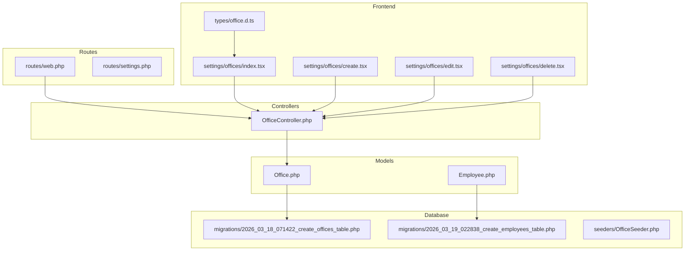
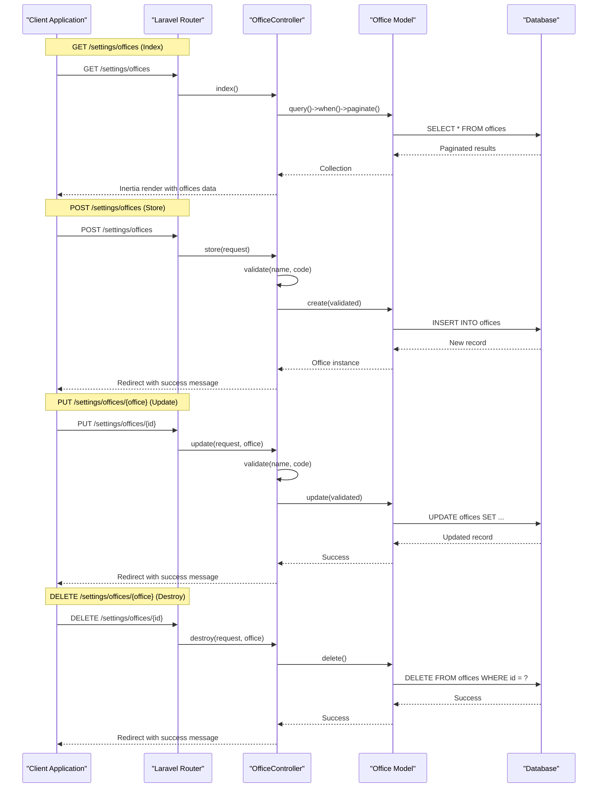
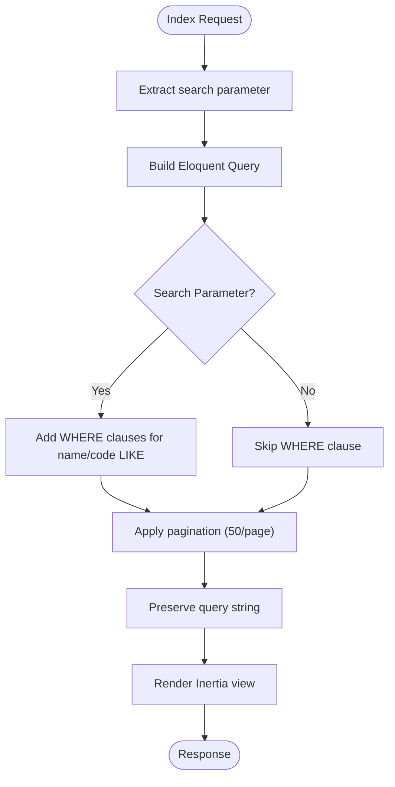
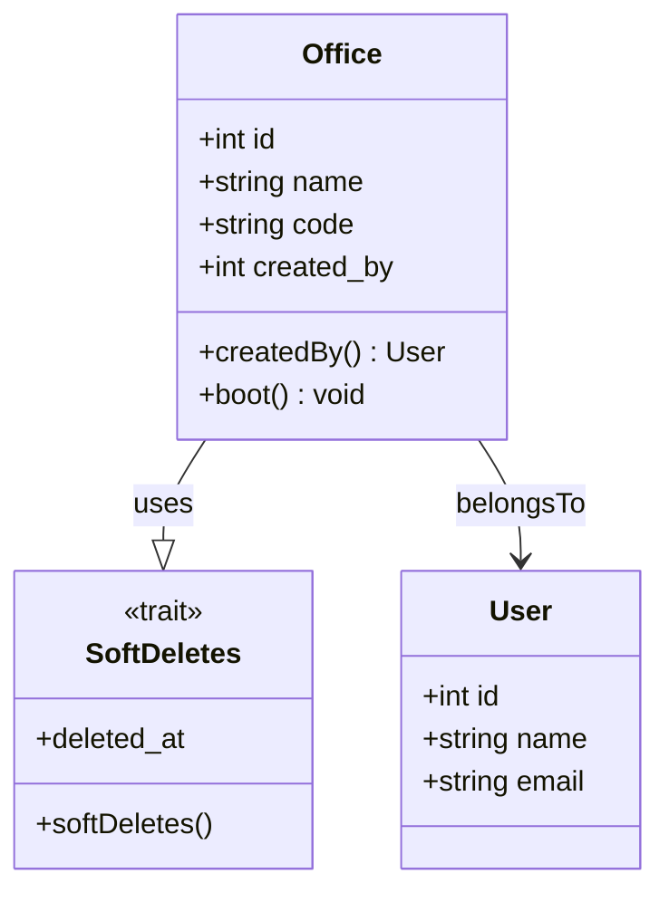
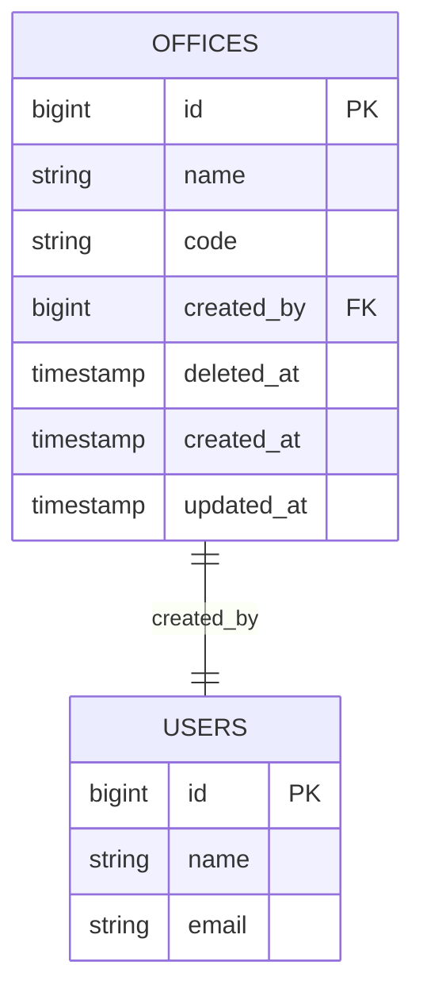
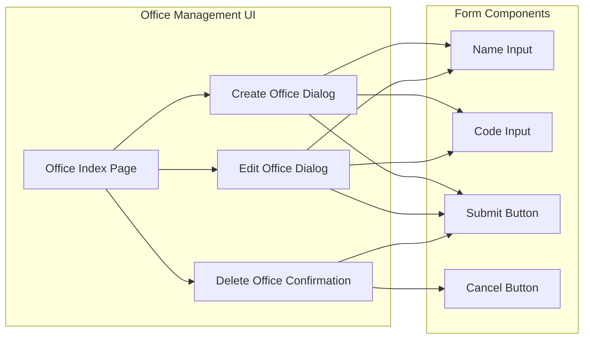
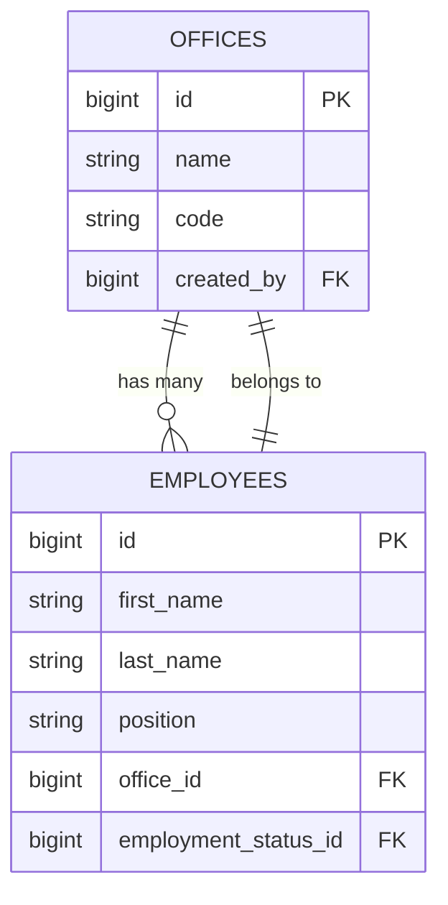

# Office Location Endpoints

<cite>
**Referenced Files in This Document**
- [web.php](file://routes/web.php)
- [OfficeController.php](file://app/Http/Controllers/OfficeController.php)
- [Office.php](file://app/Models/Office.php)
- [2026_03_18_071422_create_offices_table.php](file://database/migrations/2026_03_18_071422_create_offices_table.php)
- [office.d.ts](file://resources/js/types/office.d.ts)
- [index.tsx](file://resources/js/pages/settings/offices/index.tsx)
- [create.tsx](file://resources/js/pages/settings/offices/create.tsx)
- [edit.tsx](file://resources/js/pages/settings/offices/edit.tsx)
- [delete.tsx](file://resources/js/pages/settings/offices/delete.tsx)
- [2026_03_19_022838_create_employees_table.php](file://database/migrations/2026_03_19_022838_create_employees_table.php)
- [employee.d.ts](file://resources/js/types/employee.d.ts)
- [OfficeSeeder.php](file://database/seeders/OfficeSeeder.php)
</cite>

## Table of Contents
1. [Introduction](#introduction)
2. [Project Structure](#project-structure)
3. [Core Components](#core-components)
4. [Architecture Overview](#architecture-overview)
5. [Detailed Component Analysis](#detailed-component-analysis)
6. [Dependency Analysis](#dependency-analysis)
7. [Performance Considerations](#performance-considerations)
8. [Troubleshooting Guide](#troubleshooting-guide)
9. [Conclusion](#conclusion)

## Introduction
This document provides comprehensive API documentation for office location management endpoints in the payroll and HR system. It covers the four primary CRUD operations for managing office locations: listing offices, creating new offices, updating existing offices, and deleting offices. The documentation explains the office data structure, relationships with employee assignments, and organizational implications of office hierarchies.

The system follows Laravel's MVC architecture with Inertia.js for the frontend, providing a seamless SPA experience while maintaining server-side routing and controller logic.

## Project Structure
The office management functionality is organized across several key areas:



**Diagram sources**
- [web.php:71-84](file://routes/web.php#L71-L84)
- [OfficeController.php:9-60](file://app/Http/Controllers/OfficeController.php#L9-L60)
- [Office.php:9-32](file://app/Models/Office.php#L9-L32)

**Section sources**
- [web.php:1-100](file://routes/web.php#L1-L100)
- [OfficeController.php:1-61](file://app/Http/Controllers/OfficeController.php#L1-L61)

## Core Components

### Office Data Structure
The office entity consists of the following core attributes:

| Attribute | Type | Description | Validation |
|-----------|------|-------------|------------|
| `id` | integer | Unique identifier for the office | Auto-incremented |
| `name` | string | Full name of the office location | Required, max 255 characters, unique |
| `code` | string | Short code identifier for the office | Required, max 255 characters, unique |
| `created_by` | integer | User ID of the creator | Foreign key to users table |

The office model implements soft deletes and automatically tracks the creating user through model bootstrapping.

**Section sources**
- [Office.php:13-17](file://app/Models/Office.php#L13-L17)
- [2026_03_18_071422_create_offices_table.php:14-21](file://database/migrations/2026_03_18_071422_create_offices_table.php#L14-L21)
- [office.d.ts:1-6](file://resources/js/types/office.d.ts#L1-L6)

### Frontend Types Definition
The TypeScript interface defines the client-side representation of office data:

```typescript
interface Office {
    id: number;
    name: string;
    code: string;
    created_by: number;
}

type OfficeCreateRequest = Omit<Office, 'id' | 'created_by'>
```

**Section sources**
- [office.d.ts:1-8](file://resources/js/types/office.d.ts#L1-L8)

## Architecture Overview



**Diagram sources**
- [web.php:80-83](file://routes/web.php#L80-L83)
- [OfficeController.php:11-59](file://app/Http/Controllers/OfficeController.php#L11-L59)

## Detailed Component Analysis

### Route Configuration
The office management routes are defined under the `/settings` prefix with the following endpoints:

| Method | Route | Action | Description |
|--------|-------|--------|-------------|
| GET | `/settings/offices` | `index` | List all offices with search and pagination |
| POST | `/settings/offices` | `store` | Create a new office |
| PUT | `/settings/offices/{office}` | `update` | Update an existing office |
| DELETE | `/settings/offices/{office}` | `destroy` | Delete an office |

**Section sources**
- [web.php:79-84](file://routes/web.php#L79-L84)

### Controller Implementation

#### Index Endpoint (`GET /settings/offices`)
The index endpoint provides paginated office listings with search functionality:



**Diagram sources**
- [OfficeController.php:11-28](file://app/Http/Controllers/OfficeController.php#L11-L28)

#### Store Endpoint (`POST /settings/offices`)
The store endpoint validates and creates new office records:

**Validation Rules:**
- `name`: required, string, max 255, unique in `offices.name`
- `code`: required, string, max 255, unique in `offices.code`

**Section sources**
- [OfficeController.php:30-40](file://app/Http/Controllers/OfficeController.php#L30-L40)

#### Update Endpoint (`PUT /settings/offices/{office}`)
The update endpoint validates and modifies existing office records:

**Validation Rules:**
- `name`: required, string, max 255, unique in `offices.name` excluding current office
- `code`: required, string, max 255, unique in `offices.code` excluding current office

**Section sources**
- [OfficeController.php:42-52](file://app/Http/Controllers/OfficeController.php#L42-L52)

#### Destroy Endpoint (`DELETE /settings/offices/{office}`)
The destroy endpoint removes office records using soft delete functionality.

**Section sources**
- [OfficeController.php:54-59](file://app/Http/Controllers/OfficeController.php#L54-L59)

### Model Implementation
The Office model implements several key features:



**Diagram sources**
- [Office.php:9-32](file://app/Models/Office.php#L9-L32)

Key model behaviors:
- Soft deletes enabled for safe removal
- Automatic `created_by` population during creation
- Belongs-to relationship with User model

**Section sources**
- [Office.php:19-31](file://app/Models/Office.php#L19-L31)

### Database Schema
The offices table structure includes:



**Diagram sources**
- [2026_03_18_071422_create_offices_table.php:14-21](file://database/migrations/2026_03_18_071422_create_offices_table.php#L14-L21)

**Section sources**
- [2026_03_18_071422_create_offices_table.php:14-21](file://database/migrations/2026_03_18_071422_create_offices_table.php#L14-L21)

### Frontend Implementation

#### Office Management Interface
The frontend provides a comprehensive interface for office management:



**Diagram sources**
- [index.tsx:168-190](file://resources/js/pages/settings/offices/index.tsx#L168-L190)

**Section sources**
- [index.tsx:1-194](file://resources/js/pages/settings/offices/index.tsx#L1-L194)
- [create.tsx:1-77](file://resources/js/pages/settings/offices/create.tsx#L1-L77)
- [edit.tsx:1-78](file://resources/js/pages/settings/offices/edit.tsx#L1-L78)
- [delete.tsx:1-47](file://resources/js/pages/settings/offices/delete.tsx#L1-L47)

## Dependency Analysis

### Office-Employee Relationship
The office system maintains a crucial relationship with employee assignments:



**Diagram sources**
- [2026_03_19_022838_create_employees_table.php:23](file://database/migrations/2026_03_19_022838_create_employees_table.php#L23)
- [employee.d.ts:18](file://resources/js/types/employee.d.ts#L18)

### Organizational Hierarchy Implications
The office system supports hierarchical organizational structures through:

1. **Direct Assignment**: Employees are directly assigned to specific offices
2. **Departmental Structure**: Offices represent departments or divisions
3. **Geographic Organization**: Offices can represent different physical locations
4. **Administrative Hierarchy**: Higher-level offices can oversee multiple lower-level offices

**Section sources**
- [employee.d.ts:21](file://resources/js/types/employee.d.ts#L21)

## Performance Considerations

### Database Optimization
- **Indexing**: The `offices` table includes foreign key indexes for efficient joins
- **Pagination**: Results are paginated at 50 items per page to prevent memory issues
- **Search Optimization**: LIKE queries with wildcards may impact performance on large datasets

### Frontend Performance
- **State Management**: React state is used efficiently for dialog management
- **Conditional Rendering**: Components render conditionally based on user actions
- **Form Validation**: Client-side validation reduces unnecessary server requests

## Troubleshooting Guide

### Common Issues and Solutions

#### Validation Errors
**Problem**: Office creation/update fails validation
**Causes**:
- Duplicate office name or code
- Missing required fields
- Invalid character length

**Solutions**:
- Ensure unique name and code combinations
- Verify field lengths meet validation requirements
- Check for special characters in names

#### Soft Delete Conflicts
**Problem**: Deleted offices still appear in employee assignments
**Cause**: Soft delete doesn't cascade to related records
**Solution**: Implement proper cascade behavior or manual cleanup

#### Search Performance
**Problem**: Slow search results on large office datasets
**Solution**: Consider implementing full-text search or indexed search fields

**Section sources**
- [OfficeController.php:32-46](file://app/Http/Controllers/OfficeController.php#L32-L46)

## Conclusion

The office location management system provides a robust foundation for organizational structure management within the payroll and HR system. The implementation follows Laravel best practices with clear separation of concerns between routing, controllers, models, and views.

Key strengths of the implementation include:
- Comprehensive validation and error handling
- Soft delete functionality for safe data management
- Clean separation between backend API logic and frontend presentation
- Strong relationships with employee management systems
- Scalable pagination and search capabilities

The system supports various organizational structures and can accommodate future enhancements such as geographic hierarchies, departmental subdivisions, and administrative oversight relationships.