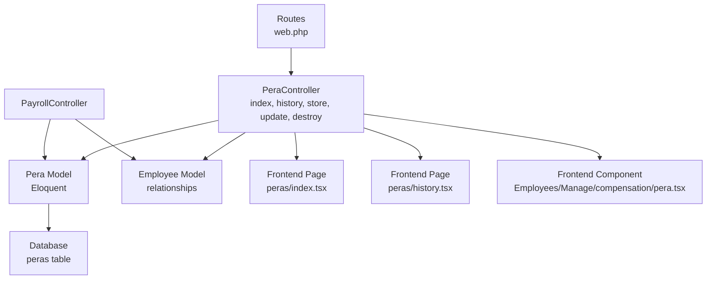
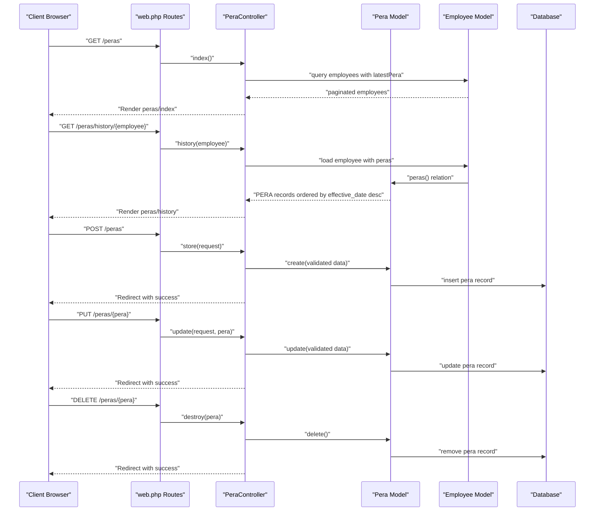
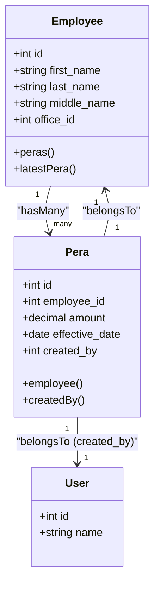
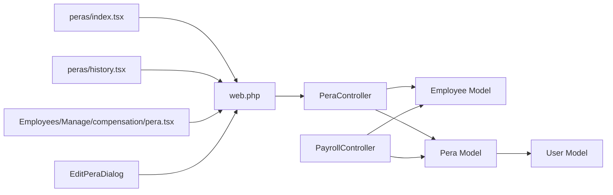

# PERA Contribution API

<cite>
**Referenced Files in This Document**
- [PeraController.php](file://app/Http/Controllers/PeraController.php)
- [Pera.php](file://app/Models/Pera.php)
- [Employee.php](file://app/Models/Employee.php)
- [PayrollController.php](file://app/Http/Controllers/PayrollController.php)
- [2026_03_22_115109_create_peras_table.php](file://database/migrations/2026_03_22_115109_create_peras_table.php)
- [web.php](file://routes/web.php)
- [pera.d.ts](file://resources/js/types/pera.d.ts)
- [index.tsx](file://resources/js/pages/peras/index.tsx)
- [history.tsx](file://resources/js/pages/peras/history.tsx)
- [pera.tsx](file://resources/js/pages/Employees/Manage/compensation/pera.tsx)
</cite>

## Update Summary
**Changes Made**
- Added documentation for the new PUT /peras/{pera} endpoint for updating existing PERA contribution records
- Updated API endpoints section to include the missing update route
- Enhanced frontend integration documentation to reflect the EditPeraDialog component
- Updated dependency analysis to include the new update functionality
- Added troubleshooting guidance for update operations

## Table of Contents
1. [Introduction](#introduction)
2. [Project Structure](#project-structure)
3. [Core Components](#core-components)
4. [Architecture Overview](#architecture-overview)
5. [Detailed Component Analysis](#detailed-component-analysis)
6. [Dependency Analysis](#dependency-analysis)
7. [Performance Considerations](#performance-considerations)
8. [Troubleshooting Guide](#troubleshooting-guide)
9. [Conclusion](#conclusion)
10. [Appendices](#appendices)

## Introduction
This document provides API documentation for the Philippine Earnings and Benefits Act (PERA) contribution endpoints. It covers the HTTP endpoints for retrieving PERA records, viewing employee contribution histories, recording new contributions, updating existing records, and removing existing records. It also documents the data model, validation rules, and integration points with payroll calculations. Regulatory compliance and error handling considerations are included to guide proper usage and troubleshooting.

## Project Structure
The PERA functionality spans backend controllers and models, frontend pages, and routing definitions. The backend exposes HTTP endpoints via the web routes, while the frontend renders lists and forms for managing PERA records.

**Diagram sources**
- [web.php:59-65](file://routes/web.php#L59-L65)
- [PeraController.php:13-105](file://app/Http/Controllers/PeraController.php#L13-L105)
- [Pera.php:8-41](file://app/Models/Pera.php#L8-L41)
- [Employee.php:51-80](file://app/Models/Employee.php#L51-L80)
- [index.tsx:30-258](file://resources/js/pages/peras/index.tsx#L30-L258)
- [history.tsx:26-103](file://resources/js/pages/peras/history.tsx#L26-L103)
- [pera.tsx:78-146](file://resources/js/pages/Employees/Manage/compensation/pera.tsx#L78-L146)

**Section sources**
- [web.php:59-65](file://routes/web.php#L59-L65)
- [PeraController.php:13-105](file://app/Http/Controllers/PeraController.php#L13-L105)
- [Pera.php:8-41](file://app/Models/Pera.php#L8-L41)
- [Employee.php:51-80](file://app/Models/Employee.php#L51-L80)
- [index.tsx:30-258](file://resources/js/pages/peras/index.tsx#L30-L258)
- [history.tsx:26-103](file://resources/js/pages/peras/history.tsx#L26-L103)
- [pera.tsx:78-146](file://resources/js/pages/Employees/Manage/compensation/pera.tsx#L78-L146)

## Core Components
- PeraController: Handles HTTP requests for PERA operations, including listing employees with PERA, retrieving PERA history for an employee, creating new PERA records, updating existing records, and deleting existing records.
- Pera Model: Defines the PERA data model, fillable attributes, casting, and relationships to Employee and User.
- Employee Model: Defines relationships to PERA records and provides helpers for latest PERA retrieval.
- PayrollController: Integrates PERA data into payroll computations and displays.
- Frontend Pages: Provide user interfaces for listing employees, adding PERA, editing PERA, and viewing PERA history.
- EditPeraDialog: Frontend component for editing existing PERA records with validation and confirmation.

**Section sources**
- [PeraController.php:13-105](file://app/Http/Controllers/PeraController.php#L13-L105)
- [Pera.php:8-41](file://app/Models/Pera.php#L8-L41)
- [Employee.php:51-80](file://app/Models/Employee.php#L51-L80)
- [PayrollController.php:11-125](file://app/Http/Controllers/PayrollController.php#L11-L125)
- [index.tsx:30-258](file://resources/js/pages/peras/index.tsx#L30-L258)
- [history.tsx:26-103](file://resources/js/pages/peras/history.tsx#L26-L103)
- [pera.tsx:78-146](file://resources/js/pages/Employees/Manage/compensation/pera.tsx#L78-L146)

## Architecture Overview
The PERA endpoints follow a standard MVC pattern with explicit routing, controller actions, and model interactions. The frontend pages communicate with the backend via Inertia.js, invoking route actions that return rendered pages or perform mutations.

**Diagram sources**
- [web.php:59-65](file://routes/web.php#L59-L65)
- [PeraController.php:13-105](file://app/Http/Controllers/PeraController.php#L13-L105)
- [Pera.php:8-41](file://app/Models/Pera.php#L8-L41)
- [Employee.php:51-80](file://app/Models/Employee.php#L51-L80)

## Detailed Component Analysis

### API Endpoints

#### GET /peras
- Purpose: Retrieve a paginated list of employees with their latest PERA records and related metadata.
- Query parameters:
  - search: Optional text to filter employees by name.
  - office_id: Optional office filter.
  - employment_status_id: Optional employment status filter.
- Response: Renders the PERA listing page with employees and filters applied.
- Notes: Uses eager loading for employment status, office, and latest PERA to optimize queries.

**Section sources**
- [web.php:61](file://routes/web.php#L61)
- [PeraController.php:15-51](file://app/Http/Controllers/PeraController.php#L15-L51)

#### GET /peras/history/{employee}
- Purpose: Retrieve the complete PERA contribution history for a specific employee, sorted by effective date descending.
- Path parameter:
  - employee: Employee identifier (bound automatically by route model binding).
- Response: Renders the PERA history page for the selected employee.

**Section sources**
- [web.php:62](file://routes/web.php#L62)
- [PeraController.php:53-64](file://app/Http/Controllers/PeraController.php#L53-L64)

#### POST /peras
- Purpose: Create a new PERA contribution record for an employee.
- Request body (validated):
  - employee_id: Required integer; must correspond to an existing employee.
  - amount: Required numeric; non-negative decimal amount.
  - effective_date: Required date; determines the record's effective period.
- Response: Redirects back with a success message.

Validation rules enforced server-side:
- employee_id exists in employees table.
- amount is numeric and not less than zero.
- effective_date is a valid date.

**Section sources**
- [web.php:63](file://routes/web.php#L63)
- [PeraController.php:66-82](file://app/Http/Controllers/PeraController.php#L66-L82)
- [pera.d.ts:18-22](file://resources/js/types/pera.d.ts#L18-L22)

#### PUT /peras/{pera}
- Purpose: Update an existing PERA contribution record.
- Path parameter:
  - pera: PERA record identifier (bound automatically by route model binding).
- Request body (validated):
  - amount: Required numeric; non-negative decimal amount.
  - effective_date: Required date; determines the record's effective period.
- Response: Redirects back with a success message.

Validation rules enforced server-side:
- amount is numeric and not less than zero.
- effective_date is a valid date.

**Updated** Added support for modifying existing PERA records with validation and historical data processing capabilities.

**Section sources**
- [web.php:63](file://routes/web.php#L63)
- [PeraController.php:84-97](file://app/Http/Controllers/PeraController.php#L84-L97)

#### DELETE /peras/{pera}
- Purpose: Remove an existing PERA record.
- Path parameter:
  - pera: PERA record identifier (bound automatically by route model binding).
- Response: Redirects back with a success message.

**Section sources**
- [web.php:65](file://routes/web.php#L65)
- [PeraController.php:99-104](file://app/Http/Controllers/PeraController.php#L99-L104)

### Data Model and Relationships

- Fields and casting:
  - amount: Stored as decimal with two decimal places.
  - effective_date: Stored as date.
- Relationships:
  - Pera belongs to Employee.
  - Pera belongs to User via created_by.
  - Employee has many Pera records and provides latestPera accessor.

**Diagram sources**
- [Pera.php:10-30](file://app/Models/Pera.php#L10-L30)
- [Employee.php:51-80](file://app/Models/Employee.php#L51-L80)

**Section sources**
- [Pera.php:10-30](file://app/Models/Pera.php#L10-L30)
- [Employee.php:51-80](file://app/Models/Employee.php#L51-L80)
- [2026_03_22_115109_create_peras_table.php:14-21](file://database/migrations/2026_03_22_115109_create_peras_table.php#L14-L21)

### Frontend Integration

- PERA Listing Page (peras/index.tsx):
  - Provides search by employee name.
  - Displays current PERA amount per employee.
  - Opens a modal to add a PERA record with amount and effective date.
  - Navigates to history page per employee.

- PERA History Page (peras/history.tsx):
  - Shows all PERA entries for an employee with formatted currency and dates.
  - Allows deletion of individual PERA records with confirmation.

- Compensation PERA Component (Employees/Manage/compensation/pera.tsx):
  - Provides comprehensive PERA management interface.
  - Includes AddPeraDialog for creating new records.
  - Includes EditPeraDialog for updating existing records.
  - Displays current PERA amount and effective date.
  - Shows complete PERA history with action buttons for edit and delete.

**Section sources**
- [index.tsx:30-258](file://resources/js/pages/peras/index.tsx#L30-L258)
- [history.tsx:26-103](file://resources/js/pages/peras/history.tsx#L26-L103)
- [pera.tsx:78-146](file://resources/js/pages/Employees/Manage/compensation/pera.tsx#L78-L146)

### Payroll Integration
PERA is integrated into payroll computations alongside salaries and RATA. The PayrollController loads the latest PERA record per employee and includes it in gross pay calculations.

**Diagram sources**
- [PayrollController.php:33-67](file://app/Http/Controllers/PayrollController.php#L33-L67)
- [Employee.php:74-80](file://app/Models/Employee.php#L74-L80)

**Section sources**
- [PayrollController.php:33-67](file://app/Http/Controllers/PayrollController.php#L33-L67)
- [Employee.php:74-80](file://app/Models/Employee.php#L74-L80)

## Dependency Analysis
- Routing depends on PeraController actions.
- PeraController depends on Employee and Pera models.
- Pera model depends on Employee and User models.
- Frontend pages depend on route names and types defined in pera.d.ts.
- PayrollController depends on Employee and Pera models for computation.
- EditPeraDialog component depends on Inertia.js router for PUT requests.

**Diagram sources**
- [web.php:59-65](file://routes/web.php#L59-L65)
- [PeraController.php:13-105](file://app/Http/Controllers/PeraController.php#L13-L105)
- [Pera.php:8-41](file://app/Models/Pera.php#L8-L41)
- [Employee.php:51-80](file://app/Models/Employee.php#L51-L80)
- [PayrollController.php:11-125](file://app/Http/Controllers/PayrollController.php#L11-L125)
- [index.tsx:30-258](file://resources/js/pages/peras/index.tsx#L30-L258)
- [history.tsx:26-103](file://resources/js/pages/peras/history.tsx#L26-L103)
- [pera.tsx:78-146](file://resources/js/pages/Employees/Manage/compensation/pera.tsx#L78-L146)

**Section sources**
- [web.php:59-65](file://routes/web.php#L59-L65)
- [PeraController.php:13-105](file://app/Http/Controllers/PeraController.php#L13-L105)
- [Pera.php:8-41](file://app/Models/Pera.php#L8-L41)
- [Employee.php:51-80](file://app/Models/Employee.php#L51-L80)
- [PayrollController.php:11-125](file://app/Http/Controllers/PayrollController.php#L11-L125)
- [index.tsx:30-258](file://resources/js/pages/peras/index.tsx#L30-L258)
- [history.tsx:26-103](file://resources/js/pages/peras/history.tsx#L26-L103)
- [pera.tsx:78-146](file://resources/js/pages/Employees/Manage/compensation/pera.tsx#L78-L146)

## Performance Considerations
- Eager loading: The PERA listing and payroll endpoints use with() to load related data, reducing N+1 query issues.
- Pagination: The PERA listing uses pagination to limit response size.
- Latest record selection: Using latest ordering for PERA ensures efficient retrieval of current values during payroll computation.
- Update operations: The PUT endpoint performs minimal validation and updates only the specified fields, making it efficient for partial updates.

## Troubleshooting Guide
Common issues and resolutions:

### Validation Failures
- **POST /peras validation failures**:
  - Ensure employee_id references an existing employee.
  - Ensure amount is numeric and non-negative.
  - Ensure effective_date is a valid date string.

- **PUT /peras validation failures**:
  - Ensure amount is numeric and not less than zero.
  - Ensure effective_date is a valid date string.

### Authorization and Middleware
- All PERA routes are under the auth middleware; ensure the user is authenticated.

### Frontend Issues
- **Edit dialog not working**:
  - Verify that the EditPeraDialog component is properly imported and rendered.
  - Check that the route name 'peras.update' exists in the routes configuration.

- **Update not reflected in UI**:
  - Ensure the frontend component properly handles the onSuccess callback.
  - Verify that the component re-fetches data after successful update.

### Redirect Behavior
- Successful POST, PUT, and DELETE operations redirect back with a success message; verify client-side redirects after form submission.

**Section sources**
- [PeraController.php:66-97](file://app/Http/Controllers/PeraController.php#L66-L97)
- [web.php:59-65](file://routes/web.php#L59-L65)
- [pera.tsx:92-104](file://resources/js/pages/Employees/Manage/compensation/pera.tsx#L92-L104)

## Conclusion
The PERA contribution module provides a comprehensive API for managing employee economic relief allowances. It now includes full CRUD operations with support for creating, reading, updating, and deleting PERA records. The module integrates seamlessly with payroll computations and offers user-friendly interfaces for viewing and modifying PERA records across multiple frontend components. Adhering to the documented endpoints, validations, and relationships ensures reliable operation and compliance with payroll workflows.

## Appendices

### Endpoint Reference Summary
- GET /peras
  - Description: List employees with latest PERA and filters.
  - Query: search (optional), office_id (optional), employment_status_id (optional).
- GET /peras/history/{employee}
  - Description: View PERA history for an employee.
- POST /peras
  - Description: Create a new PERA record.
  - Body fields: employee_id, amount, effective_date.
- PUT /peras/{pera}
  - Description: Update an existing PERA record.
  - Path param: pera (record ID).
  - Body fields: amount, effective_date.
- DELETE /peras/{pera}
  - Description: Delete a PERA record.

**Section sources**
- [web.php:61-65](file://routes/web.php#L61-L65)
- [PeraController.php:15-104](file://app/Http/Controllers/PeraController.php#L15-L104)
- [pera.d.ts:18-22](file://resources/js/types/pera.d.ts#L18-L22)

### Data Model Reference
- Pera fields:
  - id, employee_id, amount (decimal), effective_date (date), created_by, timestamps.
- Relationships:
  - belongs to Employee, belongs to User (created_by).

**Section sources**
- [Pera.php:10-30](file://app/Models/Pera.php#L10-L30)
- [2026_03_22_115109_create_peras_table.php:14-21](file://database/migrations/2026_03_22_115109_create_peras_table.php#L14-L21)

### Frontend Components Reference
- **peras/index.tsx**: Main PERA listing with add functionality.
- **peras/history.tsx**: PERA history view with delete functionality.
- **Employees/Manage/compensation/pera.tsx**: Comprehensive PERA management with edit dialog.

**Section sources**
- [index.tsx:30-258](file://resources/js/pages/peras/index.tsx#L30-L258)
- [history.tsx:26-103](file://resources/js/pages/peras/history.tsx#L26-L103)
- [pera.tsx:78-146](file://resources/js/pages/Employees/Manage/compensation/pera.tsx#L78-L146)