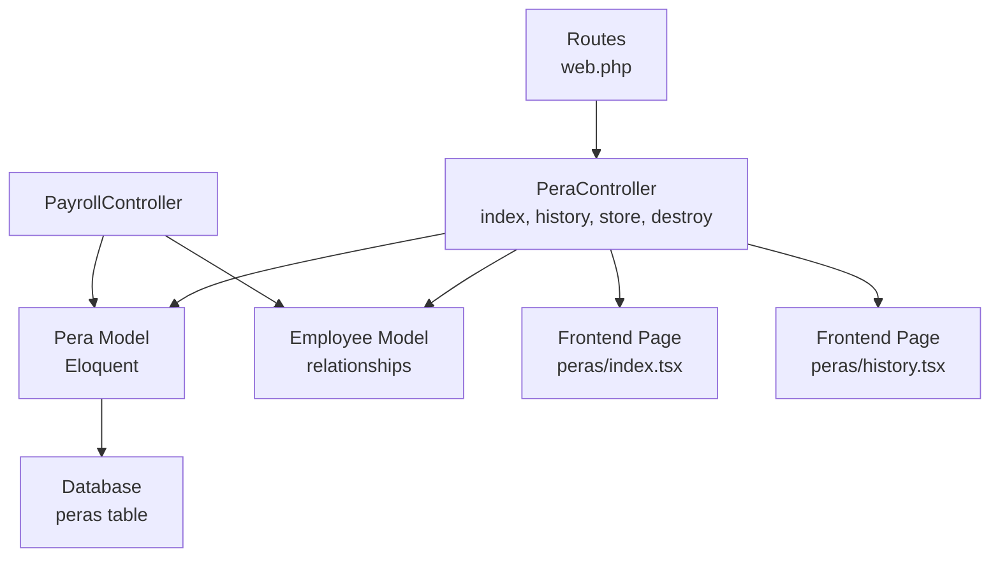
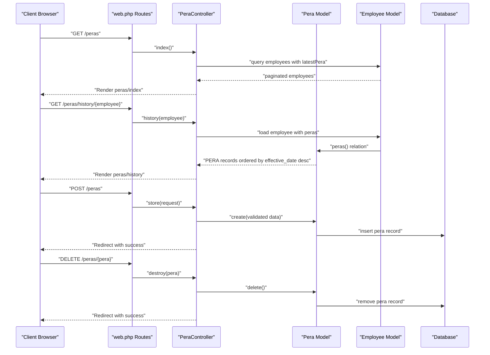
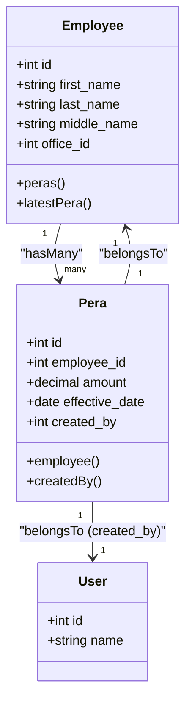
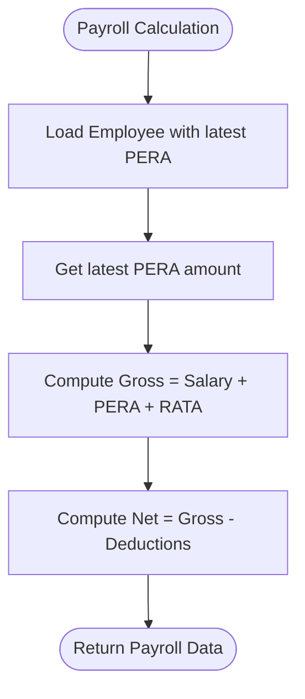
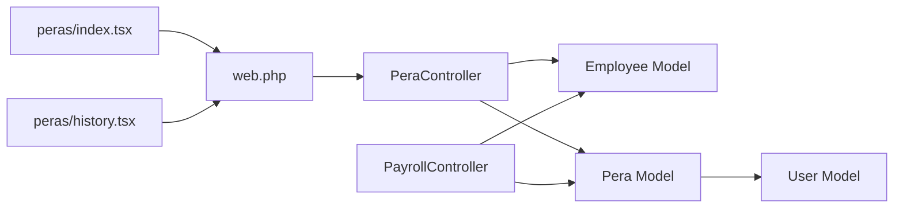

# PERA Contribution API

<cite>
**Referenced Files in This Document**
- [PeraController.php](file://app/Http/Controllers/PeraController.php)
- [Pera.php](file://app/Models/Pera.php)
- [Employee.php](file://app/Models/Employee.php)
- [PayrollController.php](file://app/Http/Controllers/PayrollController.php)
- [2026_03_22_115109_create_peras_table.php](file://database/migrations/2026_03_22_115109_create_peras_table.php)
- [web.php](file://routes/web.php)
- [pera.d.ts](file://resources/js/types/pera.d.ts)
- [index.tsx](file://resources/js/pages/peras/index.tsx)
- [history.tsx](file://resources/js/pages/peras/history.tsx)
</cite>

## Table of Contents
1. [Introduction](#introduction)
2. [Project Structure](#project-structure)
3. [Core Components](#core-components)
4. [Architecture Overview](#architecture-overview)
5. [Detailed Component Analysis](#detailed-component-analysis)
6. [Dependency Analysis](#dependency-analysis)
7. [Performance Considerations](#performance-considerations)
8. [Troubleshooting Guide](#troubleshooting-guide)
9. [Conclusion](#conclusion)
10. [Appendices](#appendices)

## Introduction
This document provides API documentation for the Philippine Earnings and Benefits Act (PERA) contribution endpoints. It covers the HTTP endpoints for retrieving PERA records, viewing employee contribution histories, recording new contributions, and removing existing records. It also documents the data model, validation rules, and integration points with payroll calculations. Regulatory compliance and error handling considerations are included to guide proper usage and troubleshooting.

## Project Structure
The PERA functionality spans backend controllers and models, frontend pages, and routing definitions. The backend exposes HTTP endpoints via the web routes, while the frontend renders lists and forms for managing PERA records.

**Diagram sources**
- [web.php:39-45](file://routes/web.php#L39-L45)
- [PeraController.php:11-74](file://app/Http/Controllers/PeraController.php#L11-L74)
- [Pera.php:8-41](file://app/Models/Pera.php#L8-L41)
- [Employee.php:51-80](file://app/Models/Employee.php#L51-L80)
- [index.tsx:30-223](file://resources/js/pages/peras/index.tsx#L30-L223)
- [history.tsx:26-103](file://resources/js/pages/peras/history.tsx#L26-L103)

**Section sources**
- [web.php:39-45](file://routes/web.php#L39-L45)
- [PeraController.php:11-74](file://app/Http/Controllers/PeraController.php#L11-L74)
- [Pera.php:8-41](file://app/Models/Pera.php#L8-L41)
- [Employee.php:51-80](file://app/Models/Employee.php#L51-L80)
- [index.tsx:30-223](file://resources/js/pages/peras/index.tsx#L30-L223)
- [history.tsx:26-103](file://resources/js/pages/peras/history.tsx#L26-L103)

## Core Components
- PeraController: Handles HTTP requests for PERA operations, including listing employees with PERA, retrieving PERA history for an employee, creating new PERA records, and deleting existing records.
- Pera Model: Defines the PERA data model, fillable attributes, casting, and relationships to Employee and User.
- Employee Model: Defines relationships to PERA records and provides helpers for latest PERA retrieval.
- PayrollController: Integrates PERA data into payroll computations and displays.
- Frontend Pages: Provide user interfaces for listing employees, adding PERA, and viewing PERA history.

**Section sources**
- [PeraController.php:11-74](file://app/Http/Controllers/PeraController.php#L11-L74)
- [Pera.php:8-41](file://app/Models/Pera.php#L8-L41)
- [Employee.php:51-80](file://app/Models/Employee.php#L51-L80)
- [PayrollController.php:11-125](file://app/Http/Controllers/PayrollController.php#L11-L125)
- [index.tsx:30-223](file://resources/js/pages/peras/index.tsx#L30-L223)
- [history.tsx:26-103](file://resources/js/pages/peras/history.tsx#L26-L103)

## Architecture Overview
The PERA endpoints follow a standard MVC pattern with explicit routing, controller actions, and model interactions. The frontend pages communicate with the backend via Inertia.js, invoking route actions that return rendered pages or perform mutations.

**Diagram sources**
- [web.php:39-45](file://routes/web.php#L39-L45)
- [PeraController.php:13-72](file://app/Http/Controllers/PeraController.php#L13-L72)
- [Pera.php:8-41](file://app/Models/Pera.php#L8-L41)
- [Employee.php:51-80](file://app/Models/Employee.php#L51-L80)

## Detailed Component Analysis

### API Endpoints

#### GET /peras
- Purpose: Retrieve a paginated list of employees with their latest PERA records and related metadata.
- Query parameters:
  - search: Optional text to filter employees by name.
- Response: Renders the PERA listing page with employees and filters applied.
- Notes: Uses eager loading for employment status, office, and latest PERA to optimize queries.

**Section sources**
- [web.php:41](file://routes/web.php#L41)
- [PeraController.php:13-34](file://app/Http/Controllers/PeraController.php#L13-L34)

#### GET /peras/history/{employee}
- Purpose: Retrieve the complete PERA contribution history for a specific employee, sorted by effective date descending.
- Path parameter:
  - employee: Employee identifier (bound automatically by route model binding).
- Response: Renders the PERA history page for the selected employee.

**Section sources**
- [web.php:42](file://routes/web.php#L42)
- [PeraController.php:36-47](file://app/Http/Controllers/PeraController.php#L36-L47)

#### POST /peras
- Purpose: Create a new PERA contribution record for an employee.
- Request body (validated):
  - employee_id: Required integer; must correspond to an existing employee.
  - amount: Required numeric; non-negative decimal amount.
  - effective_date: Required date; determines the record's effective period.
- Response: Redirects back with a success message.

Validation rules enforced server-side:
- employee_id exists in employees table.
- amount is numeric and not less than zero.
- effective_date is a valid date.

**Section sources**
- [web.php:43](file://routes/web.php#L43)
- [PeraController.php:49-65](file://app/Http/Controllers/PeraController.php#L49-L65)
- [pera.d.ts:18-22](file://resources/js/types/pera.d.ts#L18-L22)

#### DELETE /peras/{pera}
- Purpose: Remove an existing PERA record.
- Path parameter:
  - pera: PERA record identifier (bound automatically by route model binding).
- Response: Redirects back with a success message.

**Section sources**
- [web.php:44](file://routes/web.php#L44)
- [PeraController.php:67-72](file://app/Http/Controllers/PeraController.php#L67-L72)

### Data Model and Relationships

- Fields and casting:
  - amount: Stored as decimal with two decimal places.
  - effective_date: Stored as date.
- Relationships:
  - Pera belongs to Employee.
  - Pera belongs to User via created_by.
  - Employee has many Pera records and provides latestPera accessor.

**Diagram sources**
- [Pera.php:10-30](file://app/Models/Pera.php#L10-L30)
- [Employee.php:51-80](file://app/Models/Employee.php#L51-L80)

**Section sources**
- [Pera.php:10-30](file://app/Models/Pera.php#L10-L30)
- [Employee.php:51-80](file://app/Models/Employee.php#L51-L80)
- [2026_03_22_115109_create_peras_table.php:14-21](file://database/migrations/2026_03_22_115109_create_peras_table.php#L14-L21)

### Frontend Integration

- PERA Listing Page (peras/index.tsx):
  - Provides search by employee name.
  - Displays current PERA amount per employee.
  - Opens a modal to add a PERA record with amount and effective date.
  - Navigates to history page per employee.

- PERA History Page (peras/history.tsx):
  - Shows all PERA entries for an employee with formatted currency and dates.
  - Allows deletion of individual PERA records with confirmation.

**Section sources**
- [index.tsx:30-223](file://resources/js/pages/peras/index.tsx#L30-L223)
- [history.tsx:26-103](file://resources/js/pages/peras/history.tsx#L26-L103)

### Payroll Integration
PERA is integrated into payroll computations alongside salaries and RATA. The PayrollController loads the latest PERA record per employee and includes it in gross pay calculations.

**Diagram sources**
- [PayrollController.php:33-67](file://app/Http/Controllers/PayrollController.php#L33-L67)
- [Employee.php:74-80](file://app/Models/Employee.php#L74-L80)

**Section sources**
- [PayrollController.php:33-67](file://app/Http/Controllers/PayrollController.php#L33-L67)
- [Employee.php:74-80](file://app/Models/Employee.php#L74-L80)

## Dependency Analysis
- Routing depends on PeraController actions.
- PeraController depends on Employee and Pera models.
- Pera model depends on Employee and User models.
- Frontend pages depend on route names and types defined in pera.d.ts.
- PayrollController depends on Employee and Pera models for computation.

**Diagram sources**
- [web.php:39-45](file://routes/web.php#L39-L45)
- [PeraController.php:11-74](file://app/Http/Controllers/PeraController.php#L11-L74)
- [Pera.php:8-41](file://app/Models/Pera.php#L8-L41)
- [Employee.php:51-80](file://app/Models/Employee.php#L51-L80)
- [PayrollController.php:11-125](file://app/Http/Controllers/PayrollController.php#L11-L125)
- [index.tsx:30-223](file://resources/js/pages/peras/index.tsx#L30-L223)
- [history.tsx:26-103](file://resources/js/pages/peras/history.tsx#L26-L103)

**Section sources**
- [web.php:39-45](file://routes/web.php#L39-L45)
- [PeraController.php:11-74](file://app/Http/Controllers/PeraController.php#L11-L74)
- [Pera.php:8-41](file://app/Models/Pera.php#L8-L41)
- [Employee.php:51-80](file://app/Models/Employee.php#L51-L80)
- [PayrollController.php:11-125](file://app/Http/Controllers/PayrollController.php#L11-L125)
- [index.tsx:30-223](file://resources/js/pages/peras/index.tsx#L30-L223)
- [history.tsx:26-103](file://resources/js/pages/peras/history.tsx#L26-L103)

## Performance Considerations
- Eager loading: The PERA listing and payroll endpoints use with() to load related data, reducing N+1 query issues.
- Pagination: The PERA listing uses pagination to limit response size.
- Latest record selection: Using latest ordering for PERA ensures efficient retrieval of current values during payroll computation.

[No sources needed since this section provides general guidance]

## Troubleshooting Guide
Common issues and resolutions:
- Validation failures on POST /peras:
  - Ensure employee_id references an existing employee.
  - Ensure amount is numeric and non-negative.
  - Ensure effective_date is a valid date string.
- Authorization and middleware:
  - All PERA routes are under the auth middleware; ensure the user is authenticated.
- Redirect behavior:
  - Successful POST and DELETE operations redirect back with a success message; verify client-side redirects after form submission.

**Section sources**
- [PeraController.php:49-65](file://app/Http/Controllers/PeraController.php#L49-L65)
- [web.php:20](file://routes/web.php#L20)

## Conclusion
The PERA contribution module provides a straightforward API for managing employee economic relief allowances. It integrates cleanly with payroll computations and offers a user-friendly interface for viewing and modifying PERA records. Adhering to the documented endpoints, validations, and relationships ensures reliable operation and compliance with payroll workflows.

[No sources needed since this section summarizes without analyzing specific files]

## Appendices

### Endpoint Reference Summary
- GET /peras
  - Description: List employees with latest PERA and filters.
  - Query: search (optional).
- GET /peras/history/{employee}
  - Description: View PERA history for an employee.
- POST /peras
  - Description: Create a new PERA record.
  - Body fields: employee_id, amount, effective_date.
- DELETE /peras/{pera}
  - Description: Delete a PERA record.

**Section sources**
- [web.php:41-44](file://routes/web.php#L41-L44)
- [PeraController.php:13-72](file://app/Http/Controllers/PeraController.php#L13-L72)
- [pera.d.ts:18-22](file://resources/js/types/pera.d.ts#L18-L22)

### Data Model Reference
- Pera fields:
  - id, employee_id, amount (decimal), effective_date (date), created_by, timestamps.
- Relationships:
  - belongs to Employee, belongs to User (created_by).

**Section sources**
- [Pera.php:10-30](file://app/Models/Pera.php#L10-L30)
- [2026_03_22_115109_create_peras_table.php:14-21](file://database/migrations/2026_03_22_115109_create_peras_table.php#L14-L21)