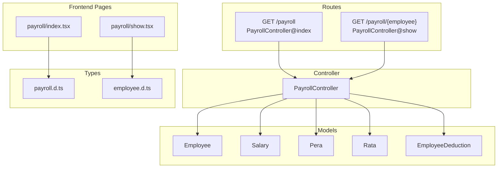
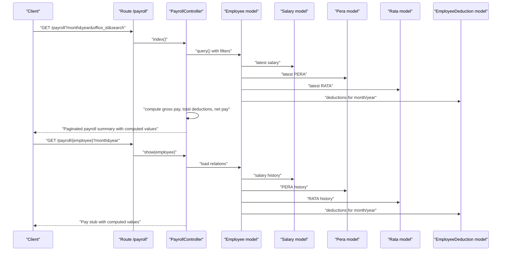
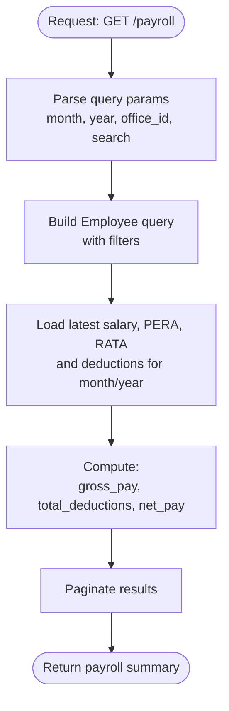
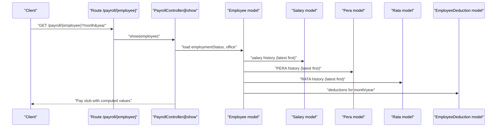
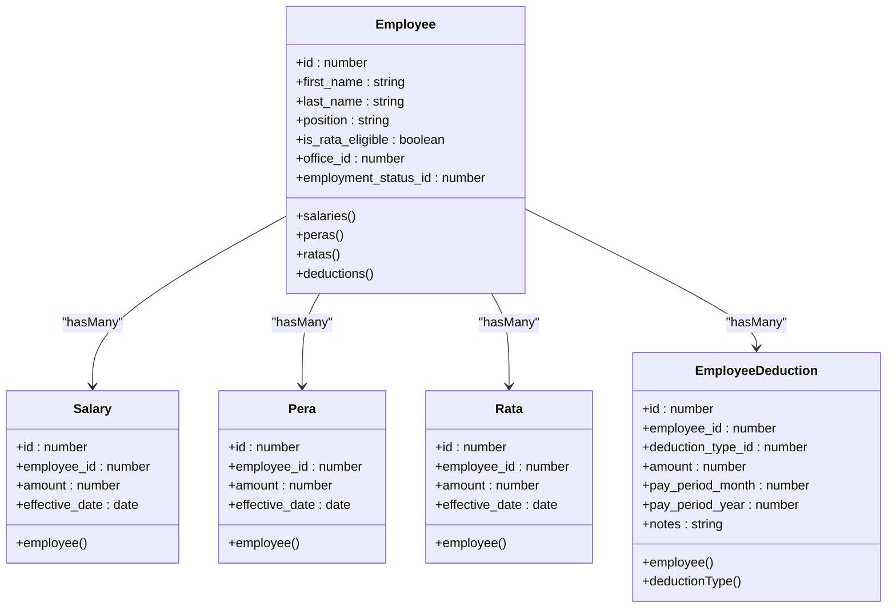
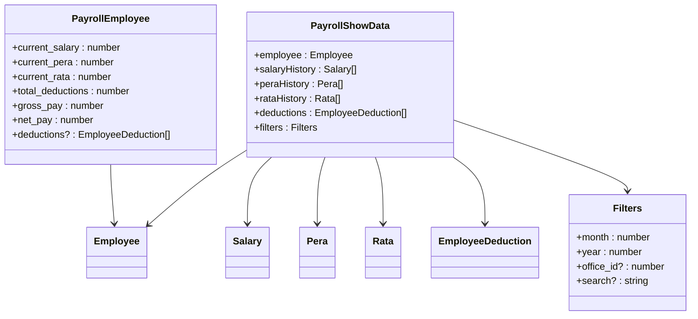
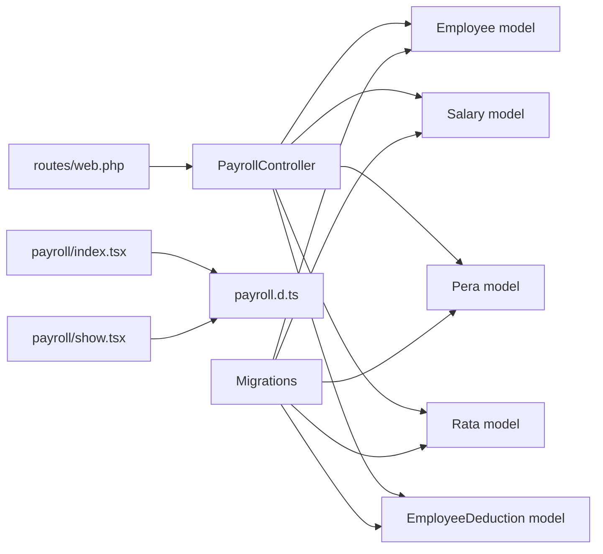

# Payroll Calculation API

<cite>
**Referenced Files in This Document**
- [PayrollController.php](file://app/Http/Controllers/PayrollController.php)
- [web.php](file://routes/web.php)
- [index.tsx](file://resources/js/pages/payroll/index.tsx)
- [show.tsx](file://resources/js/pages/payroll/show.tsx)
- [payroll.d.ts](file://resources/js/types/payroll.d.ts)
- [employee.d.ts](file://resources/js/types/employee.d.ts)
- [Employee.php](file://app/Models/Employee.php)
- [Salary.php](file://app/Models/Salary.php)
- [Pera.php](file://app/Models/Pera.php)
- [Rata.php](file://app/Models/Rata.php)
- [EmployeeDeduction.php](file://app/Models/EmployeeDeduction.php)
- [2026_03_22_115112_create_employee_deductions_table.php](file://database/migrations/2026_03_22_115112_create_employee_deductions_table.php)
- [2026_03_19_022838_create_employees_table.php](file://database/migrations/2026_03_19_022838_create_employees_table.php)
</cite>

## Table of Contents
1. [Introduction](#introduction)
2. [Project Structure](#project-structure)
3. [Core Components](#core-components)
4. [Architecture Overview](#architecture-overview)
5. [Detailed Component Analysis](#detailed-component-analysis)
6. [Dependency Analysis](#dependency-analysis)
7. [Performance Considerations](#performance-considerations)
8. [Troubleshooting Guide](#troubleshooting-guide)
9. [Conclusion](#conclusion)

## Introduction
This document describes the Payroll Calculation API endpoints for retrieving payroll summaries and individual employee pay stubs. It explains the GET /payroll endpoint for payroll summaries and the GET /payroll/{employee} endpoint for individual employee pay stubs. It details the payroll calculation algorithm, including gross salary computation, deduction calculations, and net pay determination. It also documents the data structures used for payroll processing, including employee salary information, deduction calculations, and contribution amounts. Finally, it covers request parameters, response formats with payroll breakdown details, and error handling for payroll retrieval operations.

## Project Structure
The Payroll module consists of:
- Backend controller handling payroll requests and computing pay values
- Frontend pages rendering payroll summaries and pay stubs
- TypeScript types describing payroll data structures
- Eloquent models representing payroll-related entities
- Database migrations defining the underlying schema

**Diagram sources**
- [web.php:25-29](file://routes/web.php#L25-L29)
- [PayrollController.php:13-123](file://app/Http/Controllers/PayrollController.php#L13-L123)
- [index.tsx:38-47](file://resources/js/pages/payroll/index.tsx#L38-L47)
- [show.tsx:43-53](file://resources/js/pages/payroll/show.tsx#L43-L53)
- [payroll.d.ts:7-34](file://resources/js/types/payroll.d.ts#L7-L34)
- [employee.d.ts:8-29](file://resources/js/types/employee.d.ts#L8-L29)
- [Employee.php:46-64](file://app/Models/Employee.php#L46-L64)
- [Salary.php:12-24](file://app/Models/Salary.php#L12-L24)
- [Pera.php:10-18](file://app/Models/Pera.php#L10-L18)
- [Rata.php:10-18](file://app/Models/Rata.php#L10-L18)
- [EmployeeDeduction.php:10-24](file://app/Models/EmployeeDeduction.php#L10-L24)

**Section sources**
- [web.php:25-29](file://routes/web.php#L25-L29)
- [PayrollController.php:13-123](file://app/Http/Controllers/PayrollController.php#L13-L123)
- [index.tsx:38-47](file://resources/js/pages/payroll/index.tsx#L38-L47)
- [show.tsx:43-53](file://resources/js/pages/payroll/show.tsx#L43-L53)
- [payroll.d.ts:7-34](file://resources/js/types/payroll.d.ts#L7-L34)
- [employee.d.ts:8-29](file://resources/js/types/employee.d.ts#L8-L29)
- [Employee.php:46-64](file://app/Models/Employee.php#L46-L64)
- [Salary.php:12-24](file://app/Models/Salary.php#L12-L24)
- [Pera.php:10-18](file://app/Models/Pera.php#L10-L18)
- [Rata.php:10-18](file://app/Models/Rata.php#L10-L18)
- [EmployeeDeduction.php:10-24](file://app/Models/EmployeeDeduction.php#L10-L24)

## Core Components
- PayrollController: Implements GET /payroll and GET /payroll/{employee}. Computes gross pay, total deductions, and net pay for each employee.
- Employee model: Defines relationships to Salary, Pera, Rata, and EmployeeDeduction.
- Salary, Pera, Rata models: Represent earnings components with decimal amount casting and effective dates.
- EmployeeDeduction model: Stores deduction entries with pay period and amount.
- Frontend pages: Render payroll summaries and pay stubs with currency formatting and filtering.

Key calculation logic:
- Gross pay = current salary + current PERA + current RATA
- Total deductions = sum of all EmployeeDeduction amounts for the selected pay period
- Net pay = gross pay − total deductions

**Section sources**
- [PayrollController.php:13-123](file://app/Http/Controllers/PayrollController.php#L13-L123)
- [Employee.php:46-64](file://app/Models/Employee.php#L46-L64)
- [Salary.php:12-24](file://app/Models/Salary.php#L12-L24)
- [Pera.php:10-18](file://app/Models/Pera.php#L10-L18)
- [Rata.php:10-18](file://app/Models/Rata.php#L10-L18)
- [EmployeeDeduction.php:10-24](file://app/Models/EmployeeDeduction.php#L10-L24)

## Architecture Overview
The Payroll API follows a layered architecture:
- Routes define two endpoints under the payroll prefix
- Controller fetches and computes payroll data
- Models encapsulate data access and relationships
- Frontend pages render filtered and paginated payroll data

**Diagram sources**
- [web.php:25-29](file://routes/web.php#L25-L29)
- [PayrollController.php:13-123](file://app/Http/Controllers/PayrollController.php#L13-L123)
- [Employee.php:46-64](file://app/Models/Employee.php#L46-L64)
- [Salary.php:12-24](file://app/Models/Salary.php#L12-L24)
- [Pera.php:10-18](file://app/Models/Pera.php#L10-L18)
- [Rata.php:10-18](file://app/Models/Rata.php#L10-L18)
- [EmployeeDeduction.php:10-24](file://app/Models/EmployeeDeduction.php#L10-L24)

## Detailed Component Analysis

### API Endpoints

#### GET /payroll
- Purpose: Retrieve a paginated payroll summary for employees with computed gross pay, total deductions, and net pay for a given month/year.
- Request parameters:
  - month: integer (default current month)
  - year: integer (default current year)
  - office_id: optional integer
  - search: optional string for employee name search
- Response: Paginated data containing employee records enriched with:
  - current_salary
  - current_pera
  - current_rata
  - total_deductions
  - gross_pay
  - net_pay
- Computation:
  - Gross pay = current salary + current PERA + current RATA
  - Total deductions = sum of EmployeeDeduction amounts for the selected month/year
  - Net pay = gross pay − total deductions

**Diagram sources**
- [PayrollController.php:13-81](file://app/Http/Controllers/PayrollController.php#L13-L81)
- [index.tsx:49-80](file://resources/js/pages/payroll/index.tsx#L49-L80)

**Section sources**
- [PayrollController.php:13-81](file://app/Http/Controllers/PayrollController.php#L13-L81)
- [index.tsx:49-80](file://resources/js/pages/payroll/index.tsx#L49-L80)

#### GET /payroll/{employee}
- Purpose: Retrieve an individual employee's pay stub for a given month/year, including salary history, PERA history, RATA history, and deductions for that period.
- Path parameter:
  - employee: integer (employee identifier)
- Request parameters:
  - month: integer (default current month)
  - year: integer (default current year)
- Response: Employee data plus:
  - salaryHistory
  - peraHistory
  - rataHistory
  - deductions for the selected month/year
  - Computed values: gross pay, total deductions, net pay
- Computation:
  - Gross pay = latest salary + latest PERA + latest RATA
  - Total deductions = sum of EmployeeDeduction amounts for the selected month/year
  - Net pay = gross pay − total deductions

**Diagram sources**
- [web.php:25-29](file://routes/web.php#L25-L29)
- [PayrollController.php:83-123](file://app/Http/Controllers/PayrollController.php#L83-L123)
- [show.tsx:55-72](file://resources/js/pages/payroll/show.tsx#L55-L72)

**Section sources**
- [PayrollController.php:83-123](file://app/Http/Controllers/PayrollController.php#L83-L123)
- [show.tsx:55-72](file://resources/js/pages/payroll/show.tsx#L55-L72)

### Data Structures and Models

**Diagram sources**
- [Employee.php:46-64](file://app/Models/Employee.php#L46-L64)
- [Salary.php:12-24](file://app/Models/Salary.php#L12-L24)
- [Pera.php:10-18](file://app/Models/Pera.php#L10-L18)
- [Rata.php:10-18](file://app/Models/Rata.php#L10-L18)
- [EmployeeDeduction.php:10-24](file://app/Models/EmployeeDeduction.php#L10-L24)

**Section sources**
- [Employee.php:46-64](file://app/Models/Employee.php#L46-L64)
- [Salary.php:12-24](file://app/Models/Salary.php#L12-L24)
- [Pera.php:10-18](file://app/Models/Pera.php#L10-L18)
- [Rata.php:10-18](file://app/Models/Rata.php#L10-L18)
- [EmployeeDeduction.php:10-24](file://app/Models/EmployeeDeduction.php#L10-L24)

### TypeScript Types for Payroll

**Diagram sources**
- [payroll.d.ts:7-34](file://resources/js/types/payroll.d.ts#L7-L34)
- [employee.d.ts:8-29](file://resources/js/types/employee.d.ts#L8-L29)

**Section sources**
- [payroll.d.ts:7-34](file://resources/js/types/payroll.d.ts#L7-L34)
- [employee.d.ts:8-29](file://resources/js/types/employee.d.ts#L8-L29)

## Dependency Analysis
- Routes depend on PayrollController methods.
- PayrollController depends on Employee model and related models for data retrieval.
- Frontend pages depend on TypeScript types for type-safe rendering.
- Database migrations define foreign keys and constraints ensuring referential integrity.

**Diagram sources**
- [web.php:25-29](file://routes/web.php#L25-L29)
- [PayrollController.php:13-123](file://app/Http/Controllers/PayrollController.php#L13-L123)
- [index.tsx:38-47](file://resources/js/pages/payroll/index.tsx#L38-L47)
- [show.tsx:43-53](file://resources/js/pages/payroll/show.tsx#L43-L53)
- [payroll.d.ts:7-34](file://resources/js/types/payroll.d.ts#L7-L34)
- [2026_03_22_115112_create_employee_deductions_table.php:14-26](file://database/migrations/2026_03_22_115112_create_employee_deductions_table.php#L14-L26)
- [2026_03_19_022838_create_employees_table.php:14-26](file://database/migrations/2026_03_19_022838_create_employees_table.php#L14-L26)

**Section sources**
- [web.php:25-29](file://routes/web.php#L25-L29)
- [PayrollController.php:13-123](file://app/Http/Controllers/PayrollController.php#L13-L123)
- [index.tsx:38-47](file://resources/js/pages/payroll/index.tsx#L38-L47)
- [show.tsx:43-53](file://resources/js/pages/payroll/show.tsx#L43-L53)
- [payroll.d.ts:7-34](file://resources/js/types/payroll.d.ts#L7-L34)
- [2026_03_22_115112_create_employee_deductions_table.php:14-26](file://database/migrations/2026_03_22_115112_create_employee_deductions_table.php#L14-L26)
- [2026_03_19_022838_create_employees_table.php:14-26](file://database/migrations/2026_03_19_022838_create_employees_table.php#L14-L26)

## Performance Considerations
- Use of eager loading with with() reduces N+1 queries for related data.
- Latest effective records are constrained via query scopes to avoid scanning entire histories.
- Pagination limits result sets to improve responsiveness.
- Currency formatting is handled client-side for simplicity and consistency.

[No sources needed since this section provides general guidance]

## Troubleshooting Guide
Common issues and resolutions:
- Missing or invalid month/year parameters: The controller defaults to the current month/year if not provided.
- Empty or missing salary/PERA/RATA records: The computation treats missing amounts as zero.
- No deductions for a period: The total deductions will be zero for that period.
- Filtering by office or search term: Ensure proper values are passed; otherwise, the query will return all employees matching the criteria.

**Section sources**
- [PayrollController.php:15-17](file://app/Http/Controllers/PayrollController.php#L15-L17)
- [PayrollController.php:30-43](file://app/Http/Controllers/PayrollController.php#L30-L43)
- [show.tsx:93-98](file://resources/js/pages/payroll/show.tsx#L93-L98)

## Conclusion
The Payroll API provides two primary endpoints for payroll summaries and individual pay stubs. The backend computes gross pay, total deductions, and net pay using the latest salary, PERA, and RATA records along with deductions for the selected pay period. The frontend renders these values with currency formatting and filtering capabilities. The data models and migrations define a robust schema supporting payroll processing with referential integrity and efficient querying.