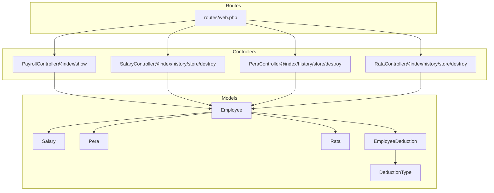
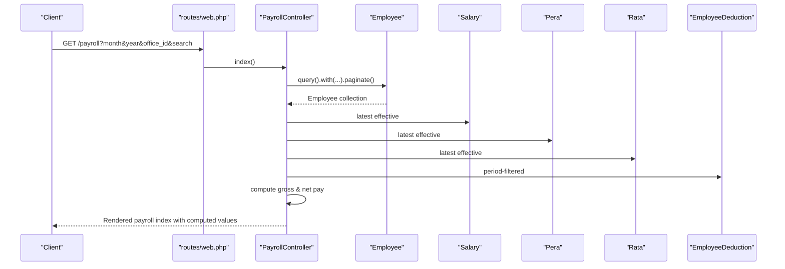
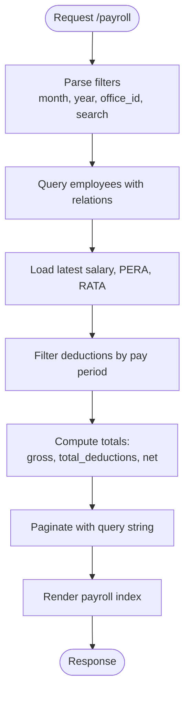
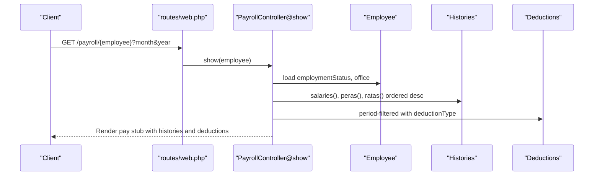
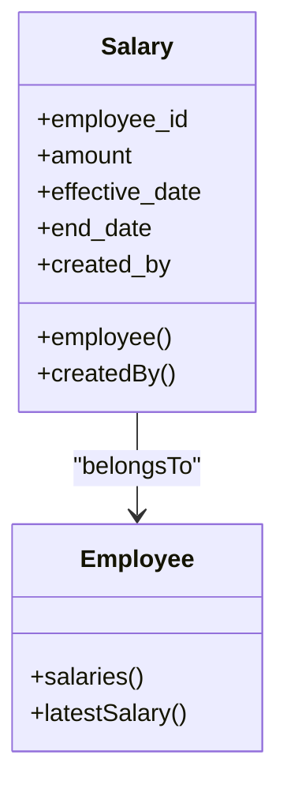
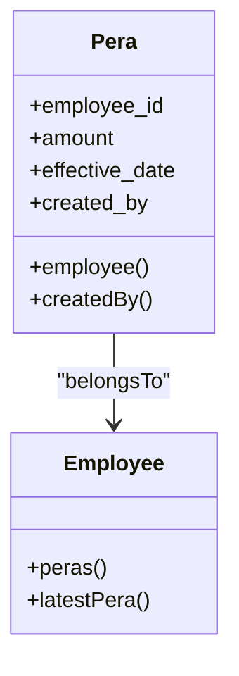
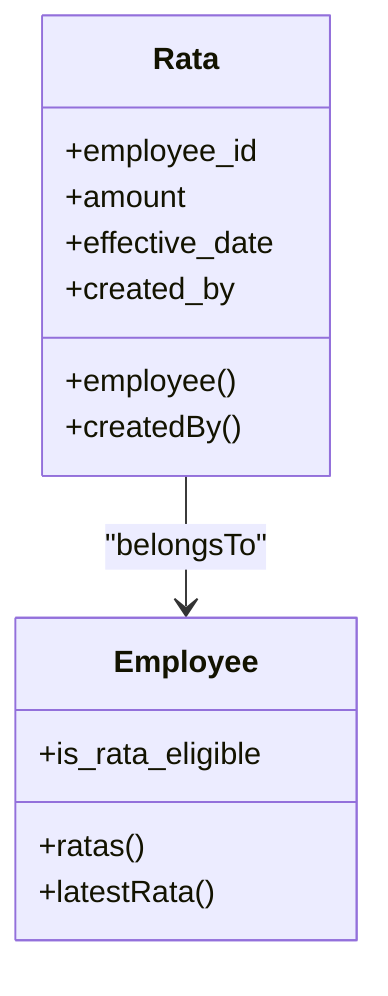
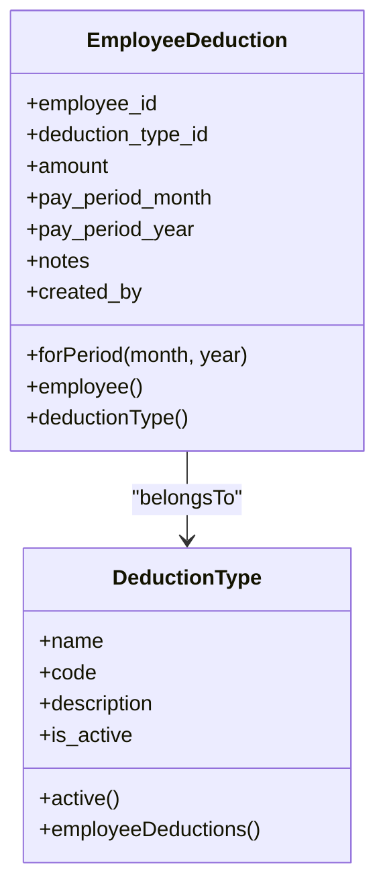
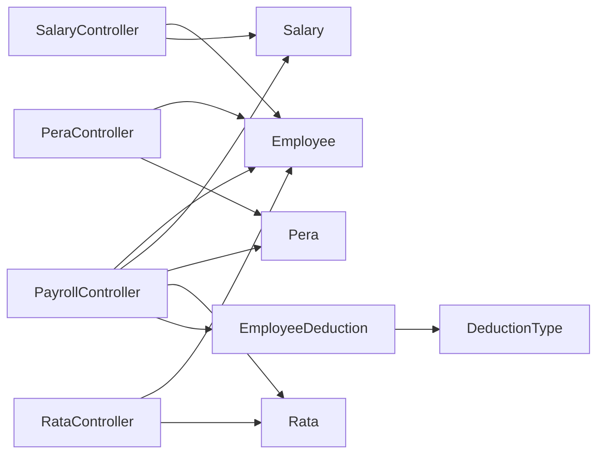

# Payroll Management API

<cite>
**Referenced Files in This Document**
- [web.php](file://routes/web.php)
- [PayrollController.php](file://app/Http/Controllers/PayrollController.php)
- [SalaryController.php](file://app/Http/Controllers/SalaryController.php)
- [PeraController.php](file://app/Http/Controllers/PeraController.php)
- [RataController.php](file://app/Http/Controllers/RataController.php)
- [Employee.php](file://app/Models/Employee.php)
- [Salary.php](file://app/Models/Salary.php)
- [Pera.php](file://app/Models/Pera.php)
- [Rata.php](file://app/Models/Rata.php)
- [EmployeeDeduction.php](file://app/Models/EmployeeDeduction.php)
- [DeductionType.php](file://app/Models/DeductionType.php)
</cite>

## Table of Contents
1. [Introduction](#introduction)
2. [Project Structure](#project-structure)
3. [Core Components](#core-components)
4. [Architecture Overview](#architecture-overview)
5. [Detailed Component Analysis](#detailed-component-analysis)
6. [Dependency Analysis](#dependency-analysis)
7. [Performance Considerations](#performance-considerations)
8. [Troubleshooting Guide](#troubleshooting-guide)
9. [Conclusion](#conclusion)

## Introduction
This document provides comprehensive API documentation for the payroll management system. It covers payroll calculation, salary processing, PERA contributions, and RATA deductions. The documentation details the REST endpoints for retrieving payroll summaries, individual employee pay stubs, salary history, and contribution records. It also explains the data models, calculation algorithms, and business logic behind payroll processing, along with request parameters, response formats, and error handling.

## Project Structure
The payroll module is organized around dedicated controllers and Eloquent models. Routes are grouped under logical prefixes for payroll, salaries, PERA, and RATA. The controllers orchestrate data retrieval, computation, and rendering for payroll summaries and pay stubs.

**Diagram sources**
- [web.php:25-53](file://routes/web.php#L25-L53)
- [PayrollController.php:11-124](file://app/Http/Controllers/PayrollController.php#L11-L124)
- [SalaryController.php:11-73](file://app/Http/Controllers/SalaryController.php#L11-L73)
- [PeraController.php:11-73](file://app/Http/Controllers/PeraController.php#L11-L73)
- [RataController.php:11-74](file://app/Http/Controllers/RataController.php#L11-L74)
- [Employee.php:10-103](file://app/Models/Employee.php#L10-L103)
- [Salary.php:8-35](file://app/Models/Salary.php#L8-L35)
- [Pera.php:8-40](file://app/Models/Pera.php#L8-L40)
- [Rata.php:8-40](file://app/Models/Rata.php#L8-L40)
- [EmployeeDeduction.php:8-58](file://app/Models/EmployeeDeduction.php#L8-L58)
- [DeductionType.php:7-32](file://app/Models/DeductionType.php#L7-L32)

**Section sources**
- [web.php:25-53](file://routes/web.php#L25-L53)

## Core Components
- Payroll summary listing and computation
  - Endpoint: GET /payroll
  - Purpose: List employees with computed payroll values for a given month/year, filtered by office and search term.
  - Computed fields: current salary, PERA, RATA, total deductions, gross pay, net pay.
- Individual employee pay stub
  - Endpoint: GET /payroll/{employee}
  - Purpose: Retrieve an employee’s profile and related histories plus deductions for a selected month/year.
- Salary processing
  - Endpoints:
    - GET /salaries
    - GET /salaries/history/{employee}
    - POST /salaries
    - DELETE /salaries/{salary}
- PERA contributions
  - Endpoints:
    - GET /peras
    - GET /peras/history/{employee}
    - POST /peras
    - DELETE /peras/{pera}
- RATA deductions
  - Endpoints:
    - GET /ratas
    - GET /ratas/history/{employee}
    - POST /ratas
    - DELETE /ratas/{rata}

**Section sources**
- [PayrollController.php:13-81](file://app/Http/Controllers/PayrollController.php#L13-L81)
- [PayrollController.php:83-123](file://app/Http/Controllers/PayrollController.php#L83-L123)
- [SalaryController.php:13-47](file://app/Http/Controllers/SalaryController.php#L13-L47)
- [SalaryController.php:49-72](file://app/Http/Controllers/SalaryController.php#L49-L72)
- [PeraController.php:13-47](file://app/Http/Controllers/PeraController.php#L13-L47)
- [PeraController.php:49-72](file://app/Http/Controllers/PeraController.php#L49-L72)
- [RataController.php:13-47](file://app/Http/Controllers/RataController.php#L13-L47)
- [RataController.php:50-73](file://app/Http/Controllers/RataController.php#L50-L73)
- [web.php:26-53](file://routes/web.php#L26-L53)

## Architecture Overview
The payroll system follows a layered architecture:
- HTTP layer: Routes define endpoints and bind to controller actions.
- Controller layer: Orchestrates queries, computes derived values, and renders views.
- Model layer: Defines relationships, casts, and scopes for data access and business rules.
- Deduction subsystem: EmployeeDeduction links to DeductionType for configurable deduction categories.

**Diagram sources**
- [web.php:26-29](file://routes/web.php#L26-L29)
- [PayrollController.php:13-81](file://app/Http/Controllers/PayrollController.php#L13-L81)
- [Employee.php:46-88](file://app/Models/Employee.php#L46-L88)
- [Salary.php:26-34](file://app/Models/Salary.php#L26-L34)
- [Pera.php:22-30](file://app/Models/Pera.php#L22-L30)
- [Rata.php:22-30](file://app/Models/Rata.php#L22-L30)
- [EmployeeDeduction.php:53-57](file://app/Models/EmployeeDeduction.php#L53-L57)

## Detailed Component Analysis

### Payroll Summary Listing (GET /payroll)
- Filters
  - month: integer (default current month)
  - year: integer (default current year)
  - office_id: optional integer
  - search: optional string (searches first/middle/last name)
- Query behavior
  - Loads employee with employment status and office.
  - Loads latest salary, PERA, and RATA by latest effective date.
  - Loads deductions matching the pay period (month/year).
  - Paginates results with query string preservation.
- Computation
  - gross_pay = current_salary + current_pera + current_rata
  - total_deductions = sum of deduction amounts for the period
  - net_pay = gross_pay - total_deductions
- Response
  - Returns a paginated dataset enriched with computed fields for UI rendering.

**Diagram sources**
- [PayrollController.php:13-81](file://app/Http/Controllers/PayrollController.php#L13-L81)

**Section sources**
- [PayrollController.php:13-81](file://app/Http/Controllers/PayrollController.php#L13-L81)

### Individual Employee Pay Stub (GET /payroll/{employee})
- Request
  - Path parameter: employee (resolved via route model binding)
  - Query parameters: month (default current), year (default current)
- Data retrieval
  - Employee profile with employment status and office.
  - Salary history ordered by effective date descending.
  - PERA history ordered by effective date descending.
  - RATA history ordered by effective date descending.
  - Deductions for the selected pay period with deduction type details.
- Response
  - Renders the pay stub page with histories and period-specific deductions.

**Diagram sources**
- [web.php:28](file://routes/web.php#L28)
- [PayrollController.php:83-123](file://app/Http/Controllers/PayrollController.php#L83-L123)
- [Employee.php:46-88](file://app/Models/Employee.php#L46-L88)
- [EmployeeDeduction.php:53-57](file://app/Models/EmployeeDeduction.php#L53-L57)

**Section sources**
- [PayrollController.php:83-123](file://app/Http/Controllers/PayrollController.php#L83-L123)

### Salary Processing Endpoints
- GET /salaries
  - Purpose: List employees with latest salary and related metadata.
  - Filters: search (name-based).
- GET /salaries/history/{employee}
  - Purpose: Retrieve full salary history for an employee with who created each record.
- POST /salaries
  - Purpose: Add a new salary record for an employee.
  - Validation: employee_id exists, amount numeric ≥ 0, effective_date valid date.
  - Behavior: Records created_by from authenticated user.
- DELETE /salaries/{salary}
  - Purpose: Remove a salary record.

**Diagram sources**
- [SalaryController.php:13-72](file://app/Http/Controllers/SalaryController.php#L13-L72)
- [Salary.php:8-35](file://app/Models/Salary.php#L8-L35)
- [Employee.php:46-88](file://app/Models/Employee.php#L46-L88)

**Section sources**
- [SalaryController.php:13-47](file://app/Http/Controllers/SalaryController.php#L13-L47)
- [SalaryController.php:49-72](file://app/Http/Controllers/SalaryController.php#L49-L72)
- [Salary.php:12-24](file://app/Models/Salary.php#L12-L24)
- [Employee.php:46-88](file://app/Models/Employee.php#L46-L88)

### PERA Contributions Endpoints
- GET /peras
  - Purpose: List employees with latest PERA and related metadata.
  - Filters: search (name-based).
- GET /peras/history/{employee}
  - Purpose: Retrieve full PERA history for an employee with creator details.
- POST /peras
  - Purpose: Add a new PERA record for an employee.
  - Validation: employee_id exists, amount numeric ≥ 0, effective_date valid date.
  - Behavior: Records created_by from authenticated user.
- DELETE /peras/{pera}
  - Purpose: Remove a PERA record.

**Diagram sources**
- [PeraController.php:13-72](file://app/Http/Controllers/PeraController.php#L13-L72)
- [Pera.php:8-40](file://app/Models/Pera.php#L8-L40)
- [Employee.php:51-88](file://app/Models/Employee.php#L51-L88)

**Section sources**
- [PeraController.php:13-47](file://app/Http/Controllers/PeraController.php#L13-L47)
- [PeraController.php:49-72](file://app/Http/Controllers/PeraController.php#L49-L72)
- [Pera.php:10-20](file://app/Models/Pera.php#L10-L20)
- [Employee.php:51-88](file://app/Models/Employee.php#L51-L88)

### RATA Deductions Endpoints
- GET /ratas
  - Purpose: List employees eligible for RATA with latest RATA and related metadata.
  - Filters: search (name-based); automatically filters by is_rata_eligible.
- GET /ratas/history/{employee}
  - Purpose: Retrieve full RATA history for an employee with creator details.
- POST /ratas
  - Purpose: Add a new RATA record for an employee.
  - Validation: employee_id exists, amount numeric ≥ 0, effective_date valid date.
  - Behavior: Records created_by from authenticated user.
- DELETE /ratas/{rata}
  - Purpose: Remove a RATA record.

**Diagram sources**
- [RataController.php:13-73](file://app/Http/Controllers/RataController.php#L13-L73)
- [Rata.php:8-40](file://app/Models/Rata.php#L8-L40)
- [Employee.php:56-88](file://app/Models/Employee.php#L56-L88)

**Section sources**
- [RataController.php:13-47](file://app/Http/Controllers/RataController.php#L13-L47)
- [RataController.php:50-73](file://app/Http/Controllers/RataController.php#L50-L73)
- [Rata.php:10-20](file://app/Models/Rata.php#L10-L20)
- [Employee.php:56-88](file://app/Models/Employee.php#L56-L88)

### Deduction Types and Employee Deductions
- DeductionType
  - Fields: name, code, description, is_active.
  - Scope: active() returns only active deduction types.
- EmployeeDeduction
  - Fields: employee_id, deduction_type_id, amount, pay_period_month, pay_period_year, notes, created_by.
  - Scopes: forPeriod(month, year) filters by pay period.
  - Relationships: belongs to Employee and DeductionType.

**Diagram sources**
- [DeductionType.php:7-32](file://app/Models/DeductionType.php#L7-L32)
- [EmployeeDeduction.php:8-58](file://app/Models/EmployeeDeduction.php#L8-L58)

**Section sources**
- [DeductionType.php:9-31](file://app/Models/DeductionType.php#L9-L31)
- [EmployeeDeduction.php:10-24](file://app/Models/EmployeeDeduction.php#L10-L24)
- [EmployeeDeduction.php:53-57](file://app/Models/EmployeeDeduction.php#L53-L57)

## Dependency Analysis
- Controller-to-Model dependencies
  - PayrollController depends on Employee, Salary, Pera, Rata, and EmployeeDeduction for data retrieval and computation.
  - SalaryController, PeraController, and RataController depend on their respective models and Employee for listing and history.
- Relationship coupling
  - Employee has one-to-many relationships with Salary, Pera, Rata, and EmployeeDeduction.
  - EmployeeDeduction belongs to DeductionType, enabling categorization of deductions.
- Cohesion and separation of concerns
  - Each controller encapsulates a domain area (payroll, salary, PERA, RATA), promoting maintainability.
- External dependencies
  - Inertia is used for server-rendered single-page-like experiences.

**Diagram sources**
- [PayrollController.php:5-8](file://app/Http/Controllers/PayrollController.php#L5-L8)
- [SalaryController.php:5-6](file://app/Http/Controllers/SalaryController.php#L5-L6)
- [PeraController.php:5-6](file://app/Http/Controllers/PeraController.php#L5-L6)
- [RataController.php:5-6](file://app/Http/Controllers/RataController.php#L5-L6)
- [Employee.php:46-64](file://app/Models/Employee.php#L46-L64)
- [EmployeeDeduction.php:26-34](file://app/Models/EmployeeDeduction.php#L26-L34)

**Section sources**
- [PayrollController.php:5-8](file://app/Http/Controllers/PayrollController.php#L5-L8)
- [SalaryController.php:5-6](file://app/Http/Controllers/SalaryController.php#L5-L6)
- [PeraController.php:5-6](file://app/Http/Controllers/PeraController.php#L5-L6)
- [RataController.php:5-6](file://app/Http/Controllers/RataController.php#L5-L6)
- [Employee.php:46-64](file://app/Models/Employee.php#L46-L64)
- [EmployeeDeduction.php:26-34](file://app/Models/EmployeeDeduction.php#L26-L34)

## Performance Considerations
- Efficient loading
  - Use eager loading with with() to avoid N+1 queries for related data (salaries, PERAs, RATAs, deductions).
- Pagination
  - Apply paginate() with preserved query strings to handle large datasets efficiently.
- Computation offloading
  - Compute derived values client-side after fetching summarized data to reduce server-side overhead.
- Indexing
  - Ensure database indexes exist on frequently filtered columns such as office_id, effective_date, and pay_period_month/year.

## Troubleshooting Guide
- Validation errors
  - Salary, PERA, and RATA creation endpoints validate presence and types of inputs. Ensure employee_id exists, amount is numeric and non-negative, and effective_date is a valid date.
- Authorization
  - All routes are protected by an auth middleware. Ensure the user is authenticated when invoking endpoints.
- Eligibility filtering
  - RATA listing is filtered by is_rata_eligible. Verify the employee flag is set correctly.
- Pay period mismatch
  - Pay stubs and payroll summaries filter deductions by pay_period_month and pay_period_year. Confirm the selected month/year matches the intended period.

**Section sources**
- [SalaryController.php:49-65](file://app/Http/Controllers/SalaryController.php#L49-L65)
- [PeraController.php:49-65](file://app/Http/Controllers/PeraController.php#L49-L65)
- [RataController.php:50-65](file://app/Http/Controllers/RataController.php#L50-L65)
- [web.php:20](file://routes/web.php#L20)

## Conclusion
The payroll management API provides a cohesive set of endpoints for managing salary, PERA, and RATA records, and for computing payroll summaries and pay stubs. The controllers encapsulate business logic for data retrieval and computation, while models define relationships and constraints. Adhering to the documented request parameters, response formats, and error handling ensures reliable operation across payroll processing workflows.