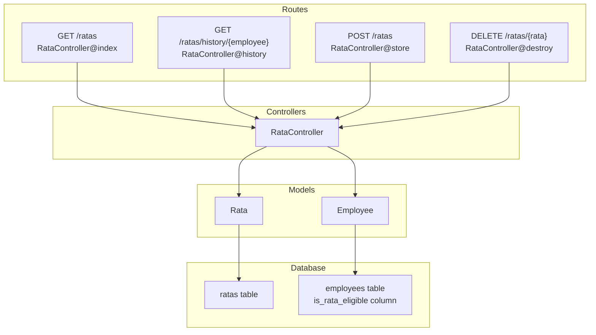
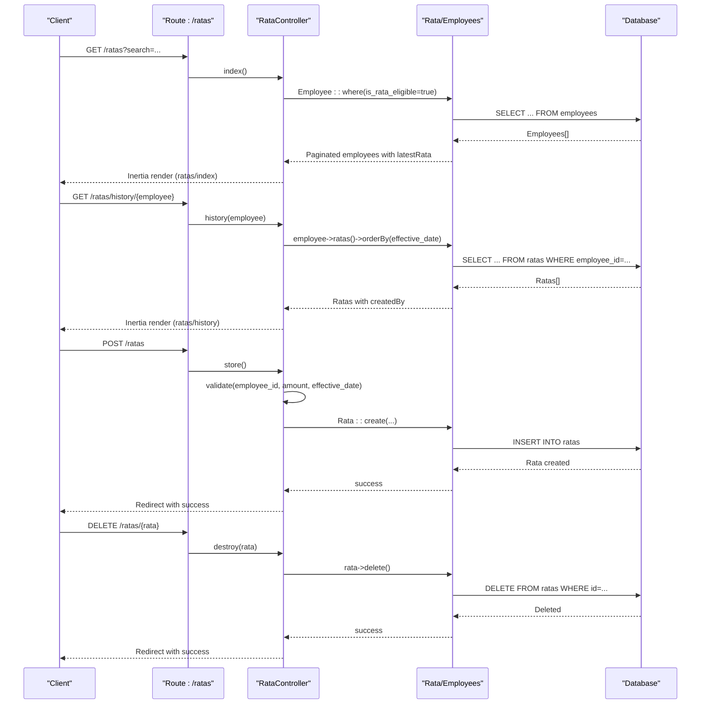
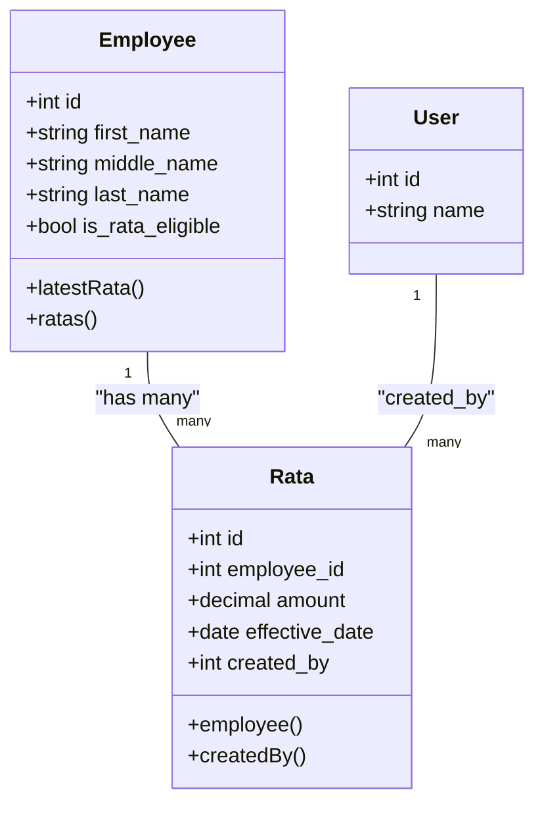
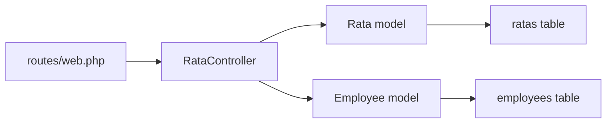

# RATA Deduction API

<cite>
**Referenced Files in This Document**
- [RataController.php](file://app/Http/Controllers/RataController.php)
- [Rata.php](file://app/Models/Rata.php)
- [Employee.php](file://app/Models/Employee.php)
- [2026_03_22_115111_create_ratas_table.php](file://database/migrations/2026_03_22_115111_create_ratas_table.php)
- [2026_03_22_115109_add_is_rata_eligible_to_employees_table.php](file://database/migrations/2026_03_22_115109_add_is_rata_eligible_to_employees_table.php)
- [web.php](file://routes/web.php)
- [rata.d.ts](file://resources/js/types/rata.d.ts)
- [index.tsx](file://resources/js/pages/ratas/index.tsx)
- [history.tsx](file://resources/js/pages/ratas/history.tsx)
- [rata.tsx](file://resources/js/pages/settings/Employee/manage/rata.tsx)
</cite>

## Table of Contents
1. [Introduction](#introduction)
2. [Project Structure](#project-structure)
3. [Core Components](#core-components)
4. [Architecture Overview](#architecture-overview)
5. [Detailed Component Analysis](#detailed-component-analysis)
6. [Dependency Analysis](#dependency-analysis)
7. [Performance Considerations](#performance-considerations)
8. [Troubleshooting Guide](#troubleshooting-guide)
9. [Conclusion](#conclusion)

## Introduction
This document provides comprehensive API documentation for the Rural Transformation Agenda (RATA) deduction endpoints. It covers the GET /ratas endpoint for retrieving RATA deduction records, GET /ratas/history/{employee} for employee RATA deduction history, POST /ratas for recording new RATA deductions, and DELETE /ratas/{rata} for removing RATA records. It also details the RATA calculation methodology, deduction rates, eligibility requirements, data model, compliance requirements, and error handling.

## Project Structure
The RATA functionality spans backend controllers and models, frontend pages, and database migrations. Routes are defined under the /ratas prefix and handled by the RataController. The Rata model defines the data structure and relationships, while the Employee model includes eligibility and historical associations.

**Diagram sources**
- [web.php:47-53](file://routes/web.php#L47-L53)
- [RataController.php:11-75](file://app/Http/Controllers/RataController.php#L11-L75)
- [Rata.php:8-40](file://app/Models/Rata.php#L8-L40)
- [Employee.php:10-104](file://app/Models/Employee.php#L10-L104)
- [2026_03_22_115111_create_ratas_table.php:14-21](file://database/migrations/2026_03_22_115111_create_ratas_table.php#L14-L21)
- [2026_03_22_115109_add_is_rata_eligible_to_employees_table.php:14-16](file://database/migrations/2026_03_22_115109_add_is_rata_eligible_to_employees_table.php#L14-L16)

**Section sources**
- [web.php:47-53](file://routes/web.php#L47-L53)
- [RataController.php:11-75](file://app/Http/Controllers/RataController.php#L11-L75)
- [Rata.php:8-40](file://app/Models/Rata.php#L8-L40)
- [Employee.php:10-104](file://app/Models/Employee.php#L10-L104)
- [2026_03_22_115111_create_ratas_table.php:14-21](file://database/migrations/2026_03_22_115111_create_ratas_table.php#L14-L21)
- [2026_03_22_115109_add_is_rata_eligible_to_employees_table.php:14-16](file://database/migrations/2026_03_22_115109_add_is_rata_eligible_to_employees_table.php#L14-L16)

## Core Components
- RataController: Handles requests for listing eligible employees, viewing employee RATA history, creating new RATA deductions, and deleting RATA records.
- Rata model: Defines fillable attributes, casting for amount and effective_date, relationships to Employee and User, and automatic created_by population.
- Employee model: Includes is_rata_eligible flag, ratas relationship, and latestRata accessor.
- Database migrations: Define the ratas table schema and the is_rata_eligible column addition to employees.
- Frontend types and pages: Define the Rata data contract and UI flows for adding and viewing RATA records.

Key implementation references:
- Controller actions and validations: [RataController.php:13-75](file://app/Http/Controllers/RataController.php#L13-L75)
- Model attributes and casts: [Rata.php:10-20](file://app/Models/Rata.php#L10-L20)
- Model relationships: [Rata.php:22-30](file://app/Models/Rata.php#L22-L30), [Employee.php:56-59](file://app/Models/Employee.php#L56-L59)
- Database schema: [2026_03_22_115111_create_ratas_table.php:14-21](file://database/migrations/2026_03_22_115111_create_ratas_table.php#L14-L21)
- Eligibility column: [2026_03_22_115109_add_is_rata_eligible_to_employees_table.php:14-16](file://database/migrations/2026_03_22_115109_add_is_rata_eligible_to_employees_table.php#L14-L16)
- Frontend types: [rata.d.ts:3-22](file://resources/js/types/rata.d.ts#L3-L22)

**Section sources**
- [RataController.php:13-75](file://app/Http/Controllers/RataController.php#L13-L75)
- [Rata.php:10-30](file://app/Models/Rata.php#L10-L30)
- [Employee.php:56-59](file://app/Models/Employee.php#L56-L59)
- [2026_03_22_115111_create_ratas_table.php:14-21](file://database/migrations/2026_03_22_115111_create_ratas_table.php#L14-L21)
- [2026_03_22_115109_add_is_rata_eligible_to_employees_table.php:14-16](file://database/migrations/2026_03_22_115109_add_is_rata_eligible_to_employees_table.php#L14-L16)
- [rata.d.ts:3-22](file://resources/js/types/rata.d.ts#L3-L22)

## Architecture Overview
The RATA endpoints follow a standard MVC pattern:
- Routes define the endpoint URLs and bind parameters.
- Controllers validate inputs, query models, and render responses.
- Models encapsulate data access, casting, and relationships.
- Views (Inertia pages) present data and collect user input for creating RATA records.

**Diagram sources**
- [web.php:47-53](file://routes/web.php#L47-L53)
- [RataController.php:13-75](file://app/Http/Controllers/RataController.php#L13-L75)
- [Rata.php:10-20](file://app/Models/Rata.php#L10-L20)
- [Employee.php:85-88](file://app/Models/Employee.php#L85-L88)

## Detailed Component Analysis

### Endpoint Definitions

#### GET /ratas
Purpose: Retrieve RATA-eligible employees with paginated results and optional search filtering. Returns employee details along with their latest RATA deduction.

Behavior:
- Filters employees where is_rata_eligible is true.
- Supports optional search on first_name, middle_name, last_name.
- Eager loads employmentStatus, office, and latestRata.
- Paginates results with query string support.

Response: Renders the RATA dashboard page with employees and filters.

Validation and constraints:
- Search parameter is optional.
- Pagination is applied with a fixed page size.

References:
- Controller action: [RataController.php:13-35](file://app/Http/Controllers/RataController.php#L13-L35)
- Eligibility column: [2026_03_22_115109_add_is_rata_eligible_to_employees_table.php:14-16](file://database/migrations/2026_03_22_115109_add_is_rata_eligible_to_employees_table.php#L14-L16)
- Latest RATA accessor: [Employee.php:85-88](file://app/Models/Employee.php#L85-L88)

**Section sources**
- [RataController.php:13-35](file://app/Http/Controllers/RataController.php#L13-L35)
- [2026_03_22_115109_add_is_rata_eligible_to_employees_table.php:14-16](file://database/migrations/2026_03_22_115109_add_is_rata_eligible_to_employees_table.php#L14-L16)
- [Employee.php:85-88](file://app/Models/Employee.php#L85-L88)

#### GET /ratas/history/{employee}
Purpose: Retrieve the complete RATA deduction history for a specific employee, ordered by effective_date descending.

Behavior:
- Loads employee with employmentStatus and office.
- Fetches all RATA records for the employee with createdBy relationship.
- Orders by effective_date descending.

Response: Renders the employee RATA history page with records and actions.

References:
- Controller action: [RataController.php:37-48](file://app/Http/Controllers/RataController.php#L37-L48)
- Employee relationships: [Employee.php:31-59](file://app/Models/Employee.php#L31-L59)
- Rata createdBy relationship: [Rata.php:27-30](file://app/Models/Rata.php#L27-L30)

**Section sources**
- [RataController.php:37-48](file://app/Http/Controllers/RataController.php#L37-L48)
- [Employee.php:31-59](file://app/Models/Employee.php#L31-L59)
- [Rata.php:27-30](file://app/Models/Rata.php#L27-L30)

#### POST /ratas
Purpose: Record a new RATA deduction for an eligible employee.

Behavior:
- Validates employee_id existence in employees table.
- Validates amount as numeric and min 0.
- Validates effective_date as date.
- Creates RATA record with created_by automatically populated from authenticated user.

Response: Redirects back with success message.

References:
- Controller store action: [RataController.php:50-66](file://app/Http/Controllers/RataController.php#L50-L66)
- Model fillable and casts: [Rata.php:10-20](file://app/Models/Rata.php#L10-L20)
- Model boot for created_by: [Rata.php:32-39](file://app/Models/Rata.php#L32-L39)
- Frontend form fields: [index.tsx:198-223](file://resources/js/pages/ratas/index.tsx#L198-L223)

**Section sources**
- [RataController.php:50-66](file://app/Http/Controllers/RataController.php#L50-L66)
- [Rata.php:10-20](file://app/Models/Rata.php#L10-L20)
- [Rata.php:32-39](file://app/Models/Rata.php#L32-L39)
- [index.tsx:198-223](file://resources/js/pages/ratas/index.tsx#L198-L223)

#### DELETE /ratas/{rata}
Purpose: Remove a RATA record.

Behavior:
- Deletes the specified RATA record.
- Redirects back with success message.

Response: Redirect with success.

References:
- Controller destroy action: [RataController.php:68-73](file://app/Http/Controllers/RataController.php#L68-L73)
- Frontend delete action: [history.tsx:27-31](file://resources/js/pages/ratas/history.tsx#L27-L31)

**Section sources**
- [RataController.php:68-73](file://app/Http/Controllers/RataController.php#L68-L73)
- [history.tsx:27-31](file://resources/js/pages/ratas/history.tsx#L27-L31)

### Data Model for RATA Deductions
The RATA deduction data model includes:
- id: Auto-incremented primary key
- employee_id: Foreign key to employees table
- amount: Decimal value with two decimal places
- effective_date: Date value
- created_by: Foreign key to users table
- created_at, updated_at: Timestamps

Relationships:
- Rata belongs to Employee via employee_id
- Rata belongs to User via created_by

**Diagram sources**
- [Rata.php:22-30](file://app/Models/Rata.php#L22-L30)
- [Employee.php:56-59](file://app/Models/Employee.php#L56-L59)
- [2026_03_22_115111_create_ratas_table.php:14-21](file://database/migrations/2026_03_22_115111_create_ratas_table.php#L14-L21)

**Section sources**
- [Rata.php:10-20](file://app/Models/Rata.php#L10-L20)
- [Rata.php:22-30](file://app/Models/Rata.php#L22-L30)
- [Employee.php:56-59](file://app/Models/Employee.php#L56-L59)
- [2026_03_22_115111_create_ratas_table.php:14-21](file://database/migrations/2026_03_22_115111_create_ratas_table.php#L14-L21)

### RATA Calculation Methodology and Deduction Rates
Current implementation details:
- Amount is stored as a decimal with two decimal places.
- Effective date determines chronological ordering for history retrieval.
- There is no computed rate or formula in the backend; amount is directly recorded.

Eligibility requirements:
- Employees must have is_rata_eligible set to true to appear in the /ratas listing.

Compliance requirements:
- created_by is automatically set to the authenticated user ID during creation.
- Amount validation enforces non-negative numeric values.
- effective_date validation ensures a valid date.

References:
- Amount casting: [Rata.php:17-19](file://app/Models/Rata.php#L17-L19)
- Eligibility column: [2026_03_22_115109_add_is_rata_eligible_to_employees_table.php:14-16](file://database/migrations/2026_03_22_115109_add_is_rata_eligible_to_employees_table.php#L14-L16)
- Created by auto-fill: [Rata.php:36-38](file://app/Models/Rata.php#L36-L38)
- Validation rules: [RataController.php:52-56](file://app/Http/Controllers/RataController.php#L52-L56)

**Section sources**
- [Rata.php:17-19](file://app/Models/Rata.php#L17-L19)
- [2026_03_22_115109_add_is_rata_eligible_to_employees_table.php:14-16](file://database/migrations/2026_03_22_115109_add_is_rata_eligible_to_employees_table.php#L14-L16)
- [Rata.php:36-38](file://app/Models/Rata.php#L36-L38)
- [RataController.php:52-56](file://app/Http/Controllers/RataController.php#L52-L56)

### Frontend Integration Details
- The RATA dashboard page supports search and pagination for eligible employees.
- The history page displays formatted currency and dates, and allows deletion of records.
- The manage employee page includes a stubbed rate table component.

References:
- Dashboard page: [index.tsx:158-174](file://resources/js/pages/ratas/index.tsx#L158-L174)
- History page: [history.tsx:26-103](file://resources/js/pages/ratas/history.tsx#L26-L103)
- Manage employee page: [rata.tsx:1-81](file://resources/js/pages/settings/Employee/manage/rata.tsx#L1-L81)

**Section sources**
- [index.tsx:158-174](file://resources/js/pages/ratas/index.tsx#L158-L174)
- [history.tsx:26-103](file://resources/js/pages/ratas/history.tsx#L26-L103)
- [rata.tsx:1-81](file://resources/js/pages/settings/Employee/manage/rata.tsx#L1-L81)

## Dependency Analysis
The RATA endpoints depend on:
- Routes binding parameters and invoking controller actions.
- Controller validating inputs and orchestrating model operations.
- Models defining relationships and casting.
- Database migrations ensuring schema consistency.

**Diagram sources**
- [web.php:47-53](file://routes/web.php#L47-L53)
- [RataController.php:13-75](file://app/Http/Controllers/RataController.php#L13-L75)
- [Rata.php:8-40](file://app/Models/Rata.php#L8-L40)
- [Employee.php:10-104](file://app/Models/Employee.php#L10-L104)
- [2026_03_22_115111_create_ratas_table.php:14-21](file://database/migrations/2026_03_22_115111_create_ratas_table.php#L14-L21)
- [2026_03_22_115109_add_is_rata_eligible_to_employees_table.php:14-16](file://database/migrations/2026_03_22_115109_add_is_rata_eligible_to_employees_table.php#L14-L16)

**Section sources**
- [web.php:47-53](file://routes/web.php#L47-L53)
- [RataController.php:13-75](file://app/Http/Controllers/RataController.php#L13-L75)
- [Rata.php:8-40](file://app/Models/Rata.php#L8-L40)
- [Employee.php:10-104](file://app/Models/Employee.php#L10-L104)
- [2026_03_22_115111_create_ratas_table.php:14-21](file://database/migrations/2026_03_22_115111_create_ratas_table.php#L14-L21)
- [2026_03_22_115109_add_is_rata_eligible_to_employees_table.php:14-16](file://database/migrations/2026_03_22_115109_add_is_rata_eligible_to_employees_table.php#L14-L16)

## Performance Considerations
- Pagination: The /ratas endpoint uses pagination to limit result sets, improving response times and memory usage.
- Eager loading: The controller eager-loads related data (employmentStatus, office, latestRata) to reduce N+1 queries.
- Indexing: Consider adding database indexes on employee_id and effective_date for improved query performance on large datasets.

## Troubleshooting Guide
Common issues and resolutions:
- Validation errors on POST /ratas:
  - employee_id missing or invalid: Ensure the employee exists in the employees table.
  - amount negative or non-numeric: Ensure amount is a valid positive number.
  - effective_date invalid: Ensure the date is in a valid date format.
  References: [RataController.php:52-56](file://app/Http/Controllers/RataController.php#L52-L56)

- Authorization:
  - All routes are protected by the auth middleware. Ensure the user is authenticated before calling endpoints.
  References: [web.php:20](file://routes/web.php#L20)

- Eligibility:
  - Employees must have is_rata_eligible set to true to appear in /ratas results.
  References: [2026_03_22_115109_add_is_rata_eligible_to_employees_table.php:14-16](file://database/migrations/2026_03_22_115109_add_is_rata_eligible_to_employees_table.php#L14-L16)

- Deletion failures:
  - Ensure the RATA record exists and the user has permission to delete.
  References: [RataController.php:68-73](file://app/Http/Controllers/RataController.php#L68-L73)

**Section sources**
- [RataController.php:52-56](file://app/Http/Controllers/RataController.php#L52-L56)
- [web.php:20](file://routes/web.php#L20)
- [2026_03_22_115109_add_is_rata_eligible_to_employees_table.php:14-16](file://database/migrations/2026_03_22_115109_add_is_rata_eligible_to_employees_table.php#L14-L16)
- [RataController.php:68-73](file://app/Http/Controllers/RataController.php#L68-L73)

## Conclusion
The RATA deduction endpoints provide a straightforward mechanism for managing RATA deductions against eligible employees. The implementation focuses on simplicity with explicit validation, automatic audit trail via created_by, and clear relationships between employees and their deduction records. Future enhancements could include computed deduction amounts based on salary tiers and additional compliance checks.