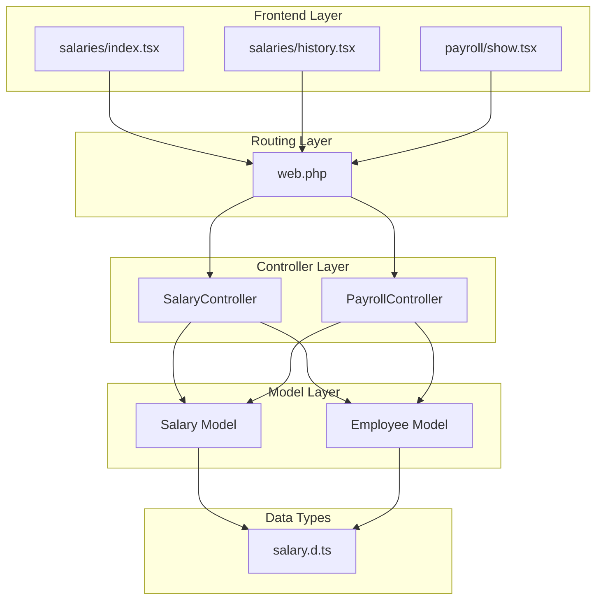
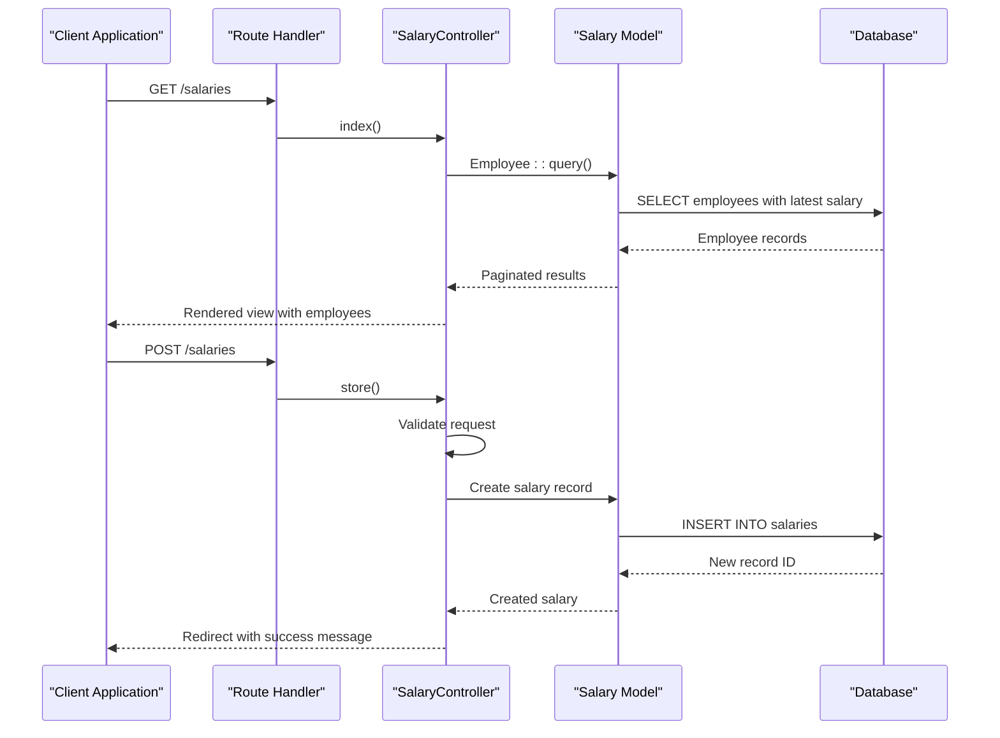
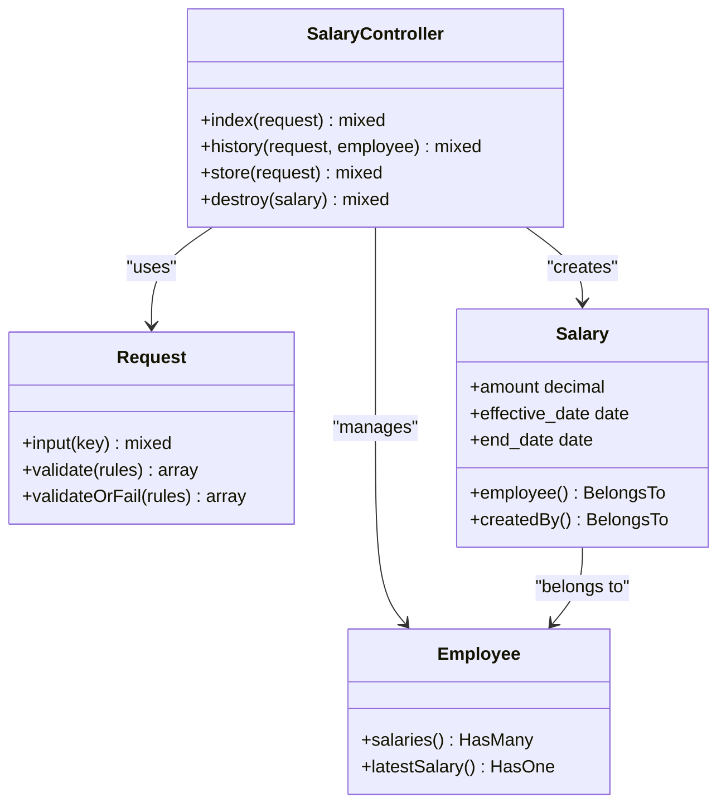
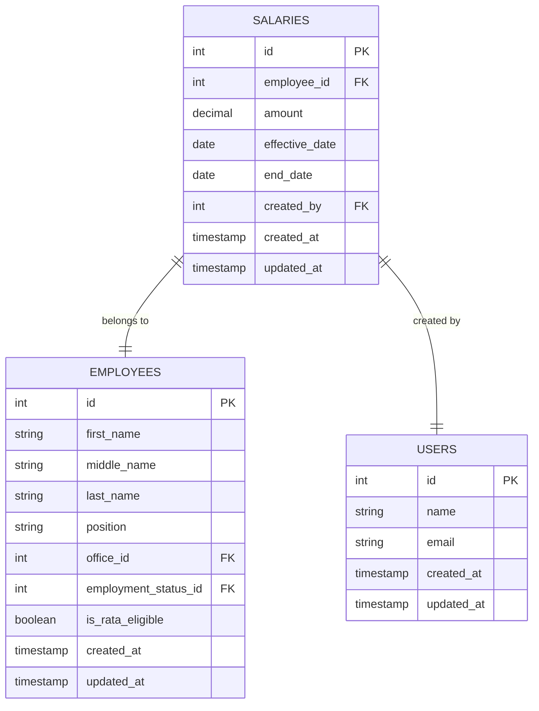
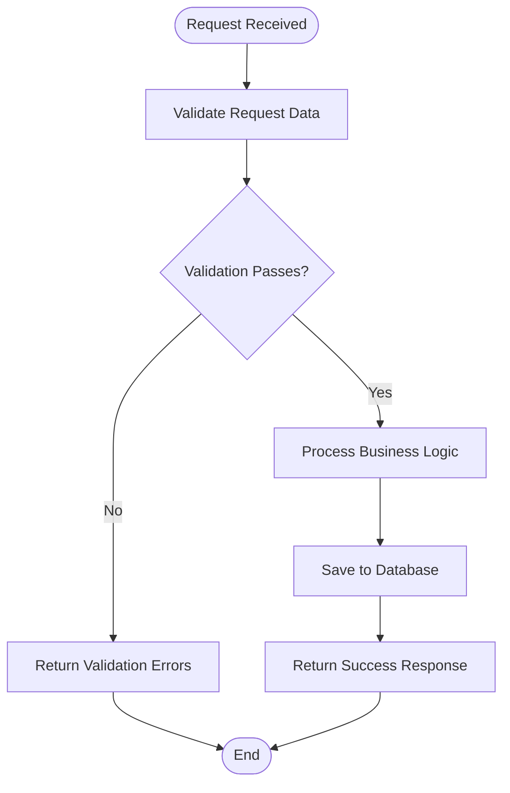
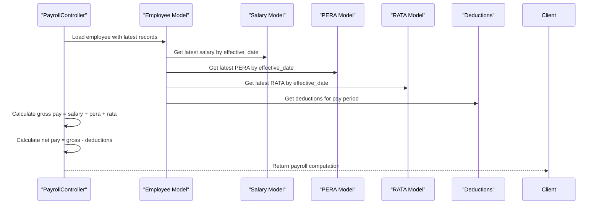

# Salary Management API

<cite>
**Referenced Files in This Document**
- [SalaryController.php](file://app/Http/Controllers/SalaryController.php)
- [Salary.php](file://app/Models/Salary.php)
- [Employee.php](file://app/Models/Employee.php)
- [web.php](file://routes/web.php)
- [salary.d.ts](file://resources/js/types/salary.d.ts)
- [index.tsx](file://resources/js/pages/salaries/index.tsx)
- [history.tsx](file://resources/js/pages/salaries/history.tsx)
- [payrollController.php](file://app/Http/Controllers/PayrollController.php)
- [show.tsx](file://resources/js/pages/payroll/show.tsx)
</cite>

## Table of Contents
1. [Introduction](#introduction)
2. [Project Structure](#project-structure)
3. [Core Components](#core-components)
4. [Architecture Overview](#architecture-overview)
5. [Detailed Component Analysis](#detailed-component-analysis)
6. [API Endpoints](#api-endpoints)
7. [Data Model](#data-model)
8. [Validation and Error Handling](#validation-and-error-handling)
9. [Relationship with Payroll Calculations](#relationship-with-payroll-calculations)
10. [Performance Considerations](#performance-considerations)
11. [Troubleshooting Guide](#troubleshooting-guide)
12. [Conclusion](#conclusion)

## Introduction

The Salary Management API provides comprehensive functionality for managing employee compensation records within the payroll system. This API enables organizations to track salary changes over time, calculate payroll based on effective dates, and maintain historical records for compliance and reporting purposes.

The system follows a modern Laravel architecture with Inertia.js for seamless frontend-backend integration, supporting both RESTful operations and interactive user experiences. The salary management module integrates tightly with the broader payroll system, ensuring accurate compensation calculations and historical tracking.

## Project Structure

The salary management functionality is organized across multiple layers of the application architecture:



**Diagram sources**
- [web.php:31-37](file://routes/web.php#L31-L37)
- [SalaryController.php:11-74](file://app/Http/Controllers/SalaryController.php#L11-L74)
- [PayrollController.php:11-125](file://app/Http/Controllers/PayrollController.php#L11-L125)

**Section sources**
- [web.php:1-100](file://routes/web.php#L1-L100)
- [SalaryController.php:1-74](file://app/Http/Controllers/SalaryController.php#L1-L74)

## Core Components

The salary management system consists of several interconnected components that work together to provide comprehensive salary administration capabilities:

### Controller Layer
- **SalaryController**: Handles all salary-related operations including CRUD operations, history retrieval, and validation
- **PayrollController**: Integrates salary data with payroll calculations and provides historical analysis

### Model Layer
- **Salary Model**: Manages salary records with proper casting, relationships, and soft deletion support
- **Employee Model**: Provides salary history aggregation and latest salary computation

### Frontend Integration
- **React Components**: Interactive salary management interfaces with real-time validation and formatting
- **Type Definitions**: Strongly typed interfaces for salary data across the application stack

**Section sources**
- [SalaryController.php:11-74](file://app/Http/Controllers/SalaryController.php#L11-L74)
- [Salary.php:8-36](file://app/Models/Salary.php#L8-L36)
- [Employee.php:10-104](file://app/Models/Employee.php#L10-L104)

## Architecture Overview

The salary management system follows a layered architecture pattern with clear separation of concerns:



**Diagram sources**
- [web.php:31-37](file://routes/web.php#L31-L37)
- [SalaryController.php:13-65](file://app/Http/Controllers/SalaryController.php#L13-L65)
- [Salary.php:12-18](file://app/Models/Salary.php#L12-L18)

## Detailed Component Analysis

### SalaryController Implementation

The SalaryController serves as the primary interface for salary management operations, implementing comprehensive validation and business logic:



**Diagram sources**
- [SalaryController.php:11-74](file://app/Http/Controllers/SalaryController.php#L11-L74)
- [Employee.php:46-72](file://app/Models/Employee.php#L46-L72)
- [Salary.php:26-34](file://app/Models/Salary.php#L26-L34)

**Section sources**
- [SalaryController.php:11-74](file://app/Http/Controllers/SalaryController.php#L11-L74)

### Data Model Relationships

The salary data model establishes crucial relationships with employees and users while maintaining data integrity:



**Diagram sources**
- [Salary.php:12-18](file://app/Models/Salary.php#L12-L18)
- [Employee.php:14-25](file://app/Models/Employee.php#L14-L25)

**Section sources**
- [Salary.php:8-36](file://app/Models/Salary.php#L8-L36)
- [Employee.php:10-104](file://app/Models/Employee.php#L10-L104)

## API Endpoints

The salary management API provides four primary endpoints for comprehensive salary administration:

### GET /salaries
Retrieves paginated employee records with their latest salary information and search capabilities.

**Request Parameters:**
- `search` (optional): Text search for employee names
- Pagination handled automatically with 50 items per page

**Response Schema:**
```typescript
interface EmployeesResponse {
    data: EmployeeWithLatestSalary[];
    links: PaginationLinks;
    meta: PaginationMeta;
}

interface EmployeeWithLatestSalary {
    id: number;
    first_name: string;
    middle_name: string;
    last_name: string;
    position: string;
    office: Office;
    latest_salary: Salary | null;
}
```

**Section sources**
- [SalaryController.php:13-34](file://app/Http/Controllers/SalaryController.php#L13-L34)
- [index.tsx:25-28](file://resources/js/pages/salaries/index.tsx#L25-L28)

### GET /salaries/history/{employee}
Fetches complete salary history for a specific employee, ordered by effective date descending.

**Path Parameters:**
- `{employee}`: Employee ID

**Response Schema:**
```typescript
interface SalaryHistoryResponse {
    employee: Employee;
    salaries: Salary[];
}

interface Salary {
    id: number;
    employee_id: number;
    amount: number;
    effective_date: string;
    end_date?: string;
    created_by: number;
    created_at: string;
    updated_at: string;
    created_by_user?: {
        id: number;
        name: string;
    };
}
```

**Section sources**
- [SalaryController.php:36-47](file://app/Http/Controllers/SalaryController.php#L36-L47)
- [history.tsx:21-24](file://resources/js/pages/salaries/history.tsx#L21-L24)

### POST /salaries
Creates a new salary record for an employee with validation and audit trail.

**Request Body:**
```typescript
interface CreateSalaryRequest {
    employee_id: number;
    amount: number;
    effective_date: string;
}
```

**Validation Rules:**
- `employee_id`: required, must exist in employees table
- `amount`: required, numeric, min 0
- `effective_date`: required, valid date format

**Response:**
Redirect with success message upon successful creation.

**Section sources**
- [SalaryController.php:49-65](file://app/Http/Controllers/SalaryController.php#L49-L65)
- [index.tsx:38-48](file://resources/js/pages/salaries/index.tsx#L38-L48)

### DELETE /salaries/{salary}
Removes a salary record with proper authorization and cascade effects.

**Path Parameters:**
- `{salary}`: Salary record ID

**Response:**
Redirect with success message upon successful deletion.

**Section sources**
- [SalaryController.php:67-72](file://app/Http/Controllers/SalaryController.php#L67-L72)

## Data Model

The salary data model defines the structure and behavior of salary records throughout the system:

### Core Fields
- **id**: Unique identifier for salary records
- **employee_id**: Foreign key linking to the employee
- **amount**: Decimal value representing the salary amount (precision: 2 decimal places)
- **effective_date**: Date when the salary becomes active
- **end_date**: Optional termination date for the salary record
- **created_by**: User who created the record (audit trail)

### Type Casting and Formatting
The model implements automatic type casting for consistent data handling:
- Amount values are cast to decimal with 2 precision for currency formatting
- Dates are automatically formatted as date objects
- Soft deletes are supported for data retention

### Relationships
- **Employee Relationship**: Each salary belongs to one employee
- **User Relationship**: Tracks which user created the salary record
- **Historical Tracking**: Enables complete salary change history

**Section sources**
- [Salary.php:12-24](file://app/Models/Salary.php#L12-L24)
- [Salary.php:26-34](file://app/Models/Salary.php#L26-L34)

## Validation and Error Handling

The salary management system implements comprehensive validation and error handling mechanisms:

### Request Validation
All incoming requests undergo strict validation:



**Diagram sources**
- [SalaryController.php:51-55](file://app/Http/Controllers/SalaryController.php#L51-L55)

### Error Scenarios
- **Invalid Employee ID**: Returns validation error for non-existent employee
- **Invalid Amount**: Rejects negative amounts or invalid numeric formats
- **Invalid Date**: Validates date format and logical consistency
- **Authorization**: Ensures proper authentication for all operations

### Response Handling
- Successful operations return appropriate HTTP status codes
- Validation errors include detailed error messages
- Redirect-based responses for frontend interactions
- Consistent error formatting across all endpoints

**Section sources**
- [SalaryController.php:51-55](file://app/Http/Controllers/SalaryController.php#L51-L55)

## Relationship with Payroll Calculations

Salary records form the foundation of payroll calculations, with the system designed to accurately reflect compensation changes over time:

### Payroll Integration
The PayrollController integrates salary data with other compensation components:



**Diagram sources**
- [PayrollController.php:30-67](file://app/Http/Controllers/PayrollController.php#L30-L67)
- [show.tsx:93-98](file://resources/js/pages/payroll/show.tsx#L93-L98)

### Historical Accuracy
- Salary history determines compensation for specific pay periods
- Effective dates ensure proper calculation of prorated amounts
- Multiple salary records enable accurate historical reporting
- Integration with PERA and RATA provides complete compensation picture

### Calculation Procedures
- **Gross Pay**: Sum of current salary, PERA, and RATA amounts
- **Net Pay**: Gross pay minus total deductions for the period
- **Period Coverage**: Salary records validated against pay period dates
- **Eligibility Checks**: RATA calculations depend on employee eligibility

**Section sources**
- [PayrollController.php:83-123](file://app/Http/Controllers/PayrollController.php#L83-L123)
- [show.tsx:93-98](file://resources/js/pages/payroll/show.tsx#L93-L98)

## Performance Considerations

The salary management system incorporates several performance optimization strategies:

### Database Optimization
- **Eager Loading**: Strategic loading of related models to minimize N+1 queries
- **Indexing**: Proper indexing on foreign keys and frequently queried columns
- **Pagination**: Automatic pagination for large employee datasets
- **Soft Deletes**: Efficient data retention without physical deletion overhead

### Memory Management
- **Lazy Loading**: Related models loaded only when needed
- **Casting**: Automatic type casting reduces manual conversion overhead
- **Query Optimization**: Optimized queries for latest salary retrieval

### Frontend Performance
- **Client-Side Caching**: React components leverage caching for repeated operations
- **Efficient Rendering**: Virtualized lists for large datasets
- **Minimal Re-renders**: Optimized state management to reduce unnecessary updates

## Troubleshooting Guide

Common issues and their resolutions:

### Authentication Issues
- **Problem**: Access denied to salary endpoints
- **Solution**: Ensure user is authenticated and authorized
- **Verification**: Check authentication middleware configuration

### Data Validation Errors
- **Problem**: Validation failures on salary creation
- **Common Causes**: Invalid employee ID, negative amounts, malformed dates
- **Resolution**: Verify input data matches validation requirements

### Performance Issues
- **Problem**: Slow salary history retrieval
- **Causes**: Missing indexes, unoptimized queries, large datasets
- **Solutions**: Implement proper indexing, optimize queries, consider pagination

### Integration Problems
- **Problem**: Payroll calculations not reflecting salary changes
- **Causes**: Incorrect effective dates, missing salary records
- **Resolutions**: Verify salary record dates, ensure proper loading of latest records

**Section sources**
- [SalaryController.php:51-55](file://app/Http/Controllers/SalaryController.php#L51-L55)
- [PayrollController.php:30-67](file://app/Http/Controllers/PayrollController.php#L30-L67)

## Conclusion

The Salary Management API provides a robust, scalable solution for employee compensation administration. Its comprehensive validation, strong data modeling, and seamless integration with payroll calculations make it suitable for organizations requiring accurate salary tracking and historical analysis.

Key strengths include:
- **Data Integrity**: Strong validation and type casting ensure reliable data handling
- **Historical Accuracy**: Complete salary change tracking enables precise payroll calculations
- **User Experience**: Intuitive frontend interfaces with real-time validation
- **Integration**: Seamless connection with broader payroll and deduction systems
- **Performance**: Optimized queries and efficient data handling for large-scale deployments

The system's modular architecture supports future enhancements while maintaining backward compatibility and operational reliability.