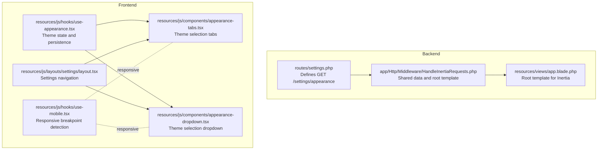
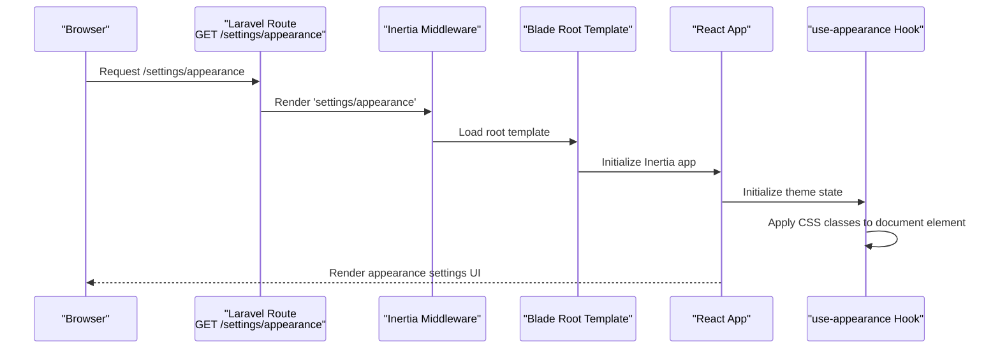
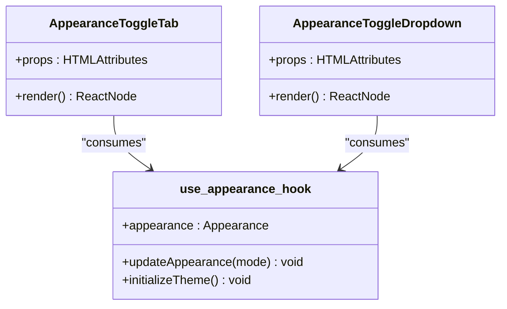
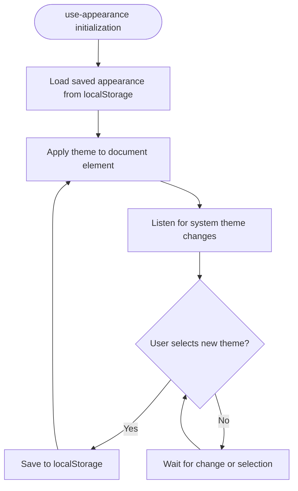
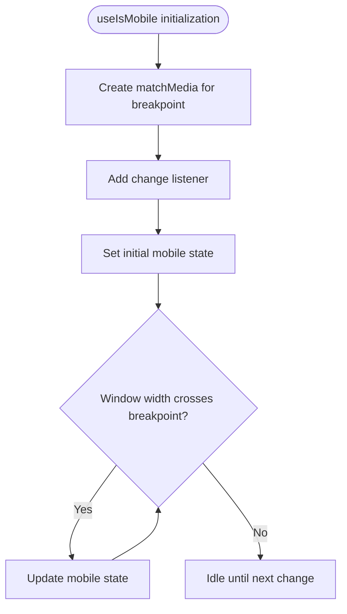
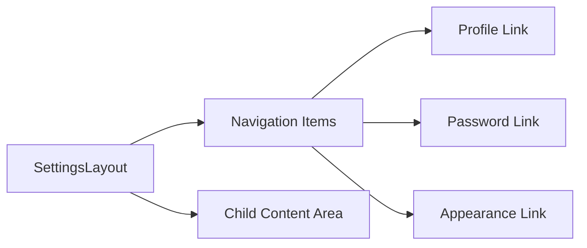
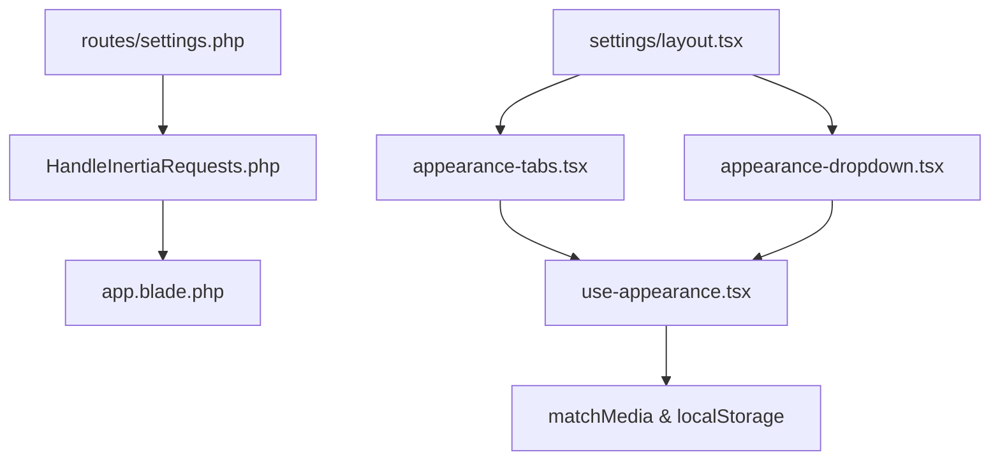

# Appearance Settings API

<cite>
**Referenced Files in This Document**
- [settings.php](file://routes/settings.php)
- [HandleInertiaRequests.php](file://app/Http/Middleware/HandleInertiaRequests.php)
- [use-appearance.tsx](file://resources/js/hooks/use-appearance.tsx)
- [use-mobile.tsx](file://resources/js/hooks/use-mobile.tsx)
- [layout.tsx](file://resources/js/layouts/settings/layout.tsx)
- [appearance-tabs.tsx](file://resources/js/components/appearance-tabs.tsx)
- [appearance-dropdown.tsx](file://resources/js/components/appearance-dropdown.tsx)
- [app.blade.php](file://resources/views/app.blade.php)
</cite>

## Table of Contents
1. [Introduction](#introduction)
2. [Project Structure](#project-structure)
3. [Core Components](#core-components)
4. [Architecture Overview](#architecture-overview)
5. [Detailed Component Analysis](#detailed-component-analysis)
6. [Dependency Analysis](#dependency-analysis)
7. [Performance Considerations](#performance-considerations)
8. [Troubleshooting Guide](#troubleshooting-guide)
9. [Conclusion](#conclusion)

## Introduction
This document provides comprehensive API documentation for the appearance and theme settings management system. It focuses on the GET /settings/appearance endpoint that renders the appearance settings page via Inertia.js, detailing the appearance settings interface, theme selection mechanisms, color scheme handling, and responsive design preferences. It also explains the integration with the use-appearance and use-mobile hooks for dynamic UI adaptation, the frontend component structure, state management, and user preference persistence.

## Project Structure
The appearance settings feature spans backend routing, middleware, frontend hooks, and UI components:

- Backend route definition for the appearance settings page
- Inertia middleware for shared data and template loading
- Frontend hooks for theme state and mobile detection
- UI components for theme selection (tabs and dropdown)
- Settings layout for navigation and content organization
- Blade template for Inertia root rendering

**Diagram sources**
- [settings.php:18-20](file://routes/settings.php#L18-L20)
- [HandleInertiaRequests.php:9-53](file://app/Http/Middleware/HandleInertiaRequests.php#L9-L53)
- [app.blade.php:1-21](file://resources/views/app.blade.php#L1-L21)
- [use-appearance.tsx:1-47](file://resources/js/hooks/use-appearance.tsx#L1-L47)
- [use-mobile.tsx:1-23](file://resources/js/hooks/use-mobile.tsx#L1-L23)
- [appearance-tabs.tsx:1-35](file://resources/js/components/appearance-tabs.tsx#L1-L35)
- [appearance-dropdown.tsx:1-54](file://resources/js/components/appearance-dropdown.tsx#L1-L54)
- [layout.tsx:1-63](file://resources/js/layouts/settings/layout.tsx#L1-L63)

**Section sources**
- [settings.php:18-20](file://routes/settings.php#L18-L20)
- [HandleInertiaRequests.php:9-53](file://app/Http/Middleware/HandleInertiaRequests.php#L9-L53)
- [app.blade.php:1-21](file://resources/views/app.blade.php#L1-L21)

## Core Components
This section documents the primary building blocks of the appearance settings system:

- GET /settings/appearance endpoint: Renders the appearance settings page using Inertia.js
- Theme hook (use-appearance): Manages theme state, applies CSS classes, and persists preferences
- Responsive hook (use-mobile): Detects mobile breakpoints for adaptive UI
- Appearance components: Tabs and dropdown for theme selection
- Settings layout: Navigation and content container for settings pages

Key responsibilities:
- Route handler delegates rendering to the Inertia page component
- Theme hook initializes and updates appearance, toggling dark mode class on the document element
- Components consume the theme hook to render interactive controls
- Layout provides navigation to the appearance settings page

**Section sources**
- [settings.php:18-20](file://routes/settings.php#L18-L20)
- [use-appearance.tsx:1-47](file://resources/js/hooks/use-appearance.tsx#L1-L47)
- [use-mobile.tsx:1-23](file://resources/js/hooks/use-mobile.tsx#L1-L23)
- [appearance-tabs.tsx:1-35](file://resources/js/components/appearance-tabs.tsx#L1-L35)
- [appearance-dropdown.tsx:1-54](file://resources/js/components/appearance-dropdown.tsx#L1-L54)
- [layout.tsx:1-63](file://resources/js/layouts/settings/layout.tsx#L1-L63)

## Architecture Overview
The appearance settings architecture integrates Laravel routing, Inertia middleware, and React components:

**Diagram sources**
- [settings.php:18-20](file://routes/settings.php#L18-L20)
- [HandleInertiaRequests.php:9-53](file://app/Http/Middleware/HandleInertiaRequests.php#L9-L53)
- [app.blade.php:1-21](file://resources/views/app.blade.php#L1-L21)
- [use-appearance.tsx:20-27](file://resources/js/hooks/use-appearance.tsx#L20-L27)

## Detailed Component Analysis

### GET /settings/appearance Endpoint
The endpoint defines a single route that renders the appearance settings page via Inertia. It ensures authentication through middleware and returns the Inertia response for the designated page component.

Behavior:
- Requires authentication
- Returns Inertia::render('settings/appearance')
- Named route for easy linking

Integration points:
- Uses Inertia middleware for shared data and template loading
- Relies on the root Blade template for initial hydration

**Section sources**
- [settings.php:18-20](file://routes/settings.php#L18-L20)
- [HandleInertiaRequests.php:9-53](file://app/Http/Middleware/HandleInertiaRequests.php#L9-L53)
- [app.blade.php:1-21](file://resources/views/app.blade.php#L1-L21)

### Theme Selection Interface
The appearance settings interface provides two complementary components for theme selection:

- AppearanceToggleTab: A tabbed interface with options for light, dark, and system themes
- AppearanceToggleDropdown: A dropdown menu offering the same theme options

Both components:
- Import the use-appearance hook
- Display icons representing each theme option
- Call updateAppearance when a theme is selected
- Reflect the currently active theme in their UI state

**Diagram sources**
- [appearance-tabs.tsx:1-35](file://resources/js/components/appearance-tabs.tsx#L1-L35)
- [appearance-dropdown.tsx:1-54](file://resources/js/components/appearance-dropdown.tsx#L1-L54)
- [use-appearance.tsx:29-46](file://resources/js/hooks/use-appearance.tsx#L29-L46)

**Section sources**
- [appearance-tabs.tsx:1-35](file://resources/js/components/appearance-tabs.tsx#L1-L35)
- [appearance-dropdown.tsx:1-54](file://resources/js/components/appearance-dropdown.tsx#L1-L54)

### Theme State Management and Persistence
The use-appearance hook manages theme state and persistence:

- Type definition for Appearance includes light, dark, and system
- Applies dark mode class to the document element based on the selected theme
- Persists user preferences to localStorage
- Initializes theme on mount and listens for system theme changes

**Diagram sources**
- [use-appearance.tsx:20-46](file://resources/js/hooks/use-appearance.tsx#L20-L46)

**Section sources**
- [use-appearance.tsx:1-47](file://resources/js/hooks/use-appearance.tsx#L1-L47)

### Responsive Design Preferences
The use-mobile hook detects mobile breakpoints and enables responsive adaptations:

- Defines a mobile breakpoint constant
- Uses matchMedia to detect viewport changes
- Updates state when the breakpoint condition changes
- Provides a boolean indicating mobile vs desktop

**Diagram sources**
- [use-mobile.tsx:1-23](file://resources/js/hooks/use-mobile.tsx#L1-L23)

**Section sources**
- [use-mobile.tsx:1-23](file://resources/js/hooks/use-mobile.tsx#L1-L23)

### Settings Layout Integration
The settings layout provides navigation to the appearance settings page and organizes content:

- Sidebar navigation items include links to profile, password, and appearance
- Highlights the active navigation item based on current path
- Wraps child components to provide consistent spacing and layout

**Diagram sources**
- [layout.tsx:8-24](file://resources/js/layouts/settings/layout.tsx#L8-L24)
- [layout.tsx:26-62](file://resources/js/layouts/settings/layout.tsx#L26-L62)

**Section sources**
- [layout.tsx:1-63](file://resources/js/layouts/settings/layout.tsx#L1-L63)

## Dependency Analysis
The appearance settings system exhibits clear separation of concerns with minimal coupling:

- Route depends on Inertia middleware for rendering
- Inertia middleware depends on the root Blade template
- UI components depend on the theme hook
- Theme hook depends on browser APIs and localStorage
- Layout depends on navigation items and shared UI components

**Diagram sources**
- [settings.php:18-20](file://routes/settings.php#L18-L20)
- [HandleInertiaRequests.php:9-53](file://app/Http/Middleware/HandleInertiaRequests.php#L9-L53)
- [app.blade.php:1-21](file://resources/views/app.blade.php#L1-L21)
- [appearance-tabs.tsx:1-35](file://resources/js/components/appearance-tabs.tsx#L1-L35)
- [appearance-dropdown.tsx:1-54](file://resources/js/components/appearance-dropdown.tsx#L1-L54)
- [use-appearance.tsx:1-47](file://resources/js/hooks/use-appearance.tsx#L1-L47)
- [layout.tsx:1-63](file://resources/js/layouts/settings/layout.tsx#L1-L63)

**Section sources**
- [settings.php:18-20](file://routes/settings.php#L18-L20)
- [HandleInertiaRequests.php:9-53](file://app/Http/Middleware/HandleInertiaRequests.php#L9-L53)
- [use-appearance.tsx:1-47](file://resources/js/hooks/use-appearance.tsx#L1-L47)

## Performance Considerations
- Theme switching uses efficient DOM class toggling and localStorage writes
- Media query listeners are cleaned up on component unmount to prevent memory leaks
- Inertia rendering minimizes server round trips for client-side navigation
- Breakpoint detection leverages native matchMedia for optimal performance

## Troubleshooting Guide
Common issues and resolutions:
- Theme not persisting across sessions: Verify localStorage availability and permissions
- System theme not updating: Ensure media query listeners are attached and not removed prematurely
- UI not reflecting active theme: Confirm the document element receives the dark class when appropriate
- Mobile layout not adapting: Check matchMedia listener registration and breakpoint constants

**Section sources**
- [use-appearance.tsx:13-27](file://resources/js/hooks/use-appearance.tsx#L13-L27)
- [use-mobile.tsx:8-19](file://resources/js/hooks/use-mobile.tsx#L8-L19)

## Conclusion
The appearance settings system provides a cohesive solution for theme management and responsive design through Inertia.js. The GET /settings/appearance endpoint integrates seamlessly with the frontend hook and UI components, enabling users to select between light, dark, and system themes while maintaining preferences locally. The modular architecture supports maintainability and extensibility for future enhancements.