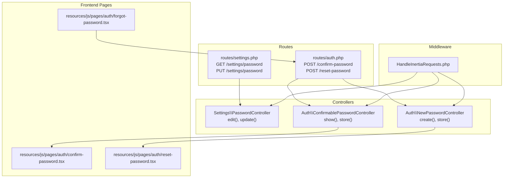
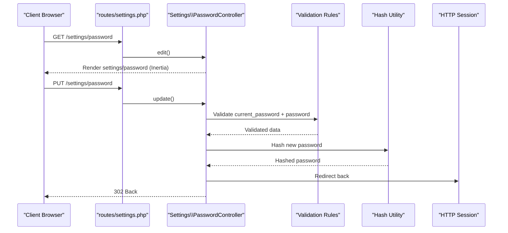
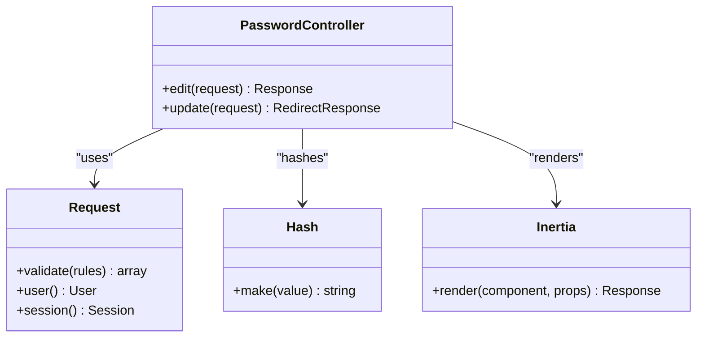
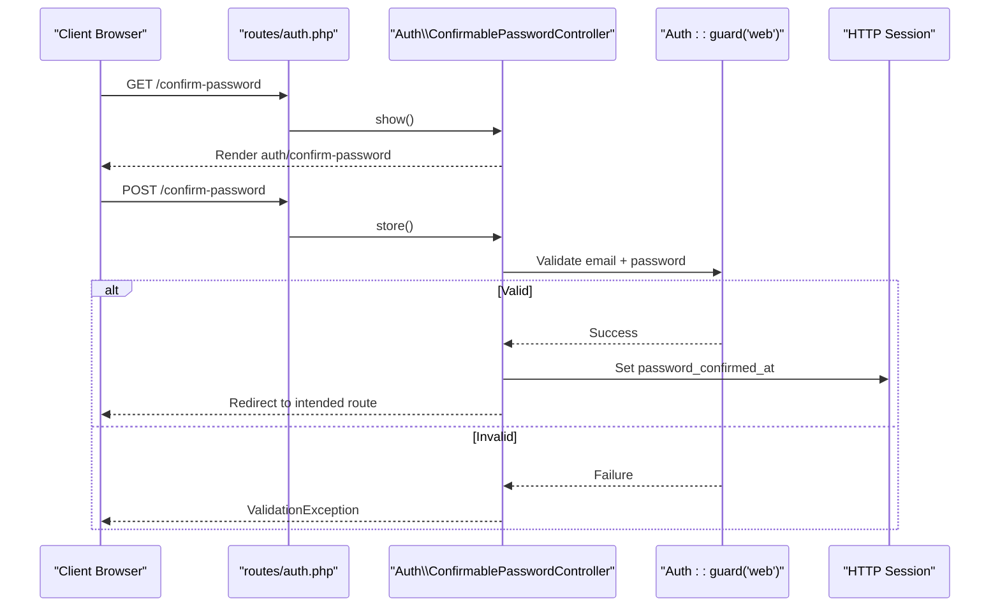
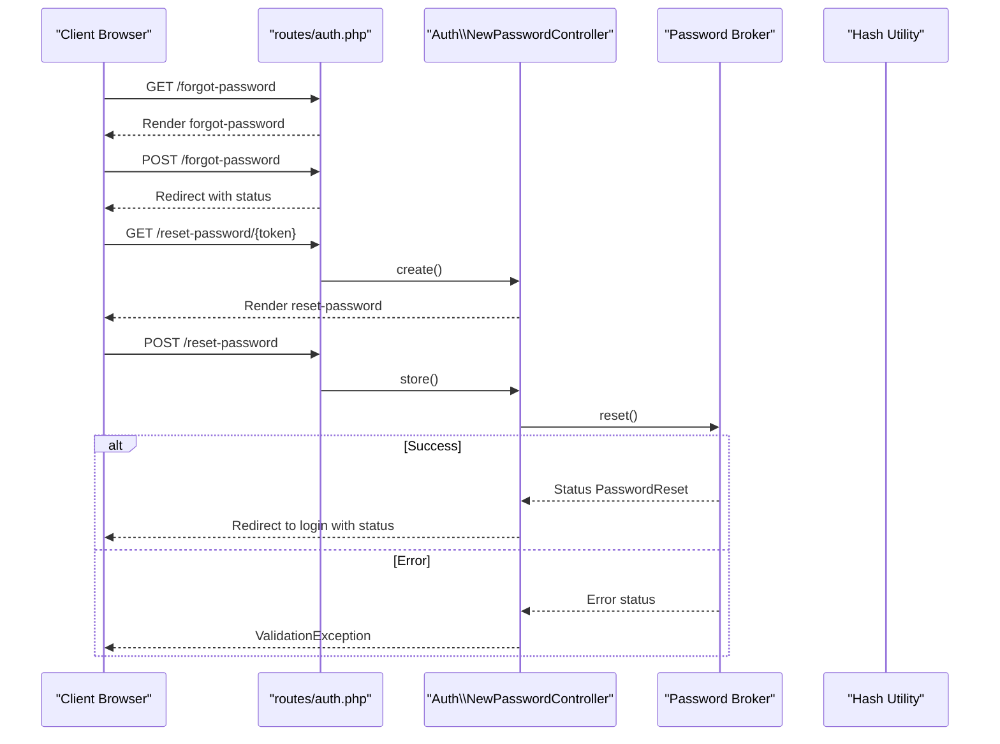
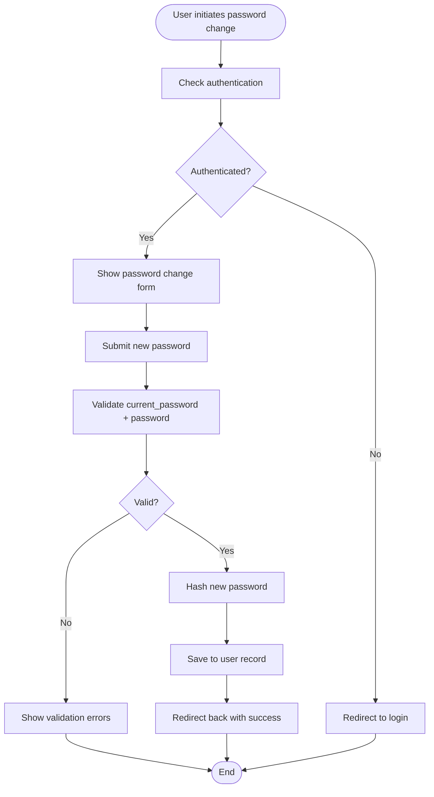
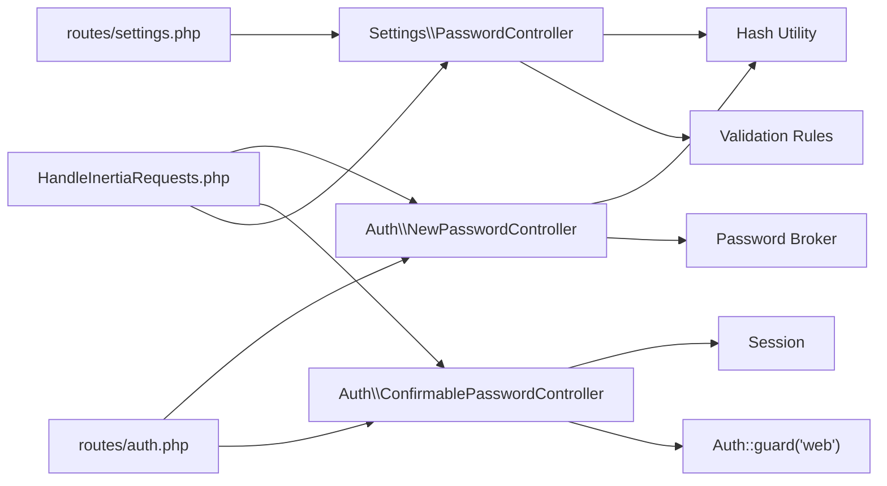

# Password Settings API

<cite>
**Referenced Files in This Document**
- [PasswordController.php](file://app/Http/Controllers/Settings/PasswordController.php)
- [settings.php](file://routes/settings.php)
- [confirm-password.tsx](file://resources/js/pages/auth/confirm-password.tsx)
- [reset-password.tsx](file://resources/js/pages/auth/reset-password.tsx)
- [forgot-password.tsx](file://resources/js/pages/auth/forgot-password.tsx)
- [ConfirmablePasswordController.php](file://app/Http/Controllers/Auth/ConfirmablePasswordController.php)
- [NewPasswordController.php](file://app/Http/Controllers/Auth/NewPasswordController.php)
- [auth.php](file://routes/auth.php)
- [HandleInertiaRequests.php](file://app/Http/Middleware/HandleInertiaRequests.php)
- [PasswordUpdateTest.php](file://tests/Feature/Settings/PasswordUpdateTest.php)
</cite>

## Table of Contents
1. [Introduction](#introduction)
2. [Project Structure](#project-structure)
3. [Core Components](#core-components)
4. [Architecture Overview](#architecture-overview)
5. [Detailed Component Analysis](#detailed-component-analysis)
6. [Dependency Analysis](#dependency-analysis)
7. [Performance Considerations](#performance-considerations)
8. [Troubleshooting Guide](#troubleshooting-guide)
9. [Conclusion](#conclusion)

## Introduction
This document provides comprehensive API documentation for password management endpoints focused on the settings module. It covers:
- GET /settings/password for rendering the password change interface
- PUT /settings/password for modifying the user's password
- PasswordController implementation and validation rules
- Authentication middleware requirements and password confirmation patterns
- Password strength requirements and confirmation dialogs
- Error handling and integration with password reset functionality
- Security best practices for password updates

## Project Structure
The password settings feature spans backend controllers, routes, frontend pages, and middleware:
- Backend: Settings controller and routes under app/Http/Controllers/Settings and routes/settings.php
- Frontend: React pages under resources/js/pages/auth for password confirmation and reset flows
- Authentication: Routes and controllers under routes/auth.php and app/Http/Controllers/Auth
- Shared state: Inertia middleware under app/Http/Middleware/HandleInertiaRequests.php

**Diagram sources**
- [settings.php:1-22](file://routes/settings.php#L1-L22)
- [auth.php:1-57](file://routes/auth.php#L1-L57)
- [PasswordController.php:14-43](file://app/Http/Controllers/Settings/PasswordController.php#L14-L43)
- [ConfirmablePasswordController.php:13-41](file://app/Http/Controllers/Auth/ConfirmablePasswordController.php#L13-L41)
- [NewPasswordController.php:17-69](file://app/Http/Controllers/Auth/NewPasswordController.php#L17-L69)
- [confirm-password.tsx:12-60](file://resources/js/pages/auth/confirm-password.tsx#L12-L60)
- [reset-password.tsx:23-98](file://resources/js/pages/auth/reset-password.tsx#L23-L98)
- [forgot-password.tsx:13-63](file://resources/js/pages/auth/forgot-password.tsx#L13-L63)
- [HandleInertiaRequests.php:37-52](file://app/Http/Middleware/HandleInertiaRequests.php#L37-L52)

**Section sources**
- [settings.php:1-22](file://routes/settings.php#L1-L22)
- [auth.php:1-57](file://routes/auth.php#L1-L57)
- [HandleInertiaRequests.php:37-52](file://app/Http/Middleware/HandleInertiaRequests.php#L37-L52)

## Core Components
- Settings PasswordController
  - GET /settings/password renders the password change page with inertia
  - PUT /settings/password validates and updates the user's password
- Authentication Routes and Controllers
  - POST /confirm-password confirms the user's current password before accessing protected areas
  - POST /reset-password handles password resets via token
- Frontend Pages
  - Password confirmation page collects current password and redirects on success
  - Password reset page collects new password and confirmation
  - Forgot password page requests a reset link

Key validations and behaviors:
- Current password verification using Laravel's current_password rule
- Password strength enforced via Password::defaults()
- Password confirmation enforced via confirmed rule
- Session-based password confirmation timeout managed by the framework

**Section sources**
- [PasswordController.php:19-42](file://app/Http/Controllers/Settings/PasswordController.php#L19-L42)
- [auth.php:37-56](file://routes/auth.php#L37-L56)
- [ConfirmablePasswordController.php:18-40](file://app/Http/Controllers/Auth/ConfirmablePasswordController.php#L18-L40)
- [NewPasswordController.php:35-68](file://app/Http/Controllers/Auth/NewPasswordController.php#L35-L68)
- [confirm-password.tsx:17-23](file://resources/js/pages/auth/confirm-password.tsx#L17-L23)
- [reset-password.tsx:31-36](file://resources/js/pages/auth/reset-password.tsx#L31-L36)

## Architecture Overview
The password settings API follows a layered architecture:
- Routes define endpoints under the auth middleware group
- Controllers handle request validation and business logic
- Middleware shares authenticated user and flash messages with frontend
- Frontend pages submit forms to backend endpoints

**Diagram sources**
- [settings.php:8-16](file://routes/settings.php#L8-L16)
- [PasswordController.php:19-42](file://app/Http/Controllers/Settings/PasswordController.php#L19-L42)

## Detailed Component Analysis

### PasswordController Implementation
Responsibilities:
- edit(): Renders the password settings page with inertia, passing mustVerifyEmail flag and optional status messages
- update(): Validates current password and new password, hashes the new password, and redirects back

Validation rules:
- current_password: Ensures the provided current password matches the user's stored password
- password: Enforced with Password::defaults() for strength and confirmed for confirmation

Security considerations:
- Requires authentication via auth middleware
- Uses hashing for password storage
- Returns back to the referring page after successful update

**Diagram sources**
- [PasswordController.php:14-43](file://app/Http/Controllers/Settings/PasswordController.php#L14-L43)

**Section sources**
- [PasswordController.php:19-42](file://app/Http/Controllers/Settings/PasswordController.php#L19-L42)

### Authentication Middleware and Password Confirmation
The system enforces password confirmation before accessing protected areas:
- Route: GET /confirm-password renders the confirmation page
- Route: POST /confirm-password validates credentials and sets a confirmation timestamp in the session
- Frontend: confirm-password.tsx submits the form to the server

**Diagram sources**
- [auth.php:49-52](file://routes/auth.php#L49-L52)
- [ConfirmablePasswordController.php:18-40](file://app/Http/Controllers/Auth/ConfirmablePasswordController.php#L18-L40)
- [confirm-password.tsx:17-23](file://resources/js/pages/auth/confirm-password.tsx#L17-L23)

**Section sources**
- [auth.php:37-56](file://routes/auth.php#L37-L56)
- [ConfirmablePasswordController.php:26-40](file://app/Http/Controllers/Auth/ConfirmablePasswordController.php#L26-L40)
- [confirm-password.tsx:12-60](file://resources/js/pages/auth/confirm-password.tsx#L12-L60)

### Password Reset Integration
Password reset complements the settings password update:
- Route: GET /forgot-password allows requesting a reset link
- Route: GET /reset-password/{token} renders the reset form with pre-filled email and token
- Route: POST /reset-password handles the reset submission with validation and hashing

**Diagram sources**
- [auth.php:24-34](file://routes/auth.php#L24-L34)
- [NewPasswordController.php:22-68](file://app/Http/Controllers/Auth/NewPasswordController.php#L22-L68)
- [forgot-password.tsx:18-22](file://resources/js/pages/auth/forgot-password.tsx#L18-L22)
- [reset-password.tsx:31-36](file://resources/js/pages/auth/reset-password.tsx#L31-L36)

**Section sources**
- [auth.php:24-34](file://routes/auth.php#L24-L34)
- [NewPasswordController.php:35-68](file://app/Http/Controllers/Auth/NewPasswordController.php#L35-L68)
- [forgot-password.tsx:13-63](file://resources/js/pages/auth/forgot-password.tsx#L13-L63)
- [reset-password.tsx:23-98](file://resources/js/pages/auth/reset-password.tsx#L23-L98)

### Password Strength Requirements and Confirmation Dialogs
- Password strength: Enforced via Password::defaults() during both settings update and reset flows
- Confirmation requirement: Both password and current password must match their respective rules
- Frontend confirmation dialog: The password confirmation page prompts users to re-enter their current password before proceeding to protected areas

**Diagram sources**
- [PasswordController.php:32-39](file://app/Http/Controllers/Settings/PasswordController.php#L32-L39)
- [NewPasswordController.php:40-41](file://app/Http/Controllers/Auth/NewPasswordController.php#L40-L41)

**Section sources**
- [PasswordController.php:32-39](file://app/Http/Controllers/Settings/PasswordController.php#L32-L39)
- [NewPasswordController.php:40-41](file://app/Http/Controllers/Auth/NewPasswordController.php#L40-L41)
- [confirm-password.tsx:25-58](file://resources/js/pages/auth/confirm-password.tsx#L25-L58)

## Dependency Analysis
- Route dependencies
  - settings.php defines the password endpoints under the auth middleware
  - auth.php defines the password confirmation and reset endpoints under the auth middleware
- Controller dependencies
  - Settings PasswordController depends on validation rules and hashing utilities
  - Auth ConfirmablePasswordController depends on authentication guard and session management
  - Auth NewPasswordController depends on the password broker and hashing utilities
- Frontend dependencies
  - React pages depend on Inertia for SSR and form submission helpers
  - Shared data is provided by HandleInertiaRequests middleware

**Diagram sources**
- [settings.php:8-16](file://routes/settings.php#L8-L16)
- [auth.php:49-52](file://routes/auth.php#L49-L52)
- [PasswordController.php:32-39](file://app/Http/Controllers/Settings/PasswordController.php#L32-L39)
- [ConfirmablePasswordController.php:28-37](file://app/Http/Controllers/Auth/ConfirmablePasswordController.php#L28-L37)
- [NewPasswordController.php:46-55](file://app/Http/Controllers/Auth/NewPasswordController.php#L46-L55)
- [HandleInertiaRequests.php:37-52](file://app/Http/Middleware/HandleInertiaRequests.php#L37-L52)

**Section sources**
- [settings.php:8-16](file://routes/settings.php#L8-L16)
- [auth.php:49-52](file://routes/auth.php#L49-L52)
- [HandleInertiaRequests.php:37-52](file://app/Http/Middleware/HandleInertiaRequests.php#L37-L52)

## Performance Considerations
- Validation overhead: current_password and password hashing add CPU cost; ensure efficient hashing and avoid unnecessary re-hashing
- Middleware sharing: HandleInertiaRequests.php shares minimal data; keep shared data scoped to reduce payload size
- Redirect behavior: Using back() after update avoids redundant rendering and reduces server load

## Troubleshooting Guide
Common issues and resolutions:
- Incorrect current password
  - Symptom: Validation error on current_password
  - Cause: Provided password does not match stored hash
  - Resolution: Ensure the user enters their correct current password
- Password confirmation mismatch
  - Symptom: Validation error on password confirmation
  - Cause: New password and confirmation do not match
  - Resolution: Ensure both password fields are identical
- Password strength violations
  - Symptom: Validation error on password strength
  - Cause: Password does not meet minimum requirements
  - Resolution: Follow the strength guidelines enforced by Password::defaults()
- Forgotten password reset link
  - Symptom: No reset link received
  - Cause: Email not provided or expired token
  - Resolution: Use the forgot-password page to request a new link; check spam/junk folders
- Password confirmation timeout
  - Symptom: Prompted to confirm password again
  - Cause: Session-based confirmation timeout exceeded
  - Resolution: Re-enter current password on the confirm-password page

**Section sources**
- [PasswordUpdateTest.php:21-47](file://tests/Feature/Settings/PasswordUpdateTest.php#L21-L47)
- [PasswordController.php:32-39](file://app/Http/Controllers/Settings/PasswordController.php#L32-L39)
- [NewPasswordController.php:65-67](file://app/Http/Controllers/Auth/NewPasswordController.php#L65-L67)

## Conclusion
The password settings API provides a secure and user-friendly mechanism for changing passwords within an authenticated session. It leverages Laravel's built-in validation and hashing utilities, integrates with Inertia for seamless frontend experiences, and complements the password reset flow for comprehensive account security. Adhering to the documented validation rules, confirmation dialogs, and security practices ensures robust protection against unauthorized access while maintaining usability.