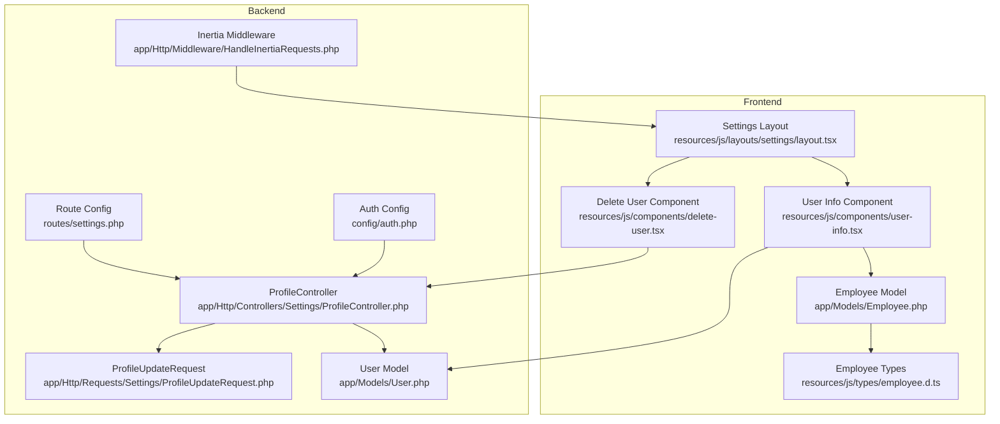
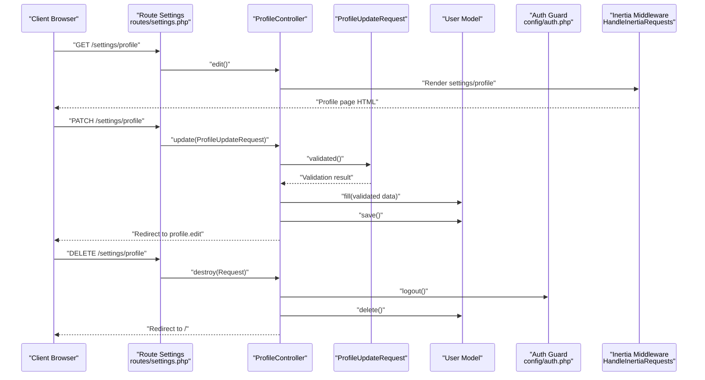
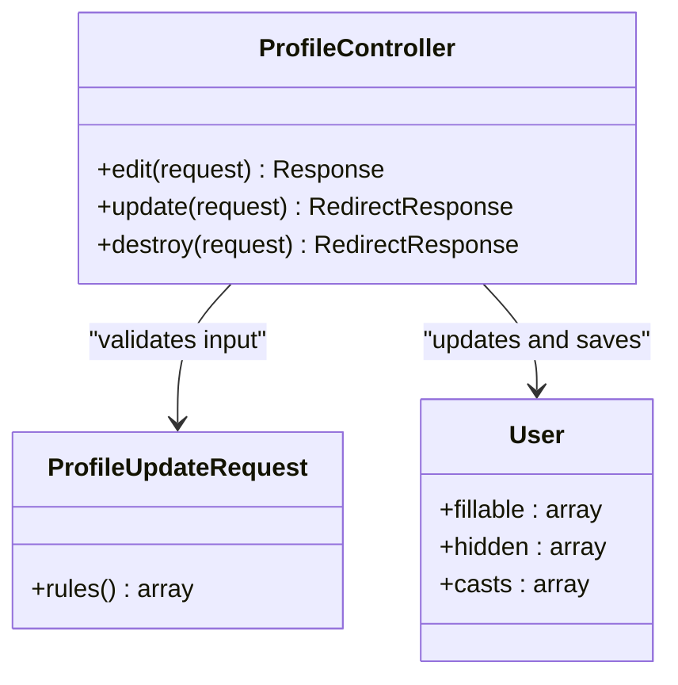
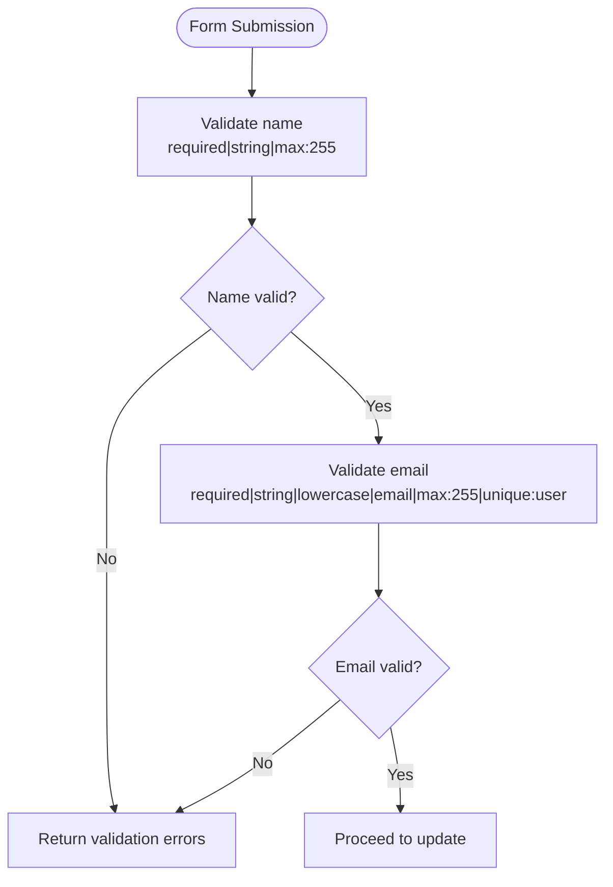
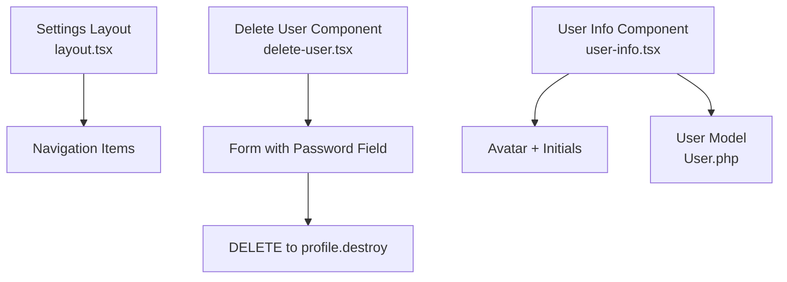
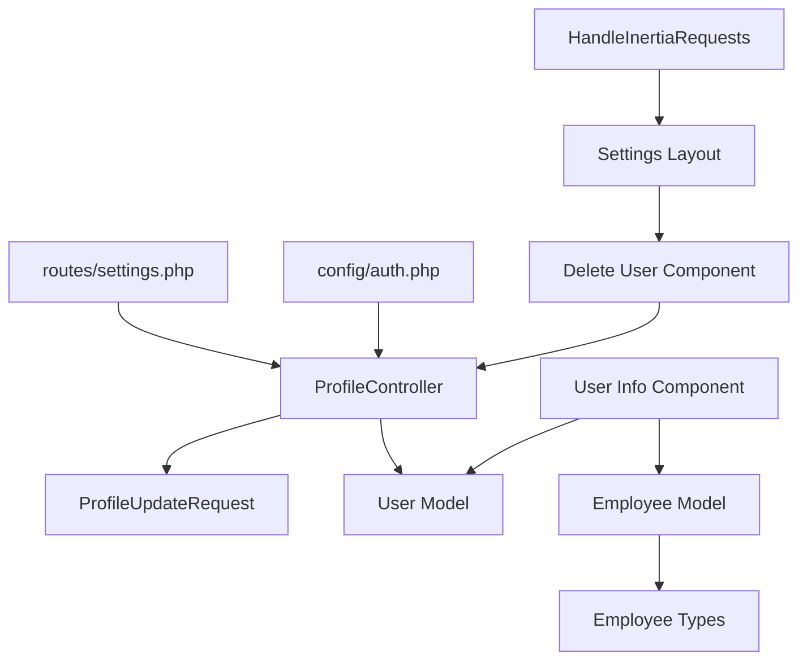

# Profile Settings API

<cite>
**Referenced Files in This Document**
- [ProfileController.php](file://app/Http/Controllers/Settings/ProfileController.php)
- [ProfileUpdateRequest.php](file://app/Http/Requests/Settings/ProfileUpdateRequest.php)
- [settings.php](file://routes/settings.php)
- [User.php](file://app/Models/User.php)
- [auth.php](file://config/auth.php)
- [HandleInertiaRequests.php](file://app/Http/Middleware/HandleInertiaRequests.php)
- [layout.tsx](file://resources/js/layouts/settings/layout.tsx)
- [delete-user.tsx](file://resources/js/components/delete-user.tsx)
- [user-info.tsx](file://resources/js/components/user-info.tsx)
- [Employee.php](file://app/Models/Employee.php)
- [employee.d.ts](file://resources/js/types/employee.d.ts)
</cite>

## Table of Contents
1. [Introduction](#introduction)
2. [Project Structure](#project-structure)
3. [Core Components](#core-components)
4. [Architecture Overview](#architecture-overview)
5. [Detailed Component Analysis](#detailed-component-analysis)
6. [Dependency Analysis](#dependency-analysis)
7. [Performance Considerations](#performance-considerations)
8. [Troubleshooting Guide](#troubleshooting-guide)
9. [Conclusion](#conclusion)

## Introduction
This document provides comprehensive API documentation for user profile management endpoints. It covers the profile view, update, and delete operations, including the backend controller methods, frontend components, validation rules, authentication and authorization requirements, and integration with employee management features. The documented endpoints are:
- GET /settings/profile: View profile settings
- PATCH /settings/profile: Update profile information
- DELETE /settings/profile: Delete user account

## Project Structure
The profile management functionality spans Laravel backend controllers and requests, Inertia-based frontend components, routing configuration, and authentication middleware. The following diagram illustrates the high-level structure and relationships.

**Diagram sources**
- [settings.php:8-21](file://routes/settings.php#L8-L21)
- [ProfileController.php:14-62](file://app/Http/Controllers/Settings/ProfileController.php#L14-L62)
- [ProfileUpdateRequest.php:10-32](file://app/Http/Requests/Settings/ProfileUpdateRequest.php#L10-L32)
- [User.php:10-48](file://app/Models/User.php#L10-L48)
- [auth.php:38-72](file://config/auth.php#L38-L72)
- [HandleInertiaRequests.php:9-54](file://app/Http/Middleware/HandleInertiaRequests.php#L9-L54)
- [layout.tsx:26-62](file://resources/js/layouts/settings/layout.tsx#L26-L62)
- [delete-user.tsx:14-90](file://resources/js/components/delete-user.tsx#L14-L90)
- [user-info.tsx:5-22](file://resources/js/components/user-info.tsx#L5-L22)
- [Employee.php:10-103](file://app/Models/Employee.php#L10-L103)
- [employee.d.ts:8-42](file://resources/js/types/employee.d.ts#L8-L42)

**Section sources**
- [settings.php:8-21](file://routes/settings.php#L8-L21)
- [ProfileController.php:14-62](file://app/Http/Controllers/Settings/ProfileController.php#L14-L62)
- [ProfileUpdateRequest.php:10-32](file://app/Http/Requests/Settings/ProfileUpdateRequest.php#L10-L32)
- [User.php:10-48](file://app/Models/User.php#L10-L48)
- [auth.php:38-72](file://config/auth.php#L38-L72)
- [HandleInertiaRequests.php:9-54](file://app/Http/Middleware/HandleInertiaRequests.php#L9-L54)
- [layout.tsx:26-62](file://resources/js/layouts/settings/layout.tsx#L26-L62)
- [delete-user.tsx:14-90](file://resources/js/components/delete-user.tsx#L14-L90)
- [user-info.tsx:5-22](file://resources/js/components/user-info.tsx#L5-L22)
- [Employee.php:10-103](file://app/Models/Employee.php#L10-L103)
- [employee.d.ts:8-42](file://resources/js/types/employee.d.ts#L8-L42)

## Core Components
This section documents the primary components involved in profile management, including the controller actions, validation request, and supporting models.

- ProfileController
  - edit(Request): Renders the profile settings page with email verification status and session status.
  - update(ProfileUpdateRequest): Applies validated profile updates and handles email verification state changes.
  - destroy(Request): Validates current password, logs out the user, deletes the account, invalidates the session, and redirects to home.

- ProfileUpdateRequest
  - Validation rules for name and email, including uniqueness constrained to the current user.

- User Model
  - Defines fillable attributes, hidden attributes, and type casting for secure profile storage.

- Authentication and Authorization
  - Routes are protected by the 'auth' middleware group.
  - The application uses the 'web' session guard with the Eloquent 'users' provider.

- Frontend Integration
  - Settings layout provides navigation to profile settings.
  - Delete user component handles account deletion with confirmation and error feedback.
  - User info component displays user avatar and name/email.

**Section sources**
- [ProfileController.php:14-62](file://app/Http/Controllers/Settings/ProfileController.php#L14-L62)
- [ProfileUpdateRequest.php:10-32](file://app/Http/Requests/Settings/ProfileUpdateRequest.php#L10-L32)
- [User.php:10-48](file://app/Models/User.php#L10-L48)
- [settings.php:8-21](file://routes/settings.php#L8-L21)
- [auth.php:38-72](file://config/auth.php#L38-L72)
- [layout.tsx:26-62](file://resources/js/layouts/settings/layout.tsx#L26-L62)
- [delete-user.tsx:14-90](file://resources/js/components/delete-user.tsx#L14-L90)
- [user-info.tsx:5-22](file://resources/js/components/user-info.tsx#L5-L22)

## Architecture Overview
The profile management flow integrates Laravel backend routes and controllers with Inertia-driven frontend components. The following sequence diagram maps the complete lifecycle for viewing, updating, and deleting a user's profile.

**Diagram sources**
- [settings.php:8-21](file://routes/settings.php#L8-L21)
- [ProfileController.php:19-62](file://app/Http/Controllers/Settings/ProfileController.php#L19-L62)
- [ProfileUpdateRequest.php:10-32](file://app/Http/Requests/Settings/ProfileUpdateRequest.php#L10-L32)
- [User.php:10-48](file://app/Models/User.php#L10-L48)
- [auth.php:38-72](file://config/auth.php#L38-L72)
- [HandleInertiaRequests.php:9-54](file://app/Http/Middleware/HandleInertiaRequests.php#L9-L54)

## Detailed Component Analysis

### ProfileController Methods
The controller exposes three primary actions for profile management:
- GET /settings/profile (route name: profile.edit)
  - Purpose: Render the profile settings page.
  - Returns: Inertia response with mustVerifyEmail flag and session status.
- PATCH /settings/profile (route name: profile.update)
  - Purpose: Apply validated profile updates.
  - Behavior: Marks email as unverified if changed; persists changes; redirects to profile.edit.
- DELETE /settings/profile (route name: profile.destroy)
  - Purpose: Delete the authenticated user's account.
  - Behavior: Validates current password, logs out, deletes user, invalidates session, and redirects to home.

**Diagram sources**
- [ProfileController.php:14-62](file://app/Http/Controllers/Settings/ProfileController.php#L14-L62)
- [ProfileUpdateRequest.php:10-32](file://app/Http/Requests/Settings/ProfileUpdateRequest.php#L10-L32)
- [User.php:10-48](file://app/Models/User.php#L10-L48)

**Section sources**
- [ProfileController.php:19-62](file://app/Http/Controllers/Settings/ProfileController.php#L19-L62)
- [settings.php:11-13](file://routes/settings.php#L11-L13)

### ProfileUpdateRequest Validation Rules
The validation rules ensure data integrity and uniqueness:
- name
  - Required, string, maximum length 255.
- email
  - Required, string, lowercase, valid email format, maximum length 255.
  - Unique constraint excludes the current user's ID to prevent false positives.

**Diagram sources**
- [ProfileUpdateRequest.php:17-31](file://app/Http/Requests/Settings/ProfileUpdateRequest.php#L17-L31)

**Section sources**
- [ProfileUpdateRequest.php:17-31](file://app/Http/Requests/Settings/ProfileUpdateRequest.php#L17-L31)

### Frontend Components and Integration
- Settings Layout
  - Provides navigation to Profile, Password, and Appearance settings.
  - Highlights the active route based on the current path.

- Delete User Component
  - Presents a confirmation dialog for account deletion.
  - Uses Inertia's useForm hook to submit DELETE to profile.destroy.
  - Handles processing state, error focus, and form cleanup.

- User Info Component
  - Displays user avatar and name, optionally with email.
  - Integrates with the User model for avatar fallback initials.

**Diagram sources**
- [layout.tsx:26-62](file://resources/js/layouts/settings/layout.tsx#L26-L62)
- [delete-user.tsx:14-90](file://resources/js/components/delete-user.tsx#L14-L90)
- [user-info.tsx:5-22](file://resources/js/components/user-info.tsx#L5-L22)
- [User.php:10-48](file://app/Models/User.php#L10-L48)

**Section sources**
- [layout.tsx:8-24](file://resources/js/layouts/settings/layout.tsx#L8-L24)
- [delete-user.tsx:14-90](file://resources/js/components/delete-user.tsx#L14-L90)
- [user-info.tsx:5-22](file://resources/js/components/user-info.tsx#L5-L22)

### Employee Management Integration
While the profile endpoints operate on the authenticated User model, the application includes employee-related features that may reference user data:
- Employee Model
  - Stores personal and professional details, including an image path resolved via storage URLs.
  - Establishes relationships with employment status, office, and user who created the record.
- Employee Types
  - TypeScript definitions describe employee entity structure and creation request shape.

These integrations support scenarios where profile information influences employee records and vice versa, particularly for display and administrative contexts.

**Section sources**
- [Employee.php:10-103](file://app/Models/Employee.php#L10-L103)
- [employee.d.ts:8-42](file://resources/js/types/employee.d.ts#L8-L42)

## Dependency Analysis
The following diagram highlights key dependencies among components involved in profile management.

**Diagram sources**
- [settings.php:8-21](file://routes/settings.php#L8-L21)
- [ProfileController.php:14-62](file://app/Http/Controllers/Settings/ProfileController.php#L14-L62)
- [ProfileUpdateRequest.php:10-32](file://app/Http/Requests/Settings/ProfileUpdateRequest.php#L10-L32)
- [User.php:10-48](file://app/Models/User.php#L10-L48)
- [auth.php:38-72](file://config/auth.php#L38-L72)
- [HandleInertiaRequests.php:9-54](file://app/Http/Middleware/HandleInertiaRequests.php#L9-L54)
- [layout.tsx:26-62](file://resources/js/layouts/settings/layout.tsx#L26-L62)
- [delete-user.tsx:14-90](file://resources/js/components/delete-user.tsx#L14-L90)
- [user-info.tsx:5-22](file://resources/js/components/user-info.tsx#L5-L22)
- [Employee.php:10-103](file://app/Models/Employee.php#L10-L103)
- [employee.d.ts:8-42](file://resources/js/types/employee.d.ts#L8-L42)

**Section sources**
- [settings.php:8-21](file://routes/settings.php#L8-L21)
- [ProfileController.php:14-62](file://app/Http/Controllers/Settings/ProfileController.php#L14-L62)
- [ProfileUpdateRequest.php:10-32](file://app/Http/Requests/Settings/ProfileUpdateRequest.php#L10-L32)
- [User.php:10-48](file://app/Models/User.php#L10-L48)
- [auth.php:38-72](file://config/auth.php#L38-L72)
- [HandleInertiaRequests.php:9-54](file://app/Http/Middleware/HandleInertiaRequests.php#L9-L54)
- [layout.tsx:26-62](file://resources/js/layouts/settings/layout.tsx#L26-L62)
- [delete-user.tsx:14-90](file://resources/js/components/delete-user.tsx#L14-L90)
- [user-info.tsx:5-22](file://resources/js/components/user-info.tsx#L5-L22)
- [Employee.php:10-103](file://app/Models/Employee.php#L10-L103)
- [employee.d.ts:8-42](file://resources/js/types/employee.d.ts#L8-L42)

## Performance Considerations
- Validation Efficiency
  - ProfileUpdateRequest performs lightweight validation with minimal overhead.
- Database Writes
  - Updates occur in a single save operation; email verification reset is conditional.
- Session Management
  - Account deletion triggers logout and session invalidation to prevent session fixation.
- Frontend Responsiveness
  - Inertia renders server-rendered pages efficiently; client-side forms leverage useForm for optimistic UI updates.

## Troubleshooting Guide
Common issues and resolutions:
- Validation Failures
  - Ensure name and email meet validation criteria; unique email validation excludes the current user ID.
- Email Verification Reset
  - Changing the email triggers email verification reset; re-verification may be required after updates.
- Authentication Errors
  - All profile routes require authentication; verify the 'auth' middleware is applied and the session is active.
- Account Deletion Confirmation
  - The delete component requires the current password; ensure the provided password matches the user's current credentials.
- Frontend Navigation
  - Settings layout highlights the active route; verify navigation links match the intended settings pages.

**Section sources**
- [ProfileUpdateRequest.php:17-31](file://app/Http/Requests/Settings/ProfileUpdateRequest.php#L17-L31)
- [ProfileController.php:34-36](file://app/Http/Controllers/Settings/ProfileController.php#L34-L36)
- [settings.php:8-21](file://routes/settings.php#L8-L21)
- [delete-user.tsx:18-26](file://resources/js/components/delete-user.tsx#L18-L26)

## Conclusion
The profile management endpoints provide a secure, validated, and user-friendly mechanism for viewing, updating, and deleting user profiles. The integration with Inertia ensures responsive frontend interactions, while the backend enforces authentication, authorization, and data integrity. The included employee management features demonstrate broader application context where profile data may influence or be influenced by employee records.