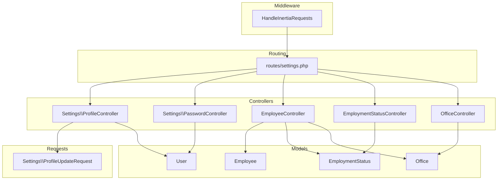
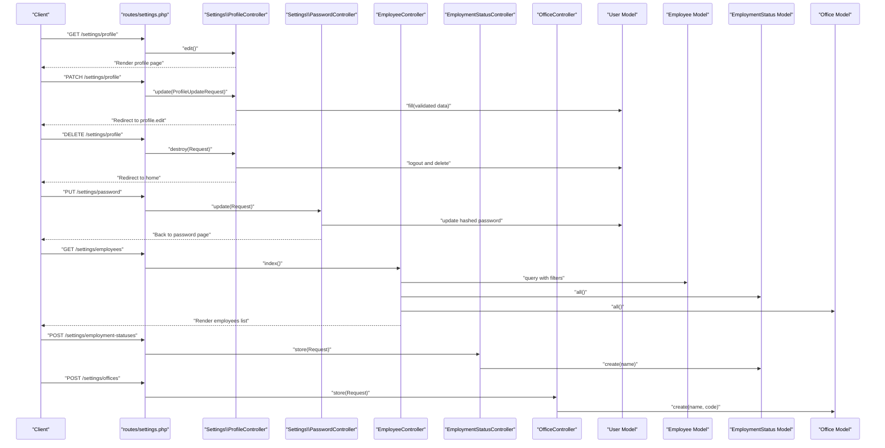
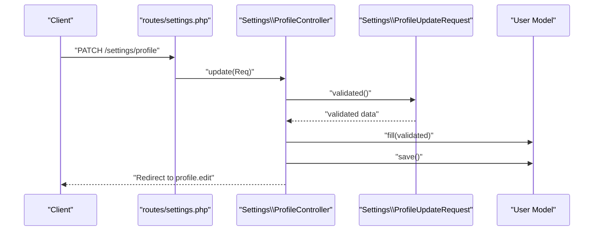
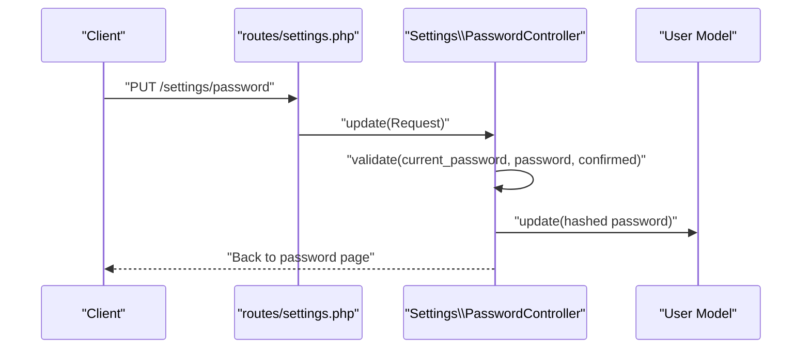
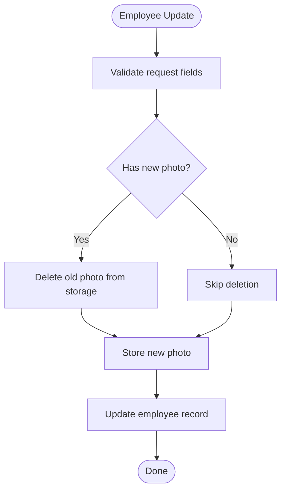
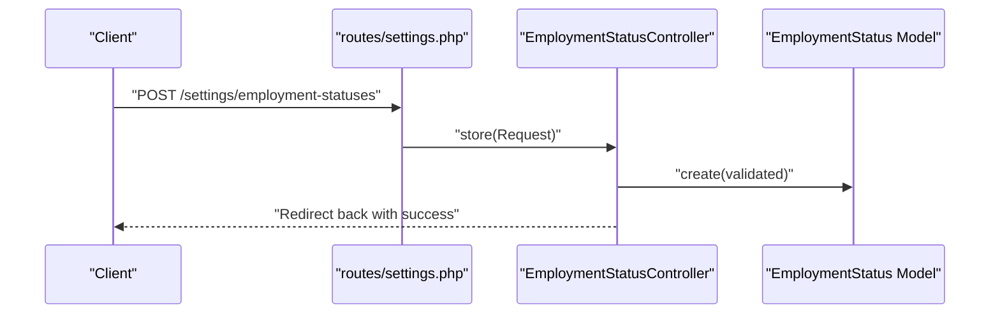
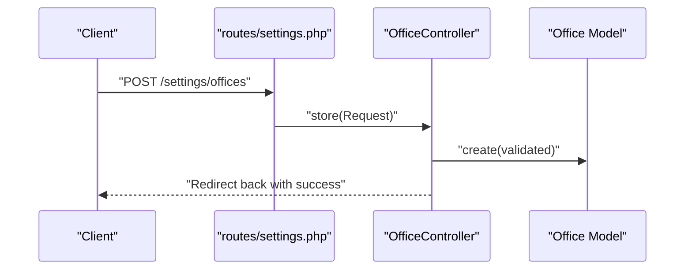
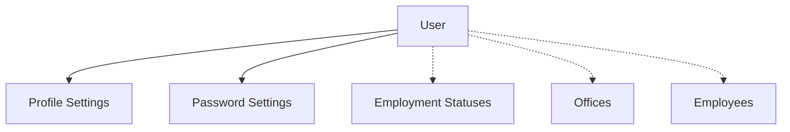
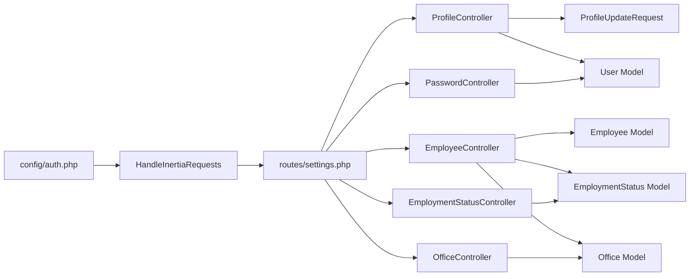

# Settings Management API

<cite>
**Referenced Files in This Document**
- [routes/settings.php](file://routes/settings.php)
- [app/Http/Controllers/Settings/ProfileController.php](file://app/Http/Controllers/Settings/ProfileController.php)
- [app/Http/Controllers/Settings/PasswordController.php](file://app/Http/Controllers/Settings/PasswordController.php)
- [app/Http/Requests/Settings/ProfileUpdateRequest.php](file://app/Http/Requests/Settings/ProfileUpdateRequest.php)
- [app/Models/User.php](file://app/Models/User.php)
- [app/Http/Controllers/EmployeeController.php](file://app/Http/Controllers/EmployeeController.php)
- [app/Http/Controllers/EmploymentStatusController.php](file://app/Http/Controllers/EmploymentStatusController.php)
- [app/Http/Controllers/OfficeController.php](file://app/Http/Controllers/OfficeController.php)
- [app/Models/Employee.php](file://app/Models/Employee.php)
- [app/Models/EmploymentStatus.php](file://app/Models/EmploymentStatus.php)
- [app/Models/Office.php](file://app/Models/Office.php)
- [app/Http/Middleware/HandleInertiaRequests.php](file://app/Http/Middleware/HandleInertiaRequests.php)
- [config/auth.php](file://config/auth.php)
</cite>

## Table of Contents
1. [Introduction](#introduction)
2. [Project Structure](#project-structure)
3. [Core Components](#core-components)
4. [Architecture Overview](#architecture-overview)
5. [Detailed Component Analysis](#detailed-component-analysis)
6. [Dependency Analysis](#dependency-analysis)
7. [Performance Considerations](#performance-considerations)
8. [Troubleshooting Guide](#troubleshooting-guide)
9. [Conclusion](#conclusion)

## Introduction
This document provides comprehensive API documentation for application settings and user profile management endpoints. It covers:
- User profile update and deletion APIs
- Password change API
- Administrative settings for employment statuses, offices, and user account configurations
- Request/response schemas, validation rules, security requirements, and authorization patterns
- Clear separation between user-specific settings and administrative configurations

The system uses Laravel with Inertia for server-rendered SPA-like experiences. Routes under the settings prefix are protected by an authentication middleware, ensuring only authenticated users can access profile and password settings.

## Project Structure
The settings-related functionality spans routing, controllers, requests, models, and middleware:
- Routes define the settings endpoints and group them under an authentication middleware.
- Controllers handle profile, password, and administrative settings operations.
- Form requests encapsulate validation rules for profile updates.
- Models define data structures and relationships for employees, employment statuses, and offices.
- Middleware shares authenticated user context and flash messages across Inertia pages.

**Diagram sources**
- [routes/settings.php:1-22](file://routes/settings.php#L1-L22)
- [app/Http/Controllers/Settings/ProfileController.php:1-64](file://app/Http/Controllers/Settings/ProfileController.php#L1-L64)
- [app/Http/Controllers/Settings/PasswordController.php:1-44](file://app/Http/Controllers/Settings/PasswordController.php#L1-L44)
- [app/Http/Controllers/EmployeeController.php:1-139](file://app/Http/Controllers/EmployeeController.php#L1-L139)
- [app/Http/Controllers/EmploymentStatusController.php:1-58](file://app/Http/Controllers/EmploymentStatusController.php#L1-L58)
- [app/Http/Controllers/OfficeController.php:1-61](file://app/Http/Controllers/OfficeController.php#L1-L61)
- [app/Http/Requests/Settings/ProfileUpdateRequest.php:1-33](file://app/Http/Requests/Settings/ProfileUpdateRequest.php#L1-L33)
- [app/Models/User.php:1-49](file://app/Models/User.php#L1-L49)
- [app/Models/Employee.php:1-104](file://app/Models/Employee.php#L1-L104)
- [app/Models/EmploymentStatus.php:1-32](file://app/Models/EmploymentStatus.php#L1-L32)
- [app/Models/Office.php:1-33](file://app/Models/Office.php#L1-L33)
- [app/Http/Middleware/HandleInertiaRequests.php:1-55](file://app/Http/Middleware/HandleInertiaRequests.php#L1-L55)

**Section sources**
- [routes/settings.php:1-22](file://routes/settings.php#L1-L22)
- [app/Http/Middleware/HandleInertiaRequests.php:1-55](file://app/Http/Middleware/HandleInertiaRequests.php#L1-L55)

## Core Components
This section documents the primary endpoints and their responsibilities.

- Profile Settings
  - GET /settings/profile: Render the user's profile settings page.
  - PATCH /settings/profile: Update the authenticated user's profile (name, email).
  - DELETE /settings/profile: Delete the authenticated user's account after confirming current password.

- Password Settings
  - GET /settings/password: Render the user's password settings page.
  - PUT /settings/password: Change the authenticated user's password with confirmation.

- Administrative Settings
  - Employees: CRUD operations for employee records, including photos and employment/office associations.
  - Employment Statuses: CRUD operations for employment status definitions.
  - Offices: CRUD operations for office definitions.

Security and Authorization
- All settings routes are protected by an authentication middleware, ensuring only logged-in users can access profile and password endpoints.
- Administrative endpoints are implemented in dedicated controllers and models, separate from user profile settings.

Validation and Data Models
- Profile updates are validated via a dedicated form request with rules for name and email uniqueness.
- Password updates enforce current password verification and password confirmation.
- Administrative endpoints validate input fields and enforce uniqueness constraints for employment statuses and offices.

**Section sources**
- [routes/settings.php:8-21](file://routes/settings.php#L8-L21)
- [app/Http/Controllers/Settings/ProfileController.php:19-62](file://app/Http/Controllers/Settings/ProfileController.php#L19-L62)
- [app/Http/Controllers/Settings/PasswordController.php:19-42](file://app/Http/Controllers/Settings/PasswordController.php#L19-L42)
- [app/Http/Requests/Settings/ProfileUpdateRequest.php:17-31](file://app/Http/Requests/Settings/ProfileUpdateRequest.php#L17-L31)
- [app/Models/User.php:20-47](file://app/Models/User.php#L20-L47)
- [app/Http/Controllers/EmployeeController.php:14-138](file://app/Http/Controllers/EmployeeController.php#L14-L138)
- [app/Http/Controllers/EmploymentStatusController.php:11-56](file://app/Http/Controllers/EmploymentStatusController.php#L11-L56)
- [app/Http/Controllers/OfficeController.php:11-59](file://app/Http/Controllers/OfficeController.php#L11-L59)

## Architecture Overview
The settings module follows a layered architecture:
- Routing layer defines endpoints grouped under the settings prefix and applies authentication.
- Controller layer handles requests, delegates validation to form requests, and interacts with models.
- Model layer encapsulates data access and relationships.
- Middleware layer shares authenticated user context and flash messages for UI feedback.

**Diagram sources**
- [routes/settings.php:8-21](file://routes/settings.php#L8-L21)
- [app/Http/Controllers/Settings/ProfileController.php:19-62](file://app/Http/Controllers/Settings/ProfileController.php#L19-L62)
- [app/Http/Controllers/Settings/PasswordController.php:19-42](file://app/Http/Controllers/Settings/PasswordController.php#L19-L42)
- [app/Http/Controllers/EmployeeController.php:14-138](file://app/Http/Controllers/EmployeeController.php#L14-L138)
- [app/Http/Controllers/EmploymentStatusController.php:29-37](file://app/Http/Controllers/EmploymentStatusController.php#L29-L37)
- [app/Http/Controllers/OfficeController.php:30-39](file://app/Http/Controllers/OfficeController.php#L30-L39)

## Detailed Component Analysis

### Profile Settings API
Endpoints
- GET /settings/profile
  - Purpose: Load the profile settings page.
  - Response: Inertia render with mustVerifyEmail flag and status message.
- PATCH /settings/profile
  - Purpose: Update the authenticated user's profile.
  - Request body: name, email (validated via ProfileUpdateRequest).
  - Behavior: Marks email as unverified if changed; persists changes.
  - Response: Redirect to profile.edit route.
- DELETE /settings/profile
  - Purpose: Delete the authenticated user's account.
  - Request body: current password (validated via current_password rule).
  - Behavior: Logs out, invalidates session, deletes user.
  - Response: Redirect to home.

Validation Rules
- Name: required, string, max length.
- Email: required, string, lowercase, email, max length, unique to current user.

Authorization and Security
- All profile endpoints are protected by authentication middleware.
- Email verification state is managed automatically when email changes.

**Diagram sources**
- [routes/settings.php:11-13](file://routes/settings.php#L11-L13)
- [app/Http/Controllers/Settings/ProfileController.php:30-41](file://app/Http/Controllers/Settings/ProfileController.php#L30-L41)
- [app/Http/Requests/Settings/ProfileUpdateRequest.php:17-31](file://app/Http/Requests/Settings/ProfileUpdateRequest.php#L17-L31)
- [app/Models/User.php:20-24](file://app/Models/User.php#L20-L24)

**Section sources**
- [routes/settings.php:11-13](file://routes/settings.php#L11-L13)
- [app/Http/Controllers/Settings/ProfileController.php:19-62](file://app/Http/Controllers/Settings/ProfileController.php#L19-L62)
- [app/Http/Requests/Settings/ProfileUpdateRequest.php:17-31](file://app/Http/Requests/Settings/ProfileUpdateRequest.php#L17-L31)
- [app/Models/User.php:20-47](file://app/Models/User.php#L20-L47)

### Password Settings API
Endpoints
- GET /settings/password
  - Purpose: Load the password settings page.
  - Response: Inertia render with mustVerifyEmail flag and status message.
- PUT /settings/password
  - Purpose: Change the authenticated user's password.
  - Request body: current_password (must match existing), password (validated via Password rules), password_confirmation.
  - Behavior: Hashes and updates the password.
  - Response: Back to previous page.

Validation Rules
- current_password: required, must match the existing password.
- password: required, meets default password rules, confirmed.

Authorization and Security
- Protected by authentication middleware.
- Uses hashed password storage via model casts.

**Diagram sources**
- [routes/settings.php:15-16](file://routes/settings.php#L15-L16)
- [app/Http/Controllers/Settings/PasswordController.php:30-42](file://app/Http/Controllers/Settings/PasswordController.php#L30-L42)
- [app/Models/User.php:41-47](file://app/Models/User.php#L41-L47)

**Section sources**
- [routes/settings.php:15-16](file://routes/settings.php#L15-L16)
- [app/Http/Controllers/Settings/PasswordController.php:19-42](file://app/Http/Controllers/Settings/PasswordController.php#L19-L42)
- [app/Models/User.php:41-47](file://app/Models/User.php#L41-L47)

### Administrative Settings API

#### Employees
Endpoints
- GET /settings/employees: List employees with filters and associated employment status and office data.
- GET /settings/employees/create: Render employee creation page with employment statuses and offices.
- POST /settings/employees: Create a new employee with validations for personal info, position, eligibility, employment status, office, and photo.
- GET /settings/employees/{employee}: Render employee edit page with employment statuses and offices.
- PUT /settings/employees/{employee}: Update employee with the same validations as create.
- DELETE /settings/employees/{employee}: Delete employee and remove uploaded photo.

Validation Rules
- Personal info: required strings with max lengths.
- Position: optional string.
- Is RATA eligible: boolean.
- Employment status: required, exists in employment_statuses table.
- Office: required, exists in offices table.
- Photo: optional image, max 2MB, allowed types: jpg, jpeg, png, webp.

Behavior
- On update, existing photo is deleted and replaced with a new upload if provided.
- Created_by is set automatically to the currently authenticated user.

**Diagram sources**
- [app/Http/Controllers/EmployeeController.php:101-126](file://app/Http/Controllers/EmployeeController.php#L101-L126)
- [app/Models/Employee.php:99-102](file://app/Models/Employee.php#L99-L102)

**Section sources**
- [app/Http/Controllers/EmployeeController.php:14-138](file://app/Http/Controllers/EmployeeController.php#L14-L138)
- [app/Models/Employee.php:14-25](file://app/Models/Employee.php#L14-L25)
- [app/Models/Employee.php:99-102](file://app/Models/Employee.php#L99-L102)

#### Employment Statuses
Endpoints
- GET /settings/employment-statuses: Paginated list with optional search by name.
- POST /settings/employment-statuses: Create a new employment status with unique name.
- PUT /settings/employment-statuses/{employmentStatus}: Update an existing employment status with unique name.
- DELETE /settings/employment-statuses/{employmentStatus}: Delete an employment status.

Validation Rules
- Name: required, string, max length, unique across employment_statuses.

Behavior
- Created_by is set automatically to the currently authenticated user.

**Diagram sources**
- [app/Http/Controllers/EmploymentStatusController.php:29-37](file://app/Http/Controllers/EmploymentStatusController.php#L29-L37)
- [app/Models/EmploymentStatus.php:23-30](file://app/Models/EmploymentStatus.php#L23-L30)

**Section sources**
- [app/Http/Controllers/EmploymentStatusController.php:11-56](file://app/Http/Controllers/EmploymentStatusController.php#L11-L56)
- [app/Models/EmploymentStatus.php:13-16](file://app/Models/EmploymentStatus.php#L13-L16)
- [app/Models/EmploymentStatus.php:23-30](file://app/Models/EmploymentStatus.php#L23-L30)

#### Offices
Endpoints
- GET /settings/offices: Paginated list with optional search by name or code.
- POST /settings/offices: Create a new office with unique name and code.
- PUT /settings/offices/{office}: Update an existing office with unique name and code.
- DELETE /settings/offices/{office}: Delete an office.

Validation Rules
- Name: required, string, max length, unique across offices.
- Code: required, string, max length, unique across offices.

Behavior
- Created_by is set automatically to the currently authenticated user.

**Diagram sources**
- [app/Http/Controllers/OfficeController.php:30-39](file://app/Http/Controllers/OfficeController.php#L30-L39)
- [app/Models/Office.php:24-31](file://app/Models/Office.php#L24-L31)

**Section sources**
- [app/Http/Controllers/OfficeController.php:11-59](file://app/Http/Controllers/OfficeController.php#L11-L59)
- [app/Models/Office.php:13-17](file://app/Models/Office.php#L13-L17)
- [app/Models/Office.php:24-31](file://app/Models/Office.php#L24-L31)

### Conceptual Overview
The settings module separates concerns into:
- User-specific settings: profile and password endpoints for authenticated users.
- Administrative settings: CRUD operations for employees, employment statuses, and offices, intended for authorized administrators.

[No sources needed since this diagram shows conceptual workflow, not actual code structure]

## Dependency Analysis
Key dependencies and relationships:
- Routing depends on controllers for handling requests.
- Controllers depend on models for data access and on form requests for validation.
- Middleware provides shared data (authenticated user, flash messages) to views.
- Authentication configuration defines guards and providers.

**Diagram sources**
- [config/auth.php:38-43](file://config/auth.php#L38-L43)
- [app/Http/Middleware/HandleInertiaRequests.php:45-52](file://app/Http/Middleware/HandleInertiaRequests.php#L45-L52)
- [routes/settings.php:8-21](file://routes/settings.php#L8-L21)
- [app/Http/Controllers/Settings/ProfileController.php:6](file://app/Http/Controllers/Settings/ProfileController.php#L6)
- [app/Http/Controllers/Settings/PasswordController.php:5](file://app/Http/Controllers/Settings/PasswordController.php#L5)
- [app/Http/Controllers/EmployeeController.php:5](file://app/Http/Controllers/EmployeeController.php#L5)
- [app/Http/Controllers/EmploymentStatusController.php:5](file://app/Http/Controllers/EmploymentStatusController.php#L5)
- [app/Http/Controllers/OfficeController.php:5](file://app/Http/Controllers/OfficeController.php#L5)
- [app/Http/Requests/Settings/ProfileUpdateRequest.php:5](file://app/Http/Requests/Settings/ProfileUpdateRequest.php#L5)
- [app/Models/User.php:10](file://app/Models/User.php#L10)
- [app/Models/Employee.php:10](file://app/Models/Employee.php#L10)
- [app/Models/EmploymentStatus.php:9](file://app/Models/EmploymentStatus.php#L9)
- [app/Models/Office.php:9](file://app/Models/Office.php#L9)

**Section sources**
- [config/auth.php:38-43](file://config/auth.php#L38-L43)
- [app/Http/Middleware/HandleInertiaRequests.php:45-52](file://app/Http/Middleware/HandleInertiaRequests.php#L45-L52)
- [routes/settings.php:8-21](file://routes/settings.php#L8-L21)

## Performance Considerations
- Pagination: Administrative lists (employees, employment statuses, offices) use pagination to limit payload sizes.
- Image handling: Employee photos are stored in public disk; ensure appropriate storage configuration and consider CDN for performance.
- Validation: Keep validation rules minimal and efficient; avoid heavy computations in request classes.
- Middleware: Sharing minimal shared data reduces overhead on each request.

[No sources needed since this section provides general guidance]

## Troubleshooting Guide
Common issues and resolutions:
- Authentication failures
  - Symptom: Access to settings routes returns unauthorized.
  - Resolution: Ensure the user is authenticated; verify the authentication guard and session state.
  - Reference: [config/auth.php:38-43](file://config/auth.php#L38-L43)

- Profile update errors
  - Symptom: Email uniqueness violation or missing required fields.
  - Resolution: Confirm email uniqueness against current user ID and ensure name/email meet validation criteria.
  - References:
    - [app/Http/Requests/Settings/ProfileUpdateRequest.php:17-31](file://app/Http/Requests/Settings/ProfileUpdateRequest.php#L17-L31)
    - [app/Http/Controllers/Settings/ProfileController.php:30-41](file://app/Http/Controllers/Settings/ProfileController.php#L30-L41)

- Password change errors
  - Symptom: Current password mismatch or password confirmation failure.
  - Resolution: Verify current password matches and confirm new password.
  - References:
    - [app/Http/Controllers/Settings/PasswordController.php:30-42](file://app/Http/Controllers/Settings/PasswordController.php#L30-L42)
    - [app/Models/User.php:41-47](file://app/Models/User.php#L41-L47)

- Employee photo upload issues
  - Symptom: Photo not saving or old photo not removed.
  - Resolution: Ensure file upload, proper MIME types, and correct storage permissions.
  - References:
    - [app/Http/Controllers/EmployeeController.php:101-126](file://app/Http/Controllers/EmployeeController.php#L101-L126)
    - [app/Models/Employee.php:99-102](file://app/Models/Employee.php#L99-L102)

**Section sources**
- [config/auth.php:38-43](file://config/auth.php#L38-L43)
- [app/Http/Requests/Settings/ProfileUpdateRequest.php:17-31](file://app/Http/Requests/Settings/ProfileUpdateRequest.php#L17-L31)
- [app/Http/Controllers/Settings/ProfileController.php:30-41](file://app/Http/Controllers/Settings/ProfileController.php#L30-L41)
- [app/Http/Controllers/Settings/PasswordController.php:30-42](file://app/Http/Controllers/Settings/PasswordController.php#L30-L42)
- [app/Models/User.php:41-47](file://app/Models/User.php#L41-L47)
- [app/Http/Controllers/EmployeeController.php:101-126](file://app/Http/Controllers/EmployeeController.php#L101-L126)
- [app/Models/Employee.php:99-102](file://app/Models/Employee.php#L99-L102)

## Conclusion
The settings management module provides a clear separation between user-specific and administrative configurations:
- User profile and password endpoints are secure, validated, and easy to use.
- Administrative endpoints offer robust CRUD operations for employees, employment statuses, and offices with appropriate validation and automatic metadata tracking.
- The architecture leverages Laravel’s routing, controllers, models, and middleware to deliver a maintainable and scalable solution.