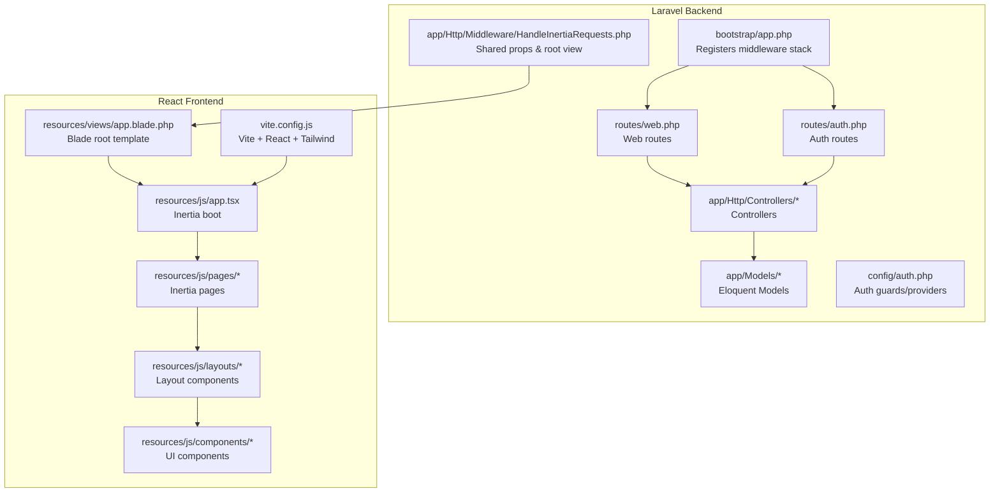
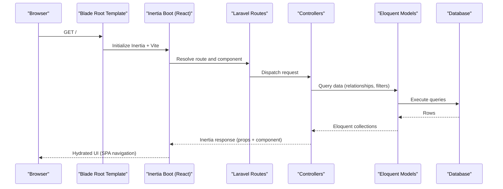
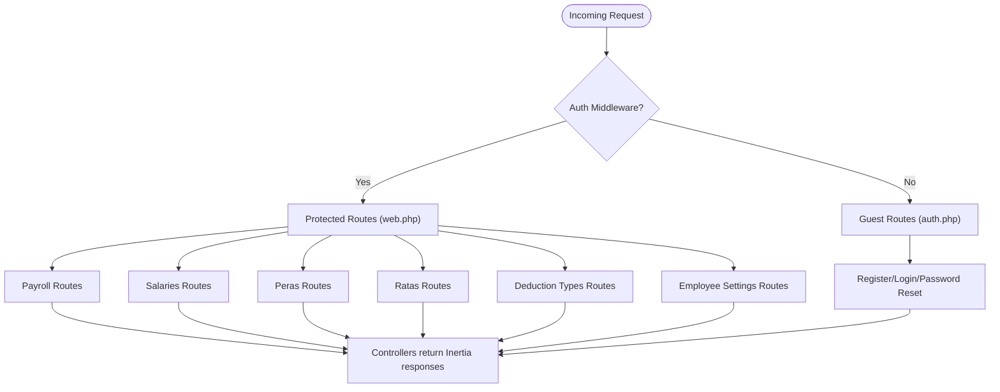
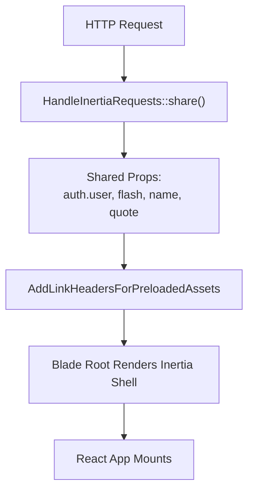
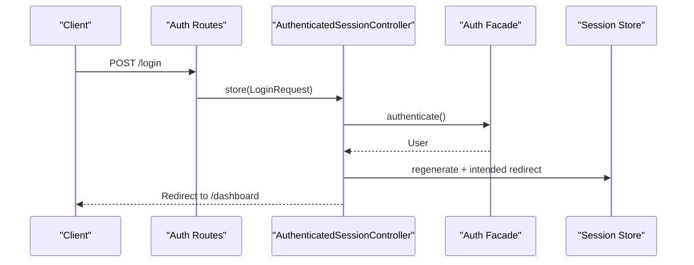
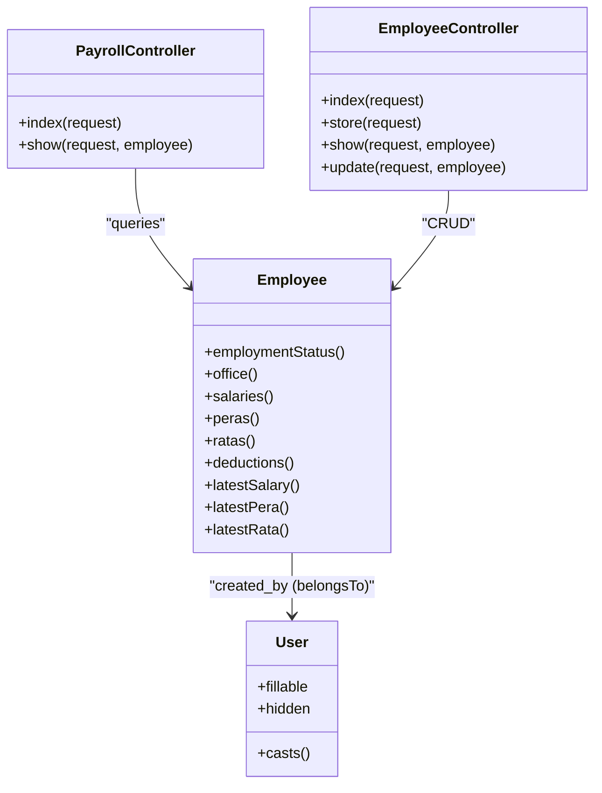
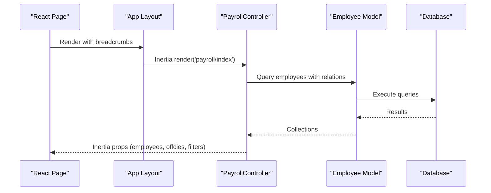
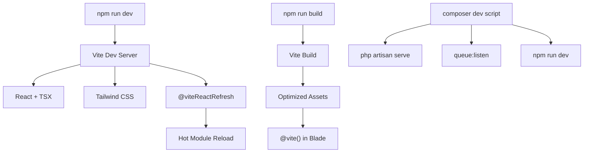
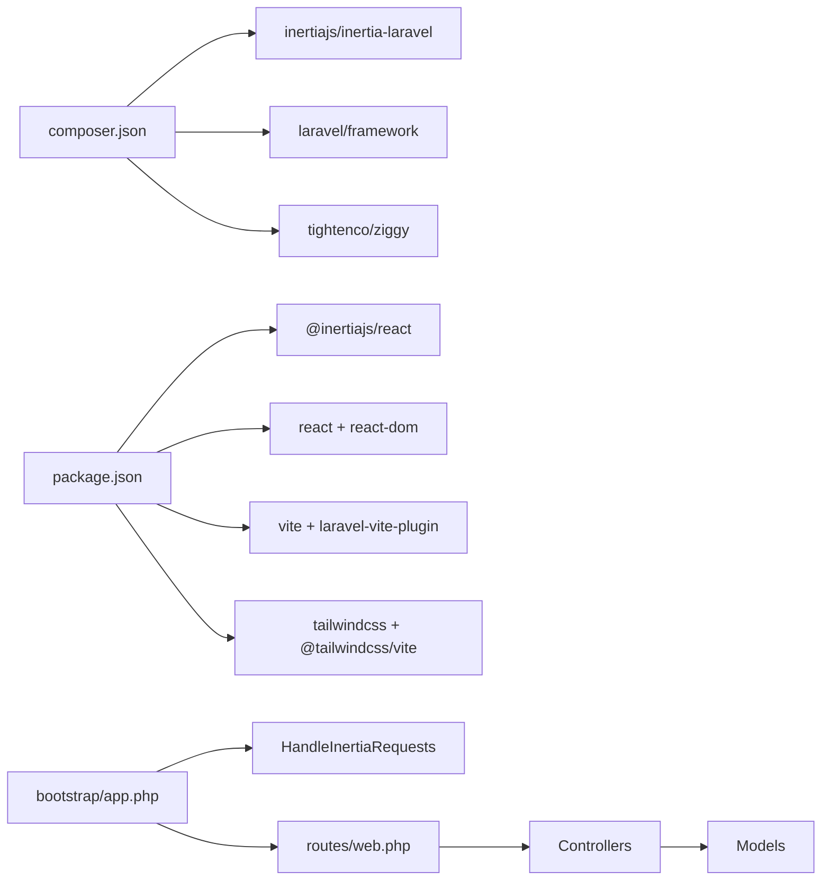

# Architecture Overview

<cite>
**Referenced Files in This Document**
- [composer.json](file://composer.json)
- [package.json](file://package.json)
- [bootstrap/app.php](file://bootstrap/app.php)
- [resources/views/app.blade.php](file://resources/views/app.blade.php)
- [resources/js/app.tsx](file://resources/js/app.tsx)
- [vite.config.js](file://vite.config.js)
- [routes/web.php](file://routes/web.php)
- [routes/auth.php](file://routes/auth.php)
- [app/Http/Middleware/HandleInertiaRequests.php](file://app/Http/Middleware/HandleInertiaRequests.php)
- [config/auth.php](file://config/auth.php)
- [app/Http/Controllers/PayrollController.php](file://app/Http/Controllers/PayrollController.php)
- [app/Http/Controllers/EmployeeController.php](file://app/Http/Controllers/EmployeeController.php)
- [app/Http/Controllers/Auth/AuthenticatedSessionController.php](file://app/Http/Controllers/Auth/AuthenticatedSessionController.php)
- [app/Models/User.php](file://app/Models/User.php)
- [app/Models/Employee.php](file://app/Models/Employee.php)
- [resources/js/pages/dashboard.tsx](file://resources/js/pages/dashboard.tsx)
- [resources/js/layouts/app/app-sidebar-layout.tsx](file://resources/js/layouts/app/app-sidebar-layout.tsx)
</cite>

## Table of Contents
1. [Introduction](#introduction)
2. [Project Structure](#project-structure)
3. [Core Components](#core-components)
4. [Architecture Overview](#architecture-overview)
5. [Detailed Component Analysis](#detailed-component-analysis)
6. [Dependency Analysis](#dependency-analysis)
7. [Performance Considerations](#performance-considerations)
8. [Troubleshooting Guide](#troubleshooting-guide)
9. [Conclusion](#conclusion)
10. [Appendices](#appendices)

## Introduction
This document describes the full-stack architecture of a Laravel + React payroll management system built with Inertia.js to deliver a seamless Single Page Application (SPA) experience while retaining server-rendered benefits. The system follows an MVC-like pattern on the backend (controllers, models, requests) and a component-driven React frontend. It integrates authentication, authorization, and data flow across the frontend and backend, and documents the build pipeline, asset management, and development workflow.

## Project Structure
The project is organized into a Laravel backend and a React/TypeScript frontend integrated via Inertia.js. The backend exposes REST-style routes handled by controllers, while the frontend renders pages and components with Vite for asset bundling and hot module replacement.

**Diagram sources**
- [bootstrap/app.php:15-20](file://bootstrap/app.php#L15-L20)
- [routes/web.php:16-99](file://routes/web.php#L16-L99)
- [routes/auth.php:13-57](file://routes/auth.php#L13-L57)
- [app/Http/Middleware/HandleInertiaRequests.php:18-53](file://app/Http/Middleware/HandleInertiaRequests.php#L18-L53)
- [config/auth.php:38-72](file://config/auth.php#L38-L72)
- [resources/views/app.blade.php:12-19](file://resources/views/app.blade.php#L12-L19)
- [resources/js/app.tsx:15-26](file://resources/js/app.tsx#L15-L26)
- [vite.config.js:8-21](file://vite.config.js#L8-L21)

**Section sources**
- [bootstrap/app.php:9-23](file://bootstrap/app.php#L9-L23)
- [routes/web.php:16-99](file://routes/web.php#L16-L99)
- [routes/auth.php:13-57](file://routes/auth.php#L13-L57)
- [resources/views/app.blade.php:1-21](file://resources/views/app.blade.php#L1-L21)
- [resources/js/app.tsx:1-30](file://resources/js/app.tsx#L1-L30)
- [vite.config.js:1-21](file://vite.config.js#L1-L21)

## Core Components
- Laravel application bootstrap registers routing and middleware, including the Inertia request handler and preloaded asset header injection.
- Blade root template initializes Inertia and Vite assets, and renders the Inertia app shell.
- Inertia boot in the React app resolves page components and mounts them under the Inertia root.
- Routes define both authenticated and guest-facing areas, grouping payroll, settings, and auth routes.
- Middleware shares application-wide data (authentication, flash messages) and sets the root template.
- Authentication configuration defines session-based guards and Eloquent user provider.
- Controllers orchestrate data retrieval, transformations, and rendering via Inertia responses.
- Models encapsulate domain logic, relationships, and attribute casting.

**Section sources**
- [bootstrap/app.php:15-20](file://bootstrap/app.php#L15-L20)
- [resources/views/app.blade.php:12-19](file://resources/views/app.blade.php#L12-L19)
- [resources/js/app.tsx:15-26](file://resources/js/app.tsx#L15-L26)
- [routes/web.php:16-99](file://routes/web.php#L16-L99)
- [app/Http/Middleware/HandleInertiaRequests.php:18-53](file://app/Http/Middleware/HandleInertiaRequests.php#L18-L53)
- [config/auth.php:38-72](file://config/auth.php#L38-L72)
- [app/Http/Controllers/PayrollController.php:13-124](file://app/Http/Controllers/PayrollController.php#L13-L124)
- [app/Http/Controllers/EmployeeController.php:14-124](file://app/Http/Controllers/EmployeeController.php#L14-L124)
- [app/Models/User.php:10-48](file://app/Models/User.php#L10-L48)
- [app/Models/Employee.php:10-103](file://app/Models/Employee.php#L10-L103)

## Architecture Overview
The system uses a SPA/SSR hybrid powered by Inertia.js. The backend serves as both an API and a renderer. The frontend is a React application that navigates without full-page reloads, fetching data via Inertia’s XHR and hydrating the UI with shared props from the server.

**Diagram sources**
- [resources/views/app.blade.php:12-19](file://resources/views/app.blade.php#L12-L19)
- [resources/js/app.tsx:15-26](file://resources/js/app.tsx#L15-L26)
- [routes/web.php:16-99](file://routes/web.php#L16-L99)
- [app/Http/Controllers/PayrollController.php:13-124](file://app/Http/Controllers/PayrollController.php#L13-L124)
- [app/Models/Employee.php:10-103](file://app/Models/Employee.php#L10-L103)

## Detailed Component Analysis

### Routing Architecture
- Web routes define the SPA surface area, grouped by feature (payroll, salaries, peras, ratas, deduction types, employee settings).
- Auth routes handle registration, login, logout, password resets, and email verification for guests and authenticated users.
- Routes are protected by the auth middleware group, ensuring only authenticated users can access protected sections.

**Diagram sources**
- [routes/web.php:16-99](file://routes/web.php#L16-L99)
- [routes/auth.php:13-57](file://routes/auth.php#L13-L57)

**Section sources**
- [routes/web.php:16-99](file://routes/web.php#L16-L99)
- [routes/auth.php:13-57](file://routes/auth.php#L13-L57)

### Middleware Stack and Shared Props
- The Inertia middleware sets the root view and shares application-wide data such as authenticated user, flash messages, and app metadata.
- The preloaded asset header middleware ensures fast asset loading during SSR/initial hydration.

**Diagram sources**
- [app/Http/Middleware/HandleInertiaRequests.php:18-53](file://app/Http/Middleware/HandleInertiaRequests.php#L18-L53)
- [bootstrap/app.php:15-20](file://bootstrap/app.php#L15-L20)
- [resources/views/app.blade.php:12-19](file://resources/views/app.blade.php#L12-L19)

**Section sources**
- [app/Http/Middleware/HandleInertiaRequests.php:18-53](file://app/Http/Middleware/HandleInertiaRequests.php#L18-L53)
- [bootstrap/app.php:15-20](file://bootstrap/app.php#L15-L20)
- [resources/views/app.blade.php:12-19](file://resources/views/app.blade.php#L12-L19)

### Authentication and Authorization
- Session-based authentication with Eloquent user provider.
- Guards and providers configured for the “web” guard.
- Auth controllers handle login, logout, registration, password reset, and email verification.
- Routes enforce guest vs. auth middleware groups.

**Diagram sources**
- [routes/auth.php:19-34](file://routes/auth.php#L19-L34)
- [app/Http/Controllers/Auth/AuthenticatedSessionController.php:30-37](file://app/Http/Controllers/Auth/AuthenticatedSessionController.php#L30-L37)
- [config/auth.php:38-72](file://config/auth.php#L38-L72)

**Section sources**
- [config/auth.php:38-72](file://config/auth.php#L38-L72)
- [routes/auth.php:13-57](file://routes/auth.php#L13-L57)
- [app/Http/Controllers/Auth/AuthenticatedSessionController.php:14-51](file://app/Http/Controllers/Auth/AuthenticatedSessionController.php#L14-L51)

### MVC Pattern Implementation
- Controllers: Handle requests, apply filters, load related data, compute derived values, and render Inertia responses.
- Models: Define relationships, attribute casting, and lifecycle callbacks.
- Views: Blade root template renders the Inertia shell and injects assets.
- Frontend: Pages and layouts composed of reusable UI components.

**Diagram sources**
- [app/Http/Controllers/PayrollController.php:11-124](file://app/Http/Controllers/PayrollController.php#L11-L124)
- [app/Http/Controllers/EmployeeController.php:12-124](file://app/Http/Controllers/EmployeeController.php#L12-L124)
- [app/Models/Employee.php:10-103](file://app/Models/Employee.php#L10-L103)
- [app/Models/User.php:10-48](file://app/Models/User.php#L10-L48)

**Section sources**
- [app/Http/Controllers/PayrollController.php:13-124](file://app/Http/Controllers/PayrollController.php#L13-L124)
- [app/Http/Controllers/EmployeeController.php:14-124](file://app/Http/Controllers/EmployeeController.php#L14-L124)
- [app/Models/Employee.php:10-103](file://app/Models/Employee.php#L10-L103)
- [app/Models/User.php:10-48](file://app/Models/User.php#L10-L48)

### Data Flow Between Frontend and Backend
- The React app boots via Inertia and resolves page components based on route names.
- Controllers fetch filtered and paginated datasets, enrich them with computed values, and pass them to Inertia templates.
- The frontend composes pages from layouts and UI components, using shared props (e.g., user, flash messages).

**Diagram sources**
- [resources/js/pages/dashboard.tsx:14-36](file://resources/js/pages/dashboard.tsx#L14-L36)
- [resources/js/layouts/app/app-sidebar-layout.tsx:7-17](file://resources/js/layouts/app/app-sidebar-layout.tsx#L7-L17)
- [app/Http/Controllers/PayrollController.php:13-81](file://app/Http/Controllers/PayrollController.php#L13-L81)
- [app/Models/Employee.php:10-103](file://app/Models/Employee.php#L10-L103)

**Section sources**
- [resources/js/pages/dashboard.tsx:1-37](file://resources/js/pages/dashboard.tsx#L1-L37)
- [resources/js/layouts/app/app-sidebar-layout.tsx:1-18](file://resources/js/layouts/app/app-sidebar-layout.tsx#L1-L18)
- [app/Http/Controllers/PayrollController.php:13-124](file://app/Http/Controllers/PayrollController.php#L13-L124)
- [app/Models/Employee.php:10-103](file://app/Models/Employee.php#L10-L103)

### Build Process, Asset Management, and Development Workflow
- Vite is configured with React and Tailwind plugins, and Laravel’s Vite plugin for asset resolution and hot-reload.
- The React app boot initializes Inertia, resolves page components, and mounts the root element.
- Scripts in package.json support dev, build, and formatting tasks; Laravel scripts coordinate development.

**Diagram sources**
- [vite.config.js:8-21](file://vite.config.js#L8-L21)
- [resources/views/app.blade.php:12-19](file://resources/views/app.blade.php#L12-L19)
- [resources/js/app.tsx:15-26](file://resources/js/app.tsx#L15-L26)
- [composer.json:55-58](file://composer.json#L55-L58)
- [package.json:4-11](file://package.json#L4-L11)

**Section sources**
- [vite.config.js:1-21](file://vite.config.js#L1-L21)
- [resources/views/app.blade.php:1-21](file://resources/views/app.blade.php#L1-L21)
- [resources/js/app.tsx:1-30](file://resources/js/app.tsx#L1-L30)
- [composer.json:39-58](file://composer.json#L39-L58)
- [package.json:1-73](file://package.json#L1-L73)

## Dependency Analysis
- Laravel dependencies include Inertia for SSR/SPA integration and Ziggy for client-side routing helpers.
- React dependencies include Inertia adapters, UI libraries, date utilities, and Tailwind-based design system.
- The middleware stack depends on the Inertia middleware and preloading headers.
- Controllers depend on models and return Inertia responses; models depend on Eloquent and storage.

**Diagram sources**
- [composer.json:11-17](file://composer.json#L11-L17)
- [package.json:23-66](file://package.json#L23-L66)
- [bootstrap/app.php:15-20](file://bootstrap/app.php#L15-L20)
- [routes/web.php:16-99](file://routes/web.php#L16-L99)

**Section sources**
- [composer.json:11-17](file://composer.json#L11-L17)
- [package.json:23-66](file://package.json#L23-L66)
- [bootstrap/app.php:15-20](file://bootstrap/app.php#L15-L20)
- [routes/web.php:16-99](file://routes/web.php#L16-L99)

## Performance Considerations
- Use eager loading and relationship constraints to minimize N+1 queries in controllers.
- Paginate heavy lists (e.g., employees) and pass query strings to preserve filters.
- Compute derived values on the backend to reduce frontend work.
- Enable asset caching and leverage Vite’s production builds for optimized assets.
- Keep middleware minimal and avoid heavy computations in shared props.

## Troubleshooting Guide
- Authentication failures: Verify guard/provider configuration and session regeneration after login.
- Asset loading issues: Ensure Vite plugin inputs and Blade directives match the configured entries.
- Inertia mount errors: Confirm page component resolution and that the root view is correctly set.
- Flash messages not visible: Check that shared flash props are accessed in the frontend and cleared appropriately.

**Section sources**
- [config/auth.php:38-72](file://config/auth.php#L38-L72)
- [resources/views/app.blade.php:12-19](file://resources/views/app.blade.php#L12-L19)
- [app/Http/Middleware/HandleInertiaRequests.php:18-53](file://app/Http/Middleware/HandleInertiaRequests.php#L18-L53)

## Conclusion
This architecture blends Laravel’s robust backend capabilities with a modern React frontend using Inertia.js. The result is a responsive, maintainable payroll management system with clear separation of concerns, strong authentication and authorization, and a streamlined development workflow powered by Vite.

## Appendices
- Technology choices:
  - Backend: Laravel 12.x, Inertia for SSR/SPA, Eloquent ORM.
  - Frontend: React 19, TypeScript, Inertia adapters, Tailwind CSS v4, Vite.
  - Tooling: ESLint/Prettier/Tailwind plugins, Ziggy for routing helpers.
- System boundaries:
  - Public routes: Auth and guest-facing pages.
  - Protected routes: Payroll, settings, and administrative features.
- Infrastructure and deployment:
  - Standard PHP application with database connectivity; asset pipeline managed by Vite.
  - Recommended: Separate asset and application servers, CDN for static assets, and HTTPS termination at the edge.