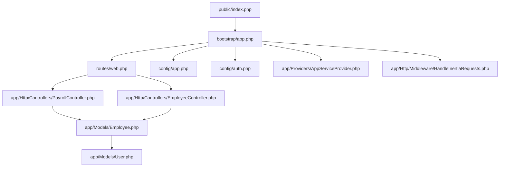
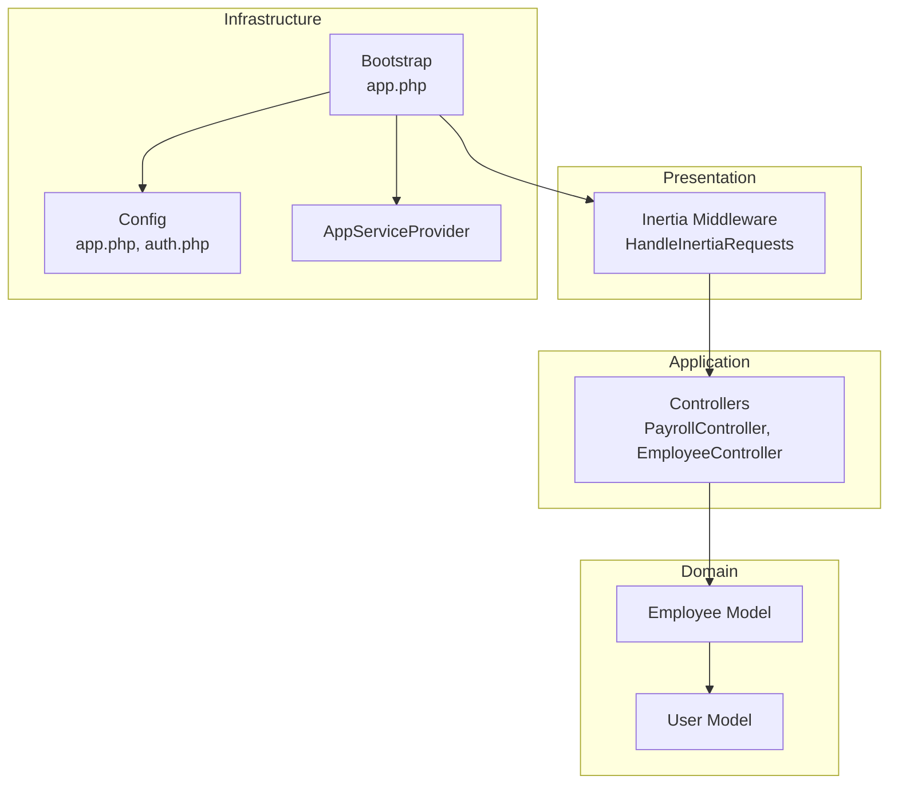
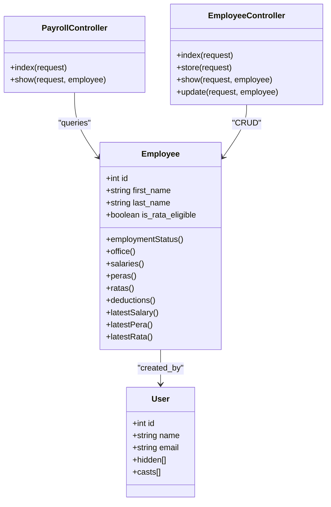
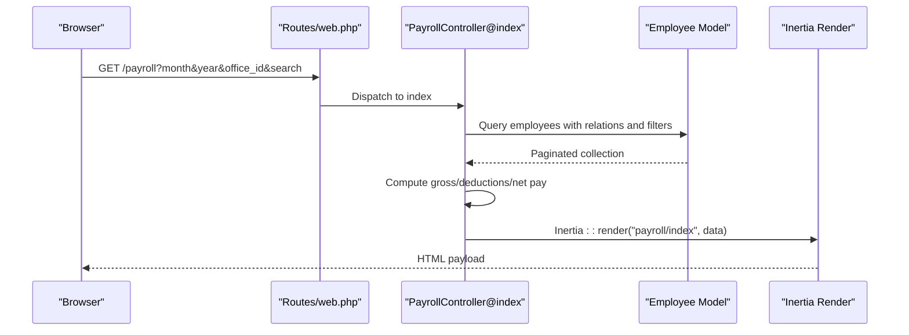
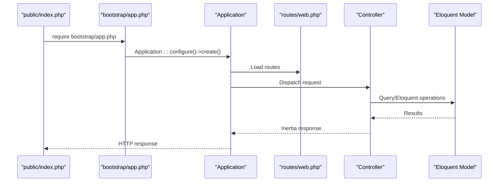
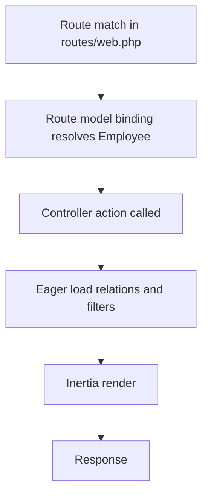
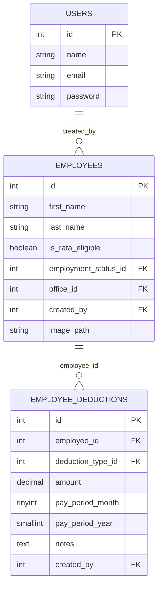
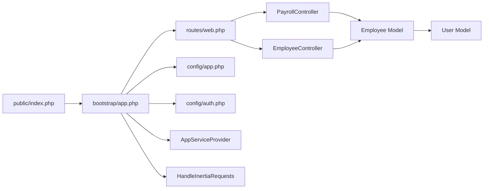

# Backend Architecture

<cite>
**Referenced Files in This Document**
- [bootstrap/app.php](file://bootstrap/app.php)
- [bootstrap/providers.php](file://bootstrap/providers.php)
- [public/index.php](file://public/index.php)
- [config/app.php](file://config/app.php)
- [config/auth.php](file://config/auth.php)
- [app/Http/Middleware/HandleInertiaRequests.php](file://app/Http/Middleware/HandleInertiaRequests.php)
- [app/Http/Controllers/Controller.php](file://app/Http/Controllers/Controller.php)
- [app/Http/Controllers/PayrollController.php](file://app/Http/Controllers/PayrollController.php)
- [app/Http/Controllers/EmployeeController.php](file://app/Http/Controllers/EmployeeController.php)
- [app/Models/User.php](file://app/Models/User.php)
- [app/Models/Employee.php](file://app/Models/Employee.php)
- [app/Providers/AppServiceProvider.php](file://app/Providers/AppServiceProvider.php)
- [routes/web.php](file://routes/web.php)
- [composer.json](file://composer.json)
- [database/migrations/2026_03_22_115112_create_employee_deductions_table.php](file://database/migrations/2026_03_22_115112_create_employee_deductions_table.php)
</cite>

## Table of Contents
1. [Introduction](#introduction)
2. [Project Structure](#project-structure)
3. [Core Components](#core-components)
4. [Architecture Overview](#architecture-overview)
5. [Detailed Component Analysis](#detailed-component-analysis)
6. [Dependency Analysis](#dependency-analysis)
7. [Performance Considerations](#performance-considerations)
8. [Troubleshooting Guide](#troubleshooting-guide)
9. [Conclusion](#conclusion)

## Introduction
This document describes the backend architecture of a Laravel payroll management system. It explains how the MVC pattern is implemented, how controllers are organized, how middleware is configured, and how service providers are registered. It also documents the application bootstrapping process, the dependency injection container usage, configuration management, routing architecture, route model binding, the request lifecycle, middleware pipeline configuration, CORS handling, and security middleware. Additionally, it covers the service layer architecture, repository pattern implementation, and data access layers, along with namespace organization and autoloading strategy. Finally, it provides insights into Laravel’s architectural decisions and best practices for building robust payroll systems.

## Project Structure
The backend follows Laravel’s conventional structure with clear separation of concerns:
- Public entry point: public/index.php
- Bootstrap: bootstrap/app.php and bootstrap/providers.php
- Configuration: config/*.php
- HTTP layer: app/Http/* (Controllers, Middleware, Requests)
- Domain models: app/Models/*
- Service providers: app/Providers/*
- Routing: routes/*.php
- Database: database/migrations, seeds
- Autoloading: composer.json PSR-4 namespaces

**Diagram sources**
- [public/index.php:1-18](file://public/index.php#L1-L18)
- [bootstrap/app.php:1-24](file://bootstrap/app.php#L1-L24)
- [routes/web.php:1-99](file://routes/web.php#L1-L99)
- [config/app.php:1-127](file://config/app.php#L1-L127)
- [config/auth.php:1-116](file://config/auth.php#L1-L116)
- [app/Providers/AppServiceProvider.php:1-25](file://app/Providers/AppServiceProvider.php#L1-L25)
- [app/Http/Controllers/PayrollController.php:1-125](file://app/Http/Controllers/PayrollController.php#L1-L125)
- [app/Http/Controllers/EmployeeController.php:1-119](file://app/Http/Controllers/EmployeeController.php#L1-L119)
- [app/Models/Employee.php:1-104](file://app/Models/Employee.php#L1-L104)
- [app/Models/User.php:1-49](file://app/Models/User.php#L1-L49)
- [app/Http/Middleware/HandleInertiaRequests.php:1-55](file://app/Http/Middleware/HandleInertiaRequests.php#L1-L55)

**Section sources**
- [public/index.php:1-18](file://public/index.php#L1-L18)
- [bootstrap/app.php:1-24](file://bootstrap/app.php#L1-L24)
- [routes/web.php:1-99](file://routes/web.php#L1-L99)
- [composer.json:27-38](file://composer.json#L27-L38)

## Core Components
- Bootstrapping: The application initializes via bootstrap/app.php, registering routes, middleware, and providers, then creates the Application instance.
- HTTP Layer:
  - Controllers: Action classes under app/Http/Controllers implement request handling and orchestrate domain logic.
  - Middleware: Global and group middleware are configured in bootstrap/app.php; HandleInertiaRequests integrates Inertia.js sharing and root template.
  - Requests: Form requests live under app/Http/Requests for validation.
- Models: Eloquent models in app/Models define relationships and business attributes.
- Providers: app/Providers/AppServiceProvider registers and boots application services.
- Configuration: config/*.php centralizes environment-driven settings.

Key implementation references:
- Bootstrapping and middleware registration: [bootstrap/app.php:9-23](file://bootstrap/app.php#L9-L23)
- Provider registration: [bootstrap/providers.php:3-5](file://bootstrap/providers.php#L3-L5)
- Inertia middleware: [app/Http/Middleware/HandleInertiaRequests.php:9-54](file://app/Http/Middleware/HandleInertiaRequests.php#L9-L54)
- Base controller: [app/Http/Controllers/Controller.php:5-8](file://app/Http/Controllers/Controller.php#L5-L8)
- App service provider: [app/Providers/AppServiceProvider.php:7-24](file://app/Providers/AppServiceProvider.php#L7-L24)

**Section sources**
- [bootstrap/app.php:9-23](file://bootstrap/app.php#L9-L23)
- [bootstrap/providers.php:3-5](file://bootstrap/providers.php#L3-L5)
- [app/Http/Middleware/HandleInertiaRequests.php:9-54](file://app/Http/Middleware/HandleInertiaRequests.php#L9-L54)
- [app/Http/Controllers/Controller.php:5-8](file://app/Http/Controllers/Controller.php#L5-L8)
- [app/Providers/AppServiceProvider.php:7-24](file://app/Providers/AppServiceProvider.php#L7-L24)

## Architecture Overview
The backend uses a layered architecture aligned with Laravel conventions:
- Presentation: Inertia.js renders pages server-side; controllers return Inertia::render with shared data.
- Application: Controllers coordinate requests, apply validation, and delegate to domain logic.
- Domain: Eloquent models encapsulate entity state and relationships; boot hooks and accessors enrich behavior.
- Infrastructure: Config files and service providers wire framework services.

**Diagram sources**
- [app/Http/Middleware/HandleInertiaRequests.php:9-54](file://app/Http/Middleware/HandleInertiaRequests.php#L9-L54)
- [app/Http/Controllers/PayrollController.php:11-124](file://app/Http/Controllers/PayrollController.php#L11-L124)
- [app/Http/Controllers/EmployeeController.php:12-118](file://app/Http/Controllers/EmployeeController.php#L12-L118)
- [app/Models/Employee.php:10-103](file://app/Models/Employee.php#L10-L103)
- [app/Models/User.php:10-48](file://app/Models/User.php#L10-L48)
- [bootstrap/app.php:9-23](file://bootstrap/app.php#L9-L23)
- [config/app.php:3-126](file://config/app.php#L3-L126)
- [config/auth.php:3-115](file://config/auth.php#L3-L115)
- [app/Providers/AppServiceProvider.php:7-24](file://app/Providers/AppServiceProvider.php#L7-L24)

## Detailed Component Analysis

### MVC Pattern Implementation
- Model: Employee and User models define relationships and attributes. Employee uses soft deletes and boot hooks to set created_by automatically. Accessors compute derived image URLs.
- View: Controllers render Inertia pages with shared data from middleware.
- Controller: Controllers implement actions for payroll, salaries, PERA/RATA histories, deductions, and employee CRUD. They use Eloquent queries with eager loading and computed aggregates.

**Diagram sources**
- [app/Models/Employee.php:10-103](file://app/Models/Employee.php#L10-L103)
- [app/Models/User.php:10-48](file://app/Models/User.php#L10-L48)
- [app/Http/Controllers/PayrollController.php:11-124](file://app/Http/Controllers/PayrollController.php#L11-L124)
- [app/Http/Controllers/EmployeeController.php:12-118](file://app/Http/Controllers/EmployeeController.php#L12-L118)

**Section sources**
- [app/Models/Employee.php:10-103](file://app/Models/Employee.php#L10-L103)
- [app/Models/User.php:10-48](file://app/Models/User.php#L10-L48)
- [app/Http/Controllers/PayrollController.php:11-124](file://app/Http/Controllers/PayrollController.php#L11-L124)
- [app/Http/Controllers/EmployeeController.php:12-118](file://app/Http/Controllers/EmployeeController.php#L12-L118)

### Controller Organization and Responsibilities
- PayrollController: Implements index and show actions to compute gross pay, total deductions, and net pay, and to present employee payroll history.
- EmployeeController: Implements index, store, show, and update actions with validation and photo upload handling.

**Diagram sources**
- [routes/web.php:25-37](file://routes/web.php#L25-L37)
- [app/Http/Controllers/PayrollController.php:13-81](file://app/Http/Controllers/PayrollController.php#L13-L81)
- [app/Models/Employee.php:46-64](file://app/Models/Employee.php#L46-L64)

**Section sources**
- [routes/web.php:25-37](file://routes/web.php#L25-L37)
- [app/Http/Controllers/PayrollController.php:13-81](file://app/Http/Controllers/PayrollController.php#L13-L81)

### Middleware Stack Configuration
- Global web middleware includes HandleInertiaRequests and asset preloading header middleware.
- Route groups apply auth middleware around payroll, settings, and CRUD endpoints.

**Diagram sources**
- [bootstrap/app.php:15-20](file://bootstrap/app.php#L15-L20)
- [routes/web.php:20-95](file://routes/web.php#L20-L95)
- [app/Http/Middleware/HandleInertiaRequests.php:9-54](file://app/Http/Middleware/HandleInertiaRequests.php#L9-L54)

**Section sources**
- [bootstrap/app.php:15-20](file://bootstrap/app.php#L15-L20)
- [routes/web.php:20-95](file://routes/web.php#L20-L95)
- [app/Http/Middleware/HandleInertiaRequests.php:9-54](file://app/Http/Middleware/HandleInertiaRequests.php#L9-L54)

### Service Provider Registration
- AppServiceProvider is registered during bootstrap and can be extended for binding interfaces, singletons, and cross-cutting concerns.

**Section sources**
- [bootstrap/providers.php:3-5](file://bootstrap/providers.php#L3-L5)
- [app/Providers/AppServiceProvider.php:7-24](file://app/Providers/AppServiceProvider.php#L7-L24)

### Application Bootstrapping and Request Lifecycle
- public/index.php captures the request and delegates to the Application instance created by bootstrap/app.php.
- The Application configures routing, middleware, and exceptions, then handles the request.

**Diagram sources**
- [public/index.php:15-17](file://public/index.php#L15-L17)
- [bootstrap/app.php:9-23](file://bootstrap/app.php#L9-L23)
- [routes/web.php:1-99](file://routes/web.php#L1-L99)
- [app/Http/Controllers/PayrollController.php:13-81](file://app/Http/Controllers/PayrollController.php#L13-L81)

**Section sources**
- [public/index.php:15-17](file://public/index.php#L15-L17)
- [bootstrap/app.php:9-23](file://bootstrap/app.php#L9-L23)

### Dependency Injection Container Usage
- Controllers receive Request instances via method signature type hints.
- Models are resolved by Eloquent relationship methods and query builders.
- Service providers bind and register application services.

**Section sources**
- [app/Http/Controllers/PayrollController.php:13-81](file://app/Http/Controllers/PayrollController.php#L13-L81)
- [app/Http/Controllers/EmployeeController.php:45-118](file://app/Http/Controllers/EmployeeController.php#L45-L118)
- [app/Models/Employee.php:46-64](file://app/Models/Employee.php#L46-L64)
- [app/Providers/AppServiceProvider.php:12-23](file://app/Providers/AppServiceProvider.php#L12-L23)

### Configuration Management
- config/app.php centralizes application metadata, locale, encryption, and maintenance settings.
- config/auth.php defines guards, providers, and password reset policies.

**Section sources**
- [config/app.php:3-126](file://config/app.php#L3-L126)
- [config/auth.php:3-115](file://config/auth.php#L3-L115)

### Routing Architecture and Route Model Binding
- Routes are grouped under auth middleware and prefixed for payroll, salaries, PERA, RATA, deduction types, employee deductions, and settings.
- Route model binding is leveraged in controllers (e.g., PayrollController@show receives Employee model by ID).

**Diagram sources**
- [routes/web.php:25-37](file://routes/web.php#L25-L37)
- [app/Http/Controllers/PayrollController.php:83-123](file://app/Http/Controllers/PayrollController.php#L83-L123)

**Section sources**
- [routes/web.php:25-37](file://routes/web.php#L25-L37)
- [app/Http/Controllers/PayrollController.php:83-123](file://app/Http/Controllers/PayrollController.php#L83-L123)

### Middleware Pipeline, CORS, and Security
- Web middleware stack includes HandleInertiaRequests and asset preloading headers.
- Security is enforced via the auth middleware applied to protected routes.
- CORS handling is not explicitly configured in the provided files; consider adding a dedicated CORS middleware if cross-origin requests are required.

**Section sources**
- [bootstrap/app.php:15-20](file://bootstrap/app.php#L15-L20)
- [routes/web.php:20-95](file://routes/web.php#L20-L95)

### Service Layer Architecture and Repository Pattern
- Current implementation uses Eloquent models directly within controllers, which is acceptable for small to medium systems.
- To evolve toward a repository pattern:
  - Define interfaces for data access (e.g., EmployeeRepositoryInterface).
  - Implement repositories (e.g., EloquentEmployeeRepository) that encapsulate Eloquent queries.
  - Bind interfaces to implementations in a service provider.
  - Inject repository interfaces into controllers instead of models.

Benefits:
- Decouples controllers from Eloquent specifics.
- Enables mocking for testing.
- Centralizes query logic and reuse.

[No sources needed since this section provides general guidance]

### Data Access Layers
- Eloquent models encapsulate persistence and relationships.
- Migrations define schema and constraints (e.g., unique composite key for employee deductions).

**Diagram sources**
- [app/Models/User.php:10-48](file://app/Models/User.php#L10-L48)
- [app/Models/Employee.php:10-103](file://app/Models/Employee.php#L10-L103)
- [database/migrations/2026_03_22_115112_create_employee_deductions_table.php:14-27](file://database/migrations/2026_03_22_115112_create_employee_deductions_table.php#L14-L27)

**Section sources**
- [app/Models/User.php:10-48](file://app/Models/User.php#L10-L48)
- [app/Models/Employee.php:10-103](file://app/Models/Employee.php#L10-L103)
- [database/migrations/2026_03_22_115112_create_employee_deductions_table.php:14-27](file://database/migrations/2026_03_22_115112_create_employee_deductions_table.php#L14-L27)

### Namespace Organization and Autoloading Strategy
- PSR-4 autoload configuration maps App, Database\Factories, Database\Seeders, and Tests namespaces to their respective directories.
- Controllers, Models, Middleware, and Providers follow the App namespace hierarchy.

**Section sources**
- [composer.json:27-38](file://composer.json#L27-L38)

## Dependency Analysis
The following diagram highlights key dependencies among major components:

**Diagram sources**
- [public/index.php:15-17](file://public/index.php#L15-L17)
- [bootstrap/app.php:9-23](file://bootstrap/app.php#L9-L23)
- [routes/web.php:1-99](file://routes/web.php#L1-L99)
- [app/Http/Controllers/PayrollController.php:11-124](file://app/Http/Controllers/PayrollController.php#L11-L124)
- [app/Http/Controllers/EmployeeController.php:12-118](file://app/Http/Controllers/EmployeeController.php#L12-L118)
- [app/Models/Employee.php:10-103](file://app/Models/Employee.php#L10-L103)
- [app/Models/User.php:10-48](file://app/Models/User.php#L10-L48)
- [config/app.php:3-126](file://config/app.php#L3-L126)
- [config/auth.php:3-115](file://config/auth.php#L3-L115)
- [app/Providers/AppServiceProvider.php:7-24](file://app/Providers/AppServiceProvider.php#L7-L24)
- [app/Http/Middleware/HandleInertiaRequests.php:9-54](file://app/Http/Middleware/HandleInertiaRequests.php#L9-L54)

**Section sources**
- [routes/web.php:1-99](file://routes/web.php#L1-L99)
- [app/Http/Controllers/PayrollController.php:11-124](file://app/Http/Controllers/PayrollController.php#L11-L124)
- [app/Http/Controllers/EmployeeController.php:12-118](file://app/Http/Controllers/EmployeeController.php#L12-L118)
- [app/Models/Employee.php:10-103](file://app/Models/Employee.php#L10-L103)
- [app/Models/User.php:10-48](file://app/Models/User.php#L10-L48)
- [bootstrap/app.php:9-23](file://bootstrap/app.php#L9-L23)
- [config/app.php:3-126](file://config/app.php#L3-L126)
- [config/auth.php:3-115](file://config/auth.php#L3-L115)
- [app/Providers/AppServiceProvider.php:7-24](file://app/Providers/AppServiceProvider.php#L7-L24)
- [app/Http/Middleware/HandleInertiaRequests.php:9-54](file://app/Http/Middleware/HandleInertiaRequests.php#L9-L54)

## Performance Considerations
- Use eager loading (with) to avoid N+1 queries in controllers.
- Apply pagination for large datasets (already used in PayrollController and EmployeeController).
- Minimize heavy computations in controllers; move to dedicated services or repositories.
- Leverage database indexes on frequently filtered columns (e.g., office_id, effective_date).
- Consider caching computed aggregates if appropriate for payroll summaries.

[No sources needed since this section provides general guidance]

## Troubleshooting Guide
- Authentication failures: Verify guards and providers in config/auth.php and ensure auth middleware is applied to protected routes.
- Inertia rendering issues: Confirm HandleInertiaRequests root view and shared data configuration.
- Middleware ordering: Ensure web middleware order aligns with intended request processing.
- Model binding errors: Confirm route model binding keys match controller parameters.

**Section sources**
- [config/auth.php:38-72](file://config/auth.php#L38-L72)
- [routes/web.php:20-95](file://routes/web.php#L20-L95)
- [app/Http/Middleware/HandleInertiaRequests.php:18-53](file://app/Http/Middleware/HandleInertiaRequests.php#L18-L53)

## Conclusion
This Laravel payroll system demonstrates a clean MVC implementation with Inertia.js for a modern frontend experience. The bootstrapping process, middleware stack, and routing are configured to support authenticated, paginated, and relation-heavy payroll views. While the current design uses Eloquent directly in controllers, adopting a repository pattern and service layer would further improve testability and maintainability. Configuration is environment-driven and centralized, supporting secure and flexible deployments. Following the outlined best practices will help scale the system while preserving clarity and performance.