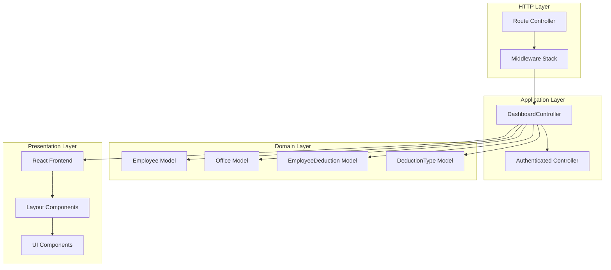
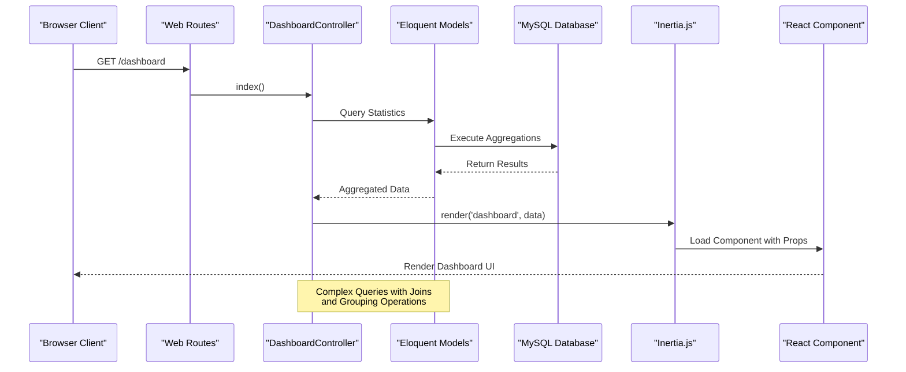
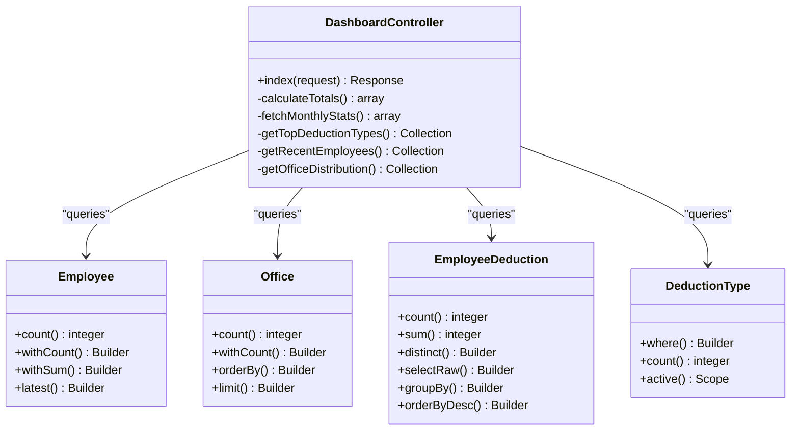
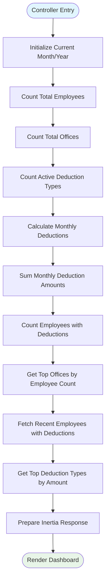
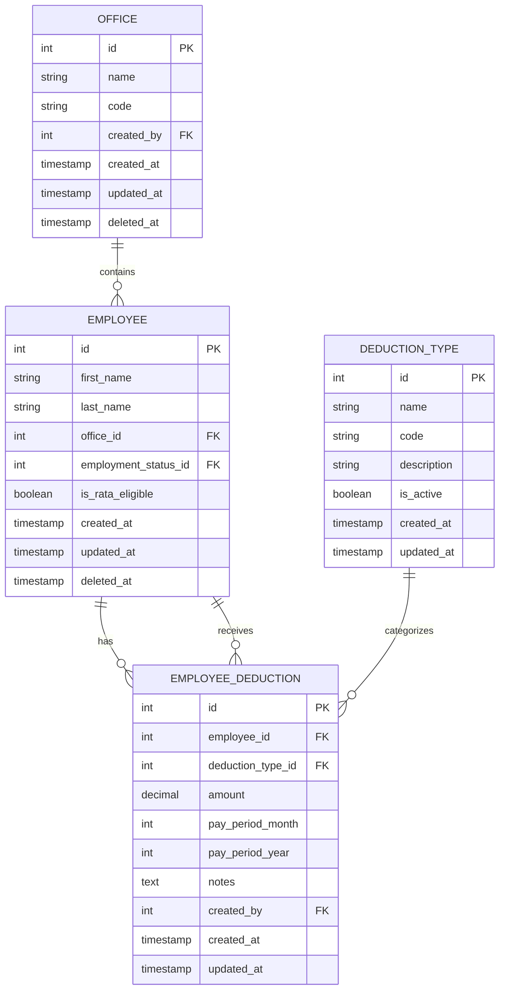
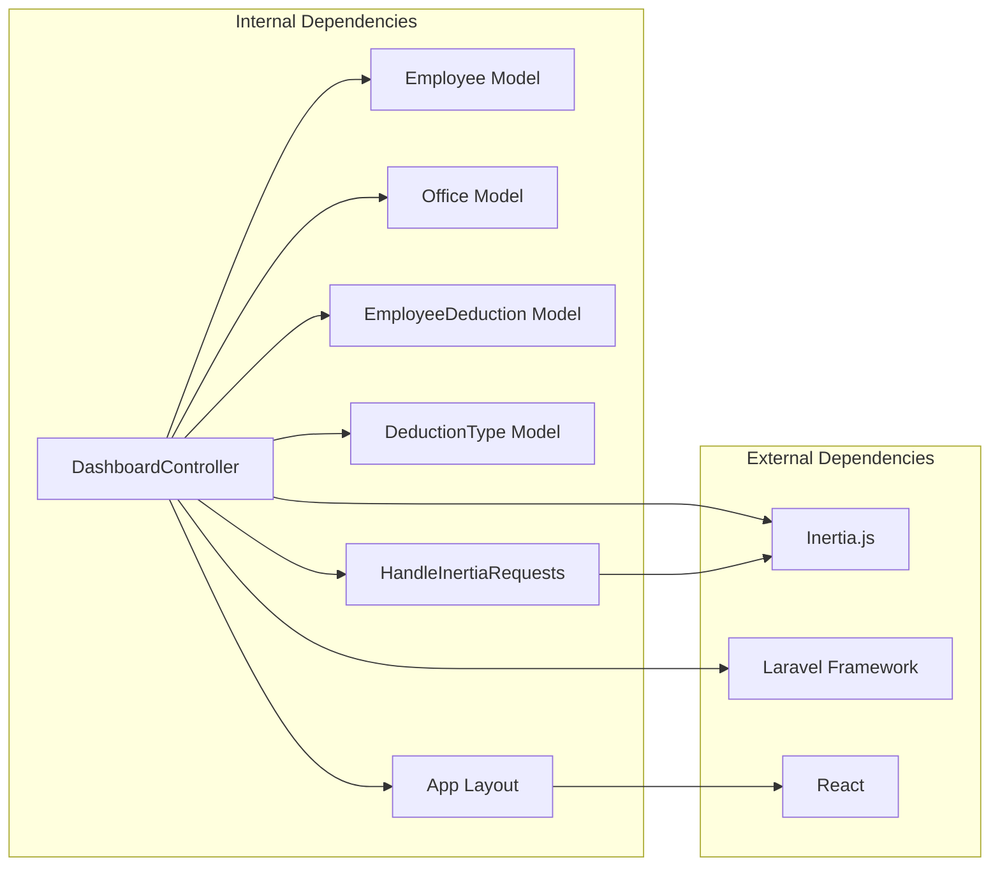

# Dashboard Controller

<cite>
**Referenced Files in This Document**
- [DashboardController.php](file://app/Http/Controllers/DashboardController.php)
- [dashboard.tsx](file://resources/js/pages/dashboard.tsx)
- [web.php](file://routes/web.php)
- [Controller.php](file://app/Http/Controllers/Controller.php)
- [Employee.php](file://app/Models/Employee.php)
- [Office.php](file://app/Models/Office.php)
- [EmployeeDeduction.php](file://app/Models/EmployeeDeduction.php)
- [DeductionType.php](file://app/Models/DeductionType.php)
- [HandleInertiaRequests.php](file://app/Http/Middleware/HandleInertiaRequests.php)
- [app-layout.tsx](file://resources/js/layouts/app-layout.tsx)
- [DashboardTest.php](file://tests/Feature/DashboardTest.php)
- [employee.d.ts](file://resources/js/types/employee.d.ts)
- [office.d.ts](file://resources/js/types/office.d.ts)
</cite>

## Table of Contents
1. [Introduction](#introduction)
2. [Project Structure](#project-structure)
3. [Core Components](#core-components)
4. [Architecture Overview](#architecture-overview)
5. [Detailed Component Analysis](#detailed-component-analysis)
6. [Dependency Analysis](#dependency-analysis)
7. [Performance Considerations](#performance-considerations)
8. [Troubleshooting Guide](#troubleshooting-guide)
9. [Conclusion](#conclusion)

## Introduction

The Dashboard Controller is the central hub for the Employee Deductions Management System, providing administrators and HR personnel with comprehensive insights into payroll operations. This controller orchestrates data collection from multiple models, performs complex aggregations, and presents actionable analytics through an intuitive React-based interface.

The system manages employee deductions including various types such as SSS, PhilHealth, Pag-IBIG, and other company-specific deductions. It provides real-time statistics, trend analysis, and quick navigation to related management interfaces.

## Project Structure

The Dashboard Controller follows Laravel's MVC architecture with Inertia.js for seamless server-client communication:

**Diagram sources**
- [DashboardController.php:12-88](file://app/Http/Controllers/DashboardController.php#L12-L88)
- [web.php:24-25](file://routes/web.php#L24-L25)

**Section sources**
- [DashboardController.php:1-89](file://app/Http/Controllers/DashboardController.php#L1-L89)
- [web.php:1-115](file://routes/web.php#L1-L115)

## Core Components

### DashboardController

The DashboardController serves as the primary orchestrator, implementing sophisticated data aggregation and analysis capabilities:

**Key Responsibilities:**
- Aggregate organizational metrics (employee counts, office distribution)
- Calculate monthly deduction statistics
- Generate top-performing deduction type reports
- Provide recent employee activity insights
- Coordinate data presentation through Inertia.js

**Data Collection Methods:**
- Statistical aggregations using Eloquent ORM
- Complex joins with relationship queries
- Period-based filtering for current month analysis
- Multi-dimensional grouping and sorting

**Section sources**
- [DashboardController.php:14-87](file://app/Http/Controllers/DashboardController.php#L14-L87)

### Frontend Dashboard Component

The React-based dashboard provides interactive data visualization with responsive design:

**Core Features:**
- Real-time statistical cards with icons and color coding
- Interactive charts for deduction type analysis
- Employee listing with quick action capabilities
- Office distribution visualization
- Responsive grid layout for different screen sizes

**Section sources**
- [dashboard.tsx:49-283](file://resources/js/pages/dashboard.tsx#L49-L283)

## Architecture Overview

The Dashboard system implements a modern full-stack architecture combining Laravel backend with React frontend:

**Diagram sources**
- [web.php:24-25](file://routes/web.php#L24-L25)
- [DashboardController.php:14-87](file://app/Http/Controllers/DashboardController.php#L14-L87)
- [dashboard.tsx:49-283](file://resources/js/pages/dashboard.tsx#L49-L283)

## Detailed Component Analysis

### DashboardController Implementation

The controller implements sophisticated data aggregation through multiple Eloquent queries:

**Diagram sources**
- [DashboardController.php:12-88](file://app/Http/Controllers/DashboardController.php#L12-L88)
- [Employee.php:10-104](file://app/Models/Employee.php#L10-L104)
- [Office.php:9-38](file://app/Models/Office.php#L9-L38)
- [EmployeeDeduction.php:8-59](file://app/Models/EmployeeDeduction.php#L8-L59)
- [DeductionType.php:7-33](file://app/Models/DeductionType.php#L7-L33)

**Processing Logic Flow:**

**Diagram sources**
- [DashboardController.php:14-87](file://app/Http/Controllers/DashboardController.php#L14-L87)

### Data Models and Relationships

The dashboard relies on several interconnected models with specific relationships:

**Diagram sources**
- [Employee.php:14-64](file://app/Models/Employee.php#L14-L64)
- [Office.php:13-27](file://app/Models/Office.php#L13-L27)
- [EmployeeDeduction.php:10-39](file://app/Models/EmployeeDeduction.php#L10-L39)
- [DeductionType.php:9-23](file://app/Models/DeductionType.php#L9-L23)

**Section sources**
- [Employee.php:10-104](file://app/Models/Employee.php#L10-L104)
- [Office.php:9-38](file://app/Models/Office.php#L9-L38)
- [EmployeeDeduction.php:8-59](file://app/Models/EmployeeDeduction.php#L8-L59)
- [DeductionType.php:7-33](file://app/Models/DeductionType.php#L7-L33)

### Frontend Dashboard Implementation

The React component provides comprehensive data visualization with interactive elements:

**Statistical Cards:**
- Total Employees: Shows organizational headcount
- Total Offices: Displays department distribution
- Deduction Types: Counts active deduction categories
- Monthly Deductions: Presents transaction volume and total amounts

**Interactive Features:**
- Clickable employee cards for detailed views
- Quick action buttons for common operations
- Responsive grid layout adapting to screen size
- Currency formatting for financial data

**Section sources**
- [dashboard.tsx:49-283](file://resources/js/pages/dashboard.tsx#L49-L283)

## Dependency Analysis

The Dashboard Controller exhibits well-structured dependencies with clear separation of concerns:

**Diagram sources**
- [DashboardController.php:3-10](file://app/Http/Controllers/DashboardController.php#L3-L10)
- [HandleInertiaRequests.php:5-8](file://app/Http/Middleware/HandleInertiaRequests.php#L5-L8)
- [app-layout.tsx:1-17](file://resources/js/layouts/app-layout.tsx#L1-L17)

**Cohesion and Coupling Analysis:**
- **High Cohesion**: Controller focuses solely on dashboard data aggregation
- **Low Coupling**: Clear separation between data models and presentation layer
- **Interface Contracts**: Well-defined model relationships and query scopes

**Section sources**
- [DashboardController.php:1-89](file://app/Http/Controllers/DashboardController.php#L1-L89)
- [HandleInertiaRequests.php:1-55](file://app/Http/Middleware/HandleInertiaRequests.php#L1-L55)

## Performance Considerations

### Query Optimization Strategies

The dashboard employs several optimization techniques:

**Aggregation Efficiency:**
- Single-pass counting operations using Eloquent's `count()` method
- Efficient sum calculations with database-level aggregation
- Selective column retrieval using `selectRaw()` for complex queries

**Memory Management:**
- Pagination-aware queries limiting result sets
- Relationship loading with eager loading to prevent N+1 queries
- Type casting for numeric precision and performance

**Caching Opportunities:**
- Potential for caching frequently accessed statistical data
- Session-based caching for user-specific dashboards
- Database query result caching for expensive aggregations

### Scalability Considerations

**Current Limitations:**
- All-time aggregations may become expensive with large datasets
- Complex joins could impact performance on high-volume systems
- Frontend rendering of large datasets requires optimization

**Recommended Improvements:**
- Implement database indexing on frequently queried columns
- Add query result caching mechanisms
- Consider implementing data export functionality for large datasets
- Optimize frontend rendering with virtual scrolling for large lists

## Troubleshooting Guide

### Common Issues and Solutions

**Authentication Problems:**
- Ensure proper authentication middleware is applied
- Verify user session establishment before accessing dashboard
- Check route protection configuration

**Data Loading Issues:**
- Verify database connectivity and model relationships
- Check for missing foreign key constraints
- Ensure proper timezone configuration for date-based queries

**Frontend Rendering Problems:**
- Validate TypeScript type definitions match backend data
- Check Inertia.js prop passing between server and client
- Verify component dependencies and imports

**Section sources**
- [DashboardTest.php:13-23](file://tests/Feature/DashboardTest.php#L13-L23)
- [web.php:24-25](file://routes/web.php#L24-L25)

### Debugging Strategies

**Backend Debugging:**
- Enable Laravel debug mode for development
- Use database query logging to analyze performance
- Implement proper error handling and logging

**Frontend Debugging:**
- Utilize browser developer tools for component inspection
- Check network requests for data loading issues
- Validate prop types and data flow between components

**Section sources**
- [DashboardTest.php:1-25](file://tests/Feature/DashboardTest.php#L1-L25)
- [HandleInertiaRequests.php:37-53](file://app/Http/Middleware/HandleInertiaRequests.php#L37-L53)

## Conclusion

The Dashboard Controller represents a well-architected solution for employee deductions management, combining robust backend data processing with modern frontend visualization. Its implementation demonstrates excellent separation of concerns, efficient data modeling, and scalable architecture patterns.

**Key Strengths:**
- Comprehensive statistical reporting with real-time data
- Intuitive user interface with responsive design
- Strong data relationships and model integrity
- Proper authentication and authorization handling
- Extensive testing coverage

**Areas for Enhancement:**
- Implement caching mechanisms for improved performance
- Add data export functionality for reporting
- Consider implementing real-time updates for critical metrics
- Enhance error handling and user feedback mechanisms

The dashboard system provides valuable insights into organizational payroll operations while maintaining clean code architecture and excellent user experience.