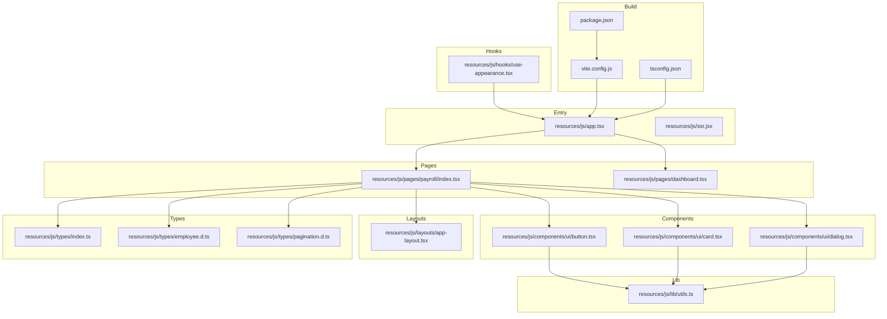
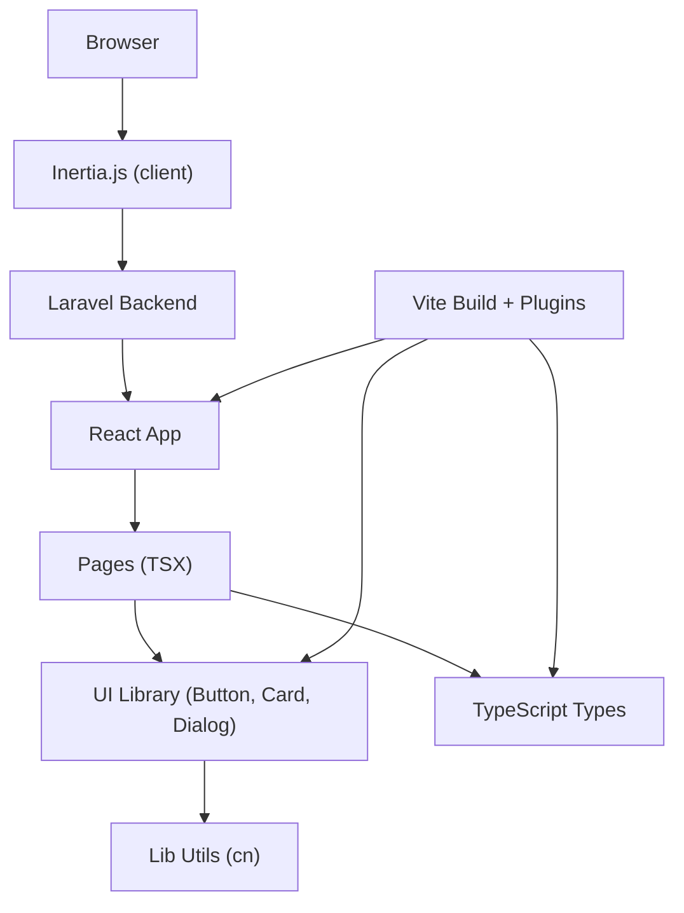
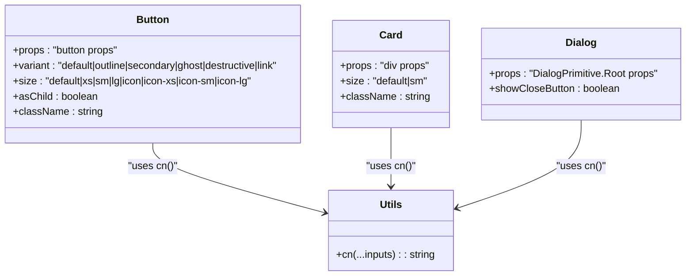
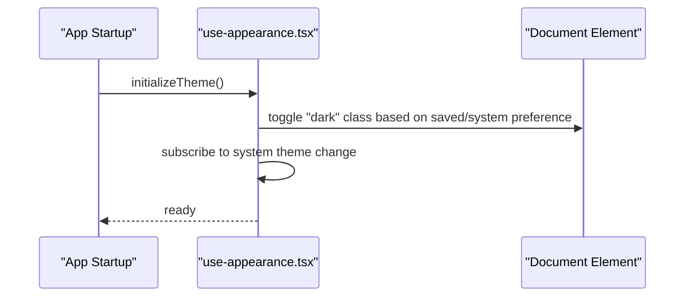
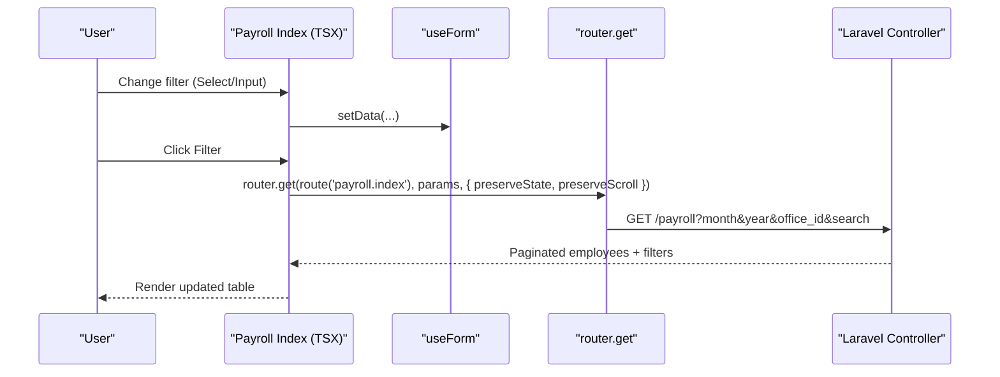
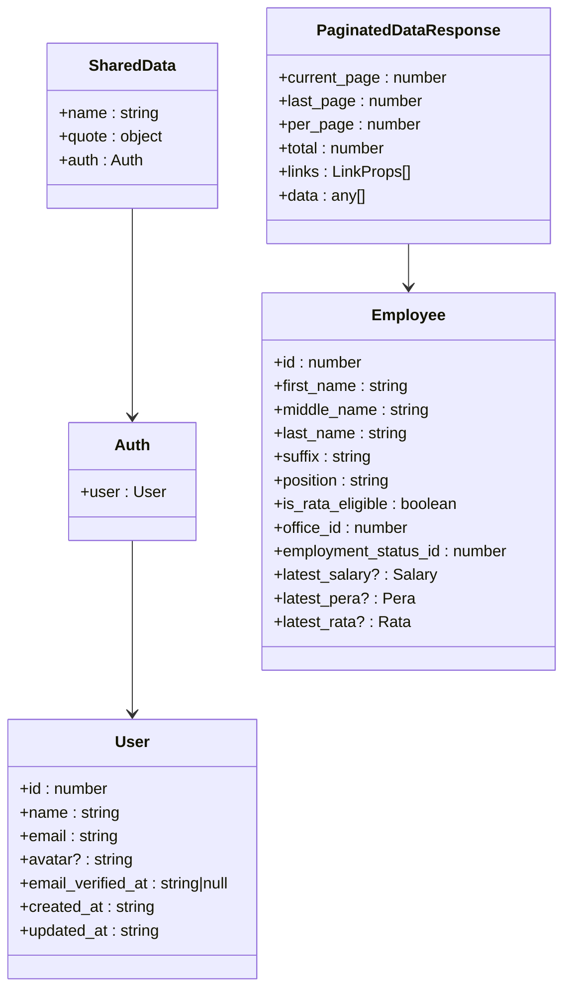
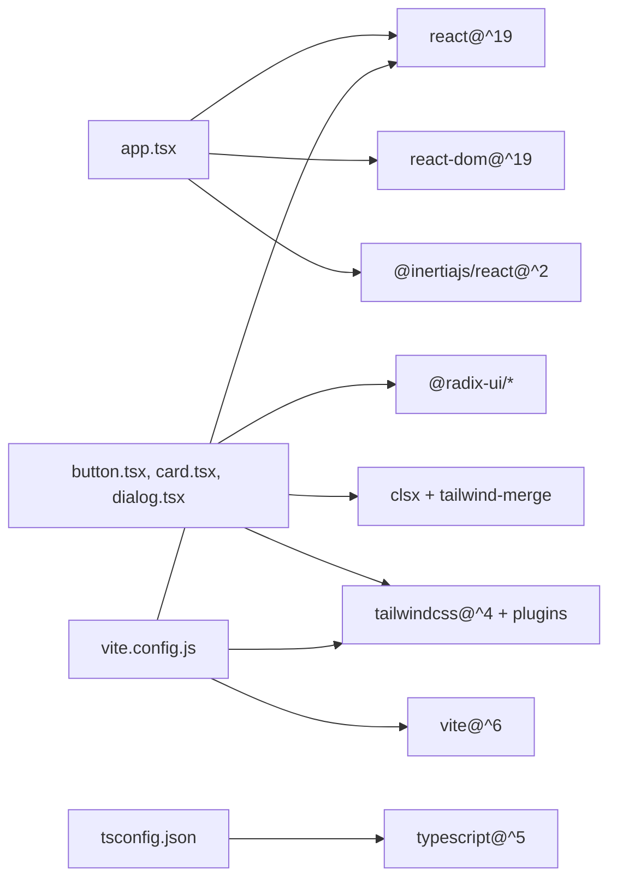

# Frontend Architecture

<cite>
**Referenced Files in This Document**
- [app.tsx](file://resources/js/app.tsx)
- [vite.config.js](file://vite.config.js)
- [tsconfig.json](file://tsconfig.json)
- [package.json](file://package.json)
- [utils.ts](file://resources/js/lib/utils.ts)
- [button.tsx](file://resources/js/components/ui/button.tsx)
- [card.tsx](file://resources/js/components/ui/card.tsx)
- [dialog.tsx](file://resources/js/components/ui/dialog.tsx)
- [use-appearance.tsx](file://resources/js/hooks/use-appearance.tsx)
- [index.ts](file://resources/js/types/index.ts)
- [employee.d.ts](file://resources/js/types/employee.d.ts)
- [pagination.d.ts](file://resources/js/types/pagination.d.ts)
- [index.tsx](file://resources/js/pages/payroll/index.tsx)
- [dashboard.tsx](file://resources/js/pages/dashboard.tsx)
</cite>

## Table of Contents
1. [Introduction](#introduction)
2. [Project Structure](#project-structure)
3. [Core Components](#core-components)
4. [Architecture Overview](#architecture-overview)
5. [Detailed Component Analysis](#detailed-component-analysis)
6. [Dependency Analysis](#dependency-analysis)
7. [Performance Considerations](#performance-considerations)
8. [Troubleshooting Guide](#troubleshooting-guide)
9. [Conclusion](#conclusion)
10. [Appendices](#appendices)

## Introduction
This document describes the frontend architecture of a React-based payroll management interface integrated with a Laravel backend via Inertia.js. It covers component architecture, TypeScript integration, Vite build configuration, the component library organization, reusable UI patterns, styling approach, state management strategy, component composition patterns, prop drilling prevention, build process and asset optimization, development workflow, TypeScript configuration and type safety, component lifecycle and event handling, form management, integration with Laravel backend, data fetching patterns, error handling strategies, and guidelines for component development, testing, and performance optimization.

## Project Structure
The frontend is organized around a React application bootstrapped with Inertia.js and Vite. The structure separates concerns into:
- Pages: Route-driven React components under resources/js/pages
- Components: Reusable UI primitives and composite components under resources/js/components
- Layouts: Page-level layouts under resources/js/layouts
- Hooks: Custom React hooks under resources/js/hooks
- Types: TypeScript definition files under resources/js/types
- Lib: Utility helpers under resources/js/lib
- Entry point and SSR: resources/js/app.tsx and resources/js/ssr.jsx

**Diagram sources**
- [app.tsx:1-30](file://resources/js/app.tsx#L1-L30)
- [vite.config.js:1-21](file://vite.config.js#L1-L21)
- [tsconfig.json:1-119](file://tsconfig.json#L1-L119)
- [package.json:1-73](file://package.json#L1-L73)
- [utils.ts:1-7](file://resources/js/lib/utils.ts#L1-L7)
- [button.tsx:1-68](file://resources/js/components/ui/button.tsx#L1-L68)
- [card.tsx:1-104](file://resources/js/components/ui/card.tsx#L1-L104)
- [dialog.tsx:1-166](file://resources/js/components/ui/dialog.tsx#L1-L166)
- [use-appearance.tsx:1-47](file://resources/js/hooks/use-appearance.tsx#L1-L47)
- [index.ts:1-49](file://resources/js/types/index.ts#L1-L49)
- [employee.d.ts:1-43](file://resources/js/types/employee.d.ts#L1-L43)
- [pagination.d.ts:1-24](file://resources/js/types/pagination.d.ts#L1-L24)
- [index.tsx:1-221](file://resources/js/pages/payroll/index.tsx#L1-L221)
- [dashboard.tsx:1-37](file://resources/js/pages/dashboard.tsx#L1-L37)

**Section sources**
- [app.tsx:1-30](file://resources/js/app.tsx#L1-L30)
- [vite.config.js:1-21](file://vite.config.js#L1-L21)
- [tsconfig.json:1-119](file://tsconfig.json#L1-L119)
- [package.json:1-73](file://package.json#L1-L73)

## Core Components
- Application entry and Inertia setup: Initializes the React root, resolves page components via Inertia, sets the page title, and enables progress bar.
- Theme initialization: Applies light/dark/system theme on load and persists user preference.
- Component library: Provides composable UI primitives (Button, Card, Dialog) with variant and size tokens, and a shared utility for Tailwind merging.
- Type system: Strongly typed interfaces for shared data, navigation, pagination, and domain entities like Employee.
- Pages: Route-driven screens such as Payroll Index and Dashboard, integrating UI components and forms.

Key implementation references:
- Inertia app bootstrap and page resolution
- Theme initialization hook
- UI primitives and styling utilities
- TypeScript type definitions
- Page components consuming UI and types

**Section sources**
- [app.tsx:15-29](file://resources/js/app.tsx#L15-L29)
- [use-appearance.tsx:20-46](file://resources/js/hooks/use-appearance.tsx#L20-L46)
- [button.tsx:44-67](file://resources/js/components/ui/button.tsx#L44-L67)
- [card.tsx:5-21](file://resources/js/components/ui/card.tsx#L5-L21)
- [dialog.tsx:10-86](file://resources/js/components/ui/dialog.tsx#L10-L86)
- [utils.ts:4-6](file://resources/js/lib/utils.ts#L4-L6)
- [index.ts:32-48](file://resources/js/types/index.ts#L32-L48)
- [employee.d.ts:8-29](file://resources/js/types/employee.d.ts#L8-L29)
- [pagination.d.ts:7-18](file://resources/js/types/pagination.d.ts#L7-L18)
- [index.tsx:38-47](file://resources/js/pages/payroll/index.tsx#L38-L47)

## Architecture Overview
The frontend uses Inertia.js to render React pages server-side via Laravel while maintaining client-side interactivity. Vite handles development and production builds with React and Tailwind plugins. TypeScript enforces type safety across components and pages. The component library promotes reuse and consistency.

**Diagram sources**
- [app.tsx:3-26](file://resources/js/app.tsx#L3-L26)
- [vite.config.js:8-17](file://vite.config.js#L8-L17)
- [button.tsx:1-6](file://resources/js/components/ui/button.tsx#L1-L6)
- [utils.ts:1-7](file://resources/js/lib/utils.ts#L1-L7)
- [index.ts:1-49](file://resources/js/types/index.ts#L1-L49)

## Detailed Component Analysis

### UI Primitive Library
The UI library defines composable primitives with variant and size tokens, enabling consistent styling and behavior across the app. Utilities merge Tailwind classes safely.

**Diagram sources**
- [button.tsx:44-67](file://resources/js/components/ui/button.tsx#L44-L67)
- [card.tsx:5-21](file://resources/js/components/ui/card.tsx#L5-L21)
- [dialog.tsx:10-86](file://resources/js/components/ui/dialog.tsx#L10-L86)
- [utils.ts:4-6](file://resources/js/lib/utils.ts#L4-L6)

**Section sources**
- [button.tsx:7-42](file://resources/js/components/ui/button.tsx#L7-L42)
- [card.tsx:14-21](file://resources/js/components/ui/card.tsx#L14-L21)
- [dialog.tsx:34-48](file://resources/js/components/ui/dialog.tsx#L34-L48)
- [utils.ts:4-6](file://resources/js/lib/utils.ts#L4-L6)

### Theme and Appearance Hook
The appearance hook manages theme persistence and system preference detection, applying a class to the document element for Tailwind dark mode.

**Diagram sources**
- [app.tsx:28-30](file://resources/js/app.tsx#L28-L30)
- [use-appearance.tsx:20-27](file://resources/js/hooks/use-appearance.tsx#L20-L27)

**Section sources**
- [use-appearance.tsx:1-47](file://resources/js/hooks/use-appearance.tsx#L1-L47)

### Payroll Index Page
The Payroll Index page demonstrates:
- Composition of UI primitives (Button, Input, Select, Table)
- Form state via Inertia’s useForm
- Filtering and navigation via router.get
- Currency formatting and date/month handling
- Pagination integration

**Diagram sources**
- [index.tsx:49-68](file://resources/js/pages/payroll/index.tsx#L49-L68)
- [index.tsx:13-13](file://resources/js/pages/payroll/index.tsx#L13-L13)

**Section sources**
- [index.tsx:38-47](file://resources/js/pages/payroll/index.tsx#L38-L47)
- [index.tsx:49-68](file://resources/js/pages/payroll/index.tsx#L49-L68)
- [index.tsx:70-79](file://resources/js/pages/payroll/index.tsx#L70-L79)
- [index.tsx:196-202](file://resources/js/pages/payroll/index.tsx#L196-L202)

### Dashboard Page
The Dashboard page showcases layout composition and placeholder visuals, demonstrating how pages integrate with layouts and UI primitives.

**Section sources**
- [dashboard.tsx:14-36](file://resources/js/pages/dashboard.tsx#L14-L36)

### Type Safety and Interfaces
TypeScript definitions provide strong typing for:
- Shared data and navigation items
- Pagination response shape
- Employee entity and related aggregates

**Diagram sources**
- [index.ts:32-48](file://resources/js/types/index.ts#L32-L48)
- [pagination.d.ts:7-18](file://resources/js/types/pagination.d.ts#L7-L18)
- [employee.d.ts:8-29](file://resources/js/types/employee.d.ts#L8-L29)

**Section sources**
- [index.ts:32-48](file://resources/js/types/index.ts#L32-L48)
- [pagination.d.ts:7-18](file://resources/js/types/pagination.d.ts#L7-L18)
- [employee.d.ts:8-29](file://resources/js/types/employee.d.ts#L8-L29)

## Dependency Analysis
The frontend relies on:
- React and ReactDOM for rendering
- Inertia.js for page transitions and form handling
- Radix UI for accessible primitives
- Tailwind CSS and shorthands for styling
- Vite for build tooling and dev server
- TypeScript for type safety

**Diagram sources**
- [package.json:23-65](file://package.json#L23-L65)
- [vite.config.js:1-21](file://vite.config.js#L1-L21)
- [tsconfig.json:14-116](file://tsconfig.json#L14-L116)
- [button.tsx:1-6](file://resources/js/components/ui/button.tsx#L1-L6)
- [card.tsx:1-4](file://resources/js/components/ui/card.tsx#L1-L4)
- [dialog.tsx:1-9](file://resources/js/components/ui/dialog.tsx#L1-L9)
- [utils.ts:1-7](file://resources/js/lib/utils.ts#L1-L7)

**Section sources**
- [package.json:23-65](file://package.json#L23-L65)
- [vite.config.js:1-21](file://vite.config.js#L1-L21)
- [tsconfig.json:14-116](file://tsconfig.json#L14-L116)

## Performance Considerations
- Prefer variant-based UI primitives to minimize duplicated styles and improve maintainability.
- Use memoization for expensive computations in pages (e.g., currency formatting) and avoid unnecessary re-renders by passing stable callbacks.
- Keep filter state updates minimal and batch navigation requests to reduce server load.
- Leverage Vite’s tree-shaking and React plugin for efficient builds.
- Use lazy loading for heavy assets and defer non-critical images.
- Monitor bundle size and remove unused dependencies regularly.

## Troubleshooting Guide
Common issues and remedies:
- Theme not applying on initial load: Ensure the theme initialization runs after the app mounts and that the document element receives the appropriate class.
- Inertia navigation not preserving state: Verify preserveState and preserveScroll options are set when calling router methods.
- Tailwind utilities not applied: Confirm Tailwind plugin is enabled in Vite and that class names are valid.
- TypeScript errors: Review tsconfig strictness and path aliases; ensure all props conform to defined interfaces.

**Section sources**
- [app.tsx:28-30](file://resources/js/app.tsx#L28-L30)
- [index.tsx:64-68](file://resources/js/pages/payroll/index.tsx#L64-L68)
- [vite.config.js:6-17](file://vite.config.js#L6-L17)
- [tsconfig.json:86-116](file://tsconfig.json#L86-L116)

## Conclusion
The frontend architecture combines Inertia.js, React, and a composable UI library with robust TypeScript typing and a streamlined build pipeline. The design emphasizes reusable components, type safety, and a consistent styling approach, enabling scalable development and maintainable payroll management interfaces.

## Appendices

### Build Process and Asset Optimization
- Development: Vite dev server with hot module replacement and automatic JSX transform.
- Production: Vite build with optimized asset generation and SSR support configured.
- Plugins: React, Tailwind CSS, and Laravel Vite plugin integration.

**Section sources**
- [vite.config.js:8-21](file://vite.config.js#L8-L21)
- [package.json:4-11](file://package.json#L4-L11)

### Development Workflow
- Run dev server, format code, lint, and build using npm scripts.
- Use Ziggy for route helpers and Inertia for seamless navigation.

**Section sources**
- [package.json:4-11](file://package.json#L4-L11)
- [app.tsx:6-11](file://resources/js/app.tsx#L6-L11)

### State Management Strategy
- Local component state via React hooks.
- Inertia forms via useForm for controlled form state.
- Global theme state via a dedicated hook with localStorage persistence.

**Section sources**
- [index.tsx:50-55](file://resources/js/pages/payroll/index.tsx#L50-L55)
- [use-appearance.tsx:29-46](file://resources/js/hooks/use-appearance.tsx#L29-L46)

### Prop Drilling Prevention
- Centralized theme state avoids prop drilling for appearance preferences.
- UI primitives accept className and variant props to encapsulate styling without deep propagation.

**Section sources**
- [use-appearance.tsx:29-46](file://resources/js/hooks/use-appearance.tsx#L29-L46)
- [button.tsx:44-67](file://resources/js/components/ui/button.tsx#L44-L67)

### Event Handling and Form Management
- Controlled inputs update useForm state; router.get triggers filtered reloads.
- Buttons and dialogs use consistent handlers and accessibility attributes.

**Section sources**
- [index.tsx:57-68](file://resources/js/pages/payroll/index.tsx#L57-L68)
- [dialog.tsx:70-82](file://resources/js/components/ui/dialog.tsx#L70-L82)

### Integration with Laravel Backend via Inertia.js
- Page components receive server-provided props (e.g., paginated data, filters).
- Navigation uses router.get with preserveState and preserveScroll to keep UX smooth.

**Section sources**
- [index.tsx:38-47](file://resources/js/pages/payroll/index.tsx#L38-L47)
- [index.tsx:64-68](file://resources/js/pages/payroll/index.tsx#L64-L68)

### Testing Approaches
- Unit tests for hooks and utilities using React testing libraries.
- Integration tests for page flows with Inertia navigation and form submissions.
- Snapshot tests for UI primitives to prevent regressions.

[No sources needed since this section provides general guidance]