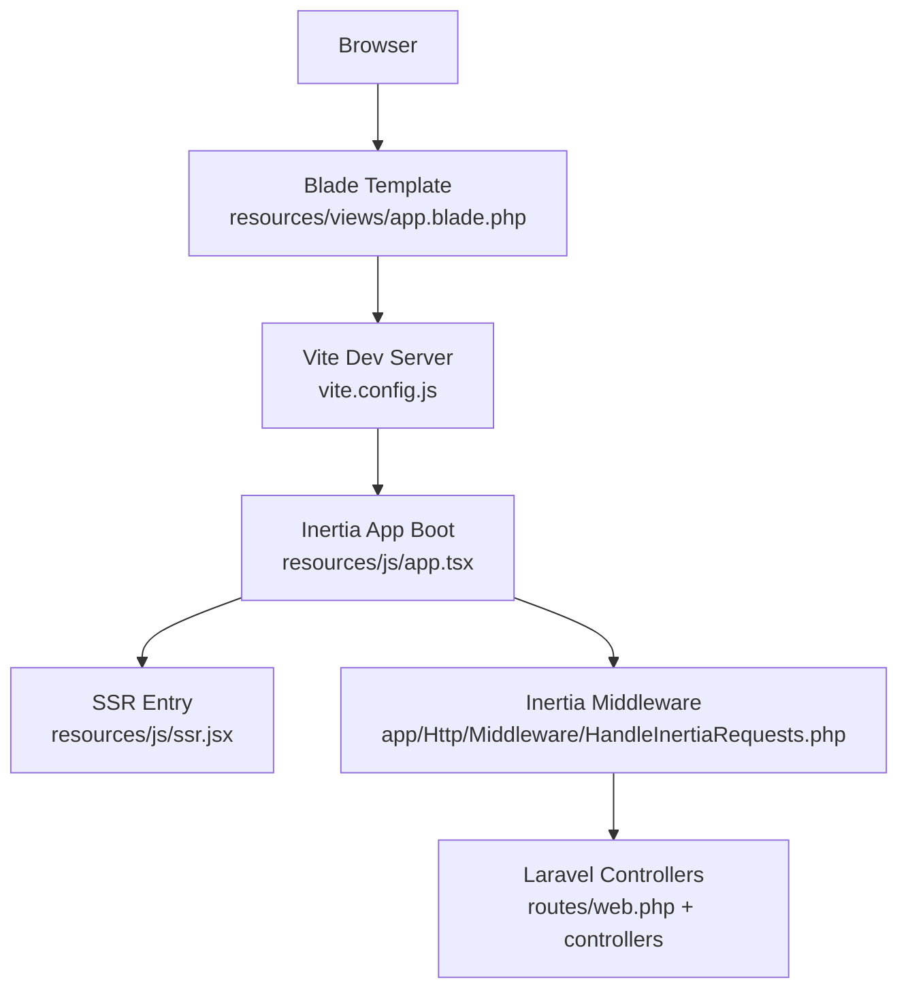
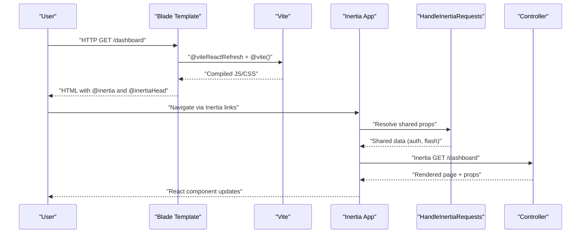
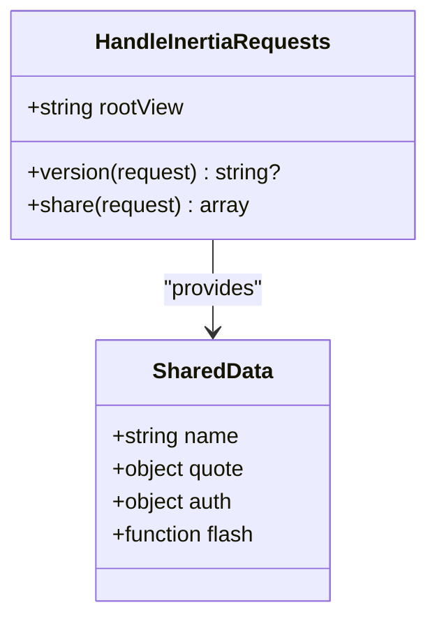
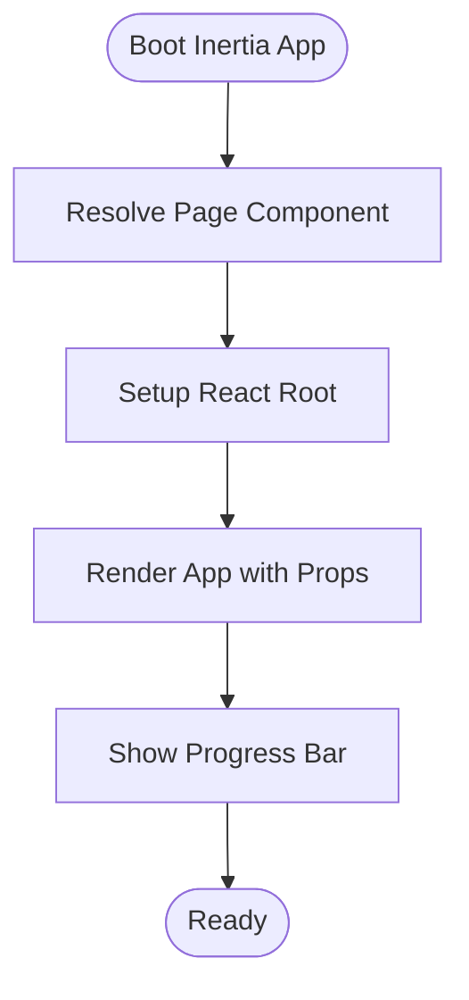
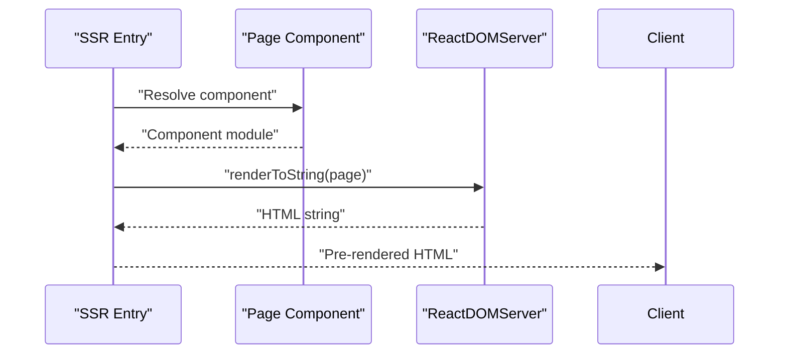
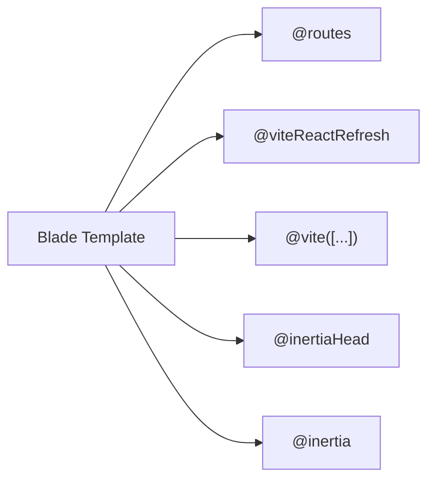
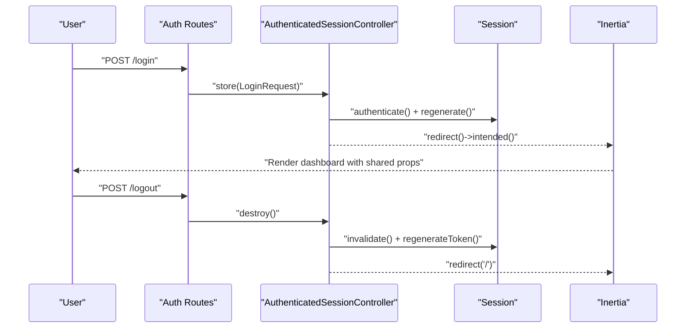
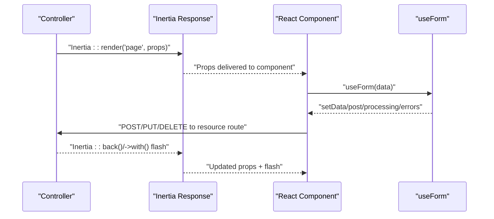
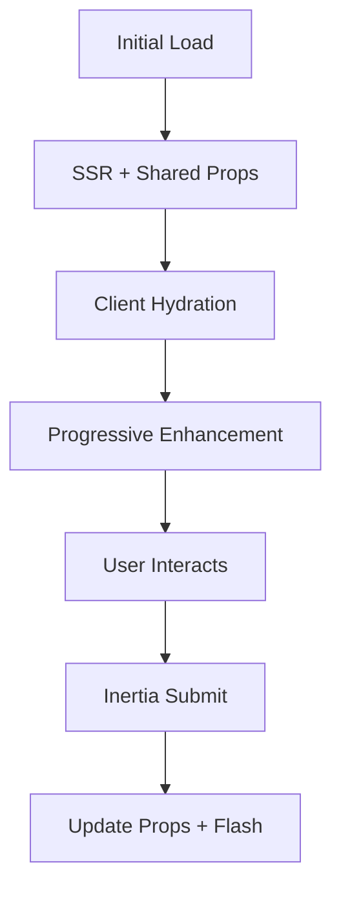
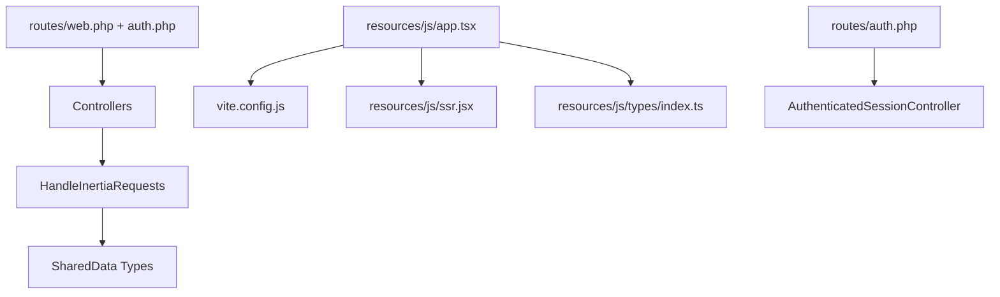

# Integration Patterns

<cite>
**Referenced Files in This Document**
- [HandleInertiaRequests.php](file://app/Http/Middleware/HandleInertiaRequests.php)
- [app.tsx](file://resources/js/app.tsx)
- [ssr.jsx](file://resources/js/ssr.jsx)
- [app.blade.php](file://resources/views/app.blade.php)
- [vite.config.js](file://vite.config.js)
- [package.json](file://package.json)
- [web.php](file://routes/web.php)
- [auth.php](file://routes/auth.php)
- [AuthenticatedSessionController.php](file://app/Http/Controllers/Auth/AuthenticatedSessionController.php)
- [LoginRequest.php](file://app/Http/Requests/Auth/LoginRequest.php)
- [login.tsx](file://resources/js/pages/auth/login.tsx)
- [dashboard.tsx](file://resources/js/pages/dashboard.tsx)
- [index.ts](file://resources/js/types/index.ts)
- [create.tsx](file://resources/js/pages/settings/EmploymentStatus/create.tsx)
- [index.tsx](file://resources/js/pages/settings/EmploymentStatus/index.tsx)
- [history.tsx](file://resources/js/pages\ratas\history.tsx)
- [create.tsx](file://resources/js/pages\settings\Employee\create.tsx)
- [session.php](file://config/session.php)
</cite>

## Table of Contents
1. [Introduction](#introduction)
2. [Project Structure](#project-structure)
3. [Core Components](#core-components)
4. [Architecture Overview](#architecture-overview)
5. [Detailed Component Analysis](#detailed-component-analysis)
6. [Dependency Analysis](#dependency-analysis)
7. [Performance Considerations](#performance-considerations)
8. [Troubleshooting Guide](#troubleshooting-guide)
9. [Conclusion](#conclusion)
10. [Appendices](#appendices)

## Introduction
This document explains the Laravel-React hybrid architecture powered by Inertia.js. It details how server-side Laravel controllers and middleware integrate with client-side React components, covering request-response flows, data serialization, state synchronization, inertia response handling, rendering strategies, and progressive enhancement. It also documents the asset pipeline, hot module replacement, development environment setup, authentication and session management, CSRF protection, API design patterns, error propagation, troubleshooting, performance optimization, and debugging approaches.

## Project Structure
The application follows a layered structure:
- Server-side Laravel routes and controllers orchestrate requests and render Inertia responses.
- Blade template loads Vite assets and initializes Inertia on the client.
- Vite compiles TypeScript/JSX and CSS, enabling React components and hot reloading.
- React components consume shared data via Inertia’s props and communicate with Laravel endpoints.

**Diagram sources**
- [app.blade.php:1-21](file://resources/views/app.blade.php#L1-L21)
- [vite.config.js:1-21](file://vite.config.js#L1-L21)
- [ssr.jsx:1-22](file://resources/js/ssr.jsx#L1-L22)
- [app.tsx:1-30](file://resources/js/app.tsx#L1-L30)
- [web.php:1-100](file://routes/web.php#L1-L100)
- [HandleInertiaRequests.php:1-55](file://app/Http/Middleware/HandleInertiaRequests.php#L1-L55)

**Section sources**
- [app.blade.php:1-21](file://resources/views/app.blade.php#L1-L21)
- [vite.config.js:1-21](file://vite.config.js#L1-L21)
- [web.php:1-100](file://routes/web.php#L1-L100)

## Core Components
- Inertia Middleware: Defines the root template, asset versioning hook, and shared data (application name, inspirational quote, authenticated user, flash messages).
- Client Boot: Initializes Inertia with page resolution, root rendering, and progress bar.
- SSR Entry: Renders pages server-side for initial load and SEO.
- Blade Template: Injects Ziggy routes, Vite assets, and Inertia head/body directives.
- Routes: Define page-rendering and resource endpoints; group authenticated routes under middleware.
- Authentication Controller: Handles login, logout, and session lifecycle with inertia-aware redirects.
- Shared Types: Define shared data contracts for TypeScript.

Key integration points:
- Shared data via middleware prop sharing.
- Page resolution via Vite helpers.
- Asset pipeline with hot module replacement.
- Session-based authentication with CSRF protection.

**Section sources**
- [HandleInertiaRequests.php:18-53](file://app/Http/Middleware/HandleInertiaRequests.php#L18-L53)
- [app.tsx:15-26](file://resources/js/app.tsx#L15-L26)
- [ssr.jsx:8-21](file://resources/js/ssr.jsx#L8-L21)
- [app.blade.php:12-19](file://resources/views/app.blade.php#L12-L19)
- [web.php:20-96](file://routes/web.php#L20-L96)
- [AuthenticatedSessionController.php:19-50](file://app/Http/Controllers/Auth/AuthenticatedSessionController.php#L19-L50)
- [index.ts:32-48](file://resources/js/types/index.ts#L32-L48)

## Architecture Overview
The hybrid architecture integrates Laravel and React as follows:
- Server renders a Blade page that includes Vite assets and Inertia directives.
- Vite builds the React app and enables hot reload.
- Inertia bridges server and client: server sends props, client renders React components.
- SSR entry supports server-side rendering for performance and SEO.

**Diagram sources**
- [app.blade.php:12-19](file://resources/views/app.blade.php#L12-L19)
- [vite.config.js:10-17](file://vite.config.js#L10-L17)
- [app.tsx:15-26](file://resources/js/app.tsx#L15-L26)
- [HandleInertiaRequests.php:37-52](file://app/Http/Middleware/HandleInertiaRequests.php#L37-L52)
- [web.php:20-23](file://routes/web.php#L20-L23)

## Detailed Component Analysis

### Inertia Middleware and Shared Data
- Root template: Ensures the Blade template wraps all Inertia responses.
- Asset versioning: Delegates to parent middleware for cache-busting.
- Shared props: Supplies application name, inspirational quote, authenticated user, and flash messages from session.

**Diagram sources**
- [HandleInertiaRequests.php:9-53](file://app/Http/Middleware/HandleInertiaRequests.php#L9-L53)
- [index.ts:32-37](file://resources/js/types/index.ts#L32-L37)

**Section sources**
- [HandleInertiaRequests.php:18-53](file://app/Http/Middleware/HandleInertiaRequests.php#L18-L53)
- [index.ts:32-37](file://resources/js/types/index.ts#L32-L37)

### Client Boot and Page Resolution
- Inertia app initialization: Resolves page components via Vite glob, mounts React root, and sets progress bar color.
- Hot module replacement: Enabled via Blade directive and Vite plugin.
- Theme initialization: Applies theme on load.

**Diagram sources**
- [app.tsx:15-26](file://resources/js/app.tsx#L15-L26)

**Section sources**
- [app.tsx:15-26](file://resources/js/app.tsx#L15-L26)
- [app.blade.php:12-14](file://resources/views/app.blade.php#L12-L14)
- [vite.config.js:10-14](file://vite.config.js#L10-L14)

### SSR Entry and Rendering Strategies
- SSR entry resolves page components eagerly and renders to string for initial server render.
- Enables hydration on the client and supports static generation scenarios.

**Diagram sources**
- [ssr.jsx:8-21](file://resources/js/ssr.jsx#L8-L21)

**Section sources**
- [ssr.jsx:8-21](file://resources/js/ssr.jsx#L8-L21)

### Blade Template and Asset Pipeline
- Ziggy routes injection for client-side routing.
- Vite React Refresh and asset bundling for development.
- Inertia head/body directives for meta and content rendering.

**Diagram sources**
- [app.blade.php:12-19](file://resources/views/app.blade.php#L12-L19)

**Section sources**
- [app.blade.php:12-19](file://resources/views/app.blade.php#L12-L19)
- [vite.config.js:10-17](file://vite.config.js#L10-L17)
- [package.json:4-11](file://package.json#L4-L11)

### Authentication Flow and Session Management
- Routes expose registration, login, password reset, verification, and logout endpoints.
- Login controller authenticates the user, regenerates session, and redirects to intended destination.
- Logout invalidates session and regenerates CSRF token.

**Diagram sources**
- [auth.php:13-56](file://routes/auth.php#L13-L56)
- [AuthenticatedSessionController.php:30-50](file://app/Http/Controllers/Auth/AuthenticatedSessionController.php#L30-L50)

**Section sources**
- [auth.php:13-56](file://routes/auth.php#L13-L56)
- [AuthenticatedSessionController.php:19-50](file://app/Http/Controllers/Auth/AuthenticatedSessionController.php#L19-L50)
- [LoginRequest.php:1-52](file://app/Http/Requests/Auth/LoginRequest.php#L1-L52)

### Request-Response Flow and Data Serialization
- Server-side controllers return Inertia responses with page name and props.
- Client-side forms use Inertia’s useForm to serialize and submit data.
- Flash messages propagate via session and are exposed through shared data.

**Diagram sources**
- [web.php:20-96](file://routes/web.php#L20-L96)
- [login.tsx:26-37](file://resources/js/pages/auth/login.tsx#L26-L37)
- [HandleInertiaRequests.php:48-51](file://app/Http/Middleware/HandleInertiaRequests.php#L48-L51)

**Section sources**
- [web.php:20-96](file://routes/web.php#L20-L96)
- [login.tsx:26-37](file://resources/js/pages/auth/login.tsx#L26-L37)
- [HandleInertiaRequests.php:48-51](file://app/Http/Middleware/HandleInertiaRequests.php#L48-L51)

### State Synchronization and Progressive Enhancement
- Shared data ensures consistent state across initial render and subsequent navigations.
- Components progressively enhance user interactions while preserving server-rendered content.
- Flash notifications demonstrate server-to-client state propagation.

**Diagram sources**
- [ssr.jsx:8-21](file://resources/js/ssr.jsx#L8-L21)
- [HandleInertiaRequests.php:41-52](file://app/Http/Middleware/HandleInertiaRequests.php#L41-L52)
- [create.tsx:37-41](file://resources/js/pages/settings/EmploymentStatus/create.tsx#L37-L41)

**Section sources**
- [ssr.jsx:8-21](file://resources/js/ssr.jsx#L8-L21)
- [HandleInertiaRequests.php:41-52](file://app/Http/Middleware/HandleInertiaRequests.php#L41-L52)
- [create.tsx:37-41](file://resources/js/pages/settings/EmploymentStatus/create.tsx#L37-L41)

### API Endpoint Design and Data Transformation
- Resource endpoints follow REST conventions grouped under prefixes.
- Controllers return inertia-aware responses; data transformations occur in Eloquent models and request classes.
- Frontend components use typed props and form helpers to manage state and submission.

Examples of endpoint groups:
- Payroll: index, show
- Salaries: index, history, store, destroy
- PERA: index, history, store, destroy
- RATA: index, history, store, destroy
- Deduction Types: index, store, update, destroy
- Employee Deductions: index, store, update, destroy
- Settings: Employment Statuses, Offices, Employees (CRUD)

**Section sources**
- [web.php:25-95](file://routes/web.php#L25-L95)

### Error Propagation and Validation
- Laravel request classes validate inputs; errors are propagated to React via Inertia.
- Components render input errors and handle submission lifecycle states.
- Flash messages carry success/error feedback after actions.

**Section sources**
- [login.tsx:58-81](file://resources/js/pages/auth/login.tsx#L58-L81)
- [create.tsx:37-41](file://resources/js/pages/settings/EmploymentStatus/create.tsx#L37-L41)

## Dependency Analysis
- Laravel routes depend on controllers and middleware.
- Middleware depends on shared data contracts and session.
- Client app depends on Vite, Inertia, and React.
- SSR depends on page resolution and ReactDOMServer.
- Authentication routes depend on request validation and session guards.

**Diagram sources**
- [web.php:1-100](file://routes/web.php#L1-L100)
- [auth.php:1-57](file://routes/auth.php#L1-L57)
- [HandleInertiaRequests.php:37-52](file://app/Http/Middleware/HandleInertiaRequests.php#L37-L52)
- [index.ts:32-48](file://resources/js/types/index.ts#L32-L48)
- [app.tsx:15-26](file://resources/js/app.tsx#L15-L26)
- [ssr.jsx:8-21](file://resources/js/ssr.jsx#L8-L21)
- [vite.config.js:1-21](file://vite.config.js#L1-L21)

**Section sources**
- [web.php:1-100](file://routes/web.php#L1-L100)
- [auth.php:1-57](file://routes/auth.php#L1-L57)
- [HandleInertiaRequests.php:37-52](file://app/Http/Middleware/HandleInertiaRequests.php#L37-L52)
- [index.ts:32-48](file://resources/js/types/index.ts#L32-L48)
- [app.tsx:15-26](file://resources/js/app.tsx#L15-L26)
- [ssr.jsx:8-21](file://resources/js/ssr.jsx#L8-L21)
- [vite.config.js:1-21](file://vite.config.js#L1-L21)

## Performance Considerations
- Enable SSR build scripts for production to improve initial load and SEO.
- Keep shared data minimal to reduce payload sizes.
- Use Vite’s built-in code splitting and lazy loading for large components.
- Leverage Tailwind CSS purge and minification in production builds.
- Monitor long tasks and avoid heavy synchronous work during hydration.

[No sources needed since this section provides general guidance]

## Troubleshooting Guide
Common issues and resolutions:
- Missing shared data: Ensure middleware shares required keys and types align with frontend contracts.
- Asset not refreshing: Verify Vite dev server is running and @viteReactRefresh is present in the Blade template.
- Authentication loops: Confirm session configuration and CSRF token regeneration on logout.
- Flash messages not visible: Ensure flash getters are invoked in shared data and consumed in components.
- SSR hydration mismatch: Validate component resolution and props consistency between server and client.

**Section sources**
- [HandleInertiaRequests.php:41-52](file://app/Http/Middleware/HandleInertiaRequests.php#L41-L52)
- [app.blade.php:12-19](file://resources/views/app.blade.php#L12-L19)
- [AuthenticatedSessionController.php:42-50](file://app/Http/Controllers/Auth/AuthenticatedSessionController.php#L42-L50)
- [create.tsx:37-41](file://resources/js/pages/settings/EmploymentStatus/create.tsx#L37-L41)

## Conclusion
This Laravel-React hybrid application leverages Inertia.js to unify server and client concerns. The integration centers on shared data, page resolution, and seamless navigation. With proper middleware configuration, asset pipeline setup, and authentication handling, the system achieves progressive enhancement, efficient rendering, and maintainable full-stack development.

[No sources needed since this section summarizes without analyzing specific files]

## Appendices

### Development Environment Setup
- Install dependencies via package manager.
- Run Vite dev server for asset compilation and hot reload.
- Configure environment variables for session and security settings.

**Section sources**
- [package.json:4-11](file://package.json#L4-L11)
- [vite.config.js:1-21](file://vite.config.js#L1-L21)
- [session.php:159-185](file://config/session.php#L159-L185)

### Authentication and CSRF Protection
- Session security: Secure, HTTP-only, and domain settings configured in session config.
- CSRF protection: Laravel handles tokens automatically; ensure forms and AJAX requests include tokens.

**Section sources**
- [session.php:159-185](file://config/session.php#L159-L185)