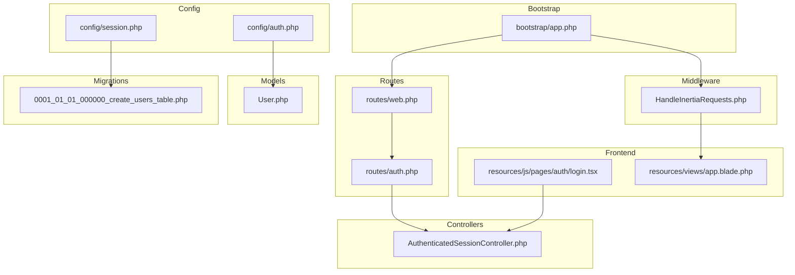
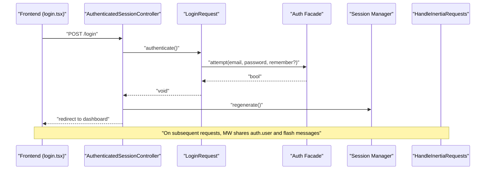
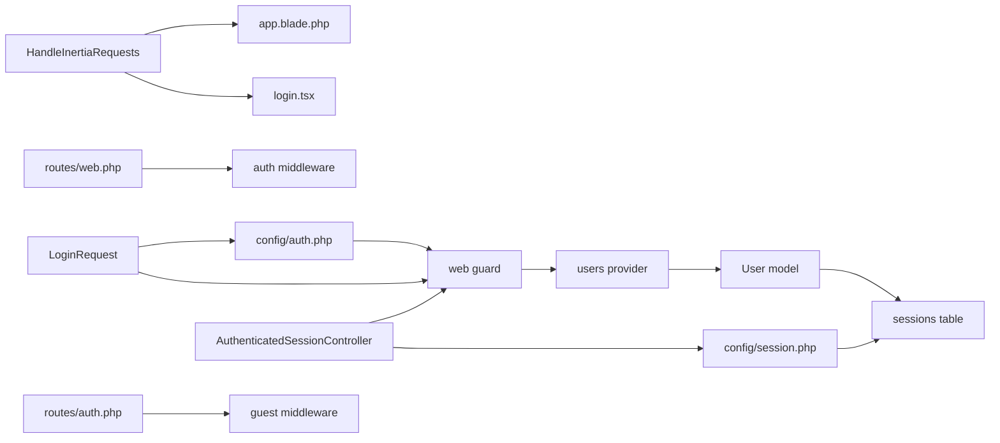

# Authentication Middleware & Guards

<cite>
**Referenced Files in This Document**
- [HandleInertiaRequests.php](file://app/Http/Middleware/HandleInertiaRequests.php)
- [auth.php](file://config/auth.php)
- [session.php](file://config/session.php)
- [web.php](file://routes/web.php)
- [auth.php](file://routes/auth.php)
- [AuthenticatedSessionController.php](file://app/Http/Controllers/Auth/AuthenticatedSessionController.php)
- [LoginRequest.php](file://app/Http/Requests/Auth/LoginRequest.php)
- [User.php](file://app/Models/User.php)
- [0001_01_01_000000_create_users_table.php](file://database/migrations/0001_01_01_000000_create_users_table.php)
- [app.php](file://bootstrap/app.php)
- [login.tsx](file://resources/js/pages/auth/login.tsx)
- [app.blade.php](file://resources/views/app.blade.php)
</cite>

## Table of Contents
1. [Introduction](#introduction)
2. [Project Structure](#project-structure)
3. [Core Components](#core-components)
4. [Architecture Overview](#architecture-overview)
5. [Detailed Component Analysis](#detailed-component-analysis)
6. [Dependency Analysis](#dependency-analysis)
7. [Performance Considerations](#performance-considerations)
8. [Troubleshooting Guide](#troubleshooting-guide)
9. [Conclusion](#conclusion)

## Introduction
This document explains the authentication middleware and guard configurations in the application, focusing on how Inertia request handling integrates with Laravel's authentication system, how guards and sessions are configured, and how route protection and user session handling work. It also covers CSRF protection and cross-site request forgery prevention measures, along with practical examples of protected routes and authentication state management.

## Project Structure
The authentication system spans configuration files, middleware, routes, controllers, requests, models, and frontend pages. The key areas are:
- Middleware stack configuration and Inertia request handling
- Authentication guard and provider setup
- Session storage and cookie policies
- Route protection via middleware groups
- Frontend integration for login and state sharing

**Diagram sources**
- [app.php:15-20](file://bootstrap/app.php#L15-L20)
- [HandleInertiaRequests.php:1-55](file://app/Http/Middleware/HandleInertiaRequests.php#L1-L55)
- [auth.php:1-116](file://config/auth.php#L1-L116)
- [session.php:1-218](file://config/session.php#L1-L218)
- [web.php:1-100](file://routes/web.php#L1-L100)
- [auth.php:1-57](file://routes/auth.php#L1-L57)
- [AuthenticatedSessionController.php:1-52](file://app/Http/Controllers/Auth/AuthenticatedSessionController.php#L1-L52)
- [User.php:1-49](file://app/Models/User.php#L1-L49)
- [0001_01_01_000000_create_users_table.php:1-50](file://database/migrations/0001_01_01_000000_create_users_table.php#L1-L50)
- [login.tsx:1-106](file://resources/js/pages/auth/login.tsx#L1-L106)
- [app.blade.php:1-21](file://resources/views/app.blade.php#L1-L21)

**Section sources**
- [app.php:15-20](file://bootstrap/app.php#L15-L20)
- [web.php:1-100](file://routes/web.php#L1-L100)
- [auth.php:1-57](file://routes/auth.php#L1-L57)

## Core Components
- Inertia request handling middleware: Shares application-wide data (including authentication state) and sets the root view for SSR.
- Authentication guard configuration: Defines the default guard ("web") backed by the session driver and Eloquent user provider.
- Session configuration: Controls driver, lifetime, cookie policy, and CSRF protections via SameSite and Secure flags.
- Route protection: Groups routes under middleware stacks to enforce guest vs. auth constraints.
- Login controller and request: Handles credential validation, throttling, session regeneration, and logout.

**Section sources**
- [HandleInertiaRequests.php:37-53](file://app/Http/Middleware/HandleInertiaRequests.php#L37-L53)
- [auth.php:16-43](file://config/auth.php#L16-L43)
- [session.php:21-217](file://config/session.php#L21-L217)
- [web.php:20-96](file://routes/web.php#L20-L96)
- [auth.php:13-56](file://routes/auth.php#L13-L56)
- [AuthenticatedSessionController.php:30-50](file://app/Http/Controllers/Auth/AuthenticatedSessionController.php#L30-L50)
- [LoginRequest.php:40-84](file://app/Http/Requests/Auth/LoginRequest.php#L40-L84)

## Architecture Overview
The authentication flow integrates frontend and backend:
- The frontend sends login requests via Inertia forms.
- The backend validates credentials using a form request with rate limiting.
- On success, the session is regenerated and the user is redirected to the intended dashboard.
- The Inertia middleware shares authentication state with the frontend on each request.

**Diagram sources**
- [login.tsx:32-37](file://resources/js/pages/auth/login.tsx#L32-L37)
- [AuthenticatedSessionController.php:30-37](file://app/Http/Controllers/Auth/AuthenticatedSessionController.php#L30-L37)
- [LoginRequest.php:40-53](file://app/Http/Requests/Auth/LoginRequest.php#L40-L53)
- [HandleInertiaRequests.php:45-52](file://app/Http/Middleware/HandleInertiaRequests.php#L45-L52)

## Detailed Component Analysis

### Inertia Request Handling Middleware
Purpose:
- Sets the root view for SSR.
- Shares application-wide data, including:
  - App name and inspirational quote.
  - Current authenticated user.
  - Flash messages (success/error) from the session.

Behavior highlights:
- Uses the parent Inertia middleware to handle versioning and shared data.
- Exposes the authenticated user object to the frontend for conditional rendering and navigation.

Security considerations:
- The shared user object is derived from the request's authenticated user, ensuring it reflects the current session.

**Section sources**
- [HandleInertiaRequests.php:18-53](file://app/Http/Middleware/HandleInertiaRequests.php#L18-L53)
- [app.blade.php:12-18](file://resources/views/app.blade.php#L12-L18)

### Authentication Guard Setup
Defaults:
- Default guard: "web"
- Default password broker: "users"

Guard configuration:
- "web" guard uses the "session" driver and the "users" provider.
- Provider "users" uses the Eloquent driver with the User model.

Password reset:
- Broker "users" uses the "users" provider, a dedicated password reset tokens table, expiration window, and throttling.

Password confirmation timeout:
- Configurable duration before the password confirmation overlay is dismissed.

**Section sources**
- [auth.php:16-19](file://config/auth.php#L16-L19)
- [auth.php:38-43](file://config/auth.php#L38-L43)
- [auth.php:62-72](file://config/auth.php#L62-L72)
- [auth.php:93-100](file://config/auth.php#L93-L100)
- [auth.php:113-113](file://config/auth.php#L113-L113)

### Session Management
Driver and storage:
- Default driver is "database" with a sessions table.
- Sessions are stored with payload, IP, user agent, and last activity timestamps.

Lifetime and cookie policy:
- Default session lifetime is 120 minutes.
- Cookie name is derived from the app name.
- SameSite defaults to "lax"; Secure and HttpOnly flags can be enabled via environment variables.
- Partitioned cookies are configurable.

Encryption:
- Optional symmetric encryption of session payloads.

Cookie path/domain:
- Path defaults to "/", domain is configurable.

Lottery and cleanup:
- Periodic garbage collection probability is defined.

**Section sources**
- [session.php:21-217](file://config/session.php#L21-L217)
- [0001_01_01_000000_create_users_table.php:30-37](file://database/migrations/0001_01_01_000000_create_users_table.php#L30-L37)

### Middleware Stack Configuration
Registration:
- The web middleware stack includes the Inertia request handler and asset preloading header middleware.
- This ensures SSR and shared data are available to all web routes.

Effect on authentication:
- Routes grouped under "auth" middleware will enforce authentication checks via the "web" guard.
- Guest-only routes (e.g., login, register) are grouped under "guest" middleware.

**Section sources**
- [app.php:15-20](file://bootstrap/app.php#L15-L20)
- [web.php:20-96](file://routes/web.php#L20-L96)
- [auth.php:13-56](file://routes/auth.php#L13-L56)

### Route Protection Mechanisms
Protected routes:
- Routes under the "auth" group are accessible only to authenticated users.
- Includes dashboard and nested resource routes for payroll, salaries, peras, ratas, deduction types, employee deductions, and settings.

Guest routes:
- Register and login routes are under "guest" middleware.
- Password reset and email verification routes are protected by additional middleware (signed, throttle).

Logout:
- Logout route invalidates the session, regenerates the CSRF token, and redirects to home.

**Section sources**
- [web.php:20-96](file://routes/web.php#L20-L96)
- [auth.php:13-56](file://routes/auth.php#L13-L56)
- [AuthenticatedSessionController.php:42-50](file://app/Http/Controllers/Auth/AuthenticatedSessionController.php#L42-L50)

### Authentication State Management
Frontend state:
- The Inertia middleware exposes an "auth.user" object to the frontend on each request.
- The login page reads optional status messages from the session and renders them.

Backend state:
- Successful login triggers session regeneration and redirection to the intended route.
- Logout clears the guard, invalidates the session, and regenerates the CSRF token.

**Section sources**
- [HandleInertiaRequests.php:45-52](file://app/Http/Middleware/HandleInertiaRequests.php#L45-L52)
- [AuthenticatedSessionController.php:19-37](file://app/Http/Controllers/Auth/AuthenticatedSessionController.php#L19-L37)
- [AuthenticatedSessionController.php:42-50](file://app/Http/Controllers/Auth/AuthenticatedSessionController.php#L42-L50)
- [login.tsx:21-24](file://resources/js/pages/auth/login.tsx#L21-L24)

### Login Flow and CSRF Protection
Validation and throttling:
- The LoginRequest validates email and password presence and applies rate limiting.
- On failure, it increments the rate limiter and throws a validation error with throttle details.

Authentication:
- Uses the Auth facade to attempt authentication with the "web" guard and optional "remember" flag.

Session security:
- On successful login, the session is regenerated to prevent fixation.
- CSRF tokens are managed by Laravel; logout invalidates the session and regenerates the CSRF token.

CSRF prevention:
- Laravel's built-in CSRF middleware protects state-changing requests.
- Session cookies use SameSite policies; Secure and HttpOnly flags further reduce XSS risks.

**Section sources**
- [LoginRequest.php:27-53](file://app/Http/Requests/Auth/LoginRequest.php#L27-L53)
- [LoginRequest.php:60-84](file://app/Http/Requests/Auth/LoginRequest.php#L60-L84)
- [AuthenticatedSessionController.php:30-37](file://app/Http/Controllers/Auth/AuthenticatedSessionController.php#L30-L37)
- [session.php:172-202](file://config/session.php#L172-L202)

### Protected Route Examples
- Grouped under "auth": dashboard, payroll, salaries, peras, ratas, deduction types, employee deductions, and settings routes.
- Guest-only: register and login endpoints.
- Additional protections: email verification requires signed links and throttling; password reset requires token validity.

**Section sources**
- [web.php:20-96](file://routes/web.php#L20-L96)
- [auth.php:13-56](file://routes/auth.php#L13-L56)

## Dependency Analysis
The authentication subsystem depends on:
- Middleware stack for SSR and shared data.
- Guard configuration for user retrieval and session binding.
- Session configuration for storage and cookie security.
- Controllers and requests for validation and state transitions.
- Frontend pages for user interaction and state consumption.

**Diagram sources**
- [HandleInertiaRequests.php:37-53](file://app/Http/Middleware/HandleInertiaRequests.php#L37-L53)
- [app.blade.php:12-18](file://resources/views/app.blade.php#L12-L18)
- [login.tsx:25-37](file://resources/js/pages/auth/login.tsx#L25-L37)
- [auth.php:38-72](file://config/auth.php#L38-L72)
- [session.php:21-90](file://config/session.php#L21-L90)
- [0001_01_01_000000_create_users_table.php:30-37](file://database/migrations/0001_01_01_000000_create_users_table.php#L30-L37)
- [web.php:20-96](file://routes/web.php#L20-L96)
- [auth.php:13-56](file://routes/auth.php#L13-L56)
- [AuthenticatedSessionController.php:30-50](file://app/Http/Controllers/Auth/AuthenticatedSessionController.php#L30-L50)
- [LoginRequest.php:40-84](file://app/Http/Requests/Auth/LoginRequest.php#L40-L84)
- [User.php:10-49](file://app/Models/User.php#L10-L49)

**Section sources**
- [auth.php:16-72](file://config/auth.php#L16-L72)
- [session.php:21-90](file://config/session.php#L21-L90)
- [web.php:20-96](file://routes/web.php#L20-L96)
- [auth.php:13-56](file://routes/auth.php#L13-L56)
- [AuthenticatedSessionController.php:30-50](file://app/Http/Controllers/Auth/AuthenticatedSessionController.php#L30-L50)
- [LoginRequest.php:40-84](file://app/Http/Requests/Auth/LoginRequest.php#L40-L84)
- [User.php:10-49](file://app/Models/User.php#L10-L49)
- [0001_01_01_000000_create_users_table.php:30-37](file://database/migrations/0001_01_01_000000_create_users_table.php#L30-L37)

## Performance Considerations
- Session driver: Using "database" provides reliable scalability but may incur overhead; consider Redis for high-traffic scenarios.
- Session lifetime: Shorter lifetimes improve security but increase re-auth frequency; balance based on UX needs.
- Rate limiting: Login throttling prevents brute force; tune attempts and decay windows carefully.
- Shared data: Minimize heavy computations in shared data to avoid impacting response times.

## Troubleshooting Guide
Common issues and resolutions:
- Authentication fails silently:
  - Verify the "web" guard is selected and the "users" provider resolves the User model.
  - Check that the session driver is writable and the sessions table exists.
- CSRF or session errors after login:
  - Ensure the session is regenerated on successful login and that cookies use appropriate SameSite and Secure flags.
- Throttled login attempts:
  - Confirm rate limiter keys are unique per email/IP and that the limiter configuration matches expectations.
- Frontend not reflecting auth state:
  - Confirm the Inertia middleware is registered in the web stack and that the root view is correctly configured.

**Section sources**
- [auth.php:16-72](file://config/auth.php#L16-L72)
- [session.php:21-217](file://config/session.php#L21-L217)
- [AuthenticatedSessionController.php:30-37](file://app/Http/Controllers/Auth/AuthenticatedSessionController.php#L30-L37)
- [HandleInertiaRequests.php:45-52](file://app/Http/Middleware/HandleInertiaRequests.php#L45-L52)
- [LoginRequest.php:60-84](file://app/Http/Requests/Auth/LoginRequest.php#L60-L84)
- [0001_01_01_000000_create_users_table.php:30-37](file://database/migrations/0001_01_01_000000_create_users_table.php#L30-L37)

## Conclusion
The application employs a clean separation of concerns for authentication:
- The "web" guard with session storage and Eloquent provider secures routes effectively.
- The Inertia middleware ensures seamless SSR and consistent authentication state exposure to the frontend.
- Session configuration balances security and usability with robust cookie policies and optional encryption.
- Route protection leverages middleware groups to enforce guest vs. authenticated access.
- Login and logout flows incorporate CSRF safeguards, session regeneration, and rate limiting to mitigate common threats.