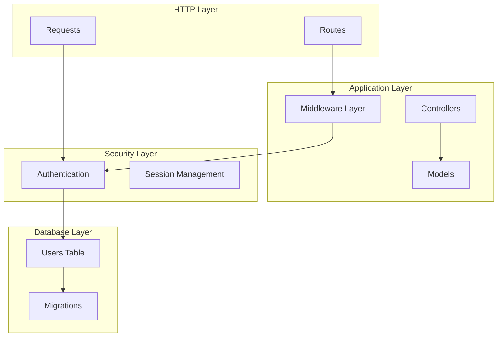
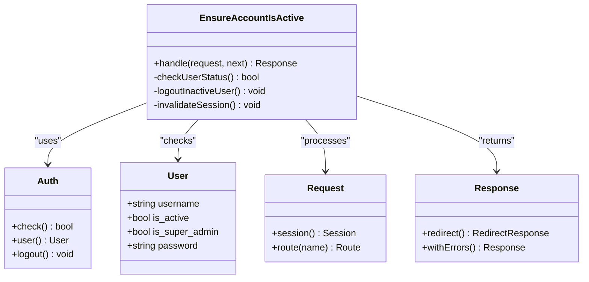
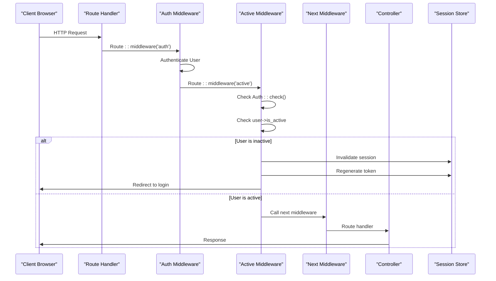
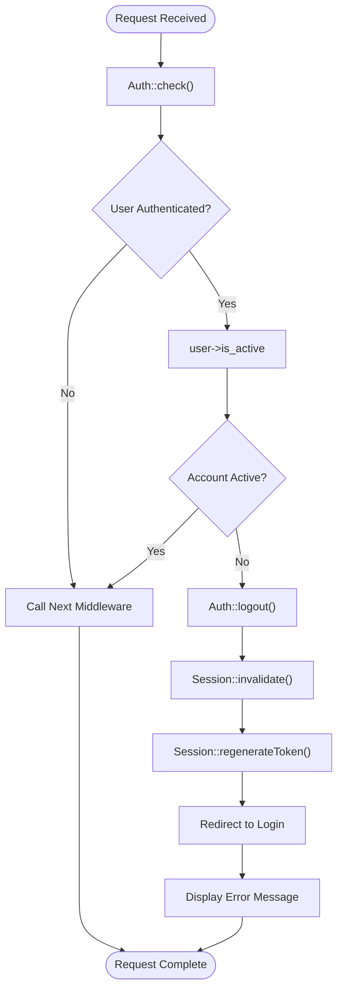
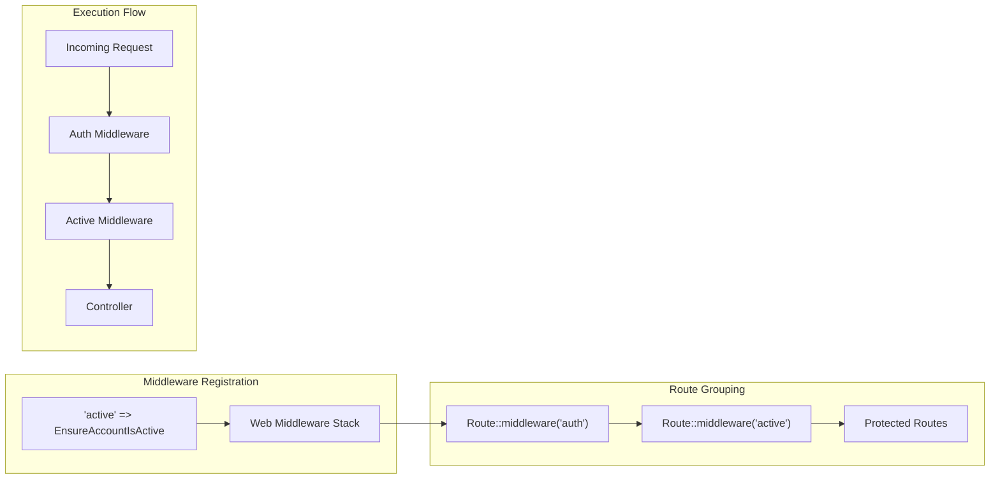
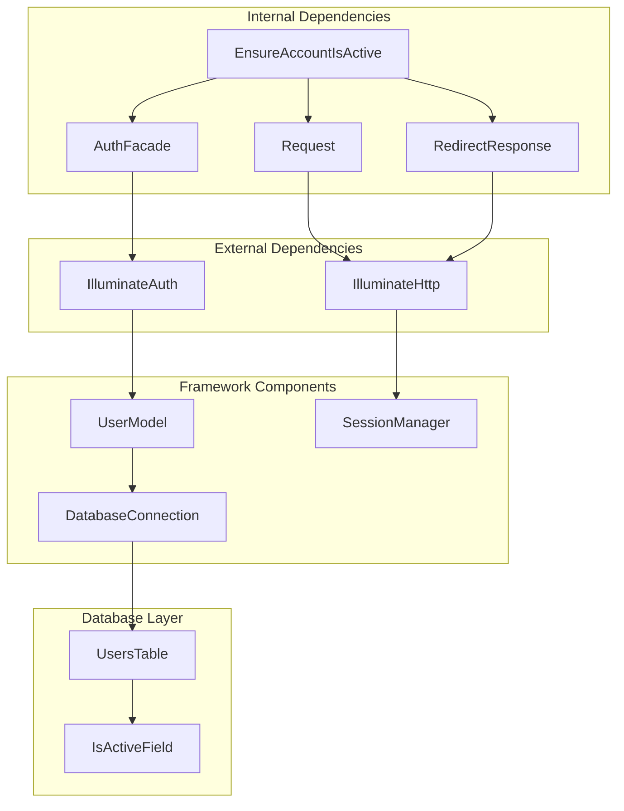

# Ensure Account Is Active Middleware

<cite>
**Referenced Files in This Document**
- [EnsureAccountIsActive.php](file://app/Http/Middleware/EnsureAccountIsActive.php)
- [User.php](file://app/Models/User.php)
- [2026_03_23_065831_update_users_table_add_username_remove_email.php](file://database/migrations/2026_03_23_065831_update_users_table_add_username_remove_email.php)
- [bootstrap/app.php](file://bootstrap/app.php)
- [routes/web.php](file://routes/web.php)
- [routes/auth.php](file://routes/auth.php)
- [AuthenticatedSessionController.php](file://app/Http/Controllers/Auth/AuthenticatedSessionController.php)
- [LoginRequest.php](file://app/Http/Requests/Auth/LoginRequest.php)
- [UserFactory.php](file://database/factories/UserFactory.php)
</cite>

## Table of Contents
1. [Introduction](#introduction)
2. [Project Structure](#project-structure)
3. [Core Components](#core-components)
4. [Architecture Overview](#architecture-overview)
5. [Detailed Component Analysis](#detailed-component-analysis)
6. [Dependency Analysis](#dependency-analysis)
7. [Performance Considerations](#performance-considerations)
8. [Troubleshooting Guide](#troubleshooting-guide)
9. [Conclusion](#conclusion)

## Introduction

The "Ensure Account Is Active Middleware" is a critical security feature in the Laravel application that automatically validates user account status during authentication requests. This middleware ensures that only active users can access protected routes, preventing unauthorized access when an account has been deactivated by administrators.

The middleware operates as part of the application's authentication pipeline, checking the `is_active` flag on user records and automatically logging out inactive users while redirecting them to the login page with appropriate error messaging. This mechanism provides an essential layer of security control over user access permissions.

## Project Structure

The middleware implementation follows Laravel's standard architecture patterns with clear separation of concerns:

**Diagram sources**
- [EnsureAccountIsActive.php:10-30](file://app/Http/Middleware/EnsureAccountIsActive.php#L10-L30)
- [routes/web.php:28-29](file://routes/web.php#L28-L29)
- [bootstrap/app.php:22-24](file://bootstrap/app.php#L22-L24)

**Section sources**
- [EnsureAccountIsActive.php:1-31](file://app/Http/Middleware/EnsureAccountIsActive.php#L1-L31)
- [routes/web.php:1-145](file://routes/web.php#L1-L145)
- [bootstrap/app.php:1-28](file://bootstrap/app.php#L1-L28)

## Core Components

### Middleware Implementation

The `EnsureAccountIsActive` middleware serves as the primary enforcement mechanism for user account validation:

**Diagram sources**
- [EnsureAccountIsActive.php:15-29](file://app/Http/Middleware/EnsureAccountIsActive.php#L15-L29)
- [User.php:20-26](file://app/Models/User.php#L20-L26)

### Database Schema Integration

The middleware relies on the `users` table structure that includes the `is_active` field:

| Column | Type | Default | Description |
|--------|------|---------|-------------|
| `username` | string | unique | User's login identifier |
| `password` | string | hashed | User's password hash |
| `is_active` | boolean | false | Account activation status |
| `is_super_admin` | boolean | false | Administrative privileges |

**Section sources**
- [EnsureAccountIsActive.php:15-29](file://app/Http/Middleware/EnsureAccountIsActive.php#L15-L29)
- [User.php:20-26](file://app/Models/User.php#L20-L26)
- [2026_03_23_065831_update_users_table_add_username_remove_email.php:14-18](file://database/migrations/2026_03_23_065831_update_users_table_add_username_remove_email.php#L14-L18)

## Architecture Overview

The middleware integrates seamlessly into Laravel's request-response cycle through the application's middleware stack:

**Diagram sources**
- [routes/web.php:28-29](file://routes/web.php#L28-L29)
- [bootstrap/app.php:22-24](file://bootstrap/app.php#L22-L24)
- [EnsureAccountIsActive.php:17-26](file://app/Http/Middleware/EnsureAccountIsActive.php#L17-L26)

## Detailed Component Analysis

### Middleware Logic Flow

The middleware implements a straightforward yet effective validation process:

**Diagram sources**
- [EnsureAccountIsActive.php:15-29](file://app/Http/Middleware/EnsureAccountIsActive.php#L15-L29)

### Authentication Integration

The middleware works in conjunction with the authentication system:

| Component | Purpose | Integration Point |
|-----------|---------|-------------------|
| `EnsureAccountIsActive` | Validates account status | Route middleware stack |
| `AuthenticatedSessionController` | Handles login/logout | Session management |
| `LoginRequest` | Validates login credentials | Authentication pipeline |
| `User Model` | Stores account status | Database persistence |

**Section sources**
- [EnsureAccountIsActive.php:15-29](file://app/Http/Middleware/EnsureAccountIsActive.php#L15-L29)
- [AuthenticatedSessionController.php:30-37](file://app/Http/Controllers/Auth/AuthenticatedSessionController.php#L30-L37)
- [LoginRequest.php:40-53](file://app/Http/Requests/Auth/LoginRequest.php#L40-L53)

### Route Configuration

The middleware is registered and applied through Laravel's routing system:

**Diagram sources**
- [bootstrap/app.php:22-24](file://bootstrap/app.php#L22-L24)
- [routes/web.php:28-29](file://routes/web.php#L28-L29)

**Section sources**
- [bootstrap/app.php:22-24](file://bootstrap/app.php#L22-L24)
- [routes/web.php:28-29](file://routes/web.php#L28-L29)

## Dependency Analysis

The middleware has minimal external dependencies, relying primarily on Laravel's built-in authentication and session systems:

**Diagram sources**
- [EnsureAccountIsActive.php:5-8](file://app/Http/Middleware/EnsureAccountIsActive.php#L5-L8)
- [User.php:10-13](file://app/Models/User.php#L10-L13)

### Security Considerations

The middleware provides several security benefits:

1. **Automatic Logout**: Inactive users are automatically logged out
2. **Session Invalidation**: Prevents session hijacking attempts
3. **Token Regeneration**: Ensures fresh CSRF protection
4. **Access Control**: Prevents unauthorized route access

**Section sources**
- [EnsureAccountIsActive.php:17-26](file://app/Http/Middleware/EnsureAccountIsActive.php#L17-L26)
- [routes/auth.php:37-56](file://routes/auth.php#L37-L56)

## Performance Considerations

The middleware has negligible performance impact due to its lightweight nature:

- **Single Database Query**: Only checks user authentication status
- **Minimal Memory Usage**: Stateless operation
- **Fast Execution**: Single conditional check per request
- **Cached Results**: Authentication state cached by Laravel

### Optimization Opportunities

1. **Session Caching**: Consider caching user status in session storage
2. **Database Indexing**: Ensure `is_active` column is indexed for large user bases
3. **Batch Operations**: For bulk user status updates, consider batch processing

## Troubleshooting Guide

### Common Issues and Solutions

| Issue | Symptoms | Solution |
|-------|----------|----------|
| Inactive user cannot access dashboard | Redirected to login with error message | Verify `is_active` field in database |
| Active user blocked from accessing routes | Unexpected logout behavior | Check middleware registration order |
| Session not invalidated properly | User remains logged in despite inactive status | Verify session invalidation calls |
| Error message not displayed | No feedback to user | Check route group middleware application |

### Debugging Steps

1. **Verify Middleware Registration**: Check `bootstrap/app.php` for middleware alias
2. **Test User Status**: Query database for specific user's `is_active` value
3. **Monitor Authentication Flow**: Use Laravel debug bar to trace middleware execution
4. **Check Session State**: Verify session invalidation and token regeneration

**Section sources**
- [EnsureAccountIsActive.php:17-26](file://app/Http/Middleware/EnsureAccountIsActive.php#L17-L26)
- [routes/web.php:28-29](file://routes/web.php#L28-L29)

## Conclusion

The "Ensure Account Is Active Middleware" provides a robust and efficient solution for user account validation in Laravel applications. Its implementation demonstrates clean separation of concerns, minimal performance overhead, and seamless integration with Laravel's authentication system.

Key benefits include:
- **Automatic Enforcement**: No manual checks required in controllers
- **Security Enhancement**: Prevents unauthorized access to protected routes
- **User Experience**: Clear feedback when accounts are deactivated
- **Maintainability**: Centralized logic reduces code duplication

The middleware serves as an excellent example of Laravel's middleware architecture, providing a foundation for additional security features and access control mechanisms.