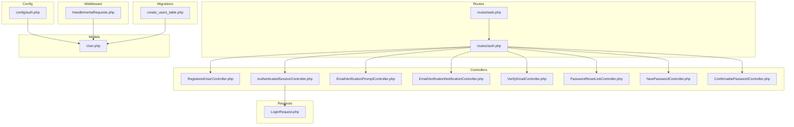
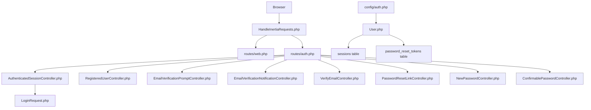
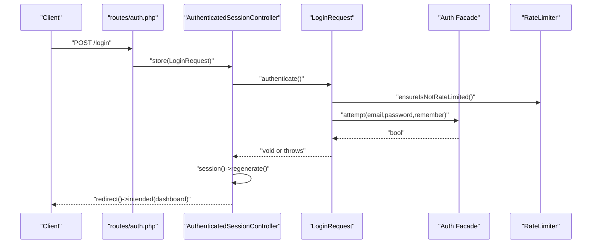
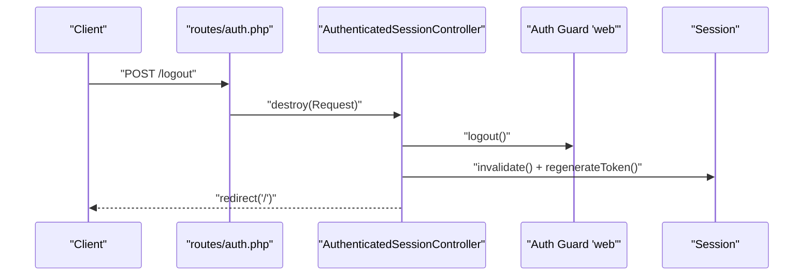
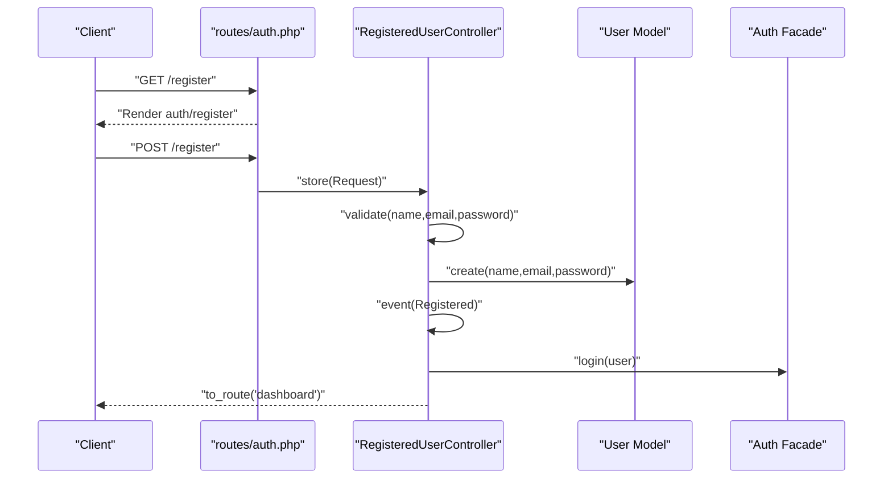
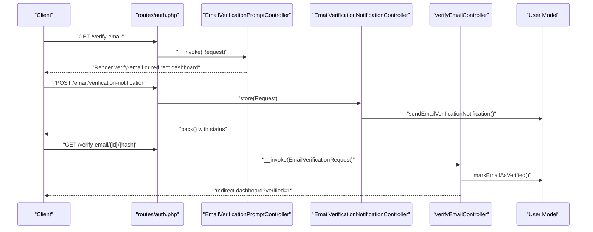
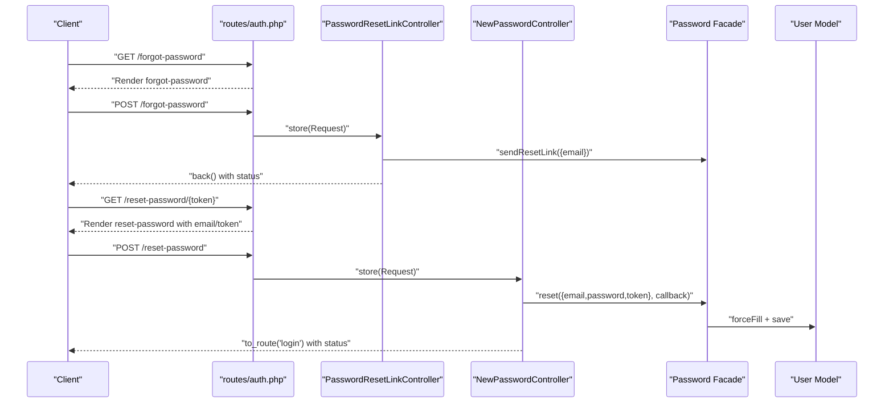
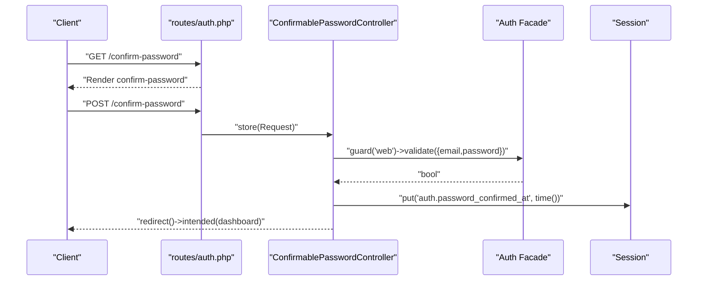
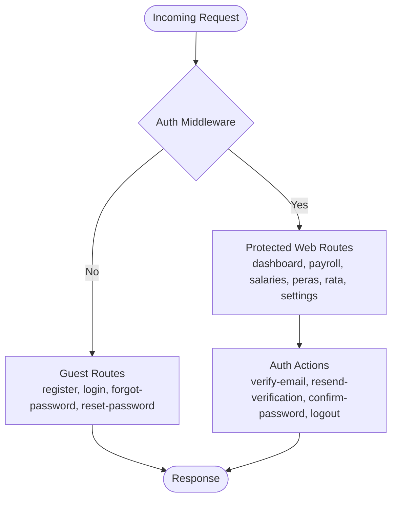
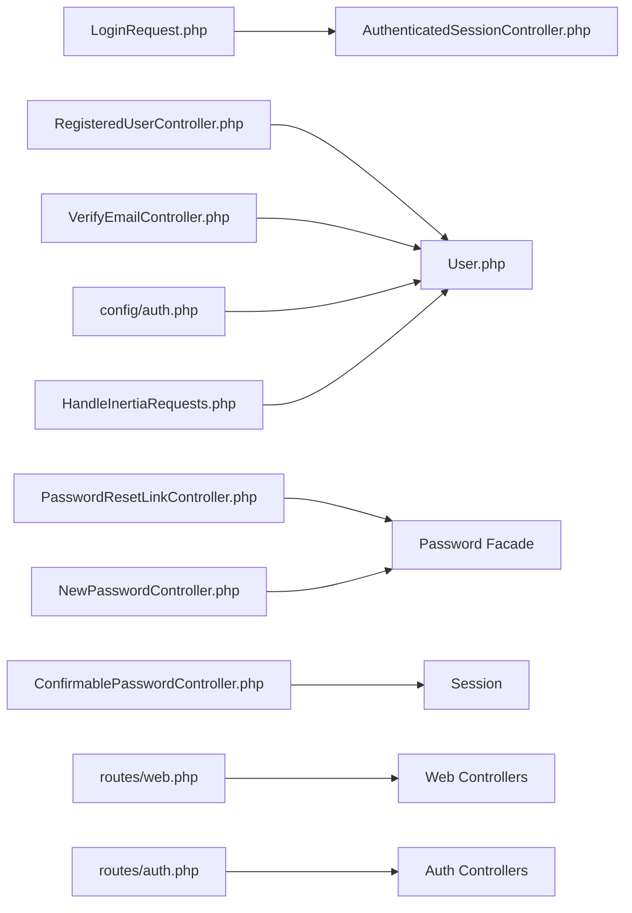

# Authentication System

<cite>
**Referenced Files in This Document**
- [routes/web.php](file://routes/web.php)
- [routes/auth.php](file://routes/auth.php)
- [config/auth.php](file://config/auth.php)
- [app/Http/Middleware/HandleInertiaRequests.php](file://app/Http/Middleware/HandleInertiaRequests.php)
- [app/Http/Controllers/Auth/AuthenticatedSessionController.php](file://app/Http/Controllers/Auth/AuthenticatedSessionController.php)
- [app/Http/Controllers/Auth/RegisteredUserController.php](file://app/Http/Controllers/Auth/RegisteredUserController.php)
- [app/Http/Controllers/Auth/VerifyEmailController.php](file://app/Http/Controllers/Auth/VerifyEmailController.php)
- [app/Http/Controllers/Auth/PasswordResetLinkController.php](file://app/Http/Controllers/Auth/PasswordResetLinkController.php)
- [app/Http/Controllers/Auth/NewPasswordController.php](file://app/Http/Controllers/Auth/NewPasswordController.php)
- [app/Http/Controllers/Auth/EmailVerificationNotificationController.php](file://app/Http/Controllers/Auth/EmailVerificationNotificationController.php)
- [app/Http/Controllers/Auth/EmailVerificationPromptController.php](file://app/Http/Controllers/Auth/EmailVerificationPromptController.php)
- [app/Http/Controllers/Auth/ConfirmablePasswordController.php](file://app/Http/Controllers/Auth/ConfirmablePasswordController.php)
- [app/Http/Requests/Auth/LoginRequest.php](file://app/Http/Requests/Auth/LoginRequest.php)
- [app/Models/User.php](file://app/Models/User.php)
- [database/migrations/0001_01_01_000000_create_users_table.php](file://database/migrations/0001_01_01_000000_create_users_table.php)
</cite>

## Table of Contents
1. [Introduction](#introduction)
2. [Project Structure](#project-structure)
3. [Core Components](#core-components)
4. [Architecture Overview](#architecture-overview)
5. [Detailed Component Analysis](#detailed-component-analysis)
6. [Dependency Analysis](#dependency-analysis)
7. [Performance Considerations](#performance-considerations)
8. [Troubleshooting Guide](#troubleshooting-guide)
9. [Conclusion](#conclusion)

## Introduction
This document explains the authentication system built with Laravel’s native authentication scaffolding and Inertia.js. It covers user registration, login/logout, email verification, password reset, and password confirmation flows. It also documents middleware protection, session management, rate limiting, and security measures. The system uses the session guard, Eloquent user provider, and database-backed sessions and password reset tokens.

## Project Structure
The authentication system spans routes, controllers, requests, models, configuration, middleware, and migrations:

- Routes define guest-only and authenticated-only groups, including registration, login, logout, email verification, password reset, and password confirmation endpoints.
- Controllers implement request handling for each flow.
- Requests encapsulate validation and throttling logic for login attempts.
- Configuration defines the session guard, user provider, and password reset broker.
- Middleware shares the authenticated user and flash messages with the frontend.
- Migrations define the users, password reset tokens, and sessions tables.

**Diagram sources**
- [routes/web.php:1-99](file://routes/web.php#L1-L99)
- [routes/auth.php:1-57](file://routes/auth.php#L1-L57)
- [config/auth.php:1-116](file://config/auth.php#L1-L116)
- [app/Http/Controllers/Auth/RegisteredUserController.php:1-52](file://app/Http/Controllers/Auth/RegisteredUserController.php#L1-L52)
- [app/Http/Controllers/Auth/AuthenticatedSessionController.php:1-52](file://app/Http/Controllers/Auth/AuthenticatedSessionController.php#L1-L52)
- [app/Http/Controllers/Auth/EmailVerificationPromptController.php:1-23](file://app/Http/Controllers/Auth/EmailVerificationPromptController.php#L1-L23)
- [app/Http/Controllers/Auth/EmailVerificationNotificationController.php:1-25](file://app/Http/Controllers/Auth/EmailVerificationNotificationController.php#L1-L25)
- [app/Http/Controllers/Auth/VerifyEmailController.php:1-31](file://app/Http/Controllers/Auth/VerifyEmailController.php#L1-L31)
- [app/Http/Controllers/Auth/PasswordResetLinkController.php:1-42](file://app/Http/Controllers/Auth/PasswordResetLinkController.php#L1-L42)
- [app/Http/Controllers/Auth/NewPasswordController.php:1-70](file://app/Http/Controllers/Auth/NewPasswordController.php#L1-L70)
- [app/Http/Controllers/Auth/ConfirmablePasswordController.php:1-42](file://app/Http/Controllers/Auth/ConfirmablePasswordController.php#L1-L42)
- [app/Http/Requests/Auth/LoginRequest.php:1-86](file://app/Http/Requests/Auth/LoginRequest.php#L1-L86)
- [app/Models/User.php:1-49](file://app/Models/User.php#L1-L49)
- [database/migrations/0001_01_01_000000_create_users_table.php:1-50](file://database/migrations/0001_01_01_000000_create_users_table.php#L1-L50)
- [app/Http/Middleware/HandleInertiaRequests.php:1-55](file://app/Http/Middleware/HandleInertiaRequests.php#L1-L55)

**Section sources**
- [routes/web.php:1-99](file://routes/web.php#L1-L99)
- [routes/auth.php:1-57](file://routes/auth.php#L1-L57)
- [config/auth.php:1-116](file://config/auth.php#L1-L116)
- [app/Http/Middleware/HandleInertiaRequests.php:1-55](file://app/Http/Middleware/HandleInertiaRequests.php#L1-L55)
- [database/migrations/0001_01_01_000000_create_users_table.php:1-50](file://database/migrations/0001_01_01_000000_create_users_table.php#L1-L50)

## Core Components
- Authentication guard and provider
  - Guard: session driver with provider users (Eloquent).
  - Provider: Eloquent model User.
  - Password broker: users with token table and expiration/throttle settings.
- Session management
  - Sessions stored in the sessions table; CSRF and session regeneration on login.
- Request validation and rate limiting
  - LoginRequest validates credentials and enforces throttling.
- Controllers
  - Registration, login/logout, email verification prompts and notifications, password reset link request, password reset form, and password confirmation.
- Frontend integration
  - Inertia shares auth.user and flash messages globally.

**Section sources**
- [config/auth.php:16-116](file://config/auth.php#L16-L116)
- [app/Http/Controllers/Auth/AuthenticatedSessionController.php:14-52](file://app/Http/Controllers/Auth/AuthenticatedSessionController.php#L14-L52)
- [app/Http/Controllers/Auth/RegisteredUserController.php:16-52](file://app/Http/Controllers/Auth/RegisteredUserController.php#L16-L52)
- [app/Http/Controllers/Auth/EmailVerificationPromptController.php:11-23](file://app/Http/Controllers/Auth/EmailVerificationPromptController.php#L11-L23)
- [app/Http/Controllers/Auth/EmailVerificationNotificationController.php:9-25](file://app/Http/Controllers/Auth/EmailVerificationNotificationController.php#L9-L25)
- [app/Http/Controllers/Auth/VerifyEmailController.php:10-31](file://app/Http/Controllers/Auth/VerifyEmailController.php#L10-L31)
- [app/Http/Controllers/Auth/PasswordResetLinkController.php:12-42](file://app/Http/Controllers/Auth/PasswordResetLinkController.php#L12-L42)
- [app/Http/Controllers/Auth/NewPasswordController.php:17-70](file://app/Http/Controllers/Auth/NewPasswordController.php#L17-L70)
- [app/Http/Controllers/Auth/ConfirmablePasswordController.php:13-42](file://app/Http/Controllers/Auth/ConfirmablePasswordController.php#L13-L42)
- [app/Http/Requests/Auth/LoginRequest.php:12-86](file://app/Http/Requests/Auth/LoginRequest.php#L12-L86)
- [app/Models/User.php:10-49](file://app/Models/User.php#L10-L49)
- [app/Http/Middleware/HandleInertiaRequests.php:37-55](file://app/Http/Middleware/HandleInertiaRequests.php#L37-L55)

## Architecture Overview
The authentication architecture combines Laravel backend controllers and requests with Inertia-driven frontend pages. Routes group endpoints by guest/authenticated access. Controllers delegate validation and persistence to models and facades. Rate limiting protects login attempts. Sessions persist authenticated state.

**Diagram sources**
- [routes/web.php:1-99](file://routes/web.php#L1-L99)
- [routes/auth.php:1-57](file://routes/auth.php#L1-L57)
- [app/Http/Middleware/HandleInertiaRequests.php:1-55](file://app/Http/Middleware/HandleInertiaRequests.php#L1-L55)
- [app/Http/Controllers/Auth/AuthenticatedSessionController.php:14-52](file://app/Http/Controllers/Auth/AuthenticatedSessionController.php#L14-L52)
- [app/Http/Controllers/Auth/RegisteredUserController.php:16-52](file://app/Http/Controllers/Auth/RegisteredUserController.php#L16-L52)
- [app/Http/Controllers/Auth/EmailVerificationPromptController.php:11-23](file://app/Http/Controllers/Auth/EmailVerificationPromptController.php#L11-L23)
- [app/Http/Controllers/Auth/EmailVerificationNotificationController.php:9-25](file://app/Http/Controllers/Auth/EmailVerificationNotificationController.php#L9-L25)
- [app/Http/Controllers/Auth/VerifyEmailController.php:10-31](file://app/Http/Controllers/Auth/VerifyEmailController.php#L10-L31)
- [app/Http/Controllers/Auth/PasswordResetLinkController.php:12-42](file://app/Http/Controllers/Auth/PasswordResetLinkController.php#L12-L42)
- [app/Http/Controllers/Auth/NewPasswordController.php:17-70](file://app/Http/Controllers/Auth/NewPasswordController.php#L17-L70)
- [app/Http/Controllers/Auth/ConfirmablePasswordController.php:13-42](file://app/Http/Controllers/Auth/ConfirmablePasswordController.php#L13-L42)
- [app/Http/Requests/Auth/LoginRequest.php:12-86](file://app/Http/Requests/Auth/LoginRequest.php#L12-L86)
- [config/auth.php:16-116](file://config/auth.php#L16-L116)
- [app/Models/User.php:10-49](file://app/Models/User.php#L10-L49)
- [database/migrations/0001_01_01_000000_create_users_table.php:30-37](file://database/migrations/0001_01_01_000000_create_users_table.php#L30-L37)

## Detailed Component Analysis

### Authentication Flow: Login
- Endpoint: POST /login
- Controller: AuthenticatedSessionController@store
- Request validation and throttling: LoginRequest.authenticate
- Session regeneration: session()->regenerate()
- Redirect: intended dashboard route

**Diagram sources**
- [routes/auth.php:19-22](file://routes/auth.php#L19-L22)
- [app/Http/Controllers/Auth/AuthenticatedSessionController.php:30-37](file://app/Http/Controllers/Auth/AuthenticatedSessionController.php#L30-L37)
- [app/Http/Requests/Auth/LoginRequest.php:40-53](file://app/Http/Requests/Auth/LoginRequest.php#L40-L53)
- [app/Http/Requests/Auth/LoginRequest.php:60-76](file://app/Http/Requests/Auth/LoginRequest.php#L60-L76)

**Section sources**
- [routes/auth.php:19-22](file://routes/auth.php#L19-L22)
- [app/Http/Controllers/Auth/AuthenticatedSessionController.php:30-37](file://app/Http/Controllers/Auth/AuthenticatedSessionController.php#L30-L37)
- [app/Http/Requests/Auth/LoginRequest.php:40-53](file://app/Http/Requests/Auth/LoginRequest.php#L40-L53)
- [app/Http/Requests/Auth/LoginRequest.php:60-76](file://app/Http/Requests/Auth/LoginRequest.php#L60-L76)

### Authentication Flow: Logout
- Endpoint: POST /logout
- Controller: AuthenticatedSessionController@destroy
- Actions: guard('web')->logout, invalidate session, regenerate CSRF token, redirect home

**Diagram sources**
- [routes/auth.php:54-55](file://routes/auth.php#L54-L55)
- [app/Http/Controllers/Auth/AuthenticatedSessionController.php:42-50](file://app/Http/Controllers/Auth/AuthenticatedSessionController.php#L42-L50)

**Section sources**
- [routes/auth.php:54-55](file://routes/auth.php#L54-L55)
- [app/Http/Controllers/Auth/AuthenticatedSessionController.php:42-50](file://app/Http/Controllers/Auth/AuthenticatedSessionController.php#L42-L50)

### Registration Flow
- Endpoints: GET /register (form), POST /register (submit)
- Controller: RegisteredUserController
- Steps: validate input, create user with hashed password, fire Registered event, auto-login, redirect to dashboard

**Diagram sources**
- [routes/auth.php:13-17](file://routes/auth.php#L13-L17)
- [app/Http/Controllers/Auth/RegisteredUserController.php:31-50](file://app/Http/Controllers/Auth/RegisteredUserController.php#L31-L50)
- [app/Models/User.php:10-49](file://app/Models/User.php#L10-L49)

**Section sources**
- [routes/auth.php:13-17](file://routes/auth.php#L13-L17)
- [app/Http/Controllers/Auth/RegisteredUserController.php:31-50](file://app/Http/Controllers/Auth/RegisteredUserController.php#L31-L50)
- [app/Models/User.php:10-49](file://app/Models/User.php#L10-L49)

### Email Verification Workflow
- Prompt: GET /verify-email (shows prompt if unverified)
- Resend: POST /email/verification-notification (throttled)
- Verify: GET /verify-email/{id}/{hash} (signed, throttled)
- Behavior: mark as verified, fire Verified event, redirect to dashboard with verified flag

**Diagram sources**
- [routes/auth.php:37-47](file://routes/auth.php#L37-L47)
- [app/Http/Controllers/Auth/EmailVerificationPromptController.php:16-21](file://app/Http/Controllers/Auth/EmailVerificationPromptController.php#L16-L21)
- [app/Http/Controllers/Auth/EmailVerificationNotificationController.php:14-23](file://app/Http/Controllers/Auth/EmailVerificationNotificationController.php#L14-L23)
- [app/Http/Controllers/Auth/VerifyEmailController.php:15-29](file://app/Http/Controllers/Auth/VerifyEmailController.php#L15-L29)

**Section sources**
- [routes/auth.php:37-47](file://routes/auth.php#L37-L47)
- [app/Http/Controllers/Auth/EmailVerificationPromptController.php:16-21](file://app/Http/Controllers/Auth/EmailVerificationPromptController.php#L16-L21)
- [app/Http/Controllers/Auth/EmailVerificationNotificationController.php:14-23](file://app/Http/Controllers/Auth/EmailVerificationNotificationController.php#L14-L23)
- [app/Http/Controllers/Auth/VerifyEmailController.php:15-29](file://app/Http/Controllers/Auth/VerifyEmailController.php#L15-L29)

### Password Reset Procedures
- Request reset link: GET /forgot-password, POST /forgot-password
- Reset password: GET /reset-password/{token}, POST /reset-password
- Controllers: PasswordResetLinkController, NewPasswordController
- Mechanism: Password facade manages tokens and delivery; reset updates password and fires PasswordReset event

**Diagram sources**
- [routes/auth.php:24-34](file://routes/auth.php#L24-L34)
- [app/Http/Controllers/Auth/PasswordResetLinkController.php:17-40](file://app/Http/Controllers/Auth/PasswordResetLinkController.php#L17-L40)
- [app/Http/Controllers/Auth/NewPasswordController.php:22-68](file://app/Http/Controllers/Auth/NewPasswordController.php#L22-L68)

**Section sources**
- [routes/auth.php:24-34](file://routes/auth.php#L24-L34)
- [app/Http/Controllers/Auth/PasswordResetLinkController.php:17-40](file://app/Http/Controllers/Auth/PasswordResetLinkController.php#L17-L40)
- [app/Http/Controllers/Auth/NewPasswordController.php:22-68](file://app/Http/Controllers/Auth/NewPasswordController.php#L22-L68)

### Password Confirmation (Re-authentication)
- Endpoint: GET /confirm-password (show), POST /confirm-password (submit)
- Controller: ConfirmablePasswordController
- Behavior: validate user password against guard, set confirmation timestamp in session, redirect to intended route

**Diagram sources**
- [routes/auth.php:49-52](file://routes/auth.php#L49-L52)
- [app/Http/Controllers/Auth/ConfirmablePasswordController.php:26-40](file://app/Http/Controllers/Auth/ConfirmablePasswordController.php#L26-L40)

**Section sources**
- [routes/auth.php:49-52](file://routes/auth.php#L49-L52)
- [app/Http/Controllers/Auth/ConfirmablePasswordController.php:26-40](file://app/Http/Controllers/Auth/ConfirmablePasswordController.php#L26-L40)

### Protected Routes and Access Patterns
- Web routes under the auth middleware group are protected:
  - Dashboard and multiple resource routes.
- Auth routes:
  - Guest group: register, login, forgot-password, reset-password.
  - Auth group: verify-email, resend verification-notification, confirm-password, logout.
- Access pattern:
  - Unauthenticated users are redirected to login/register.
  - Authenticated users can access protected web routes and auth-specific actions.

**Diagram sources**
- [routes/web.php:20-95](file://routes/web.php#L20-L95)
- [routes/auth.php:13-56](file://routes/auth.php#L13-L56)

**Section sources**
- [routes/web.php:20-95](file://routes/web.php#L20-L95)
- [routes/auth.php:13-56](file://routes/auth.php#L13-L56)

## Dependency Analysis
- Controllers depend on:
  - Requests for validation and throttling (LoginRequest).
  - Facades for authentication, password reset, and rate limiting.
  - Models for persistence (User).
- Routes depend on controllers and middleware.
- Configuration defines guard/provider/password broker.
- Middleware shares authenticated user and flash messages.

**Diagram sources**
- [app/Http/Requests/Auth/LoginRequest.php:12-86](file://app/Http/Requests/Auth/LoginRequest.php#L12-L86)
- [app/Http/Controllers/Auth/AuthenticatedSessionController.php:14-52](file://app/Http/Controllers/Auth/AuthenticatedSessionController.php#L14-L52)
- [app/Http/Controllers/Auth/RegisteredUserController.php:16-52](file://app/Http/Controllers/Auth/RegisteredUserController.php#L16-L52)
- [app/Http/Controllers/Auth/VerifyEmailController.php:10-31](file://app/Http/Controllers/Auth/VerifyEmailController.php#L10-L31)
- [app/Http/Controllers/Auth/PasswordResetLinkController.php:12-42](file://app/Http/Controllers/Auth/PasswordResetLinkController.php#L12-L42)
- [app/Http/Controllers/Auth/NewPasswordController.php:17-70](file://app/Http/Controllers/Auth/NewPasswordController.php#L17-L70)
- [app/Http/Controllers/Auth/ConfirmablePasswordController.php:13-42](file://app/Http/Controllers/Auth/ConfirmablePasswordController.php#L13-L42)
- [config/auth.php:16-116](file://config/auth.php#L16-L116)
- [app/Models/User.php:10-49](file://app/Models/User.php#L10-L49)
- [app/Http/Middleware/HandleInertiaRequests.php:37-55](file://app/Http/Middleware/HandleInertiaRequests.php#L37-L55)
- [routes/web.php:1-99](file://routes/web.php#L1-L99)
- [routes/auth.php:1-57](file://routes/auth.php#L1-L57)

**Section sources**
- [app/Http/Requests/Auth/LoginRequest.php:12-86](file://app/Http/Requests/Auth/LoginRequest.php#L12-L86)
- [app/Http/Controllers/Auth/AuthenticatedSessionController.php:14-52](file://app/Http/Controllers/Auth/AuthenticatedSessionController.php#L14-L52)
- [app/Http/Controllers/Auth/RegisteredUserController.php:16-52](file://app/Http/Controllers/Auth/RegisteredUserController.php#L16-L52)
- [app/Http/Controllers/Auth/VerifyEmailController.php:10-31](file://app/Http/Controllers/Auth/VerifyEmailController.php#L10-L31)
- [app/Http/Controllers/Auth/PasswordResetLinkController.php:12-42](file://app/Http/Controllers/Auth/PasswordResetLinkController.php#L12-L42)
- [app/Http/Controllers/Auth/NewPasswordController.php:17-70](file://app/Http/Controllers/Auth/NewPasswordController.php#L17-L70)
- [app/Http/Controllers/Auth/ConfirmablePasswordController.php:13-42](file://app/Http/Controllers/Auth/ConfirmablePasswordController.php#L13-L42)
- [config/auth.php:16-116](file://config/auth.php#L16-L116)
- [app/Models/User.php:10-49](file://app/Models/User.php#L10-L49)
- [app/Http/Middleware/HandleInertiaRequests.php:37-55](file://app/Http/Middleware/HandleInertiaRequests.php#L37-L55)
- [routes/web.php:1-99](file://routes/web.php#L1-L99)
- [routes/auth.php:1-57](file://routes/auth.php#L1-L57)

## Performance Considerations
- Session storage: sessions table supports concurrent logins and IP/user agent tracking.
- Rate limiting: LoginRequest enforces per-IP and per-email throttling to reduce brute force risk.
- Password reset tokens: Short expiry and throttling limit generation frequency.
- Middleware overhead: HandleInertiaRequests shares minimal global data; avoid heavy computations in share().

[No sources needed since this section provides general guidance]

## Troubleshooting Guide
- Login fails with throttling
  - Cause: Too many failed attempts within the throttle window.
  - Resolution: Wait for the throttle cooldown; verify rate limiter key composition.
- Invalid or expired verification link
  - Cause: Signed link expired or tampered; verify signature middleware and throttle settings.
  - Resolution: Resend verification notification; ensure signed URLs are used.
- Password reset token invalid
  - Cause: Token mismatch or expired.
  - Resolution: Re-request reset link; ensure token table and expiration are configured.
- Password confirmation required
  - Cause: Sensitive action requires recent password confirmation.
  - Resolution: Submit confirm-password form; ensure session confirmation timestamp is present.
- Session issues after logout
  - Cause: Session not invalidated or CSRF token not regenerated.
  - Resolution: Ensure logout controller invalidates session and regenerates token.

**Section sources**
- [app/Http/Requests/Auth/LoginRequest.php:60-76](file://app/Http/Requests/Auth/LoginRequest.php#L60-L76)
- [routes/auth.php:41-47](file://routes/auth.php#L41-L47)
- [app/Http/Controllers/Auth/PasswordResetLinkController.php:29-40](file://app/Http/Controllers/Auth/PasswordResetLinkController.php#L29-L40)
- [app/Http/Controllers/Auth/ConfirmablePasswordController.php:26-40](file://app/Http/Controllers/Auth/ConfirmablePasswordController.php#L26-L40)
- [app/Http/Controllers/Auth/AuthenticatedSessionController.php:42-50](file://app/Http/Controllers/Auth/AuthenticatedSessionController.php#L42-L50)

## Conclusion
The authentication system leverages Laravel’s session guard, Eloquent provider, and built-in password reset facilities, integrated with Inertia for a seamless SPA-like experience. It enforces robust security through rate limiting, signed verification links, and secure session management. Protected routes and middleware ensure consistent access control across the application.