# Email Verification

<cite>
**Referenced Files in This Document**
- [VerifyEmailController.php](file://app/Http/Controllers/Auth/VerifyEmailController.php)
- [EmailVerificationNotificationController.php](file://app/Http/Controllers/Auth/EmailVerificationNotificationController.php)
- [EmailVerificationPromptController.php](file://app/Http/Controllers/Auth/EmailVerificationPromptController.php)
- [auth.php](file://routes/auth.php)
- [verify-email.tsx](file://resources/js/pages/auth/verify-email.tsx)
- [User.php](file://app/Models/User.php)
- [mail.php](file://config/mail.php)
- [0001_01_01_000000_create_users_table.php](file://database/migrations/0001_01_01_000000_create_users_table.php)
- [EmailVerificationTest.php](file://tests/Feature/Auth/EmailVerificationTest.php)
- [MustVerifyEmail.php](file://vendor/laravel/framework/src/Illuminate/Auth/MustVerifyEmail.php)
- [SendEmailVerificationNotification.php](file://vendor/laravel/framework/src/Illuminate/Auth/Listeners/SendEmailVerificationNotification.php)
- [EnsureEmailIsVerified.php](file://vendor/laravel/framework/src/Illuminate/Auth/Middleware/EnsureEmailIsVerified.php)
</cite>

## Table of Contents
1. [Introduction](#introduction)
2. [Project Structure](#project-structure)
3. [Core Components](#core-components)
4. [Architecture Overview](#architecture-overview)
5. [Detailed Component Analysis](#detailed-component-analysis)
6. [Dependency Analysis](#dependency-analysis)
7. [Performance Considerations](#performance-considerations)
8. [Troubleshooting Guide](#troubleshooting-guide)
9. [Conclusion](#conclusion)

## Introduction
This document explains the email verification system in the application. It covers the backend controllers that process verification requests, the frontend prompt component that guides users, and the underlying mechanisms that generate signed verification links, deliver notifications, and validate tokens. It also documents throttling, link expiration, and security considerations for robust and reliable email verification.

## Project Structure
The email verification feature spans backend controllers, routing, frontend presentation, and supporting infrastructure:
- Backend controllers implement the verification prompt, link validation, and resend notification logic.
- Routes define the verification endpoint with signed and throttled middleware.
- The frontend renders a prompt page with a resend action.
- The User model integrates with Laravel’s MustVerifyEmail trait for verification state and notification dispatch.
- Configuration defines mail transport and sender identity.
- Tests validate rendering, successful verification, and invalid hash protection.

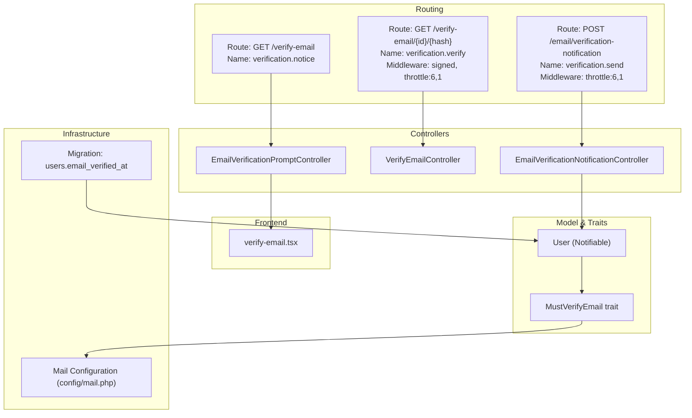

**Diagram sources**
- [auth.php:37-56](file://routes/auth.php#L37-L56)
- [EmailVerificationPromptController.php:16-21](file://app/Http/Controllers/Auth/EmailVerificationPromptController.php#L16-L21)
- [VerifyEmailController.php:15-29](file://app/Http/Controllers/Auth/VerifyEmailController.php#L15-L29)
- [EmailVerificationNotificationController.php:14-23](file://app/Http/Controllers/Auth/EmailVerificationNotificationController.php#L14-L23)
- [verify-email.tsx:10-41](file://resources/js/pages/auth/verify-email.tsx#L10-L41)
- [User.php:10-48](file://app/Models/User.php#L10-L48)
- [MustVerifyEmail.php:7-62](file://vendor/laravel/framework/src/Illuminate/Auth/MustVerifyEmail.php#L7-L62)
- [mail.php:17-116](file://config/mail.php#L17-L116)
- [0001_01_01_000000_create_users_table.php:14-22](file://database/migrations/0001_01_01_000000_create_users_table.php#L14-L22)

**Section sources**
- [auth.php:37-56](file://routes/auth.php#L37-L56)
- [EmailVerificationPromptController.php:16-21](file://app/Http/Controllers/Auth/EmailVerificationPromptController.php#L16-L21)
- [VerifyEmailController.php:15-29](file://app/Http/Controllers/Auth/VerifyEmailController.php#L15-L29)
- [EmailVerificationNotificationController.php:14-23](file://app/Http/Controllers/Auth/EmailVerificationNotificationController.php#L14-L23)
- [verify-email.tsx:10-41](file://resources/js/pages/auth/verify-email.tsx#L10-L41)
- [User.php:10-48](file://app/Models/User.php#L10-L48)
- [mail.php:17-116](file://config/mail.php#L17-L116)
- [0001_01_01_000000_create_users_table.php:14-22](file://database/migrations/0001_01_01_000000_create_users_table.php#L14-L22)

## Core Components
- EmailVerificationPromptController: Renders the verification prompt page or redirects if already verified.
- VerifyEmailController: Validates the signed verification link and marks the email as verified, emitting a Verified event.
- EmailVerificationNotificationController: Resends the verification email via the user’s notification channel.
- Frontend verify-email.tsx: Presents the prompt, displays a success message after resending, and provides a resend action.
- User model: Integrates with the MustVerifyEmail trait for verification state and notification dispatch.
- Routing: Defines endpoints for the prompt, verification, and resend actions with appropriate middleware.

**Section sources**
- [EmailVerificationPromptController.php:16-21](file://app/Http/Controllers/Auth/EmailVerificationPromptController.php#L16-L21)
- [VerifyEmailController.php:15-29](file://app/Http/Controllers/Auth/VerifyEmailController.php#L15-L29)
- [EmailVerificationNotificationController.php:14-23](file://app/Http/Controllers/Auth/EmailVerificationNotificationController.php#L14-L23)
- [verify-email.tsx:10-41](file://resources/js/pages/auth/verify-email.tsx#L10-L41)
- [User.php:10-48](file://app/Models/User.php#L10-L48)
- [auth.php:37-56](file://routes/auth.php#L37-L56)

## Architecture Overview
The system combines server-side route handling, controller logic, and client-side rendering. Signed URLs secure the verification link, while throttling limits resend attempts. Notifications are dispatched through the configured mail driver.

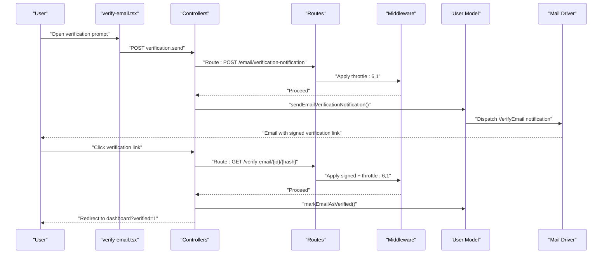

**Diagram sources**
- [auth.php:37-56](file://routes/auth.php#L37-L56)
- [EmailVerificationNotificationController.php:14-23](file://app/Http/Controllers/Auth/EmailVerificationNotificationController.php#L14-L23)
- [VerifyEmailController.php:15-29](file://app/Http/Controllers/Auth/VerifyEmailController.php#L15-L29)
- [verify-email.tsx:10-41](file://resources/js/pages/auth/verify-email.tsx#L10-L41)
- [MustVerifyEmail.php:48-51](file://vendor/laravel/framework/src/Illuminate/Auth/MustVerifyEmail.php#L48-L51)
- [mail.php:17-116](file://config/mail.php#L17-L116)

## Detailed Component Analysis

### Controllers

#### EmailVerificationPromptController
- Purpose: Show the verification prompt or redirect if already verified.
- Behavior: Checks user verification status and renders the frontend page with optional status from session.

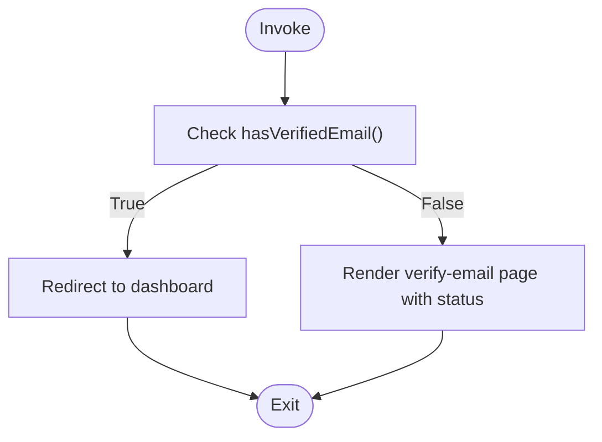

**Diagram sources**
- [EmailVerificationPromptController.php:16-21](file://app/Http/Controllers/Auth/EmailVerificationPromptController.php#L16-L21)

**Section sources**
- [EmailVerificationPromptController.php:16-21](file://app/Http/Controllers/Auth/EmailVerificationPromptController.php#L16-L21)

#### VerifyEmailController
- Purpose: Validate the signed verification link and mark the email as verified.
- Behavior: Skips if already verified, otherwise marks verified and fires the Verified event, then redirects to the dashboard with a verified flag.

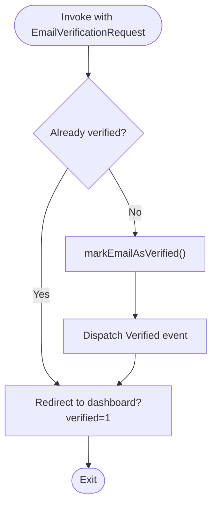

**Diagram sources**
- [VerifyEmailController.php:15-29](file://app/Http/Controllers/Auth/VerifyEmailController.php#L15-L29)
- [MustVerifyEmail.php:24-28](file://vendor/laravel/framework/src/Illuminate/Auth/MustVerifyEmail.php#L24-L28)

**Section sources**
- [VerifyEmailController.php:15-29](file://app/Http/Controllers/Auth/VerifyEmailController.php#L15-L29)
- [MustVerifyEmail.php:24-28](file://vendor/laravel/framework/src/Illuminate/Auth/MustVerifyEmail.php#L24-L28)

#### EmailVerificationNotificationController
- Purpose: Resend the verification email.
- Behavior: If not verified, sends the notification and returns to the previous page with a status message.

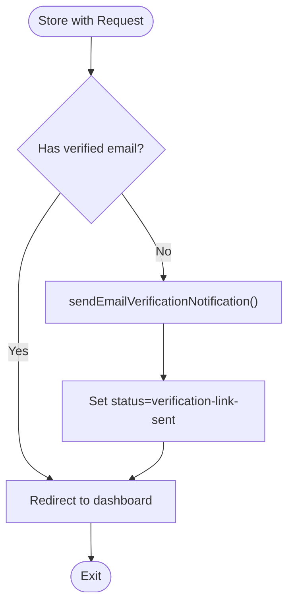

**Diagram sources**
- [EmailVerificationNotificationController.php:14-23](file://app/Http/Controllers/Auth/EmailVerificationNotificationController.php#L14-L23)
- [MustVerifyEmail.php:48-51](file://vendor/laravel/framework/src/Illuminate/Auth/MustVerifyEmail.php#L48-L51)

**Section sources**
- [EmailVerificationNotificationController.php:14-23](file://app/Http/Controllers/Auth/EmailVerificationNotificationController.php#L14-L23)
- [MustVerifyEmail.php:48-51](file://vendor/laravel/framework/src/Illuminate/Auth/MustVerifyEmail.php#L48-L51)

### Frontend Prompt Component
- Purpose: Display verification instructions and provide a resend action.
- Behavior: Shows a success message after resending, disables the resend button during processing, and offers logout.

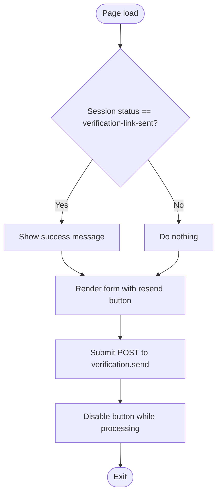

**Diagram sources**
- [verify-email.tsx:10-41](file://resources/js/pages/auth/verify-email.tsx#L10-L41)

**Section sources**
- [verify-email.tsx:10-41](file://resources/js/pages/auth/verify-email.tsx#L10-L41)

### Routing and Throttling
- verification.notice: GET /verify-email
- verification.verify: GET /verify-email/{id}/{hash} with signed and throttle:6,1 middleware
- verification.send: POST /email/verification-notification with throttle:6,1 middleware

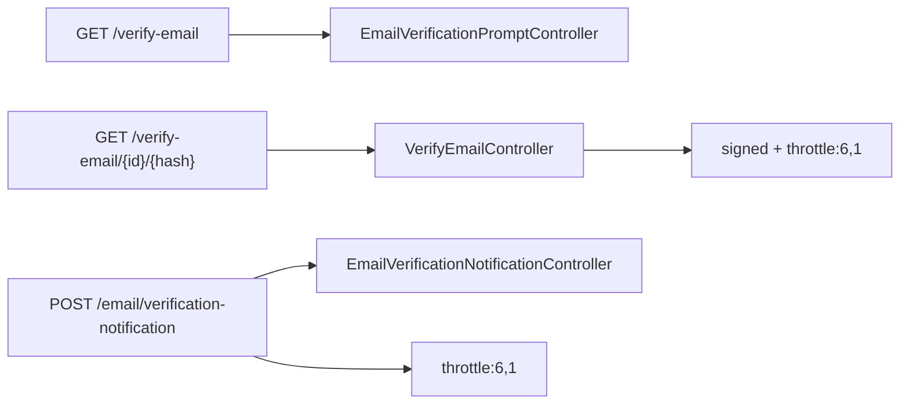

**Diagram sources**
- [auth.php:37-56](file://routes/auth.php#L37-L56)

**Section sources**
- [auth.php:37-56](file://routes/auth.php#L37-L56)

### Token Validation and Link Generation
- Signed URL: The verification link is generated as a temporary signed route with a user ID and email hash.
- Hash validation: The route enforces signed and throttle middleware; invalid hashes prevent verification.
- Expiration: Temporary signed routes include an expiration window (e.g., 60 minutes in tests).

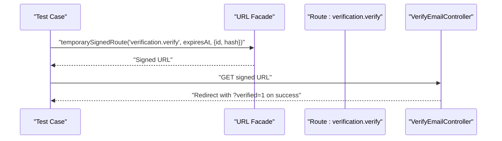

**Diagram sources**
- [EmailVerificationTest.php:31-42](file://tests/Feature/Auth/EmailVerificationTest.php#L31-L42)

**Section sources**
- [EmailVerificationTest.php:31-42](file://tests/Feature/Auth/EmailVerificationTest.php#L31-L42)
- [auth.php:41-47](file://routes/auth.php#L41-L47)

### Email Sending Mechanism
- Dispatch: The MustVerifyEmail trait’s sendEmailVerificationNotification method notifies the user.
- Transport: Mail configuration supports multiple drivers (SMTP, SES, Postmark, Resend, log, etc.).
- Sender identity: Global From address and name are configurable.

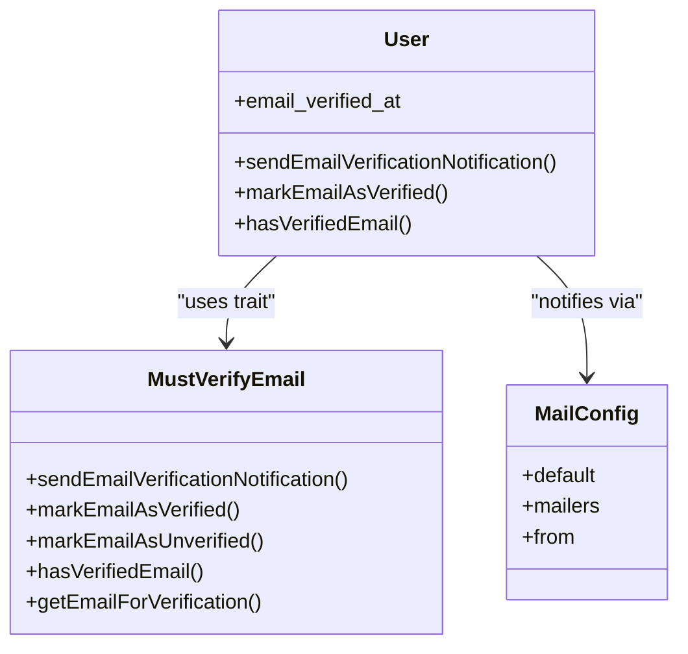

**Diagram sources**
- [MustVerifyEmail.php:7-62](file://vendor/laravel/framework/src/Illuminate/Auth/MustVerifyEmail.php#L7-L62)
- [mail.php:17-116](file://config/mail.php#L17-L116)

**Section sources**
- [MustVerifyEmail.php:48-51](file://vendor/laravel/framework/src/Illuminate/Auth/MustVerifyEmail.php#L48-L51)
- [mail.php:17-116](file://config/mail.php#L17-L116)

### Verification Status Handling
- State: The users table includes email_verified_at to track verification.
- Middleware: EnsureEmailIsVerified checks the user’s MustVerifyEmail status and redirects unverified users to the notice route.
- Frontend: The prompt page conditionally renders based on session status and user verification state.

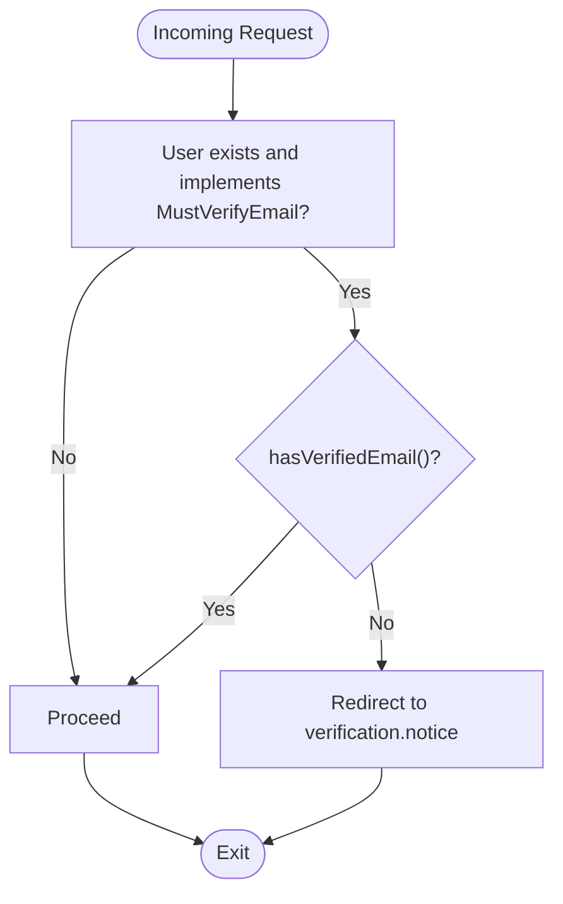

**Diagram sources**
- [EnsureEmailIsVerified.php:31-42](file://vendor/laravel/framework/src/Illuminate/Auth/Middleware/EnsureEmailIsVerified.php#L31-L42)
- [0001_01_01_000000_create_users_table.php:14-22](file://database/migrations/0001_01_01_000000_create_users_table.php#L14-L22)

**Section sources**
- [EnsureEmailIsVerified.php:31-42](file://vendor/laravel/framework/src/Illuminate/Auth/Middleware/EnsureEmailIsVerified.php#L31-L42)
- [0001_01_01_000000_create_users_table.php:14-22](file://database/migrations/0001_01_01_000000_create_users_table.php#L14-L22)

## Dependency Analysis
- Controllers depend on the User model’s MustVerifyEmail trait for verification state and notification dispatch.
- Routes apply middleware to protect verification endpoints and limit resend attempts.
- The frontend depends on route names for form submission and status messaging.
- Tests validate the end-to-end flow and error conditions.

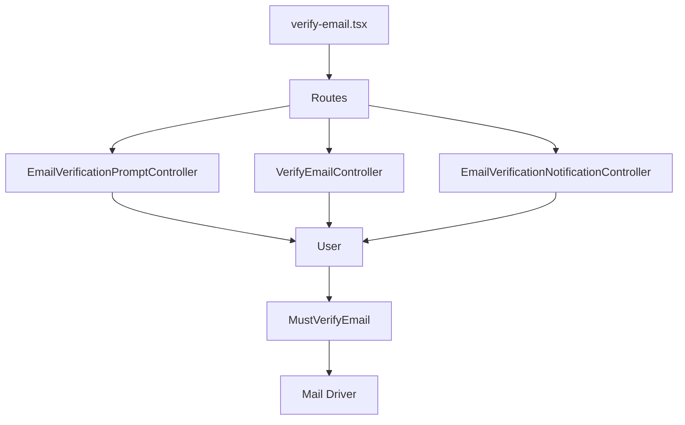

**Diagram sources**
- [EmailVerificationPromptController.php:16-21](file://app/Http/Controllers/Auth/EmailVerificationPromptController.php#L16-L21)
- [VerifyEmailController.php:15-29](file://app/Http/Controllers/Auth/VerifyEmailController.php#L15-L29)
- [EmailVerificationNotificationController.php:14-23](file://app/Http/Controllers/Auth/EmailVerificationNotificationController.php#L14-L23)
- [User.php:10-48](file://app/Models/User.php#L10-L48)
- [MustVerifyEmail.php:7-62](file://vendor/laravel/framework/src/Illuminate/Auth/MustVerifyEmail.php#L7-L62)
- [auth.php:37-56](file://routes/auth.php#L37-L56)
- [verify-email.tsx:10-41](file://resources/js/pages/auth/verify-email.tsx#L10-L41)

**Section sources**
- [EmailVerificationPromptController.php:16-21](file://app/Http/Controllers/Auth/EmailVerificationPromptController.php#L16-L21)
- [VerifyEmailController.php:15-29](file://app/Http/Controllers/Auth/VerifyEmailController.php#L15-L29)
- [EmailVerificationNotificationController.php:14-23](file://app/Http/Controllers/Auth/EmailVerificationNotificationController.php#L14-L23)
- [User.php:10-48](file://app/Models/User.php#L10-L48)
- [auth.php:37-56](file://routes/auth.php#L37-L56)

## Performance Considerations
- Throttling: Both verification and resend endpoints use throttle middleware to limit requests per minute, reducing abuse and resource consumption.
- Signed URLs: Signed routes ensure integrity and prevent tampering, eliminating expensive per-request validation logic.
- Notification delivery: Choose a reliable mail driver and monitor delivery failures; consider queuing notifications for scalability.

[No sources needed since this section provides general guidance]

## Troubleshooting Guide
- Resend not working:
  - Ensure the user is not already verified; controllers short-circuit if verified.
  - Verify throttle limits are not exceeded.
  - Confirm mail configuration is set and notifications are being dispatched.
- Verification link fails:
  - Check that the signed URL includes a valid user ID and correct email hash.
  - Ensure the link is requested within the expiration window.
  - Confirm the route applies signed and throttle middleware.
- Frontend message not shown:
  - Verify the resend action sets the expected status in the session.
  - Confirm the page reads the status prop and renders the success message.

**Section sources**
- [EmailVerificationNotificationController.php:14-23](file://app/Http/Controllers/Auth/EmailVerificationNotificationController.php#L14-L23)
- [EmailVerificationTest.php:31-42](file://tests/Feature/Auth/EmailVerificationTest.php#L31-L42)
- [verify-email.tsx:23-27](file://resources/js/pages/auth/verify-email.tsx#L23-L27)

## Conclusion
The email verification system leverages Laravel’s built-in traits and middleware to provide a secure, throttled, and user-friendly flow. Controllers encapsulate the prompt, verification, and resend logic, while the frontend presents clear instructions and feedback. Proper configuration of mail drivers and route middleware ensures reliable delivery and protection against misuse.