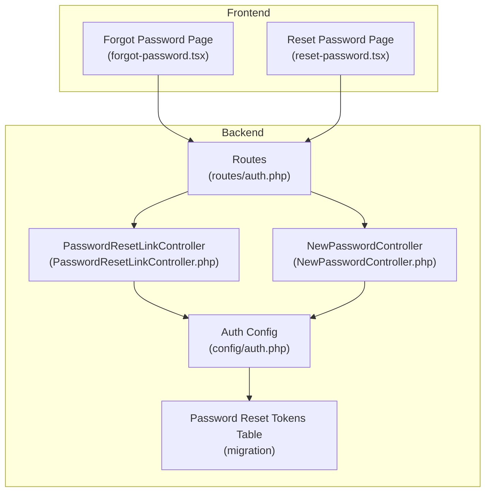
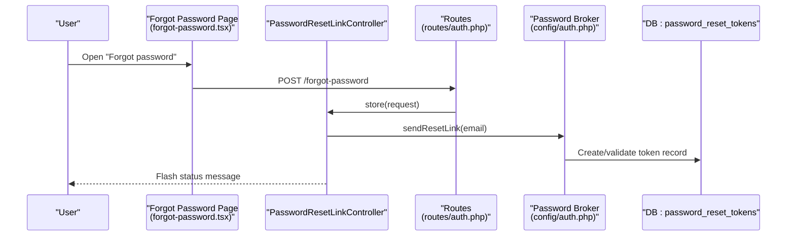
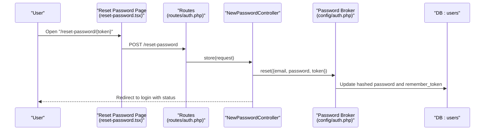
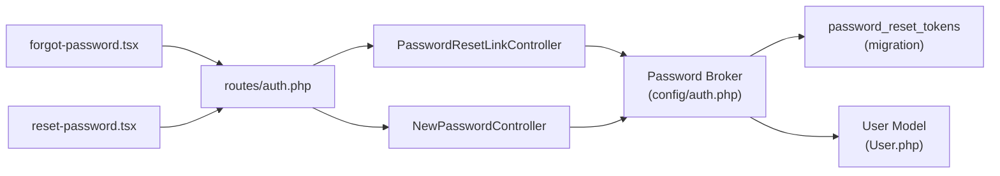

# Password Reset

<cite>
**Referenced Files in This Document**
- [PasswordResetLinkController.php](file://app/Http/Controllers/Auth/PasswordResetLinkController.php)
- [NewPasswordController.php](file://app/Http/Controllers/Auth/NewPasswordController.php)
- [routes/auth.php](file://routes/auth.php)
- [forgot-password.tsx](file://resources/js/pages/auth/forgot-password.tsx)
- [reset-password.tsx](file://resources/js/pages/auth/reset-password.tsx)
- [auth.php](file://config/auth.php)
- [create_users_table.php](file://database/migrations/0001_01_01_000000_create_users_table.php)
- [PasswordResetTest.php](file://tests/Feature/Auth/PasswordResetTest.php)
- [User.php](file://app/Models/User.php)
</cite>

## Table of Contents
1. [Introduction](#introduction)
2. [Project Structure](#project-structure)
3. [Core Components](#core-components)
4. [Architecture Overview](#architecture-overview)
5. [Detailed Component Analysis](#detailed-component-analysis)
6. [Dependency Analysis](#dependency-analysis)
7. [Performance Considerations](#performance-considerations)
8. [Troubleshooting Guide](#troubleshooting-guide)
9. [Conclusion](#conclusion)

## Introduction
This document explains the password reset functionality end-to-end. It covers the forgot password form, reset password form, controllers, token validation, password update process, token expiration handling, and security measures such as token security, rate limiting, and password policy enforcement. It also documents the underlying Laravel mechanisms and frontend components that implement the workflow.

## Project Structure
The password reset feature spans backend controllers, routes, frontend pages, configuration, and database schema:
- Backend controllers handle requests and delegate to Laravel's password broker.
- Routes define the endpoints for requesting reset links and submitting new passwords.
- Frontend pages render the forms and submit data via Inertia.js.
- Configuration governs token storage, expiration, and throttling.
- Database migrations define the password reset token table.

**Diagram sources**
- [routes/auth.php:13-35](file://routes/auth.php#L13-L35)
- [PasswordResetLinkController.php:12-41](file://app/Http/Controllers/Auth/PasswordResetLinkController.php#L12-L41)
- [NewPasswordController.php:17-69](file://app/Http/Controllers/Auth/NewPasswordController.php#L17-L69)
- [auth.php:93-100](file://config/auth.php#L93-L100)
- [create_users_table.php:24-28](file://database/migrations/0001_01_01_000000_create_users_table.php#L24-L28)

**Section sources**
- [routes/auth.php:13-35](file://routes/auth.php#L13-L35)
- [PasswordResetLinkController.php:12-41](file://app/Http/Controllers/Auth/PasswordResetLinkController.php#L12-L41)
- [NewPasswordController.php:17-69](file://app/Http/Controllers/Auth/NewPasswordController.php#L17-L69)
- [auth.php:93-100](file://config/auth.php#L93-L100)
- [create_users_table.php:24-28](file://database/migrations/0001_01_01_000000_create_users_table.php#L24-L28)

## Core Components
- PasswordResetLinkController: Renders the forgot password page and sends reset links using the password broker.
- NewPasswordController: Renders the reset password page and validates/updates passwords using the password broker.
- Frontend Forms: React pages for forgot and reset password with Inertia.js form submission.
- Routes: Named endpoints for guest users to request and submit password resets.
- Configuration: Token table, expiration, and throttling settings.
- Database: Password reset tokens table schema.

**Section sources**
- [PasswordResetLinkController.php:12-41](file://app/Http/Controllers/Auth/PasswordResetLinkController.php#L12-L41)
- [NewPasswordController.php:17-69](file://app/Http/Controllers/Auth/NewPasswordController.php#L17-L69)
- [forgot-password.tsx:13-63](file://resources/js/pages/auth/forgot-password.tsx#L13-L63)
- [reset-password.tsx:23-98](file://resources/js/pages/auth/reset-password.tsx#L23-L98)
- [routes/auth.php:24-34](file://routes/auth.php#L24-L34)
- [auth.php:93-100](file://config/auth.php#L93-L100)
- [create_users_table.php:24-28](file://database/migrations/0001_01_01_000000_create_users_table.php#L24-L28)

## Architecture Overview
The password reset workflow follows Laravel's built-in password broker. The frontend submits forms to named routes, controllers validate inputs, and the password broker manages tokens and updates user passwords.

**Diagram sources**
- [forgot-password.tsx:18-22](file://resources/js/pages/auth/forgot-password.tsx#L18-L22)
- [routes/auth.php:24-28](file://routes/auth.php#L24-L28)
- [PasswordResetLinkController.php:29-40](file://app/Http/Controllers/Auth/PasswordResetLinkController.php#L29-L40)
- [auth.php:93-100](file://config/auth.php#L93-L100)
- [create_users_table.php:24-28](file://database/migrations/0001_01_01_000000_create_users_table.php#L24-L28)

## Detailed Component Analysis

### Password Reset Link Controller
Responsibilities:
- Render the forgot password page and pass status messages.
- Validate the email and delegate to the password broker to send a reset link.
- Redirect back with a status message.

Processing logic:
- Validates email presence and format.
- Calls the password broker to send a reset link.
- Returns to the previous page with a success status.

Security considerations:
- Uses the password broker for token creation and delivery.
- No custom token generation logic here; relies on framework defaults.

**Section sources**
- [PasswordResetLinkController.php:17-22](file://app/Http/Controllers/Auth/PasswordResetLinkController.php#L17-L22)
- [PasswordResetLinkController.php:29-40](file://app/Http/Controllers/Auth/PasswordResetLinkController.php#L29-L40)

### New Password Controller
Responsibilities:
- Render the reset password page with pre-filled email and token.
- Validate token, email, and password according to Laravel defaults.
- Attempt to reset the password via the password broker.
- On success, redirect to login with a status message; otherwise, raise a validation error.

Processing logic:
- Validates required fields: token, email, password (including confirmation and policy).
- Uses the password broker to reset the password.
- On success, fires a PasswordReset event and updates the user record.
- Handles failure by mapping the broker status to a user-facing message.

**Diagram sources**
- [reset-password.tsx:31-36](file://resources/js/pages/auth/reset-password.tsx#L31-L36)
- [routes/auth.php:30-34](file://routes/auth.php#L30-L34)
- [NewPasswordController.php:35-68](file://app/Http/Controllers/Auth/NewPasswordController.php#L35-L68)
- [auth.php:93-100](file://config/auth.php#L93-L100)
- [User.php:45](file://app/Models/User.php#L45)

**Section sources**
- [NewPasswordController.php:22-28](file://app/Http/Controllers/Auth/NewPasswordController.php#L22-L28)
- [NewPasswordController.php:35-68](file://app/Http/Controllers/Auth/NewPasswordController.php#L35-L68)

### Forgot Password Form Component
Responsibilities:
- Capture the user's email.
- Submit to the password reset link endpoint.
- Display server-provided status messages and validation errors.

Behavior:
- Uses Inertia useForm to manage form state.
- Submits via POST to the named route for password link requests.
- Shows a green status message when a reset link would be sent.

**Section sources**
- [forgot-password.tsx:13-63](file://resources/js/pages/auth/forgot-password.tsx#L13-L63)

### Reset Password Form Component
Responsibilities:
- Accept email, token, and new password fields.
- Submit to the password reset store endpoint.
- Display validation errors for each field.

Behavior:
- Prefills email and token from route props.
- Submits via POST to the named route for password resets.
- Resets password confirmation field after submission.

**Section sources**
- [reset-password.tsx:23-98](file://resources/js/pages/auth/reset-password.tsx#L23-L98)

### Token Validation and Expiration
Mechanisms:
- Token table: email as primary key, token string, created_at timestamp.
- Token expiration: configured in auth config (minutes).
- Throttling: configured in auth config (seconds between resets per user).

Validation flow:
- The password broker checks the token against the token table and verifies expiration.
- If invalid or expired, the broker returns a status indicating failure.
- The controller maps this status to a validation error for the email field.

**Section sources**
- [create_users_table.php:24-28](file://database/migrations/0001_01_01_000000_create_users_table.php#L24-L28)
- [auth.php:93-100](file://config/auth.php#L93-L100)
- [NewPasswordController.php:65-67](file://app/Http/Controllers/Auth/NewPasswordController.php#L65-L67)

### Password Strength Validation
Policy enforcement:
- Password validation uses Laravel's default password rules (length, mixed case, number, special character).
- Confirmation is enforced automatically alongside password validation.

**Section sources**
- [NewPasswordController.php:40](file://app/Http/Controllers/Auth/NewPasswordController.php#L40)

### Secure Password Update Process
Steps:
- Validate token, email, and password.
- Use the password broker to reset the password.
- On success, hash the new password, regenerate the remember token, and persist.
- Fire a PasswordReset event.

**Section sources**
- [NewPasswordController.php:46-56](file://app/Http/Controllers/Auth/NewPasswordController.php#L46-L56)
- [User.php:45](file://app/Models/User.php#L45)

### Reset Email Generation
Mechanism:
- The password broker triggers a ResetPassword notification when sending a reset link.
- Tests assert that the notification is sent to the user.

**Section sources**
- [PasswordResetTest.php:22-31](file://tests/Feature/Auth/PasswordResetTest.php#L22-L31)

### Token Security
Measures:
- Token storage uses a dedicated table keyed by email.
- Password broker enforces token existence and expiration.
- Frontend receives tokens via signed URLs; the reset page is gated for guests.

**Section sources**
- [create_users_table.php:24-28](file://database/migrations/0001_01_01_000000_create_users_table.php#L24-L28)
- [routes/auth.php:30-34](file://routes/auth.php#L30-L34)
- [auth.php:93-100](file://config/auth.php#L93-L100)

### Rate Limiting
Scope:
- Password reset link requests are throttled globally by the password broker configuration.
- The reset password form itself does not apply additional throttling beyond the broker's built-in limits.

Note: The application includes a separate login rate limiter in the LoginRequest class, distinct from password reset throttling.

**Section sources**
- [auth.php:97-98](file://config/auth.php#L97-L98)
- [LoginRequest.php:60-76](file://app/Http/Requests/Auth/LoginRequest.php#L60-L76)

## Dependency Analysis
The following diagram shows how the frontend, routes, controllers, configuration, and database interact during password reset.

**Diagram sources**
- [routes/auth.php:24-34](file://routes/auth.php#L24-L34)
- [PasswordResetLinkController.php:35-37](file://app/Http/Controllers/Auth/PasswordResetLinkController.php#L35-L37)
- [NewPasswordController.php:46-52](file://app/Http/Controllers/Auth/NewPasswordController.php#L46-L52)
- [auth.php:93-100](file://config/auth.php#L93-L100)
- [create_users_table.php:24-28](file://database/migrations/0001_01_01_000000_create_users_table.php#L24-L28)
- [User.php:45](file://app/Models/User.php#L45)

**Section sources**
- [routes/auth.php:24-34](file://routes/auth.php#L24-L34)
- [PasswordResetLinkController.php:35-37](file://app/Http/Controllers/Auth/PasswordResetLinkController.php#L35-L37)
- [NewPasswordController.php:46-52](file://app/Http/Controllers/Auth/NewPasswordController.php#L46-L52)
- [auth.php:93-100](file://config/auth.php#L93-L100)
- [create_users_table.php:24-28](file://database/migrations/0001_01_01_000000_create_users_table.php#L24-L28)
- [User.php:45](file://app/Models/User.php#L45)

## Performance Considerations
- Token storage: Using a relational table for tokens is straightforward and scales with database capacity.
- Throttling: Configure appropriate expire and throttle values to balance usability and security.
- Frontend: Keep form submissions minimal and leverage Inertia's optimistic UI patterns where appropriate.

## Troubleshooting Guide
Common issues and resolutions:
- Reset link not received:
  - Verify the email exists and the notification is being sent.
  - Check that the password broker configuration points to the correct table and provider.
- Reset page shows validation error:
  - Ensure the token is present and not expired.
  - Confirm the email matches the token's associated email.
- Password reset fails:
  - Check that the password meets policy requirements.
  - Confirm the token is valid and within the configured expiration window.

**Section sources**
- [PasswordResetTest.php:22-31](file://tests/Feature/Auth/PasswordResetTest.php#L22-L31)
- [PasswordResetTest.php:50-72](file://tests/Feature/Auth/PasswordResetTest.php#L50-L72)
- [NewPasswordController.php:65-67](file://app/Http/Controllers/Auth/NewPasswordController.php#L65-L67)

## Conclusion
The password reset feature leverages Laravel's built-in password broker for secure token management, expiration, and throttling. The frontend components provide a clean user experience, while controllers enforce validation and coordinate with the broker to update passwords. Configuration governs token storage, lifetime, and rate limits, ensuring a robust and secure workflow.