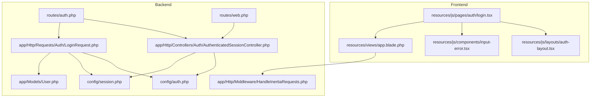
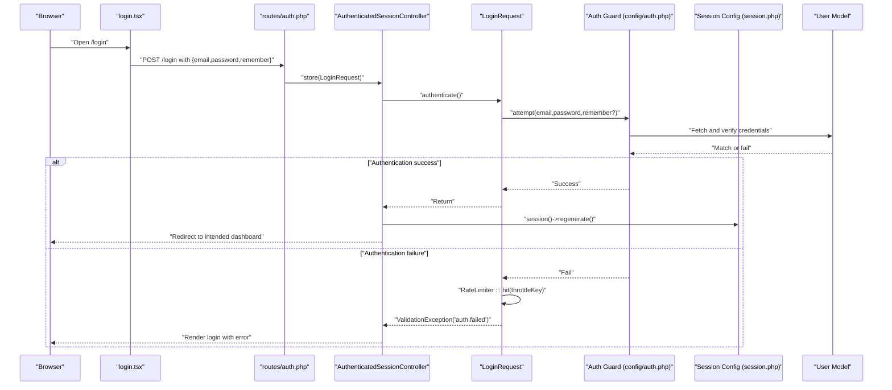
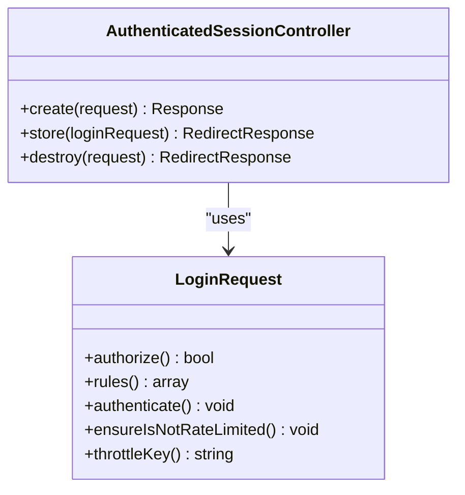
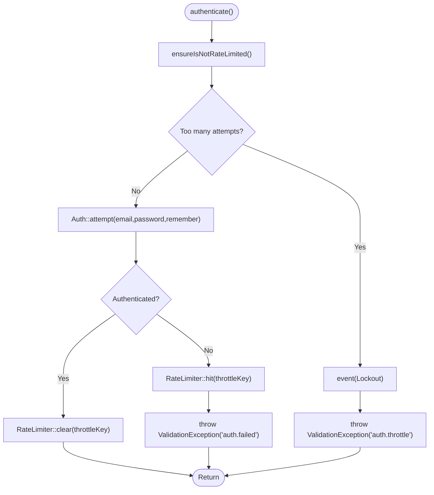
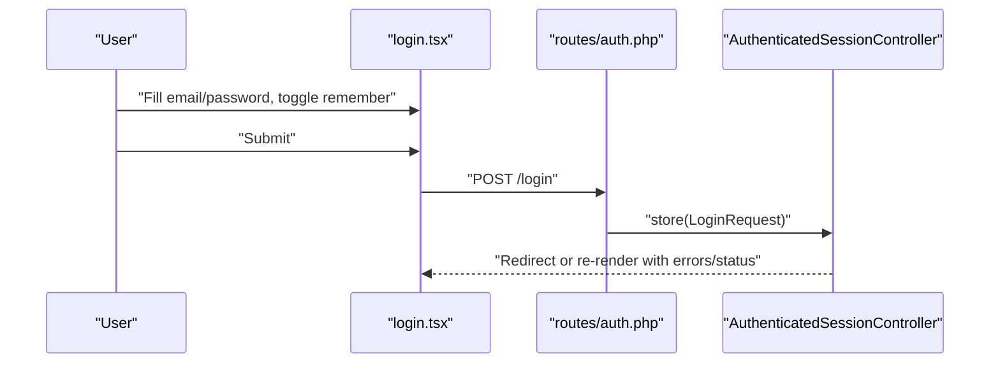
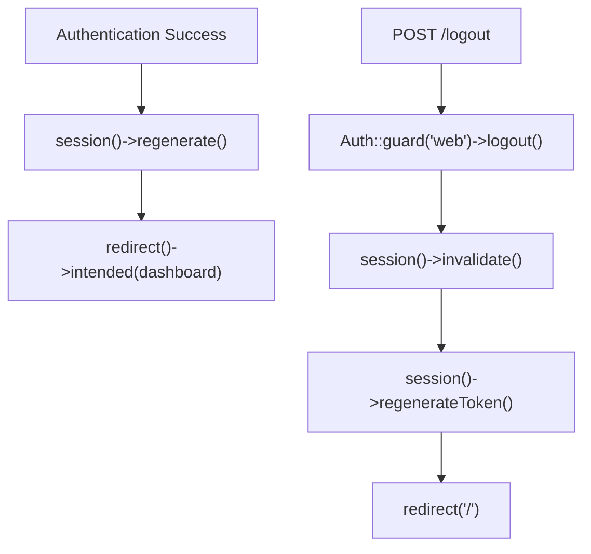
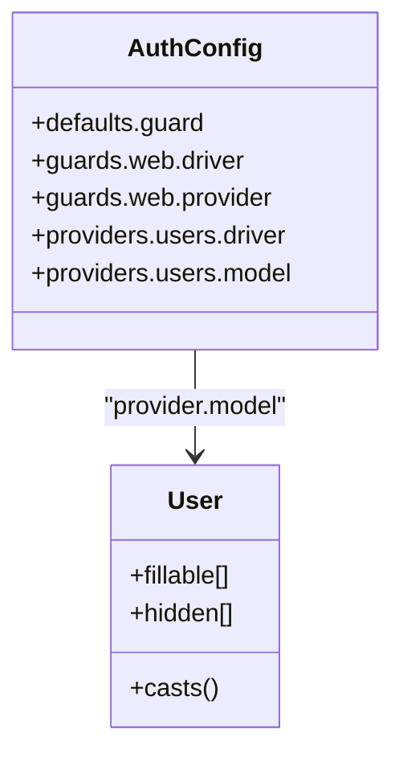
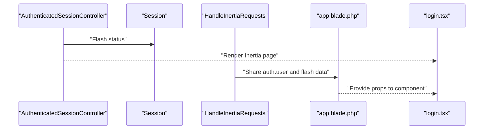
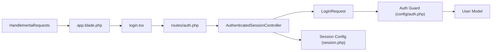

# User Login

<cite>
**Referenced Files in This Document**
- [AuthenticatedSessionController.php](file://app/Http/Controllers/Auth/AuthenticatedSessionController.php)
- [LoginRequest.php](file://app/Http/Requests/Auth/LoginRequest.php)
- [login.tsx](file://resources/js/pages/auth/login.tsx)
- [auth.php](file://routes/auth.php)
- [auth.php](file://config/auth.php)
- [session.php](file://config/session.php)
- [HandleInertiaRequests.php](file://app/Http/Middleware/HandleInertiaRequests.php)
- [User.php](file://app/Models/User.php)
- [web.php](file://routes/web.php)
- [app.blade.php](file://resources/views/app.blade.php)
</cite>

## Table of Contents
1. [Introduction](#introduction)
2. [Project Structure](#project-structure)
3. [Core Components](#core-components)
4. [Architecture Overview](#architecture-overview)
5. [Detailed Component Analysis](#detailed-component-analysis)
6. [Dependency Analysis](#dependency-analysis)
7. [Performance Considerations](#performance-considerations)
8. [Troubleshooting Guide](#troubleshooting-guide)
9. [Conclusion](#conclusion)

## Introduction
This document explains the user login system, covering the authentication controller, request validation, session management, credential verification, the login form component, input handling, error responses, redirect logic, authentication guard usage, session regeneration, and intended route redirection. It also documents login failure handling, account lockout prevention, and security measures against brute force attacks.

## Project Structure
The login system spans backend PHP controllers and requests, frontend React components, routing, configuration, and middleware. The Inertia stack renders the login page and handles form submission.

**Diagram sources**
- [login.tsx:1-106](file://resources/js/pages/auth/login.tsx#L1-L106)
- [auth.php:1-57](file://routes/auth.php#L1-L57)
- [web.php:1-100](file://routes/web.php#L1-L100)
- [AuthenticatedSessionController.php:1-52](file://app/Http/Controllers/Auth/AuthenticatedSessionController.php#L1-L52)
- [LoginRequest.php:1-86](file://app/Http/Requests/Auth/LoginRequest.php#L1-L86)
- [auth.php:1-116](file://config/auth.php#L1-L116)
- [session.php:1-218](file://config/session.php#L1-L218)
- [HandleInertiaRequests.php:1-55](file://app/Http/Middleware/HandleInertiaRequests.php#L1-L55)
- [User.php:1-49](file://app/Models/User.php#L1-L49)
- [app.blade.php:1-21](file://resources/views/app.blade.php#L1-L21)

**Section sources**
- [auth.php:1-57](file://routes/auth.php#L1-L57)
- [web.php:1-100](file://routes/web.php#L1-L100)
- [AuthenticatedSessionController.php:1-52](file://app/Http/Controllers/Auth/AuthenticatedSessionController.php#L1-L52)
- [LoginRequest.php:1-86](file://app/Http/Requests/Auth/LoginRequest.php#L1-L86)
- [auth.php:1-116](file://config/auth.php#L1-L116)
- [session.php:1-218](file://config/session.php#L1-L218)
- [HandleInertiaRequests.php:1-55](file://app/Http/Middleware/HandleInertiaRequests.php#L1-L55)
- [User.php:1-49](file://app/Models/User.php#L1-L49)
- [app.blade.php:1-21](file://resources/views/app.blade.php#L1-L21)

## Core Components
- Authentication Controller: Handles rendering the login page, processing login submissions, and logout.
- Login Request Validator: Validates input, enforces rate limits, attempts authentication, and manages lockout events.
- Login Form Component: Provides the UI for email, password, remember-me, and submission.
- Routes: Define guest-only login endpoints and authenticated routes.
- Configuration: Authentication guard, provider, session lifetime, and cookie policies.
- Middleware: Shares authenticated user and flash messages to the frontend.
- Model: Eloquent user model with hashed passwords and hidden fields.

**Section sources**
- [AuthenticatedSessionController.php:14-51](file://app/Http/Controllers/Auth/AuthenticatedSessionController.php#L14-L51)
- [LoginRequest.php:12-85](file://app/Http/Requests/Auth/LoginRequest.php#L12-L85)
- [login.tsx:25-105](file://resources/js/pages/auth/login.tsx#L25-L105)
- [auth.php:13-35](file://routes/auth.php#L13-L35)
- [auth.php:38-43](file://config/auth.php#L38-L43)
- [session.php:21-37](file://config/session.php#L21-L37)
- [HandleInertiaRequests.php:37-52](file://app/Http/Middleware/HandleInertiaRequests.php#L37-L52)
- [User.php:10-48](file://app/Models/User.php#L10-L48)

## Architecture Overview
The login flow integrates frontend and backend components. The frontend submits credentials to the backend, which validates them, enforces rate limits, authenticates the user, regenerates the session, and redirects to the intended destination.

**Diagram sources**
- [login.tsx:26-37](file://resources/js/pages/auth/login.tsx#L26-L37)
- [auth.php:19-22](file://routes/auth.php#L19-L22)
- [AuthenticatedSessionController.php:30-37](file://app/Http/Controllers/Auth/AuthenticatedSessionController.php#L30-L37)
- [LoginRequest.php:40-53](file://app/Http/Requests/Auth/LoginRequest.php#L40-L53)
- [auth.php:38-43](file://config/auth.php#L38-L43)
- [session.php:35-37](file://config/session.php#L35-L37)
- [User.php:10-48](file://app/Models/User.php#L10-L48)

## Detailed Component Analysis

### Authentication Controller
Responsibilities:
- Render the login page with optional password reset link and status messages.
- Authenticate credentials via the validated request object.
- Regenerate the session to prevent session fixation.
- Redirect to the intended destination after login.
- Logout: clear guard state, invalidate session, regenerate CSRF token, and redirect home.

Key behaviors:
- Uses Inertia to render the login page and pass shared props.
- Delegates credential verification and rate limiting to the LoginRequest.
- Uses intended redirect to send users to their originally requested page.

**Diagram sources**
- [AuthenticatedSessionController.php:14-51](file://app/Http/Controllers/Auth/AuthenticatedSessionController.php#L14-L51)
- [LoginRequest.php:12-85](file://app/Http/Requests/Auth/LoginRequest.php#L12-L85)

**Section sources**
- [AuthenticatedSessionController.php:19-37](file://app/Http/Controllers/Auth/AuthenticatedSessionController.php#L19-L37)
- [AuthenticatedSessionController.php:42-50](file://app/Http/Controllers/Auth/AuthenticatedSessionController.php#L42-L50)

### Login Request Validation and Brute Force Protection
Responsibilities:
- Validation rules for email and password.
- Rate limiting enforcement with a composite throttle key (normalized email + IP).
- Authentication attempt with "remember me" support.
- Failure handling: increment attempts, emit lockout event, and throw a localized throttle message.
- Success handling: clear rate limiter for the key.

Security measures:
- Throttling threshold configured in the validator method.
- Composite key ensures per-user/IP limiting.
- Lockout event emitted when throttled.

**Diagram sources**
- [LoginRequest.php:40-76](file://app/Http/Requests/Auth/LoginRequest.php#L40-L76)
- [LoginRequest.php:81-84](file://app/Http/Requests/Auth/LoginRequest.php#L81-L84)

**Section sources**
- [LoginRequest.php:27-33](file://app/Http/Requests/Auth/LoginRequest.php#L27-L33)
- [LoginRequest.php:40-53](file://app/Http/Requests/Auth/LoginRequest.php#L40-L53)
- [LoginRequest.php:60-76](file://app/Http/Requests/Auth/LoginRequest.php#L60-L76)
- [LoginRequest.php:81-84](file://app/Http/Requests/Auth/LoginRequest.php#L81-L84)

### Login Form Component and Input Handling
Responsibilities:
- Define typed form state for email, password, and remember.
- Submit handler posts to the login endpoint and resets password field on finish.
- Display validation errors for email/password.
- Conditionally show forgot-password link when supported.
- Render status messages passed from the backend.

UI/UX:
- Auto-focus on email input.
- Loading indicator during submission.
- Remember-me checkbox.
- Responsive layout with links to registration and password reset.

**Diagram sources**
- [login.tsx:26-37](file://resources/js/pages/auth/login.tsx#L26-L37)
- [auth.php:19-22](file://routes/auth.php#L19-L22)
- [AuthenticatedSessionController.php:30-37](file://app/Http/Controllers/Auth/AuthenticatedSessionController.php#L30-L37)

**Section sources**
- [login.tsx:25-105](file://resources/js/pages/auth/login.tsx#L25-L105)

### Session Management and Intended Redirect
Responsibilities:
- After successful authentication, regenerate the session to prevent fixation.
- Redirect to the intended route using the dashboard route name.
- On logout, clear guard state, invalidate session, and regenerate CSRF token.

Configuration impact:
- Session lifetime and cookie policy are defined centrally.
- Intended redirect relies on the application’s route naming and auth middleware.

**Diagram sources**
- [AuthenticatedSessionController.php:34-36](file://app/Http/Controllers/Auth/AuthenticatedSessionController.php#L34-L36)
- [AuthenticatedSessionController.php:44-49](file://app/Http/Controllers/Auth/AuthenticatedSessionController.php#L44-L49)
- [web.php:21-23](file://routes/web.php#L21-L23)
- [session.php:35-37](file://config/session.php#L35-L37)

**Section sources**
- [AuthenticatedSessionController.php:34-36](file://app/Http/Controllers/Auth/AuthenticatedSessionController.php#L34-L36)
- [AuthenticatedSessionController.php:44-49](file://app/Http/Controllers/Auth/AuthenticatedSessionController.php#L44-L49)
- [web.php:21-23](file://routes/web.php#L21-L23)
- [session.php:35-37](file://config/session.php#L35-L37)

### Authentication Guard Usage
The system uses the default session guard with an Eloquent user provider. The guard is configured to use the users provider and the User model.

**Diagram sources**
- [auth.php:16-43](file://config/auth.php#L16-L43)
- [auth.php:62-66](file://config/auth.php#L62-L66)
- [User.php:10-48](file://app/Models/User.php#L10-L48)

**Section sources**
- [auth.php:16-43](file://config/auth.php#L16-L43)
- [auth.php:62-66](file://config/auth.php#L62-L66)
- [User.php:10-48](file://app/Models/User.php#L10-L48)

### Frontend Integration and Shared Data
The Inertia middleware shares the authenticated user and flash messages with the frontend, enabling the login page to display status messages and conditionally render password reset links.

**Diagram sources**
- [AuthenticatedSessionController.php:19-24](file://app/Http/Controllers/Auth/AuthenticatedSessionController.php#L19-L24)
- [HandleInertiaRequests.php:37-52](file://app/Http/Middleware/HandleInertiaRequests.php#L37-L52)
- [app.blade.php:12-18](file://resources/views/app.blade.php#L12-L18)

**Section sources**
- [AuthenticatedSessionController.php:19-24](file://app/Http/Controllers/Auth/AuthenticatedSessionController.php#L19-L24)
- [HandleInertiaRequests.php:37-52](file://app/Http/Middleware/HandleInertiaRequests.php#L37-L52)
- [app.blade.php:12-18](file://resources/views/app.blade.php#L12-L18)

## Dependency Analysis
The login system depends on:
- Routing: Guest-only login endpoints and authenticated routes.
- Controller: Orchestrates rendering, validation, authentication, session regeneration, and redirects.
- Request Validator: Enforces validation and rate limiting.
- Guard and Provider: Authenticate credentials against the User model.
- Session Configuration: Controls lifetime and cookie behavior.
- Middleware: Shares authenticated state and flash messages to the frontend.

**Diagram sources**
- [auth.php:13-35](file://routes/auth.php#L13-L35)
- [AuthenticatedSessionController.php:14-51](file://app/Http/Controllers/Auth/AuthenticatedSessionController.php#L14-L51)
- [LoginRequest.php:12-85](file://app/Http/Requests/Auth/LoginRequest.php#L12-L85)
- [auth.php:38-43](file://config/auth.php#L38-L43)
- [session.php:21-37](file://config/session.php#L21-L37)
- [HandleInertiaRequests.php:37-52](file://app/Http/Middleware/HandleInertiaRequests.php#L37-L52)
- [app.blade.php:12-18](file://resources/views/app.blade.php#L12-L18)
- [User.php:10-48](file://app/Models/User.php#L10-L48)

**Section sources**
- [auth.php:13-35](file://routes/auth.php#L13-L35)
- [AuthenticatedSessionController.php:14-51](file://app/Http/Controllers/Auth/AuthenticatedSessionController.php#L14-L51)
- [LoginRequest.php:12-85](file://app/Http/Requests/Auth/LoginRequest.php#L12-L85)
- [auth.php:38-43](file://config/auth.php#L38-L43)
- [session.php:21-37](file://config/session.php#L21-L37)
- [HandleInertiaRequests.php:37-52](file://app/Http/Middleware/HandleInertiaRequests.php#L37-L52)
- [app.blade.php:12-18](file://resources/views/app.blade.php#L12-L18)
- [User.php:10-48](file://app/Models/User.php#L10-L48)

## Performance Considerations
- Session lifetime: Configure the session lifetime to balance security and user experience.
- Rate limiter store: Ensure the cache/store backing the rate limiter is performant and shared across instances.
- Remember-me: Using the remember flag persists sessions longer; consider balancing convenience with risk.
- Frontend rendering: Inertia minimizes round-trips; keep payload small and leverage shared data via middleware.

[No sources needed since this section provides general guidance]

## Troubleshooting Guide
Common issues and remedies:
- Login fails with generic message: Ensure validation exceptions are properly surfaced and localized messages are available for authentication failures.
- Account locked out: When throttling triggers, the validator emits a lockout event and throws a throttle message with seconds/minutes remaining. Allow the lockout duration to pass before retrying.
- Redirect loops: Verify intended redirect logic and that the dashboard route exists and requires authentication.
- Session fixation concerns: Confirm session regeneration occurs after successful authentication.
- CSRF/token invalidation on logout: Ensure the logout flow invalidates the session and regenerates the CSRF token.

**Section sources**
- [LoginRequest.php:44-50](file://app/Http/Requests/Auth/LoginRequest.php#L44-L50)
- [LoginRequest.php:66-75](file://app/Http/Requests/Auth/LoginRequest.php#L66-L75)
- [AuthenticatedSessionController.php:34-36](file://app/Http/Controllers/Auth/AuthenticatedSessionController.php#L34-L36)
- [AuthenticatedSessionController.php:46-49](file://app/Http/Controllers/Auth/AuthenticatedSessionController.php#L46-L49)

## Conclusion
The login system combines a robust backend controller and request validator with a clean frontend form, leveraging Laravel’s authentication guard, rate limiting, and session management. The design emphasizes security through rate limiting, session regeneration, and lockout events, while delivering a smooth user experience via Inertia and shared data.