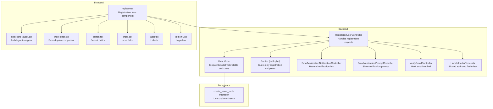
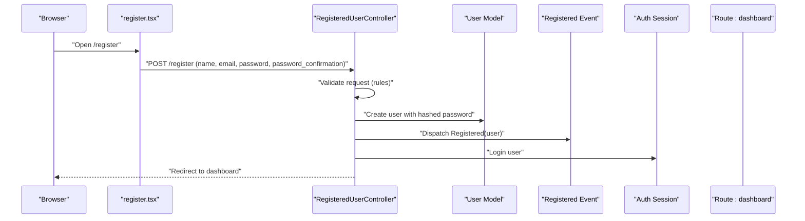
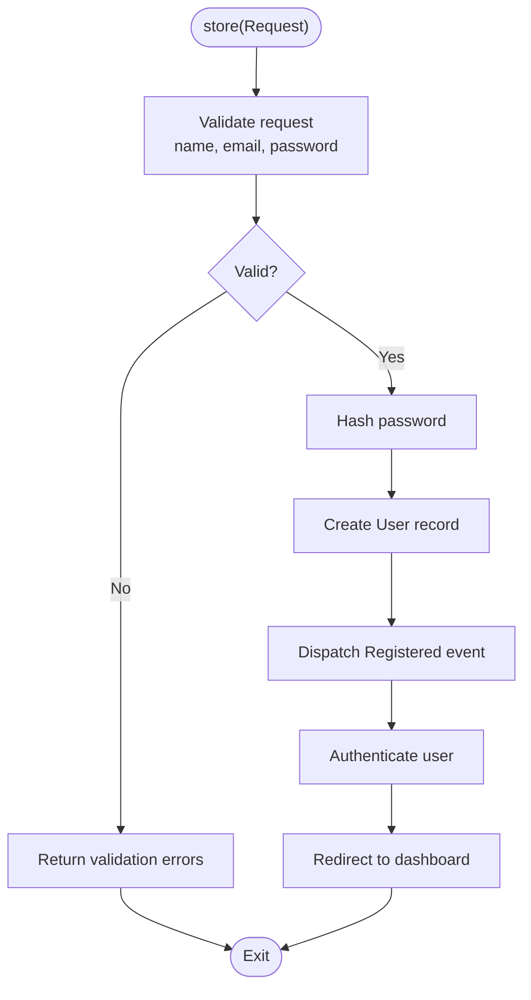
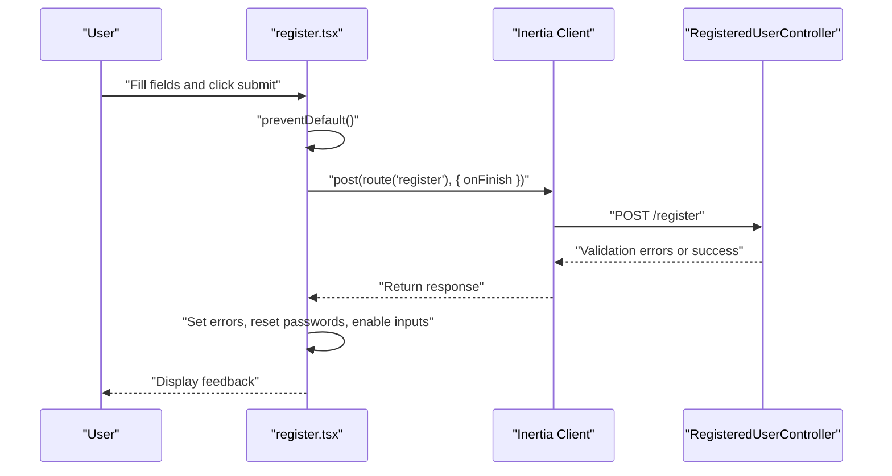
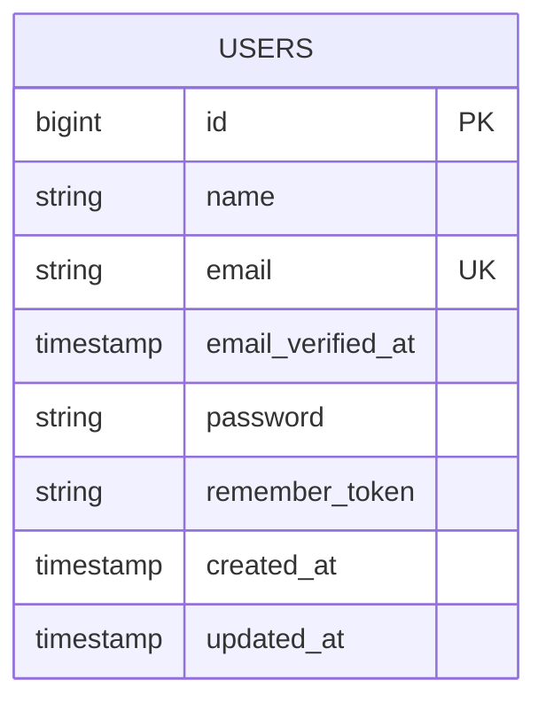
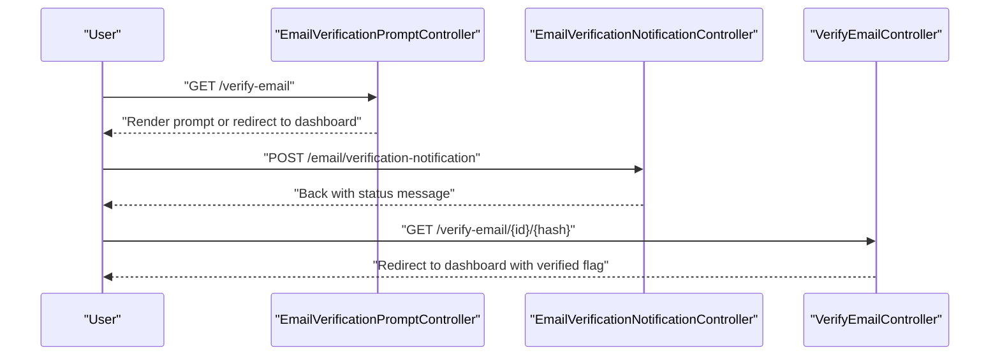
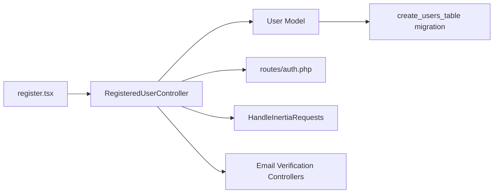

# User Registration

<cite>
**Referenced Files in This Document**
- [RegisteredUserController.php](file://app/Http/Controllers/Auth/RegisteredUserController.php)
- [register.tsx](file://resources/js/pages/auth/register.tsx)
- [User.php](file://app/Models/User.php)
- [0001_01_01_000000_create_users_table.php](file://database/migrations/0001_01_01_000000_create_users_table.php)
- [auth.php](file://routes/auth.php)
- [EmailVerificationNotificationController.php](file://app/Http/Controllers/Auth/EmailVerificationNotificationController.php)
- [EmailVerificationPromptController.php](file://app/Http/Controllers/Auth/EmailVerificationPromptController.php)
- [VerifyEmailController.php](file://app/Http/Controllers/Auth/VerifyEmailController.php)
- [HandleInertiaRequests.php](file://app/Http/Middleware/HandleInertiaRequests.php)
- [RegistrationTest.php](file://tests/Feature/Auth/RegistrationTest.php)
- [app.blade.php](file://resources/views/app.blade.php)
- [auth-card-layout.tsx](file://resources/js/layouts/auth/auth-card-layout.tsx)
- [input-error.tsx](file://resources/js/components/input-error.tsx)
- [button.tsx](file://resources/js/components/ui/button.tsx)
- [input.tsx](file://resources/js/components/ui/input.tsx)
- [label.tsx](file://resources/js/components/ui/label.tsx)
- [text-link.tsx](file://resources/js/components/text-link.tsx)
</cite>

## Table of Contents
1. [Introduction](#introduction)
2. [Project Structure](#project-structure)
3. [Core Components](#core-components)
4. [Architecture Overview](#architecture-overview)
5. [Detailed Component Analysis](#detailed-component-analysis)
6. [Dependency Analysis](#dependency-analysis)
7. [Performance Considerations](#performance-considerations)
8. [Security Considerations](#security-considerations)
9. [Troubleshooting Guide](#troubleshooting-guide)
10. [Conclusion](#conclusion)

## Introduction
This document explains the user registration system in the application. It covers the backend controller implementation, validation rules, user creation, and data sanitization. It also documents the frontend registration form component, input validation, error handling, and success feedback mechanisms. Examples demonstrate request handling, user data processing, and account activation workflows. Security considerations around password hashing and validation requirements are addressed.

## Project Structure
The registration system spans backend PHP controllers and models, frontend React components with Inertia, routing, and database schema. The key files involved are:

- Backend controller for registration and user model
- Frontend registration page component
- Routes for guest-authenticated flows
- Email verification controllers and middleware
- Inertia middleware for shared data
- Test coverage for registration flow

**Diagram sources**
- [RegisteredUserController.php:16-51](file://app/Http/Controllers/Auth/RegisteredUserController.php#L16-L51)
- [User.php:10-48](file://app/Models/User.php#L10-L48)
- [auth.php:13-35](file://routes/auth.php#L13-L35)
- [EmailVerificationNotificationController.php:9-24](file://app/Http/Controllers/Auth/EmailVerificationNotificationController.php#L9-L24)
- [EmailVerificationPromptController.php:11-22](file://app/Http/Controllers/Auth/EmailVerificationPromptController.php#L11-L22)
- [VerifyEmailController.php:10-30](file://app/Http/Controllers/Auth/VerifyEmailController.php#L10-L30)
- [HandleInertiaRequests.php:9-54](file://app/Http/Middleware/HandleInertiaRequests.php#L9-L54)
- [register.tsx:20-120](file://resources/js/pages/auth/register.tsx#L20-L120)
- [auth-card-layout.tsx](file://resources/js/layouts/auth/auth-card-layout.tsx)
- [input-error.tsx](file://resources/js/components/input-error.tsx)
- [button.tsx](file://resources/js/components/ui/button.tsx)
- [input.tsx](file://resources/js/components/ui/input.tsx)
- [label.tsx](file://resources/js/components/ui/label.tsx)
- [text-link.tsx](file://resources/js/components/text-link.tsx)
- [0001_01_01_000000_create_users_table.php:14-22](file://database/migrations/0001_01_01_000000_create_users_table.php#L14-L22)

**Section sources**
- [RegisteredUserController.php:16-51](file://app/Http/Controllers/Auth/RegisteredUserController.php#L16-L51)
- [register.tsx:20-120](file://resources/js/pages/auth/register.tsx#L20-L120)
- [auth.php:13-35](file://routes/auth.php#L13-L35)
- [User.php:10-48](file://app/Models/User.php#L10-L48)
- [0001_01_01_000000_create_users_table.php:14-22](file://database/migrations/0001_01_01_000000_create_users_table.php#L14-L22)
- [HandleInertiaRequests.php:37-52](file://app/Http/Middleware/HandleInertiaRequests.php#L37-L52)

## Core Components
- Backend Registration Controller
  - Renders the registration page and validates/store user data.
  - Emits a registered event and logs the user in automatically after successful registration.
  - Redirects to the dashboard route upon success.

- Frontend Registration Page
  - Uses Inertia's useForm hook to manage form state.
  - Submits to the backend registration endpoint.
  - Displays server-side validation errors via input-error components.
  - Provides success feedback and disables inputs during submission.

- User Model and Persistence
  - Defines fillable attributes and hidden fields.
  - Uses hashed password casting for secure storage.
  - Migration creates the users table with unique email and timestamps.

- Routing
  - Guest-only routes for registration and login.
  - Verification routes for email verification prompt and link resend.

- Inertia Middleware
  - Shares authentication state and flash messages with the frontend.

**Section sources**
- [RegisteredUserController.php:21-50](file://app/Http/Controllers/Auth/RegisteredUserController.php#L21-L50)
- [register.tsx:20-120](file://resources/js/pages/auth/register.tsx#L20-L120)
- [User.php:20-47](file://app/Models/User.php#L20-L47)
- [0001_01_01_000000_create_users_table.php:14-22](file://database/migrations/0001_01_01_000000_create_users_table.php#L14-L22)
- [auth.php:13-35](file://routes/auth.php#L13-L35)
- [HandleInertiaRequests.php:45-52](file://app/Http/Middleware/HandleInertiaRequests.php#L45-L52)

## Architecture Overview
The registration flow is a client-server interaction orchestrated by Inertia. The frontend renders the registration form, collects user input, and submits it to the backend. The backend validates the request, creates a user record, emits a registered event, authenticates the user, and redirects to the dashboard. Optional email verification can be triggered via dedicated controllers.

**Diagram sources**
- [RegisteredUserController.php:31-50](file://app/Http/Controllers/Auth/RegisteredUserController.php#L31-L50)
- [register.tsx:28-33](file://resources/js/pages/auth/register.tsx#L28-L33)
- [auth.php:13-35](file://routes/auth.php#L13-L35)

## Detailed Component Analysis

### Backend Registration Controller
Responsibilities:
- Render the registration page via Inertia.
- Validate incoming registration data with strict rules.
- Create a new user with a hashed password.
- Emit a registered event for downstream actions.
- Authenticate the newly registered user.
- Redirect to the dashboard.

Validation rules:
- Name: required, string, max length constraint.
- Email: required, string, lowercase, email format, unique across the User model.
- Password: required, confirmation match, and default password rules.

Data sanitization:
- Email is forced to lowercase before validation.
- Password is hashed using the framework's hash facade.
- Only fillable attributes are persisted.

Processing logic:
- On success, dispatch the Registered event.
- Authenticate the user immediately.
- Redirect to the dashboard route.

**Diagram sources**
- [RegisteredUserController.php:31-50](file://app/Http/Controllers/Auth/RegisteredUserController.php#L31-L50)

**Section sources**
- [RegisteredUserController.php:21-50](file://app/Http/Controllers/Auth/RegisteredUserController.php#L21-L50)

### Frontend Registration Form Component
Responsibilities:
- Manage form state using Inertia's useForm hook.
- Submit form data to the backend registration endpoint.
- Display validation errors returned from the server.
- Provide loading state and success feedback.
- Offer a link to the login page.

Key behaviors:
- Prevents default form submission and uses Inertia's post method.
- Resets password fields on finish to avoid stale values.
- Disables inputs during processing to prevent duplicate submissions.
- Uses input-error components to render field-specific errors.

**Diagram sources**
- [register.tsx:20-120](file://resources/js/pages/auth/register.tsx#L20-L120)
- [auth.php:13-35](file://routes/auth.php#L13-L35)

**Section sources**
- [register.tsx:20-120](file://resources/js/pages/auth/register.tsx#L20-L120)

### User Model and Persistence
Model characteristics:
- Fillable attributes include name, email, and password.
- Hidden attributes include password and remember token.
- Password is cast to hashed, ensuring secure storage semantics.

Database schema:
- Users table includes unique email, optional email verification timestamp, remember token, and timestamps.
- Sessions and password reset tokens tables are included for broader auth support.

**Diagram sources**
- [User.php:20-47](file://app/Models/User.php#L20-L47)
- [0001_01_01_000000_create_users_table.php:14-22](file://database/migrations/0001_01_01_000000_create_users_table.php#L14-L22)

**Section sources**
- [User.php:20-47](file://app/Models/User.php#L20-L47)
- [0001_01_01_000000_create_users_table.php:14-22](file://database/migrations/0001_01_01_000000_create_users_table.php#L14-L22)

### Email Verification Workflow
While the registration controller does not enforce email verification by default, the application provides controllers to prompt and handle verification:

- Prompt controller checks if the user has verified their email and either redirects to the dashboard or renders the verification prompt.
- Notification controller resends a verification link if the user has not verified their email.
- Verify controller marks the email as verified and fires a verified event.

**Diagram sources**
- [EmailVerificationPromptController.php:16-21](file://app/Http/Controllers/Auth/EmailVerificationPromptController.php#L16-L21)
- [EmailVerificationNotificationController.php:14-23](file://app/Http/Controllers/Auth/EmailVerificationNotificationController.php#L14-L23)
- [VerifyEmailController.php:15-29](file://app/Http/Controllers/Auth/VerifyEmailController.php#L15-L29)

**Section sources**
- [EmailVerificationPromptController.php:16-21](file://app/Http/Controllers/Auth/EmailVerificationPromptController.php#L16-L21)
- [EmailVerificationNotificationController.php:14-23](file://app/Http/Controllers/Auth/EmailVerificationNotificationController.php#L14-L23)
- [VerifyEmailController.php:15-29](file://app/Http/Controllers/Auth/VerifyEmailController.php#L15-L29)

## Dependency Analysis
The registration system exhibits clear separation of concerns:
- Frontend registers via Inertia to backend endpoints.
- Backend controller depends on the User model and Laravel's validation/hash facilities.
- Email verification is optional and handled by separate controllers.
- Inertia middleware shares authentication and flash data with the frontend.

**Diagram sources**
- [register.tsx:20-120](file://resources/js/pages/auth/register.tsx#L20-L120)
- [RegisteredUserController.php:31-50](file://app/Http/Controllers/Auth/RegisteredUserController.php#L31-L50)
- [User.php:10-48](file://app/Models/User.php#L10-L48)
- [auth.php:13-35](file://routes/auth.php#L13-L35)
- [HandleInertiaRequests.php:37-52](file://app/Http/Middleware/HandleInertiaRequests.php#L37-L52)
- [0001_01_01_000000_create_users_table.php:14-22](file://database/migrations/0001_01_01_000000_create_users_table.php#L14-L22)

**Section sources**
- [RegisteredUserController.php:31-50](file://app/Http/Controllers/Auth/RegisteredUserController.php#L31-L50)
- [register.tsx:20-120](file://resources/js/pages/auth/register.tsx#L20-L120)
- [User.php:10-48](file://app/Models/User.php#L10-L48)
- [auth.php:13-35](file://routes/auth.php#L13-L35)
- [HandleInertiaRequests.php:37-52](file://app/Http/Middleware/HandleInertiaRequests.php#L37-L52)

## Performance Considerations
- Validation occurs server-side with built-in rules; keep rules minimal and targeted to reduce overhead.
- Password hashing is handled by the framework; ensure appropriate server resources for concurrent registrations.
- Inertia rendering avoids full page reloads, reducing network overhead for form submissions.
- Email verification notifications should be rate-limited; the existing throttle middleware helps mitigate abuse.

## Security Considerations
- Password hashing: Passwords are hashed before persistence, ensuring secure storage.
- Validation rules: Strict validation for name, email uniqueness/format, and password confirmation.
- Email normalization: Email addresses are lowercased prior to validation to prevent duplicates due to case differences.
- Event-driven flow: The registered event allows for extensibility (e.g., sending welcome emails) without compromising core logic.
- Optional verification: Email verification controllers provide a mechanism to require verified emails before granting full access.

**Section sources**
- [RegisteredUserController.php:33-43](file://app/Http/Controllers/Auth/RegisteredUserController.php#L33-L43)
- [User.php:44-46](file://app/Models/User.php#L44-L46)

## Troubleshooting Guide
Common issues and remedies:
- Validation errors on submission:
  - Ensure frontend displays errors via input-error components.
  - Check that the backend validation rules match the submitted fields.
- Duplicate email errors:
  - The email must be unique; verify the user does not already exist.
- Redirect loops:
  - After registration, the user is redirected to the dashboard; confirm the route exists and authentication state is set.
- Email verification not received:
  - Use the verification notification controller to resend the link.
  - Confirm the user is authenticated and has not already verified their email.
- Frontend state not updating:
  - Ensure Inertia middleware shares authentication and flash data.
  - Verify the root view loads the Inertia app shell.

**Section sources**
- [register.tsx:54-103](file://resources/js/pages/auth/register.tsx#L54-L103)
- [EmailVerificationNotificationController.php:14-23](file://app/Http/Controllers/Auth/EmailVerificationNotificationController.php#L14-L23)
- [HandleInertiaRequests.php:45-52](file://app/Http/Middleware/HandleInertiaRequests.php#L45-L52)
- [RegistrationTest.php:19-30](file://tests/Feature/Auth/RegistrationTest.php#L19-L30)

## Conclusion
The registration system combines a robust backend controller with a clean frontend form, leveraging Laravel's validation and hashing capabilities and Inertia for seamless UX. The design emphasizes security through strong validation, password hashing, and optional email verification. The modular architecture supports easy extension and maintenance.