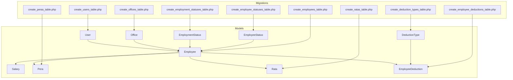
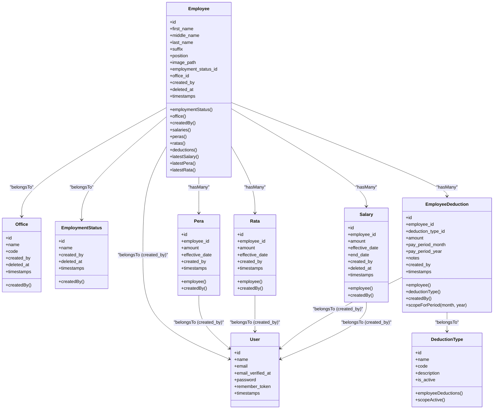
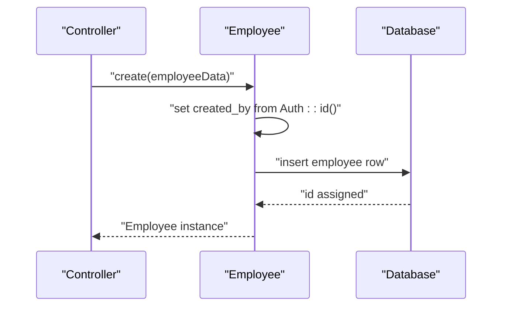
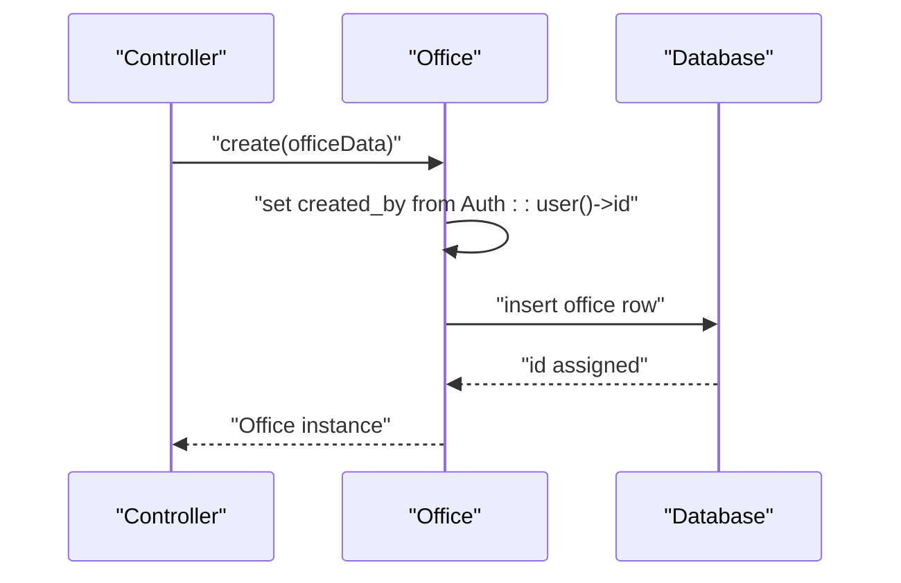

# Core Models

<cite>
**Referenced Files in This Document**
- [User.php](file://app/Models/User.php)
- [Employee.php](file://app/Models/Employee.php)
- [Office.php](file://app/Models/Office.php)
- [EmploymentStatus.php](file://app/Models/EmploymentStatus.php)
- [EmployeeStatus.php](file://app/Models/EmployeeStatus.php)
- [Salary.php](file://app/Models/Salary.php)
- [Pera.php](file://app/Models/Pera.php)
- [Rata.php](file://app/Models/Rata.php)
- [EmployeeDeduction.php](file://app/Models/EmployeeDeduction.php)
- [DeductionType.php](file://app/Models/DeductionType.php)
- [create_users_table.php](file://database/migrations/0001_01_01_000000_create_users_table.php)
- [create_offices_table.php](file://database/migrations/2026_03_18_071422_create_offices_table.php)
- [create_employees_table.php](file://database/migrations/2026_03_19_022838_create_employees_table.php)
- [create_employee_statuses_table.php](file://database/migrations/2026_03_19_014107_create_employee_statuses_table.php)
- [create_employment_statuses_table.php](file://database/migrations/2026_03_19_014108_create_employment_statuses_table.php)
- [create_peras_table.php](file://database/migrations/2026_03_22_115109_create_peras_table.php)
- [create_deduction_types_table.php](file://database/migrations/2026_03_22_115110_create_deduction_types_table.php)
- [create_ratas_table.php](file://database/migrations/2026_03_22_115111_create_ratas_table.php)
- [create_employee_deductions_table.php](file://database/migrations/2026_03_22_115112_create_employee_deductions_table.php)
</cite>

## Table of Contents
1. [Introduction](#introduction)
2. [Project Structure](#project-structure)
3. [Core Components](#core-components)
4. [Architecture Overview](#architecture-overview)
5. [Detailed Component Analysis](#detailed-component-analysis)
6. [Dependency Analysis](#dependency-analysis)
7. [Performance Considerations](#performance-considerations)
8. [Troubleshooting Guide](#troubleshooting-guide)
9. [Conclusion](#conclusion)

## Introduction
This document provides comprehensive data model documentation for the core business entities in the application: User, Employee, and Office. It details entity relationships, field definitions, data types, primary/foreign keys, indexes, constraints, validation rules, business logic, model behaviors, attribute casting, and relationship methods. It also covers data access patterns, query optimization, performance considerations, model lifecycle, soft deletes, and data integrity requirements.

## Project Structure
The core models are located under the application Models namespace, with supporting database migrations defining schema, constraints, and indexes. The relationships among models are established via Eloquent relationships, and several models leverage soft deletes and automatic auditing via created_by foreign keys.



**Diagram sources**
- [User.php:10-48](file://app/Models/User.php#L10-L48)
- [Employee.php:10-103](file://app/Models/Employee.php#L10-L103)
- [Office.php:9-32](file://app/Models/Office.php#L9-L32)
- [EmploymentStatus.php:9-31](file://app/Models/EmploymentStatus.php#L9-L31)
- [EmployeeStatus.php:9-36](file://app/Models/EmployeeStatus.php#L9-L36)
- [Salary.php:8-35](file://app/Models/Salary.php#L8-L35)
- [Pera.php:8-40](file://app/Models/Pera.php#L8-L40)
- [Rata.php:8-40](file://app/Models/Rata.php#L8-L40)
- [EmployeeDeduction.php:8-58](file://app/Models/EmployeeDeduction.php#L8-L58)
- [DeductionType.php:7-32](file://app/Models/DeductionType.php#L7-L32)
- [create_users_table.php:14-22](file://database/migrations/0001_01_01_000000_create_users_table.php#L14-L22)
- [create_offices_table.php:14-21](file://database/migrations/2026_03_18_071422_create_offices_table.php#L14-L21)
- [create_employees_table.php:14-27](file://database/migrations/2026_03_19_022838_create_employees_table.php#L14-L27)
- [create_employee_statuses_table.php:14-20](file://database/migrations/2026_03_19_014107_create_employee_statuses_table.php#L14-L20)
- [create_employment_statuses_table.php:14-20](file://database/migrations/2026_03_19_014108_create_employment_statuses_table.php#L14-L20)
- [create_peras_table.php](file://database/migrations/2026_03_22_115109_create_peras_table.php)
- [create_deduction_types_table.php](file://database/migrations/2026_03_22_115110_create_deduction_types_table.php)
- [create_ratas_table.php](file://database/migrations/2026_03_22_115111_create_ratas_table.php)
- [create_employee_deductions_table.php](file://database/migrations/2026_03_22_115112_create_employee_deductions_table.php)

**Section sources**
- [User.php:10-48](file://app/Models/User.php#L10-L48)
- [Employee.php:10-103](file://app/Models/Employee.php#L10-L103)
- [Office.php:9-32](file://app/Models/Office.php#L9-L32)
- [create_users_table.php:14-22](file://database/migrations/0001_01_01_000000_create_users_table.php#L14-L22)
- [create_offices_table.php:14-21](file://database/migrations/2026_03_18_071422_create_offices_table.php#L14-L21)
- [create_employees_table.php:14-27](file://database/migrations/2026_03_19_022838_create_employees_table.php#L14-L27)

## Core Components
This section documents the three primary business models: User, Employee, and Office, including their fields, relationships, casting, and lifecycle behaviors.

- User
  - Purpose: Authentication and authorization anchor for the system.
  - Fields: id, name, email (unique), email_verified_at, password, remember_token, timestamps.
  - Constraints: email uniqueness enforced at the database level.
  - Relationships: Not directly related to core business entities in this scope.
  - Lifecycle: Standard Eloquent model with authentication traits; no soft deletes.
  - Validation: Handled by request classes and authentication guards; model focuses on serialization and casting.
  - Casting: email_verified_at as datetime; password as hashed.
  - Access patterns: Used for login, profile updates, and session management.

- Employee
  - Purpose: Represents individuals employed by the organization.
  - Fields: id, first_name, middle_name (nullable), last_name, suffix (nullable), position (nullable), image_path (nullable), employment_status_id, office_id, created_by, deleted_at (soft delete), timestamps.
  - Relationships: belongsTo EmploymentStatus, belongsTo Office, belongsTo User (created_by), hasMany Salary, Pera, Rata, EmployeeDeduction; latest* helpers for latest records by effective_date.
  - Lifecycle: Soft deletes enabled; automatically sets created_by during creation.
  - Validation: Handled by requests/controllers; model ensures data integrity via relationships and casting.
  - Casting: is_rata_eligible as boolean.
  - Access patterns: Aggregates compensation and deductions; supports latest record retrieval by effective date.

- Office
  - Purpose: Organizational unit or location.
  - Fields: id, name, code, created_by, deleted_at (soft delete), timestamps.
  - Relationships: belongsTo User (created_by); linked to Employee via foreign key.
  - Lifecycle: Soft deletes enabled; automatically sets created_by during creation.
  - Validation: Controlled by requests/controllers; model enforces referential integrity via foreign keys.
  - Access patterns: Used to group employees by location.

**Section sources**
- [User.php:10-48](file://app/Models/User.php#L10-L48)
- [Employee.php:10-103](file://app/Models/Employee.php#L10-L103)
- [Office.php:9-32](file://app/Models/Office.php#L9-L32)

## Architecture Overview
The core models form a cohesive domain model with clear ownership and cascading behaviors. Employees belong to Offices and EmploymentStatuses, and are tracked by Users. Compensation and deductions are modeled as separate entities with effective dates and monetary precision.



**Diagram sources**
- [User.php:10-48](file://app/Models/User.php#L10-L48)
- [Employee.php:10-103](file://app/Models/Employee.php#L10-L103)
- [Office.php:9-32](file://app/Models/Office.php#L9-L32)
- [EmploymentStatus.php:9-31](file://app/Models/EmploymentStatus.php#L9-L31)
- [EmployeeStatus.php:9-36](file://app/Models/EmployeeStatus.php#L9-L36)
- [Salary.php:8-35](file://app/Models/Salary.php#L8-L35)
- [Pera.php:8-40](file://app/Models/Pera.php#L8-L40)
- [Rata.php:8-40](file://app/Models/Rata.php#L8-L40)
- [EmployeeDeduction.php:8-58](file://app/Models/EmployeeDeduction.php#L8-L58)
- [DeductionType.php:7-32](file://app/Models/DeductionType.php#L7-L32)

## Detailed Component Analysis

### User Model
- Identity and Security
  - Primary key: id (auto-increment).
  - Unique constraint: email.
  - Serialization: sensitive fields hidden from serialization.
  - Casting: email_verified_at as datetime; password as hashed.
- Access Patterns
  - Authentication guard relies on this model; not directly queried by core business logic in this scope.
- Integrity
  - No soft deletes; relies on framework-level authentication constraints.

**Section sources**
- [User.php:10-48](file://app/Models/User.php#L10-L48)
- [create_users_table.php:14-22](file://database/migrations/0001_01_01_000000_create_users_table.php#L14-L22)

### Employee Model
- Fields and Types
  - Names: strings; nullable middle_name and suffix; optional position.
  - Monetary fields: managed via related models (Salary/Pera/Rata) with decimal casting.
  - Effective/end dates: managed via related models with date casting.
  - Image path: stored as string; resolved to URL via accessor.
- Relationships
  - belongsTo EmploymentStatus, Office, User (created_by).
  - hasMany Salary, Pera, Rata, EmployeeDeduction.
  - latest* helpers order by effective_date descending.
- Lifecycle
  - Soft deletes enabled.
  - Automatic created_by population during creation.
- Casting
  - is_rata_eligible boolean.
- Accessors
  - image_path accessor resolves storage URLs.
- Business Logic
  - Latest record retrieval by effective_date ensures current compensation/deductions.
- Validation
  - Controlled by request classes; model ensures referential integrity and type safety.



**Diagram sources**
- [Employee.php:90-97](file://app/Models/Employee.php#L90-L97)

**Section sources**
- [Employee.php:10-103](file://app/Models/Employee.php#L10-L103)
- [create_employees_table.php:14-27](file://database/migrations/2026_03_19_022838_create_employees_table.php#L14-L27)

### Office Model
- Fields and Types
  - name, code: strings; unique constraints implied by typical business needs.
  - created_by: foreign key to users.
  - Soft deletes enabled.
- Relationships
  - belongsTo User (created_by).
- Lifecycle
  - Soft deletes enabled.
  - Automatic created_by population during creation.
- Validation
  - Controlled by request classes; model ensures referential integrity.



**Diagram sources**
- [Office.php:24-31](file://app/Models/Office.php#L24-L31)

**Section sources**
- [Office.php:9-32](file://app/Models/Office.php#L9-L32)
- [create_offices_table.php:14-21](file://database/migrations/2026_03_18_071422_create_offices_table.php#L14-L21)

### Supporting Status Models
- EmploymentStatus
  - Purpose: Defines employment categories; linked to employees via foreign key.
  - Relationships: belongsTo User (created_by); hasMany Employee.
  - Lifecycle: Soft deletes enabled; automatic created_by population.
- EmployeeStatus
  - Purpose: Defines employee statuses; linked to employees via foreign key.
  - Relationships: belongsTo User (created_by); hasMany Employee.
  - Lifecycle: Soft deletes enabled; automatic created_by population.

**Section sources**
- [EmploymentStatus.php:9-31](file://app/Models/EmploymentStatus.php#L9-L31)
- [EmployeeStatus.php:9-36](file://app/Models/EmployeeStatus.php#L9-L36)
- [create_employment_statuses_table.php:14-20](file://database/migrations/2026_03_19_014108_create_employment_statuses_table.php#L14-L20)
- [create_employee_statuses_table.php:14-20](file://database/migrations/2026_03_19_014107_create_employee_statuses_table.php#L14-L20)

### Compensation and Deduction Models
- Salary
  - Purpose: Stores salary records with effective and end dates.
  - Fields: amount (decimal), effective_date, end_date; created_by; deleted_at.
  - Relationships: belongsTo Employee, User (created_by).
  - Casting: amount decimal with 2 decimals; effective_date and end_date as date.
- Pera
  - Purpose: Stores PERA contributions with effective date.
  - Fields: amount (decimal), effective_date; created_by.
  - Relationships: belongsTo Employee, User (created_by).
  - Lifecycle: Automatic created_by population during creation.
- Rata
  - Purpose: Stores RATA contributions with effective date.
  - Fields: amount (decimal), effective_date; created_by.
  - Relationships: belongsTo Employee, User (created_by).
  - Lifecycle: Automatic created_by population during creation.
- EmployeeDeduction
  - Purpose: Stores employee-specific deductions with pay period metadata.
  - Fields: amount (decimal), pay_period_month/year; created_by.
  - Relationships: belongsTo Employee, DeductionType, User (created_by).
  - Scopes: forPeriod(month, year) filters by pay period.
  - Lifecycle: Automatic created_by population during creation.
- DeductionType
  - Purpose: Defines deduction categories (active/inactive).
  - Fields: name, code, description, is_active.
  - Scopes: active filter to include only active types.
  - Relationships: hasMany EmployeeDeduction.

**Section sources**
- [Salary.php:8-35](file://app/Models/Salary.php#L8-L35)
- [Pera.php:8-40](file://app/Models/Pera.php#L8-L40)
- [Rata.php:8-40](file://app/Models/Rata.php#L8-L40)
- [EmployeeDeduction.php:8-58](file://app/Models/EmployeeDeduction.php#L8-L58)
- [DeductionType.php:7-32](file://app/Models/DeductionType.php#L7-L32)

## Dependency Analysis
The models exhibit clear dependency relationships with cascading deletes and soft deletes ensuring referential integrity.

```mermaid
erDiagram
USERS {
bigint id PK
string name
string email UK
timestamp email_verified_at
string password
string remember_token
timestamps
}
OFFICES {
bigint id PK
string name
string code
bigint created_by FK
timestamp deleted_at
timestamps
}
EMPLOYMENT_STATUSES {
bigint id PK
string name
bigint created_by FK
timestamp deleted_at
timestamps
}
EMPLOYEE_STATUSES {
bigint id PK
string name
bigint created_by FK
timestamp deleted_at
timestamps
}
EMPLOYEES {
bigint id PK
string first_name
string middle_name
string last_name
string suffix
string position
string image_path
bigint employment_status_id FK
bigint office_id FK
bigint created_by FK
timestamp deleted_at
timestamps
}
SALARIES {
bigint id PK
bigint employee_id FK
decimal amount
date effective_date
date end_date
bigint created_by FK
timestamp deleted_at
timestamps
}
PERAS {
bigint id PK
bigint employee_id FK
decimal amount
date effective_date
bigint created_by FK
timestamps
}
RATAS {
bigint id PK
bigint employee_id FK
decimal amount
date effective_date
bigint created_by FK
timestamps
}
DEDUCTION_TYPES {
bigint id PK
string name
string code
string description
boolean is_active
timestamps
}
EMPLOYEE_DEDUCTIONS {
bigint id PK
bigint employee_id FK
bigint deduction_type_id FK
decimal amount
integer pay_period_month
integer pay_period_year
string notes
bigint created_by FK
timestamps
}
USERS ||--o{ OFFICES : "created_by"
USERS ||--o{ EMPLOYMENT_STATUSES : "created_by"
USERS ||--o{ EMPLOYEE_STATUSES : "created_by"
USERS ||--o{ EMPLOYEES : "created_by"
USERS ||--o{ SALARIES : "created_by"
USERS ||--o{ PERAS : "created_by"
USERS ||--o{ RATAS : "created_by"
USERS ||--o{ EMPLOYEE_DEDUCTIONS : "created_by"
EMPLOYMENT_STATUSES ||--o{ EMPLOYEES : "employment_status_id"
OFFICES ||--o{ EMPLOYEES : "office_id"
EMPLOYEES ||--o{ SALARIES : "employee_id"
EMPLOYEES ||--o{ PERAS : "employee_id"
EMPLOYEES ||--o{ RATAS : "employee_id"
EMPLOYEES ||--o{ EMPLOYEE_DEDUCTIONS : "employee_id"
DEDUCTION_TYPES ||--o{ EMPLOYEE_DEDUCTIONS : "deduction_type_id"
```

**Diagram sources**
- [create_users_table.php:14-22](file://database/migrations/0001_01_01_000000_create_users_table.php#L14-L22)
- [create_offices_table.php:14-21](file://database/migrations/2026_03_18_071422_create_offices_table.php#L14-L21)
- [create_employees_table.php:14-27](file://database/migrations/2026_03_19_022838_create_employees_table.php#L14-L27)
- [create_employment_statuses_table.php:14-20](file://database/migrations/2026_03_19_014108_create_employment_statuses_table.php#L14-L20)
- [create_employee_statuses_table.php:14-20](file://database/migrations/2026_03_19_014107_create_employee_statuses_table.php#L14-L20)
- [create_peras_table.php](file://database/migrations/2026_03_22_115109_create_peras_table.php)
- [create_deduction_types_table.php](file://database/migrations/2026_03_22_115110_create_deduction_types_table.php)
- [create_ratas_table.php](file://database/migrations/2026_03_22_115111_create_ratas_table.php)
- [create_employee_deductions_table.php](file://database/migrations/2026_03_22_115112_create_employee_deductions_table.php)

**Section sources**
- [create_users_table.php:14-22](file://database/migrations/0001_01_01_000000_create_users_table.php#L14-L22)
- [create_offices_table.php:14-21](file://database/migrations/2026_03_18_071422_create_offices_table.php#L14-L21)
- [create_employees_table.php:14-27](file://database/migrations/2026_03_19_022838_create_employees_table.php#L14-L27)
- [create_employment_statuses_table.php:14-20](file://database/migrations/2026_03_19_014108_create_employment_statuses_table.php#L14-L20)
- [create_employee_statuses_table.php:14-20](file://database/migrations/2026_03_19_014107_create_employee_statuses_table.php#L14-L20)

## Performance Considerations
- Indexes and Foreign Keys
  - Sessions migration includes an index on user_id for session lookups.
  - Several foreign keys define cascade-on-delete for referential integrity and reduce orphaned records.
- Casting and Precision
  - Monetary fields use decimal casting with two decimal places to ensure consistent financial calculations.
  - Date casting for effective/end dates enables efficient filtering and ordering.
- Query Patterns
  - latest* helpers order by effective_date descending; ensure appropriate indexes exist on effective_date for optimal performance.
  - Use scopes like forPeriod to limit result sets by pay period.
- Soft Deletes
  - Soft deletes reduce query complexity by excluding deleted rows by default; consider adding indexes on deleted_at for large datasets if queries frequently filter by active records.
- Accessors
  - image_path accessor delegates to storage URL resolution; avoid excessive resolution in tight loops; precompute where appropriate.

[No sources needed since this section provides general guidance]

## Troubleshooting Guide
- Common Issues
  - Foreign key constraint violations: Ensure related records (Office, EmploymentStatus, User) exist before creating Employee or child records.
  - Soft delete visibility: Queries may exclude soft-deleted records; use withTrashed() when necessary.
  - Attribute casting mismatches: Verify decimal precision and date formats align with UI expectations.
- Debugging Tips
  - Log queries and bindings to identify missing indexes or inefficient filters.
  - Validate scopes and accessors in isolation to confirm expected behavior.
  - Confirm created_by population during creation to maintain audit trails.

[No sources needed since this section provides general guidance]

## Conclusion
The core models establish a robust, integrity-focused domain model with clear relationships, consistent casting, and lifecycle behaviors. Soft deletes and cascading constraints maintain referential integrity, while scopes and accessors streamline common queries and data presentation. By adhering to the documented patterns and constraints, developers can reliably extend functionality while preserving data consistency and performance.