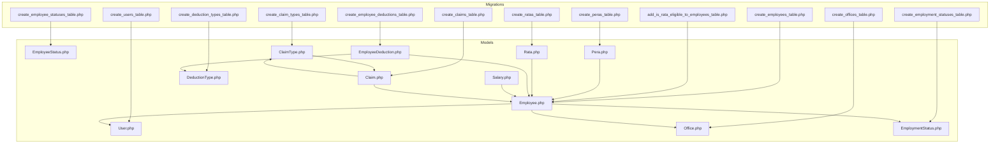
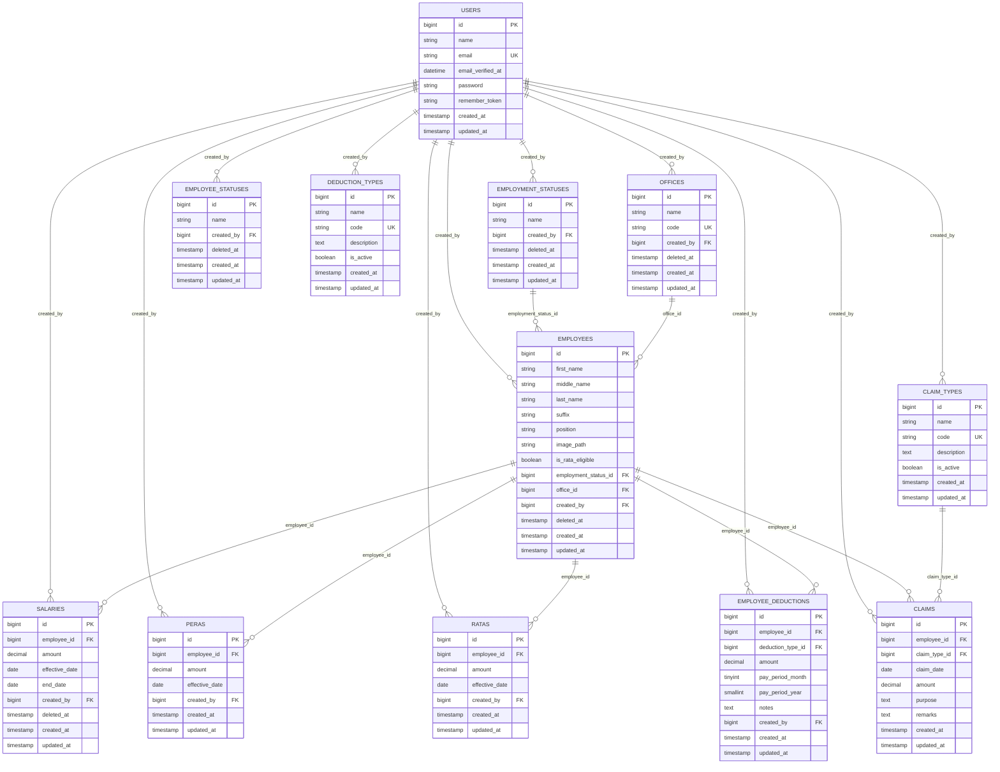
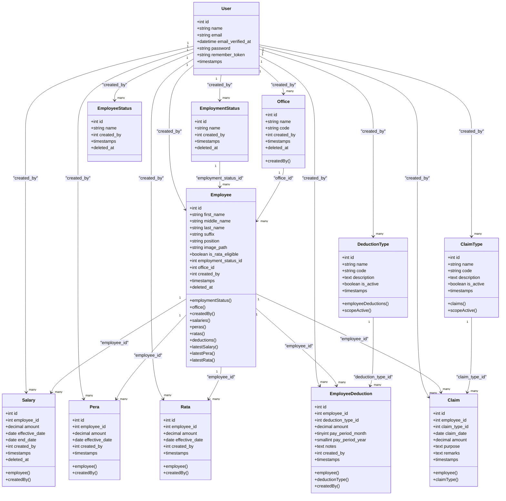

# Data Models & Database Schema

<cite>
**Referenced Files in This Document**
- [0001_01_01_000000_create_users_table.php](file://database/migrations/0001_01_01_000000_create_users_table.php)
- [2026_03_18_071422_create_offices_table.php](file://database/migrations/2026_03_18_071422_create_offices_table.php)
- [2026_03_19_014107_create_employee_statuses_table.php](file://database/migrations/2026_03_19_014107_create_employee_statuses_table.php)
- [2026_03_19_014108_create_employment_statuses_table.php](file://database/migrations/2026_03_19_014108_create_employment_statuses_table.php)
- [2026_03_19_022838_create_employees_table.php](file://database/migrations/2026_03_19_022838_create_employees_table.php)
- [2026_03_22_115109_add_is_rata_eligible_to_employees_table.php](file://database/migrations/2026_03_22_115109_add_is_rata_eligible_to_employees_table.php)
- [2026_03_22_115109_create_peras_table.php](file://database/migrations/2026_03_22_115109_create_peras_table.php)
- [2026_03_22_115110_create_deduction_types_table.php](file://database/migrations/2026_03_22_115110_create_deduction_types_table.php)
- [2026_03_22_115111_create_ratas_table.php](file://database/migrations/2026_03_22_115111_create_ratas_table.php)
- [2026_03_22_115112_create_employee_deductions_table.php](file://database/migrations/2026_03_22_115112_create_employee_deductions_table.php)
- [2026_03_23_053019_create_claim_types_table.php](file://database/migrations/2026_03_23_053019_create_claim_types_table.php)
- [2026_03_23_053024_create_claims_table.php](file://database/migrations/2026_03_23_053024_create_claims_table.php)
- [User.php](file://app/Models/User.php)
- [Employee.php](file://app/Models/Employee.php)
- [Office.php](file://app/Models/Office.php)
- [Salary.php](file://app/Models/Salary.php)
- [DeductionType.php](file://app/Models/DeductionType.php)
- [Claim.php](file://app/Models/Claim.php)
- [ClaimType.php](file://app/Models/ClaimType.php)
</cite>

## Update Summary
**Changes Made**
- Added new Claim and ClaimType models with comprehensive database schema
- Enhanced data model with claims management system for employee expense tracking
- Updated relationships to include claim_types and claims tables with proper foreign key constraints
- Added validation rules, casting, and business logic for claims processing
- Integrated claim types with active/inactive status management

## Table of Contents
1. [Introduction](#introduction)
2. [Project Structure](#project-structure)
3. [Core Components](#core-components)
4. [Architecture Overview](#architecture-overview)
5. [Detailed Component Analysis](#detailed-component-analysis)
6. [Dependency Analysis](#dependency-analysis)
7. [Performance Considerations](#performance-considerations)
8. [Troubleshooting Guide](#troubleshooting-guide)
9. [Conclusion](#conclusion)
10. [Appendices](#appendices)

## Introduction
This document provides comprehensive data model documentation for the payroll and HR-related entities in the application. It covers database entities, relationships, constraints, indexes, and business rules. It also documents data access patterns, validation rules, integrity requirements, lifecycle considerations, and security controls derived from the schema and Eloquent models.

## Project Structure
The data model spans migrations that define the relational schema and Eloquent models that encapsulate business logic and relationships. The most relevant migrations and models are grouped below.

**Diagram sources**
- [0001_01_01_000000_create_users_table.php:1-50](file://database/migrations/0001_01_01_000000_create_users_table.php#L1-L50)
- [2026_03_18_071422_create_offices_table.php:1-32](file://database/migrations/2026_03_18_071422_create_offices_table.php#L1-L32)
- [2026_03_19_014107_create_employee_statuses_table.php:1-31](file://database/migrations/2026_03_19_014107_create_employee_statuses_table.php#L1-L31)
- [2026_03_19_014108_create_employment_statuses_table.php:1-31](file://database/migrations/2026_03_19_014108_create_employment_statuses_table.php#L1-L31)
- [2026_03_19_022838_create_employees_table.php:1-38](file://database/migrations/2026_03_19_022838_create_employees_table.php#L1-L38)
- [2026_03_22_115109_add_is_rata_eligible_to_employees_table.php:1-29](file://database/migrations/2026_03_22_115109_add_is_rata_eligible_to_employees_table.php#L1-L29)
- [2026_03_22_115109_create_peras_table.php:1-32](file://database/migrations/2026_03_22_115109_create_peras_table.php#L1-L32)
- [2026_03_22_115110_create_deduction_types_table.php:1-32](file://database/migrations/2026_03_22_115110_create_deduction_types_table.php#L1-L32)
- [2026_03_22_115111_create_ratas_table.php:1-32](file://database/migrations/2026_03_22_115111_create_ratas_table.php#L1-L32)
- [2026_03_22_115112_create_employee_deductions_table.php:1-38](file://database/migrations/2026_03_22_115112_create_employee_deductions_table.php#L1-L38)
- [2026_03_23_053019_create_claim_types_table.php:1-32](file://database/migrations/2026_03_23_053019_create_claim_types_table.php#L1-L32)
- [2026_03_23_053024_create_claims_table.php:1-34](file://database/migrations/2026_03_23_053024_create_claims_table.php#L1-L34)
- [User.php:1-49](file://app/Models/User.php#L1-L49)
- [Employee.php:1-104](file://app/Models/Employee.php#L1-L104)
- [Office.php:1-33](file://app/Models/Office.php#L1-L33)
- [Salary.php:1-36](file://app/Models/Salary.php#L1-L36)
- [DeductionType.php:1-33](file://app/Models/DeductionType.php#L1-L33)
- [Claim.php:1-36](file://app/Models/Claim.php#L1-L36)
- [ClaimType.php:1-28](file://app/Models/ClaimType.php#L1-L28)

**Section sources**
- [0001_01_01_000000_create_users_table.php:1-50](file://database/migrations/0001_01_01_000000_create_users_table.php#L1-L50)
- [2026_03_18_071422_create_offices_table.php:1-32](file://database/migrations/2026_03_18_071422_create_offices_table.php#L1-L32)
- [2026_03_19_014107_create_employee_statuses_table.php:1-31](file://database/migrations/2026_03_19_014107_create_employee_statuses_table.php#L1-L31)
- [2026_03_19_014108_create_employment_statuses_table.php:1-31](file://database/migrations/2026_03_19_014108_create_employment_statuses_table.php#L1-L31)
- [2026_03_19_022838_create_employees_table.php:1-38](file://database/migrations/2026_03_19_022838_create_employees_table.php#L1-L38)
- [2026_03_22_115109_add_is_rata_eligible_to_employees_table.php:1-29](file://database/migrations/2026_03_22_115109_add_is_rata_eligible_to_employees_table.php#L1-L29)
- [2026_03_22_115109_create_peras_table.php:1-32](file://database/migrations/2026_03_22_115109_create_peras_table.php#L1-L32)
- [2026_03_22_115110_create_deduction_types_table.php:1-32](file://database/migrations/2026_03_22_115110_create_deduction_types_table.php#L1-L32)
- [2026_03_22_115111_create_ratas_table.php:1-32](file://database/migrations/2026_03_22_115111_create_ratas_table.php#L1-L32)
- [2026_03_22_115112_create_employee_deductions_table.php:1-38](file://database/migrations/2026_03_22_115112_create_employee_deductions_table.php#L1-L38)
- [2026_03_23_053019_create_claim_types_table.php:1-32](file://database/migrations/2026_03_23_053019_create_claim_types_table.php#L1-L32)
- [2026_03_23_053024_create_claims_table.php:1-34](file://database/migrations/2026_03_23_053024_create_claims_table.php#L1-L34)
- [User.php:1-49](file://app/Models/User.php#L1-L49)
- [Employee.php:1-104](file://app/Models/Employee.php#L1-L104)
- [Office.php:1-33](file://app/Models/Office.php#L1-L33)
- [Salary.php:1-36](file://app/Models/Salary.php#L1-L36)
- [DeductionType.php:1-33](file://app/Models/DeductionType.php#L1-L33)
- [Claim.php:1-36](file://app/Models/Claim.php#L1-L36)
- [ClaimType.php:1-28](file://app/Models/ClaimType.php#L1-L28)

## Core Components
This section summarizes the core entities and their roles in the system.

- Users
  - Purpose: Application authentication and authorization backbone.
  - Key fields: id, name, email (unique), email_verified_at, password, remember_token, timestamps.
  - Constraints: email uniqueness enforced at the database level; sessions table references users via user_id with index.
  - Security: Passwords are hashed; sensitive attributes are hidden; sessions support last_activity indexing.

- Offices
  - Purpose: Organizational units with soft-deletable hierarchy.
  - Key fields: id, name, code, created_by (FK to users), soft deletes, timestamps.
  - Constraints: created_by FK to users with cascade on delete; code uniqueness enforced at DB level.

- Employment Statuses
  - Purpose: Employment state taxonomy (e.g., Active, Inactive).
  - Key fields: id, name, created_by (FK to users), soft deletes, timestamps.
  - Constraints: created_by FK to users with cascade on delete.

- Employee Statuses
  - Purpose: Employee-specific status taxonomy (e.g., Onboarded, Terminated).
  - Key fields: id, name, created_by (FK to users), soft deletes, timestamps.
  - Constraints: created_by FK to users.

- Employees
  - Purpose: Individual worker records linked to office and employment status.
  - Key fields: id, personal info (first_name, middle_name, last_name, suffix), position, image_path, is_rata_eligible, employment_status_id (FK), office_id (FK), created_by (FK), soft deletes, timestamps.
  - Constraints: FKs to employment_statuses and offices with cascade on delete; created_by FK to users with cascade on delete; is_rata_eligible column added later.
  - Business logic: Auto-populates created_by on creation; image_path is resolved via storage URL.

- Salaries
  - Purpose: Historical salary records with effective and end dates.
  - Key fields: id, employee_id (FK), amount (currency), effective_date, end_date, created_by (FK), soft deletes, timestamps.
  - Constraints: FK to employees with cascade on delete; FK to users with cascade on delete; amount precision/scale defined via casting.

- PERA (Provident Employee Retirement Agreement)
  - Purpose: Employee retirement contribution records.
  - Key fields: id, employee_id (FK), amount, effective_date, created_by (FK), timestamps.
  - Constraints: FK to employees with cascade on delete; FK to users with cascade on delete.

- RATA (Rural Tax and Benefits)
  - Purpose: Rural tax/benefit adjustments per employee.
  - Key fields: id, employee_id (FK), amount, effective_date, created_by (FK), timestamps.
  - Constraints: FK to employees with cascade on delete; FK to users with cascade on delete.

- Deduction Types
  - Purpose: Categorization of allowable deductions (e.g., Loans, Insurance).
  - Key fields: id, name, code (unique), description, is_active, timestamps.
  - Constraints: code uniqueness enforced; scope to fetch only active types.

- Employee Deductions
  - Purpose: Specific deduction entries applied to employees during pay periods.
  - Key fields: id, employee_id (FK), deduction_type_id (FK), amount, pay_period_month, pay_period_year, notes, created_by (FK), timestamps.
  - Constraints: FKs to employees and deduction_types with cascade on delete; unique composite index on (employee_id, deduction_type_id, pay_period_month, pay_period_year) to prevent duplicates.

- Claim Types
  - Purpose: Categorization of allowable employee claims (e.g., Medical, Travel, Communication).
  - Key fields: id, name, code (unique), description, is_active, timestamps.
  - Constraints: code uniqueness enforced; scope to fetch only active types; restrict deletion when claims exist.

- Claims
  - Purpose: Employee expense claims with date, amount, purpose, and remarks.
  - Key fields: id, employee_id (FK), claim_type_id (FK), claim_date, amount (currency), purpose, remarks, timestamps.
  - Constraints: FKs to employees and claim_types with cascade/RESTRICT rules; amount precision/scale defined via casting; claim_date validated as date.

**Section sources**
- [0001_01_01_000000_create_users_table.php:14-37](file://database/migrations/0001_01_01_000000_create_users_table.php#L14-L37)
- [2026_03_18_071422_create_offices_table.php:14-21](file://database/migrations/2026_03_18_071422_create_offices_table.php#L14-L21)
- [2026_03_19_014108_create_employment_statuses_table.php:14-20](file://database/migrations/2026_03_19_014108_create_employment_statuses_table.php#L14-L20)
- [2026_03_19_014107_create_employee_statuses_table.php:14-20](file://database/migrations/2026_03_19_014107_create_employee_statuses_table.php#L14-L20)
- [2026_03_19_022838_create_employees_table.php:14-27](file://database/migrations/2026_03_19_022838_create_employees_table.php#L14-L27)
- [2026_03_22_115109_add_is_rata_eligible_to_employees_table.php:14-16](file://database/migrations/2026_03_22_115109_add_is_rata_eligible_to_employees_table.php#L14-L16)
- [2026_03_22_115109_create_peras_table.php:14-21](file://database/migrations/2026_03_22_115109_create_peras_table.php#L14-L21)
- [2026_03_22_115111_create_ratas_table.php:14-21](file://database/migrations/2026_03_22_115111_create_ratas_table.php#L14-L21)
- [2026_03_22_115110_create_deduction_types_table.php:14-21](file://database/migrations/2026_03_22_115110_create_deduction_types_table.php#L14-L21)
- [2026_03_22_115112_create_employee_deductions_table.php:14-27](file://database/migrations/2026_03_22_115112_create_employee_deductions_table.php#L14-L27)
- [2026_03_23_053019_create_claim_types_table.php:14-21](file://database/migrations/2026_03_23_053019_create_claim_types_table.php#L14-L21)
- [2026_03_23_053024_create_claims_table.php:14-23](file://database/migrations/2026_03_23_053024_create_claims_table.php#L14-L23)
- [User.php:20-47](file://app/Models/User.php#L20-L47)
- [Employee.php:14-103](file://app/Models/Employee.php#L14-L103)
- [Office.php:13-31](file://app/Models/Office.php#L13-L31)
- [Salary.php:12-34](file://app/Models/Salary.php#L12-L34)
- [DeductionType.php:9-31](file://app/Models/DeductionType.php#L9-L31)
- [ClaimType.php:9-27](file://app/Models/ClaimType.php#L9-L27)
- [Claim.php:9-35](file://app/Models/Claim.php#L9-L35)

## Architecture Overview
The data model follows a normalized relational schema with foreign keys enforcing referential integrity. Eloquent models encapsulate relationships and business behaviors such as auto-populating created_by and resolving image URLs. The addition of claims management enhances the system's ability to track employee expense reimbursements and allowances.

**Diagram sources**
- [0001_01_01_000000_create_users_table.php:14-37](file://database/migrations/0001_01_01_000000_create_users_table.php#L14-L37)
- [2026_03_18_071422_create_offices_table.php:14-21](file://database/migrations/2026_03_18_071422_create_offices_table.php#L14-L21)
- [2026_03_19_014108_create_employment_statuses_table.php:14-20](file://database/migrations/2026_03_19_014108_create_employment_statuses_table.php#L14-L20)
- [2026_03_19_014107_create_employee_statuses_table.php:14-20](file://database/migrations/2026_03_19_014107_create_employee_statuses_table.php#L14-L20)
- [2026_03_19_022838_create_employees_table.php:14-27](file://database/migrations/2026_03_19_022838_create_employees_table.php#L14-L27)
- [2026_03_22_115109_create_peras_table.php:14-21](file://database/migrations/2026_03_22_115109_create_peras_table.php#L14-L21)
- [2026_03_22_115111_create_ratas_table.php:14-21](file://database/migrations/2026_03_22_115111_create_ratas_table.php#L14-L21)
- [2026_03_22_115110_create_deduction_types_table.php:14-21](file://database/migrations/2026_03_22_115110_create_deduction_types_table.php#L14-L21)
- [2026_03_22_115112_create_employee_deductions_table.php:14-27](file://database/migrations/2026_03_22_115112_create_employee_deductions_table.php#L14-L27)
- [2026_03_23_053019_create_claim_types_table.php:14-21](file://database/migrations/2026_03_23_053019_create_claim_types_table.php#L14-L21)
- [2026_03_23_053024_create_claims_table.php:14-23](file://database/migrations/2026_03_23_053024_create_claims_table.php#L14-L23)

## Detailed Component Analysis

### Users
- Fields and types: id (bigint, PK), name (string), email (string, unique), email_verified_at (datetime), password (string), remember_token (string), timestamps.
- Indexes/constraints: email unique; sessions.user_id indexed; sessions.user_id FK to users with cascade delete.
- Validation and integrity: Email uniqueness enforced at DB level; password hashing handled by model casting; sensitive fields hidden.
- Access control: Sessions table supports user identification and activity tracking.

**Section sources**
- [0001_01_01_000000_create_users_table.php:14-37](file://database/migrations/0001_01_01_000000_create_users_table.php#L14-L37)
- [User.php:20-47](file://app/Models/User.php#L20-L47)

### Offices
- Fields and types: id (bigint, PK), name (string), code (string, unique), created_by (bigint, FK), deleted_at (timestamp), timestamps.
- Indexes/constraints: created_by FK to users; code unique; soft deletes enabled.
- Validation and integrity: created_by auto-populated on creation; soft deletes allow logical deletion.
- Lifecycle: Soft-deleted records excluded from normal queries; restore via ORM.

**Section sources**
- [2026_03_18_071422_create_offices_table.php:14-21](file://database/migrations/2026_03_18_071422_create_offices_table.php#L14-L21)
- [Office.php:13-31](file://app/Models/Office.php#L13-L31)

### Employment Statuses
- Fields and types: id (bigint, PK), name (string), created_by (bigint, FK), deleted_at (timestamp), timestamps.
- Indexes/constraints: created_by FK to users with cascade on delete; soft deletes enabled.
- Validation and integrity: No additional constraints; ensures controlled vocabulary for employment states.

**Section sources**
- [2026_03_19_014108_create_employment_statuses_table.php:14-20](file://database/migrations/2026_03_19_014108_create_employment_statuses_table.php#L14-L20)

### Employee Statuses
- Fields and types: id (bigint, PK), name (string), created_by (bigint, FK), deleted_at (timestamp), timestamps.
- Indexes/constraints: created_by FK to users; soft deletes enabled.
- Validation and integrity: Controlled vocabulary for employee-specific statuses.

**Section sources**
- [2026_03_19_014107_create_employee_statuses_table.php:14-20](file://database/migrations/2026_03_19_014107_create_employee_statuses_table.php#L14-L20)

### Employees
- Fields and types: id (bigint, PK), personal identifiers, position, image_path, is_rata_eligible, employment_status_id (FK), office_id (FK), created_by (FK), deleted_at (timestamp), timestamps.
- Indexes/constraints: FKs to employment_statuses and offices with cascade on delete; created_by FK to users with cascade on delete; is_rata_eligible column added later.
- Validation and integrity: created_by auto-populated on creation; image_path resolved via storage URL; soft deletes supported.
- Business logic: Latest salary/pera/rata accessors leverage latest ordering by effective_date.

**Section sources**
- [2026_03_19_022838_create_employees_table.php:14-27](file://database/migrations/2026_03_19_022838_create_employees_table.php#L14-L27)
- [2026_03_22_115109_add_is_rata_eligible_to_employees_table.php:14-16](file://database/migrations/2026_03_22_115109_add_is_rata_eligible_to_employees_table.php#L14-L16)
- [Employee.php:14-103](file://app/Models/Employee.php#L14-L103)

### Salaries
- Fields and types: id (bigint, PK), employee_id (FK), amount (decimal), effective_date (date), end_date (date), created_by (FK), deleted_at (timestamp), timestamps.
- Indexes/constraints: FK to employees with cascade on delete; FK to users with cascade on delete; amount precision/scale via casting.
- Validation and integrity: Amounts stored with two decimals; effective/end dates constrain validity windows.

**Section sources**
- [2026_03_19_022838_create_employees_table.php:14-27](file://database/migrations/2026_03_19_022838_create_employees_table.php#L14-L27)
- [Salary.php:12-34](file://app/Models/Salary.php#L12-L34)

### PERA (Provident Employee Retirement Agreement)
- Fields and types: id (bigint, PK), employee_id (FK), amount (decimal), effective_date (date), created_by (FK), timestamps.
- Indexes/constraints: FK to employees with cascade on delete; FK to users with cascade on delete.
- Validation and integrity: Amount precision/scale via casting; effective_date anchors validity.

**Section sources**
- [2026_03_22_115109_create_peras_table.php:14-21](file://database/migrations/2026_03_22_115109_create_peras_table.php#L14-L21)
- [Employee.php:51-54](file://app/Models/Employee.php#L51-L54)

### RATA (Rural Tax and Benefits)
- Fields and types: id (bigint, PK), employee_id (FK), amount (decimal), effective_date (date), created_by (FK), timestamps.
- Indexes/constraints: FK to employees with cascade on delete; FK to users with cascade on delete.
- Validation and integrity: Amount precision/scale via casting; effective_date anchors validity.

**Section sources**
- [2026_03_22_115111_create_ratas_table.php:14-21](file://database/migrations/2026_03_22_115111_create_ratas_table.php#L14-L21)
- [Employee.php:56-59](file://app/Models/Employee.php#L56-L59)

### Deduction Types
- Fields and types: id (bigint, PK), name (string), code (string, unique), description (text), is_active (boolean), timestamps.
- Indexes/constraints: code unique; scope active() filters only active types.
- Validation and integrity: is_active flag governs availability; unique code prevents duplication.

**Section sources**
- [2026_03_22_115110_create_deduction_types_table.php:14-21](file://database/migrations/2026_03_22_115110_create_deduction_types_table.php#L14-L21)
- [DeductionType.php:9-31](file://app/Models/DeductionType.php#L9-L31)

### Employee Deductions
- Fields and types: id (bigint, PK), employee_id (FK), deduction_type_id (FK), amount (decimal), pay_period_month (tinyint), pay_period_year (smallint), notes (text), created_by (FK), timestamps.
- Indexes/constraints: FKs to employees and deduction_types with cascade on delete; unique composite index on (employee_id, deduction_type_id, pay_period_month, pay_period_year).
- Validation and integrity: Prevents duplicate deductions for the same employee/type/month/year; amount precision/scale via casting.

**Section sources**
- [2026_03_22_115112_create_employee_deductions_table.php:14-27](file://database/migrations/2026_03_22_115112_create_employee_deductions_table.php#L14-L27)

### Claim Types
- Fields and types: id (bigint, PK), name (string), code (string, unique), description (text), is_active (boolean), timestamps.
- Indexes/constraints: code unique; scope active() filters only active types; restrict deletion when claims exist.
- Validation and integrity: is_active flag governs availability; unique code prevents duplication; cascade/restrict constraints prevent orphaned records.
- Business logic: Scope active() filters only active claim types; prevents deletion of claim types with existing claims.

**Updated** Added comprehensive claim type management with active status control and validation rules.

**Section sources**
- [2026_03_23_053019_create_claim_types_table.php:14-21](file://database/migrations/2026_03_23_053019_create_claim_types_table.php#L14-L21)
- [ClaimType.php:9-27](file://app/Models/ClaimType.php#L9-L27)

### Claims
- Fields and types: id (bigint, PK), employee_id (FK), claim_type_id (FK), claim_date (date), amount (decimal), purpose (text), remarks (text), timestamps.
- Indexes/constraints: FKs to employees and claim_types with cascade/RESTRICT rules; amount precision/scale via casting; claim_date validated as date.
- Validation and integrity: Amounts stored with two decimals; claim_date must be a valid date; purpose required; cascade delete on employee, RESTRICT on claim_type.
- Business logic: Automatic belongsTo relationships to Employee and ClaimType models; date casting and decimal casting for precision.

**Updated** Added comprehensive claims management system for employee expense tracking with proper validation and relationships.

**Section sources**
- [2026_03_23_053024_create_claims_table.php:14-23](file://database/migrations/2026_03_23_053024_create_claims_table.php#L14-L23)
- [Claim.php:9-35](file://app/Models/Claim.php#L9-L35)

## Dependency Analysis
This section maps model relationships and foreign keys to illustrate dependencies.

**Diagram sources**
- [User.php:10-47](file://app/Models/User.php#L10-L47)
- [Office.php:9-31](file://app/Models/Office.php#L9-L31)
- [Employee.php:10-103](file://app/Models/Employee.php#L10-L103)
- [Salary.php:8-35](file://app/Models/Salary.php#L8-L35)
- [DeductionType.php:7-32](file://app/Models/DeductionType.php#L7-L32)
- [ClaimType.php:7-27](file://app/Models/ClaimType.php#L7-L27)
- [Claim.php:8-35](file://app/Models/Claim.php#L8-L35)

**Section sources**
- [Employee.php:31-64](file://app/Models/Employee.php#L31-L64)
- [Salary.php:26-34](file://app/Models/Salary.php#L26-L34)
- [DeductionType.php:20-31](file://app/Models/DeductionType.php#L20-L31)
- [ClaimType.php:18-27](file://app/Models/ClaimType.php#L18-L27)
- [Claim.php:26-35](file://app/Models/Claim.php#L26-L35)

## Performance Considerations
- Indexes
  - sessions.user_id is indexed to accelerate session lookups and user-based queries.
  - employee_deductions has a unique composite index on (employee_id, deduction_type_id, pay_period_month, pay_period_year) to prevent duplicates and optimize deduplication checks.
  - Claims table benefits from automatic indexes on foreign keys (employee_id, claim_type_id) for efficient joins.
- Casting and Precision
  - Currency fields use decimal casting with fixed scale to ensure consistent precision and reduce rounding errors.
  - Date fields use date casting for proper temporal comparisons and filtering.
- Soft Deletes
  - Soft-deleted records require appropriate scopes or filters to avoid scanning tombstoned rows unnecessarily.
- Query Patterns
  - Prefer eager loading of related collections (e.g., salaries, peras, ratas, claims) to minimize N+1 queries.
  - Use latest ordering on effective_date for retrieving current records efficiently.
  - Claims benefit from filtered queries by month, year, and claim type for performance.

## Troubleshooting Guide
- Duplicate Deductions
  - Symptom: Attempting to insert a deduction for the same employee/type/month/year fails.
  - Cause: Unique constraint on employee_deductions prevents duplicates.
  - Resolution: Ensure pay period fields match existing records or adjust pay period values.
- Integrity Violations
  - Symptom: Insert/update fails due to FK constraint.
  - Cause: Referenced IDs do not exist or violate cascade rules.
  - Resolution: Verify existence of related records (employees, offices, employment_statuses, deduction_types, claim_types) and ensure created_by is set.
- Image Path Resolution
  - Symptom: image_path appears as null or unresolved.
  - Cause: Stored path is not accessible via storage URL.
  - Resolution: Ensure image_path is properly stored and accessible via storage driver.
- Session Activity
  - Symptom: Unexpected session invalidation.
  - Cause: last_activity threshold exceeded.
  - Resolution: Adjust session lifetime or ensure regular client activity.
- Claim Type Deletion
  - Symptom: Cannot delete a claim type even though it appears inactive.
  - Cause: Claim type has existing claims associated with it.
  - Resolution: Delete all claims with that claim_type_id before deleting the claim type.
- Claim Validation Errors
  - Symptom: Claim creation/update fails validation.
  - Cause: Missing required fields or invalid data types.
  - Resolution: Ensure claim_type_id exists in claim_types table, claim_date is valid, amount is numeric >= 0, and purpose is provided.

**Section sources**
- [2026_03_22_115112_create_employee_deductions_table.php:25-27](file://database/migrations/2026_03_22_115112_create_employee_deductions_table.php#L25-L27)
- [Employee.php:99-102](file://app/Models/Employee.php#L99-L102)
- [0001_01_01_000000_create_users_table.php:30-37](file://database/migrations/0001_01_01_000000_create_users_table.php#L30-L37)
- [ClaimTypeController.php:48-57](file://app/Http/Controllers/ClaimTypeController.php#L48-L57)
- [ClaimController.php:59-96](file://app/Http/Controllers/ClaimController.php#L59-L96)

## Conclusion
The data model establishes a robust foundation for managing employees, organizations, compensation, benefits, deductions, and now claims. It enforces referential integrity via foreign keys, ensures uniqueness where required, and leverages soft deletes for auditability. Eloquent models encapsulate business logic and relationships, while migrations define precise schema constraints. The addition of claims management enhances the system's ability to track employee expense reimbursements with proper validation, categorization, and reporting capabilities. Adhering to the outlined validation rules, access patterns, and integrity requirements will maintain data quality and system reliability.

## Appendices

### Sample Data Structures
- Users
  - id: integer (PK)
  - name: string
  - email: string (unique)
  - email_verified_at: datetime
  - password: string
  - remember_token: string
  - created_at/updated_at: timestamps
- Offices
  - id: integer (PK)
  - name: string
  - code: string (unique)
  - created_by: integer (FK)
  - deleted_at: timestamp
  - created_at/updated_at: timestamps
- Employees
  - id: integer (PK)
  - first_name: string
  - middle_name: string
  - last_name: string
  - suffix: string
  - position: string
  - image_path: string
  - is_rata_eligible: boolean
  - employment_status_id: integer (FK)
  - office_id: integer (FK)
  - created_by: integer (FK)
  - deleted_at: timestamp
  - created_at/updated_at: timestamps
- Salaries
  - id: integer (PK)
  - employee_id: integer (FK)
  - amount: decimal
  - effective_date: date
  - end_date: date
  - created_by: integer (FK)
  - deleted_at: timestamp
  - created_at/updated_at: timestamps
- PERA
  - id: integer (PK)
  - employee_id: integer (FK)
  - amount: decimal
  - effective_date: date
  - created_by: integer (FK)
  - created_at/updated_at: timestamps
- RATA
  - id: integer (PK)
  - employee_id: integer (FK)
  - amount: decimal
  - effective_date: date
  - created_by: integer (FK)
  - created_at/updated_at: timestamps
- Deduction Types
  - id: integer (PK)
  - name: string
  - code: string (unique)
  - description: text
  - is_active: boolean
  - created_at/updated_at: timestamps
- Employee Deductions
  - id: integer (PK)
  - employee_id: integer (FK)
  - deduction_type_id: integer (FK)
  - amount: decimal
  - pay_period_month: tinyint
  - pay_period_year: smallint
  - notes: text
  - created_by: integer (FK)
  - created_at/updated_at: timestamps
- Claim Types
  - id: integer (PK)
  - name: string
  - code: string (unique)
  - description: text
  - is_active: boolean
  - created_at/updated_at: timestamps
- Claims
  - id: integer (PK)
  - employee_id: integer (FK)
  - claim_type_id: integer (FK)
  - claim_date: date
  - amount: decimal
  - purpose: text
  - remarks: text
  - created_at/updated_at: timestamps