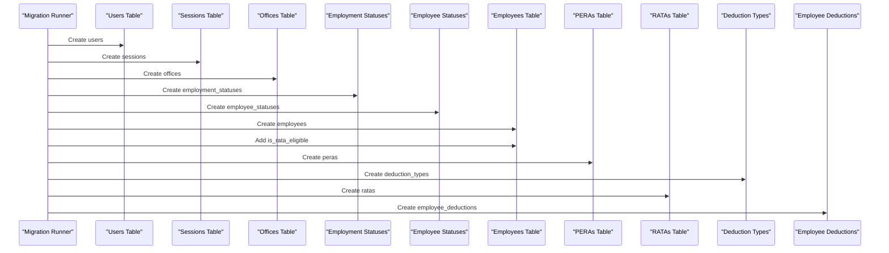
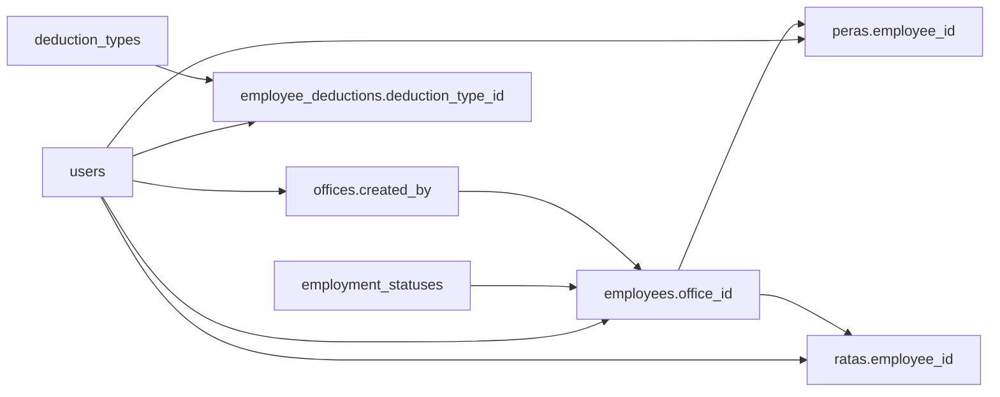

# Database Schema & Migrations

<cite>
**Referenced Files in This Document**
- [0001_01_01_000000_create_users_table.php](file://database/migrations/0001_01_01_000000_create_users_table.php)
- [0001_01_01_000001_create_cache_table.php](file://database/migrations/0001_01_01_000001_create_cache_table.php)
- [0001_01_01_000002_create_jobs_table.php](file://database/migrations/0001_01_01_000002_create_jobs_table.php)
- [2026_03_18_071422_create_offices_table.php](file://database/migrations/2026_03_18_071422_create_offices_table.php)
- [2026_03_19_014107_create_employee_statuses_table.php](file://database/migrations/2026_03_19_014107_create_employee_statuses_table.php)
- [2026_03_19_014108_create_employment_statuses_table.php](file://database/migrations/2026_03_19_014108_create_employment_statuses_table.php)
- [2026_03_19_022838_create_employees_table.php](file://database/migrations/2026_03_19_022838_create_employees_table.php)
- [2026_03_22_115109_add_is_rata_eligible_to_employees_table.php](file://database/migrations/2026_03_22_115109_add_is_rata_eligible_to_employees_table.php)
- [2026_03_22_115109_create_peras_table.php](file://database/migrations/2026_03_22_115109_create_peras_table.php)
- [2026_03_22_115110_create_deduction_types_table.php](file://database/migrations/2026_03_22_115110_create_deduction_types_table.php)
- [2026_03_22_115111_create_ratas_table.php](file://database/migrations/2026_03_22_115111_create_ratas_table.php)
- [2026_03_22_115112_create_employee_deductions_table.php](file://database/migrations/2026_03_22_115112_create_employee_deductions_table.php)
- [database.php](file://config/database.php)
- [User.php](file://app/Models/User.php)
- [Office.php](file://app/Models/Office.php)
- [Employee.php](file://app/Models/Employee.php)
- [DeductionType.php](file://app/Models/DeductionType.php)
- [Pera.php](file://app/Models/Pera.php)
</cite>

## Table of Contents
1. [Introduction](#introduction)
2. [Project Structure](#project-structure)
3. [Core Components](#core-components)
4. [Architecture Overview](#architecture-overview)
5. [Detailed Component Analysis](#detailed-component-analysis)
6. [Dependency Analysis](#dependency-analysis)
7. [Performance Considerations](#performance-considerations)
8. [Troubleshooting Guide](#troubleshooting-guide)
9. [Conclusion](#conclusion)
10. [Appendices](#appendices)

## Introduction
This document provides comprehensive database schema and migration documentation for the payroll and HR-related domain of the application. It covers all migration files, table structures, column definitions, primary keys, auto-increment strategies, unique constraints, foreign key relationships, indexes, soft deletes, and data type choices. It also explains the evolution of the schema through migration history, normalization principles applied, and operational considerations for production deployments.

## Project Structure
The database schema is defined via Laravel migrations under the database/migrations directory. The configuration for database connections and migration tracking is centralized in config/database.php. Eloquent models in app/Models define relationships and attribute casting that reflect the underlying schema.

```mermaid
graph TB
subgraph "Migrations"
M1["0001_01_01_000000_create_users_table.php"]
M2["0001_01_01_000001_create_cache_table.php"]
M3["0001_01_01_000002_create_jobs_table.php"]
M4["2026_03_18_071422_create_offices_table.php"]
M5["2026_03_19_014107_create_employee_statuses_table.php"]
M6["2026_03_19_014108_create_employment_statuses_table.php"]
M7["2026_03_19_022838_create_employees_table.php"]
M8["2026_03_22_115109_add_is_rata_eligible_to_employees_table.php"]
M9["2026_03_22_115109_create_peras_table.php"]
M10["2026_03_22_115110_create_deduction_types_table.php"]
M11["2026_03_22_115111_create_ratas_table.php"]
M12["2026_03_22_115112_create_employee_deductions_table.php"]
end
subgraph "Config"
C["config/database.php"]
end
M1 --> C
M2 --> C
M3 --> C
M4 --> C
M5 --> C
M6 --> C
M7 --> C
M8 --> C
M9 --> C
M10 --> C
M11 --> C
M12 --> C
```



**Diagram sources**
- [0001_01_01_000000_create_users_table.php:1-50](file://database/migrations/0001_01_01_000000_create_users_table.php#L1-L50)
- [0001_01_01_000001_create_cache_table.php:1-36](file://database/migrations/0001_01_01_000001_create_cache_table.php#L1-L36)
- [0001_01_01_000002_create_jobs_table.php:1-58](file://database/migrations/0001_01_01_000002_create_jobs_table.php#L1-L58)
- [2026_03_18_071422_create_offices_table.php:1-32](file://database/migrations/2026_03_18_071422_create_offices_table.php#L1-L32)
- [2026_03_19_014107_create_employee_statuses_table.php:1-31](file://database/migrations/2026_03_19_014107_create_employee_statuses_table.php#L1-L31)
- [2026_03_19_014108_create_employment_statuses_table.php:1-31](file://database/migrations/2026_03_19_014108_create_employment_statuses_table.php#L1-L31)
- [2026_03_19_022838_create_employees_table.php:1-38](file://database/migrations/2026_03_19_022838_create_employees_table.php#L1-L38)
- [2026_03_22_115109_add_is_rata_eligible_to_employees_table.php:1-29](file://database/migrations/2026_03_22_115109_add_is_rata_eligible_to_employees_table.php#L1-L29)
- [2026_03_22_115109_create_peras_table.php:1-32](file://database/migrations/2026_03_22_115109_create_peras_table.php#L1-L32)
- [2026_03_22_115110_create_deduction_types_table.php:1-32](file://database/migrations/2026_03_22_115110_create_deduction_types_table.php#L1-L32)
- [2026_03_22_115111_create_ratas_table.php:1-32](file://database/migrations/2026_03_22_115111_create_ratas_table.php#L1-L32)
- [2026_03_22_115112_create_employee_deductions_table.php:1-38](file://database/migrations/2026_03_22_115112_create_employee_deductions_table.php#L1-L38)
- [database.php:1-175](file://config/database.php#L1-L175)

**Section sources**
- [database.php:1-175](file://config/database.php#L1-L175)

## Core Components
This section summarizes the core schema components and their roles in the payroll/HR domain.

- Users and Sessions
  - Users table stores authentication credentials and metadata.
  - Sessions table tracks user sessions with indexed user_id and last_activity.
  - Password reset tokens table supports password reset flows.
- Caching and Jobs
  - Cache and cache_locks tables support application caching.
  - Jobs, job_batches, and failed_jobs tables support queued job processing.
- Organization and Statuses
  - Offices table defines organizational units with soft deletes and creator linkage.
  - Employee statuses and employment statuses tables define status catalogs with soft deletes and creator linkage.
- Employees and Compensation
  - Employees table links to employment status, office, and creator; includes image path and eligibility flag.
  - Pera and Rata tables store compensation adjustments with amounts and effective dates.
  - Deduction types table defines deduction categories with unique codes and activity flag.
  - Employee deductions table records period-specific deductions with a composite unique constraint.

**Section sources**
- [0001_01_01_000000_create_users_table.php:14-38](file://database/migrations/0001_01_01_000000_create_users_table.php#L14-L38)
- [0001_01_01_000001_create_cache_table.php:14-24](file://database/migrations/0001_01_01_000001_create_cache_table.php#L14-L24)
- [0001_01_01_000002_create_jobs_table.php:14-45](file://database/migrations/0001_01_01_000002_create_jobs_table.php#L14-L45)
- [2026_03_18_071422_create_offices_table.php:14-21](file://database/migrations/2026_03_18_071422_create_offices_table.php#L14-L21)
- [2026_03_19_014107_create_employee_statuses_table.php:14-20](file://database/migrations/2026_03_19_014107_create_employee_statuses_table.php#L14-L20)
- [2026_03_19_014108_create_employment_statuses_table.php:14-20](file://database/migrations/2026_03_19_014108_create_employment_statuses_table.php#L14-L20)
- [2026_03_19_022838_create_employees_table.php:14-27](file://database/migrations/2026_03_19_022838_create_employees_table.php#L14-L27)
- [2026_03_22_115109_add_is_rata_eligible_to_employees_table.php:14-16](file://database/migrations/2026_03_22_115109_add_is_rata_eligible_to_employees_table.php#L14-L16)
- [2026_03_22_115109_create_peras_table.php:14-21](file://database/migrations/2026_03_22_115109_create_peras_table.php#L14-L21)
- [2026_03_22_115110_create_deduction_types_table.php:14-21](file://database/migrations/2026_03_22_115110_create_deduction_types_table.php#L14-L21)
- [2026_03_22_115111_create_ratas_table.php:14-21](file://database/migrations/2026_03_22_115111_create_ratas_table.php#L14-L21)
- [2026_03_22_115112_create_employee_deductions_table.php:14-27](file://database/migrations/2026_03_22_115112_create_employee_deductions_table.php#L14-L27)

## Architecture Overview
The schema follows normalized relational design with explicit foreign keys, soft deletes, and timestamps. It separates concerns across authentication, organization, employee records, compensations (PERA/RATA), and deductions. The migration order ensures referential integrity by creating parent tables before child tables.

```mermaid
erDiagram
USERS {
int id PK
string name
string email UK
datetime email_verified_at
string password
string remember_token
timestamps timestamps
}
OFFICES {
int id PK
string name
string code
int created_by FK
timestamps timestamps
soft_delete deleted_at
}
EMPLOYMENT_STATUSES {
int id PK
string name
int created_by FK
timestamps timestamps
soft_delete deleted_at
}
EMPLOYEE_STATUSES {
int id PK
string name
int created_by FK
timestamps timestamps
soft_delete deleted_at
}
EMPLOYEES {
int id PK
string first_name
string middle_name
string last_name
string suffix
string position
string image_path
int employment_status_id FK
int office_id FK
int created_by FK
boolean is_rata_eligible
timestamps timestamps
soft_delete deleted_at
}
PERAS {
int id PK
int employee_id FK
decimal amount
date effective_date
int created_by FK
timestamps timestamps
}
RATAS {
int id PK
int employee_id FK
decimal amount
date effective_date
int created_by FK
timestamps timestamps
}
DEDUCTION_TYPES {
int id PK
string name
string code UK
text description
boolean is_active
timestamps timestamps
}
EMPLOYEE_DEDUCTIONS {
int id PK
int employee_id FK
int deduction_type_id FK
decimal amount
tinyint pay_period_month
smallint pay_period_year
text notes
int created_by FK
timestamps timestamps
unique employee_deduction_unique(employee_id, deduction_type_id, pay_period_month, pay_period_year)
}
USERS ||--o{ OFFICES : "created_by"
USERS ||--o{ EMPLOYEES : "created_by"
USERS ||--o{ PERAS : "created_by"
USERS ||--o{ RATAS : "created_by"
USERS ||--o{ EMPLOYEE_DEDUCTIONS : "created_by"
EMPLOYMENT_STATUSES ||--o{ EMPLOYEES : "employment_status_id"
OFFICES ||--o{ EMPLOYEES : "office_id"
EMPLOYEES ||--o{ PERAS : "employee_id"
EMPLOYEES ||--o{ RATAS : "employee_id"
EMPLOYEES ||--o{ EMPLOYEE_DEDUCTIONS : "employee_id"
DEDUCTION_TYPES ||--o{ EMPLOYEE_DEDUCTIONS : "deduction_type_id"
```

**Diagram sources**
- [0001_01_01_000000_create_users_table.php:14-38](file://database/migrations/0001_01_01_000000_create_users_table.php#L14-L38)
- [2026_03_18_071422_create_offices_table.php:14-21](file://database/migrations/2026_03_18_071422_create_offices_table.php#L14-L21)
- [2026_03_19_014107_create_employee_statuses_table.php:14-20](file://database/migrations/2026_03_19_014107_create_employee_statuses_table.php#L14-L20)
- [2026_03_19_014108_create_employment_statuses_table.php:14-20](file://database/migrations/2026_03_19_014108_create_employment_statuses_table.php#L14-L20)
- [2026_03_19_022838_create_employees_table.php:14-27](file://database/migrations/2026_03_19_022838_create_employees_table.php#L14-L27)
- [2026_03_22_115109_create_peras_table.php:14-21](file://database/migrations/2026_03_22_115109_create_peras_table.php#L14-L21)
- [2026_03_22_115111_create_ratas_table.php:14-21](file://database/migrations/2026_03_22_115111_create_ratas_table.php#L14-L21)
- [2026_03_22_115110_create_deduction_types_table.php:14-21](file://database/migrations/2026_03_22_115110_create_deduction_types_table.php#L14-L21)
- [2026_03_22_115112_create_employee_deductions_table.php:14-27](file://database/migrations/2026_03_22_115112_create_employee_deductions_table.php#L14-L27)

## Detailed Component Analysis

### Users, Password Reset Tokens, and Sessions
- Purpose: Authentication and session management.
- Primary keys: Auto-incrementing integers for users and sessions id; composite primary keys for cache and cache_locks.
- Unique constraints: email on users; key on cache and cache_locks.
- Indexes: user_id and last_activity on sessions; queue on jobs.
- Timestamps: created_at/updated_at; email_verified_at; failed_at on failed_jobs.
- Notes: Sessions table uses a string id as primary key and includes nullable user_id with index.

**Section sources**
- [0001_01_01_000000_create_users_table.php:14-38](file://database/migrations/0001_01_01_000000_create_users_table.php#L14-L38)

### Cache and Cache Locks
- Purpose: Application-level caching infrastructure.
- Primary keys: key as primary on both tables.
- Data types: value as mediumText; owner as string; expiration as integer.

**Section sources**
- [0001_01_01_000001_create_cache_table.php:14-24](file://database/migrations/0001_01_01_000001_create_cache_table.php#L14-L24)

### Jobs, Job Batches, and Failed Jobs
- Purpose: Queue processing and failure tracking.
- Primary keys: Auto-increment ids; id as primary on job_batches.
- Indexes: queue on jobs; attempts/reserved/available/created on jobs; created_at on job_batches.
- Unique constraints: uuid on failed_jobs.
- Notes: Uses unsigned integer timestamps for performance.

**Section sources**
- [0001_01_01_000002_create_jobs_table.php:14-45](file://database/migrations/0001_01_01_000002_create_jobs_table.php#L14-L45)

### Offices
- Purpose: Organizational units.
- Foreign keys: created_by references users; cascade delete enabled.
- Soft deletes: deleted_at column present.
- Indexes: created_by is implicitly indexed via foreign key; timestamps include created_at/updated_at.

**Section sources**
- [2026_03_18_071422_create_offices_table.php:14-21](file://database/migrations/2026_03_18_071422_create_offices_table.php#L14-L21)

### Employee Statuses and Employment Statuses
- Purpose: Status catalogs for employees and employment types.
- Foreign keys: created_by references users; cascade delete on employment_statuses.
- Soft deletes: deleted_at column present.

**Section sources**
- [2026_03_19_014107_create_employee_statuses_table.php:14-20](file://database/migrations/2026_03_19_014107_create_employee_statuses_table.php#L14-L20)
- [2026_03_19_014108_create_employment_statuses_table.php:14-20](file://database/migrations/2026_03_19_014108_create_employment_statuses_table.php#L14-L20)

### Employees
- Purpose: Core employee records.
- Foreign keys: employment_status_id, office_id, created_by; cascade delete on all.
- Additional columns: name parts, position, image_path, is_rata_eligible with default false.
- Soft deletes: deleted_at column present.
- Indexes: implicit foreign key indexes; timestamps.

**Section sources**
- [2026_03_19_022838_create_employees_table.php:14-27](file://database/migrations/2026_03_19_022838_create_employees_table.php#L14-L27)
- [2026_03_22_115109_add_is_rata_eligible_to_employees_table.php:14-16](file://database/migrations/2026_03_22_115109_add_is_rata_eligible_to_employees_table.php#L14-L16)

### PERA Adjustments
- Purpose: Employee PERA (Provident Emergency Relief Allowance) adjustments.
- Foreign keys: employee_id and created_by reference employees and users; cascade delete.
- Amount precision: decimal with total precision 15 and scale 2.
- Date: effective_date stored as date.

**Section sources**
- [2026_03_22_115109_create_peras_table.php:14-21](file://database/migrations/2026_03_22_115109_create_peras_table.php#L14-L21)

### Deduction Types
- Purpose: Categories of deductions with unique codes.
- Unique constraints: code is unique.
- Flags: is_active defaults to true.

**Section sources**
- [2026_03_22_115110_create_deduction_types_table.php:14-21](file://database/migrations/2026_03_22_115110_create_deduction_types_table.php#L14-L21)

### RATA Adjustments
- Purpose: Employee RATA (Regular Adjustment to Allowances and Treatments) adjustments.
- Foreign keys: employee_id and created_by reference employees and users; cascade delete.
- Amount precision: decimal with total precision 15 and scale 2.
- Date: effective_date stored as date.

**Section sources**
- [2026_03_22_115111_create_ratas_table.php:14-21](file://database/migrations/2026_03_22_115111_create_ratas_table.php#L14-L21)

### Employee Deductions
- Purpose: Periodic deductions linked to employees and deduction types.
- Foreign keys: employee_id, deduction_type_id, created_by; cascade delete.
- Amount precision: decimal with total precision 15 and scale 2.
- Pay period: pay_period_month (tinyint) and pay_period_year (smallint).
- Composite unique constraint: prevents duplicate deductions for the same employee/type/month/year.

**Section sources**
- [2026_03_22_115112_create_employee_deductions_table.php:14-27](file://database/migrations/2026_03_22_115112_create_employee_deductions_table.php#L14-L27)

### Migration Evolution and Dependencies
- Initial foundation: Users, sessions, cache, jobs, failed_jobs established early.
- Organization and statuses: Offices, employment statuses, and employee statuses created in sequence.
- Employees: Created after statuses and offices; later extended with is_rata_eligible.
- Compensations and deductions: PERA, RATA, deduction types, and employee deductions created together to support payroll processing.



**Diagram sources**
- [0001_01_01_000000_create_users_table.php:12-48](file://database/migrations/0001_01_01_000000_create_users_table.php#L12-L48)
- [2026_03_18_071422_create_offices_table.php:12-30](file://database/migrations/2026_03_18_071422_create_offices_table.php#L12-L30)
- [2026_03_19_014107_create_employee_statuses_table.php:12-29](file://database/migrations/2026_03_19_014107_create_employee_statuses_table.php#L12-L29)
- [2026_03_19_014108_create_employment_statuses_table.php:12-29](file://database/migrations/2026_03_19_014108_create_employment_statuses_table.php#L12-L29)
- [2026_03_19_022838_create_employees_table.php:12-36](file://database/migrations/2026_03_19_022838_create_employees_table.php#L12-L36)
- [2026_03_22_115109_add_is_rata_eligible_to_employees_table.php:12-27](file://database/migrations/2026_03_22_115109_add_is_rata_eligible_to_employees_table.php#L12-L27)
- [2026_03_22_115109_create_peras_table.php:12-30](file://database/migrations/2026_03_22_115109_create_peras_table.php#L12-L30)
- [2026_03_22_115110_create_deduction_types_table.php:12-30](file://database/migrations/2026_03_22_115110_create_deduction_types_table.php#L12-L30)
- [2026_03_22_115111_create_ratas_table.php:12-30](file://database/migrations/2026_03_22_115111_create_ratas_table.php#L12-L30)
- [2026_03_22_115112_create_employee_deductions_table.php:12-36](file://database/migrations/2026_03_22_115112_create_employee_deductions_table.php#L12-L36)

## Dependency Analysis
- Referential integrity: Foreign keys enforce parent-child relationships; cascade delete ensures cleanup on parent deletion.
- Soft deletes: Applied to offices, employee_statuses, employment_statuses, and employees to maintain historical audit trails.
- Indexes: Implicit indexes on foreign keys; explicit indexes on frequently queried columns (e.g., sessions.user_id, sessions.last_activity, jobs.queue).
- Unique constraints: email on users; code on deduction_types; composite unique on employee_deductions.



**Diagram sources**
- [0001_01_01_000000_create_users_table.php:19-36](file://database/migrations/0001_01_01_000000_create_users_table.php#L19-L36)
- [2026_03_18_071422_create_offices_table.php:19-20](file://database/migrations/2026_03_18_071422_create_offices_table.php#L19-L20)
- [2026_03_19_014108_create_employment_statuses_table.php:17-18](file://database/migrations/2026_03_19_014108_create_employment_statuses_table.php#L17-L18)
- [2026_03_19_022838_create_employees_table.php:22-24](file://database/migrations/2026_03_19_022838_create_employees_table.php#L22-L24)
- [2026_03_22_115109_create_peras_table.php:16-19](file://database/migrations/2026_03_22_115109_create_peras_table.php#L16-L19)
- [2026_03_22_115111_create_ratas_table.php:16-19](file://database/migrations/2026_03_22_115111_create_ratas_table.php#L16-L19)
- [2026_03_22_115110_create_deduction_types_table.php:17-17](file://database/migrations/2026_03_22_115110_create_deduction_types_table.php#L17-L17)
- [2026_03_22_115112_create_employee_deductions_table.php:16-22](file://database/migrations/2026_03_22_115112_create_employee_deductions_table.php#L16-L22)

**Section sources**
- [2026_03_18_071422_create_offices_table.php:19-20](file://database/migrations/2026_03_18_071422_create_offices_table.php#L19-L20)
- [2026_03_19_022838_create_employees_table.php:22-24](file://database/migrations/2026_03_19_022838_create_employees_table.php#L22-L24)
- [2026_03_22_115112_create_employee_deductions_table.php:26-26](file://database/migrations/2026_03_22_115112_create_employee_deductions_table.php#L26-L26)

## Performance Considerations
- Index selection: Foreign keys imply implicit indexes; ensure additional indexes on high-selectivity filters (e.g., sessions.user_id, sessions.last_activity, jobs.queue).
- Data types: Decimal(15,2) for monetary values balances precision and storage; unsigned integers for timestamps reduce negative value checks.
- Soft deletes: Enable efficient logical deletion without losing audit trail; consider partitioning or archiving strategies for large historical datasets.
- Transactions: Batch operations for job processing and payroll calculations to minimize lock contention.
- Connection settings: SQLite foreign key constraints can be toggled; MySQL/MariaDB charset/collation set to utf8mb4_unicode_ci for broader character support.

[No sources needed since this section provides general guidance]

## Troubleshooting Guide
- Migration conflicts: Ensure migrations are executed in timestamp order; check the migrations table for completed runs.
- Foreign key violations: Verify parent records exist before inserting child records; confirm cascade delete behavior aligns with expectations.
- Unique constraint violations: Deduction types require unique codes; employee_deductions enforce uniqueness by composite key.
- Session and cache tables: Validate primary key types and sizes; ensure cache value capacity meets workload needs.
- Rollback strategies: Use down() methods to drop tables; for data-sensitive environments, back up before rolling back complex migrations.

**Section sources**
- [0001_01_01_000002_create_jobs_table.php:51-56](file://database/migrations/0001_01_01_000002_create_jobs_table.php#L51-L56)
- [2026_03_22_115112_create_employee_deductions_table.php:26-26](file://database/migrations/2026_03_22_115112_create_employee_deductions_table.php#L26-L26)

## Conclusion
The schema is designed around normalized relations, explicit foreign keys, soft deletes, and precise data types suited for payroll and HR operations. Migrations are ordered to preserve referential integrity, and unique constraints prevent data anomalies. Production deployment should leverage the configured database connections, ensure proper indexing, and adopt safe migration practices with backups and rollback plans.

[No sources needed since this section summarizes without analyzing specific files]

## Appendices

### Data Type Choices and Precision
- Monetary amounts: decimal(15,2) across peras, ratas, and employee_deductions.
- Dates: date for effective_date fields.
- Timestamps: integer for job timestamps; timestamp for standard Laravel timestamps.
- Strings: varchar-like strings for names and codes; unique constraints on email and deduction code.
- Booleans: tinyint/boolean for flags like is_rata_eligible and is_active.

**Section sources**
- [2026_03_22_115109_create_peras_table.php:17-17](file://database/migrations/2026_03_22_115109_create_peras_table.php#L17-L17)
- [2026_03_22_115111_create_ratas_table.php:17-17](file://database/migrations/2026_03_22_115111_create_ratas_table.php#L17-L17)
- [2026_03_22_115112_create_employee_deductions_table.php:18-18](file://database/migrations/2026_03_22_115112_create_employee_deductions_table.php#L18-L18)

### Primary Keys and Auto-Increment
- Auto-incrementing integer primary keys on users, offices, statuses, employees, peras, ratas, deduction_types, employee_deductions.
- Explicit primary keys for cache and cache_locks using string keys.

**Section sources**
- [0001_01_01_000000_create_users_table.php:15-15](file://database/migrations/0001_01_01_000000_create_users_table.php#L15-L15)
- [0001_01_01_000001_create_cache_table.php:15-15](file://database/migrations/0001_01_01_000001_create_cache_table.php#L15-L15)
- [2026_03_18_071422_create_offices_table.php:15-15](file://database/migrations/2026_03_18_071422_create_offices_table.php#L15-L15)
- [2026_03_19_014107_create_employee_statuses_table.php:15-15](file://database/migrations/2026_03_19_014107_create_employee_statuses_table.php#L15-L15)
- [2026_03_19_014108_create_employment_statuses_table.php:15-15](file://database/migrations/2026_03_19_014108_create_employment_statuses_table.php#L15-L15)
- [2026_03_19_022838_create_employees_table.php:15-15](file://database/migrations/2026_03_19_022838_create_employees_table.php#L15-L15)
- [2026_03_22_115109_create_peras_table.php:15-15](file://database/migrations/2026_03_22_115109_create_peras_table.php#L15-L15)
- [2026_03_22_115111_create_ratas_table.php:15-15](file://database/migrations/2026_03_22_115111_create_ratas_table.php#L15-L15)
- [2026_03_22_115110_create_deduction_types_table.php:15-15](file://database/migrations/2026_03_22_115110_create_deduction_types_table.php#L15-L15)
- [2026_03_22_115112_create_employee_deductions_table.php:15-15](file://database/migrations/2026_03_22_115112_create_employee_deductions_table.php#L15-L15)

### Unique Constraints and Indexes
- Unique constraints: email on users; code on deduction_types; composite unique on employee_deductions.
- Implicit indexes: foreign keys; explicit indexes: sessions(user_id), sessions(last_activity), jobs(queue).

**Section sources**
- [0001_01_01_000000_create_users_table.php:17-17](file://database/migrations/0001_01_01_000000_create_users_table.php#L17-L17)
- [2026_03_22_115110_create_deduction_types_table.php:17-17](file://database/migrations/2026_03_22_115110_create_deduction_types_table.php#L17-L17)
- [2026_03_22_115112_create_employee_deductions_table.php:26-26](file://database/migrations/2026_03_22_115112_create_employee_deductions_table.php#L26-L26)

### Production Deployment Considerations
- Connection configuration: Ensure DB_CONNECTION matches target environment; enable foreign key constraints for SQLite; configure charset/collation for MySQL/MariaDB.
- Migration repository: Track migrations via the migrations table; keep update_date_on_publish enabled for consistent timestamps.
- Queue and cache: Validate cache table sizes and job queue indexes; monitor failed_jobs for error trends.

**Section sources**
- [database.php:19-131](file://config/database.php#L19-L131)