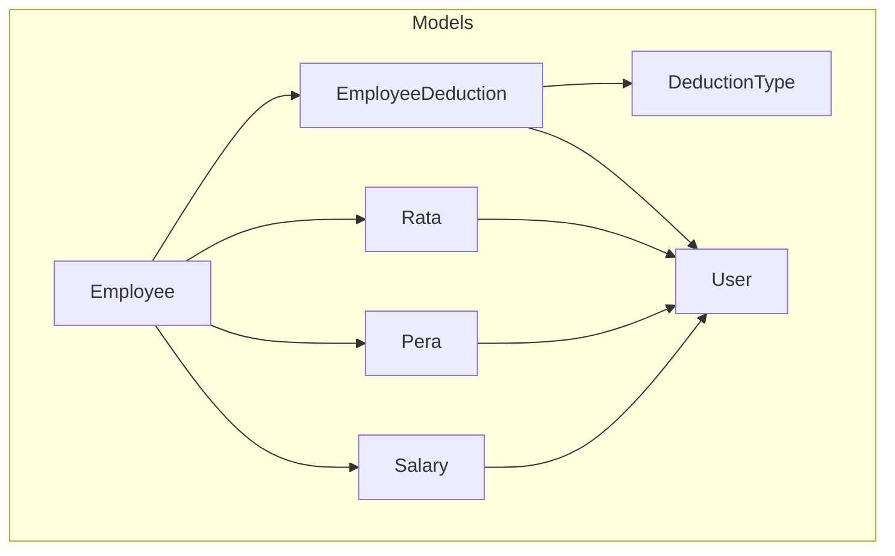
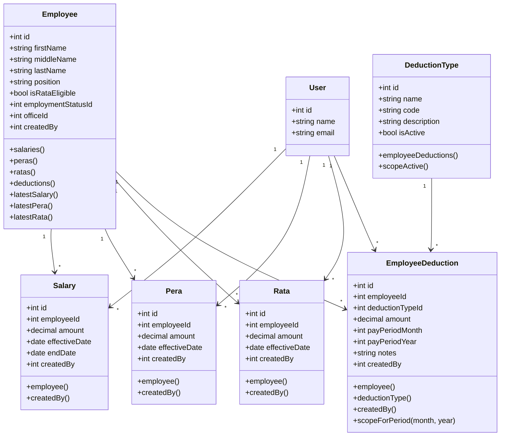
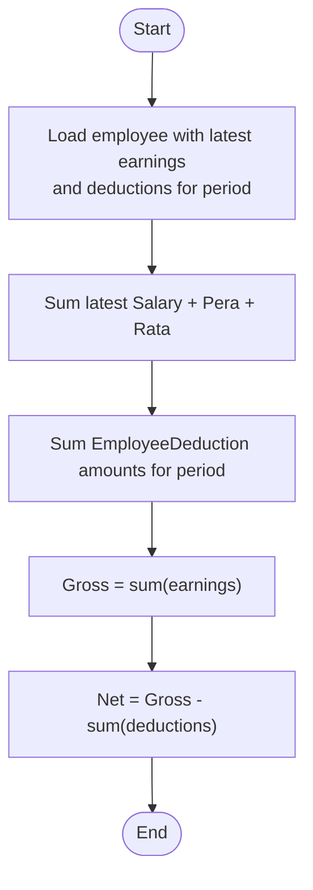
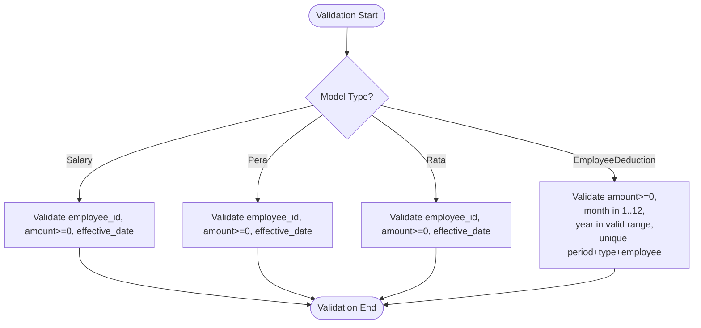
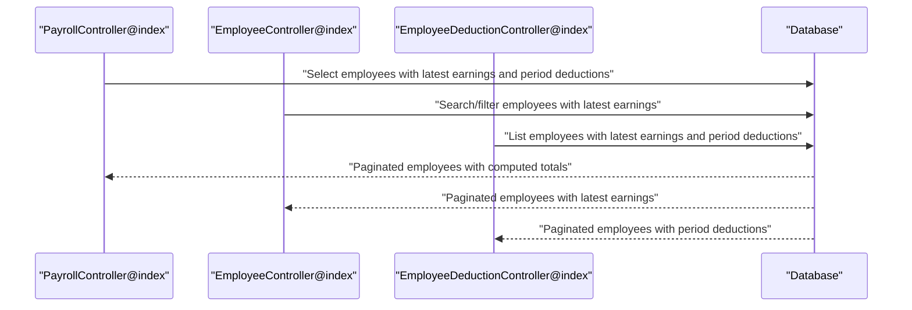
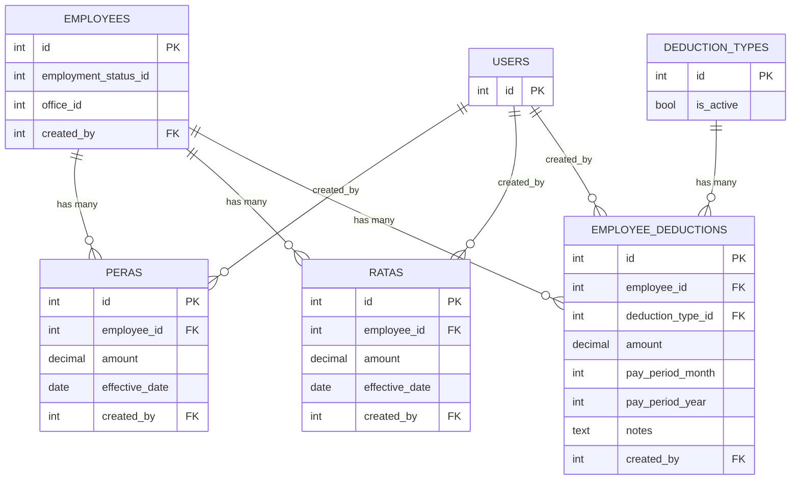

# Payroll Models

<cite>
**Referenced Files in This Document**
- [Salary.php](file://app/Models/Salary.php)
- [Pera.php](file://app/Models/Pera.php)
- [Rata.php](file://app/Models/Rata.php)
- [EmployeeDeduction.php](file://app/Models/EmployeeDeduction.php)
- [Employee.php](file://app/Models/Employee.php)
- [DeductionType.php](file://app/Models/DeductionType.php)
- [User.php](file://app/Models/User.php)
- [2026_03_22_115109_create_peras_table.php](file://database/migrations/2026_03_22_115109_create_peras_table.php)
- [2026_03_22_115111_create_ratas_table.php](file://database/migrations/2026_03_22_115111_create_ratas_table.php)
- [2026_03_22_115112_create_employee_deductions_table.php](file://database/migrations/2026_03_22_115112_create_employee_deductions_table.php)
- [PayrollController.php](file://app/Http/Controllers/PayrollController.php)
- [SalaryController.php](file://app/Http/Controllers/SalaryController.php)
- [PeraController.php](file://app/Http/Controllers/PeraController.php)
- [RataController.php](file://app/Http/Controllers/RataController.php)
- [EmployeeDeductionController.php](file://app/Http/Controllers/EmployeeDeductionController.php)
</cite>

## Table of Contents
1. [Introduction](#introduction)
2. [Project Structure](#project-structure)
3. [Core Components](#core-components)
4. [Architecture Overview](#architecture-overview)
5. [Detailed Component Analysis](#detailed-component-analysis)
6. [Dependency Analysis](#dependency-analysis)
7. [Performance Considerations](#performance-considerations)
8. [Troubleshooting Guide](#troubleshooting-guide)
9. [Conclusion](#conclusion)

## Introduction
This document provides comprehensive data model documentation for payroll-related entities in the application. It focuses on Salary, Pera, Rata, and EmployeeDeduction models, detailing their fields, monetary calculations, date-based processing logic, and relationships to employees and deduction types. It also explains business rules for payroll periods, benefit calculations, deduction applications, validation for financial amounts, and query patterns for payroll reporting and audit trails.

## Project Structure
The payroll domain is implemented using Laravel Eloquent models and controllers. The relevant models are:
- Salary: base salary amount with effective dates
- Pera: a benefit amount with effective dates
- Rata: a benefit amount with effective dates
- EmployeeDeduction: employee-specific deductions applied during a pay period
- Employee: belongs to EmploymentStatus and Office, and has many Salary, Pera, Rata, and EmployeeDeduction records
- DeductionType: classification of deductions with activation flag
- User: system user who creates payroll records



**Diagram sources**
- [Salary.php:26-34](file://app/Models/Salary.php#L26-L34)
- [Pera.php:22-30](file://app/Models/Pera.php#L22-L30)
- [Rata.php:22-30](file://app/Models/Rata.php#L22-L30)
- [EmployeeDeduction.php:26-39](file://app/Models/EmployeeDeduction.php#L26-L39)
- [Employee.php:46-64](file://app/Models/Employee.php#L46-L64)
- [DeductionType.php:20-23](file://app/Models/DeductionType.php#L20-L23)
- [User.php:10-49](file://app/Models/User.php#L10-L49)

**Section sources**
- [Salary.php:1-36](file://app/Models/Salary.php#L1-L36)
- [Pera.php:1-41](file://app/Models/Pera.php#L1-L41)
- [Rata.php:1-41](file://app/Models/Rata.php#L1-L41)
- [EmployeeDeduction.php:1-59](file://app/Models/EmployeeDeduction.php#L1-L59)
- [Employee.php:1-104](file://app/Models/Employee.php#L1-L104)
- [DeductionType.php:1-33](file://app/Models/DeductionType.php#L1-L33)
- [User.php:1-49](file://app/Models/User.php#L1-L49)

## Core Components
This section documents the four primary payroll models and their relationships.

- Salary
  - Purpose: Stores current or historical basic salary amounts with effective and end dates.
  - Monetary field: amount (decimal with 2 decimals)
  - Date fields: effective_date, end_date
  - Relationships: belongs to Employee and User (created_by)
  - Validation: numeric, min 0; date required
  - Business rule: latest effective_date determines current salary per employee

- Pera
  - Purpose: Stores employee benefit amounts with effective dates.
  - Monetary field: amount (decimal with 2 decimals)
  - Date fields: effective_date
  - Relationships: belongs to Employee and User (created_by)
  - Validation: numeric, min 0; date required
  - Business rule: latest effective_date determines current benefit per employee

- Rata
  - Purpose: Stores employee benefit amounts with effective dates.
  - Monetary field: amount (decimal with 2 decimals)
  - Date fields: effective_date
  - Relationships: belongs to Employee and User (created_by)
  - Validation: numeric, min 0; date required
  - Business rule: latest effective_date determines current benefit per employee

- EmployeeDeduction
  - Purpose: Applies deductions to employees for a specific pay period.
  - Monetary field: amount (decimal with 2 decimals)
  - Period fields: pay_period_month (1–12), pay_period_year (min/max constraints)
  - Notes: optional free-text notes
  - Relationships: belongs to Employee, DeductionType, and User (created_by)
  - Validation: amount min 0; month 1–12; year within acceptable range
  - Business rule: unique constraint prevents duplicate deductions per employee/type/month/year

**Section sources**
- [Salary.php:12-24](file://app/Models/Salary.php#L12-L24)
- [Pera.php:10-20](file://app/Models/Pera.php#L10-L20)
- [Rata.php:10-20](file://app/Models/Rata.php#L10-L20)
- [EmployeeDeduction.php:10-24](file://app/Models/EmployeeDeduction.php#L10-L24)
- [2026_03_22_115112_create_employee_deductions_table.php:14-27](file://database/migrations/2026_03_22_115112_create_employee_deductions_table.php#L14-L27)

## Architecture Overview
The payroll calculation pipeline aggregates employee earnings and deductions for a given pay period. The PayrollController orchestrates queries to compute gross pay and net pay per employee.

```mermaid
sequenceDiagram
participant C as "PayrollController"
participant E as "Employee"
participant S as "Salary"
participant P as "Pera"
participant R as "Rata"
participant D as "EmployeeDeduction"
C->>E : "Load with latest salary/pera/rata"
C->>E : "Filter deductions by pay_period_month/year"
E-->>C : "Collections of earnings and deductions"
C->>S : "Latest effective_date"
C->>P : "Latest effective_date"
C->>R : "Latest effective_date"
C->>D : "Sum(amount)"
C->>C : "Compute gross = sum(earnings); net = gross - sum(deductions)"
C-->>C : "Attach computed totals to employee"
```

**Diagram sources**
- [PayrollController.php:20-67](file://app/Http/Controllers/PayrollController.php#L20-L67)
- [Employee.php:69-88](file://app/Models/Employee.php#L69-L88)
- [EmployeeDeduction.php:53-57](file://app/Models/EmployeeDeduction.php#L53-L57)

**Section sources**
- [PayrollController.php:13-81](file://app/Http/Controllers/PayrollController.php#L13-L81)
- [Employee.php:46-88](file://app/Models/Employee.php#L46-L88)
- [EmployeeDeduction.php:53-57](file://app/Models/EmployeeDeduction.php#L53-L57)

## Detailed Component Analysis

### Data Model Definitions and Relationships


**Diagram sources**
- [Employee.php:46-64](file://app/Models/Employee.php#L46-L64)
- [DeductionType.php:20-31](file://app/Models/DeductionType.php#L20-L31)
- [Salary.php:26-34](file://app/Models/Salary.php#L26-L34)
- [Pera.php:22-30](file://app/Models/Pera.php#L22-L30)
- [Rata.php:22-30](file://app/Models/Rata.php#L22-L30)
- [EmployeeDeduction.php:26-39](file://app/Models/EmployeeDeduction.php#L26-L39)
- [User.php:10-49](file://app/Models/User.php#L10-L49)

**Section sources**
- [Employee.php:14-64](file://app/Models/Employee.php#L14-L64)
- [DeductionType.php:9-31](file://app/Models/DeductionType.php#L9-L31)
- [Salary.php:12-34](file://app/Models/Salary.php#L12-L34)
- [Pera.php:10-30](file://app/Models/Pera.php#L10-L30)
- [Rata.php:10-30](file://app/Models/Rata.php#L10-L30)
- [EmployeeDeduction.php:10-39](file://app/Models/EmployeeDeduction.php#L10-L39)
- [User.php:20-47](file://app/Models/User.php#L20-L47)

### Monetary Calculations and Pay Period Logic
- Gross pay computation:
  - Sum of latest Salary.amount, latest Pera.amount, and latest Rata.amount for each employee
- Net pay computation:
  - Gross pay minus total EmployeeDeduction.amount for the selected pay period
- Pay period selection:
  - Month and year are passed via request and used to filter EmployeeDeduction records
  - DeductionType scope supports active-only filtering



**Diagram sources**
- [PayrollController.php:49-67](file://app/Http/Controllers/PayrollController.php#L49-L67)
- [Employee.php:69-88](file://app/Models/Employee.php#L69-L88)
- [EmployeeDeduction.php:53-57](file://app/Models/EmployeeDeduction.php#L53-L57)

**Section sources**
- [PayrollController.php:48-67](file://app/Http/Controllers/PayrollController.php#L48-L67)
- [EmployeeDeduction.php:53-57](file://app/Models/EmployeeDeduction.php#L53-L57)

### Data Validation Rules
- SalaryController.store validates:
  - employee_id exists in employees
  - amount numeric and min 0
  - effective_date required and valid date
- PeraController.store and RataController.store mirror SalaryController.store validations
- EmployeeDeductionController.index enforces:
  - amount min 0
  - pay_period_month between 1 and 12
  - pay_period_year within acceptable range
  - uniqueness at database level (unique constraint on employee_id, deduction_type_id, pay_period_month, pay_period_year)
- DeductionType scopeActive filters only active deduction types



**Diagram sources**
- [SalaryController.php:49-65](file://app/Http/Controllers/SalaryController.php#L49-L65)
- [PeraController.php:49-65](file://app/Http/Controllers/PeraController.php#L49-L65)
- [RataController.php:50-66](file://app/Http/Controllers/RataController.php#L50-L66)
- [EmployeeDeductionController.php:54-87](file://app/Http/Controllers/EmployeeDeductionController.php#L54-L87)
- [2026_03_22_115112_create_employee_deductions_table.php:25-27](file://database/migrations/2026_03_22_115112_create_employee_deductions_table.php#L25-L27)

**Section sources**
- [SalaryController.php:49-65](file://app/Http/Controllers/SalaryController.php#L49-L65)
- [PeraController.php:49-65](file://app/Http/Controllers/PeraController.php#L49-L65)
- [RataController.php:50-66](file://app/Http/Controllers/RataController.php#L50-L66)
- [EmployeeDeductionController.php:54-87](file://app/Http/Controllers/EmployeeDeductionController.php#L54-L87)
- [2026_03_22_115112_create_employee_deductions_table.php:25-27](file://database/migrations/2026_03_22_115112_create_employee_deductions_table.php#L25-L27)

### Query Patterns for Payroll Reporting and Audit Trails
- Payroll listing and summary:
  - Load employees with latest earnings and deductions for the selected period
  - Paginate with query string preservation
  - Attach computed gross and net pay per employee
- Employee detail view:
  - Load salary, pera, and rata histories ordered by effective_date descending
  - Load deductions for the selected period with deduction type eager loaded
- Deduction listing:
  - Filter by office and search terms
  - Eager load latest earnings and deductions for the selected period
  - Provide active deduction types for selection
- Audit trail:
  - All models record created_by via model boot creating hook
  - Employee images use Storage::url for retrieval



**Diagram sources**
- [PayrollController.php:20-46](file://app/Http/Controllers/PayrollController.php#L20-L46)
- [EmployeeDeductionController.php:21-38](file://app/Http/Controllers/EmployeeDeductionController.php#L21-L38)
- [SalaryController.php:17-26](file://app/Http/Controllers/SalaryController.php#L17-L26)

**Section sources**
- [PayrollController.php:13-81](file://app/Http/Controllers/PayrollController.php#L13-L81)
- [EmployeeDeductionController.php:14-52](file://app/Http/Controllers/EmployeeDeductionController.php#L14-L52)
- [SalaryController.php:13-34](file://app/Http/Controllers/SalaryController.php#L13-L34)

## Dependency Analysis
- Foreign keys:
  - peras.employee_id → employees(id) with cascade delete
  - peras.created_by → users(id) with cascade delete
  - ratas.employee_id → employees(id) with cascade delete
  - ratas.created_by → users(id) with cascade delete
  - employee_deductions.employee_id → employees(id) with cascade delete
  - employee_deductions.deduction_type_id → deduction_types(id) with cascade delete
  - employee_deductions.created_by → users(id) with cascade delete
- Uniqueness:
  - employee_deductions has a unique composite index on (employee_id, deduction_type_id, pay_period_month, pay_period_year)
- Scopes:
  - DeductionType.scopeActive filters active deductions
  - EmployeeDeduction.scopeForPeriod filters by month and year



**Diagram sources**
- [2026_03_22_115109_create_peras_table.php:14-21](file://database/migrations/2026_03_22_115109_create_peras_table.php#L14-L21)
- [2026_03_22_115111_create_ratas_table.php:14-21](file://database/migrations/2026_03_22_115111_create_ratas_table.php#L14-L21)
- [2026_03_22_115112_create_employee_deductions_table.php:14-27](file://database/migrations/2026_03_22_115112_create_employee_deductions_table.php#L14-L27)

**Section sources**
- [2026_03_22_115109_create_peras_table.php:14-21](file://database/migrations/2026_03_22_115109_create_peras_table.php#L14-L21)
- [2026_03_22_115111_create_ratas_table.php:14-21](file://database/migrations/2026_03_22_115111_create_ratas_table.php#L14-L21)
- [2026_03_22_115112_create_employee_deductions_table.php:14-27](file://database/migrations/2026_03_22_115112_create_employee_deductions_table.php#L14-L27)

## Performance Considerations
- Indexing and constraints:
  - Unique composite index on employee_deductions prevents duplicate entries and speeds up conflict checks
- Query optimization:
  - Use limit(1) on latest earnings eager loads to avoid N+1 selects
  - Apply where clauses for pay period early in queries
- Casting:
  - Decimal casting ensures precise financial arithmetic
- Pagination:
  - Controllers paginate results with query string preservation for efficient browsing

## Troubleshooting Guide
- Duplicate deduction error:
  - Symptom: Adding a deduction for the same employee/type/month/year fails
  - Cause: Unique constraint violation
  - Resolution: Adjust period or type, or update existing record
  - Reference: [2026_03_22_115112_create_employee_deductions_table.php:25-27](file://database/migrations/2026_03_22_115112_create_employee_deductions_table.php#L25-L27)
- Validation failures:
  - Amount negative or invalid: ensure amount >= 0 and numeric
  - Month out of range: ensure 1 <= month <= 12
  - Year out of range: ensure year within configured bounds
  - References:
    - [SalaryController.php:51-55](file://app/Http/Controllers/SalaryController.php#L51-L55)
    - [PeraController.php:51-55](file://app/Http/Controllers/PeraController.php#L51-L55)
    - [RataController.php:52-56](file://app/Http/Controllers/RataController.php#L52-L56)
    - [EmployeeDeductionController.php:56-63](file://app/Http/Controllers/EmployeeDeductionController.php#L56-L63)
- Latest record retrieval:
  - If latest earnings are missing, gross pay will be computed from zero; verify effective_date ordering and presence of records
  - References:
    - [Employee.php:69-88](file://app/Models/Employee.php#L69-L88)
    - [PayrollController.php:30-43](file://app/Http/Controllers/PayrollController.php#L30-L43)

**Section sources**
- [2026_03_22_115112_create_employee_deductions_table.php:25-27](file://database/migrations/2026_03_22_115112_create_employee_deductions_table.php#L25-L27)
- [SalaryController.php:51-55](file://app/Http/Controllers/SalaryController.php#L51-L55)
- [PeraController.php:51-55](file://app/Http/Controllers/PeraController.php#L51-L55)
- [RataController.php:52-56](file://app/Http/Controllers/RataController.php#L52-L56)
- [EmployeeDeductionController.php:56-63](file://app/Http/Controllers/EmployeeDeductionController.php#L56-L63)
- [Employee.php:69-88](file://app/Models/Employee.php#L69-L88)
- [PayrollController.php:30-43](file://app/Http/Controllers/PayrollController.php#L30-L43)

## Conclusion
The payroll data model centers on four core entities—Salary, Pera, Rata, and EmployeeDeduction—each with precise monetary casting and date-based effective periods. Controllers implement robust query patterns to compute gross and net pay per employee for a selected pay period, while enforcing validation and uniqueness constraints to maintain data integrity. Deduction types support active filtering, and audit trails capture creation metadata through created_by relationships.