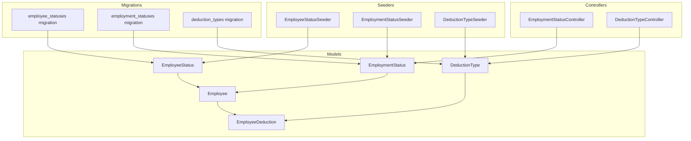
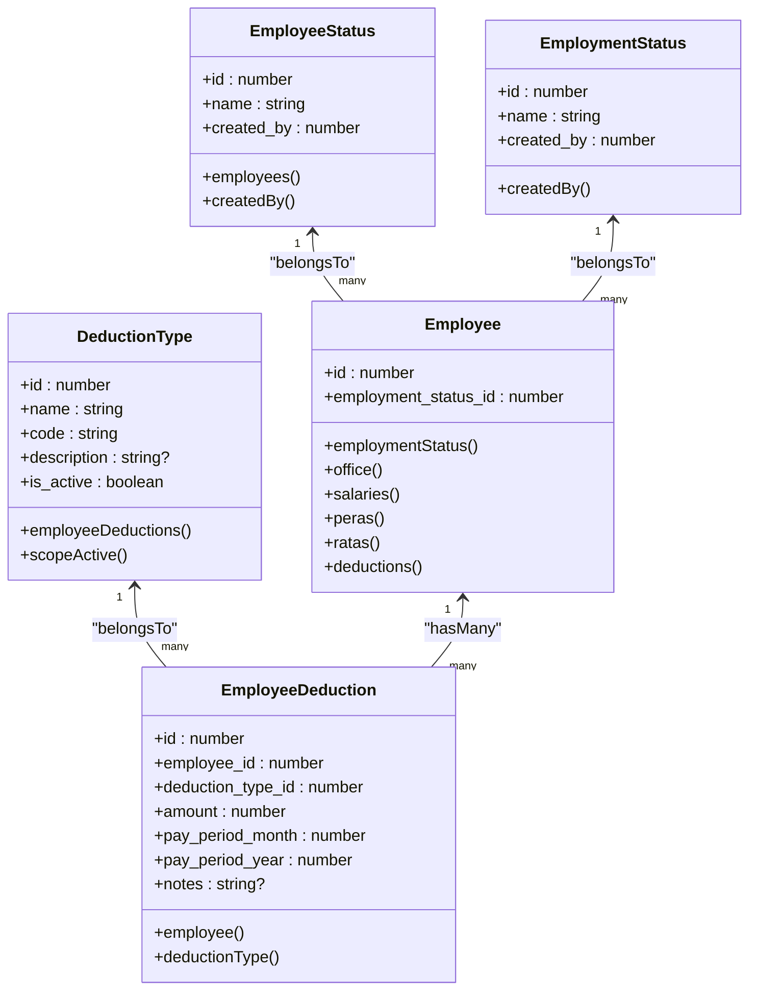
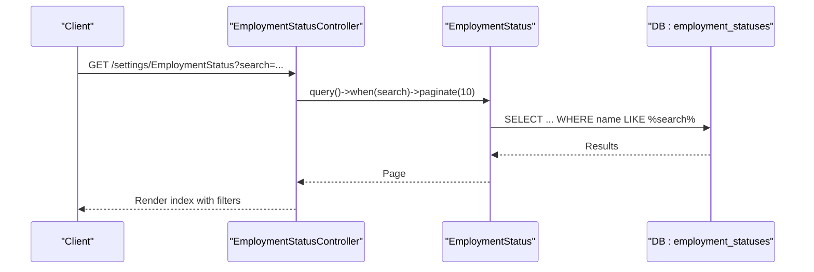
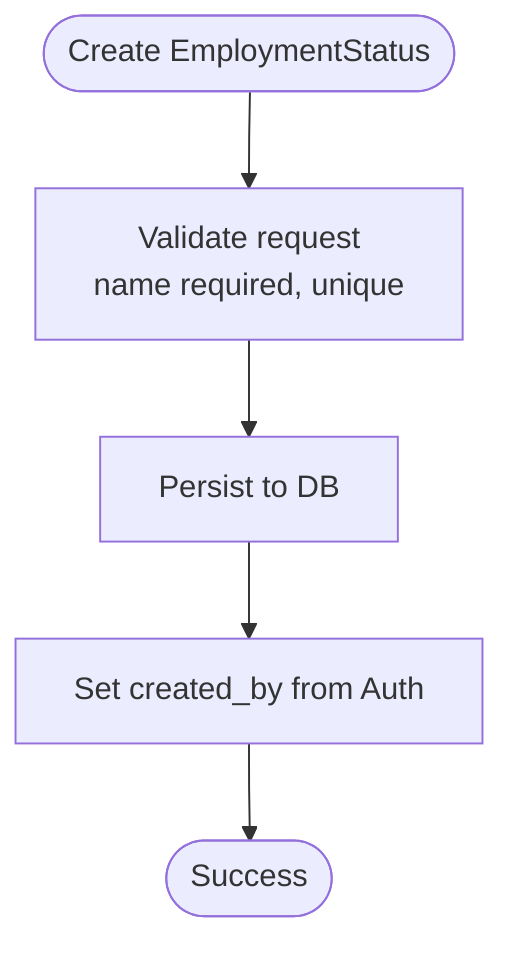
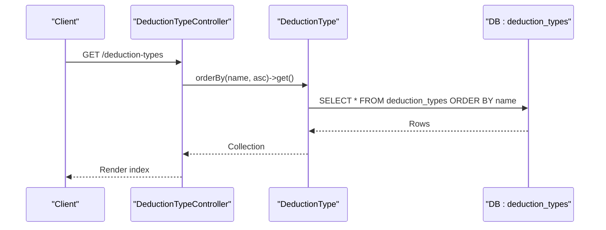
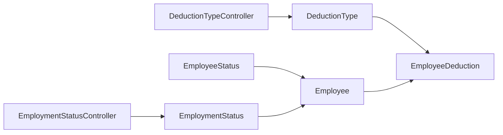

# Status Models

<cite>
**Referenced Files in This Document**
- [EmployeeStatus.php](file://app/Models/EmployeeStatus.php)
- [EmploymentStatus.php](file://app/Models/EmploymentStatus.php)
- [DeductionType.php](file://app/Models/DeductionType.php)
- [Employee.php](file://app/Models/Employee.php)
- [EmployeeDeduction.php](file://app/Models/EmployeeDeduction.php)
- [2026_03_19_014107_create_employee_statuses_table.php](file://database/migrations/2026_03_19_014107_create_employee_statuses_table.php)
- [2026_03_19_014108_create_employment_statuses_table.php](file://database/migrations/2026_03_19_014108_create_employment_statuses_table.php)
- [2026_03_22_115110_create_deduction_types_table.php](file://database/migrations/2026_03_22_115110_create_deduction_types_table.php)
- [EmployeeStatusSeeder.php](file://database/seeders/EmployeeStatusSeeder.php)
- [EmploymentStatusSeeder.php](file://database/seeders/EmploymentStatusSeeder.php)
- [DeductionTypeSeeder.php](file://database/seeders/DeductionTypeSeeder.php)
- [EmploymentStatusController.php](file://app/Http/Controllers/EmploymentStatusController.php)
- [DeductionTypeController.php](file://app/Http/Controllers/DeductionTypeController.php)
- [employeeStatus.d.ts](file://resources/js/types/employeeStatus.d.ts)
- [employmentStatuses.d.ts](file://resources/js/types/employmentStatuses.d.ts)
- [deductionType.d.ts](file://resources/js/types/deductionType.d.ts)
</cite>

## Table of Contents
1. [Introduction](#introduction)
2. [Project Structure](#project-structure)
3. [Core Components](#core-components)
4. [Architecture Overview](#architecture-overview)
5. [Detailed Component Analysis](#detailed-component-analysis)
6. [Dependency Analysis](#dependency-analysis)
7. [Performance Considerations](#performance-considerations)
8. [Troubleshooting Guide](#troubleshooting-guide)
9. [Conclusion](#conclusion)
10. [Appendices](#appendices)

## Introduction
This document provides comprehensive data model documentation for status and classification entities focused on EmployeeStatus, EmploymentStatus, and DeductionType. It covers lookup tables, reference data, classification hierarchies, field definitions, business rules, validation, and query patterns. These models underpin employee lifecycle states, employment classifications, and deduction categorization across the payroll and HR-related subsystems.

## Project Structure
The relevant models and supporting artifacts are organized as follows:
- Models define Eloquent relationships and attributes for EmployeeStatus, EmploymentStatus, DeductionType, Employee, and EmployeeDeduction.
- Migrations define the underlying database schema for each lookup/reference table.
- Seeders populate initial reference data for statuses and deduction types.
- Controllers expose CRUD operations and basic filtering/search for EmploymentStatus and DeductionType.
- TypeScript types define frontend contracts for these models.

**Diagram sources**
- [EmployeeStatus.php:1-37](file://app/Models/EmployeeStatus.php#L1-L37)
- [EmploymentStatus.php:1-32](file://app/Models/EmploymentStatus.php#L1-L32)
- [DeductionType.php:1-33](file://app/Models/DeductionType.php#L1-L33)
- [Employee.php:1-104](file://app/Models/Employee.php#L1-L104)
- [EmployeeDeduction.php:1-59](file://app/Models/EmployeeDeduction.php#L1-L59)
- [2026_03_19_014107_create_employee_statuses_table.php:1-31](file://database/migrations/2026_03_19_014107_create_employee_statuses_table.php#L1-L31)
- [2026_03_19_014108_create_employment_statuses_table.php:1-31](file://database/migrations/2026_03_19_014108_create_employment_statuses_table.php#L1-L31)
- [2026_03_22_115110_create_deduction_types_table.php:1-32](file://database/migrations/2026_03_22_115110_create_deduction_types_table.php#L1-L32)
- [EmployeeStatusSeeder.php:1-27](file://database/seeders/EmployeeStatusSeeder.php#L1-L27)
- [EmploymentStatusSeeder.php:1-24](file://database/seeders/EmploymentStatusSeeder.php#L1-L24)
- [DeductionTypeSeeder.php:1-118](file://database/seeders/DeductionTypeSeeder.php#L1-L118)
- [EmploymentStatusController.php:1-58](file://app/Http/Controllers/EmploymentStatusController.php#L1-L58)
- [DeductionTypeController.php:1-55](file://app/Http/Controllers/DeductionTypeController.php#L1-L55)

**Section sources**
- [EmployeeStatus.php:1-37](file://app/Models/EmployeeStatus.php#L1-L37)
- [EmploymentStatus.php:1-32](file://app/Models/EmploymentStatus.php#L1-L32)
- [DeductionType.php:1-33](file://app/Models/DeductionType.php#L1-L33)
- [Employee.php:1-104](file://app/Models/Employee.php#L1-L104)
- [EmployeeDeduction.php:1-59](file://app/Models/EmployeeDeduction.php#L1-L59)
- [2026_03_19_014107_create_employee_statuses_table.php:1-31](file://database/migrations/2026_03_19_014107_create_employee_statuses_table.php#L1-L31)
- [2026_03_19_014108_create_employment_statuses_table.php:1-31](file://database/migrations/2026_03_19_014108_create_employment_statuses_table.php#L1-L31)
- [2026_03_22_115110_create_deduction_types_table.php:1-32](file://database/migrations/2026_03_22_115110_create_deduction_types_table.php#L1-L32)
- [EmployeeStatusSeeder.php:1-27](file://database/seeders/EmployeeStatusSeeder.php#L1-L27)
- [EmploymentStatusSeeder.php:1-24](file://database/seeders/EmploymentStatusSeeder.php#L1-L24)
- [DeductionTypeSeeder.php:1-118](file://database/seeders/DeductionTypeSeeder.php#L1-L118)
- [EmploymentStatusController.php:1-58](file://app/Http/Controllers/EmploymentStatusController.php#L1-L58)
- [DeductionTypeController.php:1-55](file://app/Http/Controllers/DeductionTypeController.php#L1-L55)

## Core Components
This section documents the three primary models and their roles in the status/classification ecosystem.

- EmployeeStatus
  - Purpose: Defines employee-level status categories (e.g., Active, Inactive, Resigned, Terminated).
  - Fields: id, name, created_by, soft-deletable timestamps.
  - Relationships: Employees belong to an EmployeeStatus; created_by references User.
  - Behavior: Automatically sets created_by during creation.

- EmploymentStatus
  - Purpose: Classifies employment types (e.g., Plantilla, COS/JO).
  - Fields: id, name, created_by, soft-deletable timestamps.
  - Relationships: Employees belong to an EmploymentStatus; created_by references User.
  - Behavior: Automatically sets created_by during creation.

- DeductionType
  - Purpose: Categorizes payroll deductions with a unique code and optional description.
  - Fields: id, name, code (unique), description, is_active (boolean), timestamps.
  - Relationships: EmployeeDeduction entries reference a DeductionType.
  - Behavior: Includes a scope to fetch only active deduction types.

**Section sources**
- [EmployeeStatus.php:1-37](file://app/Models/EmployeeStatus.php#L1-L37)
- [EmploymentStatus.php:1-32](file://app/Models/EmploymentStatus.php#L1-L32)
- [DeductionType.php:1-33](file://app/Models/DeductionType.php#L1-L33)

## Architecture Overview
The status/classification models integrate with the Employee model and EmployeeDeduction to support lifecycle tracking and payroll computations. The following diagram maps the relationships among these entities.

**Diagram sources**
- [EmployeeStatus.php:1-37](file://app/Models/EmployeeStatus.php#L1-L37)
- [EmploymentStatus.php:1-32](file://app/Models/EmploymentStatus.php#L1-L32)
- [DeductionType.php:1-33](file://app/Models/DeductionType.php#L1-L33)
- [Employee.php:1-104](file://app/Models/Employee.php#L1-L104)
- [EmployeeDeduction.php:1-59](file://app/Models/EmployeeDeduction.php#L1-L59)

## Detailed Component Analysis

### EmployeeStatus Model
- Data definition
  - Lookup table: employee_statuses
  - Columns: id, name, created_by (FK to users), soft_deletes, timestamps.
- Relationships
  - One-to-many with Employee via employees().
  - Belongs to User via createdBy() for auditability.
- Lifecycle
  - Automatically assigns created_by during model creation.
- Business rules
  - Name uniqueness is enforced at the application level via controllers.
  - Soft deletes enable historical tracking without physical removal.
- Validation and constraints
  - Controller enforces required name and uniqueness.
- Query patterns
  - Filtering by name via LIKE search in EmploymentStatusController index action.
  - Paginated retrieval with query string preservation.

**Diagram sources**
- [EmploymentStatusController.php:11-27](file://app/Http/Controllers/EmploymentStatusController.php#L11-L27)
- [EmploymentStatus.php:1-32](file://app/Models/EmploymentStatus.php#L1-L32)

**Section sources**
- [EmployeeStatus.php:1-37](file://app/Models/EmployeeStatus.php#L1-L37)
- [2026_03_19_014107_create_employee_statuses_table.php:14-20](file://database/migrations/2026_03_19_014107_create_employee_statuses_table.php#L14-L20)
- [EmployeeStatusSeeder.php:16-24](file://database/seeders/EmployeeStatusSeeder.php#L16-L24)
- [EmploymentStatusController.php:11-27](file://app/Http/Controllers/EmploymentStatusController.php#L11-L27)

### EmploymentStatus Model
- Data definition
  - Lookup table: employment_statuses
  - Columns: id, name, created_by (FK to users with cascade-on-delete), soft_deletes, timestamps.
- Relationships
  - One-to-many with Employee via employmentStatus().
  - Belongs to User via createdBy() for auditability.
- Lifecycle
  - Automatically assigns created_by during model creation.
- Business rules
  - Name uniqueness enforced at the application level.
  - Soft deletes preserve referential integrity for dependent records.
- Validation and constraints
  - Controller validates presence and uniqueness of name.
- Query patterns
  - Search by name with pagination and query string retention.
  - CRUD endpoints exposed via EmploymentStatusController.

**Diagram sources**
- [EmploymentStatusController.php:29-38](file://app/Http/Controllers/EmploymentStatusController.php#L29-L38)
- [EmploymentStatus.php:23-30](file://app/Models/EmploymentStatus.php#L23-L30)

**Section sources**
- [EmploymentStatus.php:1-32](file://app/Models/EmploymentStatus.php#L1-L32)
- [2026_03_19_014108_create_employment_statuses_table.php:14-20](file://database/migrations/2026_03_19_014108_create_employment_statuses_table.php#L14-L20)
- [EmploymentStatusSeeder.php:16-21](file://database/seeders/EmploymentStatusSeeder.php#L16-L21)
- [EmploymentStatusController.php:29-38](file://app/Http/Controllers/EmploymentStatusController.php#L29-L38)

### DeductionType Model
- Data definition
  - Lookup table: deduction_types
  - Columns: id, name, code (unique), description, is_active (default true), timestamps.
- Relationships
  - One-to-many with EmployeeDeduction via employeeDeductions().
- Lifecycle
  - No automatic created_by assignment; relies on application-level validation.
- Business rules
  - code uniqueness enforced at the database and application level.
  - is_active flag controls inclusion in payroll calculations.
  - scopeActive() filters only active deduction types.
- Validation and constraints
  - Controller validates presence and uniqueness of name and code; supports nullable description and boolean is_active.
- Query patterns
  - Ordered by name for consistent selection lists.
  - Filtered by is_active via scopeActive() for downstream processing.

**Diagram sources**
- [DeductionTypeController.php:11-18](file://app/Http/Controllers/DeductionTypeController.php#L11-L18)
- [DeductionType.php:20-32](file://app/Models/DeductionType.php#L20-L32)

**Section sources**
- [DeductionType.php:1-33](file://app/Models/DeductionType.php#L1-L33)
- [2026_03_22_115110_create_deduction_types_table.php:14-21](file://database/migrations/2026_03_22_115110_create_deduction_types_table.php#L14-L21)
- [DeductionTypeSeeder.php:15-106](file://database/seeders/DeductionTypeSeeder.php#L15-L106)
- [DeductionTypeController.php:11-18](file://app/Http/Controllers/DeductionTypeController.php#L11-L18)

## Dependency Analysis
This section maps dependencies among models and controllers to clarify coupling and cohesion.

**Diagram sources**
- [EmployeeStatus.php:18-26](file://app/Models/EmployeeStatus.php#L18-L26)
- [EmploymentStatus.php:18-21](file://app/Models/EmploymentStatus.php#L18-L21)
- [DeductionType.php:20-23](file://app/Models/DeductionType.php#L20-L23)
- [Employee.php:31-64](file://app/Models/Employee.php#L31-L64)
- [EmployeeDeduction.php:26-39](file://app/Models/EmployeeDeduction.php#L26-L39)
- [EmploymentStatusController.php:5,11-27](file://app/Http/Controllers/EmploymentStatusController.php#L5,L11-L27)
- [DeductionTypeController.php:5,11-18](file://app/Http/Controllers/DeductionTypeController.php#L5,L11-L18)

**Section sources**
- [EmployeeStatus.php:18-26](file://app/Models/EmployeeStatus.php#L18-L26)
- [EmploymentStatus.php:18-21](file://app/Models/EmploymentStatus.php#L18-L21)
- [DeductionType.php:20-23](file://app/Models/DeductionType.php#L20-L23)
- [Employee.php:31-64](file://app/Models/Employee.php#L31-L64)
- [EmployeeDeduction.php:26-39](file://app/Models/EmployeeDeduction.php#L26-L39)
- [EmploymentStatusController.php:5,11-27](file://app/Http/Controllers/EmploymentStatusController.php#L5,L11-L27)
- [DeductionTypeController.php:5,11-18](file://app/Http/Controllers/DeductionTypeController.php#L5,L11-L18)

## Performance Considerations
- Indexing
  - Ensure unique index exists on deduction_types.code for efficient lookups and updates.
  - Consider adding indexes on employment_statuses.name and employee_statuses.name for frequent searches.
- Scoping
  - Use DeductionType scopeActive() to avoid repeated filtering logic and improve readability.
- Pagination
  - Controllers already paginate results; maintain reasonable page sizes to balance responsiveness and memory usage.
- Casting
  - DeductionType is_active is cast to boolean; keep consistent casting for related numeric fields to prevent type coercion overhead.

[No sources needed since this section provides general guidance]

## Troubleshooting Guide
- DeductionType code conflicts
  - Symptom: Validation fails on create/update due to duplicate code.
  - Resolution: Ensure code uniqueness; use DeductionTypeSeeder as reference for canonical set.
- EmploymentStatus name conflicts
  - Symptom: Validation fails due to duplicate name.
  - Resolution: Enforce uniqueness at UI and controller layers; soft-deleted records do not block uniqueness checks.
- Missing created_by
  - Symptom: Audit trail incomplete.
  - Resolution: Ensure authentication is active; models automatically set created_by during creation.
- Pay period filtering
  - Symptom: EmployeeDeduction queries do not return expected results.
  - Resolution: Use EmployeeDeduction scopeForPeriod(month, year) to constrain pay period.

**Section sources**
- [DeductionTypeSeeder.php:108-116](file://database/seeders/DeductionTypeSeeder.php#L108-L116)
- [EmploymentStatusController.php:31-33](file://app/Http/Controllers/EmploymentStatusController.php#L31-L33)
- [DeductionTypeController.php:22-27](file://app/Http/Controllers/DeductionTypeController.php#L22-L27)
- [EmployeeDeduction.php:53-57](file://app/Models/EmployeeDeduction.php#L53-L57)

## Conclusion
EmployeeStatus, EmploymentStatus, and DeductionType form the backbone of classification and lookup data across the system. Their schema, relationships, and controller-backed validations ensure consistent state management and payroll categorization. Proper use of scopes, pagination, and unique constraints enables reliable querying and reporting.

[No sources needed since this section summarizes without analyzing specific files]

## Appendices

### Field Definitions and Constraints
- EmployeeStatus
  - name: string, required, unique per soft-deleted records.
  - created_by: foreignId to users.
- EmploymentStatus
  - name: string, required, unique.
  - created_by: foreignId to users with cascade-on-delete.
- DeductionType
  - name: string, required.
  - code: string, required, unique.
  - description: text, nullable.
  - is_active: boolean, default true.

**Section sources**
- [2026_03_19_014107_create_employee_statuses_table.php:14-20](file://database/migrations/2026_03_19_014107_create_employee_statuses_table.php#L14-L20)
- [2026_03_19_014108_create_employment_statuses_table.php:14-20](file://database/migrations/2026_03_19_014108_create_employment_statuses_table.php#L14-L20)
- [2026_03_22_115110_create_deduction_types_table.php:14-21](file://database/migrations/2026_03_22_115110_create_deduction_types_table.php#L14-L21)

### Business Rules Summary
- Status categories
  - EmployeeStatus: lifecycle states (e.g., Active, Inactive, Resigned, Terminated).
  - EmploymentStatus: employment type (e.g., Plantilla, COS/JO).
- DeductionType
  - Unique code per deduction category.
  - is_active determines inclusion in payroll computations.
- Inheritance relationships
  - Employee belongs to EmploymentStatus and optionally to EmployeeStatus.
  - EmployeeDeduction belongs to DeductionType and Employee.

**Section sources**
- [EmployeeStatusSeeder.php:16-24](file://database/seeders/EmployeeStatusSeeder.php#L16-L24)
- [EmploymentStatusSeeder.php:16-21](file://database/seeders/EmploymentStatusSeeder.php#L16-L21)
- [DeductionTypeSeeder.php:15-106](file://database/seeders/DeductionTypeSeeder.php#L15-L106)
- [Employee.php:31-64](file://app/Models/Employee.php#L31-L64)
- [EmployeeDeduction.php:26-39](file://app/Models/EmployeeDeduction.php#L26-L39)

### Query Patterns
- EmploymentStatus
  - Search by name with pagination and query string retention.
- DeductionType
  - Order by name for selection lists.
  - Filter by is_active using scopeActive().
- EmployeeDeduction
  - Filter by pay period using scopeForPeriod(month, year).

**Section sources**
- [EmploymentStatusController.php:11-27](file://app/Http/Controllers/EmploymentStatusController.php#L11-L27)
- [DeductionTypeController.php:11-18](file://app/Http/Controllers/DeductionTypeController.php#L11-L18)
- [DeductionType.php:28-31](file://app/Models/DeductionType.php#L28-L31)
- [EmployeeDeduction.php:53-57](file://app/Models/EmployeeDeduction.php#L53-L57)

### Frontend Type Contracts
- EmployeeStatus
  - id: number
  - name: string
  - created_by: number
- EmploymentStatus
  - id: number
  - name: string
  - created_by: number
  - EmploymentStatusCreateRequest excludes id and created_by
- DeductionType
  - id: number
  - name: string
  - code: string
  - description?: string
  - is_active: boolean
  - created_at: string
  - updated_at: string
  - DeductionTypeCreateRequest and DeductionTypeUpdateRequest define writable fields

**Section sources**
- [employeeStatus.d.ts:1-5](file://resources/js/types/employeeStatus.d.ts#L1-L5)
- [employmentStatuses.d.ts:1-7](file://resources/js/types/employmentStatuses.d.ts#L1-L7)
- [deductionType.d.ts:1-24](file://resources/js/types/deductionType.d.ts#L1-L24)