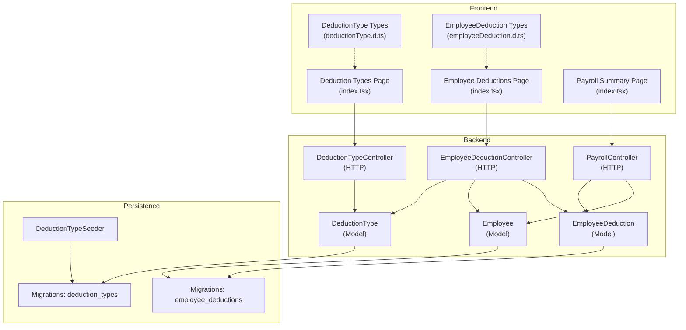
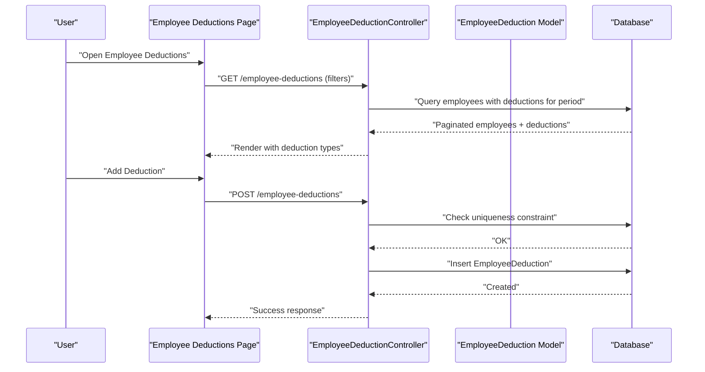
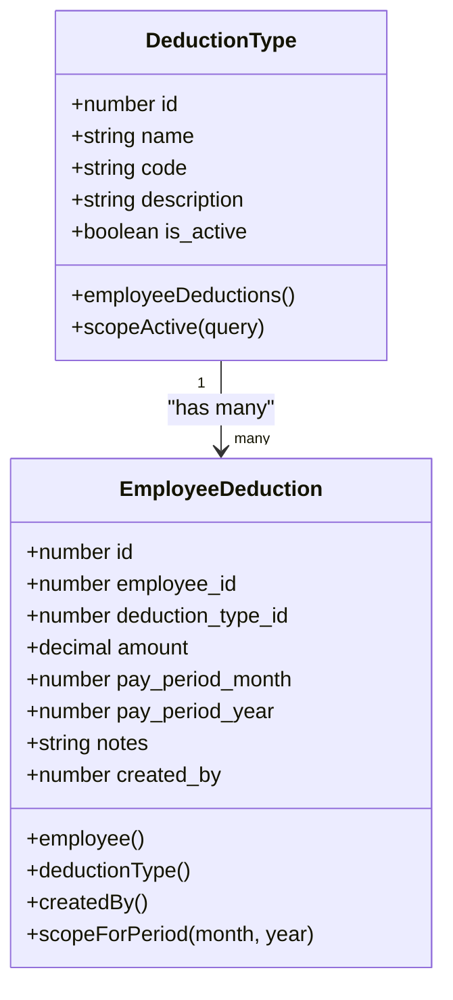
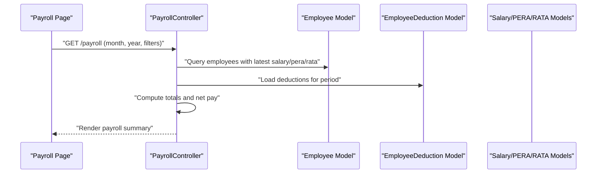
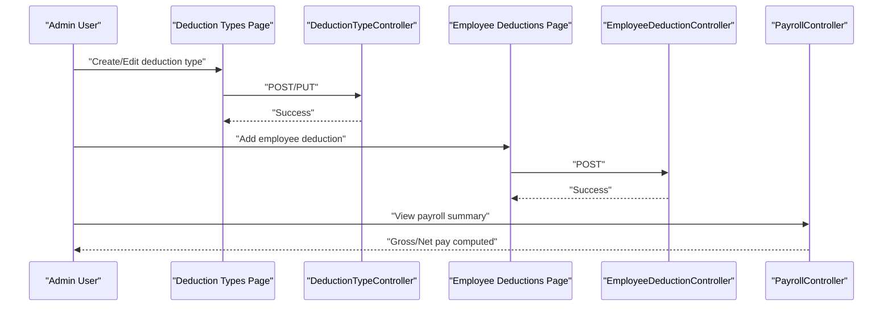
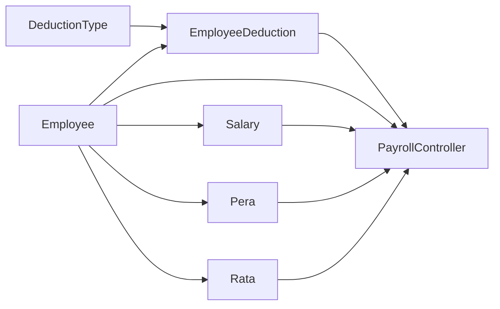

# Deduction Management

<cite>
**Referenced Files in This Document**
- [DeductionType.php](file://app/Models/DeductionType.php)
- [EmployeeDeduction.php](file://app/Models/EmployeeDeduction.php)
- [DeductionTypeController.php](file://app/Http/Controllers/DeductionTypeController.php)
- [EmployeeDeductionController.php](file://app/Http/Controllers/EmployeeDeductionController.php)
- [PayrollController.php](file://app/Http/Controllers/PayrollController.php)
- [2026_03_22_115110_create_deduction_types_table.php](file://database/migrations/2026_03_22_115110_create_deduction_types_table.php)
- [2026_03_22_115112_create_employee_deductions_table.php](file://database/migrations/2026_03_22_115112_create_employee_deductions_table.php)
- [DeductionTypeSeeder.php](file://database/seeders/DeductionTypeSeeder.php)
- [index.tsx (Deduction Types)](file://resources/js/pages/deduction-types/index.tsx)
- [index.tsx (Employee Deductions)](file://resources/js/pages/employee-deductions/index.tsx)
- [index.tsx (Payroll)](file://resources/js/pages/payroll/index.tsx)
- [deductionType.d.ts](file://resources/js/types/deductionType.d.ts)
- [employeeDeduction.d.ts](file://resources/js/types/employeeDeduction.d.ts)
- [Employee.php](file://app/Models/Employee.php)
</cite>

## Table of Contents
1. [Introduction](#introduction)
2. [Project Structure](#project-structure)
3. [Core Components](#core-components)
4. [Architecture Overview](#architecture-overview)
5. [Detailed Component Analysis](#detailed-component-analysis)
6. [Dependency Analysis](#dependency-analysis)
7. [Performance Considerations](#performance-considerations)
8. [Troubleshooting Guide](#troubleshooting-guide)
9. [Conclusion](#conclusion)
10. [Appendices](#appendices)

## Introduction
This document describes the deduction management system that supports configurable deduction categories, employee-specific deductions, and payroll impact calculations. It covers deduction types configuration, employee assignment, automatic payroll computation, reporting, audit trails, overrides, manual adjustments, historical tracking, and the user interface for administration.

## Project Structure
The deduction management system spans backend Eloquent models and controllers, frontend pages built with Inertia and React, TypeScript types, and database migrations and seeders.

**Diagram sources**
- [DeductionType.php:1-33](file://app/Models/DeductionType.php#L1-L33)
- [EmployeeDeduction.php:1-59](file://app/Models/EmployeeDeduction.php#L1-L59)
- [DeductionTypeController.php:1-55](file://app/Http/Controllers/DeductionTypeController.php#L1-L55)
- [EmployeeDeductionController.php:1-108](file://app/Http/Controllers/EmployeeDeductionController.php#L1-L108)
- [PayrollController.php:1-125](file://app/Http/Controllers/PayrollController.php#L1-L125)
- [2026_03_22_115110_create_deduction_types_table.php:1-32](file://database/migrations/2026_03_22_115110_create_deduction_types_table.php#L1-L32)
- [2026_03_22_115112_create_employee_deductions_table.php:1-38](file://database/migrations/2026_03_22_115112_create_employee_deductions_table.php#L1-L38)
- [DeductionTypeSeeder.php:1-118](file://database/seeders/DeductionTypeSeeder.php#L1-L118)
- [index.tsx (Deduction Types):1-257](file://resources/js/pages/deduction-types/index.tsx#L1-L257)
- [index.tsx (Employee Deductions):1-401](file://resources/js/pages/employee-deductions/index.tsx#L1-L401)
- [index.tsx (Payroll):1-218](file://resources/js/pages/payroll/index.tsx#L1-L218)
- [deductionType.d.ts:1-24](file://resources/js/types/deductionType.d.ts#L1-L24)
- [employeeDeduction.d.ts:1-32](file://resources/js/types/employeeDeduction.d.ts#L1-L32)

**Section sources**
- [DeductionType.php:1-33](file://app/Models/DeductionType.php#L1-L33)
- [EmployeeDeduction.php:1-59](file://app/Models/EmployeeDeduction.php#L1-L59)
- [DeductionTypeController.php:1-55](file://app/Http/Controllers/DeductionTypeController.php#L1-L55)
- [EmployeeDeductionController.php:1-108](file://app/Http/Controllers/EmployeeDeductionController.php#L1-L108)
- [PayrollController.php:1-125](file://app/Http/Controllers/PayrollController.php#L1-L125)
- [2026_03_22_115110_create_deduction_types_table.php:1-32](file://database/migrations/2026_03_22_115110_create_deduction_types_table.php#L1-L32)
- [2026_03_22_115112_create_employee_deductions_table.php:1-38](file://database/migrations/2026_03_22_115112_create_employee_deductions_table.php#L1-L38)
- [DeductionTypeSeeder.php:1-118](file://database/seeders/DeductionTypeSeeder.php#L1-L118)
- [index.tsx (Deduction Types):1-257](file://resources/js/pages/deduction-types/index.tsx#L1-L257)
- [index.tsx (Employee Deductions):1-401](file://resources/js/pages/employee-deductions/index.tsx#L1-L401)
- [index.tsx (Payroll):1-218](file://resources/js/pages/payroll/index.tsx#L1-L218)
- [deductionType.d.ts:1-24](file://resources/js/types/deductionType.d.ts#L1-L24)
- [employeeDeduction.d.ts:1-32](file://resources/js/types/employeeDeduction.d.ts#L1-L32)

## Core Components
- DeductionType: Defines deduction categories with attributes such as name, code, description, and activation flag. Includes an active scope and relationship to employee deductions.
- EmployeeDeduction: Stores employee-specific deduction records with amount, pay period (month/year), notes, creator attribution, and relationships to employee and deduction type. Includes a period scope and auto-fills created_by on creation.
- Controllers:
  - DeductionTypeController: CRUD for deduction types via Inertia-rendered page.
  - EmployeeDeductionController: Lists employees with their deductions for a pay period, creates/updates/deletes employee deductions, and prevents duplicates.
  - PayrollController: Aggregates gross pay (salary + PERA + RATA) and net pay (gross minus total deductions) per employee for a given period.
- Frontend Pages:
  - Deduction Types page: Manage deduction categories (create, update, delete) with active/inactive toggles.
  - Employee Deductions page: Assign deductions to employees per pay period, filter/search, and adjust amounts.
  - Payroll page: View payroll summary with computed gross and net pay.
- Types: Strongly typed request/response interfaces for deduction types and employee deductions.
- Seeders: Predefined deduction categories seeded into the system.

**Section sources**
- [DeductionType.php:1-33](file://app/Models/DeductionType.php#L1-L33)
- [EmployeeDeduction.php:1-59](file://app/Models/EmployeeDeduction.php#L1-L59)
- [DeductionTypeController.php:1-55](file://app/Http/Controllers/DeductionTypeController.php#L1-L55)
- [EmployeeDeductionController.php:1-108](file://app/Http/Controllers/EmployeeDeductionController.php#L1-L108)
- [PayrollController.php:1-125](file://app/Http/Controllers/PayrollController.php#L1-L125)
- [index.tsx (Deduction Types):1-257](file://resources/js/pages/deduction-types/index.tsx#L1-L257)
- [index.tsx (Employee Deductions):1-401](file://resources/js/pages/employee-deductions/index.tsx#L1-L401)
- [index.tsx (Payroll):1-218](file://resources/js/pages/payroll/index.tsx#L1-L218)
- [deductionType.d.ts:1-24](file://resources/js/types/deductionType.d.ts#L1-L24)
- [employeeDeduction.d.ts:1-32](file://resources/js/types/employeeDeduction.d.ts#L1-L32)
- [DeductionTypeSeeder.php:1-118](file://database/seeders/DeductionTypeSeeder.php#L1-L118)

## Architecture Overview
The system follows a layered architecture:
- Presentation: Inertia-driven React pages render lists, forms, and summaries.
- Application: Controllers orchestrate queries, validations, and transformations.
- Domain: Eloquent models encapsulate business relations and scopes.
- Persistence: Migrations define schema and unique constraints; seeders populate defaults.

**Diagram sources**
- [EmployeeDeductionController.php:14-52](file://app/Http/Controllers/EmployeeDeductionController.php#L14-L52)
- [EmployeeDeductionController.php:54-87](file://app/Http/Controllers/EmployeeDeductionController.php#L54-L87)
- [2026_03_22_115112_create_employee_deductions_table.php:14-27](file://database/migrations/2026_03_22_115112_create_employee_deductions_table.php#L14-L27)
- [index.tsx (Employee Deductions):104-118](file://resources/js/pages/employee-deductions/index.tsx#L104-L118)

## Detailed Component Analysis

### Deduction Categories (DeductionType)
- Purpose: Define reusable deduction categories (e.g., GSIS, PhilHealth, Withholding Tax).
- Attributes: name, code (unique), description, is_active.
- Behavior:
  - Active scope restricts queries to enabled categories.
  - Relationship to EmployeeDeduction for reporting and filtering.
- Administration:
  - Create/update/delete via DeductionTypeController.
  - UI allows toggling active state and editing metadata.
- Defaults:
  - Seed data pre-populates common categories.

**Diagram sources**
- [DeductionType.php:20-32](file://app/Models/DeductionType.php#L20-L32)
- [EmployeeDeduction.php:26-39](file://app/Models/EmployeeDeduction.php#L26-L39)

**Section sources**
- [DeductionType.php:1-33](file://app/Models/DeductionType.php#L1-L33)
- [DeductionTypeController.php:11-32](file://app/Http/Controllers/DeductionTypeController.php#L11-L32)
- [DeductionTypeController.php:34-46](file://app/Http/Controllers/DeductionTypeController.php#L34-L46)
- [DeductionTypeController.php:48-53](file://app/Http/Controllers/DeductionTypeController.php#L48-L53)
- [index.tsx (Deduction Types):26-92](file://resources/js/pages/deduction-types/index.tsx#L26-L92)
- [DeductionTypeSeeder.php:15-113](file://database/seeders/DeductionTypeSeeder.php#L15-L113)

### Employee-Specific Deductions (EmployeeDeduction)
- Purpose: Store per-period deductions for each employee.
- Attributes: employee_id, deduction_type_id, amount, pay_period_month, pay_period_year, notes, created_by.
- Constraints:
  - Unique composite constraint prevents duplicate deductions for the same employee/type/month/year.
- Behavior:
  - Created rows automatically capture the authenticated user as created_by.
  - Period-scoped query ensures correct aggregation per pay period.
- Operations:
  - Create: Validates presence of employee and deduction type, amount >= 0, and enforces uniqueness.
  - Update: Adjust amount and notes.
  - Delete: Remove a deduction record.

**Diagram sources**
- [EmployeeDeductionController.php:56-87](file://app/Http/Controllers/EmployeeDeductionController.php#L56-L87)
- [2026_03_22_115112_create_employee_deductions_table.php:25-26](file://database/migrations/2026_03_22_115112_create_employee_deductions_table.php#L25-L26)

**Section sources**
- [EmployeeDeduction.php:10-24](file://app/Models/EmployeeDeduction.php#L10-L24)
- [EmployeeDeduction.php:41-48](file://app/Models/EmployeeDeduction.php#L41-L48)
- [EmployeeDeduction.php:53-57](file://app/Models/EmployeeDeduction.php#L53-L57)
- [EmployeeDeductionController.php:54-87](file://app/Http/Controllers/EmployeeDeductionController.php#L54-L87)
- [EmployeeDeductionController.php:89-99](file://app/Http/Controllers/EmployeeDeductionController.php#L89-L99)
- [EmployeeDeductionController.php:101-106](file://app/Http/Controllers/EmployeeDeductionController.php#L101-L106)
- [index.tsx (Employee Deductions):104-145](file://resources/js/pages/employee-deductions/index.tsx#L104-L145)

### Payroll Impact Calculation
- Purpose: Compute gross pay and net pay per employee for a given period.
- Inputs: Latest salary, PERA, RATA, and all employee deductions for the pay period.
- Computation:
  - Gross pay = salary + PERA + RATA.
  - Total deductions = sum of all deduction amounts for the period.
  - Net pay = gross pay − total deductions.
- Output: Employees collection enriched with current_salary, current_pera, current_rata, total_deductions, gross_pay, net_pay.

**Diagram sources**
- [PayrollController.php:13-81](file://app/Http/Controllers/PayrollController.php#L13-L81)
- [PayrollController.php:83-124](file://app/Http/Controllers/PayrollController.php#L83-L124)
- [Employee.php:46-88](file://app/Models/Employee.php#L46-L88)

**Section sources**
- [PayrollController.php:48-67](file://app/Http/Controllers/PayrollController.php#L48-L67)
- [PayrollController.php:105-110](file://app/Http/Controllers/PayrollController.php#L105-L110)
- [index.tsx (Payroll):49-214](file://resources/js/pages/payroll/index.tsx#L49-L214)

### Deduction Creation Process
- Configure deduction types:
  - Use Deduction Types page to add/edit categories and mark as active/inactive.
  - Backend validates uniqueness of code and applies updates.
- Assign to employees:
  - Use Employee Deductions page to select employee, pay period, deduction type, and amount.
  - System prevents duplicate entries for the same combination.
- Automatic calculation integration:
  - Payroll summary aggregates all deductions for the selected period and computes net pay.

**Diagram sources**
- [DeductionTypeController.php:20-32](file://app/Http/Controllers/DeductionTypeController.php#L20-L32)
- [DeductionTypeController.php:34-46](file://app/Http/Controllers/DeductionTypeController.php#L34-L46)
- [index.tsx (Deduction Types):57-92](file://resources/js/pages/deduction-types/index.tsx#L57-L92)
- [EmployeeDeductionController.php:54-87](file://app/Http/Controllers/EmployeeDeductionController.php#L54-L87)
- [index.tsx (Employee Deductions):110-118](file://resources/js/pages/employee-deductions/index.tsx#L110-L118)
- [PayrollController.php:48-67](file://app/Http/Controllers/PayrollController.php#L48-L67)

**Section sources**
- [DeductionTypeController.php:11-32](file://app/Http/Controllers/DeductionTypeController.php#L11-L32)
- [index.tsx (Deduction Types):26-92](file://resources/js/pages/deduction-types/index.tsx#L26-L92)
- [EmployeeDeductionController.php:54-87](file://app/Http/Controllers/EmployeeDeductionController.php#L54-L87)
- [index.tsx (Employee Deductions):104-145](file://resources/js/pages/employee-deductions/index.tsx#L104-L145)
- [PayrollController.php:48-67](file://app/Http/Controllers/PayrollController.php#L48-L67)

### Employee Assignment and Tracking
- Filtering and search:
  - Employee Deductions page supports month/year filters, office filter, and free-text search across names.
- Assignment UI:
  - Select deduction type from active list and enter amount; notes optional.
- Tracking:
  - Each deduction stores created_by and can be edited or removed.
  - Payroll page displays aggregated deductions per employee for the selected period.

**Section sources**
- [EmployeeDeductionController.php:14-52](file://app/Http/Controllers/EmployeeDeductionController.php#L14-L52)
- [index.tsx (Employee Deductions):54-145](file://resources/js/pages/employee-deductions/index.tsx#L54-L145)
- [PayrollController.php:13-81](file://app/Http/Controllers/PayrollController.php#L13-L81)

### Payroll Adjustments and Net Pay
- Adjustment mechanism:
  - Manual adjustments are supported via update operations on existing EmployeeDeduction records.
- Net pay computation:
  - PayrollController sums all deductions for the period and subtracts from gross pay (salary + PERA + RATA).

**Section sources**
- [EmployeeDeductionController.php:89-99](file://app/Http/Controllers/EmployeeDeductionController.php#L89-L99)
- [PayrollController.php:48-67](file://app/Http/Controllers/PayrollController.php#L48-L67)

### Reporting, Audit Trails, and Compliance Monitoring
- Reporting:
  - Payroll summary page shows gross and net pay per employee for a selected period.
  - Employee Deductions page lists all deductions per employee for the selected period.
- Audit trail:
  - EmployeeDeduction captures created_by on creation, enabling attribution of who added a deduction.
- Compliance monitoring:
  - DeductionType is_active flag enables deactivation of categories without deleting historical data.
  - Unique constraint prevents accidental duplication of deductions per period.

**Section sources**
- [EmployeeDeduction.php:41-48](file://app/Models/EmployeeDeduction.php#L41-L48)
- [DeductionType.php:28-31](file://app/Models/DeductionType.php#L28-L31)
- [2026_03_22_115112_create_employee_deductions_table.php:25-26](file://database/migrations/2026_03_22_115112_create_employee_deductions_table.php#L25-L26)

### Overrides, Manual Adjustments, and Historical Tracking
- Overrides/manual adjustments:
  - Update existing EmployeeDeduction records to override amounts or add notes.
- Historical tracking:
  - PayrollController loads latest salary, PERA, and RATA records per employee for accurate period computation.
  - Deduction records persist with timestamps and created_by for auditability.

**Section sources**
- [EmployeeDeductionController.php:89-99](file://app/Http/Controllers/EmployeeDeductionController.php#L89-L99)
- [PayrollController.php:30-43](file://app/Http/Controllers/PayrollController.php#L30-L43)
- [Employee.php:69-88](file://app/Models/Employee.php#L69-L88)

### User Interface for Deduction Management and Administrative Controls
- Deduction Types page:
  - List, create, edit, and delete deduction types.
  - Toggle active state and view metadata.
- Employee Deductions page:
  - Filter by month/year, office, and search by name.
  - Add, edit, and remove deductions per employee.
- Payroll page:
  - Filter by month/year and office.
  - View computed gross and net pay per employee.

**Section sources**
- [index.tsx (Deduction Types):26-256](file://resources/js/pages/deduction-types/index.tsx#L26-L256)
- [index.tsx (Employee Deductions):54-400](file://resources/js/pages/employee-deductions/index.tsx#L54-L400)
- [index.tsx (Payroll):49-217](file://resources/js/pages/payroll/index.tsx#L49-L217)

## Dependency Analysis
- Models:
  - EmployeeDeduction belongs to Employee and DeductionType.
  - Employee has many EmployeeDeduction and related salary/pera/rata records.
- Controllers:
  - EmployeeDeductionController depends on DeductionType for active list and on Employee for assignment.
  - PayrollController depends on Employee, Salary, Pera, Rata, and EmployeeDeduction for aggregation.
- Frontend:
  - Pages consume controller endpoints and TypeScript types for type safety.

**Diagram sources**
- [EmployeeDeduction.php:26-39](file://app/Models/EmployeeDeduction.php#L26-L39)
- [Employee.php:46-88](file://app/Models/Employee.php#L46-L88)
- [PayrollController.php:30-43](file://app/Http/Controllers/PayrollController.php#L30-L43)

**Section sources**
- [EmployeeDeduction.php:26-39](file://app/Models/EmployeeDeduction.php#L26-L39)
- [Employee.php:46-88](file://app/Models/Employee.php#L46-L88)
- [PayrollController.php:30-43](file://app/Http/Controllers/PayrollController.php#L30-L43)

## Performance Considerations
- Indexing and constraints:
  - Unique composite index on employee_deductions prevents duplicates and speeds up conflict checks.
- Eager loading:
  - Controllers eager-load related records (latest salary/pera/rata, deductions) to reduce N+1 queries.
- Pagination:
  - Employee listing pages use pagination to limit payload sizes.
- Currency formatting:
  - Frontend formatting avoids heavy computations on the server.

[No sources needed since this section provides general guidance]

## Troubleshooting Guide
- Duplicate deduction error:
  - Symptom: Attempting to add a deduction for the same employee/type/month/year fails.
  - Cause: Unique constraint violation.
  - Resolution: Adjust pay period or remove the existing deduction.
- Validation failures:
  - Symptom: Form submission errors for missing fields or invalid amount.
  - Cause: Request validation rules.
  - Resolution: Ensure required fields are present and amount is non-negative.
- Missing deductions in payroll:
  - Symptom: Net pay appears higher than expected.
  - Cause: Deductions not recorded for the selected period.
  - Resolution: Add deductions for the correct month/year.

**Section sources**
- [EmployeeDeductionController.php:65-74](file://app/Http/Controllers/EmployeeDeductionController.php#L65-L74)
- [EmployeeDeductionController.php:56-63](file://app/Http/Controllers/EmployeeDeductionController.php#L56-L63)
- [2026_03_22_115112_create_employee_deductions_table.php:25-26](file://database/migrations/2026_03_22_115112_create_employee_deductions_table.php#L25-L26)

## Conclusion
The deduction management system provides a robust foundation for configuring deduction categories, assigning employee deductions per pay period, and computing payroll impacts. Its design emphasizes auditability (created_by), prevention of duplicates (unique constraints), and clear separation of concerns across models, controllers, and UI pages. Administrators can efficiently manage deduction types, apply manual adjustments, and monitor payroll outcomes through intuitive dashboards.

[No sources needed since this section summarizes without analyzing specific files]

## Appendices

### Data Model Definitions
- DeductionType
  - Fields: id, name, code (unique), description, is_active, timestamps.
  - Relationships: hasMany EmployeeDeduction.
  - Scopes: active.
- EmployeeDeduction
  - Fields: id, employee_id, deduction_type_id, amount (decimal), pay_period_month, pay_period_year, notes, created_by, timestamps.
  - Relationships: belongsTo Employee, belongsTo DeductionType, belongsTo User (created_by).
  - Scopes: forPeriod(month, year).
- Employee
  - Relationships: hasMany Salary, hasMany Pera, hasMany Rata, hasMany EmployeeDeduction.

**Section sources**
- [DeductionType.php:9-31](file://app/Models/DeductionType.php#L9-L31)
- [EmployeeDeduction.php:10-58](file://app/Models/EmployeeDeduction.php#L10-L58)
- [Employee.php:46-88](file://app/Models/Employee.php#L46-L88)

### API and UI Interaction Summary
- Deduction Types
  - GET /deduction-types → renders list
  - POST /deduction-types → create
  - PUT /deduction-types/{id} → update
  - DELETE /deduction-types/{id} → delete
- Employee Deductions
  - GET /employee-deductions → list with filters and paginated results
  - POST /employee-deductions → create
  - PUT /employee-deductions/{id} → update
  - DELETE /employee-deductions/{id} → delete
- Payroll
  - GET /payroll → list with computed totals
  - GET /payroll/{id} → detailed view for an employee

**Section sources**
- [DeductionTypeController.php:11-53](file://app/Http/Controllers/DeductionTypeController.php#L11-L53)
- [EmployeeDeductionController.php:14-106](file://app/Http/Controllers/EmployeeDeductionController.php#L14-L106)
- [PayrollController.php:13-124](file://app/Http/Controllers/PayrollController.php#L13-L124)