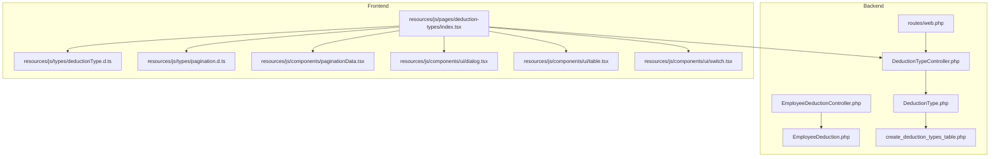
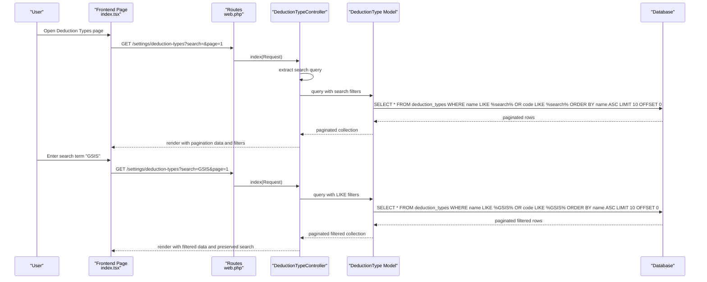
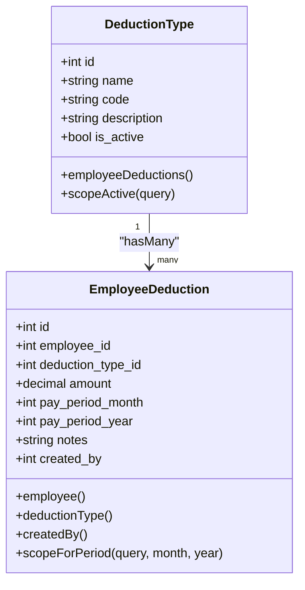
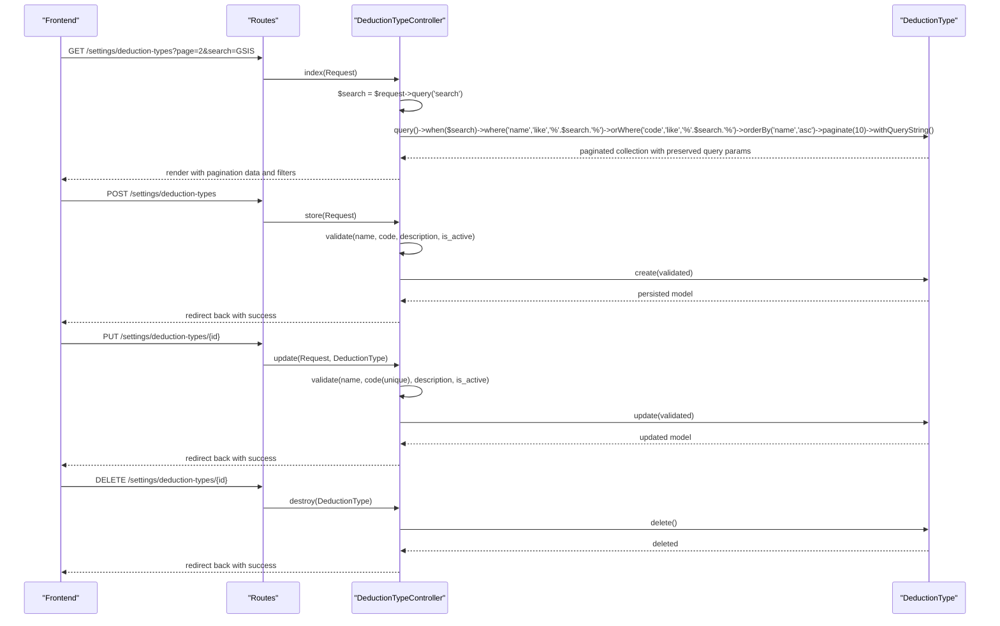
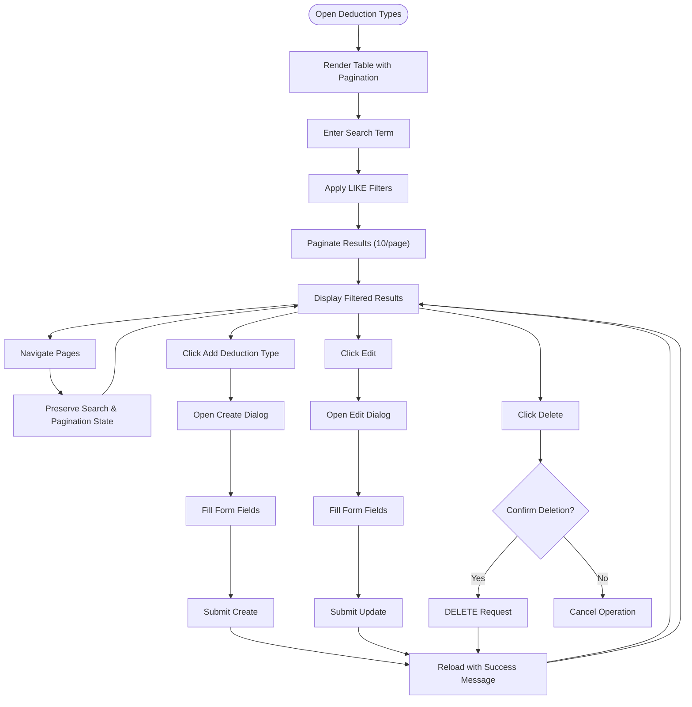
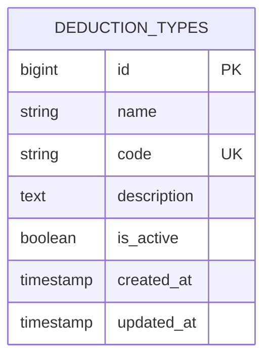
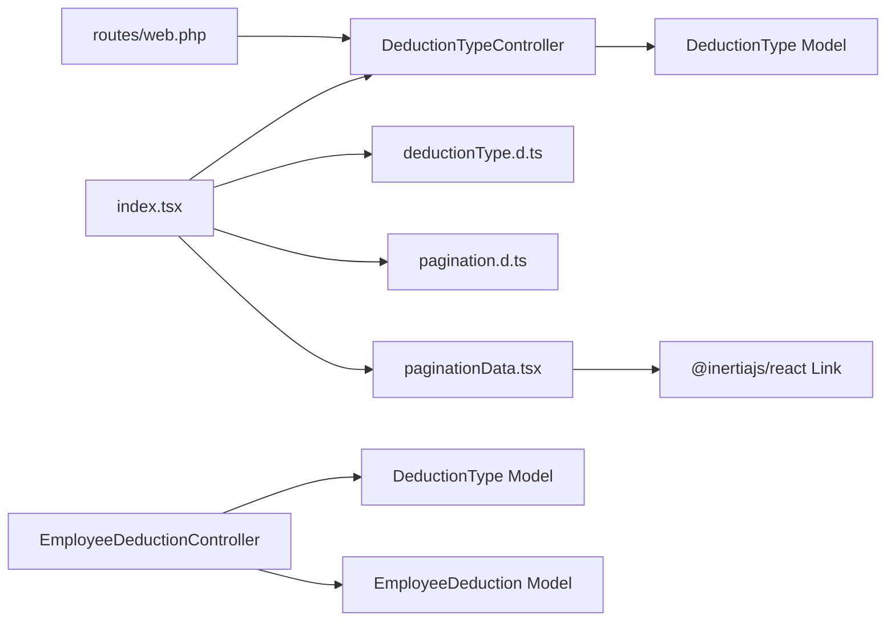

# Deduction Types Configuration

<cite>
**Referenced Files in This Document**
- [DeductionTypeController.php](file://app/Http/Controllers/DeductionTypeController.php)
- [DeductionType.php](file://app/Models/DeductionType.php)
- [EmployeeDeduction.php](file://app/Models/EmployeeDeduction.php)
- [EmployeeDeductionController.php](file://app/Http/Controllers/EmployeeDeductionController.php)
- [2026_03_22_115110_create_deduction_types_table.php](file://database/migrations/2026_03_22_115110_create_deduction_types_table.php)
- [web.php](file://routes/web.php)
- [index.tsx](file://resources/js/pages/deduction-types/index.tsx)
- [deductionType.d.ts](file://resources/js/types/deductionType.d.ts)
- [pagination.d.ts](file://resources/js/types/pagination.d.ts)
- [paginationData.tsx](file://resources/js/components/paginationData.tsx)
- [DeductionTypeSeeder.php](file://database/seeders/DeductionTypeSeeder.php)
- [dialog.tsx](file://resources/js/components/ui/dialog.tsx)
- [table.tsx](file://resources/js/components/ui/table.tsx)
- [switch.tsx](file://resources/js/components/ui/switch.tsx)
</cite>

## Update Summary
**Changes Made**
- Enhanced backend controller with search functionality using Request objects and LIKE operators
- Added pagination support with 10 items per page and query string preservation
- Updated frontend to handle paginated data structure and maintain search state
- Integrated pagination components for better user experience

## Table of Contents
1. [Introduction](#introduction)
2. [Project Structure](#project-structure)
3. [Core Components](#core-components)
4. [Architecture Overview](#architecture-overview)
5. [Detailed Component Analysis](#detailed-component-analysis)
6. [Dependency Analysis](#dependency-analysis)
7. [Performance Considerations](#performance-considerations)
8. [Troubleshooting Guide](#troubleshooting-guide)
9. [Conclusion](#conclusion)

## Introduction
This document describes the deduction types configuration system used to define, manage, and apply payroll deduction categories such as taxes, insurance, and retirement plans. The system now includes enhanced search functionality and pagination capabilities for improved performance and user experience. It covers the backend data model and validation, the controller CRUD operations with query-based filtering, and the frontend interface for creating, editing, and deleting deduction types with pagination support.

## Project Structure
The deduction types feature spans Laravel backend controllers and Eloquent models, a dedicated database migration, Inertia-based React frontend pages with pagination components, TypeScript type definitions, and route definitions.

**Diagram sources**
- [web.php:123-128](file://routes/web.php#L123-L128)
- [DeductionTypeController.php:9-66](file://app/Http/Controllers/DeductionTypeController.php#L9-L66)
- [DeductionType.php:7-32](file://app/Models/DeductionType.php#L7-L32)
- [EmployeeDeduction.php:8-58](file://app/Models/EmployeeDeduction.php#L8-L58)
- [EmployeeDeductionController.php:12-107](file://app/Http/Controllers/EmployeeDeductionController.php#L12-L107)
- [2026_03_22_115110_create_deduction_types_table.php:14-21](file://database/migrations/2026_03_22_115110_create_deduction_types_table.php#L14-L21)
- [index.tsx:27-258](file://resources/js/pages/deduction-types/index.tsx#L27-L258)
- [deductionType.d.ts:1-24](file://resources/js/types/deductionType.d.ts#L1-L24)
- [pagination.d.ts:1-24](file://resources/js/types/pagination.d.ts#L1-L24)
- [paginationData.tsx:1-34](file://resources/js/components/paginationData.tsx#L1-L34)
- [dialog.tsx:10-86](file://resources/js/components/ui/dialog.tsx#L10-L86)
- [table.tsx:5-114](file://resources/js/components/ui/table.tsx#L5-L114)
- [switch.tsx:6-31](file://resources/js/components/ui/switch.tsx#L6-L31)

**Section sources**
- [web.php:123-128](file://routes/web.php#L123-L128)
- [DeductionTypeController.php:9-66](file://app/Http/Controllers/DeductionTypeController.php#L9-L66)
- [DeductionType.php:7-32](file://app/Models/DeductionType.php#L7-L32)
- [2026_03_22_115110_create_deduction_types_table.php:14-21](file://database/migrations/2026_03_22_115110_create_deduction_types_table.php#L14-L21)
- [index.tsx:27-258](file://resources/js/pages/deduction-types/index.tsx#L27-L258)
- [deductionType.d.ts:1-24](file://resources/js/types/deductionType.d.ts#L1-L24)

## Core Components
- DeductionType model: Defines fillable attributes, boolean casting for status, relationship to employee deductions, and an active scope.
- DeductionTypeController: Implements index with search and pagination, store, update, and destroy actions with validation and redirects.
- Frontend page: Provides a table listing deduction types with pagination, create/edit dialogs, form validation feedback, and action buttons.
- Database migration: Creates the deduction_types table with unique code, nullable description, and default active status.
- Routes: Exposes REST-like endpoints under the deduction-types prefix with proper HTTP verb routing.
- EmployeeDeduction integration: Active deduction types are used when assigning employee-specific deductions.
- Pagination system: Handles 10 items per page with query string preservation for search and pagination state.

**Section sources**
- [DeductionType.php:9-31](file://app/Models/DeductionType.php#L9-L31)
- [DeductionTypeController.php:11-66](file://app/Http/Controllers/DeductionTypeController.php#L11-L66)
- [index.tsx:27-258](file://resources/js/pages/deduction-types/index.tsx#L27-L258)
- [2026_03_22_115110_create_deduction_types_table.php:14-21](file://database/migrations/2026_03_22_115110_create_deduction_types_table.php#L14-L21)
- [web.php:123-128](file://routes/web.php#L123-L128)
- [EmployeeDeductionController.php:40-40](file://app/Http/Controllers/EmployeeDeductionController.php#L40-L40)
- [paginationData.tsx:1-34](file://resources/js/components/paginationData.tsx#L1-L34)

## Architecture Overview
The system follows a layered architecture with enhanced search and pagination capabilities:
- Routes define the HTTP endpoints for deduction types with proper RESTful routing.
- Controller handles requests with Request objects, validates input, applies search filters, and orchestrates paginated persistence.
- Model encapsulates data access, casting, and relationships.
- Frontend renders the UI with pagination components, manages forms via Inertia, and communicates with controllers while preserving search state.

**Diagram sources**
- [web.php:123-128](file://routes/web.php#L123-L128)
- [DeductionTypeController.php:11-29](file://app/Http/Controllers/DeductionTypeController.php#L11-L29)
- [DeductionType.php:9-18](file://app/Models/DeductionType.php#L9-L18)
- [2026_03_22_115110_create_deduction_types_table.php:14-21](file://database/migrations/2026_03_22_115110_create_deduction_types_table.php#L14-L21)
- [index.tsx:27-258](file://resources/js/pages/deduction-types/index.tsx#L27-L258)

## Detailed Component Analysis

### Backend Data Model and Validation
- Model fields:
  - name: string, required
  - code: string, required, unique, max length constraint
  - description: text, optional
  - is_active: boolean, default true
- Validation rules:
  - Store: name required, code required and unique, description nullable, is_active boolean
  - Update: same as store except code uniqueness excludes current record by ID
- Relationships:
  - One-to-many with EmployeeDeduction
- Scopes:
  - Active scope filters records where is_active is true

**Diagram sources**
- [DeductionType.php:9-31](file://app/Models/DeductionType.php#L9-L31)
- [EmployeeDeduction.php:10-39](file://app/Models/EmployeeDeduction.php#L10-L39)

**Section sources**
- [DeductionType.php:9-31](file://app/Models/DeductionType.php#L9-L31)
- [DeductionTypeController.php:31-57](file://app/Http/Controllers/DeductionTypeController.php#L31-L57)
- [2026_03_22_115110_create_deduction_types_table.php:14-21](file://database/migrations/2026_03_22_115110_create_deduction_types_table.php#L14-L21)

### Enhanced Controller CRUD Operations with Search and Pagination
- Index: Returns paginated deduction types (10 per page) with search functionality, sorted by name, and preserves query string for pagination state.
- Store: Validates input, ensures unique code, persists the record, and returns a success redirect.
- Update: Validates input, ensures unique code excluding the current record, updates the record, and returns a success redirect.
- Destroy: Deletes the record and returns a success redirect.

**Updated** Enhanced with Request object handling, search query extraction, LIKE operator filtering, and pagination with query string preservation.

**Diagram sources**
- [web.php:123-128](file://routes/web.php#L123-L128)
- [DeductionTypeController.php:11-66](file://app/Http/Controllers/DeductionTypeController.php#L11-L66)
- [DeductionType.php:9-18](file://app/Models/DeductionType.php#L9-L18)

**Section sources**
- [DeductionTypeController.php:11-66](file://app/Http/Controllers/DeductionTypeController.php#L11-L66)
- [web.php:123-128](file://routes/web.php#L123-L128)

### Frontend Interface and User Interactions with Pagination
- Layout and navigation:
  - Uses a shared app layout and breadcrumb pointing to Deduction Types.
- Table display:
  - Shows Name, Code (monospace), Description, Status (Active/Inactive badge), and Action buttons (Edit/Delete).
- Pagination system:
  - Displays pagination controls with preserved search state.
  - Shows "Showing X to Y from Total Z" information.
  - Maintains active page highlighting and disabled states for non-clickable links.
- Create dialog:
  - Fields: Name, Code (auto-uppercase), Description, Active switch.
  - Validation feedback shown per field.
  - Submits via POST to store endpoint.
- Edit dialog:
  - Pre-populated with current values; submits via PUT to update endpoint.
- Delete action:
  - Confirmation prompt; triggers DELETE to remove endpoint.
- Search functionality:
  - Search input maintained across pagination pages.
  - Query string preserved during navigation.
- UI components:
  - Dialog, Table, Switch components are reused for consistent UX.
  - Pagination component handles link rendering and state management.

**Updated** Enhanced with pagination components, search state preservation, and improved user experience for large datasets.

**Diagram sources**
- [index.tsx:27-258](file://resources/js/pages/deduction-types/index.tsx#L27-L258)
- [paginationData.tsx:4-34](file://resources/js/components/paginationData.tsx#L4-L34)
- [dialog.tsx:50-86](file://resources/js/components/ui/dialog.tsx#L50-L86)
- [table.tsx:53-63](file://resources/js/components/ui/table.tsx#L53-L63)
- [switch.tsx:6-31](file://resources/js/components/ui/switch.tsx#L6-L31)

**Section sources**
- [index.tsx:27-258](file://resources/js/pages/deduction-types/index.tsx#L27-L258)
- [paginationData.tsx:1-34](file://resources/js/components/paginationData.tsx#L1-L34)
- [dialog.tsx:10-86](file://resources/js/components/ui/dialog.tsx#L10-L86)
- [table.tsx:5-114](file://resources/js/components/ui/table.tsx#L5-L114)
- [switch.tsx:6-31](file://resources/js/components/ui/switch.tsx#L6-L31)

### Database Schema
- Table: deduction_types
- Columns:
  - id: auto-increment primary key
  - name: string, not null
  - code: string, unique, not null
  - description: text, nullable
  - is_active: boolean, default true
  - timestamps: created_at, updated_at

**Diagram sources**
- [2026_03_22_115110_create_deduction_types_table.php:14-21](file://database/migrations/2026_03_22_115110_create_deduction_types_table.php#L14-L21)

**Section sources**
- [2026_03_22_115110_create_deduction_types_table.php:14-21](file://database/migrations/2026_03_22_115110_create_deduction_types_table.php#L14-L21)

### Unique Code System and Active Status Management
- Unique code:
  - Enforced at both database level (unique index) and controller validation (unique constraint).
  - Update validation excludes the current record's ID to allow editing without triggering uniqueness violation.
- Active/inactive status:
  - Boolean field with default true.
  - Active scope filters records where is_active is true.
  - Frontend displays status as a badge with color-coded labels.
  - Employee deduction assignment uses only active deduction types.

**Section sources**
- [2026_03_22_115110_create_deduction_types_table.php:17](file://database/migrations/2026_03_22_115110_create_deduction_types_table.php#L17)
- [DeductionTypeController.php:33-56](file://app/Http/Controllers/DeductionTypeController.php#L33-L56)
- [DeductionType.php:16-18](file://app/Models/DeductionType.php#L16-L18)
- [DeductionType.php:28-31](file://app/Models/DeductionType.php#L28-L31)
- [EmployeeDeductionController.php:40](file://app/Http/Controllers/EmployeeDeductionController.php#L40)

### Examples of Deduction Categories and Configuration Patterns
- Taxes: Withholding Tax (code: TAX)
- Insurance: GSIS Premium (code: GSIS), PhilHealth Contribution (code: PHILHEALTH)
- Housing and Loans: PAG-IBIG Housing Loan (code: PAGIBIG_HL), GSIS Policy Loan (code: GSIS_PL)
- Other: Other Deductions (code: OTHER), Cash Advance (code: CA)

These examples demonstrate consistent naming, concise codes, and optional descriptions. They are seeded into the database during initial setup.

**Section sources**
- [DeductionTypeSeeder.php:15-106](file://database/seeders/DeductionTypeSeeder.php#L15-L106)

### Audit Trail Functionality
- EmployeeDeduction model tracks who created each record:
  - Automatically sets created_by to the currently authenticated user on creation.
  - Provides a belongsTo relationship to the User model for display and reporting.
- DeductionType itself does not track who created or modified it; the focus is on active status and relationships.

**Section sources**
- [EmployeeDeduction.php:41-48](file://app/Models/EmployeeDeduction.php#L41-L48)
- [EmployeeDeduction.php:36-39](file://app/Models/EmployeeDeduction.php#L36-L39)

## Dependency Analysis
- Routes depend on DeductionTypeController methods with proper HTTP verb routing.
- Controller depends on DeductionType model for persistence, queries, and search filtering.
- Frontend depends on controller endpoints, TypeScript types, and pagination components.
- Pagination components depend on Inertia's Link component for state preservation.
- EmployeeDeductionController depends on DeductionType for filtering active deduction types.

**Updated** Enhanced with pagination dependencies and query string preservation mechanisms.

**Diagram sources**
- [web.php:123-128](file://routes/web.php#L123-L128)
- [DeductionTypeController.php:9-66](file://app/Http/Controllers/DeductionTypeController.php#L9-L66)
- [DeductionType.php:7-32](file://app/Models/DeductionType.php#L7-L32)
- [index.tsx:27-258](file://resources/js/pages/deduction-types/index.tsx#L27-L258)
- [deductionType.d.ts:1-24](file://resources/js/types/deductionType.d.ts#L1-L24)
- [pagination.d.ts:1-24](file://resources/js/types/pagination.d.ts#L1-L24)
- [paginationData.tsx:1-34](file://resources/js/components/paginationData.tsx#L1-L34)
- [EmployeeDeductionController.php:12-107](file://app/Http/Controllers/EmployeeDeductionController.php#L12-L107)
- [EmployeeDeduction.php:8-58](file://app/Models/EmployeeDeduction.php#L8-L58)

**Section sources**
- [web.php:123-128](file://routes/web.php#L123-L128)
- [DeductionTypeController.php:9-66](file://app/Http/Controllers/DeductionTypeController.php#L9-L66)
- [index.tsx:27-258](file://resources/js/pages/deduction-types/index.tsx#L27-L258)
- [EmployeeDeductionController.php:12-107](file://app/Http/Controllers/EmployeeDeductionController.php#L12-L107)

## Performance Considerations
- Index query now includes search filtering with LIKE operators on both name and code fields.
- Pagination limits results to 10 per page, improving load times for large datasets.
- Query string preservation maintains user search state across pagination pages.
- Unique code validation occurs at both controller and database levels; keep database constraints to prevent race conditions.
- Boolean casting for is_active avoids string comparisons in queries.
- Consider adding database indexes on name and code columns for improved search performance.

**Updated** Enhanced with search performance considerations and pagination benefits.

## Troubleshooting Guide
- Duplicate code error on create/update:
  - Cause: Code violates unique constraint.
  - Resolution: Choose a unique code; the controller enforces uniqueness.
- Validation failures:
  - Name missing or too long, invalid boolean for is_active, or invalid code format.
  - Resolution: Correct form inputs; frontend shows field-level error messages.
- Search not working:
  - Ensure search query is passed as query parameter in URL.
  - Check that LIKE operators are properly applied in controller.
- Pagination issues:
  - Verify pagination component receives proper paginated data structure.
  - Ensure query string preservation maintains search state across pages.
- Delete confirmation:
  - Use the confirmation dialog before removing a deduction type.
- Active vs inactive:
  - Only active deduction types appear in employee deduction assignments; toggle status accordingly.

**Updated** Added troubleshooting guidance for search functionality and pagination issues.

**Section sources**
- [DeductionTypeController.php:31-57](file://app/Http/Controllers/DeductionTypeController.php#L31-L57)
- [index.tsx:173-183](file://resources/js/pages/deduction-types/index.tsx#L173-L183)
- [paginationData.tsx:4-34](file://resources/js/components/paginationData.tsx#L4-L34)
- [EmployeeDeductionController.php:40](file://app/Http/Controllers/EmployeeDeductionController.php#L40)

## Conclusion
The deduction types configuration system provides a robust foundation for managing payroll deduction categories with enhanced search and pagination capabilities. It enforces unique codes, maintains active status controls, integrates with employee-specific deductions, and offers a clean frontend interface with validation, responsive actions, and efficient data handling. The addition of search functionality and pagination significantly improves user experience for large datasets while maintaining the system's simplicity and extensibility. The design balances performance with usability, enabling straightforward addition of new deduction categories and consistent application across the payroll workflow.