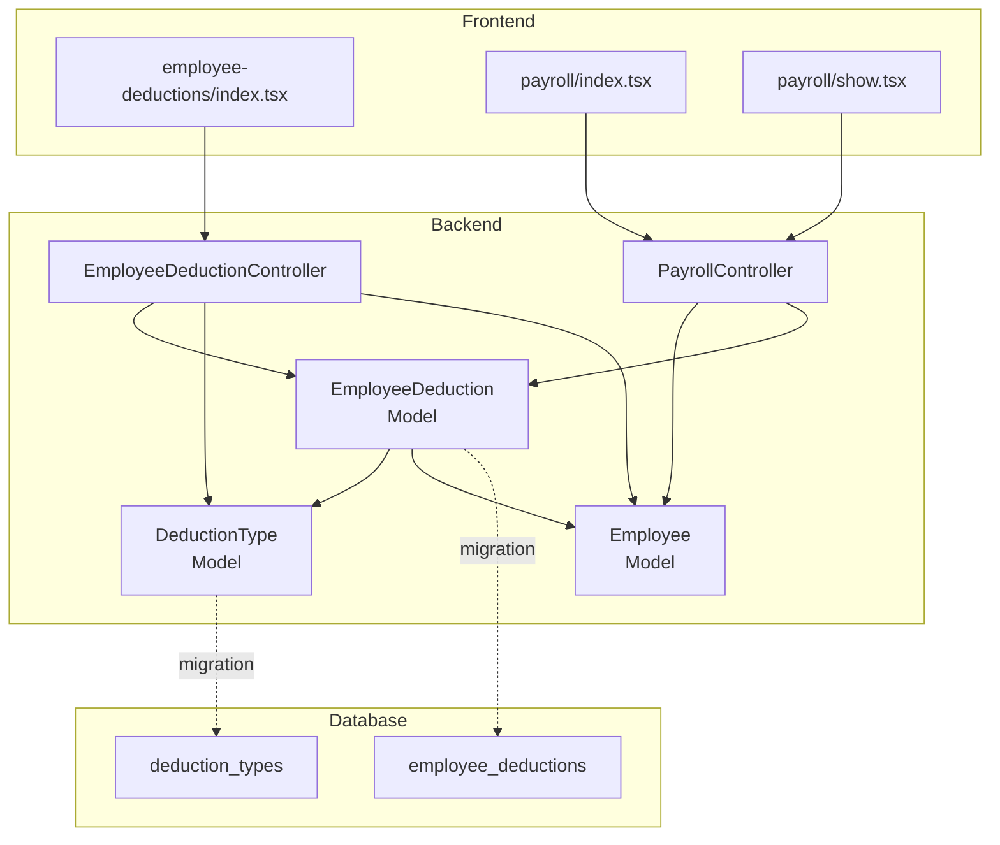
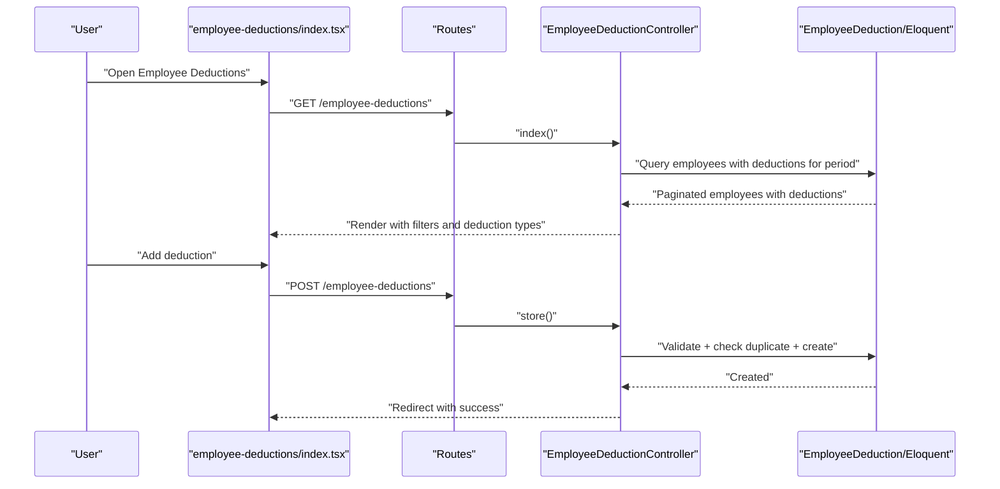
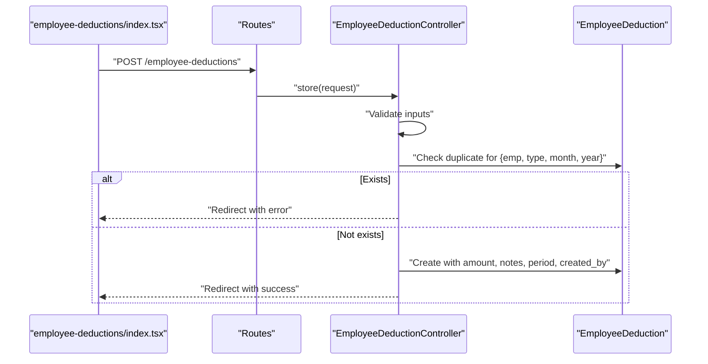
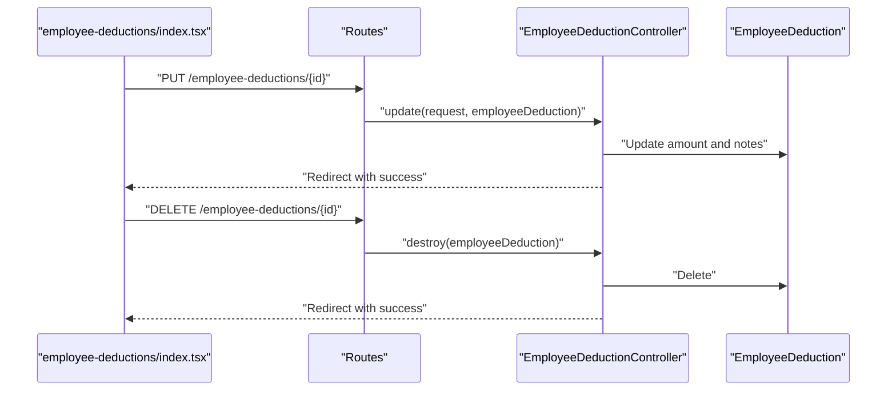
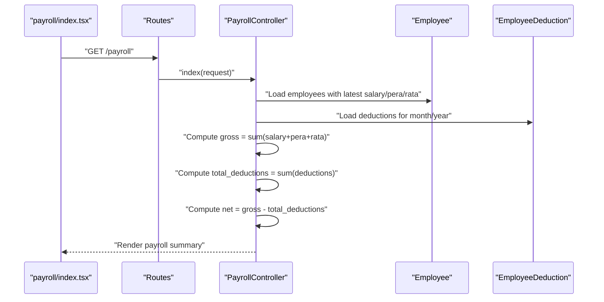
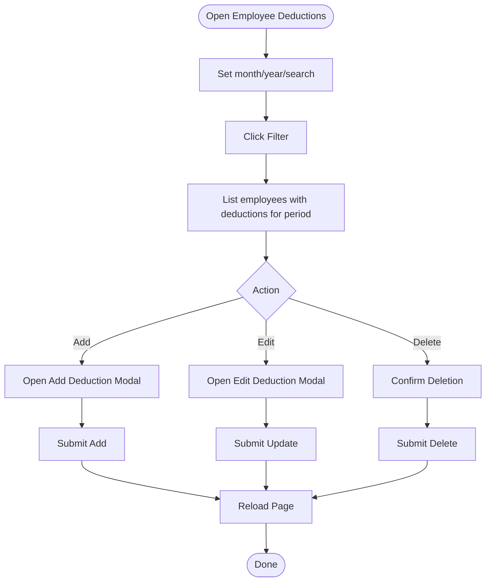
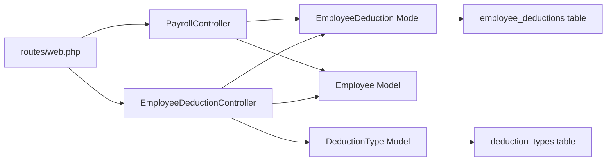

# Employee Deduction Tracking

<cite>
**Referenced Files in This Document**
- [EmployeeDeduction.php](file://app/Models/EmployeeDeduction.php)
- [DeductionType.php](file://app/Models/DeductionType.php)
- [Employee.php](file://app/Models/Employee.php)
- [EmployeeDeductionController.php](file://app/Http/Controllers/EmployeeDeductionController.php)
- [PayrollController.php](file://app/Http/Controllers/PayrollController.php)
- [2026_03_22_115112_create_employee_deductions_table.php](file://database/migrations/2026_03_22_115112_create_employee_deductions_table.php)
- [2026_03_22_115110_create_deduction_types_table.php](file://database/migrations/2026_03_22_115110_create_deduction_types_table.php)
- [web.php](file://routes/web.php)
- [employee-deductions/index.tsx](file://resources/js/pages/employee-deductions/index.tsx)
- [payroll/index.tsx](file://resources/js/pages/payroll/index.tsx)
- [payroll/show.tsx](file://resources/js/pages/payroll/show.tsx)
- [employeeDeduction.d.ts](file://resources/js/types/employeeDeduction.d.ts)
- [employee.d.ts](file://resources/js/types/employee.d.ts)
- [payroll.d.ts](file://resources/js/types/payroll.d.ts)
</cite>

## Table of Contents
1. [Introduction](#introduction)
2. [Project Structure](#project-structure)
3. [Core Components](#core-components)
4. [Architecture Overview](#architecture-overview)
5. [Detailed Component Analysis](#detailed-component-analysis)
6. [Dependency Analysis](#dependency-analysis)
7. [Performance Considerations](#performance-considerations)
8. [Troubleshooting Guide](#troubleshooting-guide)
9. [Conclusion](#conclusion)
10. [Appendices](#appendices)

## Introduction
This document describes the employee deduction tracking system, focusing on how deductions are created, assigned to employees, calculated, and integrated into payroll. It explains the relationship between employees and deduction types via the pivot-like table structure, documents the end-to-end workflow for applying, modifying, and removing deductions, and covers the frontend interface for viewing and managing deductions, including filtering, sorting, and bulk operations. It also details deduction calculation logic, payroll integration, impact on net pay, validation rules, eligibility criteria, and audit logging.

## Project Structure
The system spans Laravel backend models/controllers and Inertia/Vue frontend pages/components:
- Backend models define the domain entities and relationships.
- Controllers expose REST endpoints for CRUD operations and payroll aggregation.
- Migrations define the database schema for deduction types, employees, and employee deductions.
- Frontend pages render lists, forms, and payroll summaries with filtering and actions.



**Diagram sources**
- [EmployeeDeduction.php:1-59](file://app/Models/EmployeeDeduction.php#L1-L59)
- [DeductionType.php:1-33](file://app/Models/DeductionType.php#L1-L33)
- [Employee.php:1-104](file://app/Models/Employee.php#L1-L104)
- [EmployeeDeductionController.php:1-108](file://app/Http/Controllers/EmployeeDeductionController.php#L1-L108)
- [PayrollController.php:1-125](file://app/Http/Controllers/PayrollController.php#L1-L125)
- [2026_03_22_115112_create_employee_deductions_table.php:1-38](file://database/migrations/2026_03_22_115112_create_employee_deductions_table.php#L1-L38)
- [2026_03_22_115110_create_deduction_types_table.php:1-32](file://database/migrations/2026_03_22_115110_create_deduction_types_table.php#L1-L32)
- [employee-deductions/index.tsx:1-401](file://resources/js/pages/employee-deductions/index.tsx#L1-L401)
- [payroll/index.tsx](file://resources/js/pages/payroll/index.tsx)
- [payroll/show.tsx](file://resources/js/pages/payroll/show.tsx)

**Section sources**
- [web.php:63-69](file://routes/web.php#L63-L69)
- [EmployeeDeductionController.php:14-52](file://app/Http/Controllers/EmployeeDeductionController.php#L14-L52)
- [PayrollController.php:13-81](file://app/Http/Controllers/PayrollController.php#L13-L81)

## Core Components
- EmployeeDeduction model: Stores per-period deduction records with amount, pay period, notes, and audit metadata. Includes relationships to Employee and DeductionType, and scopes for period filtering.
- DeductionType model: Defines deduction categories (name, code, description, active flag) and provides an active scope.
- Employee model: Represents staff members with employment and office relations, and convenience accessors for latest salary/pera/rata.
- EmployeeDeductionController: Handles listing, creating, updating, and deleting employee deductions with validation and duplicate prevention.
- PayrollController: Aggregates payroll data per employee for a given month/year, computing gross pay and net pay from salary, pera, rata, and deductions.
- Frontend pages: Provide filtering, adding/editing/removing deductions, and displaying payroll summaries.

**Section sources**
- [EmployeeDeduction.php:8-58](file://app/Models/EmployeeDeduction.php#L8-L58)
- [DeductionType.php:7-32](file://app/Models/DeductionType.php#L7-L32)
- [Employee.php:10-104](file://app/Models/Employee.php#L10-L104)
- [EmployeeDeductionController.php:54-106](file://app/Http/Controllers/EmployeeDeductionController.php#L54-L106)
- [PayrollController.php:13-81](file://app/Http/Controllers/PayrollController.php#L13-L81)

## Architecture Overview
The system follows a layered architecture:
- Routes define endpoints for employee deductions and payroll.
- Controllers orchestrate queries, apply filters, compute derived values, and render Inertia pages.
- Models encapsulate relationships, casts, and scopes.
- Migrations define the schema and constraints.
- Frontend pages consume typed props and trigger controller actions.



**Diagram sources**
- [web.php:63-69](file://routes/web.php#L63-L69)
- [EmployeeDeductionController.php:14-106](file://app/Http/Controllers/EmployeeDeductionController.php#L14-L106)
- [employee-deductions/index.tsx:104-118](file://resources/js/pages/employee-deductions/index.tsx#L104-L118)

## Detailed Component Analysis

### Employee-Deduction Relationship and Pivot Table
The relationship between employees and deduction types is modeled via a dedicated table with foreign keys and a unique constraint to prevent duplicates per employee, deduction type, and pay period.

```mermaid
erDiagram
EMPLOYEES ||--o{ EMPLOYEE_DEDUCTIONS : "has many"
DEDUCTION_TYPES ||--o{ EMPLOYEE_DEDUCTIONS : "has many"
USERS ||--o{ EMPLOYEE_DEDUCTIONS : "audit: created_by"
EMPLOYEE_DEDUCTIONS {
bigint id PK
bigint employee_id FK
bigint deduction_type_id FK
decimal amount
tinyint pay_period_month
smallint pay_period_year
text notes
bigint created_by FK
timestamps created_at updated_at
}
DEDUCTION_TYPES {
bigint id PK
string name
string code UK
text description
boolean is_active
timestamps created_at updated_at
}
EMPLOYEES {
bigint id PK
string first_name
string middle_name
string last_name
string suffix
string position
boolean is_rata_eligible
bigint employment_status_id
bigint office_id
bigint created_by
timestamps created_at updated_at
}
```

**Diagram sources**
- [2026_03_22_115112_create_employee_deductions_table.php:14-27](file://database/migrations/2026_03_22_115112_create_employee_deductions_table.php#L14-L27)
- [2026_03_22_115110_create_deduction_types_table.php:14-21](file://database/migrations/2026_03_22_115110_create_deduction_types_table.php#L14-L21)
- [Employee.php:61-64](file://app/Models/Employee.php#L61-L64)
- [EmployeeDeduction.php:26-39](file://app/Models/EmployeeDeduction.php#L26-L39)
- [DeductionType.php:20-23](file://app/Models/DeductionType.php#L20-L23)

**Section sources**
- [2026_03_22_115112_create_employee_deductions_table.php:14-27](file://database/migrations/2026_03_22_115112_create_employee_deductions_table.php#L14-L27)
- [EmployeeDeduction.php:10-24](file://app/Models/EmployeeDeduction.php#L10-L24)
- [Employee.php:61-64](file://app/Models/Employee.php#L61-L64)
- [DeductionType.php:20-23](file://app/Models/DeductionType.php#L20-L23)

### Deduction Creation Workflow
- Endpoint: GET /employee-deductions (index) and POST /employee-deductions (store).
- Validation ensures employee exists, deduction type exists, amount is numeric and non-negative, and pay period is valid.
- Duplicate prevention checks for the same employee, deduction type, month, and year.
- On success, a new record is created with the authenticated user as creator.



**Diagram sources**
- [web.php:63-69](file://routes/web.php#L63-L69)
- [EmployeeDeductionController.php:54-87](file://app/Http/Controllers/EmployeeDeductionController.php#L54-L87)
- [EmployeeDeduction.php:41-48](file://app/Models/EmployeeDeduction.php#L41-L48)

**Section sources**
- [EmployeeDeductionController.php:54-87](file://app/Http/Controllers/EmployeeDeductionController.php#L54-L87)
- [employee-deductions/index.tsx:104-118](file://resources/js/pages/employee-deductions/index.tsx#L104-L118)

### Deduction Modification and Removal
- Update endpoint: PUT /employee-deductions/{employeeDeduction} updates amount and notes.
- Delete endpoint: DELETE /employee-deductions/{employeeDeduction} removes the record.



**Diagram sources**
- [web.php:63-69](file://routes/web.php#L63-L69)
- [EmployeeDeductionController.php:89-106](file://app/Http/Controllers/EmployeeDeductionController.php#L89-L106)

**Section sources**
- [EmployeeDeductionController.php:89-106](file://app/Http/Controllers/EmployeeDeductionController.php#L89-L106)
- [employee-deductions/index.tsx:120-139](file://resources/js/pages/employee-deductions/index.tsx#L120-L139)
- [employee-deductions/index.tsx:141-145](file://resources/js/pages/employee-deductions/index.tsx#L141-L145)

### Payroll Integration and Net Pay Calculation
- Endpoint: GET /payroll and GET /payroll/{employee}.
- For each employee, the system loads latest salary, pera, and rata, and all deductions for the selected pay period.
- Gross pay equals the sum of salary, pera, and rata amounts.
- Total deductions equals the sum of all deduction amounts for the period.
- Net pay equals gross pay minus total deductions.
- Eligibility: RATA is included only if the employee is eligible.



**Diagram sources**
- [web.php:25-29](file://routes/web.php#L25-L29)
- [PayrollController.php:13-81](file://app/Http/Controllers/PayrollController.php#L13-L81)
- [payroll/index.tsx](file://resources/js/pages/payroll/index.tsx)

**Section sources**
- [PayrollController.php:48-67](file://app/Http/Controllers/PayrollController.php#L48-L67)
- [payroll/show.tsx:93-182](file://resources/js/pages/payroll/show.tsx#L93-L182)

### Frontend Interface: Filtering, Sorting, and Actions
- Filtering: Month/year selectors, optional office filter, and free-text search by name.
- Sorting: Employees sorted by last name.
- Actions: Add, edit, and delete deductions per employee row.
- Bulk operations: The interface supports per-row actions; bulk operations would require multi-select checkboxes and batch endpoints.



**Diagram sources**
- [employee-deductions/index.tsx:60-102](file://resources/js/pages/employee-deductions/index.tsx#L60-L102)
- [employee-deductions/index.tsx:104-145](file://resources/js/pages/employee-deductions/index.tsx#L104-L145)

**Section sources**
- [employee-deductions/index.tsx:60-102](file://resources/js/pages/employee-deductions/index.tsx#L60-L102)
- [employee-deductions/index.tsx:208-282](file://resources/js/pages/employee-deductions/index.tsx#L208-L282)

### Types and Data Contracts
- EmployeeDeduction type defines the shape of deduction records and nested relations.
- Employee type includes latest salary/pera/rata and deduction arrays.
- Payroll types describe aggregated payroll data for rendering.

**Section sources**
- [employeeDeduction.d.ts:4-17](file://resources/js/types/employeeDeduction.d.ts#L4-L17)
- [employee.d.ts:8-29](file://resources/js/types/employee.d.ts#L8-L29)
- [payroll.d.ts:7-15](file://resources/js/types/payroll.d.ts#L7-L15)

## Dependency Analysis
- Controllers depend on models for querying and persistence.
- Models define relationships and constraints.
- Routes bind URLs to controller actions.
- Frontend pages depend on typed props and Inertia routing helpers.



**Diagram sources**
- [web.php:63-69](file://routes/web.php#L63-L69)
- [EmployeeDeductionController.php:5-10](file://app/Http/Controllers/EmployeeDeductionController.php#L5-L10)
- [PayrollController.php:5-9](file://app/Http/Controllers/PayrollController.php#L5-L9)
- [EmployeeDeduction.php:26-39](file://app/Models/EmployeeDeduction.php#L26-L39)
- [Employee.php:61-64](file://app/Models/Employee.php#L61-L64)
- [DeductionType.php:20-23](file://app/Models/DeductionType.php#L20-L23)

**Section sources**
- [web.php:63-69](file://routes/web.php#L63-L69)
- [EmployeeDeductionController.php:5-10](file://app/Http/Controllers/EmployeeDeductionController.php#L5-L10)
- [PayrollController.php:5-9](file://app/Http/Controllers/PayrollController.php#L5-L9)

## Performance Considerations
- Indexing: The unique composite index on employee_deductions prevents duplicates and supports fast lookups by employee, type, month, and year.
- Eager loading: Controllers load related models (deductions, latest salary/pera/rata) to avoid N+1 queries.
- Pagination: Both listing endpoints use pagination to limit result sets.
- Derived computations: Payroll totals are computed server-side to avoid heavy client-side aggregation.

[No sources needed since this section provides general guidance]

## Troubleshooting Guide
- Duplicate deduction error: When attempting to add a deduction for the same employee, deduction type, month, and year, the system prevents duplication and returns an error message.
- Validation failures: Amount must be numeric and non-negative; pay period month must be 1–12; year must be within a reasonable range; employee and deduction type must exist.
- Audit trail: created_by is automatically set to the authenticated user upon creation.

**Section sources**
- [EmployeeDeductionController.php:65-74](file://app/Http/Controllers/EmployeeDeductionController.php#L65-L74)
- [EmployeeDeductionController.php:56-63](file://app/Http/Controllers/EmployeeDeductionController.php#L56-L63)
- [EmployeeDeduction.php:41-48](file://app/Models/EmployeeDeduction.php#L41-L48)

## Conclusion
The employee deduction tracking system provides a robust foundation for recording, managing, and aggregating deductions per pay period. It enforces data integrity via validation and unique constraints, integrates seamlessly with payroll computation, and offers a user-friendly interface for filtering, adding, editing, and removing deductions. The architecture cleanly separates concerns between models, controllers, routes, and frontend pages, enabling maintainability and extensibility.

## Appendices

### Deduction Scenarios and Examples
- Scenario A: Add a fixed deduction for an employee in a specific month/year.
- Scenario B: Modify the amount of an existing deduction after review.
- Scenario C: Remove a deduction that was entered in error.
- Scenario D: Manual override of a deduction for a special circumstance; ensure notes capture justification.
- Scenario E: Historical tracking: view deduction history per employee and compare periods.

[No sources needed since this section provides general guidance]

### Eligibility and Validation Rules
- Eligibility: RATA inclusion depends on employee’s eligibility flag.
- Validation: Amount non-negative, numeric; pay period valid; existence of employee and deduction type; uniqueness per employee/type/month/year enforced by database and controller logic.

**Section sources**
- [Employee.php:20](file://app/Models/Employee.php#L20)
- [PayrollController.php:166](file://app/Http/Controllers/PayrollController.php#L166)
- [EmployeeDeductionController.php:56-63](file://app/Http/Controllers/EmployeeDeductionController.php#L56-L63)
- [2026_03_22_115112_create_employee_deductions_table.php:25-26](file://database/migrations/2026_03_22_115112_create_employee_deductions_table.php#L25-L26)