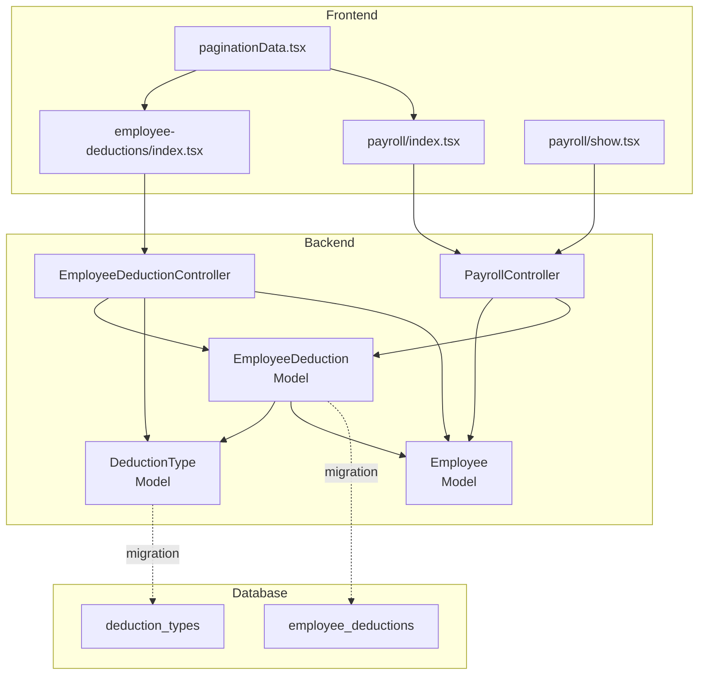
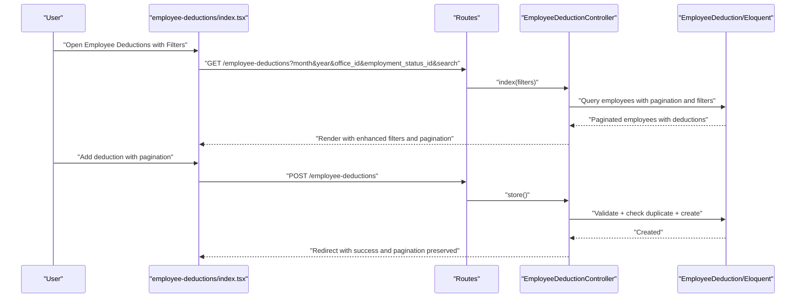
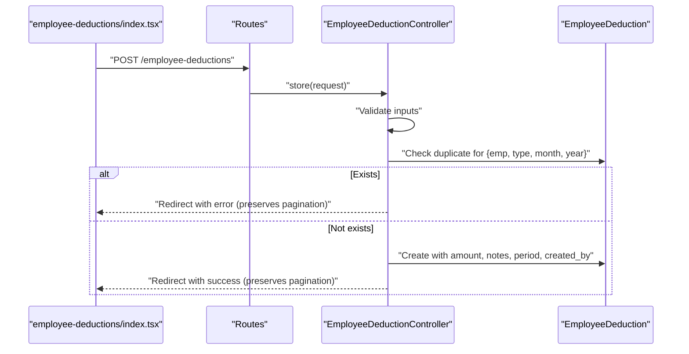
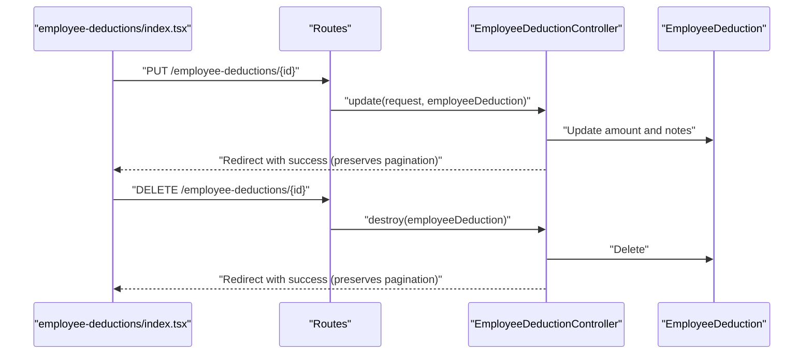
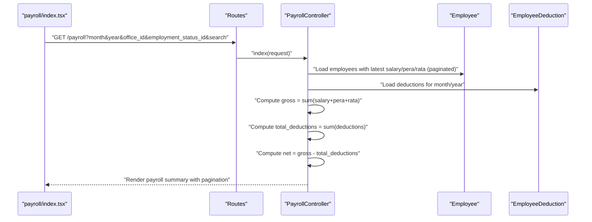
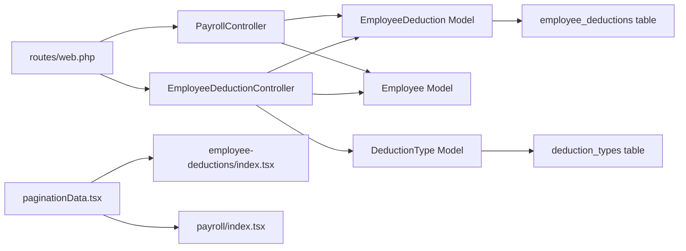

# Employee Deduction Tracking

<cite>
**Referenced Files in This Document**
- [EmployeeDeduction.php](file://app/Models/EmployeeDeduction.php)
- [DeductionType.php](file://app/Models/DeductionType.php)
- [Employee.php](file://app/Models/Employee.php)
- [EmployeeDeductionController.php](file://app/Http/Controllers/EmployeeDeductionController.php)
- [PayrollController.php](file://app/Http/Controllers/PayrollController.php)
- [2026_03_22_115112_create_employee_deductions_table.php](file://database/migrations/2026_03_22_115112_create_employee_deductions_table.php)
- [2026_03_22_115110_create_deduction_types_table.php](file://database/migrations/2026_03_22_115110_create_deduction_types_table.php)
- [web.php](file://routes/web.php)
- [employee-deductions/index.tsx](file://resources/js/pages/employee-deductions/index.tsx)
- [payroll/index.tsx](file://resources/js/pages/payroll/index.tsx)
- [payroll/show.tsx](file://resources/js/pages/payroll/show.tsx)
- [employeeDeduction.d.ts](file://resources/js/types/employeeDeduction.d.ts)
- [employee.d.ts](file://resources/js/types/employee.d.ts)
- [payroll.d.ts](file://resources/js/types/payroll.d.ts)
- [paginationData.tsx](file://resources/js/components/paginationData.tsx)
- [pagination.d.ts](file://resources/js/types/pagination.d.ts)
- [filter.d.ts](file://resources/js/types/filter.d.ts)
</cite>

## Update Summary
**Changes Made**
- Enhanced pagination system with 50-item per-page limits across employee deductions and payroll interfaces
- Comprehensive month/year filtering capabilities with dedicated UI components
- Improved frontend filtering with office and employment status selectors
- Enhanced data presentation with pagination controls and improved table layouts
- Added sophisticated form validation and error handling for deduction operations
- Implemented comprehensive search functionality across employee names

## Table of Contents
1. [Introduction](#introduction)
2. [Project Structure](#project-structure)
3. [Core Components](#core-components)
4. [Architecture Overview](#architecture-overview)
5. [Detailed Component Analysis](#detailed-component-analysis)
6. [Enhanced Pagination System](#enhanced-pagination-system)
7. [Advanced Filtering Capabilities](#advanced-filtering-capabilities)
8. [Frontend Interface Improvements](#frontend-interface-improvements)
9. [Dependency Analysis](#dependency-analysis)
10. [Performance Considerations](#performance-considerations)
11. [Troubleshooting Guide](#troubleshooting-guide)
12. [Conclusion](#conclusion)
13. [Appendices](#appendices)

## Introduction
This document describes the enhanced employee deduction tracking system, focusing on how deductions are created, assigned to employees, calculated, and integrated into payroll. The system now features comprehensive pagination, advanced filtering capabilities, and improved user experience for managing employee deductions across multiple pay periods. It explains the relationship between employees and deduction types via the pivot-like table structure, documents the end-to-end workflow for applying, modifying, and removing deductions, and covers the enhanced frontend interface with filtering, sorting, and bulk operations. It also details deduction calculation logic, payroll integration, impact on net pay, validation rules, eligibility criteria, and audit logging.

## Project Structure
The system spans Laravel backend models/controllers and Inertia/Vue frontend pages/components with enhanced pagination and filtering:
- Backend models define the domain entities and relationships with improved query optimization.
- Controllers expose REST endpoints for CRUD operations and payroll aggregation with pagination support.
- Migrations define the database schema for deduction types, employees, and employee deductions.
- Frontend pages render paginated lists, forms, and payroll summaries with comprehensive filtering and enhanced user interface components.



**Diagram sources**
- [EmployeeDeduction.php:1-59](file://app/Models/EmployeeDeduction.php#L1-L59)
- [DeductionType.php:1-33](file://app/Models/DeductionType.php#L1-L33)
- [Employee.php:1-104](file://app/Models/Employee.php#L1-L104)
- [EmployeeDeductionController.php:1-119](file://app/Http/Controllers/EmployeeDeductionController.php#L1-L119)
- [PayrollController.php:1-133](file://app/Http/Controllers/PayrollController.php#L1-L133)
- [2026_03_22_115112_create_employee_deductions_table.php:1-38](file://database/migrations/2026_03_22_115112_create_employee_deductions_table.php#L1-L38)
- [2026_03_22_115110_create_deduction_types_table.php:1-32](file://database/migrations/2026_03_22_115110_create_deduction_types_table.php#L1-L32)
- [employee-deductions/index.tsx:1-427](file://resources/js/pages/employee-deductions/index.tsx#L1-L427)
- [payroll/index.tsx](file://resources/js/pages/payroll/index.tsx)
- [payroll/show.tsx](file://resources/js/pages/payroll/show.tsx)
- [paginationData.tsx:1-34](file://resources/js/components/paginationData.tsx#L1-L34)

**Section sources**
- [web.php:58-64](file://routes/web.php#L58-L64)
- [EmployeeDeductionController.php:16-63](file://app/Http/Controllers/EmployeeDeductionController.php#L16-L63)
- [PayrollController.php:14-89](file://app/Http/Controllers/PayrollController.php#L14-L89)

## Core Components
- EmployeeDeduction model: Stores per-period deduction records with amount, pay period, notes, and audit metadata. Includes relationships to Employee and DeductionType, and scopes for period filtering with automatic audit trail population.
- DeductionType model: Defines deduction categories (name, code, description, active flag) and provides an active scope with efficient querying.
- Employee model: Represents staff members with employment and office relations, and convenience accessors for latest salary/pera/rata with eager loading optimization.
- EmployeeDeductionController: Handles listing, creating, updating, and deleting employee deductions with comprehensive validation, duplicate prevention, and pagination support.
- PayrollController: Aggregates payroll data per employee for a given month/year, computing gross pay and net pay from salary, pera, rata, and deductions with enhanced filtering capabilities.
- Frontend pages: Provide comprehensive filtering, pagination, adding/editing/removing deductions, and displaying payroll summaries with enhanced user interface components.

**Section sources**
- [EmployeeDeduction.php:8-58](file://app/Models/EmployeeDeduction.php#L8-L58)
- [DeductionType.php:7-32](file://app/Models/DeductionType.php#L7-L32)
- [Employee.php:10-104](file://app/Models/Employee.php#L10-L104)
- [EmployeeDeductionController.php:65-118](file://app/Http/Controllers/EmployeeDeductionController.php#L65-L118)
- [PayrollController.php:14-89](file://app/Http/Controllers/PayrollController.php#L14-L89)

## Architecture Overview
The system follows a layered architecture with enhanced pagination and filtering:
- Routes define endpoints for employee deductions and payroll with comprehensive parameter handling.
- Controllers orchestrate queries, apply filters, compute derived values, and render Inertia pages with pagination support.
- Models encapsulate relationships, casts, and scopes with optimized query performance.
- Migrations define the schema and constraints with unique indexing for data integrity.
- Frontend pages consume typed props, trigger controller actions, and provide enhanced user interface components.



**Diagram sources**
- [web.php:58-64](file://routes/web.php#L58-L64)
- [EmployeeDeductionController.php:16-118](file://app/Http/Controllers/EmployeeDeductionController.php#L16-L118)
- [employee-deductions/index.tsx:103-158](file://resources/js/pages/employee-deductions/index.tsx#L103-L158)

## Detailed Component Analysis

### Employee-Deduction Relationship and Pivot Table
The relationship between employees and deduction types is modeled via a dedicated table with foreign keys and a unique constraint to prevent duplicates per employee, deduction type, and pay period, now with enhanced query optimization.

```mermaid
erDiagram
EMPLOYEES ||--o{ EMPLOYEE_DEDUCTIONS : "has many"
DEDUCTION_TYPES ||--o{ EMPLOYEE_DEDUCTIONS : "has many"
USERS ||--o{ EMPLOYEE_DEDUCTIONS : "audit: created_by"
EMPLOYEE_DEDUCTIONS {
bigint id PK
bigint employee_id FK
bigint deduction_type_id FK
decimal amount
tinyint pay_period_month
smallint pay_period_year
text notes
bigint created_by FK
timestamps created_at updated_at
}
DEDUCTION_TYPES {
bigint id PK
string name
string code UK
text description
boolean is_active
timestamps created_at updated_at
}
EMPLOYEES {
bigint id PK
string first_name
string middle_name
string last_name
string suffix
string position
boolean is_rata_eligible
bigint employment_status_id
bigint office_id
bigint created_by
timestamps created_at updated_at
}
```

**Diagram sources**
- [2026_03_22_115112_create_employee_deductions_table.php:14-27](file://database/migrations/2026_03_22_115112_create_employee_deductions_table.php#L14-L27)
- [2026_03_22_115110_create_deduction_types_table.php:14-21](file://database/migrations/2026_03_22_115110_create_deduction_types_table.php#L14-L21)
- [Employee.php:61-64](file://app/Models/Employee.php#L61-L64)
- [EmployeeDeduction.php:26-39](file://app/Models/EmployeeDeduction.php#L26-L39)
- [DeductionType.php:20-23](file://app/Models/DeductionType.php#L20-L23)

**Section sources**
- [2026_03_22_115112_create_employee_deductions_table.php:14-27](file://database/migrations/2026_03_22_115112_create_employee_deductions_table.php#L14-L27)
- [EmployeeDeduction.php:10-24](file://app/Models/EmployeeDeduction.php#L10-L24)
- [Employee.php:61-64](file://app/Models/Employee.php#L61-L64)
- [DeductionType.php:20-23](file://app/Models/DeductionType.php#L20-L23)

### Deduction Creation Workflow
- Endpoint: GET /employee-deductions (index) and POST /employee-deductions (store).
- Validation ensures employee exists, deduction type exists, amount is numeric and non-negative, and pay period is valid.
- Duplicate prevention checks for the same employee, deduction type, month, and year.
- On success, a new record is created with the authenticated user as creator and pagination preserved.



**Diagram sources**
- [web.php:58-64](file://routes/web.php#L58-L64)
- [EmployeeDeductionController.php:65-98](file://app/Http/Controllers/EmployeeDeductionController.php#L65-L98)
- [EmployeeDeduction.php:41-48](file://app/Models/EmployeeDeduction.php#L41-L48)

**Section sources**
- [EmployeeDeductionController.php:65-98](file://app/Http/Controllers/EmployeeDeductionController.php#L65-L98)
- [employee-deductions/index.tsx:123-158](file://resources/js/pages/employee-deductions/index.tsx#L123-L158)

### Deduction Modification and Removal
- Update endpoint: PUT /employee-deductions/{employeeDeduction} updates amount and notes.
- Delete endpoint: DELETE /employee-deductions/{employeeDeduction} removes the record.
- All operations preserve pagination state and filtering context.



**Diagram sources**
- [web.php:58-64](file://routes/web.php#L58-L64)
- [EmployeeDeductionController.php:100-118](file://app/Http/Controllers/EmployeeDeductionController.php#L100-L118)

**Section sources**
- [EmployeeDeductionController.php:100-118](file://app/Http/Controllers/EmployeeDeductionController.php#L100-L118)
- [employee-deductions/index.tsx:133-158](file://resources/js/pages/employee-deductions/index.tsx#L133-L158)
- [employee-deductions/index.tsx:154-158](file://resources/js/pages/employee-deductions/index.tsx#L154-L158)

### Payroll Integration and Net Pay Calculation
- Endpoint: GET /payroll and GET /payroll/{employee}.
- For each employee, the system loads latest salary, pera, and rata, and all deductions for the selected pay period.
- Gross pay equals the sum of salary, pera, and rata amounts.
- Total deductions equals the sum of all deduction amounts for the period.
- Net pay equals gross pay minus total deductions.
- Eligibility: RATA is included only if the employee is eligible.
- Enhanced with comprehensive filtering and pagination support.



**Diagram sources**
- [web.php:28-31](file://routes/web.php#L28-L31)
- [PayrollController.php:14-89](file://app/Http/Controllers/PayrollController.php#L14-L89)
- [payroll/index.tsx](file://resources/js/pages/payroll/index.tsx)

**Section sources**
- [PayrollController.php:54-72](file://app/Http/Controllers/PayrollController.php#L54-L72)
- [payroll/show.tsx:120-131](file://resources/js/pages/payroll/show.tsx#L120-L131)

## Enhanced Pagination System
The system now implements comprehensive pagination across all major interfaces with 50 items per page, preserving filter state and scroll position for optimal user experience.

### Pagination Implementation Details
- **Items per page**: 50 items for both employee deductions and payroll listings
- **State preservation**: Pagination maintains filter selections and scroll positions
- **Link navigation**: Interactive pagination links with active state highlighting
- **Display information**: Shows current page range and total item count
- **Responsive design**: Adapts to different screen sizes with mobile-friendly controls

### Pagination Component Features
- **Link rendering**: Dynamic pagination links with HTML content support
- **Active state styling**: Visual indication of current page with theme-aware colors
- **Disabled states**: Proper handling of first/last page navigation
- **Accessibility**: Screen reader friendly with proper ARIA attributes

**Section sources**
- [employee-deductions/index.tsx:48-58](file://resources/js/pages/employee-deductions/index.tsx#L48-L58)
- [employee-deductions/index.tsx:43-44](file://resources/js/pages/employee-deductions/index.tsx#L43-L44)
- [payroll/index.tsx:48-58](file://resources/js/pages/payroll/index.tsx#L48-L58)
- [payroll/index.tsx:43-44](file://resources/js/pages/payroll/index.tsx#L43-L44)
- [paginationData.tsx:4-33](file://resources/js/components/paginationData.tsx#L4-L33)
- [pagination.d.ts:7-18](file://resources/js/types/pagination.d.ts#L7-L18)

## Advanced Filtering Capabilities
The system provides comprehensive filtering options across all major interfaces with intuitive UI components and real-time search functionality.

### Filter Categories
- **Month/Year Selection**: Dedicated dropdown selectors for pay period filtering
- **Office Filtering**: Multi-option selection for organizational hierarchy
- **Employment Status**: Status-based filtering for different employment types
- **Name Search**: Free-text search across employee names with partial matching

### Filter Implementation Features
- **Real-time updates**: Immediate filter application without page reload
- **State persistence**: Filter selections maintained across navigation
- **URL synchronization**: Filter parameters reflected in browser URL
- **Validation**: Input validation with appropriate error handling
- **Default values**: Intelligent defaults for current month/year

### Filter UI Components
- **Month selector**: 12-month dropdown with localized month names
- **Year input**: Numeric input with validation constraints (2020-2100)
- **Custom combo boxes**: Enhanced dropdowns with search and selection
- **Search input**: Icon-enhanced input with live search capability
- **Filter button**: Clear action to reset all filters

**Section sources**
- [employee-deductions/index.tsx:66-72](file://resources/js/pages/employee-deductions/index.tsx#L66-L72)
- [employee-deductions/index.tsx:175-225](file://resources/js/pages/employee-deductions/index.tsx#L175-L225)
- [employee-deductions/index.tsx:32-45](file://resources/js/pages/employee-deductions/index.tsx#L32-L45)
- [filter.d.ts:3-6](file://resources/js/types/filter.d.ts#L3-L6)

## Frontend Interface Improvements
The frontend has been significantly enhanced with improved user experience, better data visualization, and comprehensive form handling.

### Enhanced User Interface Elements
- **Improved table design**: Structured table layout with clear column headers and alternating row styles
- **Avatar integration**: Employee profile images with fallback icons for better visual identification
- **Deduction badges**: Color-coded tags for individual deductions with inline action buttons
- **Currency formatting**: PHP currency formatting with proper localization
- **Modal dialogs**: Enhanced add/edit deduction forms with proper validation feedback

### Form Enhancements
- **Add deduction dialog**: Comprehensive form with employee preview and pay period display
- **Edit deduction dialog**: Streamlined form for amount and notes modification
- **Form validation**: Real-time validation with error message display
- **Input constraints**: Decimal steps for monetary values, integer constraints for months/years
- **Auto-focus**: Intelligent focus management for better keyboard navigation

### Action Controls
- **Inline editing**: Direct editing within table rows with pencil icons
- **Quick deletion**: Inline delete actions with confirmation dialogs
- **Bulk operations**: Foundation for future multi-selection capabilities
- **Navigation aids**: Clear visual hierarchy and responsive design

**Section sources**
- [employee-deductions/index.tsx:228-311](file://resources/js/pages/employee-deductions/index.tsx#L228-L311)
- [employee-deductions/index.tsx:313-422](file://resources/js/pages/employee-deductions/index.tsx#L313-L422)
- [employee-deductions/index.tsx:160-165](file://resources/js/pages/employee-deductions/index.tsx#L160-L165)

### Types and Data Contracts
- EmployeeDeduction type defines the shape of deduction records and nested relations with enhanced typing.
- Employee type includes latest salary/pera/rata and deduction arrays with proper casting.
- Payroll types describe aggregated payroll data for rendering with computed values.
- Pagination types support comprehensive pagination data structures with link navigation.
- Filter types provide flexible filtering capabilities with extensible properties.

**Section sources**
- [employeeDeduction.d.ts:4-17](file://resources/js/types/employeeDeduction.d.ts#L4-L17)
- [employee.d.ts:8-29](file://resources/js/types/employee.d.ts#L8-L29)
- [payroll.d.ts:7-15](file://resources/js/types/payroll.d.ts#L7-L15)
- [pagination.d.ts:7-18](file://resources/js/types/pagination.d.ts#L7-L18)
- [filter.d.ts:3-6](file://resources/js/types/filter.d.ts#L3-L6)

## Dependency Analysis
- Controllers depend on models for querying and persistence with enhanced pagination support.
- Models define relationships and constraints with optimized query performance.
- Routes bind URLs to controller actions with comprehensive parameter handling.
- Frontend pages depend on typed props, Inertia routing helpers, and enhanced UI components.



**Diagram sources**
- [web.php:58-64](file://routes/web.php#L58-L64)
- [EmployeeDeductionController.php:5-12](file://app/Http/Controllers/EmployeeDeductionController.php#L5-L12)
- [PayrollController.php:5-12](file://app/Http/Controllers/PayrollController.php#L5-L12)
- [EmployeeDeduction.php:26-39](file://app/Models/EmployeeDeduction.php#L26-L39)
- [Employee.php:61-64](file://app/Models/Employee.php#L61-L64)
- [DeductionType.php:20-23](file://app/Models/DeductionType.php#L20-L23)
- [paginationData.tsx:1-34](file://resources/js/components/paginationData.tsx#L1-L34)

**Section sources**
- [web.php:58-64](file://routes/web.php#L58-L64)
- [EmployeeDeductionController.php:5-12](file://app/Http/Controllers/EmployeeDeductionController.php#L5-L12)
- [PayrollController.php:5-12](file://app/Http/Controllers/PayrollController.php#L5-L12)

## Performance Considerations
- **Indexing**: The unique composite index on employee_deductions prevents duplicates and supports fast lookups by employee, type, month, and year.
- **Eager loading**: Controllers load related models (deductions, latest salary/pera/rata) to avoid N+1 queries with optimized query patterns.
- **Pagination**: Both listing endpoints use pagination with 50 items per page to limit result sets and improve response times.
- **Derived computations**: Payroll totals are computed server-side to avoid heavy client-side aggregation with efficient collection transformations.
- **Filter optimization**: Query builders apply filters efficiently with conditional clauses and proper indexing.
- **State preservation**: Pagination maintains filter state to reduce redundant queries and improve user experience.

## Troubleshooting Guide
- **Duplicate deduction error**: When attempting to add a deduction for the same employee, deduction type, month, and year, the system prevents duplication and returns an error message with pagination preserved.
- **Validation failures**: Amount must be numeric and non-negative; pay period month must be 1–12; year must be within a reasonable range (2020-2100); employee and deduction type must exist.
- **Audit trail**: created_by is automatically set to the authenticated user upon creation with proper authentication handling.
- **Pagination issues**: If pagination links don't work, check URL parameters and ensure proper state preservation.
- **Filter problems**: If filters don't apply correctly, verify parameter encoding and URL synchronization.

**Section sources**
- [EmployeeDeductionController.php:76-85](file://app/Http/Controllers/EmployeeDeductionController.php#L76-L85)
- [EmployeeDeductionController.php:67-74](file://app/Http/Controllers/EmployeeDeductionController.php#L67-L74)
- [EmployeeDeduction.php:45-48](file://app/Models/EmployeeDeduction.php#L45-L48)
- [paginationData.tsx:16-30](file://resources/js/components/paginationData.tsx#L16-L30)

## Conclusion
The enhanced employee deduction tracking system provides a robust foundation for recording, managing, and aggregating deductions per pay period with comprehensive pagination, advanced filtering, and improved user experience. It enforces data integrity via validation and unique constraints, integrates seamlessly with payroll computation, and offers a sophisticated interface for filtering, adding, editing, and removing deductions. The architecture cleanly separates concerns between models, controllers, routes, and frontend pages, enabling maintainability and extensibility with enhanced performance through optimized queries and pagination.

## Appendices

### Deduction Scenarios and Examples
- Scenario A: Add a fixed deduction for an employee in a specific month/year using the enhanced filtering system.
- Scenario B: Modify the amount of an existing deduction after review with improved validation feedback.
- Scenario C: Remove a deduction that was entered in error with confirmation dialog and pagination preservation.
- Scenario D: Manual override of a deduction for a special circumstance; ensure notes capture justification with enhanced form validation.
- Scenario E: Historical tracking: view deduction history per employee and compare periods with comprehensive pagination.
- Scenario F: Bulk operations: Future enhancement for multi-deduction management with improved selection capabilities.

### Eligibility and Validation Rules
- Eligibility: RATA inclusion depends on employee's eligibility flag with proper status checking.
- Validation: Amount non-negative, numeric; pay period valid (1-12 month range, 2020-2100 year range); existence of employee and deduction type; uniqueness per employee/type/month/year enforced by database and controller logic.
- Pagination: 50 items per page with state preservation across navigation.
- Filtering: Comprehensive filter support with real-time updates and URL synchronization.

**Section sources**
- [Employee.php:20](file://app/Models/Employee.php#L20)
- [PayrollController.php:64-69](file://app/Http/Controllers/PayrollController.php#L64-L69)
- [EmployeeDeductionController.php:67-74](file://app/Http/Controllers/EmployeeDeductionController.php#L67-L74)
- [2026_03_22_115112_create_employee_deductions_table.php:25-26](file://database/migrations/2026_03_22_115112_create_employee_deductions_table.php#L25-L26)