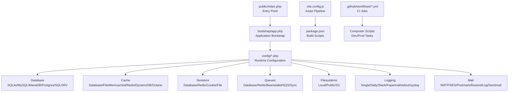
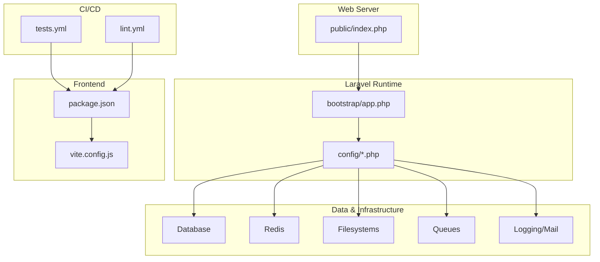
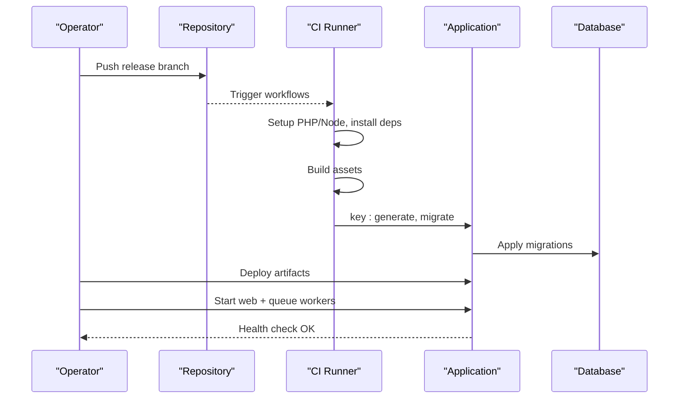
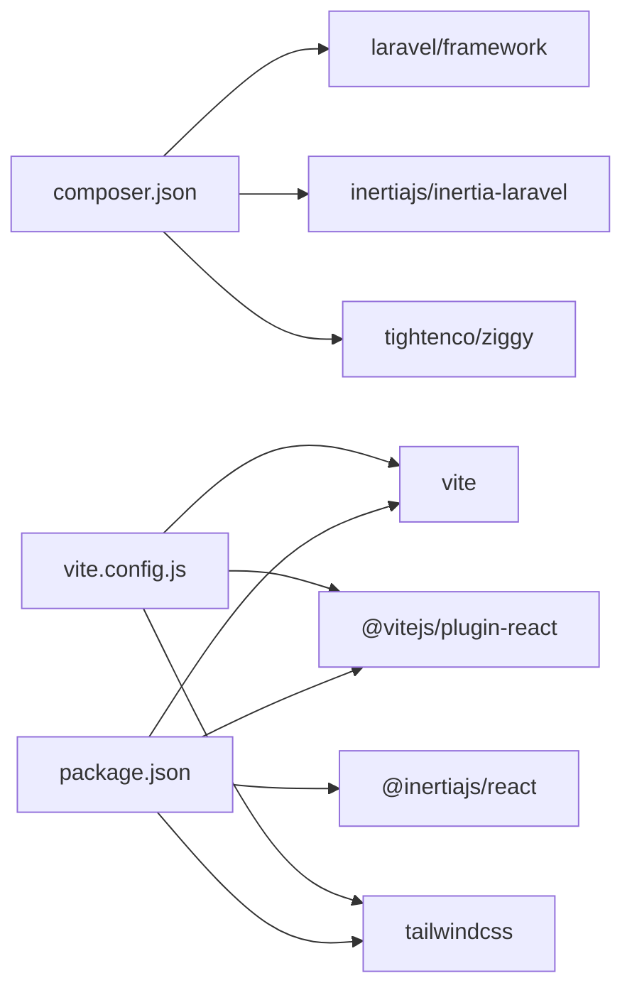

# Deployment & Configuration

<cite>
**Referenced Files in This Document**
- [composer.json](file://composer.json)
- [package.json](file://package.json)
- [vite.config.js](file://vite.config.js)
- [public/index.php](file://public/index.php)
- [.github/workflows/tests.yml](file://.github/workflows/tests.yml)
- [.github/workflows/lint.yml](file://.github/workflows/lint.yml)
- [bootstrap/app.php](file://bootstrap/app.php)
- [config/app.php](file://config/app.php)
- [config/database.php](file://config/database.php)
- [config/cache.php](file://config/cache.php)
- [config/session.php](file://config/session.php)
- [config/queue.php](file://config/queue.php)
- [config/filesystems.php](file://config/filesystems.php)
- [config/logging.php](file://config/logging.php)
- [config/mail.php](file://config/mail.php)
- [config/services.php](file://config/services.php)
- [database/migrations/0001_01_01_000000_create_users_table.php](file://database/migrations/0001_01_01_000000_create_users_table.php)
- [database/migrations/0001_01_01_000001_create_cache_table.php](file://database/migrations/0001_01_01_000001_create_cache_table.php)
- [database/migrations/0001_01_01_000002_create_jobs_table.php](file://database/migrations/0001_01_01_000002_create_jobs_table.php)
</cite>

## Table of Contents
1. [Introduction](#introduction)
2. [Project Structure](#project-structure)
3. [Core Components](#core-components)
4. [Architecture Overview](#architecture-overview)
5. [Detailed Component Analysis](#detailed-component-analysis)
6. [Dependency Analysis](#dependency-analysis)
7. [Performance Considerations](#performance-considerations)
8. [Troubleshooting Guide](#troubleshooting-guide)
9. [Conclusion](#conclusion)
10. [Appendices](#appendices)

## Introduction
This document provides comprehensive deployment and configuration guidance for the Laravel application. It covers production setup, environment configuration, deployment strategies, asset compilation, build optimization, security hardening, logging and monitoring, CI/CD pipelines, automated testing, scaling, load balancing, performance tuning, backup strategies, disaster recovery, and maintenance procedures. The content is grounded in the repository’s configuration files and scripts to ensure accuracy and practical applicability.

## Project Structure
The application follows a standard Laravel structure with frontend assets managed by Vite. Key deployment-relevant areas include:
- Backend runtime entrypoint and routing bootstrap
- Asset pipeline configuration and build scripts
- Configuration for databases, caching, sessions, queues, filesystems, logging, and mail
- GitHub Actions workflows for CI quality checks and tests
- Database migrations for core tables (users, sessions, cache, jobs)



**Diagram sources**
- [public/index.php:1-18](file://public/index.php#L1-L18)
- [bootstrap/app.php:1-24](file://bootstrap/app.php#L1-L24)
- [vite.config.js:1-21](file://vite.config.js#L1-L21)
- [.github/workflows/tests.yml:1-54](file://.github/workflows/tests.yml#L1-L54)
- [composer.json:1-77](file://composer.json#L1-L77)
- [package.json:1-73](file://package.json#L1-L73)

**Section sources**
- [public/index.php:1-18](file://public/index.php#L1-L18)
- [bootstrap/app.php:1-24](file://bootstrap/app.php#L1-L24)
- [vite.config.js:1-21](file://vite.config.js#L1-L21)
- [package.json:1-73](file://package.json#L1-L73)
- [.github/workflows/tests.yml:1-54](file://.github/workflows/tests.yml#L1-L54)
- [composer.json:1-77](file://composer.json#L1-L77)

## Core Components
- Application entrypoint and routing bootstrap
- Asset pipeline and build scripts
- Environment-driven configuration for app, database, cache, session, queue, filesystems, logging, and mail
- CI/CD workflows for linting and testing
- Database migrations for users, sessions, cache, and jobs

Key configuration highlights:
- Application name, environment, debug, URL, timezone, locale, encryption key, maintenance driver/store
- Database connections for SQLite, MySQL, MariaDB, PostgreSQL, SQL Server; Redis options
- Cache stores including database, file, memcached, redis, dynamodb, octane
- Session driver, lifetime, encryption, cookie attributes, and store
- Queue connections including database, redis, beanstalkd, sqs, sync
- Filesystems for local, public, S3
- Logging channels and levels
- Mail transport configuration and global sender identity

**Section sources**
- [config/app.php:1-127](file://config/app.php#L1-L127)
- [config/database.php:1-175](file://config/database.php#L1-L175)
- [config/cache.php:1-109](file://config/cache.php#L1-L109)
- [config/session.php:1-218](file://config/session.php#L1-L218)
- [config/queue.php:1-113](file://config/queue.php#L1-L113)
- [config/filesystems.php:1-78](file://config/filesystems.php#L1-L78)
- [config/logging.php:1-133](file://config/logging.php#L1-L133)
- [config/mail.php:1-117](file://config/mail.php#L1-L117)
- [config/services.php:1-39](file://config/services.php#L1-L39)

## Architecture Overview
The runtime architecture integrates Laravel’s HTTP kernel with an asset pipeline and external systems (database, cache, queues, filesystems, mail). CI/CD automates quality and testing.



**Diagram sources**
- [public/index.php:1-18](file://public/index.php#L1-L18)
- [bootstrap/app.php:1-24](file://bootstrap/app.php#L1-L24)
- [config/database.php:1-175](file://config/database.php#L1-L175)
- [config/cache.php:1-109](file://config/cache.php#L1-L109)
- [config/session.php:1-218](file://config/session.php#L1-L218)
- [config/queue.php:1-113](file://config/queue.php#L1-L113)
- [config/filesystems.php:1-78](file://config/filesystems.php#L1-L78)
- [config/logging.php:1-133](file://config/logging.php#L1-L133)
- [config/mail.php:1-117](file://config/mail.php#L1-L117)
- [vite.config.js:1-21](file://vite.config.js#L1-L21)
- [package.json:1-73](file://package.json#L1-L73)
- [.github/workflows/tests.yml:1-54](file://.github/workflows/tests.yml#L1-L54)
- [.github/workflows/lint.yml:1-46](file://.github/workflows/lint.yml#L1-L46)

## Detailed Component Analysis

### Environment Configuration and Variables
Production-grade environment variables should be defined in a secure .env file. The application reads configuration from environment variables across multiple config files. Critical categories include:
- Application identity, environment, debug, URL, timezone, locale, encryption key, maintenance settings
- Database connectivity (driver, host, port, database, username, password, charset, collation, SSL options)
- Redis client, cluster, prefix, persistence, and per-db selection
- Cache store selection and backend-specific options
- Session driver, lifetime, cookie attributes, and store
- Queue connection and backend-specific options
- Filesystems for local, public, and S3
- Logging channel selection, levels, retention, and integrations
- Mail transport selection and credentials

Recommended production variables (non-exhaustive):
- APP_ENV, APP_DEBUG, APP_URL, APP_TIMEZONE, APP_LOCALE, APP_KEY
- DB_CONNECTION, DB_HOST, DB_PORT, DB_DATABASE, DB_USERNAME, DB_PASSWORD, DB_CHARSET, DB_COLLATION
- REDIS_* (client, cluster, prefix, persistent, host, port, username, password, db, cache db)
- CACHE_STORE, CACHE_PREFIX
- SESSION_DRIVER, SESSION_LIFETIME, SESSION_SECURE_COOKIE, SESSION_SAME_SITE, SESSION_PARTITIONED_COOKIE
- QUEUE_CONNECTION
- FILESYSTEM_DISK
- LOG_CHANNEL, LOG_LEVEL, LOG_DAILY_DAYS
- MAIL_MAILER, MAIL_HOST, MAIL_PORT, MAIL_ENCRYPTION, MAIL_USERNAME, MAIL_PASSWORD, MAIL_FROM_ADDRESS, MAIL_FROM_NAME
- AWS_* for S3 and SES
- SLACK_BOT_USER_OAUTH_TOKEN, SLACK_BOT_USER_DEFAULT_CHANNEL

**Section sources**
- [config/app.php:1-127](file://config/app.php#L1-L127)
- [config/database.php:1-175](file://config/database.php#L1-L175)
- [config/cache.php:1-109](file://config/cache.php#L1-L109)
- [config/session.php:1-218](file://config/session.php#L1-L218)
- [config/queue.php:1-113](file://config/queue.php#L1-L113)
- [config/filesystems.php:1-78](file://config/filesystems.php#L1-L78)
- [config/logging.php:1-133](file://config/logging.php#L1-L133)
- [config/mail.php:1-117](file://config/mail.php#L1-L117)
- [config/services.php:1-39](file://config/services.php#L1-L39)

### Database Configuration and Migrations
- Default connection is environment-driven; SQLite is the default for development.
- Supported drivers include sqlite, mysql, mariadb, pgsql, sqlsrv.
- Redis is configured for default and cache connections with optional URL overrides.
- Migrations define users, sessions, cache, and jobs tables. Ensure migrations are run in production after deployment.

```mermaid
erDiagram
USERS {
bigint id PK
string name
string email UK
timestamp email_verified_at
string password
string rememberToken
timestamps created_at, updated_at
}
PASSWORD_RESET_TOKENS {
string email PK
string token
timestamp created_at
}
SESSIONS {
string id PK
bigint user_id IK
string ip_address
text user_agent
longText payload
int last_activity
}
CACHE {
string key PK
mediumText value
int expiration
}
CACHE_LOCKS {
string key PK
string owner
int expiration
}
JOBS {
bigint id PK
string queue IK
longText payload
tinyint attempts
int reserved_at
int available_at
int created_at
}
JOB_BATCHES {
string id PK
string name
int total_jobs
int pending_jobs
int failed_jobs
longText failed_job_ids
mediumText options
int cancelled_at
int created_at
int finished_at
}
FAILED_JOBS {
bigint id PK
string uuid UK
text connection
text queue
longText payload
longText exception
timestamp failed_at
}
USERS ||--o{ SESSIONS : "has"
```

**Diagram sources**
- [database/migrations/0001_01_01_000000_create_users_table.php:1-50](file://database/migrations/0001_01_01_000000_create_users_table.php#L1-L50)
- [database/migrations/0001_01_01_000001_create_cache_table.php:1-36](file://database/migrations/0001_01_01_000001_create_cache_table.php#L1-L36)
- [database/migrations/0001_01_01_000002_create_jobs_table.php:1-58](file://database/migrations/0001_01_01_000002_create_jobs_table.php#L1-L58)

**Section sources**
- [config/database.php:1-175](file://config/database.php#L1-L175)
- [database/migrations/0001_01_01_000000_create_users_table.php:1-50](file://database/migrations/0001_01_01_000000_create_users_table.php#L1-L50)
- [database/migrations/0001_01_01_000001_create_cache_table.php:1-36](file://database/migrations/0001_01_01_000001_create_cache_table.php#L1-L36)
- [database/migrations/0001_01_01_000002_create_jobs_table.php:1-58](file://database/migrations/0001_01_01_000002_create_jobs_table.php#L1-L58)

### Cache Setup
- Default cache store is environment-driven; database is the default.
- Supported stores include array, database, file, memcached, redis, dynamodb, octane.
- Redis cache and lock connections are configurable.
- Cache key prefix is derived from APP_NAME to avoid collisions.

Recommendations:
- Use Redis for production to benefit from distributed caching and atomic locks.
- Configure separate cache and default Redis databases for isolation.
- Set appropriate TTL and consider cache warming for hot data.

**Section sources**
- [config/cache.php:1-109](file://config/cache.php#L1-L109)
- [config/database.php:144-172](file://config/database.php#L144-L172)

### Session Configuration
- Default driver is database; cookie attributes are configurable (secure, httpOnly, sameSite, partitioned).
- Session lifetime and encryption are environment-controlled.
- Sessions can be stored in database or Redis depending on infrastructure.

Recommendations:
- Enable secure and sameSite cookies in production behind TLS.
- Use Redis-backed sessions for horizontal scaling.
- Tune session lifetime to balance UX and security.

**Section sources**
- [config/session.php:1-218](file://config/session.php#L1-L218)

### Queue Configuration
- Default queue driver is database; supports sync, database, beanstalkd, sqs, redis.
- Job batching and failed job storage are configurable.
- Redis queue connection and retry settings are environment-driven.

Recommendations:
- Use Redis queues for production scalability and reliability.
- Configure dead-letter handling and retry policies.
- Monitor failed jobs and alert on spikes.

**Section sources**
- [config/queue.php:1-113](file://config/queue.php#L1-L113)

### Filesystems and Storage
- Local and public disks are configured; public disk URL derives from APP_URL.
- S3 disk supports credentials, region, bucket, endpoint, and path-style configuration.
- Storage symlink is created for public disk.

Recommendations:
- Use S3 for production asset hosting and backups.
- Ensure proper IAM permissions and bucket policies.
- Consider CDN integration for static assets.

**Section sources**
- [config/filesystems.php:1-78](file://config/filesystems.php#L1-L78)

### Logging and Monitoring
- Default channel is stack; single and daily channels support retention days.
- Slack and Papertrail integrations are available.
- stderr and syslog channels support containerized environments.

Recommendations:
- Route critical logs to centralized systems (Papertrail, SIEM).
- Set appropriate log levels per environment.
- Integrate with monitoring dashboards and alerting.

**Section sources**
- [config/logging.php:1-133](file://config/logging.php#L1-L133)

### Mail Configuration
- Default mailer is environment-driven; SMTP, SES, Postmark, Resend, Sendmail, Log supported.
- Global sender identity is configurable.

Recommendations:
- Use SES or Postmark/Resend for production deliverability.
- Enable DKIM/SPF/DomainKeys; monitor bounce and complaint rates.

**Section sources**
- [config/mail.php:1-117](file://config/mail.php#L1-L117)
- [config/services.php:1-39](file://config/services.php#L1-L39)

### Asset Compilation and Build Optimization
- Vite is configured with React plugin and Tailwind CSS integration.
- Build scripts include dev, build, build:ssr, format, format:check, lint.
- Laravel Vite Plugin bridges Blade and Vite.

Recommendations:
- Pre-render SSR builds for performance-sensitive pages.
- Enable code splitting and lazy loading in the frontend.
- Minimize and deduplicate bundles; leverage CDN for assets.

**Section sources**
- [vite.config.js:1-21](file://vite.config.js#L1-L21)
- [package.json:1-73](file://package.json#L1-L73)
- [composer.json:39-58](file://composer.json#L39-L58)

### CI/CD Pipelines and Automated Testing
- Lint workflow runs PHP linting/formatting and frontend formatting/linting.
- Test workflow installs dependencies, builds assets, creates SQLite database, generates app key, and runs PHPUnit.

Recommendations:
- Extend test workflow to include database migrations and seeding.
- Add security scanning and dependency review.
- Gate deployments on successful CI runs.

**Section sources**
- [.github/workflows/lint.yml:1-46](file://.github/workflows/lint.yml#L1-L46)
- [.github/workflows/tests.yml:1-54](file://.github/workflows/tests.yml#L1-L54)

### Production Security Configuration
- Disable debug in production; set secure cookie flags.
- Use strong APP_KEY; rotate keys during deployments.
- Enforce HTTPS and HSTS; configure CSRF protection and CORS appropriately.
- Restrict filesystem permissions; avoid exposing .env.

**Section sources**
- [config/app.php:42](file://config/app.php#L42)
- [config/session.php:171-202](file://config/session.php#L171-L202)

### Deployment Processes
- Prepare environment variables and secrets.
- Install PHP and Node dependencies.
- Build assets and publish vendor assets.
- Run database migrations and seeders.
- Warm caches and precompile assets.
- Start web server and queue workers.



[No sources needed since this diagram shows conceptual workflow, not actual code structure]

### Scaling, Load Balancing, and Performance Optimization
- Scale horizontally by adding web nodes behind a load balancer.
- Use Redis for shared cache/session/queue backplane.
- Offload static assets to S3/CDN.
- Enable database read replicas for read-heavy workloads.
- Optimize queries, enable query caching, and use indexing strategies.

[No sources needed since this section provides general guidance]

### Backup Strategies, Disaster Recovery, and Maintenance
- Database: Schedule regular logical backups; test restore procedures.
- Files: Back up storage/app/public and configuration artifacts.
- Secrets: Store in a secure secret manager; automate rotation.
- DR: Maintain secondary region deployments; automate failover.

[No sources needed since this section provides general guidance]

## Dependency Analysis
The application depends on Composer and NPM ecosystems, with Laravel’s configuration files driving runtime behavior. CI depends on Composer and NPM scripts.



**Diagram sources**
- [composer.json:11-16](file://composer.json#L11-L16)
- [package.json:23-65](file://package.json#L23-L65)
- [vite.config.js:1-21](file://vite.config.js#L1-L21)

**Section sources**
- [composer.json:1-77](file://composer.json#L1-L77)
- [package.json:1-73](file://package.json#L1-L73)
- [vite.config.js:1-21](file://vite.config.js#L1-L21)

## Performance Considerations
- Use opcode caching (OPcache) and optimize autoloader.
- Prefer Redis for cache/queue/session; tune connection pooling.
- Minimize synchronous operations; leverage queues for heavy tasks.
- Enable HTTP/2 and compression; cache static assets aggressively.
- Monitor slow queries and hotspots; profile in staging before production.

[No sources needed since this section provides general guidance]

## Troubleshooting Guide
Common operational checks:
- Verify APP_KEY presence and correctness.
- Confirm database connectivity and migrations applied.
- Ensure Redis availability and correct database selection.
- Check queue worker processes and failed job logs.
- Validate filesystem permissions for storage and cache directories.
- Review logs for errors and deprecations; adjust log level as needed.

**Section sources**
- [config/app.php:100](file://config/app.php#L100)
- [config/database.php:19](file://config/database.php#L19)
- [config/cache.php:18](file://config/cache.php#L18)
- [config/queue.php:16](file://config/queue.php#L16)
- [config/filesystems.php:31-58](file://config/filesystems.php#L31-L58)
- [config/logging.php:21](file://config/logging.php#L21)

## Conclusion
This guide consolidates production deployment and configuration practices for the Laravel application, anchored in repository-provided configuration and CI files. By enforcing environment-driven settings, adopting robust infrastructure choices (Redis, S3, centralized logging), and automating quality and testing via CI, teams can achieve reliable, scalable, and secure operations.

## Appendices
- Appendix A: Environment Variable Reference
  - Application: APP_NAME, APP_ENV, APP_DEBUG, APP_URL, APP_TIMEZONE, APP_LOCALE, APP_KEY, APP_MAINTENANCE_DRIVER, APP_MAINTENANCE_STORE
  - Database: DB_CONNECTION, DB_HOST, DB_PORT, DB_DATABASE, DB_USERNAME, DB_PASSWORD, DB_CHARSET, DB_COLLATION, MYSQL_ATTR_SSL_CA
  - Redis: REDIS_CLIENT, REDIS_CLUSTER, REDIS_PREFIX, REDIS_PERSISTENT, REDIS_URL, REDIS_HOST, REDIS_USERNAME, REDIS_PASSWORD, REDIS_PORT, REDIS_DB, REDIS_CACHE_DB, REDIS_CACHE_CONNECTION, REDIS_CACHE_LOCK_CONNECTION, REDIS_QUEUE_CONNECTION, REDIS_QUEUE
  - Cache: CACHE_STORE, CACHE_PREFIX, DB_CACHE_CONNECTION, DB_CACHE_TABLE, DB_CACHE_LOCK_CONNECTION, DB_CACHE_LOCK_TABLE
  - Session: SESSION_DRIVER, SESSION_LIFETIME, SESSION_EXPIRE_ON_CLOSE, SESSION_ENCRYPT, SESSION_CONNECTION, SESSION_TABLE, SESSION_STORE, SESSION_COOKIE, SESSION_PATH, SESSION_DOMAIN, SESSION_SECURE_COOKIE, SESSION_HTTP_ONLY, SESSION_SAME_SITE, SESSION_PARTITIONED_COOKIE
  - Queue: QUEUE_CONNECTION, DB_QUEUE_CONNECTION, DB_QUEUE_TABLE, DB_QUEUE, DB_QUEUE_RETRY_AFTER, BEANSTALKD_QUEUE_HOST, SQS_QUEUE, SQS_SUFFIX, AWS_ACCESS_KEY_ID, AWS_SECRET_ACCESS_KEY, AWS_DEFAULT_REGION, REDIS_QUEUE_CONNECTION, REDIS_QUEUE_RETRY_AFTER
  - Filesystems: FILESYSTEM_DISK, AWS_ACCESS_KEY_ID, AWS_SECRET_ACCESS_KEY, AWS_DEFAULT_REGION, AWS_BUCKET, AWS_URL, AWS_ENDPOINT, AWS_USE_PATH_STYLE_ENDPOINT
  - Logging: LOG_CHANNEL, LOG_DEPRECATIONS_CHANNEL, LOG_DEPRECATIONS_TRACE, LOG_LEVEL, LOG_DAILY_DAYS, LOG_STACK, LOG_SLACK_WEBHOOK_URL, LOG_SLACK_USERNAME, LOG_SLACK_EMOJI, LOG_PAPERTRAIL_URL, LOG_PAPERTRAIL_PORT, LOG_STDERR_FORMATTER, LOG_SYSLOG_FACILITY
  - Mail: MAIL_MAILER, MAIL_HOST, MAIL_PORT, MAIL_ENCRYPTION, MAIL_USERNAME, MAIL_PASSWORD, MAIL_FROM_ADDRESS, MAIL_FROM_NAME, MAIL_URL, MAIL_SENDMAIL_PATH, MAIL_LOG_CHANNEL, POSTMARK_TOKEN, RESEND_KEY, SLACK_BOT_USER_OAUTH_TOKEN, SLACK_BOT_USER_DEFAULT_CHANNEL

- Appendix B: CI/CD Checklist
  - Lint: PHP and frontend formatting/linting
  - Tests: Install deps, build assets, create SQLite, generate key, run tests
  - Release: Tag, promote artifacts, deploy to staging/production, run migrations, restart services

[No sources needed since this appendix lists reference material derived from configuration files]