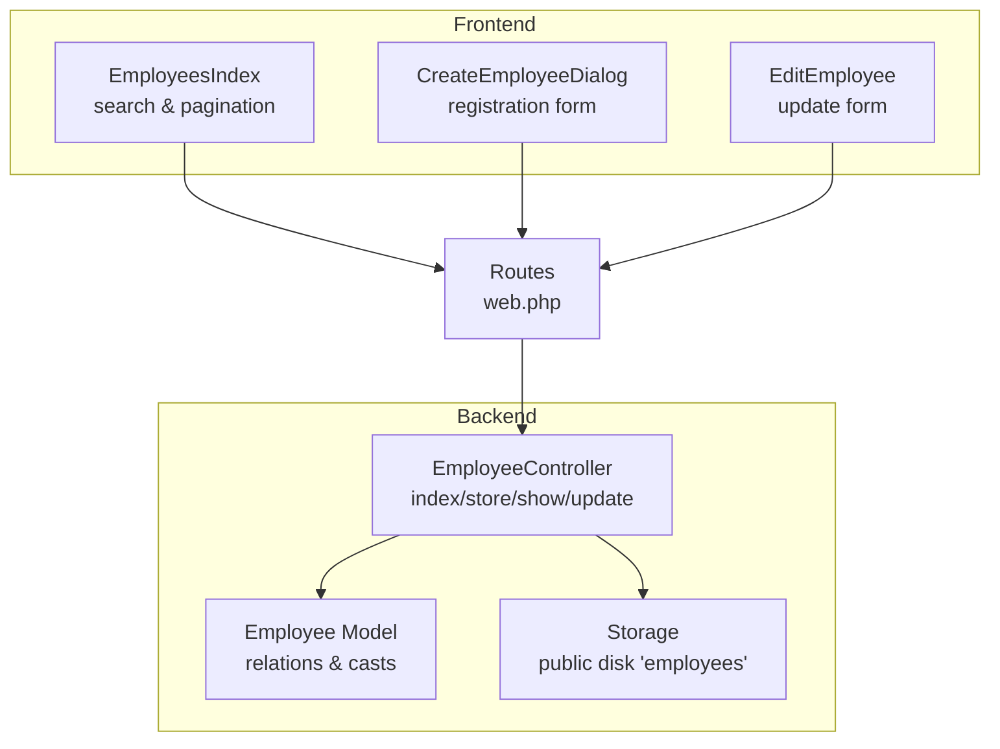
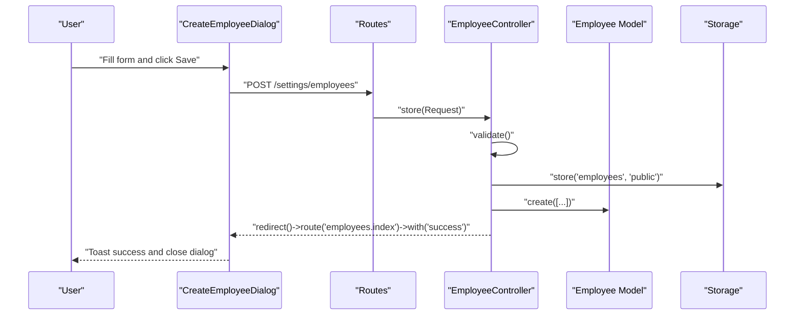
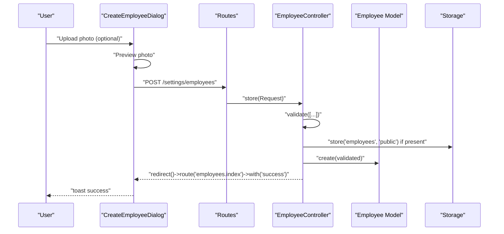
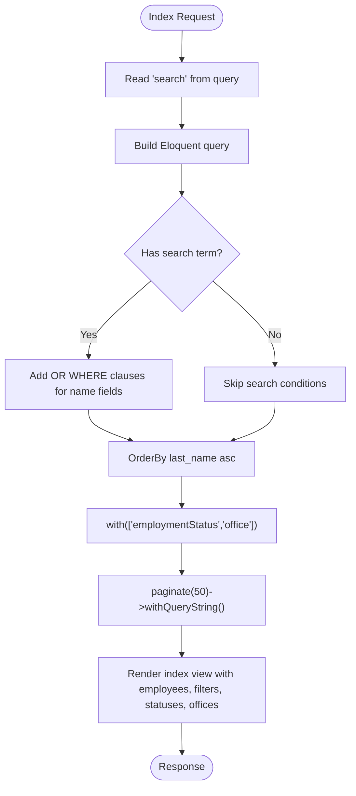
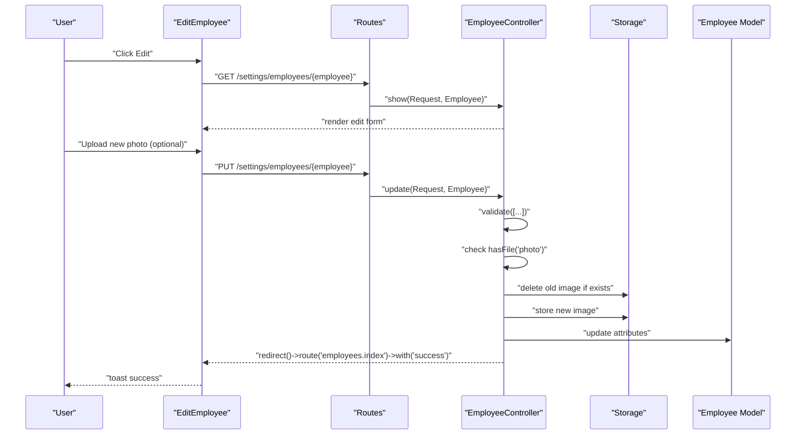
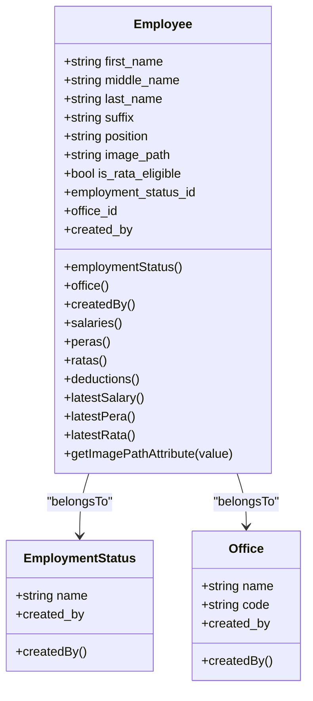
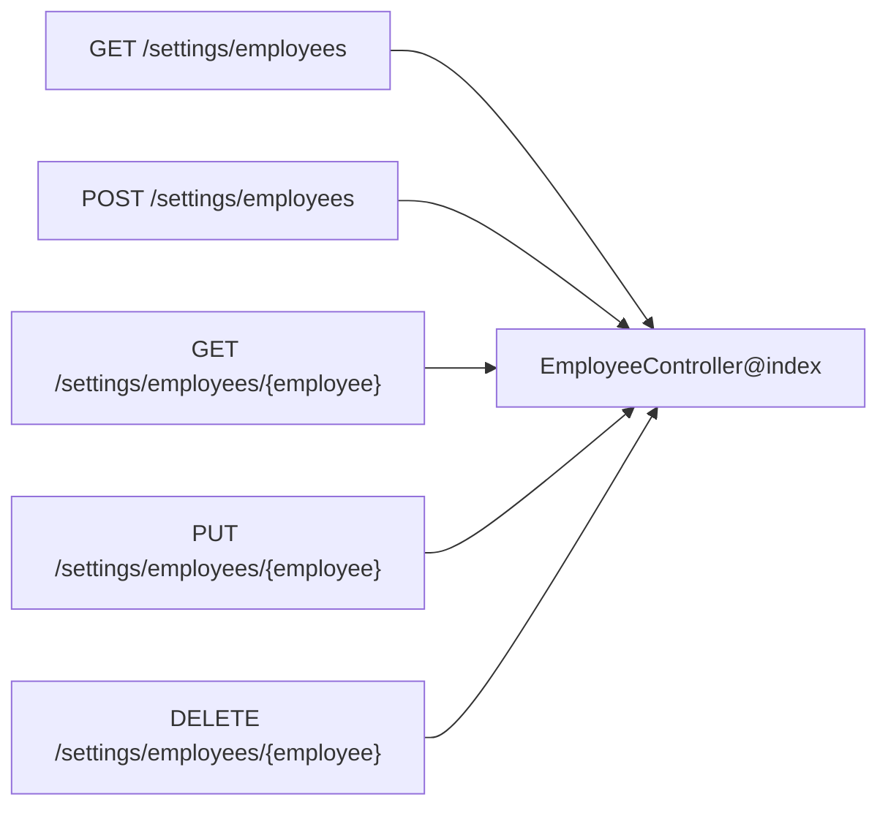
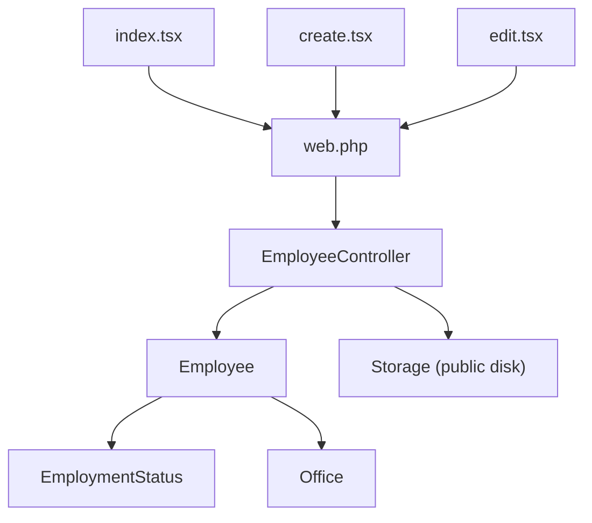

# Employee CRUD Operations

<cite>
**Referenced Files in This Document**
- [EmployeeController.php](file://app/Http/Controllers/EmployeeController.php)
- [Employee.php](file://app/Models/Employee.php)
- [create.tsx](file://resources/js/pages/settings/Employee/create.tsx)
- [edit.tsx](file://resources/js/pages/settings/Employee/edit.tsx)
- [index.tsx](file://resources/js/pages/settings/Employee/index.tsx)
- [2026_03_19_022838_create_employees_table.php](file://database/migrations/2026_03_19_022838_create_employees_table.php)
- [web.php](file://routes/web.php)
- [EmploymentStatus.php](file://app/Models/EmploymentStatus.php)
- [Office.php](file://app/Models/Office.php)
</cite>

## Table of Contents
1. [Introduction](#introduction)
2. [Project Structure](#project-structure)
3. [Core Components](#core-components)
4. [Architecture Overview](#architecture-overview)
5. [Detailed Component Analysis](#detailed-component-analysis)
6. [Dependency Analysis](#dependency-analysis)
7. [Performance Considerations](#performance-considerations)
8. [Troubleshooting Guide](#troubleshooting-guide)
9. [Conclusion](#conclusion)

## Introduction
This document explains the complete Employee CRUD lifecycle in the application, covering registration, listing with search and filtering, editing with photo replacement, and update validation. It details backend controller actions, model relationships, frontend form handling patterns, image upload mechanics, and success/error messaging. The goal is to provide a clear, actionable guide for developers and support teams to understand and maintain the employee management features.

## Project Structure
The employee feature spans three layers:
- Backend: Controller handles requests, validation, persistence, and file storage.
- Domain Model: Eloquent model defines attributes, casts, relations, and computed accessors.
- Frontend: Inertia-driven React components manage forms, previews, and submission.

**Diagram sources**
- [EmployeeController.php:12-118](file://app/Http/Controllers/EmployeeController.php#L12-L118)
- [Employee.php:10-103](file://app/Models/Employee.php#L10-L103)
- [index.tsx:33-168](file://resources/js/pages/settings/Employee/index.tsx#L33-L168)
- [create.tsx:22-269](file://resources/js/pages/settings/Employee/create.tsx#L22-L269)
- [edit.tsx:36-356](file://resources/js/pages/settings/Employee/edit.tsx#L36-L356)
- [web.php:85-94](file://routes/web.php#L85-L94)

**Section sources**
- [EmployeeController.php:12-118](file://app/Http/Controllers/EmployeeController.php#L12-L118)
- [Employee.php:10-103](file://app/Models/Employee.php#L10-L103)
- [index.tsx:33-168](file://resources/js/pages/settings/Employee/index.tsx#L33-L168)
- [create.tsx:22-269](file://resources/js/pages/settings/Employee/create.tsx#L22-L269)
- [edit.tsx:36-356](file://resources/js/pages/settings/Employee/edit.tsx#L36-L356)
- [web.php:85-94](file://routes/web.php#L85-L94)

## Core Components
- EmployeeController: Implements index, store, show, and update actions with validation, file handling, and redirects with success messages.
- Employee Model: Defines fillable attributes, boolean casting, soft deletes, belongs-to relations to EmploymentStatus and Office, and an accessor to resolve public URLs for images.
- Frontend Forms:
  - EmployeesIndex: Renders the listing, search, pagination, and action links.
  - CreateEmployeeDialog: Handles new employee registration with photo preview and submission.
  - EditEmployee: Manages updates, including optional photo replacement and validation feedback.

Key responsibilities:
- Validation: Enforces presence of required fields, existence of foreign keys, and image constraints.
- Image handling: Stores uploaded photos under the public disk in the employees directory and resolves URLs via the model accessor.
- Search and filtering: Index action supports search across multiple name fields and orders by last name.
- Success messaging: Redirects with success flash messages after create/update.

**Section sources**
- [EmployeeController.php:14-117](file://app/Http/Controllers/EmployeeController.php#L14-L117)
- [Employee.php:14-29](file://app/Models/Employee.php#L14-L29)
- [Employee.php:31-39](file://app/Models/Employee.php#L31-L39)
- [Employee.php:99-102](file://app/Models/Employee.php#L99-L102)
- [index.tsx:34-57](file://resources/js/pages/settings/Employee/index.tsx#L34-L57)
- [create.tsx:25-93](file://resources/js/pages/settings/Employee/create.tsx#L25-L93)
- [edit.tsx:52-99](file://resources/js/pages/settings/Employee/edit.tsx#L52-L99)

## Architecture Overview
The system follows a unidirectional data flow:
- Frontend components submit forms to named routes.
- Routes dispatch to EmployeeController actions.
- Controller validates input, persists data, manages uploads, and redirects.
- Next request renders updated lists or forms with success messages.

**Diagram sources**
- [create.tsx:84-93](file://resources/js/pages/settings/Employee/create.tsx#L84-L93)
- [web.php:87](file://routes/web.php#L87)
- [EmployeeController.php:45-78](file://app/Http/Controllers/EmployeeController.php#L45-L78)
- [Employee.php:14-25](file://app/Models/Employee.php#L14-L25)

## Detailed Component Analysis

### Employee Registration Workflow
End-to-end process for creating a new employee:
- Frontend form collects personal info, position, office, employment status, eligibility flag, and optional photo.
- On submit, the form posts to the store route with forceFormData enabled to support multipart/form-data.
- Controller validates fields and image constraints, stores the photo to the public disk under the employees directory, and creates the employee record.
- Redirects to the index page with a success message.

Validation rules enforced by the controller include:
- Required strings with length limits for names and position.
- Nullable suffix and boolean for eligibility.
- Foreign key existence checks for employment status and office.
- Optional image validation with allowed MIME types and size limit.

Success messaging is handled via redirect with a success key.

**Section sources**
- [create.tsx:25-93](file://resources/js/pages/settings/Employee/create.tsx#L25-L93)
- [EmployeeController.php:48-78](file://app/Http/Controllers/EmployeeController.php#L48-L78)
- [Employee.php:14-25](file://app/Models/Employee.php#L14-L25)

### Employee Listing with Search and Filtering
The index action supports:
- Search across first_name, middle_name, last_name, and suffix using "like" queries.
- Sorting by last_name ascending.
- Eager loading of related employment status and office for rendering.
- Pagination with query string preservation.

Frontend listing:
- Provides a search box bound to a form state.
- Submits on Enter and preserves scroll and state.
- Displays a table with avatar fallback, name, office, and status.
- Offers Edit and Delete action links.

**Diagram sources**
- [EmployeeController.php:14-41](file://app/Http/Controllers/EmployeeController.php#L14-L41)
- [index.tsx:34-57](file://resources/js/pages/settings/Employee/index.tsx#L34-L57)

**Section sources**
- [EmployeeController.php:16-28](file://app/Http/Controllers/EmployeeController.php#L16-L28)
- [index.tsx:34-57](file://resources/js/pages/settings/Employee/index.tsx#L34-L57)

### Employee Editing and Photo Replacement
Editing flow:
- The show route renders the edit form pre-populated with current values.
- The update action validates incoming data and optionally replaces the photo.
- If a new photo is provided, the controller deletes the old file from storage and stores the new one.
- Updates the record and redirects with a success message.

Photo replacement logic:
- If a new file is present, the controller removes the previous image from the public disk and stores the new one.
- The model’s accessor ensures the stored relative path resolves to a public URL for rendering.

**Section sources**
- [EmployeeController.php:80-117](file://app/Http/Controllers/EmployeeController.php#L80-L117)
- [edit.tsx:52-99](file://resources/js/pages/settings/Employee/edit.tsx#L52-L99)
- [Employee.php:99-102](file://app/Models/Employee.php#L99-L102)

### Data Model and Relationships
The Employee model defines:
- Fillable attributes including image_path and eligibility flag.
- Boolean casting for eligibility.
- Soft deletes for recoverability.
- Belongs-to relationships to EmploymentStatus and Office.
- Accessor to convert stored relative paths to public URLs.

**Diagram sources**
- [Employee.php:14-64](file://app/Models/Employee.php#L14-L64)
- [EmploymentStatus.php:13-21](file://app/Models/EmploymentStatus.php#L13-L21)
- [Office.php:13-22](file://app/Models/Office.php#L13-L22)

**Section sources**
- [Employee.php:14-64](file://app/Models/Employee.php#L14-L64)
- [EmploymentStatus.php:13-21](file://app/Models/EmploymentStatus.php#L13-L21)
- [Office.php:13-22](file://app/Models/Office.php#L13-L22)

### Routes and Navigation
Routes define the CRUD endpoints for employees under the settings prefix, including index, store, show, update, and destroy. The listing page links to the show route for editing.

**Diagram sources**
- [web.php:85-94](file://routes/web.php#L85-L94)

**Section sources**
- [web.php:85-94](file://routes/web.php#L85-L94)

## Dependency Analysis
- Controller depends on:
  - Employee model for persistence and relations.
  - Storage facade for file operations.
  - Inertia for rendering views.
- Model depends on:
  - EmploymentStatus and Office for relations.
  - Storage for URL resolution.
- Frontend components depend on:
  - Inertia for navigation and form submission.
  - UI primitives for inputs, selects, and dialogs.
  - Custom components for comboboxes and alerts.

Potential coupling:
- Tight coupling between controller validation rules and frontend form fields.
- Storage path assumptions in controller and model accessor.

Circular dependencies: None observed.

External dependencies:
- Laravel validation rules.
- Inertia adapter for React.
- Filesystem driver configured for public disk.

**Diagram sources**
- [index.tsx:33-168](file://resources/js/pages/settings/Employee/index.tsx#L33-L168)
- [create.tsx:22-269](file://resources/js/pages/settings/Employee/create.tsx#L22-L269)
- [edit.tsx:36-356](file://resources/js/pages/settings/Employee/edit.tsx#L36-L356)
- [web.php:85-94](file://routes/web.php#L85-L94)
- [EmployeeController.php:12-118](file://app/Http/Controllers/EmployeeController.php#L12-L118)
- [Employee.php:10-103](file://app/Models/Employee.php#L10-L103)

**Section sources**
- [index.tsx:33-168](file://resources/js/pages/settings/Employee/index.tsx#L33-L168)
- [create.tsx:22-269](file://resources/js/pages/settings/Employee/create.tsx#L22-L269)
- [edit.tsx:36-356](file://resources/js/pages/settings/Employee/edit.tsx#L36-L356)
- [web.php:85-94](file://routes/web.php#L85-L94)
- [EmployeeController.php:12-118](file://app/Http/Controllers/EmployeeController.php#L12-L118)
- [Employee.php:10-103](file://app/Models/Employee.php#L10-L103)

## Performance Considerations
- Pagination: The index action paginates results to avoid large payloads.
- Eager loading: Relations are loaded with the query to prevent N+1 issues.
- Image size limit: Enforced on upload to keep storage usage reasonable.
- Soft deletes: Allows recovery without rebuilding data.

Recommendations:
- Consider indexing search columns in the database for improved query performance.
- Add server-side image resizing for thumbnails to reduce bandwidth.
- Implement caching for static dropdown data (employment statuses, offices) where appropriate.

## Troubleshooting Guide
Common issues and resolutions:
- Validation failures:
  - Ensure required fields are filled and foreign keys match existing records.
  - Verify image MIME types and size constraints.
- Photo replacement not working:
  - Confirm the photo field is included in the form and forceFormData is enabled.
  - Check storage permissions for the public disk.
- Empty search results:
  - Verify the search term matches expected name fields.
  - Ensure the index action receives and applies the search parameter.
- Success messages not shown:
  - Confirm redirect with success key is returned by the controller action.
  - Ensure the frontend toast consumes the flash message.

**Section sources**
- [EmployeeController.php:48-105](file://app/Http/Controllers/EmployeeController.php#L48-L105)
- [create.tsx:87-92](file://resources/js/pages/settings/Employee/create.tsx#L87-L92)
- [edit.tsx:91-97](file://resources/js/pages/settings/Employee/edit.tsx#L91-L97)

## Conclusion
The employee CRUD implementation integrates clean separation of concerns across backend controllers, domain models, and frontend components. It enforces robust validation, handles image uploads securely, and provides responsive user feedback. The design supports scalable enhancements such as advanced filtering, bulk operations, and audit trails while maintaining simplicity and reliability.