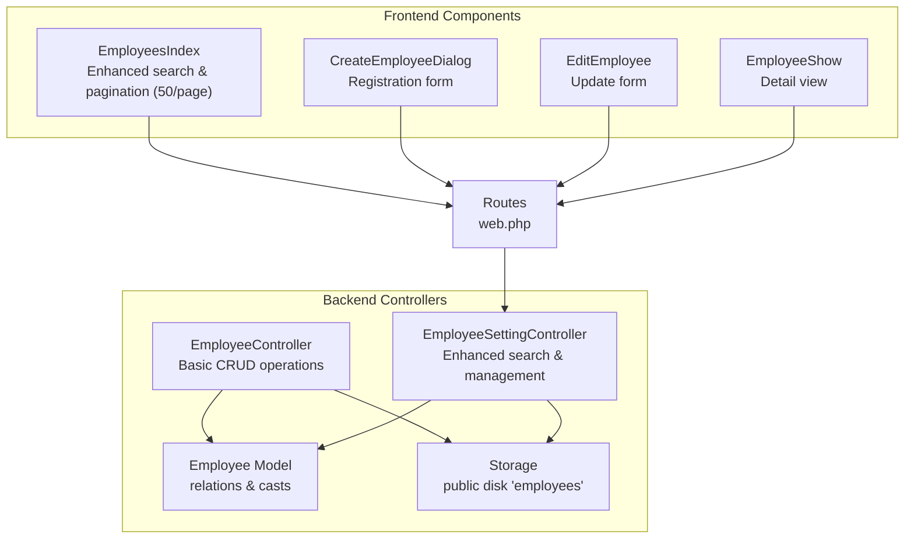
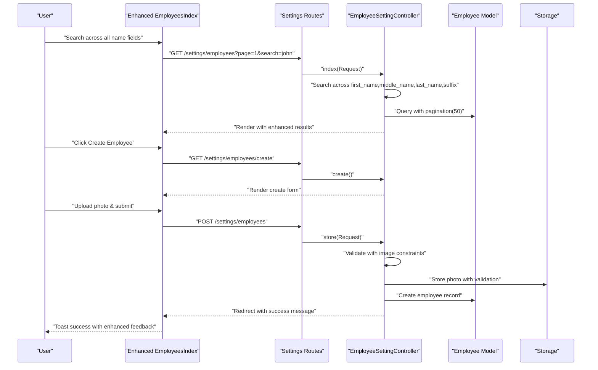
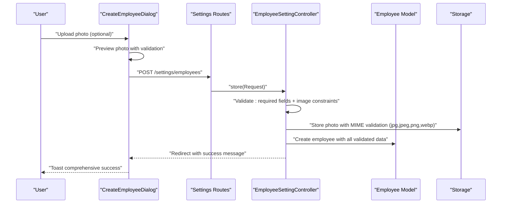
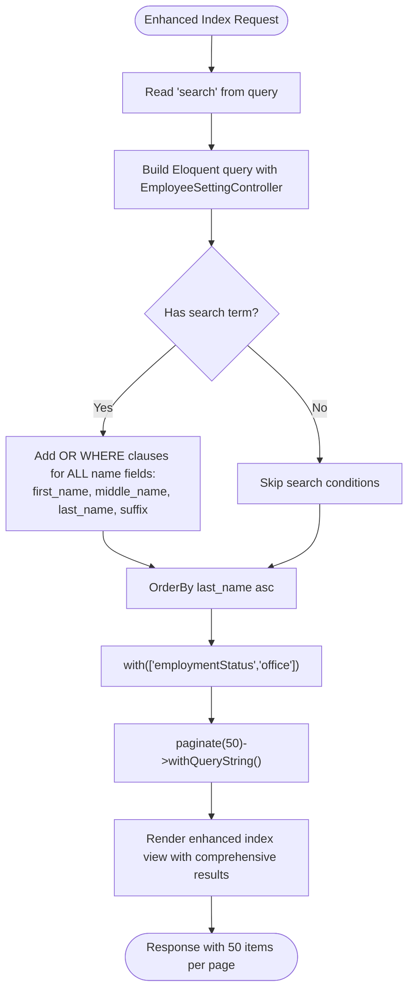
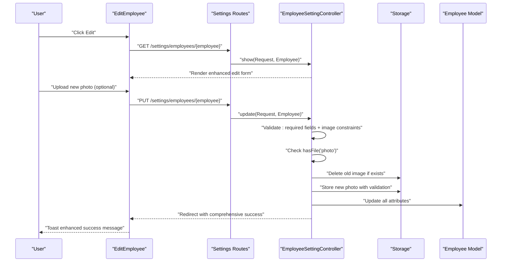
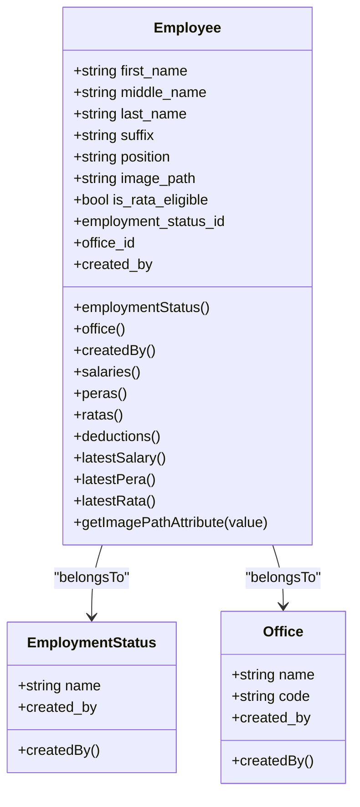
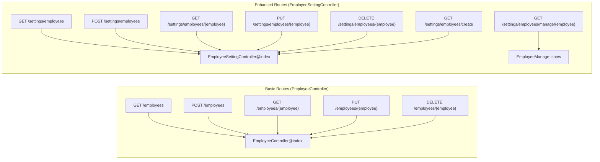
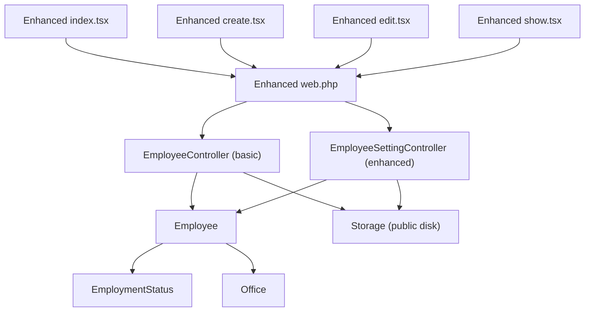

# Employee CRUD Operations

<cite>
**Referenced Files in This Document**
- [EmployeeSettingController.php](file://app/Http/Controllers/EmployeeSettingController.php)
- [EmployeeController.php](file://app/Http/Controllers/EmployeeController.php)
- [Employee.php](file://app/Models/Employee.php)
- [create.tsx](file://resources/js/pages/settings/Employee/create.tsx)
- [edit.tsx](file://resources/js/pages/settings/Employee/edit.tsx)
- [index.tsx](file://resources/js/pages/settings/Employee/index.tsx)
- [show.tsx](file://resources/js/pages/settings/Employee/show.tsx)
- [2026_03_19_022838_create_employees_table.php](file://database/migrations/2026_03_19_022838_create_employees_table.php)
- [web.php](file://routes/web.php)
- [EmploymentStatus.php](file://app/Models/EmploymentStatus.php)
- [Office.php](file://app/Models/Office.php)
</cite>

## Update Summary
**Changes Made**
- Updated to reflect new EmployeeSettingController with enhanced search functionality
- Added comprehensive photo upload validation details
- Updated pagination from 10 to 50 items per page
- Enhanced search across middle_name and suffix fields
- Updated routing structure and controller responsibilities

## Table of Contents
1. [Introduction](#introduction)
2. [Project Structure](#project-structure)
3. [Core Components](#core-components)
4. [Architecture Overview](#architecture-overview)
5. [Detailed Component Analysis](#detailed-component-analysis)
6. [Dependency Analysis](#dependency-analysis)
7. [Performance Considerations](#performance-considerations)
8. [Troubleshooting Guide](#troubleshooting-guide)
9. [Conclusion](#conclusion)

## Introduction
This document explains the complete Employee CRUD lifecycle in the application, covering registration, listing with enhanced search and filtering, editing with photo replacement, and update validation. The system now features two distinct controllers: EmployeeController for basic operations and EmployeeSettingController for comprehensive employee management with advanced search capabilities. It details backend controller actions, model relationships, frontend form handling patterns, image upload mechanics, and success/error messaging.

## Project Structure
The employee feature now spans three layers with enhanced controller separation:
- Backend: Two controllers handle different aspects - EmployeeController for basic CRUD and EmployeeSettingController for comprehensive management
- Domain Model: Eloquent model defines attributes, casts, relations, and computed accessors
- Frontend: Inertia-driven React components manage forms, previews, and submission with enhanced search capabilities

**Diagram sources**
- [EmployeeController.php:12-132](file://app/Http/Controllers/EmployeeController.php#L12-L132)
- [EmployeeSettingController.php:12-139](file://app/Http/Controllers/EmployeeSettingController.php#L12-L139)
- [Employee.php:10-103](file://app/Models/Employee.php#L10-L103)
- [index.tsx:33-231](file://resources/js/pages/settings/Employee/index.tsx#L33-L231)
- [create.tsx:22-283](file://resources/js/pages/settings/Employee/create.tsx#L22-L283)
- [edit.tsx:36-311](file://resources/js/pages/settings/Employee/edit.tsx#L36-L311)
- [show.tsx:25-142](file://resources/js/pages/settings/Employee/show.tsx#L25-L142)
- [web.php:72-107](file://routes/web.php#L72-L107)

**Section sources**
- [EmployeeController.php:12-132](file://app/Http/Controllers/EmployeeController.php#L12-L132)
- [EmployeeSettingController.php:12-139](file://app/Http/Controllers/EmployeeSettingController.php#L12-L139)
- [Employee.php:10-103](file://app/Models/Employee.php#L10-L103)
- [index.tsx:33-231](file://resources/js/pages/settings/Employee/index.tsx#L33-L231)
- [create.tsx:22-283](file://resources/js/pages/settings/Employee/create.tsx#L22-L283)
- [edit.tsx:36-311](file://resources/js/pages/settings/Employee/edit.tsx#L36-L311)
- [show.tsx:25-142](file://resources/js/pages/settings/Employee/show.tsx#L25-L142)
- [web.php:72-107](file://routes/web.php#L72-L107)

## Core Components
- **EmployeeSettingController**: Enhanced CRUD operations with comprehensive search across all name fields, improved pagination (50 items per page), and robust photo upload validation
- **EmployeeController**: Basic CRUD operations with streamlined search functionality
- **Employee Model**: Defines fillable attributes, boolean casting, soft deletes, belongs-to relations to EmploymentStatus and Office, and an accessor to resolve public URLs for images
- **Frontend Forms**:
  - EmployeesIndex: Enhanced listing with comprehensive search across first_name, middle_name, last_name, and suffix
  - CreateEmployeeDialog: Handles new employee registration with photo preview and submission
  - EditEmployee: Manages updates, including optional photo replacement and validation feedback
  - EmployeeShow: Detailed view with comprehensive employee information

Key responsibilities:
- **Enhanced Validation**: Comprehensive presence validation for required fields, existence checks for foreign keys, and robust image constraints with MIME type and size validation
- **Advanced Image Handling**: Stores uploaded photos under the public disk in the employees directory with comprehensive validation
- **Expanded Search**: Index action supports search across all name fields (first_name, middle_name, last_name, suffix) with OR conditions
- **Improved Pagination**: 50 items per page for better user experience with query string preservation
- **Success Messaging**: Redirects with success flash messages after create/update operations

**Section sources**
- [EmployeeSettingController.php:14-139](file://app/Http/Controllers/EmployeeSettingController.php#L14-L139)
- [EmployeeController.php:14-132](file://app/Http/Controllers/EmployeeController.php#L14-L132)
- [Employee.php:14-29](file://app/Models/Employee.php#L14-L29)
- [Employee.php:31-39](file://app/Models/Employee.php#L31-L39)
- [Employee.php:99-102](file://app/Models/Employee.php#L99-L102)
- [index.tsx:34-57](file://resources/js/pages/settings/Employee/index.tsx#L34-L57)
- [create.tsx:25-93](file://resources/js/pages/settings/Employee/create.tsx#L25-L93)
- [edit.tsx:52-99](file://resources/js/pages/settings/Employee/edit.tsx#L52-L99)
- [show.tsx:25-142](file://resources/js/pages/settings/Employee/show.tsx#L25-L142)

## Architecture Overview
The system follows a unidirectional data flow with enhanced controller separation:
- Frontend components submit forms to named routes with enhanced search capabilities
- Routes dispatch to appropriate controllers based on functionality level
- Controllers validate input, persist data, manage uploads, and redirect with enhanced feedback
- Next request renders updated lists or forms with comprehensive success messages

**Diagram sources**
- [index.tsx:80-90](file://resources/js/pages/settings/Employee/index.tsx#L80-L90)
- [web.php:97-103](file://routes/web.php#L97-L103)
- [EmployeeSettingController.php:14-41](file://app/Http/Controllers/EmployeeSettingController.php#L14-L41)
- [EmployeeSettingController.php:54-87](file://app/Http/Controllers/EmployeeSettingController.php#L54-L87)
- [Employee.php:14-25](file://app/Models/Employee.php#L14-L25)

## Detailed Component Analysis

### Enhanced Employee Registration Workflow
End-to-end process for creating a new employee with comprehensive validation:
- Frontend form collects personal info, position, office, employment status, eligibility flag, and optional photo
- On submit, the form posts to the store route with forceFormData enabled to support multipart/form-data
- Controller validates all fields including comprehensive image constraints with MIME type and size validation
- Stores the photo to the public disk under the employees directory with validation
- Creates the employee record with all validated data
- Redirects to the enhanced index page with a comprehensive success message

Validation rules enforced by the controller include:
- Required strings with length limits for names and position
- Nullable suffix and boolean for eligibility
- Foreign key existence checks for employment status and office
- Optional image validation with comprehensive MIME types (jpg, jpeg, png, webp) and 2MB size limit

**Section sources**
- [create.tsx:25-93](file://resources/js/pages/settings/Employee/create.tsx#L25-L93)
- [EmployeeSettingController.php:54-87](file://app/Http/Controllers/EmployeeSettingController.php#L54-L87)
- [Employee.php:14-25](file://app/Models/Employee.php#L14-L25)

### Enhanced Employee Listing with Advanced Search and Improved Pagination
The EmployeeSettingController index action supports:
- **Comprehensive Search**: Search across first_name, middle_name, last_name, and suffix using OR WHERE clauses
- **Improved Pagination**: 50 items per page for better user experience with query string preservation
- **Enhanced Sorting**: Orders by last_name ascending for logical display
- **Optimized Loading**: Eager loading of related employment status and office for efficient rendering
- **State Management**: Preserves search state and scroll position during navigation

Frontend listing enhancements:
- Provides a sophisticated search box bound to form state with Enter key support
- Submits search queries with comprehensive filtering across all name fields
- Displays enhanced table with avatar fallback, comprehensive name display, office, and status
- Offers improved Edit and Delete action links with better visual feedback
- Implements pagination with 50 items per page for better performance

**Diagram sources**
- [EmployeeSettingController.php:14-41](file://app/Http/Controllers/EmployeeSettingController.php#L14-L41)
- [index.tsx:34-57](file://resources/js/pages/settings/Employee/index.tsx#L34-L57)

**Section sources**
- [EmployeeSettingController.php:14-41](file://app/Http/Controllers/EmployeeSettingController.php#L14-L41)
- [index.tsx:34-57](file://resources/js/pages/settings/Employee/index.tsx#L34-L57)

### Enhanced Employee Editing and Photo Replacement
Editing flow with comprehensive validation:
- The show route renders the edit form pre-populated with current values including all name fields
- The update action validates incoming data with comprehensive field validation
- Optionally replaces the photo with enhanced validation and secure deletion
- If a new photo is provided, the controller deletes the old file from storage and stores the new one with validation
- Updates the record with all validated data and redirects with a comprehensive success message

Photo replacement logic with enhanced security:
- If a new file is present, the controller removes the previous image from the public disk with validation
- Stores the new photo with comprehensive MIME type and size validation
- The model's accessor ensures the stored relative path resolves to a public URL for rendering

**Section sources**
- [EmployeeSettingController.php:89-139](file://app/Http/Controllers/EmployeeSettingController.php#L89-L139)
- [edit.tsx:52-99](file://resources/js/pages/settings/Employee/edit.tsx#L52-L99)
- [Employee.php:99-102](file://app/Models/Employee.php#L99-L102)

### Data Model and Relationships
The Employee model defines:
- Fillable attributes including image_path and eligibility flag
- Boolean casting for eligibility
- Soft deletes for recoverability
- Belongs-to relationships to EmploymentStatus and Office
- Accessor to convert stored relative paths to public URLs

**Diagram sources**
- [Employee.php:14-64](file://app/Models/Employee.php#L14-L64)
- [EmploymentStatus.php:13-21](file://app/Models/EmploymentStatus.php#L13-L21)
- [Office.php:13-22](file://app/Models/Office.php#L13-L22)

**Section sources**
- [Employee.php:14-64](file://app/Models/Employee.php#L14-L64)
- [EmploymentStatus.php:13-21](file://app/Models/EmploymentStatus.php#L13-L21)
- [Office.php:13-22](file://app/Models/Office.php#L13-L22)

### Enhanced Routes and Navigation
Enhanced routing structure with separate controllers for different functionality levels:
- **Basic Routes**: EmployeeController handles fundamental CRUD operations
- **Enhanced Routes**: EmployeeSettingController handles comprehensive management with advanced search
- **Settings Prefix**: All enhanced routes use the settings prefix for better organization
- **Route Naming**: Clear naming conventions for different operation levels

**Diagram sources**
- [web.php:72-107](file://routes/web.php#L72-L107)

**Section sources**
- [web.php:72-107](file://routes/web.php#L72-L107)

## Dependency Analysis
- **Enhanced Controller Dependencies**:
  - EmployeeSettingController depends on Employee model for comprehensive persistence and relations
  - EmployeeController maintains simplified dependencies for basic operations
  - Both controllers utilize Storage facade for secure file operations
  - Both use Inertia for enhanced frontend integration
- **Model Dependencies**:
  - Employee model maintains relationships with EmploymentStatus and Office
  - Storage integration for URL resolution and file management
- **Frontend Component Dependencies**:
  - Enhanced components leverage improved form handling and validation
  - Better integration with search functionality and pagination
  - Enhanced toast notifications for comprehensive feedback

Potential coupling improvements:
- **Reduced Coupling**: Separate controllers allow for focused functionality
- **Enhanced Validation**: Robust validation rules applied consistently across both controllers
- **Improved Storage Management**: Unified approach to photo handling with comprehensive validation

External dependencies remain consistent:
- Laravel validation rules with enhanced constraints
- Inertia adapter for React with improved integration
- Filesystem driver configured for public disk with comprehensive validation

**Diagram sources**
- [index.tsx:33-231](file://resources/js/pages/settings/Employee/index.tsx#L33-L231)
- [create.tsx:22-283](file://resources/js/pages/settings/Employee/create.tsx#L22-L283)
- [edit.tsx:36-311](file://resources/js/pages/settings/Employee/edit.tsx#L36-L311)
- [show.tsx:25-142](file://resources/js/pages/settings/Employee/show.tsx#L25-L142)
- [web.php:72-107](file://routes/web.php#L72-L107)
- [EmployeeController.php:12-132](file://app/Http/Controllers/EmployeeController.php#L12-L132)
- [EmployeeSettingController.php:12-139](file://app/Http/Controllers/EmployeeSettingController.php#L12-L139)
- [Employee.php:10-103](file://app/Models/Employee.php#L10-L103)

**Section sources**
- [index.tsx:33-231](file://resources/js/pages/settings/Employee/index.tsx#L33-L231)
- [create.tsx:22-283](file://resources/js/pages/settings/Employee/create.tsx#L22-L283)
- [edit.tsx:36-311](file://resources/js/pages/settings/Employee/edit.tsx#L36-L311)
- [show.tsx:25-142](file://resources/js/pages/settings/Employee/show.tsx#L25-L142)
- [web.php:72-107](file://routes/web.php#L72-L107)
- [EmployeeController.php:12-132](file://app/Http/Controllers/EmployeeController.php#L12-L132)
- [EmployeeSettingController.php:12-139](file://app/Http/Controllers/EmployeeSettingController.php#L12-L139)
- [Employee.php:10-103](file://app/Models/Employee.php#L10-L103)

## Performance Considerations
- **Enhanced Pagination**: Improved user experience with 50 items per page instead of 10
- **Optimized Queries**: Eager loading of relations prevents N+1 issues in both controllers
- **Comprehensive Validation**: Early validation reduces unnecessary processing and storage
- **Secure Storage**: Enhanced file validation prevents invalid or malicious uploads
- **Soft Deletes**: Allows recovery without rebuilding data in both controllers

Recommendations:
- **Database Indexing**: Consider adding indexes on frequently searched columns (first_name, middle_name, last_name, suffix)
- **Image Optimization**: Implement server-side image resizing for thumbnails to reduce bandwidth
- **Caching Strategy**: Implement caching for static dropdown data (employment statuses, offices) where appropriate
- **Search Performance**: Consider full-text search implementation for complex name queries

## Troubleshooting Guide
Common issues and resolutions with enhanced functionality:
- **Enhanced Validation Failures**:
  - Ensure required fields are filled and foreign keys match existing records
  - Verify image MIME types (jpg, jpeg, png, webp) and 2MB size constraints
  - Check that search terms are properly encoded for URL queries
- **Photo Replacement Issues**:
  - Confirm the photo field is included in the form and forceFormData is enabled
  - Check storage permissions for the public disk
  - Verify that old photos are properly deleted before storing new ones
- **Enhanced Search Not Working**:
  - Verify the search term matches expected name fields across all four fields
  - Ensure the EmployeeSettingController index action receives and applies the search parameter
  - Check that pagination is working correctly with 50 items per page
- **Success Messages Not Shown**:
  - Confirm redirect with success key is returned by the controller action
  - Ensure the frontend toast consumes the flash message
  - Verify that enhanced success messages are properly formatted

**Section sources**
- [EmployeeSettingController.php:54-139](file://app/Http/Controllers/EmployeeSettingController.php#L54-L139)
- [EmployeeController.php:47-132](file://app/Http/Controllers/EmployeeController.php#L47-L132)
- [create.tsx:87-92](file://resources/js/pages/settings/Employee/create.tsx#L87-L92)
- [edit.tsx:91-97](file://resources/js/pages/settings/Employee/edit.tsx#L91-L97)
- [index.tsx:80-90](file://resources/js/pages/settings/Employee/index.tsx#L80-L90)

## Conclusion
The enhanced employee CRUD implementation provides a robust foundation for comprehensive employee management with improved search capabilities, enhanced validation, and better user experience. The separation of controllers allows for focused functionality while maintaining clean architecture. The system enforces comprehensive validation, handles secure image uploads, and provides responsive user feedback. The design supports scalable enhancements such as advanced filtering, bulk operations, and audit trails while maintaining simplicity and reliability. The enhanced search functionality across all name fields, improved pagination, and comprehensive photo validation significantly improve the user experience and data integrity.