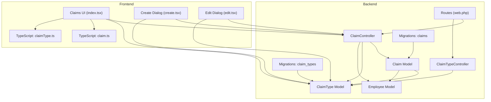
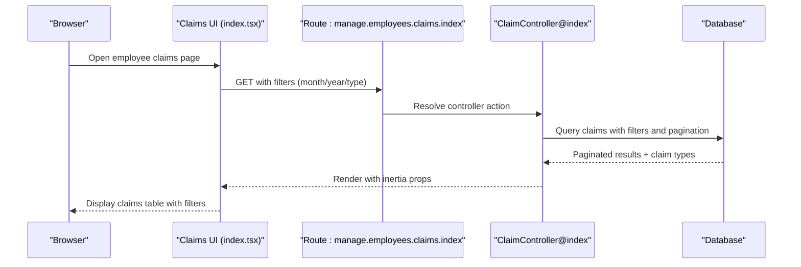
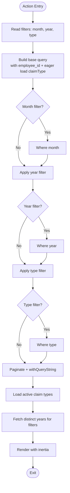
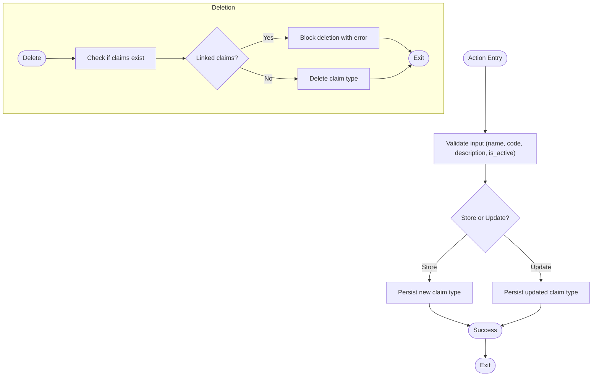
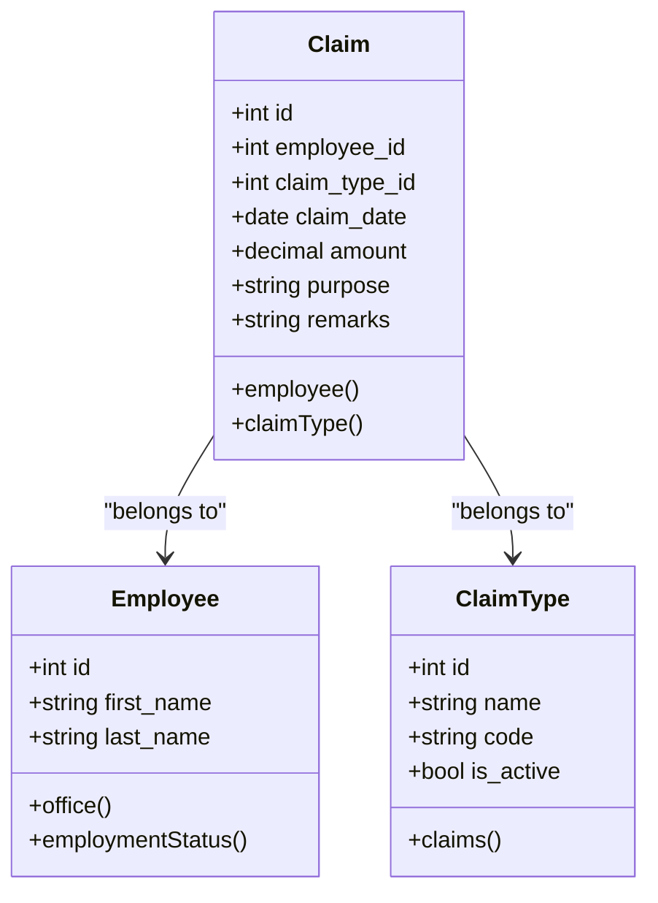
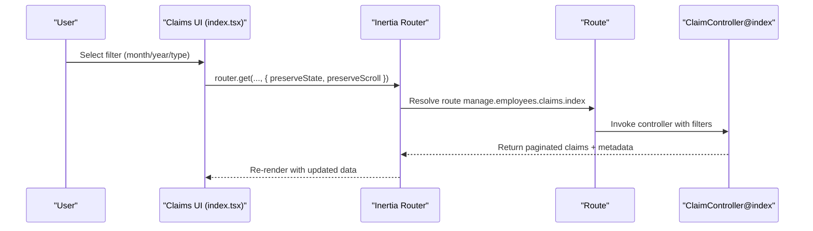
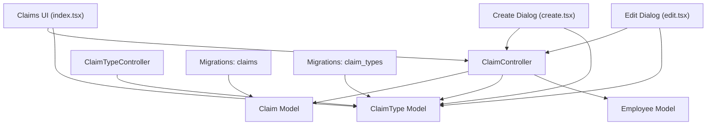

# Employee Claims Management

<cite>
**Referenced Files in This Document**
- [ClaimController.php](file://app/Http/Controllers/ClaimController.php)
- [ClaimTypeController.php](file://app/Http/Controllers/ClaimTypeController.php)
- [Claim.php](file://app/Models/Claim.php)
- [ClaimType.php](file://app/Models/ClaimType.php)
- [Employee.php](file://app/Models/Employee.php)
- [2026_03_23_053024_create_claims_table.php](file://database/migrations/2026_03_23_053024_create_claims_table.php)
- [2026_03_23_053019_create_claim_types_table.php](file://database/migrations/2026_03_23_053019_create_claim_types_table.php)
- [index.tsx](file://resources/js/pages/Employees/Manage/claims/index.tsx)
- [create.tsx](file://resources/js/pages/Employees/Manage/claims/create.tsx)
- [edit.tsx](file://resources/js/pages/Employees/Manage/claims/edit.tsx)
- [claim.ts](file://resources/js/types/claim.ts)
- [claimType.ts](file://resources/js/types/claimType.ts)
- [web.php](file://routes/web.php)
</cite>

## Table of Contents
1. [Introduction](#introduction)
2. [Project Structure](#project-structure)
3. [Core Components](#core-components)
4. [Architecture Overview](#architecture-overview)
5. [Detailed Component Analysis](#detailed-component-analysis)
6. [Dependency Analysis](#dependency-analysis)
7. [Performance Considerations](#performance-considerations)
8. [Troubleshooting Guide](#troubleshooting-guide)
9. [Conclusion](#conclusion)

## Introduction
This document describes the Employee Claims Management system, which enables authorized users to record, track, and manage employee expense claims. The system provides filtering capabilities by date range and claim type, supports CRUD operations for claims, and maintains claim types for categorization. It integrates Laravel backend controllers and Eloquent models with an Inertia-based React frontend for a seamless user experience.

## Project Structure
The claims management feature spans backend controllers and models, database migrations, and frontend React components with TypeScript types.

**Diagram sources**
- [web.php:86-91](file://routes/web.php#L86-L91)
- [ClaimController.php:11-97](file://app/Http/Controllers/ClaimController.php#L11-L97)
- [ClaimTypeController.php:9-58](file://app/Http/Controllers/ClaimTypeController.php#L9-L58)
- [Claim.php:8-35](file://app/Models/Claim.php#L8-L35)
- [ClaimType.php:8-27](file://app/Models/ClaimType.php#L8-L27)
- [Employee.php:10-103](file://app/Models/Employee.php#L10-L103)
- [2026_03_23_053024_create_claims_table.php:14-23](file://database/migrations/2026_03_23_053024_create_claims_table.php#L14-L23)
- [2026_03_23_053019_create_claim_types_table.php:14-21](file://database/migrations/2026_03_23_053019_create_claim_types_table.php#L14-L21)
- [index.tsx:31-179](file://resources/js/pages/Employees/Manage/claims/index.tsx#L31-L179)
- [create.tsx:18-113](file://resources/js/pages/Employees/Manage/claims/create.tsx#L18-L113)
- [edit.tsx:21-128](file://resources/js/pages/Employees/Manage/claims/edit.tsx#L21-L128)
- [claim.ts:3-30](file://resources/js/types/claim.ts#L3-L30)
- [claimType.ts:1-9](file://resources/js/types/claimType.ts#L1-L9)

**Section sources**
- [web.php:1-129](file://routes/web.php#L1-L129)
- [ClaimController.php:1-98](file://app/Http/Controllers/ClaimController.php#L1-L98)
- [ClaimTypeController.php:1-59](file://app/Http/Controllers/ClaimTypeController.php#L1-L59)
- [Claim.php:1-36](file://app/Models/Claim.php#L1-L36)
- [ClaimType.php:1-28](file://app/Models/ClaimType.php#L1-L28)
- [Employee.php:1-104](file://app/Models/Employee.php#L1-L104)
- [2026_03_23_053024_create_claims_table.php:1-34](file://database/migrations/2026_03_23_053024_create_claims_table.php#L1-L34)
- [2026_03_23_053019_create_claim_types_table.php:1-32](file://database/migrations/2026_03_23_053019_create_claim_types_table.php#L1-L32)
- [index.tsx:1-180](file://resources/js/pages/Employees/Manage/claims/index.tsx#L1-L180)
- [create.tsx:1-114](file://resources/js/pages/Employees/Manage/claims/create.tsx#L1-L114)
- [edit.tsx:1-129](file://resources/js/pages/Employees/Manage/claims/edit.tsx#L1-L129)
- [claim.ts:1-31](file://resources/js/types/claim.ts#L1-L31)
- [claimType.ts:1-10](file://resources/js/types/claimType.ts#L1-L10)

## Core Components
- ClaimController: Handles listing, creating, updating, and deleting employee claims with filtering by month, year, and type.
- ClaimTypeController: Manages claim types with validation and prevents deletion when linked to existing claims.
- Claim model: Defines fillable attributes, casting for date and currency, and relationships to Employee and ClaimType.
- ClaimType model: Stores claim categories with active status scoping and relationship to claims.
- Employee model: Provides office and employment status relationships used in claim listings.
- Frontend UI: React components for listing claims, creating new claims, editing existing claims, and filtering via comboboxes.
- Routes: RESTful endpoints under the manage.employees.claims.* namespace.

Key responsibilities:
- Backend validation and persistence for claims and claim types.
- Frontend form handling, filtering, and pagination integration.
- Relationship enforcement via foreign keys and cascading behavior.

**Section sources**
- [ClaimController.php:13-96](file://app/Http/Controllers/ClaimController.php#L13-L96)
- [ClaimTypeController.php:11-57](file://app/Http/Controllers/ClaimTypeController.php#L11-L57)
- [Claim.php:12-34](file://app/Models/Claim.php#L12-L34)
- [ClaimType.php:12-26](file://app/Models/ClaimType.php#L12-L26)
- [Employee.php:31-44](file://app/Models/Employee.php#L31-L44)
- [index.tsx:46-66](file://resources/js/pages/Employees/Manage/claims/index.tsx#L46-L66)
- [web.php:86-91](file://routes/web.php#L86-L91)

## Architecture Overview
The system follows a layered architecture:
- Presentation Layer: Inertia renders React components server-side with filtered data.
- Application Layer: Controllers orchestrate requests, apply filters, and coordinate model interactions.
- Domain Layer: Eloquent models encapsulate business rules, casts, and relationships.
- Data Access Layer: Migrations define schema and constraints; controllers persist validated data.

**Diagram sources**
- [index.tsx:46-52](file://resources/js/pages/Employees/Manage/claims/index.tsx#L46-L52)
- [web.php:87](file://routes/web.php#L87)
- [ClaimController.php:13-57](file://app/Http/Controllers/ClaimController.php#L13-L57)

## Detailed Component Analysis

### ClaimController
Responsibilities:
- Filter claims by month, year, and claim type.
- Paginate results with query string preservation.
- Validate and persist new claims with employee association.
- Update and delete claims with appropriate feedback.

Processing logic highlights:
- Dynamic query building with optional month/year/type filters.
- Fetching distinct years for filter dropdown generation.
- Using Inertia render to pass employee, claims, claim types, and available years.

**Diagram sources**
- [ClaimController.php:13-57](file://app/Http/Controllers/ClaimController.php#L13-L57)

**Section sources**
- [ClaimController.php:13-57](file://app/Http/Controllers/ClaimController.php#L13-L57)
- [ClaimController.php:59-96](file://app/Http/Controllers/ClaimController.php#L59-L96)

### ClaimTypeController
Responsibilities:
- List claim types ordered by name.
- Validate and create claim types with unique codes.
- Update claim types with unique code validation excluding current record.
- Prevent deletion if associated claims exist.

**Diagram sources**
- [ClaimTypeController.php:20-46](file://app/Http/Controllers/ClaimTypeController.php#L20-L46)
- [ClaimTypeController.php:48-57](file://app/Http/Controllers/ClaimTypeController.php#L48-L57)

**Section sources**
- [ClaimTypeController.php:11-57](file://app/Http/Controllers/ClaimTypeController.php#L11-L57)

### Claim Model
Relationships and casts:
- Belongs to Employee and ClaimType.
- Casts claim_date to date and amount to decimal with 2 decimals.

**Diagram sources**
- [Claim.php:26-34](file://app/Models/Claim.php#L26-L34)
- [Employee.php:31-44](file://app/Models/Employee.php#L31-L44)
- [ClaimType.php:18-21](file://app/Models/ClaimType.php#L18-L21)

**Section sources**
- [Claim.php:12-34](file://app/Models/Claim.php#L12-L34)

### ClaimType Model
- Fillable fields include name, code, description, and is_active.
- Scope method active() filters only active claim types.

**Section sources**
- [ClaimType.php:12-26](file://app/Models/ClaimType.php#L12-L26)

### Frontend Claims UI
- Filtering: Month, year, and claim type comboboxes trigger route updates with preserveState and preserveScroll.
- Listing: Claims table displays formatted date, type badge, purpose, remarks, and amount.
- Actions: Edit and delete buttons open dialogs; delete confirms before sending DELETE request.
- Pagination: Integrated pagination controls.

**Diagram sources**
- [index.tsx:46-52](file://resources/js/pages/Employees/Manage/claims/index.tsx#L46-L52)
- [web.php:87](file://routes/web.php#L87)
- [ClaimController.php:13-57](file://app/Http/Controllers/ClaimController.php#L13-L57)

**Section sources**
- [index.tsx:31-179](file://resources/js/pages/Employees/Manage/claims/index.tsx#L31-L179)
- [create.tsx:18-113](file://resources/js/pages/Employees/Manage/claims/create.tsx#L18-L113)
- [edit.tsx:21-128](file://resources/js/pages/Employees/Manage/claims/edit.tsx#L21-L128)
- [claim.ts:3-30](file://resources/js/types/claim.ts#L3-L30)
- [claimType.ts:1-9](file://resources/js/types/claimType.ts#L1-L9)

## Dependency Analysis
- Controllers depend on Eloquent models and Inertia for rendering.
- ClaimController depends on ClaimType for active claim types and Employee for context.
- Frontend components depend on TypeScript types and Inertia routing helpers.
- Database constraints enforce referential integrity between claims and claim_types, and cascade deletion from employees.

**Diagram sources**
- [ClaimController.php:5-8](file://app/Http/Controllers/ClaimController.php#L5-L8)
- [ClaimTypeController.php:5-6](file://app/Http/Controllers/ClaimTypeController.php#L5-L6)
- [Claim.php:26-34](file://app/Models/Claim.php#L26-L34)
- [ClaimType.php:18-21](file://app/Models/ClaimType.php#L18-L21)
- [Employee.php:31-44](file://app/Models/Employee.php#L31-L44)
- [index.tsx:31-179](file://resources/js/pages/Employees/Manage/claims/index.tsx#L31-L179)
- [create.tsx:18-113](file://resources/js/pages/Employees/Manage/claims/create.tsx#L18-L113)
- [edit.tsx:21-128](file://resources/js/pages/Employees/Manage/claims/edit.tsx#L21-L128)
- [2026_03_23_053024_create_claims_table.php:16-17](file://database/migrations/2026_03_23_053024_create_claims_table.php#L16-L17)
- [2026_03_23_053019_create_claim_types_table.php:17](file://database/migrations/2026_03_23_053019_create_claim_types_table.php#L17)

**Section sources**
- [ClaimController.php:5-8](file://app/Http/Controllers/ClaimController.php#L5-L8)
- [ClaimTypeController.php:5-6](file://app/Http/Controllers/ClaimTypeController.php#L5-L6)
- [2026_03_23_053024_create_claims_table.php:16-17](file://database/migrations/2026_03_23_053024_create_claims_table.php#L16-L17)
- [2026_03_23_053019_create_claim_types_table.php:17](file://database/migrations/2026_03_23_053019_create_claim_types_table.php#L17)

## Performance Considerations
- Query optimization: The controller builds a filtered query with optional month/year/type conditions and eager loads claimType to reduce N+1 queries.
- Pagination: Results are paginated with 20 items per page and query string preservation for efficient browsing.
- Currency casting: Amounts are cast to decimal with two decimal places to avoid precision errors.
- Unique constraints: ClaimType code uniqueness prevents redundant entries and supports efficient lookups.

[No sources needed since this section provides general guidance]

## Troubleshooting Guide
Common issues and resolutions:
- Validation errors on claim creation/update: Ensure claim_type_id exists, claim_date is a valid date, amount is numeric and non-negative, and purpose is provided.
- Cannot delete claim type: The system blocks deletion if claims exist for that type; remove or reassign dependent claims first.
- Empty claims list: Verify filters (month/year/type) and that claims exist for the selected employee.
- Incorrect amounts or dates: Confirm currency formatting and date parsing in the UI; backend casts ensure proper types.

**Section sources**
- [ClaimController.php:61-67](file://app/Http/Controllers/ClaimController.php#L61-L67)
- [ClaimTypeController.php:36-41](file://app/Http/Controllers/ClaimTypeController.php#L36-L41)
- [ClaimTypeController.php:50-52](file://app/Http/Controllers/ClaimTypeController.php#L50-L52)
- [Claim.php:21-24](file://app/Models/Claim.php#L21-L24)

## Conclusion
The Employee Claims Management system provides a robust, filterable, and user-friendly solution for tracking employee claims. It leverages Laravel's ORM for data integrity, Inertia for responsive UI updates, and React components for intuitive interactions. The modular design ensures maintainability and scalability for future enhancements.