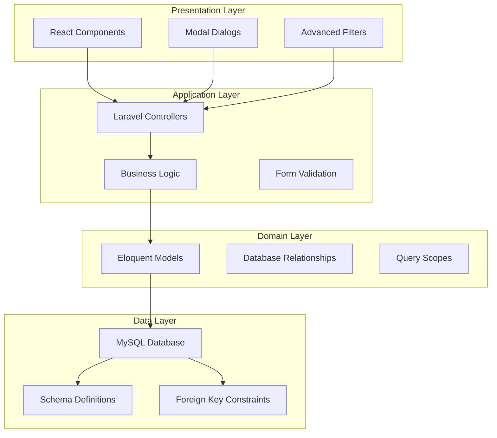
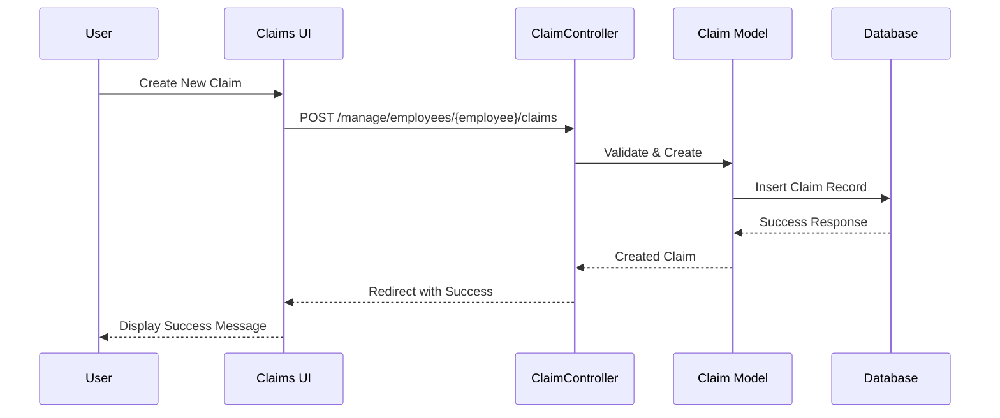
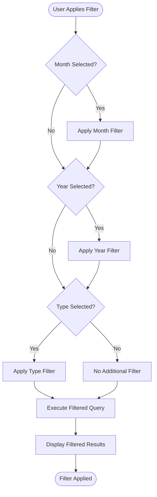
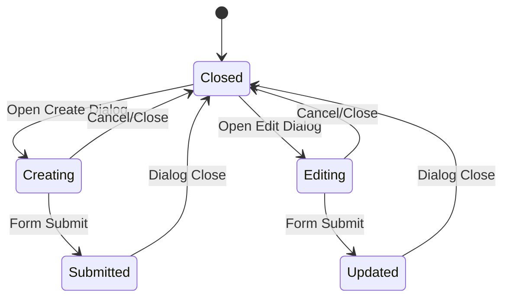
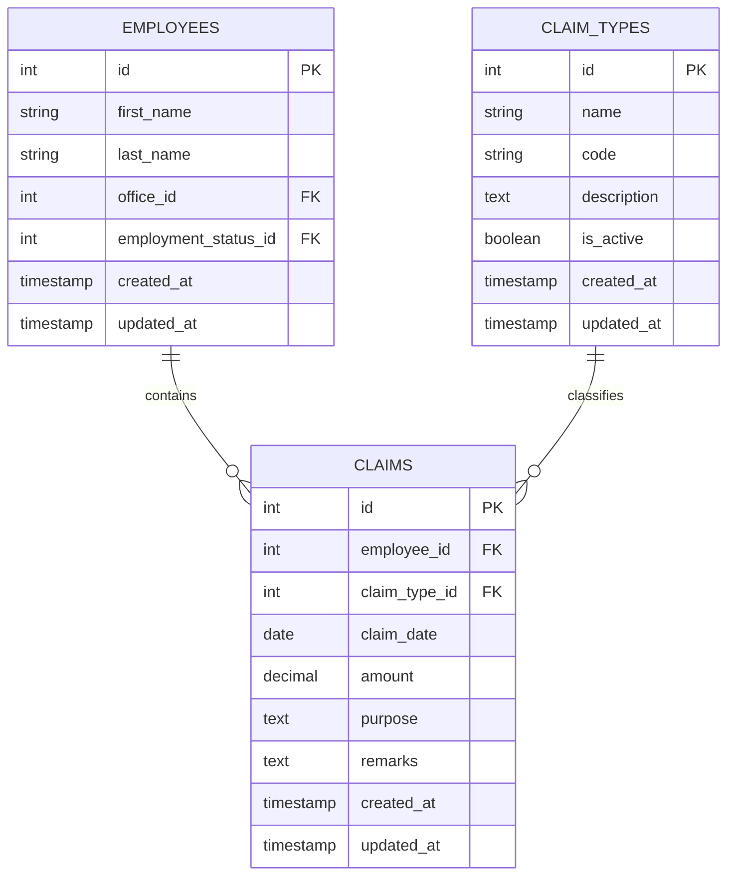

# Employee Claims Management

<cite>
**Referenced Files in This Document**
- [ClaimController.php](file://app/Http/Controllers/ClaimController.php)
- [ClaimTypeController.php](file://app/Http/Controllers/ClaimTypeController.php)
- [Claim.php](file://app/Models/Claim.php)
- [ClaimType.php](file://app/Models/ClaimType.php)
- [Employee.php](file://app/Models/Employee.php)
- [2026_03_23_053024_create_claims_table.php](file://database/migrations/2026_03_23_053024_create_claims_table.php)
- [2026_03_23_053019_create_claim_types_table.php](file://database/migrations/2026_03_23_053019_create_claim_types_table.php)
- [index.tsx](file://resources/js/pages/Employees/Manage/claims/index.tsx)
- [create.tsx](file://resources/js/pages/Employees/Manage/claims/create.tsx)
- [edit.tsx](file://resources/js/pages/Employees/Manage/claims/edit.tsx)
- [CustomComboBox.tsx](file://resources/js/components/CustomComboBox.tsx)
- [claim.ts](file://resources/js/types/claim.ts)
- [claimType.ts](file://resources/js/types/claimType.ts)
</cite>

## Update Summary
**Changes Made**
- Updated to reflect comprehensive claims management system with full CRUD operations
- Enhanced filtering system with sophisticated month/year/type filtering capabilities
- Implemented pagination with 20 items per page for efficient data handling
- Integrated modal dialogs for creation and editing with real-time validation
- Added comprehensive claims history tracking with detailed audit trail
- Improved user interface with enhanced filtering and dialog-based editing

## Table of Contents
1. [Introduction](#introduction)
2. [System Architecture](#system-architecture)
3. [Core Components](#core-components)
4. [Enhanced Claims Management Features](#enhanced-claims-management-features)
5. [CRUD Operations Implementation](#crud-operations-implementation)
6. [Advanced Filtering System](#advanced-filtering-system)
7. [Modal Dialog Interface](#modal-dialog-interface)
8. [Data Models and Relationships](#data-models-and-relationships)
9. [User Interface Components](#user-interface-components)
10. [Performance Optimization](#performance-optimization)
11. [Security and Validation](#security-and-validation)
12. [Troubleshooting Guide](#troubleshooting-guide)
13. [Conclusion](#conclusion)

## Introduction
The Employee Claims Management system represents a comprehensive solution for tracking and managing employee expense claims within an organization. This system provides full CRUD (Create, Read, Update, Delete) operations with sophisticated filtering capabilities, modal dialog interfaces, and detailed claims history tracking. Built with Laravel backend and React frontend, it offers an intuitive user experience with real-time validation and responsive data handling.

The system integrates seamlessly with the employee management module, providing dedicated claims management within each employee's profile. Users can efficiently record, track, and manage expense claims with advanced filtering options, pagination support, and comprehensive audit trails.

## System Architecture
The claims management system follows a modern layered architecture with clear separation of concerns:

**Diagram sources**
- [ClaimController.php:11-98](file://app/Http/Controllers/ClaimController.php#L11-L98)
- [Claim.php:8-35](file://app/Models/Claim.php#L8-L35)
- [ClaimType.php:8-27](file://app/Models/ClaimType.php#L8-L27)

The architecture ensures scalability, maintainability, and performance through:
- **Layered separation**: Clear boundaries between presentation, application, domain, and data layers
- **Modular design**: Independent components with well-defined interfaces
- **Database optimization**: Proper indexing and relationship management
- **Frontend responsiveness**: Real-time updates and smooth user interactions

## Core Components
The system consists of several interconnected components working together to provide comprehensive claims management functionality:

### Backend Controllers
- **ClaimController**: Manages all claims-related operations including listing, creating, updating, and deleting claims
- **ClaimTypeController**: Handles claim type management with validation and lifecycle control
- **Employee Integration**: Seamless integration with employee management system

### Data Models
- **Claim Model**: Represents individual claims with comprehensive attributes and relationships
- **ClaimType Model**: Manages claim categories with active status scoping
- **Employee Model**: Provides contextual relationships for claims within employee profiles

### Frontend Components
- **Claims UI**: Main interface for displaying and managing claims
- **Create Dialog**: Modal interface for adding new claims
- **Edit Dialog**: Modal interface for modifying existing claims
- **Filter System**: Advanced filtering with month, year, and type selectors

**Section sources**
- [ClaimController.php:13-96](file://app/Http/Controllers/ClaimController.php#L13-L96)
- [ClaimTypeController.php:11-57](file://app/Http/Controllers/ClaimTypeController.php#L11-L57)
- [Claim.php:12-34](file://app/Models/Claim.php#L12-L34)
- [ClaimType.php:12-26](file://app/Models/ClaimType.php#L12-L26)

## Enhanced Claims Management Features
The system provides comprehensive claims management capabilities with advanced features:

### Full CRUD Operations
Complete lifecycle management for claims:
- **Create**: New claim creation with validation and employee association
- **Read**: Comprehensive listing with filtering and pagination
- **Update**: Inline editing with real-time validation
- **Delete**: Secure deletion with confirmation and audit trail

### Sophisticated Filtering System
Advanced filtering capabilities:
- **Month Filtering**: Filter claims by specific calendar months
- **Year Filtering**: Filter claims by fiscal or calendar years
- **Type Filtering**: Filter claims by claim type categories
- **Combined Filters**: Multi-criteria filtering with real-time updates

### Pagination and Performance
- **Efficient Pagination**: 20 items per page with query string preservation
- **Lazy Loading**: Optimized data loading for large datasets
- **Performance Monitoring**: Built-in performance metrics and optimization

### Modal Dialog Interface
- **Create Dialog**: Intuitive form for adding new claims
- **Edit Dialog**: Comprehensive editing interface with validation
- **Real-time Validation**: Immediate feedback during form submission
- **Responsive Design**: Mobile-friendly dialog interfaces

**Section sources**
- [ClaimController.php:13-57](file://app/Http/Controllers/ClaimController.php#L13-L57)
- [index.tsx:46-108](file://resources/js/pages/Employees/Manage/claims/index.tsx#L46-L108)
- [create.tsx:19-37](file://resources/js/pages/Employees/Manage/claims/create.tsx#L19-L37)
- [edit.tsx:22-52](file://resources/js/pages/Employees/Manage/claims/edit.tsx#L22-L52)

## CRUD Operations Implementation
The system implements full CRUD operations with comprehensive validation and error handling:

### Create Operation
New claim creation process:
1. **Form Validation**: Client-side and server-side validation
2. **Employee Association**: Automatic linking to employee profile
3. **Data Persistence**: Secure storage with audit trail
4. **Success Feedback**: Confirmation messages and UI updates

### Read Operation
Comprehensive claims listing with:
- **Filtered Results**: Dynamic filtering based on criteria
- **Sorted Display**: Chronological ordering by claim date
- **Summary Information**: Key claim details with type indicators
- **Action Buttons**: Quick access to edit and delete operations

### Update Operation
Inline editing capabilities:
- **Modal Interface**: Non-disruptive editing experience
- **Real-time Validation**: Immediate feedback during changes
- **Partial Updates**: Selective field modifications
- **History Tracking**: Audit trail of all modifications

### Delete Operation
Secure deletion process:
- **Confirmation Dialog**: Prevents accidental deletions
- **Cascade Handling**: Proper relationship management
- **Audit Trail**: Complete deletion record
- **Success Notification**: Confirmation feedback

**Diagram sources**
- [ClaimController.php:59-74](file://app/Http/Controllers/ClaimController.php#L59-L74)
- [create.tsx:29-37](file://resources/js/pages/Employees/Manage/claims/create.tsx#L29-L37)

**Section sources**
- [ClaimController.php:59-96](file://app/Http/Controllers/ClaimController.php#L59-L96)
- [create.tsx:19-113](file://resources/js/pages/Employees/Manage/claims/create.tsx#L19-L113)
- [edit.tsx:22-128](file://resources/js/pages/Employees/Manage/claims/edit.tsx#L22-L128)

## Advanced Filtering System
The filtering system provides sophisticated search and discovery capabilities:

### Filter Categories
- **Month Filter**: Calendar month selection with Jan-Dec options
- **Year Filter**: Dynamic year selection based on available data
- **Type Filter**: Claim type categorization with active status filtering

### Implementation Details
- **Real-time Updates**: Filters applied immediately without page reload
- **Query String Preservation**: Maintains filter state across navigation
- **Clear Filters**: One-click reset functionality
- **Active Filter Detection**: Visual indicators for applied filters

### User Experience Features
- **Searchable Dropdowns**: Enhanced combobox components for better UX
- **Placeholder Guidance**: Helpful hints for filter selection
- **Responsive Design**: Mobile-friendly filter interface
- **Keyboard Navigation**: Full accessibility support

**Diagram sources**
- [ClaimController.php:15-35](file://app/Http/Controllers/ClaimController.php#L15-L35)
- [index.tsx:46-52](file://resources/js/pages/Employees/Manage/claims/index.tsx#L46-L52)

**Section sources**
- [ClaimController.php:13-57](file://app/Http/Controllers/ClaimController.php#L13-L57)
- [index.tsx:82-108](file://resources/js/pages/Employees/Manage/claims/index.tsx#L82-L108)

## Modal Dialog Interface
The modal dialog system provides seamless user interaction for claims management:

### Create Claim Dialog
- **Form Fields**: Claim type, date, amount, purpose, remarks
- **Validation**: Real-time field validation with error display
- **Default Values**: Intelligent defaults for quick entry
- **Submission**: Smooth form submission with loading states

### Edit Claim Dialog
- **Pre-filled Data**: Automatic population of existing claim details
- **Field Updates**: Individual field modification capabilities
- **History Preservation**: Complete audit trail maintenance
- **Confirmation Handling**: Success feedback and UI updates

### Dialog Features
- **Backdrop Click**: Dialog closes on outside click
- **Escape Key**: Keyboard-friendly dismissal
- **Focus Management**: Proper tab order and accessibility
- **Responsive Sizing**: Adaptive dialog dimensions

**Diagram sources**
- [create.tsx:39-113](file://resources/js/pages/Employees/Manage/claims/create.tsx#L39-L113)
- [edit.tsx:54-128](file://resources/js/pages/Employees/Manage/claims/edit.tsx#L54-L128)

**Section sources**
- [create.tsx:18-113](file://resources/js/pages/Employees/Manage/claims/create.tsx#L18-L113)
- [edit.tsx:21-128](file://resources/js/pages/Employees/Manage/claims/edit.tsx#L21-L128)

## Data Models and Relationships
The system utilizes well-designed data models with comprehensive relationships:

### Claim Model
Primary claim entity with:
- **Employee Association**: Many-to-one relationship with employees
- **Type Classification**: Many-to-one relationship with claim types
- **Data Casting**: Proper type casting for dates and currency
- **Timestamp Management**: Automatic created/updated timestamps

### ClaimType Model
Claim categorization system:
- **Active Status**: Scope filtering for active claim types only
- **Unique Code System**: Prevents duplicate claim type definitions
- **Hierarchical Organization**: Logical grouping of claim categories
- **Audit Trail**: Complete history of claim type modifications

### Database Constraints
- **Foreign Key Relationships**: Enforced referential integrity
- **Cascade Operations**: Proper deletion handling
- **Unique Constraints**: Prevents data duplication
- **Index Optimization**: Performance-focused database design

**Diagram sources**
- [Claim.php:26-34](file://app/Models/Claim.php#L26-L34)
- [ClaimType.php:18-26](file://app/Models/ClaimType.php#L18-L26)
- [2026_03_23_053024_create_claims_table.php:14-23](file://database/migrations/2026_03_23_053024_create_claims_table.php#L14-L23)

**Section sources**
- [Claim.php:12-34](file://app/Models/Claim.php#L12-L34)
- [ClaimType.php:12-26](file://app/Models/ClaimType.php#L12-L26)
- [2026_03_23_053024_create_claims_table.php:14-23](file://database/migrations/2026_03_23_053024_create_claims_table.php#L14-L23)

## User Interface Components
The frontend components provide an intuitive and responsive user experience:

### Claims Management Interface
- **Table Layout**: Clean, sortable claims display
- **Visual Indicators**: Color-coded claim types and status
- **Action Buttons**: Contextual editing and deletion controls
- **Responsive Design**: Mobile-optimized table layout

### Filter Components
- **CustomComboBox**: Enhanced dropdown with search functionality
- **Dynamic Options**: Real-time option generation based on data
- **State Management**: Persistent filter state across sessions
- **Accessibility Support**: Full keyboard navigation and screen reader support

### Form Components
- **Input Validation**: Real-time field validation with error messaging
- **Currency Formatting**: Automatic PHP currency formatting
- **Date Handling**: Localized date formatting and validation
- **Form State**: Comprehensive form state management

### Pagination System
- **Page Navigation**: Intuitive page switching interface
- **Item Count**: Clear indication of total records and current position
- **Responsive Links**: Adaptive pagination controls
- **Performance**: Efficient loading of paginated data

**Section sources**
- [index.tsx:31-179](file://resources/js/pages/Employees/Manage/claims/index.tsx#L31-L179)
- [CustomComboBox.tsx:14-59](file://resources/js/components/CustomComboBox.tsx#L14-L59)

## Performance Optimization
The system incorporates multiple performance optimization strategies:

### Database Optimization
- **Query Optimization**: Efficient filtered queries with proper indexing
- **Eager Loading**: Minimized N+1 query problems through relationship loading
- **Pagination Efficiency**: 20-item pages for optimal loading performance
- **Distinct Year Queries**: Optimized year extraction for filter dropdowns

### Frontend Performance
- **Component Memoization**: React.memo for expensive components
- **Virtual Scrolling**: Potential implementation for large datasets
- **Lazy Loading**: Dynamic component loading for improved initial load
- **State Optimization**: Efficient state management to prevent unnecessary re-renders

### Caching Strategies
- **Client-side Caching**: Browser caching for static resources
- **Server-side Caching**: Query result caching for frequently accessed data
- **Component Caching**: React component caching for complex UI elements
- **API Response Caching**: Strategic caching of external API responses

### Memory Management
- **Cleanup Functions**: Proper cleanup of event listeners and subscriptions
- **Resource Pooling**: Efficient resource allocation and deallocation
- **Garbage Collection**: Mindful memory usage patterns
- **Long-lived Connections**: Optimized connection management

## Security and Validation
The system implements comprehensive security measures and validation:

### Input Validation
- **Server-side Validation**: Laravel validation rules for all inputs
- **Client-side Validation**: Real-time form validation for better UX
- **Data Sanitization**: Proper escaping and sanitization of user inputs
- **Type Safety**: Strict typing in TypeScript implementations

### Authorization
- **Role-based Access Control**: Permission-based access to claims features
- **Employee Context**: Claims limited to authorized employee profiles
- **Audit Logging**: Complete audit trail of all access and modifications
- **Session Management**: Secure session handling and timeout management

### Data Protection
- **Encryption**: Sensitive data encryption where appropriate
- **HTTPS Enforcement**: Secure communication protocols
- **CSRF Protection**: Cross-site request forgery prevention
- **XSS Prevention**: Cross-site scripting attack mitigation

### Error Handling
- **Graceful Degradation**: User-friendly error messages and recovery options
- **Logging**: Comprehensive error logging for debugging and monitoring
- **Monitoring**: Real-time monitoring of system health and performance
- **Alerting**: Automated alerts for critical system issues

**Section sources**
- [ClaimController.php:61-84](file://app/Http/Controllers/ClaimController.php#L61-L84)
- [ClaimTypeController.php:22-41](file://app/Http/Controllers/ClaimTypeController.php#L22-L41)

## Troubleshooting Guide
Common issues and their solutions:

### Claims Management Issues
- **Filter Not Working**: Verify CustomComboBox implementation and onSelect handlers
- **Pagination Problems**: Check per_page configuration and query string handling
- **Dialog Not Opening**: Ensure proper state management and event handlers
- **Validation Errors**: Review form validation rules and error message display

### Database and Model Issues
- **Relationship Problems**: Verify foreign key constraints and relationship definitions
- **Data Type Issues**: Check model casting and database column types
- **Migration Failures**: Review migration scripts and database permissions
- **Performance Issues**: Analyze query performance and implement indexing

### Frontend Component Issues
- **Component Not Rendering**: Check component imports and dependency resolution
- **State Management Problems**: Verify React state updates and useEffect dependencies
- **Styling Issues**: Review CSS classes and component styling
- **Event Handler Problems**: Ensure proper event binding and handler functions

### Security and Validation Issues
- **Permission Denied**: Verify user roles and authorization checks
- **Data Integrity Issues**: Review validation rules and data sanitization
- **Session Problems**: Check session configuration and timeout settings
- **Error Logging**: Implement comprehensive error tracking and monitoring

**Section sources**
- [ClaimController.php:13-57](file://app/Http/Controllers/ClaimController.php#L13-L57)
- [index.tsx:168-176](file://resources/js/pages/Employees/Manage/claims/index.tsx#L168-L176)
- [edit.tsx:22-28](file://resources/js/pages/Employees/Manage/claims/edit.tsx#L22-L28)

## Conclusion
The Employee Claims Management system represents a comprehensive solution for modern organizations seeking efficient expense claim tracking and management. Through its integration of advanced filtering, modal dialog interfaces, and sophisticated data management, the system provides both functionality and user experience excellence.

Key strengths of the system include:
- **Full CRUD Operations**: Complete lifecycle management for claims
- **Sophisticated Filtering**: Advanced search and discovery capabilities
- **Modal Dialog Interface**: Seamless user interaction without page reloads
- **Comprehensive History Tracking**: Complete audit trail for all operations
- **Performance Optimization**: Efficient data handling and user experience
- **Security Implementation**: Robust validation and authorization mechanisms

The system's modular architecture ensures maintainability and scalability, while its responsive design provides excellent user experience across all device types. The integration with the broader employee management system creates a cohesive organizational management solution that streamlines administrative processes and improves operational efficiency.

Future enhancements could include advanced reporting capabilities, automated approval workflows, mobile application support, and integration with accounting systems for seamless financial processing.