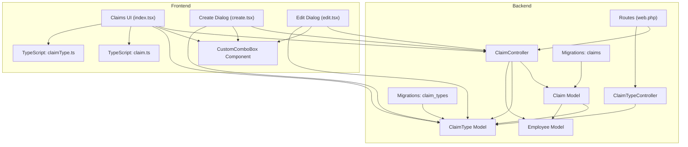
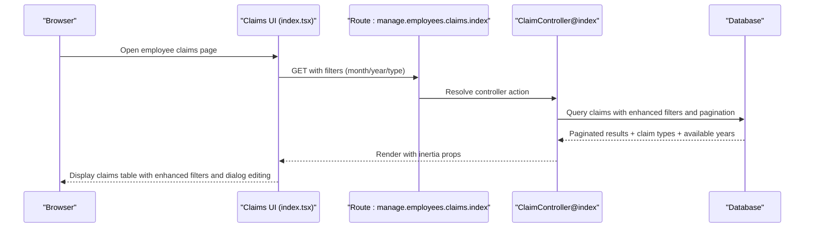
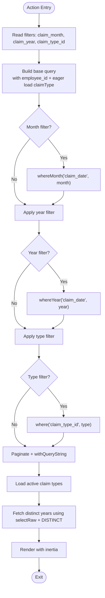
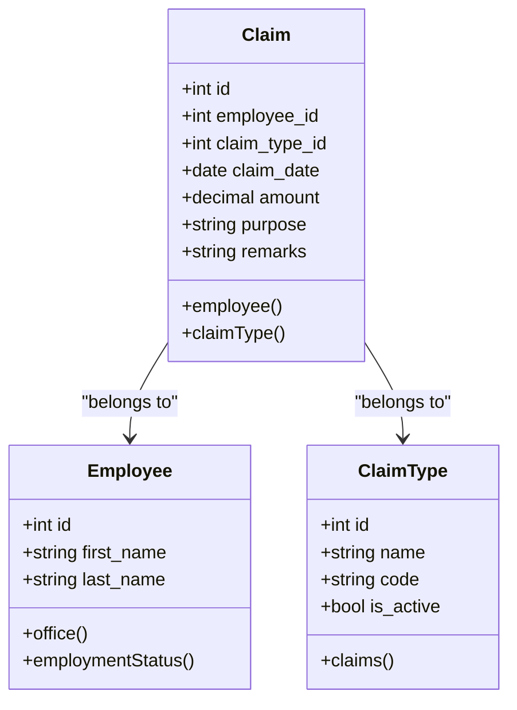
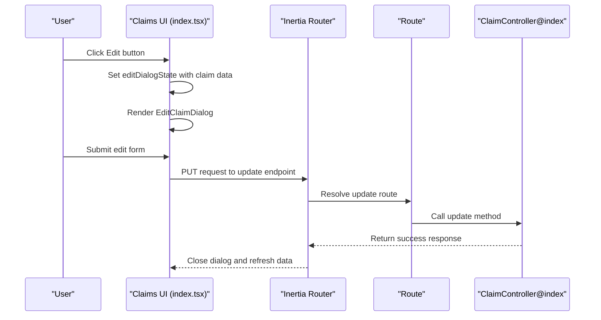
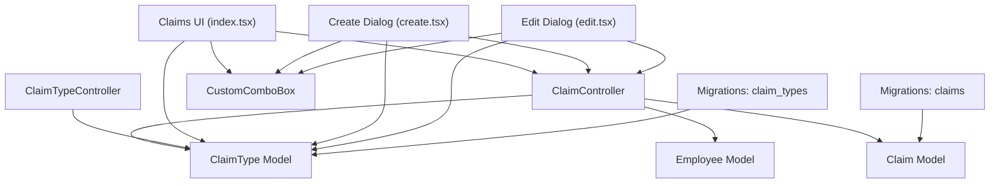

# Employee Claims Management

<cite>
**Referenced Files in This Document**
- [ClaimController.php](file://app/Http/Controllers/ClaimController.php)
- [ClaimTypeController.php](file://app/Http/Controllers/ClaimTypeController.php)
- [Claim.php](file://app/Models/Claim.php)
- [ClaimType.php](file://app/Models/ClaimType.php)
- [Employee.php](file://app/Models/Employee.php)
- [2026_03_23_053024_create_claims_table.php](file://database/migrations/2026_03_23_053024_create_claims_table.php)
- [2026_03_23_053019_create_claim_types_table.php](file://database/migrations/2026_03_23_053019_create_claim_types_table.php)
- [index.tsx](file://resources/js/pages/Employees/Manage/claims/index.tsx)
- [create.tsx](file://resources/js/pages/Employees/Manage/claims/create.tsx)
- [edit.tsx](file://resources/js/pages/Employees/Manage/claims/edit.tsx)
- [CustomComboBox.tsx](file://resources/js/components/CustomComboBox.tsx)
- [claim.ts](file://resources/js/types/claim.ts)
- [claimType.ts](file://resources/js/types/claimType.ts)
- [web.php](file://routes/web.php)
</cite>

## Update Summary
**Changes Made**
- Added documentation for the new EditClaimDialog component for inline editing
- Updated filter system documentation to reflect CustomComboBox replacement of Select-based filters
- Enhanced filtering capabilities documentation for months, years, and claim types
- Updated component architecture to include new dialog-based editing workflow

## Table of Contents
1. [Introduction](#introduction)
2. [Project Structure](#project-structure)
3. [Core Components](#core-components)
4. [Architecture Overview](#architecture-overview)
5. [Detailed Component Analysis](#detailed-component-analysis)
6. [Enhanced Claims Management Features](#enhanced-claims-management-features)
7. [Dependency Analysis](#dependency-analysis)
8. [Performance Considerations](#performance-considerations)
9. [Troubleshooting Guide](#troubleshooting-guide)
10. [Conclusion](#conclusion)

## Introduction
This document describes the Employee Claims Management system, which enables authorized users to record, track, and manage employee expense claims. The system provides enhanced filtering capabilities through CustomComboBox components, supports inline editing via EditClaimDialog, and maintains claim types for categorization. It integrates Laravel backend controllers and Eloquent models with an Inertia-based React frontend featuring modern UI components for a seamless user experience.

## Project Structure
The claims management feature spans backend controllers and models, database migrations, and frontend React components with TypeScript types. The system now includes enhanced dialog-based editing and improved filtering mechanisms.

**Diagram sources**
- [web.php:86-91](file://routes/web.php#L86-L91)
- [ClaimController.php:11-98](file://app/Http/Controllers/ClaimController.php#L11-L98)
- [ClaimTypeController.php:9-59](file://app/Http/Controllers/ClaimTypeController.php#L9-L59)
- [Claim.php:8-35](file://app/Models/Claim.php#L8-L35)
- [ClaimType.php:8-27](file://app/Models/ClaimType.php#L8-L27)
- [Employee.php:10-103](file://app/Models/Employee.php#L10-L103)
- [2026_03_23_053024_create_claims_table.php:14-23](file://database/migrations/2026_03_23_053024_create_claims_table.php#L14-L23)
- [2026_03_23_053019_create_claim_types_table.php:14-21](file://database/migrations/2026_03_23_053019_create_claim_types_table.php#L14-L21)
- [index.tsx:1-180](file://resources/js/pages/Employees/Manage/claims/index.tsx#L1-L180)
- [create.tsx:1-114](file://resources/js/pages/Employees/Manage/claims/create.tsx#L1-L114)
- [edit.tsx:1-129](file://resources/js/pages/Employees/Manage/claims/edit.tsx#L1-L129)
- [CustomComboBox.tsx:1-60](file://resources/js/components/CustomComboBox.tsx#L1-L60)
- [claim.ts:3-30](file://resources/js/types/claim.ts#L3-L30)
- [claimType.ts:1-9](file://resources/js/types/claimType.ts#L1-L9)

**Section sources**
- [web.php:1-129](file://routes/web.php#L1-L129)
- [ClaimController.php:1-98](file://app/Http/Controllers/ClaimController.php#L1-L98)
- [ClaimTypeController.php:1-59](file://app/Http/Controllers/ClaimTypeController.php#L1-L59)
- [Claim.php:1-36](file://app/Models/Claim.php#L1-L36)
- [ClaimType.php:1-28](file://app/Models/ClaimType.php#L1-L28)
- [Employee.php:1-104](file://app/Models/Employee.php#L1-L104)
- [2026_03_23_053024_create_claims_table.php:1-34](file://database/migrations/2026_03_23_053024_create_claims_table.php#L1-L34)
- [2026_03_23_053019_create_claim_types_table.php:1-32](file://database/migrations/2026_03_23_053019_create_claim_types_table.php#L1-L32)
- [index.tsx:1-180](file://resources/js/pages/Employees/Manage/claims/index.tsx#L1-L180)
- [create.tsx:1-114](file://resources/js/pages/Employees/Manage/claims/create.tsx#L1-L114)
- [edit.tsx:1-129](file://resources/js/pages/Employees/Manage/claims/edit.tsx#L1-L129)
- [CustomComboBox.tsx:1-60](file://resources/js/components/CustomComboBox.tsx#L1-L60)
- [claim.ts:1-31](file://resources/js/types/claim.ts#L1-L31)
- [claimType.ts:1-10](file://resources/js/types/claimType.ts#L1-L10)

## Core Components
- **ClaimController**: Handles listing, creating, updating, and deleting employee claims with enhanced filtering by month, year, and type using Laravel's whereMonth and whereYear methods.
- **ClaimTypeController**: Manages claim types with validation and prevents deletion when linked to existing claims.
- **Claim model**: Defines fillable attributes, casting for date and currency, and relationships to Employee and ClaimType.
- **ClaimType model**: Stores claim categories with active status scoping and relationship to claims.
- **Employee model**: Provides office and employment status relationships used in claim listings.
- **CustomComboBox Component**: Replaces traditional Select components with enhanced combobox functionality for better user experience in filtering and form inputs.
- **EditClaimDialog**: New dialog component enabling inline editing of claims directly from the main claims table.
- **CreateClaimDialog**: Dialog component for creating new claims with comprehensive form validation.
- **Frontend UI**: React components for listing claims, creating new claims, editing existing claims, and filtering via enhanced comboboxes.
- **Routes**: RESTful endpoints under the manage.employees.claims.* namespace.

Key responsibilities:
- Backend validation and persistence for claims and claim types.
- Frontend form handling, filtering, and pagination integration.
- Relationship enforcement via foreign keys and cascading behavior.
- Enhanced user experience through dialog-based editing and improved filtering.

**Section sources**
- [ClaimController.php:13-96](file://app/Http/Controllers/ClaimController.php#L13-L96)
- [ClaimTypeController.php:11-57](file://app/Http/Controllers/ClaimTypeController.php#L11-L57)
- [Claim.php:12-34](file://app/Models/Claim.php#L12-L34)
- [ClaimType.php:12-26](file://app/Models/ClaimType.php#L12-L26)
- [Employee.php:31-44](file://app/Models/Employee.php#L31-L44)
- [CustomComboBox.tsx:14-20](file://resources/js/components/CustomComboBox.tsx#L14-L20)
- [edit.tsx:13-19](file://resources/js/pages/Employees/Manage/claims/edit.tsx#L13-L19)
- [create.tsx:11-16](file://resources/js/pages/Employees/Manage/claims/create.tsx#L11-L16)
- [web.php:86-91](file://routes/web.php#L86-L91)

## Architecture Overview
The system follows a layered architecture with enhanced dialog-based editing:
- **Presentation Layer**: Inertia renders React components server-side with filtered data, including dialog-based editing interfaces.
- **Application Layer**: Controllers orchestrate requests, apply filters, and coordinate model interactions with enhanced filtering capabilities.
- **Domain Layer**: Eloquent models encapsulate business rules, casts, and relationships.
- **Data Access Layer**: Migrations define schema and constraints; controllers persist validated data.

**Diagram sources**
- [index.tsx:46-52](file://resources/js/pages/Employees/Manage/claims/index.tsx#L46-L52)
- [web.php:87](file://routes/web.php#L87)
- [ClaimController.php:13-57](file://app/Http/Controllers/ClaimController.php#L13-L57)

## Detailed Component Analysis

### ClaimController
Responsibilities:
- Filter claims by month, year, and claim type using Laravel's whereMonth and whereYear methods.
- Paginate results with query string preservation.
- Validate and persist new claims with employee association.
- Update and delete claims with appropriate feedback.
- Generate available years list for filter dropdowns.

Processing logic highlights:
- Dynamic query building with optional month/year/type filters using whereMonth and whereYear.
- Fetching distinct years for filter dropdown generation using selectRaw with DISTINCT.
- Using Inertia render to pass employee, claims, claim types, available years, and claim filters.

**Diagram sources**
- [ClaimController.php:13-57](file://app/Http/Controllers/ClaimController.php#L13-L57)

**Section sources**
- [ClaimController.php:13-57](file://app/Http/Controllers/ClaimController.php#L13-L57)
- [ClaimController.php:59-96](file://app/Http/Controllers/ClaimController.php#L59-L96)

### ClaimTypeController
Responsibilities:
- List claim types ordered by name.
- Validate and create claim types with unique codes.
- Update claim types with unique code validation excluding current record.
- Prevent deletion if associated claims exist.

**Diagram sources**
- [ClaimTypeController.php:20-46](file://app/Http/Controllers/ClaimTypeController.php#L20-L46)
- [ClaimTypeController.php:48-57](file://app/Http/Controllers/ClaimTypeController.php#L48-L57)

**Section sources**
- [ClaimTypeController.php:11-57](file://app/Http/Controllers/ClaimTypeController.php#L11-L57)

### Claim Model
Relationships and casts:
- Belongs to Employee and ClaimType.
- Casts claim_date to date and amount to decimal with 2 decimals.

**Diagram sources**
- [Claim.php:26-34](file://app/Models/Claim.php#L26-L34)
- [Employee.php:31-44](file://app/Models/Employee.php#L31-L44)
- [ClaimType.php:18-21](file://app/Models/ClaimType.php#L18-L21)

**Section sources**
- [Claim.php:12-34](file://app/Models/Claim.php#L12-L34)

### ClaimType Model
- Fillable fields include name, code, description, and is_active.
- Scope method active() filters only active claim types.

**Section sources**
- [ClaimType.php:12-26](file://app/Models/ClaimType.php#L12-L26)

### CustomComboBox Component
**Updated** Enhanced filtering experience with improved combobox functionality replacing traditional Select components.

Features:
- Generic combobox component supporting custom item structures.
- Placeholder support for better user guidance.
- Value binding and change event handling.
- Integration with existing Select-based filtering system.

Implementation highlights:
- Type-safe item structure with value and label properties.
- Default value handling for form initialization.
- Event-driven value change propagation.

**Section sources**
- [CustomComboBox.tsx:14-20](file://resources/js/components/CustomComboBox.tsx#L14-L20)
- [CustomComboBox.tsx:21-44](file://resources/js/components/CustomComboBox.tsx#L21-L44)

## Enhanced Claims Management Features

### EditClaimDialog Component
**New** Inline editing capability through dialog-based interface.

Key features:
- Modal dialog for editing claim details without page reload.
- Form validation integrated with Inertia's useForm hook.
- Real-time currency formatting and date handling.
- Seamless integration with existing claims table.

Dialog structure:
- Claim type selection via CustomComboBox
- Date picker for claim_date
- Number input with step="0.01" for precise amounts
- Textarea for purpose and remarks
- Form validation with error display
- Processing state management

**Section sources**
- [edit.tsx:13-19](file://resources/js/pages/Employees/Manage/claims/edit.tsx#L13-L19)
- [edit.tsx:21-52](file://resources/js/pages/Employees/Manage/claims/edit.tsx#L21-L52)
- [edit.tsx:54-127](file://resources/js/pages/Employees/Manage/claims/edit.tsx#L54-L127)

### Enhanced Filtering System
**Updated** Replacement of Select-based filters with CustomComboBox for improved user experience.

Filter components:
- **Month Filter**: CustomComboBox with predefined MONTHS array (Jan-Dec)
- **Year Filter**: CustomComboBox with availableYears list from database
- **Claim Type Filter**: CustomComboBox with claimTypes from active claim types
- **Clear Filters**: Button to reset all filters with preserveState and preserveScroll

Filter functionality:
- Real-time filtering via router.get with query string preservation
- Active filter detection for conditional UI elements
- Enhanced user experience with searchable comboboxes

**Section sources**
- [index.tsx:82-101](file://resources/js/pages/Employees/Manage/claims/index.tsx#L82-L101)
- [index.tsx:46-52](file://resources/js/pages/Employees/Manage/claims/index.tsx#L46-L52)
- [index.tsx:76](file://resources/js/pages/Employees/Manage/claims/index.tsx#L76)

### Frontend Claims UI
**Updated** Enhanced with dialog-based editing and improved filtering.

Components:
- **Filter Bar**: Three CustomComboBox filters with clear button
- **Claims Table**: Enhanced with inline edit and delete actions
- **Create Dialog**: Modal for adding new claims
- **Edit Dialog**: Modal for inline editing claims
- **Pagination**: Integrated pagination controls

User interactions:
- Clicking edit button opens EditClaimDialog with pre-filled data
- Filter changes trigger immediate route updates with preserveState
- Delete confirmation dialog before removing claims
- Real-time currency and date formatting

**Diagram sources**
- [index.tsx:54-60](file://resources/js/pages/Employees/Manage/claims/index.tsx#L54-L60)
- [edit.tsx:44-52](file://resources/js/pages/Employees/Manage/claims/edit.tsx#L44-L52)
- [web.php:89](file://routes/web.php#L89)
- [ClaimController.php:76-89](file://app/Http/Controllers/ClaimController.php#L76-L89)

**Section sources**
- [index.tsx:31-179](file://resources/js/pages/Employees/Manage/claims/index.tsx#L31-L179)
- [create.tsx:18-113](file://resources/js/pages/Employees/Manage/claims/create.tsx#L18-L113)
- [edit.tsx:21-128](file://resources/js/pages/Employees/Manage/claims/edit.tsx#L21-L128)
- [claim.ts:3-30](file://resources/js/types/claim.ts#L3-L30)
- [claimType.ts:1-9](file://resources/js/types/claimType.ts#L1-L9)

## Dependency Analysis
**Updated** Enhanced dependencies with new dialog components and CustomComboBox integration.

- Controllers depend on Eloquent models and Inertia for rendering.
- ClaimController depends on ClaimType for active claim types and Employee for context.
- Frontend components depend on TypeScript types, Inertia routing helpers, and CustomComboBox component.
- EditClaimDialog and CreateClaimDialog depend on CustomComboBox for form inputs.
- Database constraints enforce referential integrity between claims and claim_types, and cascade deletion from employees.

**Diagram sources**
- [ClaimController.php:5-8](file://app/Http/Controllers/ClaimController.php#L5-L8)
- [ClaimTypeController.php:5-6](file://app/Http/Controllers/ClaimTypeController.php#L5-L6)
- [Claim.php:26-34](file://app/Models/Claim.php#L26-L34)
- [ClaimType.php:18-21](file://app/Models/ClaimType.php#L18-L21)
- [Employee.php:31-44](file://app/Models/Employee.php#L31-L44)
- [index.tsx:1](file://resources/js/pages/Employees/Manage/claims/index.tsx#L1)
- [create.tsx:1](file://resources/js/pages/Employees/Manage/claims/create.tsx#L1)
- [edit.tsx:1](file://resources/js/pages/Employees/Manage/claims/edit.tsx#L1)
- [CustomComboBox.tsx:1](file://resources/js/components/CustomComboBox.tsx#L1)
- [2026_03_23_053024_create_claims_table.php:16-17](file://database/migrations/2026_03_23_053024_create_claims_table.php#L16-L17)
- [2026_03_23_053019_create_claim_types_table.php:17](file://database/migrations/2026_03_23_053019_create_claim_types_table.php#L17)

**Section sources**
- [ClaimController.php:5-8](file://app/Http/Controllers/ClaimController.php#L5-L8)
- [ClaimTypeController.php:5-6](file://app/Http/Controllers/ClaimTypeController.php#L5-L6)
- [2026_03_23_053024_create_claims_table.php:16-17](file://database/migrations/2026_03_23_053024_create_claims_table.php#L16-L17)
- [2026_03_23_053019_create_claim_types_table.php:17](file://database/migrations/2026_03_23_053019_create_claim_types_table.php#L17)

## Performance Considerations
**Updated** Enhanced performance with improved filtering and dialog-based editing.

- **Query optimization**: The controller builds a filtered query with optional month/year/type conditions using whereMonth and whereYear methods, and eager loads claimType to reduce N+1 queries.
- **Pagination**: Results are paginated with 20 items per page and query string preservation for efficient browsing.
- **Currency casting**: Amounts are cast to decimal with two decimal places to avoid precision errors.
- **Unique constraints**: ClaimType code uniqueness prevents redundant entries and supports efficient lookups.
- **Dialog-based editing**: Reduces page reloads and improves user experience for inline edits.
- **CustomComboBox optimization**: Efficient item rendering and filtering for better performance with large datasets.

## Troubleshooting Guide
**Updated** Enhanced troubleshooting for new dialog components and filtering system.

Common issues and resolutions:
- **Validation errors on claim creation/update**: Ensure claim_type_id exists, claim_date is a valid date, amount is numeric and non-negative, and purpose is provided.
- **Cannot delete claim type**: The system blocks deletion if claims exist for that type; remove or reassign dependent claims first.
- **Empty claims list**: Verify filters (claim_month, claim_year, claim_type_id) and that claims exist for the selected employee.
- **Incorrect amounts or dates**: Confirm currency formatting and date parsing in the UI; backend casts ensure proper types.
- **Edit dialog not opening**: Check that editDialogState is properly managed and claim data is passed correctly to EditClaimDialog.
- **Filter not working**: Verify CustomComboBox items are properly formatted with value/label pairs and onSelect handlers are correctly implemented.
- **Dialog form validation errors**: Ensure all required fields are properly bound and validation rules match backend requirements.

**Section sources**
- [ClaimController.php:61-67](file://app/Http/Controllers/ClaimController.php#L61-L67)
- [ClaimTypeController.php:36-41](file://app/Http/Controllers/ClaimTypeController.php#L36-L41)
- [ClaimTypeController.php:50-52](file://app/Http/Controllers/ClaimTypeController.php#L50-L52)
- [Claim.php:21-24](file://app/Models/Claim.php#L21-L24)
- [edit.tsx:22-28](file://resources/js/pages/Employees/Manage/claims/edit.tsx#L22-L28)
- [index.tsx:168-176](file://resources/js/pages/Employees/Manage/claims/index.tsx#L168-L176)

## Conclusion
The Employee Claims Management system provides a robust, filterable, and user-friendly solution for tracking employee claims. The enhanced system now features improved filtering through CustomComboBox components, inline editing via EditClaimDialog, and a more intuitive user interface. It leverages Laravel's ORM for data integrity, Inertia for responsive UI updates, and React components for intuitive interactions. The modular design with dialog-based editing ensures maintainability and scalability for future enhancements while providing a superior user experience.