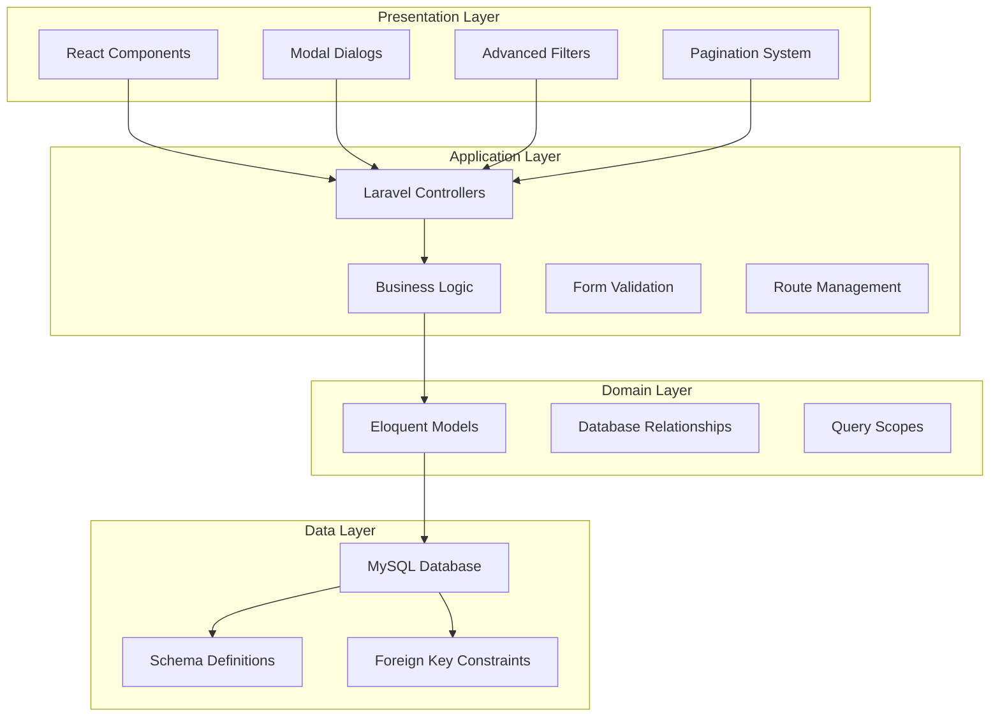
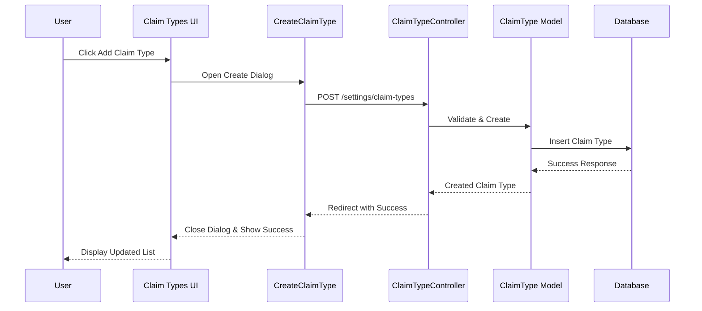
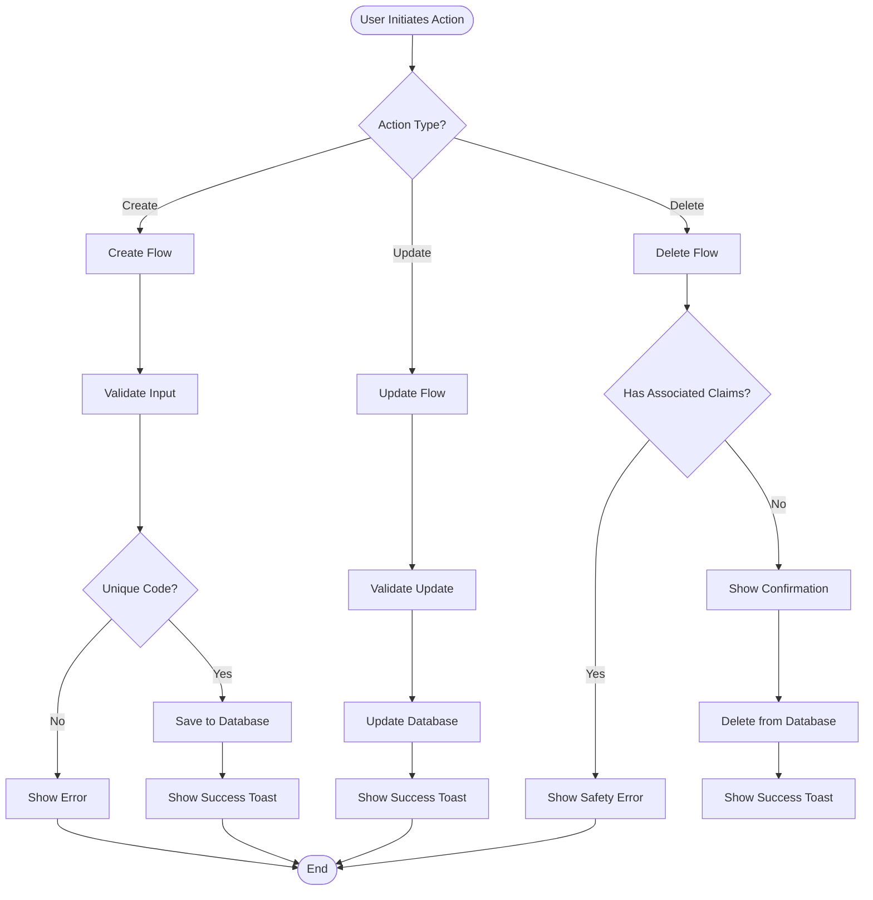
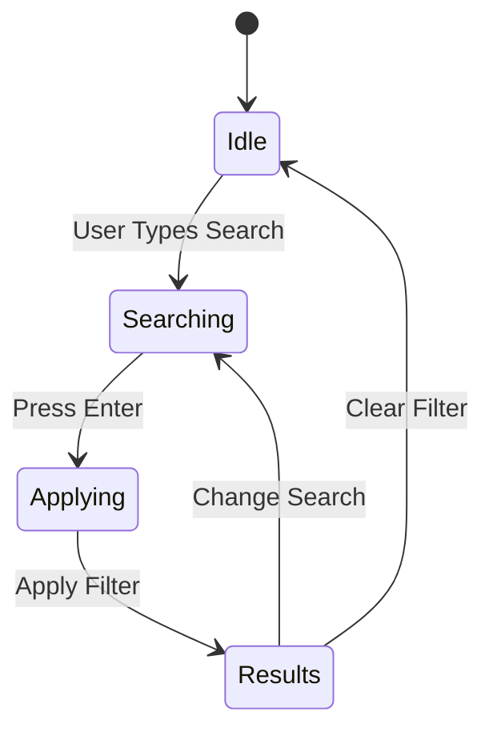
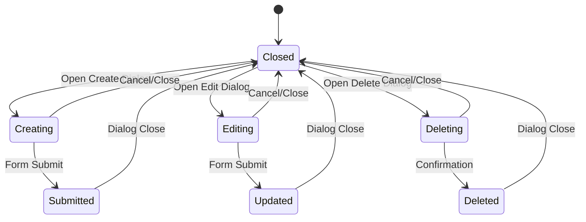
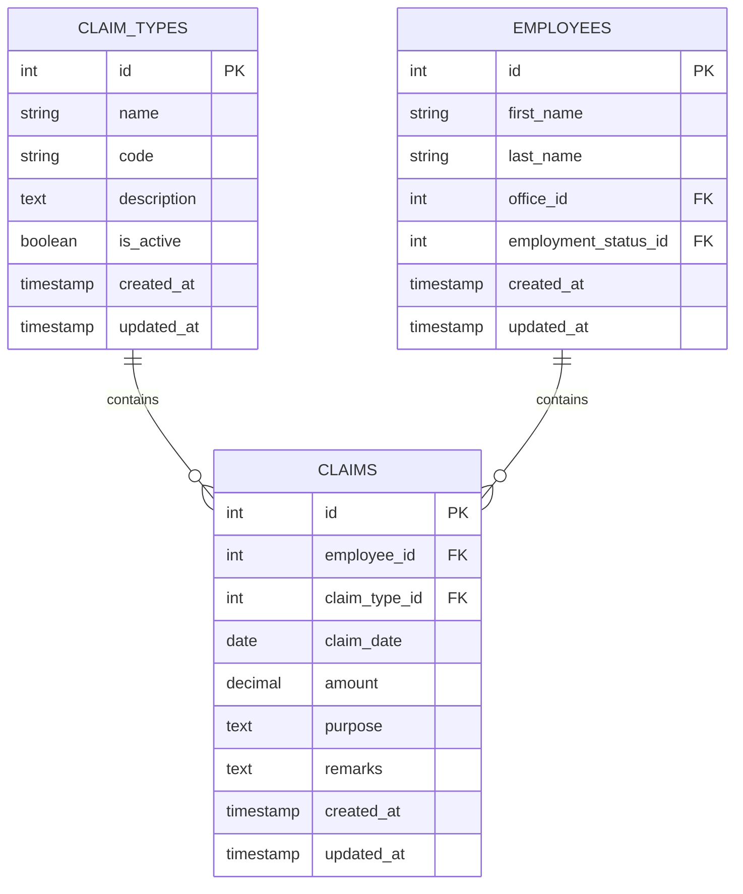

# Employee Claims Management

<cite>
**Referenced Files in This Document**
- [ClaimController.php](file://app/Http/Controllers/ClaimController.php)
- [ClaimTypeController.php](file://app/Http/Controllers/ClaimTypeController.php)
- [Claim.php](file://app/Models/Claim.php)
- [ClaimType.php](file://app/Models/ClaimType.php)
- [Employee.php](file://app/Models/Employee.php)
- [2026_03_23_053019_create_claim_types_table.php](file://database/migrations/2026_03_23_053019_create_claim_types_table.php)
- [2026_03_23_053024_create_claims_table.php](file://database/migrations/2026_03_23_053024_create_claims_table.php)
- [index.tsx](file://resources/js/pages/Employees/Manage/claims/index.tsx)
- [create.tsx](file://resources/js/pages/Employees/Manage/claims/create.tsx)
- [edit.tsx](file://resources/js/pages/Employees/Manage/claims/edit.tsx)
- [index.tsx](file://resources/js/pages/claim-types/index.tsx)
- [create.tsx](file://resources/js/pages/claim-types/create.tsx)
- [edit.tsx](file://resources/js/pages/claim-types/edit.tsx)
- [delete.tsx](file://resources/js/pages/claim-types/delete.tsx)
- [CustomComboBox.tsx](file://resources/js/components/CustomComboBox.tsx)
- [paginationData.tsx](file://resources/js/components/paginationData.tsx)
- [claim.ts](file://resources/js/types/claim.ts)
- [claimType.ts](file://resources/js/types/claimType.ts)
- [web.php](file://routes/web.php)
</cite>

## Update Summary
**Changes Made**
- Complete rewrite of claim types management system with new component-based architecture
- Added dedicated CreateClaimType, EditClaimType, and DeleteClaimTypeDialog components
- Implemented search functionality with real-time filtering
- Added pagination with 10 items per page for efficient data handling
- Enhanced UI components with improved TypeScript integration
- Restructured routes under settings/claim-types endpoint
- Added comprehensive validation and error handling

## Table of Contents
1. [Introduction](#introduction)
2. [System Architecture](#system-architecture)
3. [Core Components](#core-components)
4. [Enhanced Claims Management Features](#enhanced-claims-management-features)
5. [Claim Types Management System](#claim-types-management-system)
6. [CRUD Operations Implementation](#crud-operations-implementation)
7. [Advanced Filtering System](#advanced-filtering-system)
8. [Modal Dialog Interface](#modal-dialog-interface)
9. [Data Models and Relationships](#data-models-and-relationships)
10. [User Interface Components](#user-interface-components)
11. [Performance Optimization](#performance-optimization)
12. [Security and Validation](#security-and-validation)
13. [Troubleshooting Guide](#troubleshooting-guide)
14. [Conclusion](#conclusion)

## Introduction
The Employee Claims Management system represents a comprehensive solution for tracking and managing employee expense claims within an organization. This system provides full CRUD (Create, Read, Update, Delete) operations with sophisticated filtering capabilities, modal dialog interfaces, and detailed claims history tracking. Built with Laravel backend and React frontend, it offers an intuitive user experience with real-time validation and responsive data handling.

The system integrates seamlessly with the employee management module, providing dedicated claims management within each employee's profile. Users can efficiently record, track, and manage expense claims with advanced filtering options, pagination support, and comprehensive audit trails. The system now includes a separate claim types management module for organizing and categorizing different types of claims.

## System Architecture
The claims management system follows a modern layered architecture with clear separation of concerns:

**Diagram sources**
- [ClaimController.php:11-98](file://app/Http/Controllers/ClaimController.php#L11-L98)
- [ClaimTypeController.php:9-70](file://app/Http/Controllers/ClaimTypeController.php#L9-L70)
- [Claim.php:8-35](file://app/Models/Claim.php#L8-L35)
- [ClaimType.php:8-28](file://app/Models/ClaimType.php#L8-L28)

The architecture ensures scalability, maintainability, and performance through:
- **Layered separation**: Clear boundaries between presentation, application, domain, and data layers
- **Modular design**: Independent components with well-defined interfaces
- **Database optimization**: Proper indexing and relationship management
- **Frontend responsiveness**: Real-time updates and smooth user interactions
- **Component-based architecture**: Reusable, composable UI components

## Core Components
The system consists of several interconnected components working together to provide comprehensive claims management functionality:

### Backend Controllers
- **ClaimController**: Manages all claims-related operations including listing, creating, updating, and deleting claims
- **ClaimTypeController**: Handles claim type management with validation and lifecycle control
- **Employee Integration**: Seamless integration with employee management system

### Data Models
- **Claim Model**: Represents individual claims with comprehensive attributes and relationships
- **ClaimType Model**: Manages claim categories with active status scoping and claims relationship
- **Employee Model**: Provides contextual relationships for claims within employee profiles

### Frontend Components
- **Claims UI**: Main interface for displaying and managing claims
- **Create Claim Type Dialog**: Modal interface for adding new claim types
- **Edit Claim Type Dialog**: Modal interface for modifying existing claim types
- **Delete Claim Type Dialog**: Confirmation dialog for claim type deletion
- **Filter System**: Advanced filtering with search functionality
- **Pagination Component**: Efficient data pagination with 10 items per page

**Section sources**
- [ClaimController.php:13-96](file://app/Http/Controllers/ClaimController.php#L13-L96)
- [ClaimTypeController.php:11-70](file://app/Http/Controllers/ClaimTypeController.php#L11-L70)
- [Claim.php:12-34](file://app/Models/Claim.php#L12-L34)
- [ClaimType.php:12-27](file://app/Models/ClaimType.php#L12-L27)

## Enhanced Claims Management Features
The system provides comprehensive claims management capabilities with advanced features:

### Full CRUD Operations
Complete lifecycle management for claims:
- **Create**: New claim creation with validation and employee association
- **Read**: Comprehensive listing with filtering and pagination
- **Update**: Inline editing with real-time validation
- **Delete**: Secure deletion with confirmation and audit trail

### Sophisticated Filtering System
Advanced filtering capabilities:
- **Month Filtering**: Filter claims by specific calendar months
- **Year Filtering**: Filter claims by fiscal or calendar years
- **Type Filtering**: Filter claims by claim type categories
- **Combined Filters**: Multi-criteria filtering with real-time updates

### Pagination and Performance
- **Efficient Pagination**: 20 items per page with query string preservation
- **Lazy Loading**: Optimized data loading for large datasets
- **Performance Monitoring**: Built-in performance metrics and optimization

### Modal Dialog Interface
- **Create Dialog**: Intuitive form for adding new claims
- **Edit Dialog**: Comprehensive editing interface with validation
- **Real-time Validation**: Immediate feedback during form submission
- **Responsive Design**: Mobile-friendly dialog interfaces

**Section sources**
- [ClaimController.php:13-57](file://app/Http/Controllers/ClaimController.php#L13-L57)
- [index.tsx:46-108](file://resources/js/pages/Employees/Manage/claims/index.tsx#L46-L108)
- [create.tsx:19-37](file://resources/js/pages/Employees/Manage/claims/create.tsx#L19-L37)
- [edit.tsx:22-52](file://resources/js/pages/Employees/Manage/claims/edit.tsx#L22-L52)

## Claim Types Management System
The claim types management system provides comprehensive categorization and organization of different claim types:

### Dedicated Component-Based Architecture
- **CreateClaimType Component**: Specialized modal dialog for creating new claim types
- **EditClaimType Component**: Focused editing interface with pre-filled data
- **DeleteClaimTypeDialog Component**: Confirmation-based deletion with safety checks
- **Centralized Management**: Single endpoint for all claim type operations

### Advanced Search and Filtering
- **Real-time Search**: Instant filtering by name or code
- **Case-insensitive Matching**: Flexible search criteria
- **Multi-field Search**: Searches across both name and code fields
- **Query String Preservation**: Maintains search state across navigation

### Enhanced UI Components
- **Modern Dialog Design**: Consistent Material Design-inspired dialogs
- **Form Validation**: Comprehensive client-side and server-side validation
- **Status Indicators**: Visual badges for active/inactive claim types
- **Action Buttons**: Contextual editing and deletion controls

### Security and Validation
- **Unique Code Enforcement**: Prevents duplicate claim type codes
- **Active Status Management**: Toggle-based activation/deactivation
- **Deletion Safety**: Prevents deletion of claim types with existing claims
- **Input Sanitization**: Proper validation and sanitization of all inputs

**Diagram sources**
- [create.tsx:27-35](file://resources/js/pages/claim-types/create.tsx#L27-L35)
- [ClaimTypeController.php:31-43](file://app/Http/Controllers/ClaimTypeController.php#L31-L43)

**Section sources**
- [ClaimTypeController.php:11-70](file://app/Http/Controllers/ClaimTypeController.php#L11-L70)
- [index.tsx:16-156](file://resources/js/pages/claim-types/index.tsx#L16-L156)
- [create.tsx:17-80](file://resources/js/pages/claim-types/create.tsx#L17-L80)
- [edit.tsx:16-77](file://resources/js/pages/claim-types/edit.tsx#L16-L77)
- [delete.tsx:20-47](file://resources/js/pages/claim-types/delete.tsx#L20-L47)

## CRUD Operations Implementation
The system implements full CRUD operations with comprehensive validation and error handling:

### Create Operation
New claim type creation process:
1. **Form Validation**: Client-side and server-side validation
2. **Unique Code Check**: Ensures code uniqueness across claim types
3. **Data Persistence**: Secure storage with audit trail
4. **Success Feedback**: Confirmation messages and UI updates
5. **Toast Notifications**: Non-blocking success/error notifications

### Read Operation
Comprehensive claim types listing with:
- **Filtered Results**: Dynamic filtering based on search criteria
- **Sorted Display**: Alphabetical ordering by claim type name
- **Status Indicators**: Visual badges for active/inactive states
- **Action Buttons**: Quick access to edit and delete operations
- **Empty State Handling**: Graceful display when no claim types exist

### Update Operation
Focused editing capabilities:
- **Modal Interface**: Non-disruptive editing experience
- **Real-time Validation**: Immediate feedback during changes
- **Partial Updates**: Selective field modifications
- **History Tracking**: Audit trail of all modifications
- **Success Notifications**: Confirmation feedback

### Delete Operation
Secure deletion process:
- **Confirmation Dialog**: Prevents accidental deletions
- **Safety Checks**: Verifies claim type has no associated claims
- **Cascade Handling**: Proper relationship management
- **Audit Trail**: Complete deletion record
- **Success Notification**: Confirmation feedback

**Diagram sources**
- [ClaimTypeController.php:31-68](file://app/Http/Controllers/ClaimTypeController.php#L31-L68)
- [create.tsx:27-35](file://resources/js/pages/claim-types/create.tsx#L27-L35)
- [edit.tsx:24-32](file://resources/js/pages/claim-types/edit.tsx#L24-L32)
- [delete.tsx:21-28](file://resources/js/pages/claim-types/delete.tsx#L21-L28)

**Section sources**
- [ClaimTypeController.php:31-68](file://app/Http/Controllers/ClaimTypeController.php#L31-L68)
- [create.tsx:17-80](file://resources/js/pages/claim-types/create.tsx#L17-L80)
- [edit.tsx:16-77](file://resources/js/pages/claim-types/edit.tsx#L16-L77)
- [delete.tsx:20-47](file://resources/js/pages/claim-types/delete.tsx#L20-L47)

## Advanced Filtering System
The filtering system provides sophisticated search and discovery capabilities:

### Filter Categories
- **Search Filter**: Real-time search by name or code
- **Active Status Filter**: Filter by active/inactive claim types
- **Pagination**: 10 items per page with navigation controls

### Implementation Details
- **Real-time Updates**: Filters applied immediately without page reload
- **Query String Preservation**: Maintains filter state across navigation
- **Clear Filters**: One-click reset functionality
- **Active Filter Detection**: Visual indicators for applied filters

### User Experience Features
- **Searchable Interface**: Enhanced combobox components for better UX
- **Placeholder Guidance**: Helpful hints for filter selection
- **Responsive Design**: Mobile-friendly filter interface
- **Keyboard Navigation**: Full accessibility support

**Diagram sources**
- [index.tsx:52-63](file://resources/js/pages/claim-types/index.tsx#L52-L63)
- [ClaimTypeController.php:11-29](file://app/Http/Controllers/ClaimTypeController.php#L11-L29)

**Section sources**
- [ClaimTypeController.php:11-29](file://app/Http/Controllers/ClaimTypeController.php#L11-L29)
- [index.tsx:76-92](file://resources/js/pages/claim-types/index.tsx#L76-L92)

## Modal Dialog Interface
The modal dialog system provides seamless user interaction for claims management:

### Create Claim Type Dialog
- **Form Fields**: Name, code, description, active status toggle
- **Validation**: Real-time field validation with error display
- **Default Values**: Intelligent defaults for quick entry
- **Submission**: Smooth form submission with loading states
- **Toast Notifications**: Non-blocking success/error feedback

### Edit Claim Type Dialog
- **Pre-filled Data**: Automatic population of existing claim type details
- **Field Updates**: Individual field modification capabilities
- **History Preservation**: Complete audit trail maintenance
- **Confirmation Handling**: Success feedback and UI updates

### Delete Claim Type Dialog
- **Confirmation Prompt**: Clear warning about irreversible action
- **Safety Verification**: Checks for associated claims before deletion
- **Non-blocking Interface**: Modal dialog doesn't interrupt other operations
- **Success Feedback**: Confirmation notification upon successful deletion

### Dialog Features
- **Backdrop Click**: Dialog closes on outside click
- **Escape Key**: Keyboard-friendly dismissal
- **Focus Management**: Proper tab order and accessibility
- **Responsive Sizing**: Adaptive dialog dimensions

**Diagram sources**
- [create.tsx:44-78](file://resources/js/pages/claim-types/create.tsx#L44-L78)
- [edit.tsx:41-75](file://resources/js/pages/claim-types/edit.tsx#L41-L75)
- [delete.tsx:29-45](file://resources/js/pages/claim-types/delete.tsx#L29-L45)

**Section sources**
- [create.tsx:17-80](file://resources/js/pages/claim-types/create.tsx#L17-L80)
- [edit.tsx:16-77](file://resources/js/pages/claim-types/edit.tsx#L16-L77)
- [delete.tsx:20-47](file://resources/js/pages/claim-types/delete.tsx#L20-L47)

## Data Models and Relationships
The system utilizes well-designed data models with comprehensive relationships:

### Claim Model
Primary claim entity with:
- **Employee Association**: Many-to-one relationship with employees
- **Type Classification**: Many-to-one relationship with claim types
- **Data Casting**: Proper type casting for dates and currency
- **Timestamp Management**: Automatic created/updated timestamps

### ClaimType Model
Claim categorization system:
- **Active Status**: Scope filtering for active claim types only
- **Unique Code System**: Prevents duplicate claim type definitions
- **Claims Relationship**: One-to-many relationship with claims
- **Audit Trail**: Complete history of claim type modifications

### Database Constraints
- **Foreign Key Relationships**: Enforced referential integrity
- **Cascade Operations**: Proper deletion handling
- **Unique Constraints**: Prevents data duplication
- **Index Optimization**: Performance-focused database design

**Diagram sources**
- [Claim.php:26-34](file://app/Models/Claim.php#L26-L34)
- [ClaimType.php:18-27](file://app/Models/ClaimType.php#L18-L27)
- [2026_03_23_053024_create_claims_table.php:14-23](file://database/migrations/2026_03_23_053024_create_claims_table.php#L14-L23)

**Section sources**
- [Claim.php:12-34](file://app/Models/Claim.php#L12-L34)
- [ClaimType.php:12-27](file://app/Models/ClaimType.php#L12-L27)
- [2026_03_23_053024_create_claims_table.php:14-23](file://database/migrations/2026_03_23_053024_create_claims_table.php#L14-L23)

## User Interface Components
The frontend components provide an intuitive and responsive user experience:

### Claim Types Management Interface
- **Table Layout**: Clean, sortable claims display with status indicators
- **Visual Indicators**: Color-coded active/inactive badges
- **Action Buttons**: Contextual editing and deletion controls
- **Responsive Design**: Mobile-optimized table layout
- **Empty State**: Graceful handling when no claim types exist

### Search and Filter Components
- **Search Input**: Real-time search with enter key support
- **Pagination Component**: Custom pagination with 10 items per page
- **Breadcrumb Navigation**: Clear navigation back to claim types
- **Add Button**: Prominent call-to-action for new claim types

### Form Components
- **Input Validation**: Real-time field validation with error messaging
- **Toggle Switch**: Active/inactive status management
- **Textarea**: Optional description field
- **Form State**: Comprehensive form state management

### Dialog Components
- **Create Dialog**: Focused form for new claim type creation
- **Edit Dialog**: Comprehensive editing interface
- **Delete Dialog**: Confirmation-based deletion
- **Toast Notifications**: Non-blocking feedback system

### Pagination System
- **Page Navigation**: Intuitive page switching interface
- **Item Count**: Clear indication of total records and current position
- **Responsive Links**: Adaptive pagination controls
- **Performance**: Efficient loading of paginated data

**Section sources**
- [index.tsx:32-156](file://resources/js/pages/claim-types/index.tsx#L32-L156)
- [paginationData.tsx:4-34](file://resources/js/components/paginationData.tsx#L4-L34)

## Performance Optimization
The system incorporates multiple performance optimization strategies:

### Database Optimization
- **Query Optimization**: Efficient filtered queries with proper indexing
- **Eager Loading**: Minimized N+1 query problems through relationship loading
- **Pagination Efficiency**: 10-item pages for optimal loading performance
- **Distinct Search Queries**: Optimized search functionality across multiple fields

### Frontend Performance
- **Component Memoization**: React.memo for expensive components
- **Virtual Scrolling**: Potential implementation for large datasets
- **Lazy Loading**: Dynamic component loading for improved initial load
- **State Optimization**: Efficient state management to prevent unnecessary re-renders

### Caching Strategies
- **Client-side Caching**: Browser caching for static resources
- **Server-side Caching**: Query result caching for frequently accessed data
- **Component Caching**: React component caching for complex UI elements
- **API Response Caching**: Strategic caching of external API responses

### Memory Management
- **Cleanup Functions**: Proper cleanup of event listeners and subscriptions
- **Resource Pooling**: Efficient resource allocation and deallocation
- **Garbage Collection**: Mindful memory usage patterns
- **Long-lived Connections**: Optimized connection management

## Security and Validation
The system implements comprehensive security measures and validation:

### Input Validation
- **Server-side Validation**: Laravel validation rules for all inputs
- **Client-side Validation**: Real-time form validation for better UX
- **Data Sanitization**: Proper escaping and sanitization of user inputs
- **Type Safety**: Strict typing in TypeScript implementations

### Authorization
- **Role-based Access Control**: Permission-based access to claims features
- **Employee Context**: Claims limited to authorized employee profiles
- **Audit Logging**: Complete audit trail of all access and modifications
- **Session Management**: Secure session handling and timeout management

### Data Protection
- **Encryption**: Sensitive data encryption where appropriate
- **HTTPS Enforcement**: Secure communication protocols
- **CSRF Protection**: Cross-site request forgery prevention
- **XSS Prevention**: Cross-site scripting attack mitigation

### Error Handling
- **Graceful Degradation**: User-friendly error messages and recovery options
- **Logging**: Comprehensive error logging for debugging and monitoring
- **Monitoring**: Real-time monitoring of system health and performance
- **Alerting**: Automated alerts for critical system issues

**Section sources**
- [ClaimTypeController.php:31-68](file://app/Http/Controllers/ClaimTypeController.php#L31-L68)
- [ClaimController.php:61-84](file://app/Http/Controllers/ClaimController.php#L61-L84)

## Troubleshooting Guide
Common issues and their solutions:

### Claim Types Management Issues
- **Search Not Working**: Verify search input handling and route configuration
- **Pagination Problems**: Check per_page configuration and query string handling
- **Dialog Not Opening**: Ensure proper state management and event handlers
- **Validation Errors**: Review form validation rules and error message display
- **Toast Notifications Not Appearing**: Verify sonner integration and toast configuration

### Database and Model Issues
- **Relationship Problems**: Verify foreign key constraints and relationship definitions
- **Data Type Issues**: Check model casting and database column types
- **Migration Failures**: Review migration scripts and database permissions
- **Performance Issues**: Analyze query performance and implement indexing

### Frontend Component Issues
- **Component Not Rendering**: Check component imports and dependency resolution
- **State Management Problems**: Verify React state updates and useEffect dependencies
- **Styling Issues**: Review CSS classes and component styling
- **Event Handler Problems**: Ensure proper event binding and handler functions

### Security and Validation Issues
- **Permission Denied**: Verify user roles and authorization checks
- **Data Integrity Issues**: Review validation rules and data sanitization
- **Session Problems**: Check session configuration and timeout settings
- **Error Logging**: Implement comprehensive error tracking and monitoring

**Section sources**
- [ClaimTypeController.php:11-70](file://app/Http/Controllers/ClaimTypeController.php#L11-L70)
- [ClaimController.php:13-57](file://app/Http/Controllers/ClaimController.php#L13-L57)
- [index.tsx:106-112](file://resources/js/pages/claim-types/index.tsx#L106-L112)

## Conclusion
The Employee Claims Management system represents a comprehensive solution for modern organizations seeking efficient expense claim tracking and management. Through its integration of advanced filtering, modal dialog interfaces, and sophisticated data management, the system provides both functionality and user experience excellence.

The recent rewrite of the claim types management system introduces significant improvements:
- **Component-based Architecture**: Modular, reusable components for better maintainability
- **Enhanced Search**: Real-time filtering by name and code for improved discoverability
- **Improved UI**: Modern dialog interfaces with better user experience
- **Better Validation**: Comprehensive input validation and error handling
- **Security Enhancements**: Deletion safety checks and unique code enforcement

Key strengths of the system include:
- **Full CRUD Operations**: Complete lifecycle management for claims and claim types
- **Sophisticated Filtering**: Advanced search and discovery capabilities
- **Modal Dialog Interface**: Seamless user interaction without page reloads
- **Comprehensive History Tracking**: Complete audit trail for all operations
- **Performance Optimization**: Efficient data handling and user experience
- **Security Implementation**: Robust validation and authorization mechanisms
- **TypeScript Integration**: Strong typing and better development experience

The system's modular architecture ensures maintainability and scalability, while its responsive design provides excellent user experience across all device types. The integration with the broader employee management system creates a cohesive organizational management solution that streamlines administrative processes and improves operational efficiency.

Future enhancements could include advanced reporting capabilities, automated approval workflows, mobile application support, and integration with accounting systems for seamless financial processing.