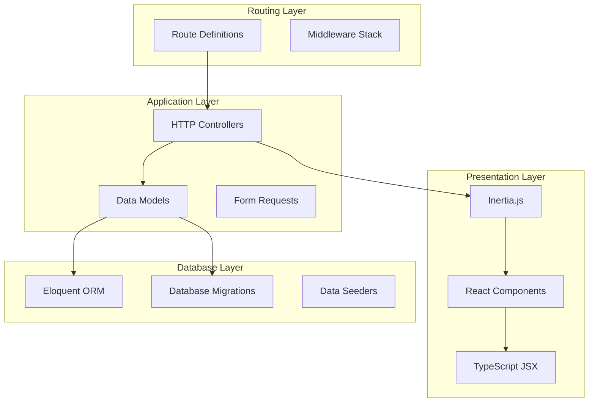
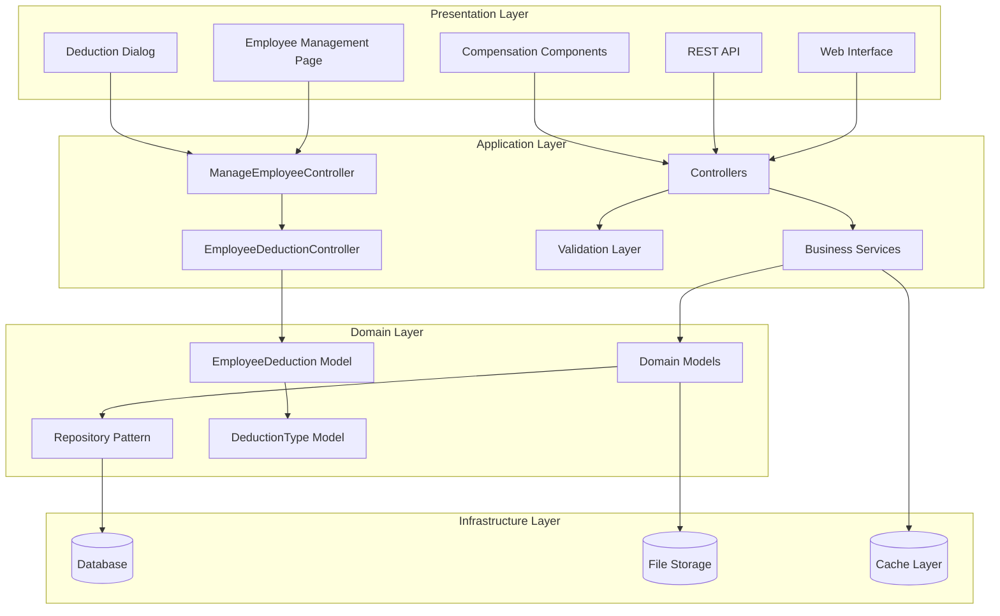
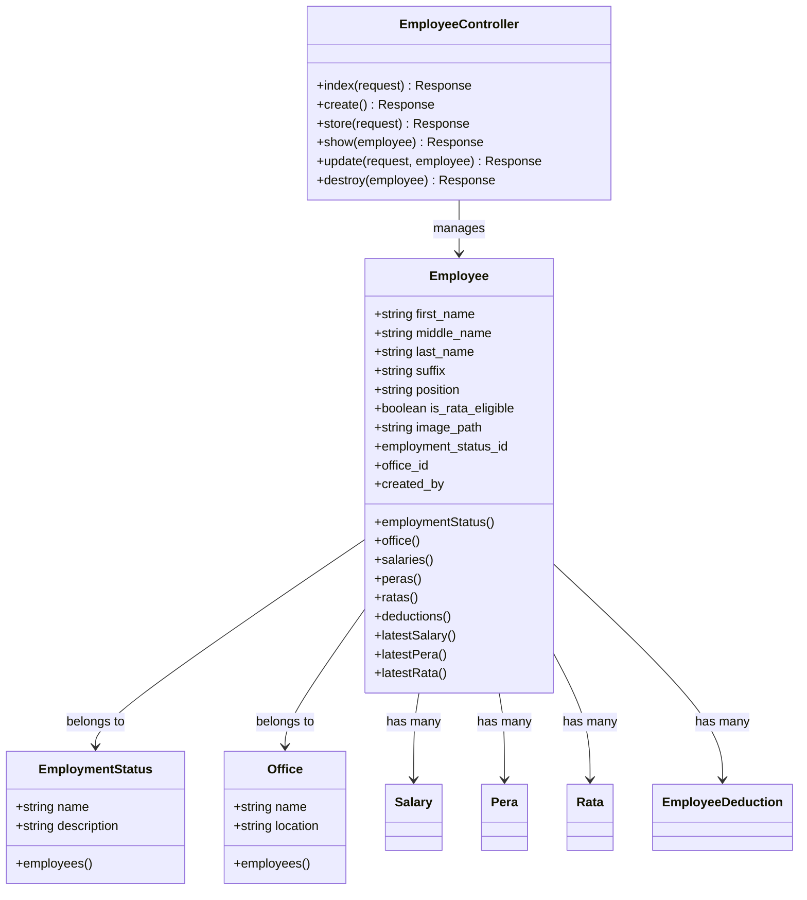
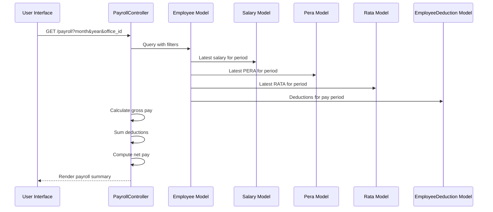
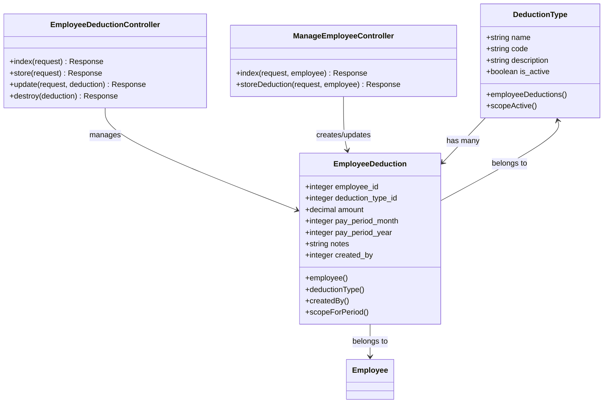
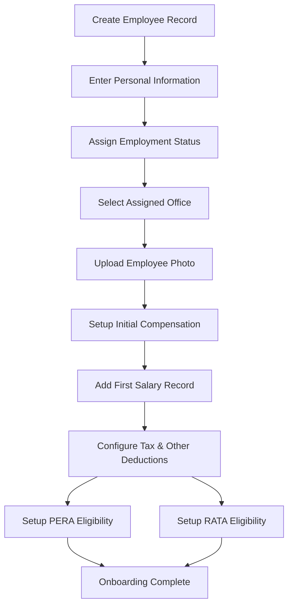
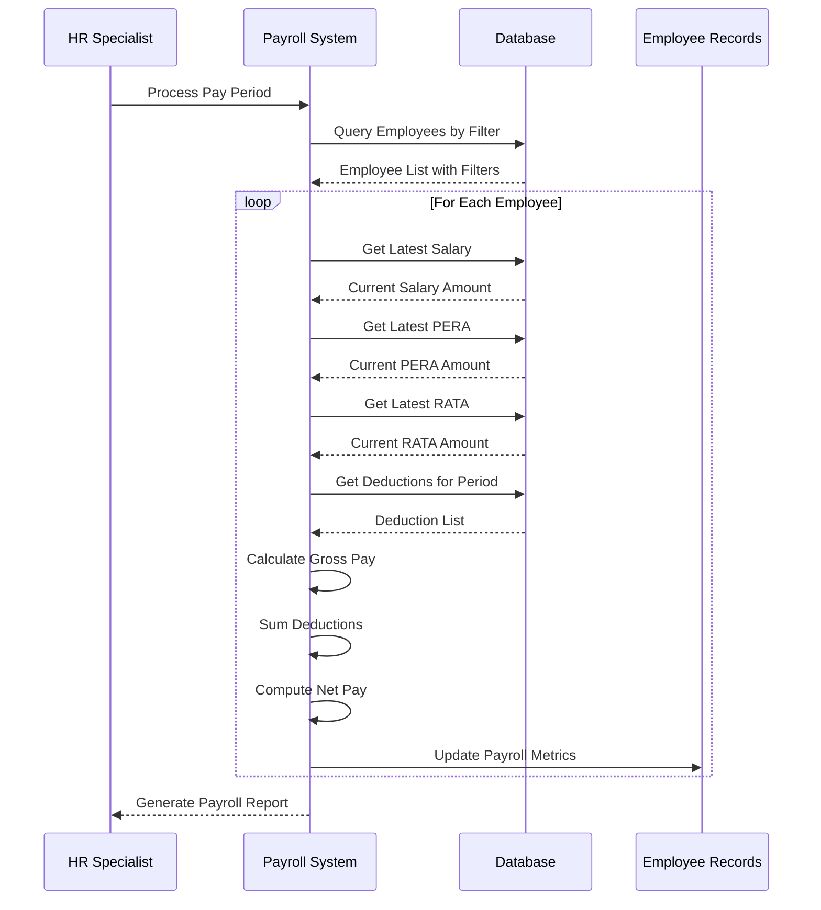
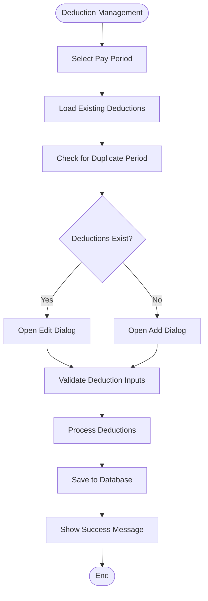

# Employee Compensation Management

<cite>
**Referenced Files in This Document**
- [EmployeeController.php](file://app/Http/Controllers/EmployeeController.php)
- [PayrollController.php](file://app/Http/Controllers/PayrollController.php)
- [SalaryController.php](file://app/Http/Controllers/SalaryController.php)
- [PeraController.php](file://app/Http/Controllers/PeraController.php)
- [RataController.php](file://app/Http/Controllers/RataController.php)
- [EmployeeDeductionController.php](file://app/Http/Controllers/EmployeeDeductionController.php)
- [ManageEmployeeController.php](file://app/Http/Controllers/ManageEmployeeController.php)
- [Employee.php](file://app/Models/Employee.php)
- [Salary.php](file://app/Models/Salary.php)
- [Pera.php](file://app/Models/Pera.php)
- [Rata.php](file://app/Models/Rata.php)
- [EmployeeDeduction.php](file://app/Models/EmployeeDeduction.php)
- [DeductionType.php](file://app/Models/DeductionType.php)
- [web.php](file://routes/web.php)
- [deductions.tsx](file://resources/js/pages/Employees/Manage/compensation/deductions.tsx)
- [pera.tsx](file://resources/js/pages/Employees/Manage/compensation/pera.tsx)
- [rata.tsx](file://resources/js/pages/Employees/Manage/compensation/rata.tsx)
- [salary.tsx](file://resources/js/pages/Employees/Manage/compensation/salary.tsx)
- [salaryDialog.tsx](file://resources/js/pages/Employees/Manage/compensation/salaryDialog.tsx)
- [Manage.tsx](file://resources/js/pages/Employees/Manage/Manage.tsx)
- [employee.d.ts](file://resources/js/types/employee.d.ts)
- [employeeDeduction.d.ts](file://resources/js/types/employeeDeduction.d.ts)
</cite>

## Update Summary
**Changes Made**
- Added comprehensive deduction management system with new deductions.tsx component
- Enhanced PERA and RATA components with full CRUD functionality
- Integrated salary management improvements with enhanced UI components
- Added new salaryDialog.tsx component for period-based deduction management
- Updated backend controllers to support comprehensive CRUD operations
- Enhanced ManageEmployeeController with deduction creation/update functionality

## Table of Contents
1. [Introduction](#introduction)
2. [Project Structure](#project-structure)
3. [Core Components](#core-components)
4. [Architecture Overview](#architecture-overview)
5. [Detailed Component Analysis](#detailed-component-analysis)
6. [Compensation Management Workflows](#compensation-management-workflows)
7. [Data Models and Relationships](#data-models-and-relationships)
8. [User Interface Components](#user-interface-components)
9. [Performance Considerations](#performance-considerations)
10. [Troubleshooting Guide](#troubleshooting-guide)
11. [Conclusion](#conclusion)

## Introduction

The Employee Compensation Management system is a comprehensive payroll and compensation tracking solution built with Laravel and Inertia.js. This system manages employee compensation through three primary components: Basic Salary, PERA (Employees' Profit Sharing), and RATA (Retirement Allowance), along with a comprehensive deduction management system. The platform provides robust functionality for employee management, compensation tracking, payroll processing, and deduction management with full CRUD operations.

The system follows modern web development practices with a clean separation of concerns, utilizing Eloquent ORM for database operations, Inertia.js for seamless single-page application experiences, and comprehensive validation for data integrity. It supports multiple offices, employment statuses, and provides detailed compensation histories for each employee with enhanced deduction management capabilities.

## Project Structure

The application follows a modular Laravel architecture with clear separation between controllers, models, routes, and frontend components:



**Diagram sources**
- [web.php:1-110](file://routes/web.php#L1-L110)
- [EmployeeController.php:1-139](file://app/Http/Controllers/EmployeeController.php#L1-L139)

The project is organized into several key areas:

- **Controllers**: Handle HTTP requests and coordinate between models and views
- **Models**: Define database relationships and business logic
- **Routes**: Define URL patterns and controller mappings
- **Resources**: Frontend components and TypeScript definitions
- **Database**: Migrations and seeders for data structure initialization

**Section sources**
- [web.php:1-110](file://routes/web.php#L1-L110)

## Core Components

The system consists of seven primary controllers that handle different aspects of compensation management, with enhanced CRUD functionality:

### Employee Management Controller
Manages employee records, including CRUD operations, photo uploads, and basic employee information maintenance.

### Payroll Processing Controller  
Handles comprehensive payroll calculations, including gross pay computation, deduction processing, and net pay determination.

### Salary Management Controller
Controls salary records, effective dates, amount changes, and compensation history tracking with full CRUD operations.

### PERA Management Controller
Manages profit-sharing contributions with effective date tracking, historical records, and full CRUD functionality.

### RATA Management Controller
Handles retirement allowance calculations with eligibility filtering, historical tracking, and full CRUD operations.

### Employee Deduction Controller
Processes various deduction types applied to employee paychecks during specific pay periods with comprehensive CRUD operations.

### Manage Employee Controller
Provides comprehensive employee management interface with deduction creation and update functionality through period-based forms.

Each controller implements standardized CRUD operations with proper validation, authorization, and response handling through the Inertia.js framework, with enhanced deduction management capabilities.

**Section sources**
- [EmployeeController.php:12-139](file://app/Http/Controllers/EmployeeController.php#L12-L139)
- [PayrollController.php:11-125](file://app/Http/Controllers/PayrollController.php#L11-L125)
- [SalaryController.php:11-74](file://app/Http/Controllers/SalaryController.php#L11-L74)
- [PeraController.php:11-74](file://app/Http/Controllers/PeraController.php#L11-L74)
- [RataController.php:11-75](file://app/Http/Controllers/RataController.php#L11-L75)
- [EmployeeDeductionController.php:12-119](file://app/Http/Controllers/EmployeeDeductionController.php#L12-L119)
- [ManageEmployeeController.php:14-86](file://app/Http/Controllers/ManageEmployeeController.php#L14-L86)

## Architecture Overview

The system employs a layered architecture with clear separation between presentation, business logic, and data access layers, enhanced with comprehensive deduction management:



**Diagram sources**
- [EmployeeController.php:1-139](file://app/Http/Controllers/EmployeeController.php#L1-L139)
- [PayrollController.php:1-125](file://app/Http/Controllers/PayrollController.php#L1-L125)
- [ManageEmployeeController.php:1-86](file://app/Http/Controllers/ManageEmployeeController.php#L1-L86)
- [EmployeeDeductionController.php:1-119](file://app/Http/Controllers/EmployeeDeductionController.php#L1-L119)

The architecture emphasizes:
- **Separation of Concerns**: Clear boundaries between presentation, business logic, and data access
- **Dependency Injection**: Controllers receive dependencies through constructor injection
- **Event-Driven Design**: Models utilize Eloquent events for automatic auditing
- **Caching Strategy**: Efficient data retrieval through eager loading and caching
- **Security**: Comprehensive validation and authorization middleware
- **Enhanced Deduction Management**: Dedicated components for comprehensive deduction handling

## Detailed Component Analysis

### Employee Management System

The Employee Management component serves as the foundation for all compensation activities, providing comprehensive employee lifecycle management with enhanced deduction integration.



**Diagram sources**
- [Employee.php:10-104](file://app/Models/Employee.php#L10-L104)
- [EmployeeController.php:12-139](file://app/Http/Controllers/EmployeeController.php#L12-L139)

Key features include:
- **Photo Management**: Secure file upload and storage with validation
- **Search Functionality**: Multi-field search across employee names and identifiers
- **Relationship Management**: Automatic population of related employment status and office data
- **Soft Deletion**: Non-destructive removal with restore capability
- **Enhanced Deduction Integration**: Comprehensive deduction tracking with period-based grouping

**Section sources**
- [EmployeeController.php:14-139](file://app/Http/Controllers/EmployeeController.php#L14-L139)
- [Employee.php:31-104](file://app/Models/Employee.php#L31-L104)

### Payroll Processing Engine

The Payroll Processing component calculates employee compensation for specific pay periods, aggregating salary, PERA, and RATA components while applying comprehensive deductions.



**Diagram sources**
- [PayrollController.php:13-125](file://app/Http/Controllers/PayrollController.php#L13-L125)

The payroll calculation process involves:
- **Gross Pay Calculation**: Sum of current salary, PERA, and RATA amounts
- **Deduction Aggregation**: Total of all applicable deductions for the pay period
- **Net Pay Determination**: Gross pay minus total deductions
- **Historical Tracking**: Complete audit trail of all compensation changes
- **Enhanced Deduction Processing**: Comprehensive deduction management with period-specific application

**Section sources**
- [PayrollController.php:13-125](file://app/Http/Controllers/PayrollController.php#L13-L125)

### Compensation Management System

The compensation management system has been significantly enhanced with comprehensive CRUD functionality for all compensation types and dedicated deduction management capabilities.


**Diagram sources**
- [SalaryController.php:49-74](file://app/Http/Controllers/SalaryController.php#L49-L74)
- [PeraController.php:49-74](file://app/Http/Controllers/PeraController.php#L49-L74)
- [RataController.php:50-75](file://app/Http/Controllers/RataController.php#L50-L75)

The system ensures:
- **Audit Trail**: Every change is tracked with who made it and when
- **Effective Dating**: Proper chronological ordering of compensation changes
- **Data Integrity**: Validation prevents invalid or conflicting records
- **Full CRUD Operations**: Complete create, read, update, and delete functionality for all compensation types
- **Enhanced Deduction Management**: Comprehensive deduction tracking with period-based grouping and editing capabilities

**Section sources**
- [SalaryController.php:36-74](file://app/Http/Controllers/SalaryController.php#L36-L74)
- [PeraController.php:36-74](file://app/Http/Controllers/PeraController.php#L36-L74)
- [RataController.php:37-75](file://app/Http/Controllers/RataController.php#L37-L75)

### Comprehensive Deduction Management System

The deduction management system has been completely redesigned with a comprehensive front-end component and enhanced backend processing capabilities.



**Diagram sources**
- [EmployeeDeduction.php:8-59](file://app/Models/EmployeeDeduction.php#L8-L59)
- [DeductionType.php:7-33](file://app/Models/DeductionType.php#L7-L33)
- [EmployeeDeductionController.php:12-119](file://app/Http/Controllers/EmployeeDeductionController.php#L12-L119)
- [ManageEmployeeController.php:52-84](file://app/Http/Controllers/ManageEmployeeController.php#L52-L84)

The comprehensive deduction management system includes:
- **Period-Based Deduction Groups**: Deductions grouped by pay period (month-year) for better organization
- **Deduction Dialog Interface**: Interactive dialog for adding and editing deductions with real-time validation
- **Duplicate Prevention**: Automatic detection and prevention of duplicate deductions for the same employee and period
- **Flexible Amount Entry**: Support for nullable deduction amounts with conditional processing
- **Enhanced UI Components**: Professional interfaces for deduction management with currency formatting and period selection

**Section sources**
- [EmployeeDeductionController.php:14-119](file://app/Http/Controllers/EmployeeDeductionController.php#L14-L119)
- [EmployeeDeduction.php:26-59](file://app/Models/EmployeeDeduction.php#L26-L59)
- [DeductionType.php:20-33](file://app/Models/DeductionType.php#L20-L33)
- [deductions.tsx:25-143](file://resources/js/pages/Employees/Manage/compensation/deductions.tsx#L25-L143)
- [salaryDialog.tsx:42-197](file://resources/js/pages/Employees/Manage/compensation/salaryDialog.tsx#L42-L197)

## Compensation Management Workflows

### Employee Onboarding Workflow

The employee onboarding process integrates multiple systems to establish a complete compensation profile with comprehensive deduction management:



### Pay Period Processing Workflow

The monthly payroll processing follows a systematic approach to ensure accurate compensation calculation with comprehensive deduction management:



**Diagram sources**
- [PayrollController.php:13-81](file://app/Http/Controllers/PayrollController.php#L13-L81)

### Comprehensive Compensation Change Management

The system maintains comprehensive audit trails for all compensation modifications with enhanced deduction management:


### Enhanced Deduction Management Workflow

The comprehensive deduction management system provides streamlined workflows for deduction creation, editing, and period-based organization:



**Diagram sources**
- [ManageEmployeeController.php:52-84](file://app/Http/Controllers/ManageEmployeeController.php#L52-L84)
- [salaryDialog.tsx:80-98](file://resources/js/pages/Employees/Manage/compensation/salaryDialog.tsx#L80-L98)

## Data Models and Relationships

The system utilizes a comprehensive entity relationship model that supports complex compensation scenarios with enhanced deduction management:

```mermaid
erDiagram
EMPLOYEES {
integer id PK
string first_name
string middle_name
string last_name
string suffix
string position
boolean is_rata_eligible
string image_path
integer employment_status_id FK
integer office_id FK
integer created_by FK
timestamp created_at
timestamp updated_at
timestamp deleted_at
}
EMPLOYMENT_STATUSES {
integer id PK
string name
string description
timestamp created_at
timestamp updated_at
}
OFFICES {
integer id PK
string name
string location
timestamp created_at
timestamp updated_at
}
SALARIES {
integer id PK
integer employee_id FK
decimal amount
date effective_date
date end_date
integer created_by FK
timestamp created_at
timestamp updated_at
timestamp deleted_at
}
PERAS {
integer id PK
integer employee_id FK
decimal amount
date effective_date
integer created_by FK
timestamp created_at
timestamp updated_at
timestamp deleted_at
}
RATAS {
integer id PK
integer employee_id FK
decimal amount
date effective_date
integer created_by FK
timestamp created_at
timestamp updated_at
timestamp deleted_at
}
DEDUCTION_TYPES {
integer id PK
string name
string code
string description
boolean is_active
timestamp created_at
timestamp updated_at
}
EMPLOYEE_DEDUCTIONS {
integer id PK
integer employee_id FK
integer deduction_type_id FK
decimal amount
integer pay_period_month
integer pay_period_year
string notes
integer created_by FK
timestamp created_at
timestamp updated_at
}
USERS {
integer id PK
string name
string email
timestamp email_verified_at
string password
remember_token
timestamp created_at
timestamp updated_at
}
EMPLOYEES ||--|| EMPLOYMENT_STATUSES : "belongs to"
EMPLOYEES ||--|| OFFICES : "belongs to"
EMPLOYEES ||--o{ SALARIES : "has many"
EMPLOYEES ||--o{ PERAS : "has many"
EMPLOYEES ||--o{ RATAS : "has many"
EMPLOYEES ||--o{ EMPLOYEE_DEDUCTIONS : "has many"
DEDUCTION_TYPES ||--o{ EMPLOYEE_DEDUCTIONS : "has many"
EMPLOYEES ||--o{ EMPLOYEE_DEDUCTIONS : "has many"
USERS ||--o{ EMPLOYEES : "created"
USERS ||--o{ SALARIES : "created"
USERS ||--o{ PERAS : "created"
USERS ||--o{ RATAS : "created"
USERS ||--o{ EMPLOYEE_DEDUCTIONS : "created"
```

**Diagram sources**
- [Employee.php:14-104](file://app/Models/Employee.php#L14-L104)
- [Salary.php:12-36](file://app/Models/Salary.php#L12-L36)
- [Pera.php:10-41](file://app/Models/Pera.php#L10-L41)
- [Rata.php:10-41](file://app/Models/Rata.php#L10-L41)
- [EmployeeDeduction.php:10-59](file://app/Models/EmployeeDeduction.php#L10-L59)
- [DeductionType.php:9-33](file://app/Models/DeductionType.php#L9-L33)

### Data Validation and Constraints

The system implements comprehensive data validation at multiple levels with enhanced deduction management:

- **Model Level Validation**: Type casting and attribute casting for financial data
- **Database Constraints**: Foreign key relationships and check constraints
- **Application Level Validation**: Form validation with custom rules
- **Business Rule Validation**: Eligibility checks, conflict resolution, and duplicate prevention
- **Deduction Validation**: Period-based validation and amount processing rules

**Section sources**
- [Employee.php:27-29](file://app/Models/Employee.php#L27-L29)
- [Salary.php:20-24](file://app/Models/Salary.php#L20-L24)
- [EmployeeDeduction.php:20-24](file://app/Models/EmployeeDeduction.php#L20-L24)

## User Interface Components

The frontend components provide intuitive interfaces for managing employee compensation with comprehensive deduction management:

### Enhanced Employee Management Interface
- **Employee Listing**: Searchable grid with sorting and filtering capabilities
- **Employee Creation**: Multi-step form with validation feedback
- **Employee Editing**: Comprehensive profile management with photo upload
- **Employee Details**: Historical compensation view with timeline visualization
- **Enhanced Compensation Tabs**: Dedicated tabs for salary, PERA, RATA, and deductions management

### Comprehensive Payroll Interface
- **Payroll Dashboard**: Summary view with gross pay, deductions, and net pay metrics
- **Payroll Detail View**: Individual employee payroll breakdown
- **Filter Controls**: Month/year selection and office filtering
- **Export Capabilities**: Payroll report generation and export

### Enhanced Compensation Management Interfaces
- **Salary Management**: Historical salary tracking with effective date management and full CRUD operations
- **PERA Management**: Profit-sharing contribution tracking and history with full CRUD operations
- **RATA Management**: Retirement allowance calculation and history with full CRUD operations
- **Deduction Management**: Comprehensive deduction type configuration and assignment with period-based organization
- **Deduction Dialog**: Interactive dialog for adding and editing deductions with real-time validation

### Advanced Deduction Management Components
- **Deduction Groups**: Period-based grouping of deductions for better organization
- **Edit Functionality**: Full CRUD operations for existing deduction periods
- **Duplicate Prevention**: Automatic detection and prevention of duplicate entries
- **Real-time Validation**: Form validation with immediate feedback
- **Professional UI**: Currency formatting and professional styling

### Responsive Design Features
- **Mobile Optimization**: Touch-friendly interfaces for mobile devices
- **Accessibility**: Screen reader support and keyboard navigation
- **Performance**: Lazy loading and efficient data fetching
- **Real-time Updates**: Live updates for new compensation records
- **Enhanced User Experience**: Streamlined workflows for deduction management

## Performance Considerations

The system implements several performance optimization strategies with enhanced deduction management:

### Database Optimization
- **Eager Loading**: Strategic use of with() to prevent N+1 query problems
- **Indexing Strategy**: Proper indexing on frequently queried columns
- **Pagination**: Efficient pagination for large datasets
- **Query Optimization**: Optimized queries with appropriate joins and filters
- **Deduction Query Optimization**: Efficient querying of period-specific deductions

### Caching Strategy
- **Model Caching**: Frequently accessed lookup data cached in memory
- **Page Caching**: Payroll summaries cached for improved response times
- **Query Result Caching**: Expensive query results cached for configurable periods
- **Deduction Type Caching**: Active deduction types cached for quick access

### Frontend Performance
- **Component Lazy Loading**: Dynamic imports for route-based code splitting
- **Image Optimization**: Efficient image handling and lazy loading
- **State Management**: Efficient state updates with minimal re-renders
- **Bundle Optimization**: Tree shaking and dead code elimination
- **Deduction State Management**: Optimized state handling for period-based deduction groups

### Scalability Considerations
- **Horizontal Scaling**: Stateless controllers support load balancing
- **Database Scaling**: Optimized queries support database replication
- **Caching Layer**: Redis or similar caching for distributed environments
- **Background Processing**: Queue-based processing for heavy computations
- **Deduction Batch Processing**: Efficient batch processing for multiple deduction updates

## Troubleshooting Guide

### Common Issues and Solutions

**Employee Photo Upload Failures**
- Verify file size limits (2MB max) and supported formats (JPG, PNG, WEBP)
- Check storage permissions for the employees directory
- Ensure proper MIME type validation is configured

**Enhanced Payroll Calculation Errors**
- Verify that salary, PERA, and RATA records have proper effective dates
- Check for overlapping compensation records
- Ensure deduction types are properly configured and active
- Validate period-based deduction conflicts

**Performance Issues**
- Monitor database query performance and optimize slow queries
- Implement proper indexing on frequently filtered columns
- Consider database connection pooling for high-traffic scenarios
- Optimize deduction query performance for large datasets

**Data Integrity Problems**
- Verify foreign key constraints are properly enforced
- Check for orphaned records in compensation history
- Ensure proper cleanup of soft-deleted records
- Validate deduction period uniqueness constraints

**Deduction Management Issues**
- Verify deduction type configurations are active
- Check for duplicate period entries
- Ensure proper validation of deduction amounts
- Validate pay period month/year ranges

### Debugging Tools and Techniques

**Database Query Logging**
- Enable query logging during development to identify performance bottlenecks
- Monitor slow query execution times
- Analyze query plans for optimization opportunities
- Track deduction-related query performance

**Application Monitoring**
- Implement structured logging for error tracking
- Monitor application performance metrics
- Set up alerts for unusual activity patterns
- Track deduction processing performance

**Data Validation**
- Implement comprehensive input validation at multiple layers
- Use database constraints to prevent invalid data
- Regular data quality audits to identify inconsistencies
- Validate deduction type and period combinations

**Section sources**
- [EmployeeController.php:69-83](file://app/Http/Controllers/EmployeeController.php#L69-L83)
- [PayrollController.php:48-67](file://app/Http/Controllers/PayrollController.php#L48-L67)

## Conclusion

The Employee Compensation Management system provides a robust, scalable solution for managing employee compensation across multiple pay components with comprehensive deduction management capabilities. The system's enhanced architecture supports future growth while maintaining performance and reliability.

Key strengths of the system include:

- **Comprehensive Coverage**: Handles all major compensation components (salary, PERA, RATA) with full CRUD operations
- **Advanced Deduction Management**: Complete deduction tracking with period-based organization and editing capabilities
- **Audit Trail**: Complete tracking of all compensation changes with enhanced deduction management
- **Flexible Payroll Processing**: Configurable deduction types and period-based calculations
- **Enhanced User Interface**: Intuitive management interfaces with responsive design and professional styling
- **Performance Optimization**: Efficient data handling, caching strategies, and optimized deduction processing
- **Security**: Comprehensive validation and authorization controls with enhanced deduction security
- **Streamlined Workflows**: Professional interfaces for deduction management with real-time validation

The system is well-positioned for enterprise deployment with proper monitoring, backup procedures, and disaster recovery planning. Future enhancements could include advanced reporting capabilities, integration with external payroll systems, enhanced analytics features, and expanded deduction type management capabilities.